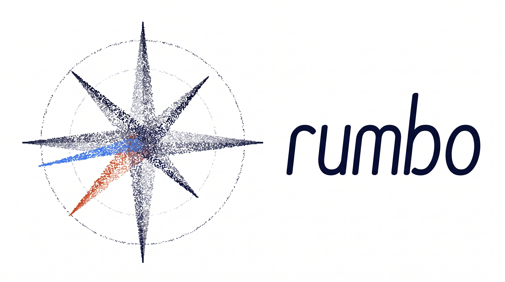
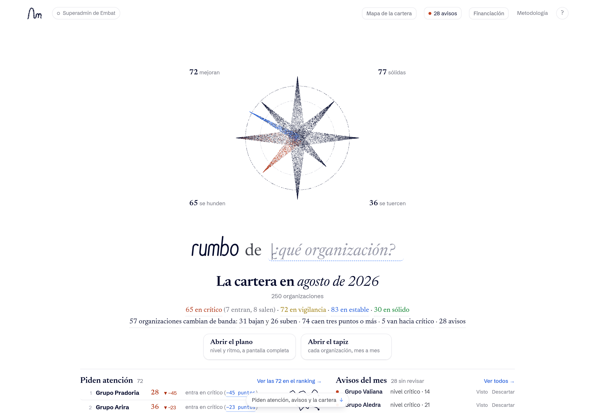
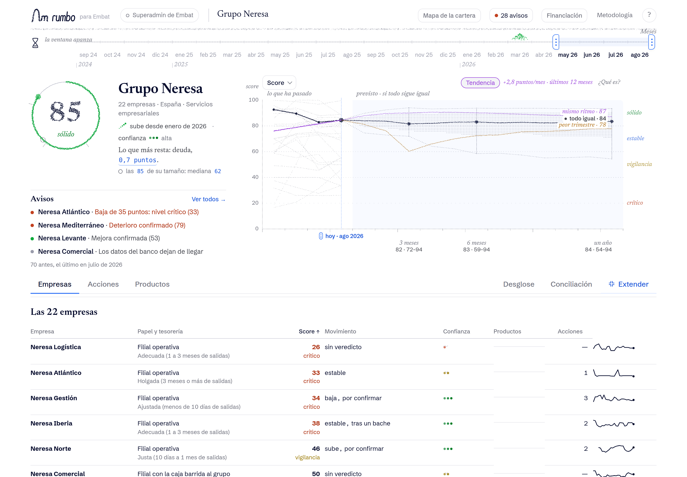
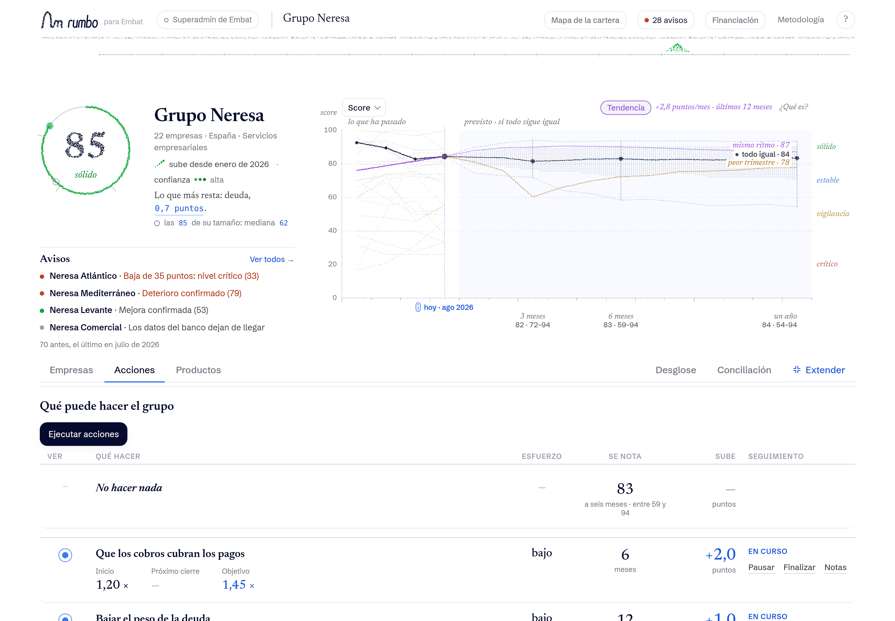

<p align="center">
  
</p>

<p align="center">
  <strong>Rumbo te dice cómo andar</strong><br>
  Cada día lee las operaciones y las facturas de tu grupo y les da un valor
</p>

<p align="center">
  <a href="https://rumbo.datons.com/"><strong>Explorar Rumbo en producción →</strong></a>
  ·
  <a href="#ejecución-local">Ver la ejecución local</a>
</p>

---

## Rumbo en 30 segundos

1. **Score explicable** de salud financiera
2. **Trayectoria** que distingue una foto puntual de un cambio sostenido
3. **Horizonte** que se recalcula según los pasos que des
4. **Avisos y acciones** priorizados, con su efecto recalculado
5. **Productos** que encajan con la salud real de las empresas
6. **Ronda de financiación** controlada por el CFO cuando todavía está a tiempo de elegir

No inventa datos. Mide cinco pilares observables (liquidez, pagos, cobros, actividad y deuda), los convierte en un valor único, explica de dónde sale cada punto y se abstiene cuando faltan datos. Separa un mal mes de un cambio que se sostiene.

## El problema que resolvemos

Un grupo puede tener caja en una filial, deuda en otra y cobros retrasados en una tercera. Cada banco ve una pieza; el CFO recompone el conjunto a mano y suele negociar con una foto atrasada.

Rumbo cambia esa secuencia:

| Antes | Con Rumbo |
| --- | --- |
| Foto de cierre y datos fragmentados | Lectura consolidada, cada día, del grupo |
| Un score sin contexto | Nivel, dirección, confianza y evidencia |
| Alertar cuando el problema ya es visible | Detectar cambios y medir cuánto tiempo queda |
| Recomendaciones genéricas | Palancas concretas con efecto recalculado |
| Ofrecer un producto sin mirar la cartera | Usar, ampliar o sustituir lo que ya existe |
| Enviar el mismo dossier a varios bancos | Comparar ofertas con consentimiento e identidad protegida |

Lo paga el director financiero (CFO). Tesorería lo usa cada día. Cuando se cierra financiación, el proveedor ganador paga la colocación.

## La cartera

La portada resume 250 grupos y permite encontrar dónde hace falta atención. Cada dirección de la rosa de los vientos es una situación de cartera y se puede usar como filtro.

<p align="center">
  <a href="https://rumbo.datons.com/">
    
  </a><br>
  <em>La cartera en agosto de 2026: 250 grupos, de sólidas a críticas, con avisos del mes</em>
</p>

Desde la misma pantalla se puede:

- abrir **Ranking, Bandas, Plano, Tapiz, Flujo, Avisos o Horizonte**
- alternar entre organizaciones y empresas, y entre arena y tabla
- filtrar pulsando cualquier cifra, zona o aviso
- escribir peticiones como "las que se hunden en marketing" o "cómo estarán en seis meses"
- guardar una vista para repetir exactamente la misma lectura

## El grupo

Al abrir una organización, Rumbo mantiene juntas la lectura actual, la trayectoria de cada empresa, los escenarios futuros y los avisos.

<p align="center">
  <a href="https://rumbo.datons.com/?v=organizacion&c=plano&g=GROUP_0142&e=mes&d=20&h=23">
    
  </a><br>
  <em>Grupo Neresa en agosto de 2026: sólido, más de veinte empresas · Neresa Atlántico en crítico</em>
</p>

Cada cifra conduce a su explicación. El score se compara con grupos del mismo tamaño. El grupo puede ir bien y una empresa suya, no. Los avisos señalan qué empresa lo mueve y distinguen un banco que deja de enviar datos de un deterioro. El horizonte separa lo observado de lo previsto.

## Acciones y horizonte

La sección **Acciones** responde tres preguntas: qué hacer, cuánto esfuerzo exige y cuándo debería notarse. Al seleccionar una acción, el horizonte muestra el contrafactual junto al escenario de no hacer nada.

<p align="center">
  <a href="https://rumbo.datons.com/?v=organizacion&c=plano&g=GROUP_0142&e=mes&d=20&h=23&sec=acciones">
    
  </a><br>
  <em>En Neresa, que los cobros cubran los pagos mueve el horizonte a medio año · no hacer nada lo deja más bajo</em>
</p>

Al aplicar una palanca, el motor vuelve a ejecutar la misma fórmula. Rumbo muestra esa diferencia y conserva la incertidumbre del forecast. Si inicias esas acciones, el seguimiento te actualiza con las consecuencias medidas.

## Productos y financiación

**Productos** recomienda lo que encaja con la salud real de las empresas: líneas, saldo utilizado, margen disponible, coste y vencimientos. Si hace falta financiación, esa señal se convierte en una necesidad con importe, plazo y alcance autorizado.

El CFO controla el proceso:

- decide qué datos comparte.
- mantiene oculta su identidad hasta preseleccionar.
- compara importe, tipo, plazo, comisión y garantías.
- puede revocar el acceso.
- conserva una auditoría de cada transición.

En producción, el recorrido llega hasta la necesidad, las acciones y los productos. El flujo de ofertas a bancos se activa en local con `FINANCING_DEMO_ENABLED=true`.

## Cómo funciona

```text
operaciones y facturas de cada día
              │
              ▼
  conciliación y consolidación por grupo
              │
              ▼
 cinco pilares observables (0–100)
              │
              ▼
 score + trayectoria + confianza + forecast
              │
              ▼
 monitor → avisos → acciones → productos → financiación
```

### Un score que se puede reconstruir

| Pilar | Qué mide | Peso |
| --- | --- | ---: |
| Liquidez | Días de salidas cubiertos por caja y líneas no dispuestas | 30 % |
| Pagos | Puntualidad con proveedores | 20 % |
| Cobros | Retraso de los clientes en pagar | 15 % |
| Actividad | Cobros operativos frente a pagos y su evolución | 20 % |
| Deuda | Servicio de deuda sobre los cobros | 15 % |

La cuenta es explícita:

```text
score = base + aportaciones de los pilares − penalización − tope
```

Si un pilar no es observable, su peso se reparte entre los que sí se ven: **un dato ausente nunca se convierte en cero**. La confianza se calcula aparte y no maquilla el score. Las señales duras pueden aplicar topes. Una historia insuficiente o un feed caído provoca abstención, con una indicación de cómo desbloquearla.

El forecast usa regresión cuantílica por horizonte y calibración conformal con validación temporal de origen móvil. Las acciones son contrafactuales: el motor recalcula primero el score con la palanca y proyecta desde ese nuevo punto.

## Evidencia

La [Metodología](https://rumbo.datons.com/?v=metodologia) publica tanto los aciertos como lo que todavía falla:

| Prueba desplegada | Resultado |
| --- | ---: |
| Dataset de demostración | 250 grupos · 1.286 empresas · 24 meses |
| Grupos con más de una empresa | 72 % |
| Grupos puntuables en el último mes | 88 % |
| Ensayo de aislamiento (proxy del test oculto) | 60 grupos · diferencia máxima 0 |
| Prueba "sin mirar al futuro" | 48.971 filas · diferencia máxima 0 |
| Identidad aditiva del score | 26.542 filas · residuo máximo 0 |
| Determinismo con filas barajadas | 26.542 filas · diferencia máxima 0 |
| Forecast frente a "no cambia nada" | 15,2 puntos de error frente a 16,1 |
| Franja predictiva del 80 % | 82 % de cobertura · 967 casos |
| Picos confundidos con caída estructural | 17,9 % · objetivo ≤ 10 % no superado |

Hoy se superan 9 de 13 comprobaciones. El 17,9 % no llega al objetivo (≤ 10 %). El siguiente trabajo es bajar esas falsas señales ante picos sin perder sensibilidad a cambios estructurales.

El ensayo de aislamiento es el proxy de generalización: puntuar un grupo solo da el mismo score que en la cartera. El test oculto lo puntúa el organizador, con los mismos parámetros congelados.

Estas métricas miden reproducibilidad, aislamiento, estabilidad y utilidad predictiva. No hay etiqueta de impago. El adelanto con el que aparece un cambio está en el [estudio de anticipación](docs/engine/NATURAL_ANTICIPATION.md). El diseño de las pruebas está en la [model card](docs/engine/MODEL_CARD.md).

## Arquitectura

| Capa | Responsabilidad | Tecnología |
| --- | --- | --- |
| `engine/` | Conciliación, pilares, scoring, trayectoria, alertas, forecast y validación | Python 3.12, Polars, PyArrow, NumPy, SciPy |
| `backend/` | Ingesta versionada, persistencia, acciones y flujo de financiación | FastAPI, SQLModel, PostgreSQL, Alembic |
| `frontend/` | Monitor, expedientes, navegación y visualización de arena | TypeScript, Vite, Bun, DOM directo, WebGL2 |
| `bundle/` + `rumbo/` | Contrato estático, evidencia y datos derivados reproducibles | JSON + huellas SHA-256 |
| `deploy/` | Imágenes inmutables, migración y despliegue con rollback | Docker Compose, GHCR, GitHub Actions |

La aplicación de producción no lleva datos sintéticos ni rellena ficheros ausentes. El bundle del motor permanece separado de los datos derivados de Rumbo para conservar su huella de integridad.

## Ejecución local

### Requisitos

- Docker con Compose
- Python 3.12 y [`uv`](https://docs.astral.sh/uv/)
- Bun **1.4.2**

### Levantar la aplicación

```bash
cp .env.example .env
make up
```

- Rumbo: [http://localhost:3000](http://localhost:3000)
- API: [http://localhost:8000/docs](http://localhost:8000/docs)
- Mailpit: [http://localhost:8025](http://localhost:8025)

Para activar el flujo de financiación, pon `FINANCING_DEMO_ENABLED=true` en `.env`.

El dataset de origen no se versiona. Para reconstruir todo desde los CSV colocados en `data/raw/`:

```bash
make db-seed-dry-run
make db-sync
make up
```

`make db-sync` ejecuta el ciclo reproducible completo: ingesta inmutable, clasificación, scoring, forecast, publicación relacional y bundle para el frontend.

### Verificación

```bash
make test
make validate
cd frontend && bun run prueba
```

## Mapa del repositorio

```text
backend/     API, persistencia y flujo de financiación
engine/      motor determinista de salud financiera
frontend/    aplicación Rumbo
params/      reglas y curvas de referencia congeladas
docs/        model card, validación, UX y guion de demo
deploy/      composición y operación del entorno desplegado
```

## Documentación para profundizar

- [Guion de demo](docs/demo.mdx)
- [Comprador y modelo de negocio](docs/COMPRADOR.md)
- [Model card](docs/engine/MODEL_CARD.md)
- [Motor y decisiones de diseño](docs/engine/ENGINE.md)
- [Validación](docs/engine/VALIDATION.md)
- [Anticipación y límites](docs/engine/NATURAL_ANTICIPATION.md)
- [Convenciones de interfaz](docs/DESIGN_UX.mdx)

---

<p align="center">
  <strong>Rumbo · HackSpain 2026 · Reto X-Ray de Embat</strong><br>
  <a href="https://rumbo.datons.com/">rumbo.datons.com</a>
</p>
