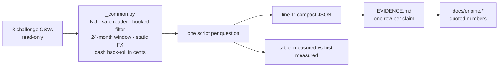

# Evidence behind the engine's numbers

Every number the X-Ray engine design leans on — a threshold, a share, a correlation, a
"this signal is noise" verdict — is **regenerated here from the raw CSVs** by a small
script, and listed below as one row per claim: what is claimed, what the script measures,
how long it takes, and the caveat that must travel with the number. The scripts are
**standard-library Python 3.12** (no pandas, no polars, no engine import), so the evidence
does not depend on the code it justifies. Only aggregates are printed.

Related docs:

- [../docs/engine/ENGINE.md](../docs/engine/ENGINE.md) — how the score works; quotes these numbers
- [../docs/engine/DECISIONS.md](../docs/engine/DECISIONS.md) — the decision record behind each constant
- [../docs/engine/DATA_TRAPS.md](../docs/engine/DATA_TRAPS.md) — the dataset traps these scripts size
- [../docs/engine/VALIDATION.md](../docs/engine/VALIDATION.md) — the engine-level checks (this folder
  validates the *design inputs*, that file validates the *engine outputs*)

## How to run

```bash
python3 analysis/mirrors.py --data /path/to/csv-folder            # JSON line + table
python3 analysis/mirrors.py --data /path/to/csv-folder --json-only
for s in analysis/[a-z]*.py; do python3 "$s" --data /path/to/csv-folder --json-only; done
```

The folder is only read. Line 1 of the output is one compact JSON object (`script`,
`runtime_s`, then the measurements); the table that follows puts each measured value next
to the value **first measured** during the design verification (column `validated`).
All eleven scripts take about two minutes in total on a quiet laptop; runtimes below are
wall-clock seconds of one such run on the 250-group challenge data.



## Shared scope rules

Defined once in [`_common.py`](./_common.py) and used by every script.

| Rule | Definition | Size on the challenge data |
|------|------------|----------------------------|
| **Reader** | `csv` with `field_size_limit` raised; NUL bytes stripped per physical line; quoted multi-line fields kept as one record | 25 NUL bytes; 16,459 multi-line records |
| **Booked** | `status != 'pending'`; a blank status counts as booked | 6,579 pending dropped; 29,839 blank kept |
| **Window** | 24 complete months 2024-09 … 2026-08, judged on `date` (never `value_date`) | 9,228 booked rows fall on 2026-09-01 |
| **Currency** | account currency via `product_id` → product file; static EUR table of 22 currencies; `exchange_rate` never used | 22 currencies in the table, 11 outside it |
| **No EUR value** | product in no product file, or currency outside the table: the row stays in counts and leaves every value aggregate | 1,313 + 11,948 rows (0.05% + 0.47%) |
| **Exactness** | pairing and balance back-roll run on integer cents; quantiles use linear interpolation | see the integer-cents row under Liquidity |

Status words used in the tables: **exact** (same digits as first measured), **reproduced**
(within 5%), **restated** (the first number is reproduced under its own definition, but the
shipped engine uses a different definition, so the number to quote changes) and **not
reproduced** (no reading of the stated definition gives the first number; the value
measured here is the one to quote).

## Scope

| Claim | Measured | Script | Runtime | Caveat |
|-------|----------|--------|---------|--------|
| `transactions.csv` needs a quote-aware, NUL-safe reader | 2,556,437 records in 2,630,949 physical lines; 25 NUL bytes; 16,459 records span several lines · **exact** | `scope.py` | 7 s | The figure first quoted as "74,512 multi-line descriptions" is the number of extra physical lines (74,511 once the header is subtracted); the records affected are 16,459 |
| `invoices.csv` record count | 897,894 · **exact** | `scope.py` | 7 s | — |
| Every measurement uses booked rows of the 24 complete months | 2,540,630 rows in scope; 6,579 pending; 9,228 on the single day after the window · **exact** | `scope.py` | 7 s | 2026-09 is one day: it is never a scorable month, but the cash back-roll needs its rows |
| Some rows count but carry no EUR value | 1,313 rows with a product in no product file; 11,948 rows in 11 currencies outside the FX table · **reproduced** | `scope.py` | 7 s | First measured 11,969 for the second figure (−0.2%). A hidden folder may bring other currencies: they must degrade to counts, never crash |

## Mirror netting

Three recipes on the same rows: **shipped** (same-account reversals first; then same group,
same account currency, equal cents, opposite sign, different product, ≥ 100 EUR, ± 1 day or
≤ 3 days over a weekend, same calendar month), **shipped without the reversal step**, and
**flat ± 2 days** (pairing alone, no amount floor — the recipe of the first measurement).

| Claim | Measured | Script | Runtime | Caveat |
|-------|----------|--------|---------|--------|
| Exact-cent pairs across accounts of one group are internal money, not coincidence | flat ± 2 d: 98,141 pairs = 6.57% of outflow rows, **46.58% of outflow value**; date placebo (9–11 d) 1.22% of rows / 1.80% of value; amount placebo (× 1.01) 0.13% of rows / 0.001% of value · **reproduced** (98,231 · 6.58 · 46.58 · 1.24 / 1.90 · 0.18 / 0.001) | `mirrors.py` | 35 s | Value share is whale-driven: rows of 100k EUR or more are 95.1% of outflow value. The date placebo is 5% under the first run because pairing is nearest-date-first. The amount placebo here refuses exact-cent matches; letting them in (amounts under 1 EUR) gives 2,682 pairs = 0.18% |
| What the **shipped two-step recipe** removes | reversals 59,221 pairs = **41.3%** of outflow value; mirror pairs 70,419 = **17.6%**; together **8.68% of outflow rows, 58.9% of outflow value**. Placebos: reversals 1.9%, mirror pairs 0.28%, amount 0.001% · **restated** | `mirrors.py` | 35 s | "46.6%" belongs to the pairing alone (under the shipped window it is 5.96% of rows, 46.66% of value). With the reversal step first, both steps compete for the same round trips, so the mirror step keeps 17.6%. Quote 59% for the engine, 46.6% for pairing alone — never 46.6% for the shipped mirror step |
| `category == 'transfer'` cannot be the criterion | mirror rows labelled transfer 33.9%, payment / collection 42.4%, `-` 14.2% (flat ± 2 d) · **reproduced** (33.66 / 42.48 / 14.24); shipped recipe 33.0 / 46.5 / 12.6 | `mirrors.py` | 35 s | Counted on both legs. A transfer-only sweep leaves two thirds of the internal movement inside the operating series |
| Netting must be intra-group, not intra-company | 59.7% of pairs join two companies of the group (flat ± 2 d) · **reproduced** (60%); 54.4% under the shipped recipe | `mirrors.py` | 35 s | By value the cross-company pairs are 42.9% of mirror value (38.8% shipped): intra-company sweeps are fewer and larger, so both scopes matter |
| Some companies are mostly internal plumbing | 142 companies have > 50% of outflow value inside mirror pairs (flat ± 2 d) · **exact**; 190 under the shipped recipe (reversals included) | `mirrors.py` | 35 s | Out of 1,282 companies with any outflow value |
| Netting changes measured operating inflow | flat ± 2 d: median company keeps 0.914 of its operating inflow (p25 0.679), 336 lose > 30% · **reproduced** (0.913 / 0.678 / 337). Shipped: p50 0.868, p25 0.618, 399 lose > 30%, **17 companies net to exactly 0** | `mirrors.py` | 35 s | A company at exactly 0 has no external revenue observed: a data fact (`no_external_revenue`), never a 0 score |
| The same-calendar-month rule costs little | it leaves in 622 pairs = 0.24% of outflow value | `mirrors.py` | 35 s | New measurement; the price of keeping a closed month immutable when later rows arrive |

## Perimeter

| Claim | Measured | Script | Runtime | Caveat |
|-------|----------|--------|---------|--------|
| Groups keep gaining members inside the window | 110 of 250 groups = **44.0%**; 61.5% of the 179 multi-member groups · **exact** | `perimeter.py` | 5 s | 71 groups are single-company, so 44% understates the risk for the unit that is scored |
| Late joiners carry real weight | share of group operating inflow p50 0.119, p75 0.388, p90 0.73; 23 groups get > 50% from late joiners · p50 and count **reproduced** (0.121 · 23) | `perimeter.py` | 5 s | p90 first measured 0.808 (−10%): an upper quantile of 110 values; quote p50 and the count |
| The panel triples during the window | 95 groups live in 2024-09, **86 live in all 24 months**, median 18 live months · **exact** | `perimeter.py` | 5 s | Live = at least one booked row that month. Bimodal: an onboarding cluster at 7–9 months and the 24-month cluster |
| Short histories are common | 66 groups live ≤ 9 months, 80 live ≤ 10 months | `perimeter.py` | 5 s | The figure first quoted as "66 groups with ≤ 10 months" is the ≤ 9 count (its own histogram sums to 80) |
| Connection events must be deduped | 2,385 product-level events → **1,566 company-months** over 752 companies (534 companies have none); 1,049 group-months in 208 groups · **reproduced** (2,378 · 1,563 · 1,049 · 208) | `perimeter.py` | 5 s | An account connects when its first booked month is later than its company's; `created_at` is never used |
| A connection explains few collection jumps | 487 of 4,528 jumps > 1.5× fall in a connection month = **10.8%**; 31.1% of connection months show a jump against a 22.2% base rate (lift 1.4) · **exact** | `perimeter.py` | 5 s | 20,388 eligible company month-pairs. ~89% of large jumps are lumpiness, so `perimeter_changed` is a suppressor for one month, not the main false-alarm filter |

## Invoices

| Claim | Measured | Script | Runtime | Caveat |
|-------|----------|--------|---------|--------|
| `status == 'paid'` hides late settlement | AP: **121,989** of 345,467 settled invoices paid after due date (35.3%); AR: 78,153 of 207,867 (37.6%). AP by band 1–15 d 64,783 · 16–30 d 22,746 · 31–60 d 17,988 · 61–90 d 5,940 · > 90 d 10,532 (953 M EUR); AR 1,047 M EUR · **exact** | `invoices_asof.py` | 2 s | Whole file, no window. 4,002 AP / 2,756 AR late rows carry a payment date after extraction and 3,924 / 1,771 a due date before issuance; the engine drops both kinds |
| ERP-stamped rows must leave at row level | due = issue and paid = due: 68,706 AP (19.9% of settled) and 56,646 AR (27.3%); without them the late share is 44.1% AP / 51.7% AR · **exact** | `invoices_asof.py` | 2 s | They are exact zeros written by the ERP, not behaviour; left in, the late share is 9 (AP) to 14 (AR) points too low |
| Punctuality is scorable for a minority of groups | shipped as-of gate at 2026-08: **120 groups (AP) and 96 (AR) of 250**; 83 groups have no invoices at all · **not reproduced** | `invoices_asof.py` | 2 s | First measured 98 / 52 under the due-cohort design that was replaced; a plain reading of that design gives 128 / 101, so 98 / 52 should not be quoted. Not scorable (AP / AR): no invoices 83 / 83, nothing due in 90 days 13 / 21, stamped ≥ 50% 8 / 19, under 10 invoices or Kish n < 5: 26 / 31. "83 without invoices" is exact |

## Live feed

| Claim | Measured | Script | Runtime | Caveat |
|-------|----------|--------|---------|--------|
| 0.8 is too tight a gate, 0.5 is a plateau | groups failing at 2026-08: 0.8 → 36 (9 dark, 25% precision); 0.7 → 27; **0.6 → 19; 0.5 → 19 (9 dark, 47%)**; share of evaluable group-months failing 17.7% at 0.8 vs 10.2% at 0.5 · **exact** | `feed_gate.py` | 5 s | Dark = last live month ≤ 2026-05 after at least a 6-month span. 0.5 and 0.6 flag the same set |
| Same picture per company | 0.8 → 234 of 1,031 evaluable (19.6% of 9,850 company-months); 0.5 → 116; 40 dark at every threshold · **reproduced** | `feed_gate.py` | 5 s | One earlier run quoted 122 at 0.5; 116 is the count under the stated definition |
| The bare ratio fails open | undefined at 2026-08 for 255 companies and 53 groups; **21 of 61 dark companies pass silently** · **exact** | `feed_gate.py` | 5 s | The 9-month baseline of a long-dead feed is all zeros |
| Kill rules close the hole | gate 0.5 + "no row in t−2..t" + "zero-row month at group level": 30 groups stale at 2026-08, **16 of 16 dark groups detected, median lag 1 month**; companies 61 of 61, median lag 2 months | `feed_gate.py` | 5 s | First measured 15 of 15 (dark groups then needed 6 live months rather than a 6-month span) |
| A zero-row month at group level is final | 9 groups with a real feed (median ≥ 10 rows a month) hit a first zero month; **8 never return** · **exact** | `feed_gate.py` | 5 s | Small n |
| When social-security payments stop, the feed is dying | 47 stoppers; row volume after / before the stop **0.167** (q1 0.00, q3 0.53); 22 have no rows at all in 2026-08; 0.403 when the feed is still alive; only 8 keep ≥ 80% of their volume. Controls 1.05, 89% ≥ 0.8 · **exact** | `feed_gate.py` | 5 s | Controls are read at every stopper cut month (599 companies) instead of sampled (560 first time). n = 47 and right-censored: a direction, not a magnitude to model |

## Liquidity

| Claim | Measured | Script | Runtime | Caveat |
|-------|----------|--------|---------|--------|
| Absolute anchors spread the groups | 225 groups with a defined buffer at 2026-08; buffer days p25 / p50 / p75 = 4.9 / 23.2 / 84.4; pillar 13.3 / 53.2 / 90.8; 6.2% at 0, 19.6% at 100, mean 51.2 · **exact** | `liquidity_size_gradient.py` | 10 s | x-anchors 13 / 27 / 62 days are the JPMorgan Chase Institute cash-buffer-days quartiles (US small businesses, all outflows): the centre fits this panel, the tails do not. 25 groups have no outflow in the last 3 months: undefined, not 0 or 100 |
| Undrawn credit lines belong in the numerator | with headroom the pillar is 26.0 / 64.7 / 93.3 (p25 / p50 / p75) · **exact**; 98 of the 225 groups have headroom | `liquidity_size_gradient.py` | 10 s | Limit = snapshot `granted`, assumed constant. First measured 100 groups with headroom |
| A top anchor at 180 days only trims saturation | 13.3% of groups at 100 instead of 19.6% · **exact**; the median stays at 53.2 | `liquidity_size_gradient.py` | 10 s | The first note said the median moves to 44.6: **not reproduced**, and it cannot move — the median sits on the 13–27 day segment, which the top anchor does not touch |
| **The pillar is a size proxy under absolute anchors** | median pillar by size quartile Q1 → Q4: **83.3 / 85.1 / 38.3 / 19.1** (buffer days 59.6 / 62.3 / 14.8 / 7.1); with headroom 83.3 / 86.1 / 68.1 / 34.2; groups with headroom 8% → 62% · **reproduced** (81.6 / 85.2 / 36.6 / 19.2) | `liquidity_size_gradient.py` | 10 s | Size = operating inflow of the last 12 months; quartiles over the 244 groups with any; medians over groups with a defined buffer. Q1–Q3 move a few points with the quartile cut; Q4 is stable |
| Same gradient on EU SME bands | micro / small / medium / large (< 2M, < 10M, < 50M, ≥ 50M EUR a year): 33 / 50 / 79 / 63 groups; median pillar **84.9 / 80.7 / 44.1 / 18.4**; with headroom 84.9 / 85.2 / 72.1 / 33.6; buffer days 61.9 / 56.1 / 18.1 / 6.8 | `liquidity_size_gradient.py` | 10 s | New measurement; bands from annualised 12-month operating inflow. This is the measured reason for size-segmented anchors |
| Negative cash is a state, not an event | group level: negative now → **still negative six months later 72.5%** (269 of 371) against 1.5% when positive now; base rate 7.33% · **exact** | `liquidity_size_gradient.py` | 10 s | All (t, t+6) pairs of 250 groups pooled. Aggregation to the group raises persistence (company level 64.6%) |
| Same at company level | 64.6% (1,091 of 1,689) against 1.5%; base rate 6.16%; 1,263 companies · **exact** | `liquidity_size_gradient.py` | 10 s | The "2.0% when positive" first quoted is inconsistent with its own base rate; 1.5% is the measured value |
| A thin buffer persists too, with less lift | buffer < 13 days now → 73.8% still below six months later against 16.0% (n = 698) · **exact** | `liquidity_size_gradient.py` | 10 s | Lift 2.1× against ~10× for negative cash: a third of the panel is already below 13 days |
| Cash must be rebuilt in integer cents | the counts above only reproduce with the back-roll in integer cents: with float sums, empty accounts come out as tiny negatives and the negative company-months grow by about a fifth | `liquidity_size_gradient.py` | 10 s | Found while writing the script, which now only has the integer path; the persistence *rates* barely move, the *counts* do |
| Back-rolled cash is under-stated for some accounts | 98 cash products have booked rows and no balance row · **exact** | `liquidity_size_gradient.py` | 10 s | Their cash is missing from every month of the group: flag `no_cash_anchor` |

## Credit lines

| Claim | Measured | Script | Runtime | Caveat |
|-------|----------|--------|---------|--------|
| Back-rolled utilisation is a persistent level, so headroom can be as-of | 462 lines with a balance row and a limit, 288 with at least one booked row; lag-3 autocorrelation **0.742** for lines that move (Spearman 0.756, 3,214 pairs); 0.898 over all lines · **exact** | `credit_lines.py` | 4 s | Only with clipping to [0, 1]: unclipped Pearson is −0.003 because a few lines blow past ± 1× the limit. The 174 lines that never move have constant series and inflate the pooled figure: quote 0.74 |
| Lines are bimodal | utilisation at 2026-08 p25 / p50 / p75 / p95 = 0.00 / 0.058 / 0.83 / 1.00; 46.5% undrawn · **reproduced** | `credit_lines.py` | 4 s | Limit is a snapshot, assumed constant (flag `limit_assumed_constant`) |

## Debt

| Claim | Measured | Script | Runtime | Caveat |
|-------|----------|--------|---------|--------|
| A DSCR proxy is not measurable from bank flows | half-vs-half Spearman **0.08** on the ratio, 0.15 once mapped to its anchors (117 groups with debt service in both halves) · first measured 0.14. Last 12 months: 183 groups, median −0.57, 53.6% with a negative numerator, pillar 53.6% at 0 and 27.9% at 100 · **exact** | `debt_burden_stability.py` | 5 s | More than half of the numerators are negative, so the ratio flips sign around zero. Either reading of the stability figure says the same thing |
| Debt-service burden is | half-vs-half Spearman **0.66** raw · **exact**; 0.73 with debt-service months winsorised at 3× the median month; 0.67 with both sums winsorised (the engine rule); 0.66–0.67 on the strict or shipped operating-inflow denominators | `debt_burden_stability.py` | 5 s | Same 117 groups. Stability does not depend on the denominator chosen |
| Burden anchors are population anchors | last 12 months p25 / p50 / p75 / p95 = **0.001 / 0.018 / 0.074 / 0.235** (183 groups); 66 of 249 groups have no debt service · **exact** | `debt_burden_stability.py` | 5 s | The anchors 0.02 / 0.08 / 0.25 are these percentiles rounded: frozen population anchors, not a domain convention |
| Revolving rollovers are a tail | groups with burden > 50%: 6 (strict inflow) / 5 (inclusive) raw, 4 with debt-service months winsorised · **exact**; 6 when both sums are winsorised | `debt_burden_stability.py` | 5 s | Winsorising the inflow too cancels the trimming in the tail: the cap on debt-service months is the part that does the work |
| Debt service is lumpy | largest month as a share of the 12-month total p50 / p75 / p95 = 0.285 / 0.495 / 0.999 · **exact** | `debt_burden_stability.py` | 5 s | One month is the whole year for the top 5%: the reason for monthly winsorisation and a 12-month window |

## Category `-`

| Claim | Measured | Script | Runtime | Caveat |
|-------|----------|--------|---------|--------|
| A quarter of the rows have no category | 630,628 rows, 21.80 bn EUR · **exact** | `dash_category.py` | 30 s | 8,244 of them have no EUR value |
| The sign is a good default | on 1.9 M labelled rows the sign gives the right wide family **0.886** (inflow) / **0.933** (outflow) · **exact** (728,843 / 822,565 and 1,014,203 / 1,087,313); read as engine classes: 0.882 operating inflow, 0.908 operating outflow or debt service | `dash_category.py` | 30 s | The wide families also count investment returns, withdrawals and refunds. For the engine quote 0.88 / 0.91. Most of the rest is `transfer` (11.0% of labelled inflow rows, 5.6% of outflow rows), which netting removes |
| The override rules are precise | as shipped (sign and veto applied), precision on labelled rows ≥ 0.869 for all eleven: 0.987 · 0.942 · 1.000 · 1.000 · 0.882 · 0.991 · 0.999 · 0.903 · 0.991 · 0.869 · 0.983 in the order of the rule table · **reproduced** (pattern-only 0.83–1.00) | `dash_category.py` | 30 s | An upper bound: `-` rows are exactly the ones the categoriser could not label. Identical with `--params params/reference_v1.json` |
| …and cover little | as shipped they claim 28,047 `-` rows (4.45%) and 1.61 bn EUR (7.4%); pattern-only 33,381 rows (5.29%) and **1.765 bn EUR (8.1%)** · value **exact** | `dash_category.py` | 30 s | First measured 35.3k rows with a substring match for the fee rule. Narrative rules cannot replace the sign default |
| Account-hold adjustments dominate `-` value | the hold templates: **406 rows = 35.0% of `-` value** · **exact** | `dash_category.py` | 30 s | 0.064% of `-` rows |
| The shipped retention pattern is slightly too wide | it claims 507 rows: the 406 above plus 101 other narratives (2.0 M EUR) that read as tax withholdings; on labelled rows the same pattern lands on `tax` 70.5% of the time (n = 2,910) | `dash_category.py` | 30 s | New finding. Value impact nil; tightening the pattern to the hold templates (`HOLD_TEMPLATES` in the script) would send those 101 rows back to operating outflow |

## Concentration

| Claim | Measured | Script | Runtime | Caveat |
|-------|----------|--------|---------|--------|
| A one-month concentration alert is noise | top-1 counterparty ≥ 20% of collections in at least one month: 926 of 1,261 companies = **73.4%** · **exact** | `concentration.py` | 5 s | Denominator = all collections of the month; dividing by attributed collections only inflates every share |
| With a recurrence filter it is a trait | ≥ 20% in ≥ 6 of the last 12 months: 373 = **29.6%**; bimodal (398 companies at 0 months, 69 at 12) · **exact** | `concentration.py` | 5 s | Flat histogram around the cut (65 / 50 / 73 at 5 / 6 / 7 months): insensitive to 5 or 7. A profile flag, not an alert and not a pillar input |
| Token harvesting is the coverage lever | collection rows with a counterparty: 9.8% by id → 24.2% adding the single `COUNTERPARTY_n` token; top-1 share p10 / p50 / p90 = 0.010 / 0.264 / 0.998 over 12,384 attributed company-months · **exact** | `concentration.py` | 5 s | Two or more tokens is a remittance: attributed to nobody |

## Seasonality

| Claim | Measured | Script | Runtime | Caveat |
|-------|----------|--------|---------|--------|
| Month-of-year R² is at the noise floor | companies (n = 211): p50 R² **0.507** against a permutation null of **0.478**; groups (n = 76): 0.488 against 0.478; theory for 12 dummies on 24 points 11/23 = 0.478 · **reproduced** (0.505 / 0.479 and 0.487 / 0.480) | `seasonality_null.py` | 7 s | Units with operating inflow in all 24 months; rows capped at the company's own p95; log scale; 200 shuffles per unit, seed 7 |
| Detrending does not rescue it | companies 0.538 against 0.476 · **exact**; groups 0.548 against 0.477 | `seasonality_null.py` | 7 s | Some seasonality exists; two years cannot estimate it per unit |
| Own seasonal factors make things worse out of sample | year-1 factors removed from year 2: variance ratio p50 **1.49** (companies) / 1.70 (groups); it helps 26.5% / 23.7% of units · **reproduced** (1.49 / 1.68 · 27 / 25) | `seasonality_null.py` | 7 s | The measured reason for shipping no deseasonalisation |
| Few units beat their own null | 16.1% of companies and 23.7% of groups exceed the 95th percentile of their own null (5% by chance) | `seasonality_null.py` | 7 s | First measured 21–29% |

## Numbers to restate where they are quoted

1. **Mirrors.** 46.6% of outflow value is the pairing alone. The shipped engine removes
   **58.9%** (reversals 41.3% + mirror pairs 17.6%) and 8.68% of outflow rows; its date
   placebos are 1.9% and 0.28%.
2. **Punctuality coverage.** 98 (AP) / 52 (AR) does not reproduce under any reading. The
   shipped as-of gate scores **120 (AP) / 96 (AR)** of 250 groups at 2026-08; 83 groups have
   no invoices.
3. **Sign default.** 0.89 / 0.93 are wide-family figures; for the engine's classes quote
   **0.88 / 0.91**.
4. **Rule coverage.** As shipped the eleven rules claim 4.5% of `-` rows and 7.4% of `-`
   value (8.1% pattern-only).
5. **DSCR stability.** 0.08 on the ratio, 0.15 on the anchored score (first quoted 0.14).
6. **Short histories.** 66 groups live ≤ 9 months; 80 live ≤ 10.
7. **Multi-line descriptions.** 16,459 records, 74,511 extra physical lines.
8. **Liquidity top anchor.** 180 days cuts saturation to 13.3%; it cannot move the median.

## Known limitations

- **One dataset.** Every number is measured on the 250-group challenge data; none is a
  property of SMEs at large. The scripts run on any folder with the same eight CSVs, but the
  `validated` column only means something on this one.
- **Fixed window.** The window is hard-coded to 2024-09 … 2026-08 in `_common.py`; a folder
  with other dates needs those two constants changed.
- **Design inputs, not engine outputs.** These scripts re-implement each definition in plain
  Python; they do not import the engine. Agreement with the engine's own artefacts is checked
  by the validation suite, not here. `mirrors.py` breaks ties by file order where the engine
  ranks by `transaction_id`; buckets are 1×1 almost always, so the totals are insensitive.
- **Precision on labelled rows is an upper bound** for `-` rows, which are the ones the
  categoriser failed on. No hand-labelled sample exists.
- **Small n** for the dark-feed and social-security results (61 companies, 16 groups, 47
  stoppers): directions, not magnitudes.
- **Static FX** and **snapshot credit limits** are assumptions shared with the engine; the
  scripts size what they exclude, they do not remove the assumption.
- **Runtimes** are single runs on a quiet laptop; they roughly double when the machine is
  busy. Outputs are deterministic: two full runs gave byte-identical JSON.
