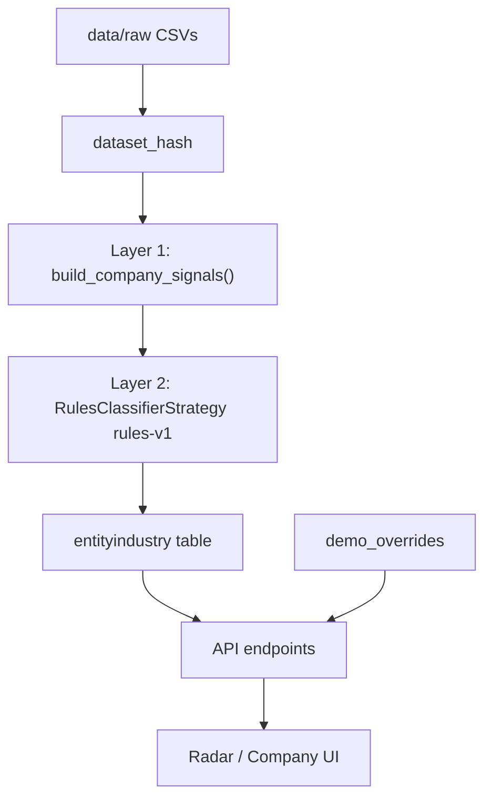

# Industry classification algorithm

This document is the **source of truth** for how X-Ray infers a company's industry
archetype from its financial trail. Agents and contributors should read this before
changing classification logic, thresholds, or API behaviour.

Related docs:

- [BENCHMARK_REFERENCE.mdx](./BENCHMARK_REFERENCE.mdx) — external Tesorio peer baselines
- [UI_FORMATTING.mdx](./UI_FORMATTING.mdx) — how confidence is rendered in the UI

## Purpose

Map each `company_id` to one of the **10 Tesorio benchmark sectors** so the product can
compare observed AR drivers (`collection_delay_days`, `receivable_overdue_ratio`, etc.)
against a named peer group.

The north star score (0–100) is **not** replaced. Industry classification only adds
sector context for explainability and benchmark comparison.

## Design principles

1. **Dataset-versioned** — classifications are keyed by `dataset_hash`. A new dataset
   triggers a full re-classification run; prior runs are preserved.
2. **Batch, not per-request** — signals are computed once per dataset in Polars; the API
   reads persisted rows from `entityindustry`.
3. **Pluggable strategy** — `rules-v1` today; future versions (`ml-v1`, `ar-similarity-v1`)
   can plug in without changing signal extraction or persistence.
4. **Signal-pure storage** — demo overrides are applied at API read time only.

## Pipeline



### Layer 1 — Signal extraction

Implementation: [`engine/src/xray_engine/industry_classifier.py`](../engine/src/xray_engine/industry_classifier.py)

`build_company_signals(input_dir)` scans all companies in four batch Polars passes:

| Signal | Source file | Meaning |
|--------|-------------|---------|
| `tx_collection_share` | `transactions.csv` | Share of bank movements tagged `collection` |
| `tx_payroll_share` | `transactions.csv` | Share of `salary`, `tax`, `social_security` |
| `tx_pos_share` | `transactions.csv` | Share of `pos_settlement` |
| `tx_bulk_collection_share` | `transactions.csv` | Share of `bulk_collection` |
| `tx_fee_share` | `transactions.csv` | Share of `fee` |
| `tx_transfer_share` | `transactions.csv` | Share of `transfer` |
| `tx_uncategorized_share` | `transactions.csv` | Share of uncategorised (`-`) movements |
| `invoice_count` | `invoices.csv` | Number of invoices |
| `invoice_ticket` | `invoices.csv` | Mean absolute invoice amount |
| `invoice_issued_ratio` | `invoices.csv` | Issued vs total invoices |
| `counterparty_count` | `invoices.csv` | Unique `counterparty_id` values |
| `has_factoring` | `debt_products.csv` | Company uses factoring |
| `has_confirming` | `debt_products.csv` | Company uses confirming |
| `has_leasing` | `debt_products.csv` | Company uses leasing |
| `has_tpv` | `banking_products.csv` | Company has TPV product |
| `debt_product_count` | `debt_products.csv` | Total debt instruments |

Minimum data gate: `tx_total >= 50`. Below that, `source = insufficient_data`.

### Layer 2 — Rules classifier (`rules-v1`)

Priority tree — **first match wins**:

| Priority | `industry_slug` | Rule | Confidence |
|----------|-----------------|------|------------|
| 1 | `financial_services` | factoring/confirming + collection > 15% | 0.70 |
| 2 | `logistics_supply_chain` | bulk_collection > 2% + collection > 25% + invoices > 500 | 0.68 |
| 3 | `marketing_advertising` | TPV or pos_share > 4% | 0.65 |
| 4 | `manufacturing` | leasing + ticket > 5k + invoices > 200 | 0.62 |
| 5 | `software` | ticket > 40k + payroll < 10% + 50–1000 invoices | 0.60 |
| 6 | `professional_services` | payroll > 15% + 150–2000 invoices + ticket < 50k | 0.58 |
| 7 | `technology_services` | fee > 8% + invoices > 500 + counterparties > 30 | 0.55 |
| 8 | `energy_utilities` | debt_products >= 3 + invoices < 150 + collection < 15% | 0.52 |
| 9 | `business_services` | uncategorized > 40% + transfer > 20% (treasury/holding) | 0.55 |
| 10 | `business_services` | default fallback | 0.40 |

Spanish labels are defined in `INDUSTRY_LABELS` in the same module.

### Layer 3 — Persistence

Table: `entityindustry`

| Column | Purpose |
|--------|---------|
| `dataset_hash` | Dataset version (SHA-256 of classification CSV set) |
| `entity_id` | Company id |
| `classifier_version` | Strategy version (`rules-v1`) |
| `industry_slug` / `industry_label` | Assigned sector |
| `confidence` | 0.0–1.0 |
| `source` | `signal` or `insufficient_data` |
| `reason` | Human-readable rule explanation |
| `signals_json` | Serialised signal vector for audit |

Unique key: `(dataset_hash, entity_id, classifier_version)`.

## Operations

```bash
# Preview sector distribution without writing
uv run xray-db classify data/raw --dry-run

# Classify all companies (idempotent)
uv run xray-db classify data/raw

# Re-run after tuning rules
uv run xray-db classify data/raw --force
```

Typical workflow after a new dataset:

```bash
make db-seed          # ingest source tables
xray-db classify data/raw
```

## API

| Endpoint | Description |
|----------|-------------|
| `GET /api/v1/companies/{id}/industry` | Single company classification |
| `GET /api/v1/companies/industry?ids=...` | Batch read |
| `GET /api/v1/industry/distribution` | Sector counts for active dataset |
| `GET /api/v1/demo` | Demo companies include `industry` object |

Query param `dataset_hash` selects a specific dataset version. Default: latest
classified dataset. Env `XRAY_ACTIVE_DATASET_HASH` can pin the active version.

## Demo overrides

[`backend/app/benchmarks/demo_overrides.py`](../backend/app/benchmarks/demo_overrides.py)
applies read-time overrides for pitch companies:

| Entity | Override sector | Reason |
|--------|-----------------|--------|
| `COMP_0680` | `manufacturing` | Velasco Industrial demo narrative |
| `COMP_0218` | `logistics_supply_chain` | Northbrook Foods |
| `COMP_0915` | `marketing_advertising` | Orbe Retail |

Overrides set `source = override` and `confidence = 1.0` in API responses only.

## Known limitations

- **No CNAE/epígrafe** in the HackSpain dataset — classification is inferred from
  operational signals, not declared sector.
- **Synthetic AR degeneracy** — median ADC ≈ 0 and overdue ≈ 99% in the challenge data,
  so AR-profile similarity is not used in `rules-v1`.
- **High default rate** — ~70% of companies fall into `business_services` when no strong
  operational signal fires. Future strategies should reduce this bucket.

## Extending the classifier

1. Add a new class implementing `ClassifierStrategy` with a new `version` string.
2. Register it in `classify_dataset(strategy=...)`.
3. Run `xray-db classify data/raw --force` to populate rows with the new version.
4. Update this document with the new rules or model description.
5. Do **not** change stored rows in place — always write a new `classifier_version`.
