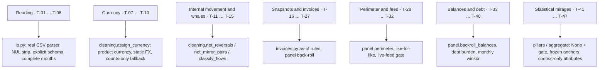

# Dataset traps and the rules that neutralise them

Every way the challenge dataset can make an honest computation lie, with its **measured
size** and the **rule** in the engine that defuses it. The list is the reason the cleaning
and panel layers look the way they do: each rule in [ENGINE.md](./ENGINE.md) exists because
of a row in this file. Read it before adding a signal; most "new signals" walk into one of
these.

Related docs:

- [ENGINE.md](./ENGINE.md) — where each rule sits in the pipeline
- [DECISIONS.md](./DECISIONS.md) — the decision record behind each rule (D-nn)
- [VALIDATION.md](./VALIDATION.md) — the checks that would catch a regression
- [OPEN_QUESTIONS.md](./OPEN_QUESTIONS.md) — traps that are contained but not solved

Conventions: magnitudes are measured on the 250-group challenge data, window 2024-09 …
2026-08, booked rows. † = initial profiling pass, not re-derived in the v2.1 verification;
‡ = verification run, no committed script yet. Scripts live in `analysis/`
(`python3 analysis/<name>.py --data <dir>`). Only aggregates are quoted; entity ids appear as
qualitative examples.

## Where each family is neutralised

## A. Reading the files

| Id | Trap | Measured | What goes wrong | Neutralising rule |
|----|------|----------|-----------------|-------------------|
| T-01 | **Quoted multi-line descriptions** | 2,556,437 transaction records sit on about 74,500 more physical lines than records (`scope.py`) | any line-based reader (`split`, `awk`, naive chunking) invents rows and shifts columns | real CSV parser with quoted newlines (`polars.scan_csv`); the cache build **asserts 2,556,437 transactions and 897,894 invoices** against a stdlib `csv` recount |
| T-02 | **NUL bytes** in `transactions.csv` | 25 NUL bytes; `csv.reader` raises `line contains NUL` (`scope.py`) | the file cannot be recounted, or a lenient reader drops rows silently | strip `\x00` **per line** before parsing, so embedded-newline records still parse |
| T-03 | **All-null columns in small folders** | `available`, `granted`, `country`, `erp` can be entirely empty † | dtype inference flips a column to the wrong type on a hidden folder | explicit `schema_overrides` for every column (`io.SCHEMAS`); nothing is inferred |
| T-04 | **Single-day last month** | 2026-09 holds one day: 9,228 booked rows | every monthly total for 2026-09 is 1/30 of a month; trends invert | complete months only; window derived from the data (D-06) |
| T-05 | **Pending and blank status** | 6,579 `pending`; 29,839 blank | pending rows are not facts yet; dropping blank rows breaks the back-roll identity | drop `pending`, blank = booked (D-06) |
| T-06 | **`value_date`** | equals `date` in 88.5% of rows †; a feed artefact otherwise | month assignment drifts by bank | use `date` only |

## B. Currency

| Id | Trap | Measured | What goes wrong | Neutralising rule |
|----|------|----------|-----------------|-------------------|
| T-07 | **No currency column on transactions** | 12 columns, none is a currency; 95.9% of rows have account currency = company currency | summing `amount` mixes currencies | currency inherited from `product_id` (D-08) |
| T-08 | **`exchange_rate` points the other way** | of 104,972 cross-currency rows: 91.9% are *account units per unit of accounting currency* (must divide), 2.0% the inverse, 2.3% account → EUR, 4.4% stamped 1; on invoices 8% match neither | `amount × exchange_rate` converts to the wrong currency in the wrong direction, inconsistently | never read `exchange_rate`; static EUR table in `params.fx` |
| T-09 | **Currencies outside the table; high-denomination currencies** | about 12,000 rows in nine currencies outside the table (`scope.py`); a few dozen unconverted pesos rows nominally outweigh whole companies † | one unconverted row dominates every value aggregate | outside the table ⇒ counts yes, value no; `fx_excluded_share` lowers confidence (D-09) |
| T-10 | **Orphan products** | 1,313 rows (0.05%) point to a `product_id` absent from both product files | no currency can be inherited | counts only; `orphan_product_share` |

## C. Internal movement and whales

| Id | Trap | Measured | What goes wrong | Neutralising rule |
|----|------|----------|-----------------|-------------------|
| T-11 | **Mirror pairs labelled as business** | intra-group mirror pairs = 6.6% of outflow rows but **46.6% of outflow value**; only 34% of mirror rows are `transfer`, 42% are `payment` / `collection`, 14% `-`; 142 companies have > 50% of their outflow inside mirrors (pairing alone, flat ±2 d). Shipped two-step recipe: 8.7% of rows, **59% of value**, 193 companies above 50% (`mirrors.py`) | sweeps inflate inflow, outflow, activity and every denominator; a category filter leaves two thirds of it in | netting before any category logic, on all categories (D-11 … D-15); placebos: 1.9% of value (date offset 9–11 d), 0.001% (amount ×1.01) |
| T-12 | **Same-account reversals** | 59,511 opposite pairs on the same account within ±1 day = 4.0% of outflow rows and **42% of outflow value** (date placebo 1.9%) (`mirrors.py`) | they look like mirrors but fail the different-product guard and stay in operating flows | dropped first by their own rule (D-10) |
| T-13 | **Whale rows** | rows ≥ 100k EUR are 95% of outflow value; the top 1% of rows is about three quarters of all value † | any sum is decided by a handful of rows; one month can be a whole year | monthly totals winsorised at 3× the median month; medians for denominators (D-24) |
| T-14 | **Retention-adjustment whales** | 406 rows (`RETENCION`, `AP.RET.DST`) = 0.064% of `-` rows = **35.0% of `-` value**; five rows of about one billion each (`dash_category.py`) | account-hold adjustments read as cash | class `adjustment`, excluded from everything (D-19) |
| T-15 | **Category `-` is operating content, and its narratives mislead** | 24.9% of rows; 96.1% on checking accounts; 25% have a resolved counterparty. Sign predicts the family at 0.89 / 0.93. Look-alike patterns fail: instalment-number wording is `payment` 78.5% of the time, payroll wording is `bulk_collection` in 42% of hits, drawdown wording is `collection` 51.5% (`dash_category.py`) | dropping `-` deletes real business; naive narrative rules corrupt debt service and payroll | sign default + the 11 rules with precision ≥ 0.83 (D-17, D-18); main-bank neutrality check because `-` is bank-concentrated |

## D. Snapshots and look-ahead

| Id | Trap | Measured | What goes wrong | Neutralising rule |
|----|------|----------|-----------------|-------------------|
| T-16 | **Snapshot columns** | `pending_amount`, invoice `status`, `accounting_status`, all of `balances`, `debt_products` (`granted`, `outstanding`, `liquidity`) and `debt_schedule_config` are photographs of the extraction date | using them in month *t* < last month is look-ahead; any back-test is flattered | point-in-time rule with two declared exceptions: balance as back-roll anchor, `granted` assumed constant and flagged (D-05); truncation test P2 |
| T-17 | **`payment_date` on open invoices** | filled on virtually every row †; on open invoices it equals `due_date` in 96.9% †; 4,002 AP / 2,756 AR "late" rows carry a payment date after the extraction date | an expected date is read as a settlement; open invoices look paid on time | `settled_date` only if `paid` and nothing pending; dates after the extraction stay null (D-21) |
| T-18 | **`paid` hides lateness** | 121,989 of 345,467 settled supplier invoices (35.3%) and 78,153 of 207,867 customer invoices (37.6%) were settled after due date (`invoices_asof.py`) | a status-based on-time rate is blind to it | lateness recomputed from dates, as-of each month end |
| T-19 | **Snapshot headroom** | adding undrawn lines moves the 2026-08 group liquidity median by +11.5 points; the snapshot is look-ahead in 23 of 24 months; back-rolled utilisation is persistent enough to rebuild it (lag-3 autocorrelation 0.74 for lines that move, `credit_lines.py`) | past months inherit today's drawn balance | headroom back-rolled per month from line balances; limit flagged `limit_assumed_constant` (D-30) |
| T-20 | **`created_at` is not the start of the data** | 2,961 accounts have history before their connection date (median 2 months) †; 13.2% of transactions predate their company's `created_at` † | perimeter and history depth are wrong in both directions | perimeter from the first **booked** row, never `created_at` (D-23) |

## E. Invoices

| Id | Trap | Measured | What goes wrong | Neutralising rule |
|----|------|----------|-----------------|-------------------|
| T-21 | **ERP-stamped rows** | `due == issue` and `settle == due`: 68,706 AP / 56,646 AR = 20% / 27% of settled invoices, all exact zeros; they lift on-time rates by about 9 points | "zero days late" is absence of data, read as perfect behaviour | excluded at **row** level; entity gated when ≥ 50% of its window is stamped (D-22, D-37) |
| T-22 | **Impossible and future dates** | among late-settled rows: 3,924 AP / 1,771 AR have due < issue; trimming costs < 7% of the late population | negative terms, lateness of years | rows with due or payment before issuance are dropped |
| T-23 | **Non-invoice document types** | payment documents, notes, deposits and invoice groups are about 15% of the file (137k of 898k rows) †; payment documents duplicate the accrual, notes carry both signs | double counting of invoiced value | only `document_type == 'invoice'` |
| T-24 | **Right-censoring of due cohorts** | observing a cohort at due + 30 d truncates lateness at 30: score 50 becomes a floor, 25% of cohorts sit on the wall, the 20–50 band is unreachable | the scale cannot express a bad payer | as-of days beyond terms over the trailing 90 days; open invoices keep ageing (D-35) |
| T-25 | **Never-paid stock piles up** | a point-in-time overdue ratio exceeds 1.0 in > 10% of group-months (p90 1.69 uncapped); one group-month at 113 moves Pearson by 0.3 | the metric becomes an outlier detector that grows with feed age | not used as a signal; the 90-day due window and per-invoice clip bound the influence of old stock |
| T-26 | **Counterparty ids: coverage, not format** | zero-padding is a no-op (42,125 overlapping ids before and after); `counterparty_id` is filled in 9.8% of transactions; the single description token adds 511,787 rows; ≥ 2 tokens = remittance | effort spent on padding; concentration computed on a tenth of the rows | `counterparty_key` = id, else the single token (D-20) |
| T-27 | **ERP tier drives the lateness level** | ERP tier explains an excess η² of 0.16 of lateness against ≤ 0.02 for size †; median share of AP paid late differs by an order of magnitude across tiers † | absolute anchors on the level partly rank the accounting software | stamped rows out (T-21); ERP-tier neutrality check (R2); stated as a limitation |

## F. Perimeter and feed

| Id | Trap | Measured | What goes wrong | Neutralising rule |
|----|------|----------|-----------------|-------------------|
| T-28 | **Onboarding ramp and perimeter** | 95 of 250 groups exist in 2024-09, 86 have all 24 months; **44% of groups gain a member** mid-window; 1,566 company-months with a new account; late joiners carry p50 12% / p90 73% of group inflow (`perimeter.py`); a new account's first month runs at p50 0.81 (p25 0.26) of its plateau ‡ | raw group totals measure who got connected, not performance | fixed perimeter per month, like-for-like deltas, suppression in the change month, `perimeter_shift` above 20% (D-23, D-60, D-61) |
| T-29 | **Dataset-wide volume ramp and last-month dip** | booked rows per month grow from 41.8k to 184.9k, then fall 18.7% in 2026-08 (`feed_gate.py`) | any raw-volume trend measures the onboarding calendar and the extraction lag | the feed gate is a **ratio to the entity's own baseline** (cross-sectional median 1.01–1.10 every month); no raw-volume signal exists |
| T-30 | **Dead feeds look like non-payment** | when social-security payments stop, total row volume falls to **0.17×** (control 1.05×) (`feed_gate.py`); 22 of 47 stoppers have zero rows at the end; only 8 keep ≥ 80% of their volume | a dying connector reads as a company that stopped paying taxes and salaries | live-feed gate; on a stale month every absence-based signal is off and the score is carried forward (D-54) |
| T-31 | **A ratio gate fails open** | baseline undefined for 53 of 250 groups and 255 of 1,286 companies at 2026-08; 21 of 61 dark companies pass silently; 8 of 9 first zero-row months at group level never recover | long-dead and short-history feeds are scored as alive | kill rules: `rows(t−2…t) == 0` ⇒ stale; zero-row month at group level ⇒ stale (D-53); with them all 16 dark groups are caught, median lag one month (`feed_gate.py`) |
| T-32 | **The panel triples** | 95 live groups in month 1, 250 in month 24 | any cross-sectional percentile or peer band scores early months against a third of the universe | no cohort statistic at scoring time; references frozen once (D-04) |

## G. Balances and debt

| Id | Trap | Measured | What goes wrong | Neutralising rule |
|----|------|----------|-----------------|-------------------|
| T-33 | **Sentinel balances** | 7 rows with `|balance| ≥ 9e8`; one alone would be most of the cash in the dataset † | group and portfolio cash are fiction | anchors at or above `flows.sentinel_abs_balance` are dropped and counted (`sentinel_balances_dropped`) |
| T-34 | **Balance rows are not all dated the same day** | a few anchors are dated several days before 2026-09-01 † | rolling back from a common date double counts or skips those days | each product is rolled back from its **own** anchor date (D-27) |
| T-35 | **Missing anchors and back-roll drift** | 98 cash products move but have no balance row; the share of company-months with negative cash falls monotonically from 8.7% (2024-09) to 4.3% (2026-08) (`liquidity_size_gradient.py`) | older months are under-stated; cash **levels** are not comparable across the window | `no_cash_anchor_share` lowers confidence; the negative-liquidity cap is disabled for those entities (D-45) |
| T-36 | **Negative `granted`** | limits are stored as negative numbers in `balances`; a few guarantees carry −0.01 † | `balance − granted` style formulas flip sign | `headroom = max(0, |granted| − drawn)`, `drawn = max(0, −balance)` |
| T-37 | **Lines in credit; products drawn 100% by construction** | about 110 credit lines hold a positive balance †; guarantees and mortgages are 100% "utilised" by design † | positive line balances read as debt; utilisation rules fire on products that cannot be undrawn | revolving = `lineofcredit` only; `guarantee` is contingent and excluded from `has_debt_products`; the fully-drawn cap was dropped (D-47) |
| T-38 | **Revolving rollovers inflate debt service** | 6 groups show debt service > 50% of inflow; only 13.1% of debt service is booked on credit-line products; the rest hides in `-` on ordinary checking accounts (worked example: COMP_0087, whose drawdowns arrive as uncategorised inflows) | a tail of groups looks over-indebted | monthly winsor at 3× the median month: 6 → 4 groups and stability 0.66 → 0.73 when applied to debt service (`debt_burden_stability.py`, D-24) |
| T-39 | **Debt service without a debt product** | 241 companies book `debt_repayment` rows without any registered debt product † | "no debt" inferred from the product list alone is wrong | `no_debt` requires no product **and** no debt service in 12 months (D-41) |
| T-40 | **A coverage ratio cannot be built from bank flows** | DSCR proxy: 54% of groups have a negative numerator, half-vs-half Spearman 0.08–0.15 (`debt_burden_stability.py`); net operating flow / inflow p25 −12.6%, p50 −1.7%, p75 +7.5% ‡; an asymmetric category whitelist (4 inflow vs 9 outflow categories) drives the negatives | the numerator is noise around zero and the ratio explodes | debt-service **burden** over inflow (Spearman 0.66); `-` by sign on both sides keeps the perimeters matched (D-40) |

## H. Statistical mirages

| Id | Trap | Measured | What goes wrong | Neutralising rule |
|----|------|----------|-----------------|-------------------|
| T-41 | **Liquidity is a size proxy** | median pillar under absolute anchors by EU size band: 84.9 / 80.7 / 44.1 / 18.4 (micro → large); with headroom 84.9 / 85.2 / 72.1 / 33.6 (`liquidity_size_gradient.py`); survives netting, inclusive denominators and capping ‡ | the largest-weight pillar ranks size, not health | size-band anchors frozen in params, with an absolute fallback switch (D-33) |
| T-42 | **Month-end window dressing** | month end overstates liquidity in 397 of 797 companies (median +20%) †; 78 companies go negative intra-month in ≥ 3 of 6 months against 52 that close negative † | the closing balance flatters | 0.6 · month end + 0.4 · intra-month minimum (D-31) |
| T-43 | **Zero denominators** | 25 of 250 groups have no outflow in the trailing 3 months; an epsilon floor produced a company p95 buffer of 11,214 days | undefined reads as perfect | `None` + gate; 12-month fallback first (D-25) |
| T-44 | **Seasonality mirage** | month-of-year R² 0.505 vs permutation null 0.479 (theory 11/23 = 0.478); own factors raise out-of-sample variance ×1.5–1.7 (`seasonality_null.py`) | twelve dummies on 24 points "explain" half the variance of pure noise; in-sample factors halve any real change | no deseasonalisation (D-26); calendar-month neutrality check |
| T-45 | **Concentration noise** | top-1 ≥ 20% in at least one month: 73.4% of companies; with the 6-of-12 recurrence filter: 29.6%, bimodal (`concentration.py`); a resolved-only denominator inflates it to 56% ‡ | an alert that fires for most of the book | profile flag only, denominator = total collections (D-63) |
| T-46 | **"Net receiver" is a coin flip** | 534 net receivers vs 512 net payers among companies touched by inter-company pairs (`mirrors.py`) | intra-group direction read as dependency | reported as context (`intragroup_in` / `intragroup_out`), never scored |
| T-47 | **Benchmark metric is not days beyond terms** | the external AR benchmark measures invoice → cash days; the engine measures days beyond terms | equating them makes every comparison meaningless | benchmark is a sourced context sentence only (D-64) |

## Known limitations

- **Contained, not solved**: T-27 (ERP effect), T-35 (back-roll drift), T-19 (limits assumed
  constant) and T-09 (static FX) are flagged on screen and in confidence, not corrected.
- **Month boundaries**: a mirror pair whose legs fall in different calendar months is not
  netted; this keeps month *t* immutable when later rows arrive
  ([OPEN_QUESTIONS.md](./OPEN_QUESTIONS.md), Q-15).
- **† magnitudes** come from the profiling pass; the rule does not depend on the exact
  figure, but the figure should be re-derived under `analysis/` before it is quoted.
- **Synthetic data**: some traps (stamped dates, sentinel balances) are artefacts of how the
  dataset was generated; the rules are written so that they are no-ops on clean data.

## Extending this list

1. Measure first: add or extend a script under `analysis/` that prints the magnitude.
2. Add the row here with its id, then the rule, then the decision record.
3. Add a synthetic case to `engine/tests/conftest.py` so the trap is present in the test
   dataset and a regression fails a test, not a demo.
