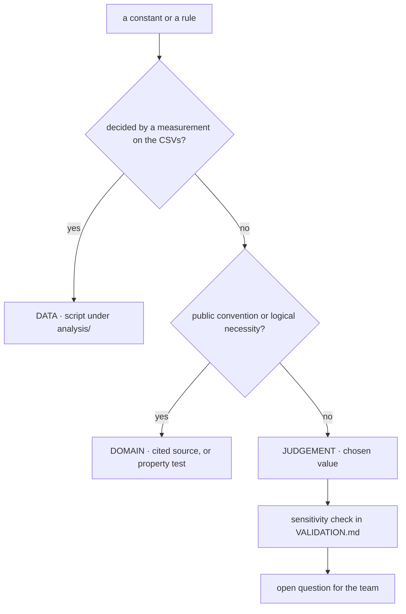

# Engine decision records

One record per design decision and per free parameter of the X-Ray engine v2. The purpose
is that **no number in `params/reference_v1.json` is left without an owner**: each one is
either measured on the data, taken from a public convention, or openly declared a judgement
call with the sensitivity test that covers it. Read this before changing a constant; add a
record before adding one.

Related docs:

- [ENGINE.md](./ENGINE.md) — how the pieces fit together
- [DATA_TRAPS.md](./DATA_TRAPS.md) — the dataset traps behind most `DATA` decisions (T-nn)
- [VALIDATION.md](./VALIDATION.md) — the checks quoted below as P1–P6 and R1–R8
- [OPEN_QUESTIONS.md](./OPEN_QUESTIONS.md) — the questions quoted below as Q-nn

## How to read a record

| Status | Meaning | What would change it |
|--------|---------|----------------------|
| **`DATA`** | decided by a measurement on the challenge CSVs, reproducible with a script under `analysis/` | a different measurement |
| **`DOMAIN`** | decided by a citable public convention, or by logical necessity (an identity, an invariance) | a better convention |
| **`JUDGEMENT`** | neither: a chosen value. The record states the **sensitivity** test that bounds the damage of being wrong | the team; see the open question |

Every record has the same fields: **Context**, **Decision**, **Evidence**, **Alternatives
rejected**, then **Sensitivity** for judgement calls and **Open question** where one remains.
Evidence quotes the measured number and the script that regenerates it
(`python3 analysis/<name>.py --data <dir>`). Numbers marked † come from the initial profiling
pass and were not re-derived in the v2.1 verification; numbers marked ‡ come from the
verification run but are not printed by a committed script yet, and should be added to one
before they are quoted on stage. Entity ids appear only as qualitative worked examples.

## Index

| Id | Decision | Status |
|----|----------|--------|
| D-01 | Measurement engine, not a trained model | `DATA` |
| D-02 | Unit: consolidated group; company as drill-down; both emitted | `DATA` |
| D-03 | Sum flows, then take ratios; never average scores | `DATA` |
| D-04 | Frozen reference file with hash; cohort independence | `DOMAIN` |
| D-05 | Point-in-time, with two declared snapshot exceptions | `DOMAIN` |
| D-06 | Scope: complete months, no pending, blank = booked, `date` | `DATA` |
| D-07 | Integer cents end to end | `DATA` |
| D-08 | Static FX keyed on account currency; never `exchange_rate` | `DATA` (key) + `JUDGEMENT` (rates) |
| D-09 | Unknown currencies and orphan products degrade to counts | `DATA` |
| D-10 | Reversals removed before netting | `DATA` |
| D-11 | Mirror netting is intra-group | `DATA` |
| D-12 | Mirror match: equal cents, same currency, different product, 1:1 | `DATA` |
| D-13 | Mirror date window: ±1 day plus a weekend bridge | `DATA` |
| D-14 | Mirror amount gate: ≥ 100 EUR | `DATA` |
| D-15 | Category is never the netting criterion | `DATA` |
| D-16 | `no_external_revenue` instead of a zero score | `DATA` |
| D-17 | Category `-` defaulted by sign | `DATA` |
| D-18 | Eleven narrative rules; the rest dropped | `DATA` |
| D-19 | Retention adjustments excluded; no drawdown label | `DATA` |
| D-20 | Counterparty key: no zero-padding, single-token harvest | `DATA` |
| D-21 | Invoice settlement recomputed as-of | `DATA` |
| D-22 | ERP-stamped invoices excluded at row level | `DATA` |
| D-23 | Perimeter from the first booked row; like-for-like deltas | `DATA` |
| D-24 | Monthly totals winsorised at 3× the median month | `JUDGEMENT` |
| D-25 | No epsilon floors: undefined ⇒ `None` | `DATA` |
| D-26 | No seasonality | `DATA` |
| D-27 | Cash back-roll: product types, own-date anchors, sentinels | `DATA` |
| D-28 | Piecewise-linear frozen anchors; `None` is never imputed | `DOMAIN` |
| D-29 | Liquidity metric and its denominator | `JUDGEMENT` |
| D-30 | Headroom rebuilt per month, with a single home | `DATA` |
| D-31 | Month end 0.6 / intra-month minimum 0.4 | `JUDGEMENT` |
| D-32 | Absolute liquidity anchors (fallback table) | `DOMAIN` (x) + `JUDGEMENT` (y) |
| D-33 | Size-band liquidity anchors, with a switch | `DATA` (gradient) + `JUDGEMENT` (remedy) |
| D-34 | Swept subsidiaries inherit the group's liquidity | `DATA` + `JUDGEMENT` (thresholds) |
| D-35 | As-of days beyond terms on a 90-day window | `DATA` (rejection of the cohort design) + `JUDGEMENT` (window, clip) |
| D-36 | Paydex-style punctuality anchors | `DOMAIN` + `JUDGEMENT` (early end) |
| D-37 | Punctuality gates: n ≥ 10, Kish n ≥ 5, stamped < 50% | `JUDGEMENT` |
| D-38 | Unscorable ⇒ `None`; AP and AR are separate pillars | `DATA` |
| D-39 | Activity = operating coverage + like-for-like momentum | `JUDGEMENT` |
| D-40 | Debt-service burden instead of DSCR | `DATA` (metric) + `JUDGEMENT` (anchors) |
| D-41 | No debt ⇒ `None`, not 75 | `DOMAIN` |
| D-42 | Pillar weights 30 / 20 / 15 / 20 / 15 | `JUDGEMENT` |
| D-43 | Coverage branches with renormalised weights | `DOMAIN` |
| D-44 | Penalty: λ = 0.5, τ = 45 points | `JUDGEMENT` |
| D-45 | Cap: sustained negative cash + headroom ⇒ ≤ 40 | `DATA` (existence) + `JUDGEMENT` (level) |
| D-46 | Cap: payments < 25 ⇒ ≤ 50 (dormant) | `JUDGEMENT` |
| D-47 | Caps dropped: fully drawn lines, liquidity < 25 | `DATA` |
| D-48 | Bands < 40 / 40–60 / 60–80 / ≥ 80 | `JUDGEMENT` |
| D-49 | Exact identity, one base per branch, integer tenths | `DOMAIN` |
| D-50 | No confidence shrink | `DOMAIN` |
| D-51 | No smoothing | `DOMAIN` |
| D-52 | Live-feed threshold 0.5 | `DATA` |
| D-53 | Live-feed kill rules and short-history fallback | `DATA` |
| D-54 | Stale feed ⇒ carry forward; absence-based signals off | `DATA` |
| D-55 | Confidence tables | `JUDGEMENT` |
| D-56 | Abstention rule | `JUDGEMENT` |
| D-57 | Trajectory outside the sum; 3-month horizon | `JUDGEMENT` |
| D-58 | Direction threshold max(6, 1.5 σ), σ floor 2 | `JUDGEMENT` |
| D-59 | Nature: shock pending → structural or bump | `JUDGEMENT` |
| D-60 | Alert suppression in the perimeter-change month only | `DATA` |
| D-61 | `perimeter_shift` above 20% of inflow | `JUDGEMENT` |
| D-62 | Alert kinds; critical level 35 | `JUDGEMENT` |
| D-63 | Customer concentration is a profile flag | `DATA` + `JUDGEMENT` (threshold) |
| D-64 | Industry and benchmark are context only | `DATA` |
| D-65 | Validation by paired ablation and excess η², not cross-population PSI | `DOMAIN` |
| D-66 | Only verified headline numbers | `DATA` |
| D-67 | History eligibility cuts | `JUDGEMENT` |

---

## A. Foundations

### D-01 · Measurement engine, not a trained model
`DATA`

- **Context.** The brief asks for a health score that holds on entities never seen. The
  eight CSVs contain no outcome column: no default, no rating, no label of any kind.
- **Decision.** Deterministic measurement: observable quantities → frozen anchors →
  non-compensatory aggregate. No training, no fitted weights, no LLM in the number.
- **Evidence.** No label exists in any file (`data_dictionary.md`). A model can only be
  trained on a target we define, i.e. a function of its own inputs: the previous engine
  regressed the forward mean of a fixed formula and blended it back, so 45% of the score was
  a smoothed copy of the other 55%. Profiling found no latent health factor either (first
  principal component ≈ 17–22% of variance, and it is size †) and no signal that leads
  another (|ρ| ≤ 0.14 †).
- **Alternatives rejected.** Gradient boosting on a self-defined target (circular);
  unsupervised anomaly scores (rank the unusual, not the unhealthy, and depend on the
  cohort); proxy labels such as "feed went dark" (measured to be connector loss, D-54).
- **Open question.** If the organisers' scoring script reveals a target, every `JUDGEMENT`
  below can be tested against it (Q-01).

### D-02 · Unit: consolidated group; company as drill-down; both emitted
`DATA`

- **Context.** 1,286 companies live in 250 groups; money moves between members.
- **Decision.** Score the group on a fixed perimeter per group-month; score every company
  with the same columns; write `scores_groups.csv` and `scores_companies.csv` for any
  folder.
- **Evidence.** 54–60% of mirror pairs, depending on the recipe, cross company boundaries
  and carry the large amounts (`mirrors.py`); 44.0% of groups gain a member inside the
  window, 61.5% of the multi-member ones (`perimeter.py`); swept subsidiaries hold a
  marginal share of group cash and one member typically carries most of the group's debt †.
  Disclosed side effect: group aggregation *raises* negative-cash persistence (72.5% vs
  64.6% at company level, `liquidity_size_gradient.py`).
- **Alternatives rejected.** Company as the only unit (ratios measure treasury plumbing);
  group score as an average of company scores (D-03).
- **Open question.** The unit of the hidden test is not confirmed (Q-01).

### D-03 · Sum flows, then take ratios; never average scores
`DATA`

- **Context.** A group number can be built from member scores or from member flows.
- **Decision.** Sum cents per (group, month, currency), convert, then compute ratios.
- **Evidence.** Intra-group netting cuts the median company's operating inflow by 9% (13%
  with the reversal step) and 337–401 companies lose more than 30% (`mirrors.py`), against
  76 under intra-company netting ‡: the internal flows cancel only at group level. "Net
  receiver from sister companies" is close to a coin flip (534 receivers vs 512 payers ‡),
  so it is never scored on its own.
- **Alternatives rejected.** Weighted average of company scores: double counts internal
  funding and gives a swept subsidiary's empty account the same voice as the treasury
  centre.

### D-04 · Frozen reference file with hash; cohort independence
`DOMAIN` · params: `version`, `sha256`, `fitted`, `fitted_on`

- **Context.** A hidden test of 60–80 unseen entities has a different cohort from the 250
  groups we see; the live panel itself triples during the window (95 → 250 groups).
- **Decision.** Every constant lives in `params/reference_v1.json` with a `sha256` over its
  canonical dump. `fit-reference` is the only step that reads a cohort; `predict` refuses a
  hash mismatch and stamps `params_hash` on every row. Any population statistic is computed
  once, stored, hashed and never recomputed at scoring time (D-33 and the reference medians
  `B_k` obey it).
- **Evidence.** Logical necessity, enforced by P1 (isolation, tolerance 1e-9) and by
  `test_params.py` (an edited file is refused).
- **Alternatives rejected.** Percentiles or z-scores computed on the scored folder (a
  group's score would depend on who else is in the folder); per-calendar-month
  cross-sections (early months scored against 95 groups, late ones against 250).

### D-05 · Point-in-time, with two declared snapshot exceptions
`DOMAIN`

- **Context.** Several columns are photographs of the extraction date (see
  [DATA_TRAPS.md](./DATA_TRAPS.md) T-16).
- **Decision.** Month *t* reads only rows dated ≤ end of *t*. Exceptions, both flagged: the
  balance row anchors the cash back-roll; the `granted` limit is assumed constant
  (`limit_assumed_constant`). The list of debt products is a snapshot too (`debt_snapshot`).
- **Evidence.** P2 (truncation invariance) fails on any other leak.
- **Alternatives rejected.** Using `pending_amount`, invoice `status` or `accounting_status`
  in past months (look-ahead); assuming zero balance at connection (contradicted by the
  implied opening balances †).

## B. Reading the data

### D-06 · Scope: complete months, no pending, blank = booked, `date`
`DATA` · params: `flows.pending_status`

- **Context.** The files mix a partial month, provisional rows and two date columns.
- **Decision.** Window = complete months derived from the data (2024-09 … 2026-08 here);
  drop `pending`; blank status is booked; use `date`.
- **Evidence.** 2026-09 is a single day with 9,228 booked rows; 6,579 pending rows; 29,839
  blank-status rows without which the back-roll identity breaks. In-scope rows: 2,540,630 of
  2,556,437 (`scope.py`).
- **Alternatives rejected.** Keeping the partial month (any month-level total for 2026-09 is
  1/30 of a month); `value_date` (equal to `date` in 88.5% of rows †, a feed artefact
  otherwise).

### D-07 · Integer cents end to end
`DATA`

- **Context.** Mirror matching and the cash back-roll compare and add millions of amounts.
- **Decision.** Amounts are `Int64` cents in account currency; mirror matching is integer
  equality; EUR floats appear only after summing.
- **Evidence.** Exact-cent matching is far above chance: a ×1.01 amount placebo nets 0.001%
  of outflow value under every recipe, against 17–47% for the real pairing (`mirrors.py`).
- **Alternatives rejected.** Float amounts with a tolerance: a free parameter with no
  upside, and a back-rolled empty account reads as a float-noise negative.

### D-08 · Static FX keyed on account currency; never `exchange_rate`
`DATA` (key) + `JUDGEMENT` (rates) · params: `fx.base`, `fx.rates`

- **Context.** `transactions.csv` has no currency column.
- **Decision.** Currency = currency of the `product_id`; EUR conversion from a static
  22-currency table; `exchange_rate` is never read.
- **Evidence.** 95.9% of rows have account currency = company currency and all of those
  carry a rate of exactly 1. Of 104,972 cross-currency rows, 91.9% match *account units per
  unit of accounting currency* (one must **divide**), 2.0% the inverse, 2.3% account → EUR,
  4.4% are stamped 1; on invoices 8% match neither direction ‡.
- **Alternatives rejected.** `amount × exchange_rate` (wrong target currency, wrong
  direction, 4–14% inconsistent); dated market rates (not in the data; breaks "CSV only").
- **Sensitivity.** The rates are a judgement (the ARS rate implied by the data is 37% away
  from the table). Only multi-currency entities are exposed; R4b flips non-EUR rates by
  ±20%.
- **Open question.** Q-14.

### D-09 · Unknown currencies and orphan products degrade to counts
`DATA`

- **Context.** Some rows cannot be valued: their currency is not in the table, or their
  product is in no product file. A hidden folder can contain currencies we have never seen.
- **Decision.** Such rows stay in **row counts** (live-feed gate, data quality) and leave
  **value** aggregates; `fx_excluded_share` and `orphan_product_share` feed confidence.
- **Evidence.** About 12,000 rows in nine currencies outside the table (11,948 booked
  in-window) and 1,313 rows (0.05%) of unknown products (`scope.py`).
- **Alternatives rejected.** Dropping the rows (row counts would lie about feed liveness); a
  default rate of 1 (one unconverted high-denomination row outweighs a whole company †).

## C. Cleaning

### D-10 · Reversals removed before netting
`DATA` · params: `mirror.reversal_max_day_gap = 1`

- **Context.** Bookings are often undone, bounced or held and released on the same account
  within a day.
- **Decision.** Same `product_id`, opposite sign, equal cents, within ±1 day → both legs are
  `internal`. No amount floor.
- **Evidence.** 59,511 same-account pairs = 4.0% of outflow rows and **42% of outflow
  value**, against 1.9% for their 9–11-day date placebo (`mirrors.py`).
- **Interaction.** The step competes with mirror pairing for the same round trips (an A → B
  → A sweep is two reversals or two mirrors): mirror pairs are 46.7% of outflow value when
  run alone and 17.2% after the reversal step; together they net 59.2%.
- **Alternatives rejected.** Treating them as mirror pairs (they fail the different-product
  guard and would stay inside operating flows).

### D-11 · Mirror netting is intra-group
`DATA`

- **Context.** Treasury sweeps move money between accounts; the question is how wide to look
  for the other leg.
- **Decision.** Pairs are searched inside a `group_id`, not inside a company.
- **Evidence.** 54–60% of pairs cross companies (`mirrors.py`). Median retained operating
  inflow: 1.00 under intra-company netting vs 0.91 intra-group; companies losing > 30%: 76
  vs 337 ‡. Restricting to one company hides three quarters of the distortion.
- **Alternatives rejected.** Intra-company only; netting across groups (no economic link,
  and it would break isolation).

### D-12 · Mirror match: equal cents, same currency, different product, 1:1
`DATA`

- **Context.** A pairing rule needs guards against numeric coincidences.
- **Decision.** Opposite sign, equal integer cents, same account currency, different
  `product_id`, greedy 1:1 preferring the nearest date, independent of row order.
- **Evidence.** Dropping the same-currency guard adds only 1,451 pairs (+1.5%): it costs
  nothing and blocks EUR/USD numeric coincidences ‡. Buckets are almost always 1 × 1, so the
  greedy order is immaterial (`mirrors.py`).
- **Alternatives rejected.** Tolerance matching (D-07); many-to-one matching of split sweeps
  (a heuristic with no placebo to validate it); dropping the different-product guard (that
  is the reversal rule, D-10).

### D-13 · Mirror date window: ±1 day plus a weekend bridge
`DATA` · params: `mirror.max_day_gap = 1`, `weekend_bridge_day_gap = 3`, `weekend_bridge_weekdays = [4, 5]`

- **Context.** The two legs of a sweep are not always booked on the same day.
- **Decision.** `|Δdate| ≤ 1` day, extended to ≤ 3 days only when the earlier leg falls on a
  Friday or Saturday.
- **Evidence.** Row-level precision against its own chance floor: 90% at Δ = 0, 63% at Δ =
  1, then 21–24% from Δ = 2 to 5, i.e. noise. Δ = 3 is a weekend artefact: 41% of its pairs
  have the earlier leg on a Friday against 20% at a uniform baseline ‡. Pairing alone on the
  shipped window: 89,535 pairs, 46.7% of outflow value, date placebo 1.8%; the flat ±2-day
  variant behind the verified headline: 98,141 pairs, 46.6%, 1.8% (`mirrors.py`). The
  narrower window loses no value and a fifth of the placebo pairs (14,965 against 18,201).
- **Alternatives rejected.** ±2 days (adds mostly chance matches); ≤ 3 days flat (same, more
  of them).
- **Open question.** Pairs whose legs fall in different calendar months are not netted
  (Q-15).

### D-14 · Mirror amount gate: ≥ 100 EUR
`DATA` · params: `mirror.min_amount_eur = 100`

- **Context.** Small round amounts collide by chance.
- **Decision.** Only rows of at least 100 EUR (static FX) are candidates for mirror pairing.
- **Evidence.** The gate removes 8,888 pairs but only 7 M of 58,300 M EUR netted (0.01%),
  cuts the chance floor by 15%, and kills the band where 87% of the ×1.01 placebo pairs live
  ‡; with the gate the amount placebo falls from 1,984 to 273 pairs (`mirrors.py`).
- **Consequence.** File-level scale invariance does not hold by design; P4 is tested on the
  pure core.
- **Alternatives rejected.** No gate (keeps the band where chance matches live); 1,000 EUR
  (same 0.01% of value, more small sweeps left in operating flows for no gain).

### D-15 · Category is never the netting criterion
`DATA`

- **Context.** The dataset has a `transfer` category, which looks like the natural netting
  criterion.
- **Decision.** Netting ignores `category`; unmatched `transfer` rows are still `internal`.
- **Evidence.** Only 33–35% of mirror rows are labelled `transfer`; 42–47% are `payment` /
  `collection` (incl. bulk) and 13–14% are `-`, across the three recipes (`mirrors.py`).
- **Alternatives rejected.** Netting `transfer` rows only, or requiring `transfer` on one
  leg: both leave two thirds of internal movement inside the operating series.

### D-16 · `no_external_revenue` instead of a zero score
`DATA`

- **Context.** Netting can remove an entity's entire operating inflow.
- **Decision.** Flag `no_external_revenue`, activity pillar `None`. A zero here is a data
  fact ("no external revenue observed"), not a health fact.
- **Evidence.** Some companies' whole `collection` series is funding from sister companies;
  after netting, the operating inflow of 17 companies is exactly 0 (`mirrors.py`; the
  largest cases are COMP_0917, COMP_0315, COMP_0010, COMP_0997, COMP_1055).
- **Alternatives rejected.** Activity score 0 (reads a funding structure as a collapse);
  skipping netting for such entities (puts intra-group funding back as revenue).

### D-17 · Category `-` defaulted by sign
`DATA` · params: `flows.dash_category`

- **Context.** `-` is 24.9% of rows and 96.1% of it sits on checking accounts.
- **Decision.** Sign decides (`op_in` / `op_out`); only high-precision rules override it
  (D-18).
- **Evidence.** On 1.9 M labelled rows, P(collection family | amount > 0) = 0.886 and
  P(payment family | amount < 0) = 0.933; read on the engine's own classes, 0.882 and 0.908
  (`dash_category.py`). 25% of `-` rows have a resolved counterparty ‡. The narrative rules
  originally proposed recover 2.0% of rows and 3.65% of value; the best 16-pattern battery
  reaches 8.3% / 10.4% ‡.
- **Caveat.** `-` is concentrated in a few banks, so any handling is a potential bank fixed
  effect: R2 tests neutrality by main bank.
- **Alternatives rejected.** Treating `-` as non-operating (refuted by the three signals
  above); per-row p95 caps to tame its whales (first-order and arbitrary, D-24).

### D-18 · Eleven narrative rules; the rest dropped
`DATA` · params: `dash_rules`

- **Context.** A narrative rule on `-` can only be trusted if it can be checked on rows that
  do carry a category.
- **Decision.** Ship the rules whose precision on already-labelled rows is ≥ 0.83:
  internal-ledger adjustment 0.99, social security 0.99, foreign transfer template 0.96,
  payout 0.94, fee 0.93, utility brands 0.90, commission 0.85, tax agency 0.83, amortisation
  patterns 0.83–1.00. `fit-reference` refreshes `precision` and `support`.
- **Evidence.** With the shipped sign and veto conditions every rule measures ≥ 0.87.
  Coverage as shipped, first match wins: 4.5% of `-` rows, 7.4% of `-` value (5.3% / 8.1%
  pattern-only) (`dash_category.py`).
- **Alternatives rejected.** Patterns dropped for a precision of 0.27–0.79 or a wrong
  dominant class: interest, card brands, card, transfer wording, payout processor, drawdown
  wording (resolves to `collection` 51.5% of the time), factoring wording, payroll wording
  (0.56; 42% of its hits are `bulk_collection`), refund, generic tax, receipt, loan
  abbreviation, periodic settlement, sweep wording (0.72), instalment number (0.79, dominant
  class `payment`: it would corrupt debt service). A learned text classifier: no labels for
  `-` rows by definition, and a black box inside the number.

### D-19 · Retention adjustments excluded; no drawdown label
`DATA` · params: `dash_rules[retention_adjustment]`

- **Context.** `-` value is dominated by a few hundred enormous rows.
- **Decision.** Class `adjustment`, excluded from everything. Drawdowns get no class of
  their own; they are tamed by D-24.
- **Evidence.** 406 account-hold rows are 0.064% of `-` rows and 35.0% of `-` value (five
  rows of about one billion each): adjustments, not cash movements (`dash_category.py`).
  Loan-drawdown wording resolves to `collection` half of the time and a created-at proximity
  rule finds only 346 rows ‡.
- **Alternatives rejected.** Own-p95 row caps (D-24); a `debt_drawdown` class feeding the
  debt pillar (precision 0.5).
- **Open question.** The shipped pattern also catches 101 other `-` rows that mention a
  retention (2.0 M EUR in total); on labelled rows that wording is mostly `tax`
  (withholdings). Immaterial in value, but the pattern could be narrowed to the hold
  templates.

### D-20 · Counterparty key: no zero-padding, single-token harvest
`DATA`

- **Context.** Customer concentration needs a counterparty on bank rows.
- **Decision.** `counterparty_key` = `counterparty_id`, else the single `COUNTERPARTY_n`
  token of the description. Used only by the profile card.
- **Evidence.** Zero-padding ids is a measured no-op (42,125 overlapping ids before and
  after; every 6-digit invoice id is genuinely ≥ 100,000 ‡). `counterparty_id` is populated
  in 9.8% of transactions; with the single token, attributed collection rows go from 9.8% to
  24.2% (`concentration.py`).
- **Alternatives rejected.** Zero-padding before joining (no-op); using every token of a
  description (two or more tokens mean a remittance).

### D-21 · Invoice settlement recomputed as-of
`DATA`

- **Context.** `status`, `pending_amount` and `payment_date` are written at extraction time.
- **Decision.** `settled_date = payment_date` iff `status == 'paid'` and `pending_amount ==
  0`; payment dates after the extraction date and impossible dates are trimmed.
- **Evidence.** 121,989 of 345,467 settled supplier invoices (35.3%) and 78,153 of 207,867
  customer invoices (37.6%) were settled after due date while showing `paid`; hygiene trims
  cost < 7% of the late population (`invoices_asof.py`).
- **Alternatives rejected.** Trusting `status` (hides lateness); trusting `payment_date` on
  open invoices (it is the expected date).

### D-22 · ERP-stamped invoices excluded at row level
`DATA`

- **Context.** Some ERPs write the same date in every date column.
- **Decision.** A row with `due == issue` and `settle == due` is excluded at row level; the
  entity is gated when ≥ 50% of its window is stamped (D-37).
- **Evidence.** Stamped rows are 20% of settled AP and 27% of settled AR (68,706 / 56,646),
  all exact zeros; without them the late share rises from 35.3% to 44.1% (AP) and from 37.6%
  to 51.7% (AR) (`invoices_asof.py`).
- **Alternatives rejected.** Keeping them (free zeros); gating only at entity level
  (partially stamped entities still get free zeros).

## D. Panel

### D-23 · Perimeter from the first booked row; like-for-like deltas
`DATA`

- **Context.** Accounts and companies are connected to the platform throughout the window.
- **Decision.** First booked month defines membership; events deduplicated to (company,
  month); every window comparison uses accounts reporting in both windows; the excluded
  volume is published as `new_perimeter_inflow_share_3m`.
- **Evidence.** 95 of 250 groups exist in 2024-09 and 86 have all 24 months; late joiners
  carry a median 12% (p90 73%) of their group's inflow; 2,385 product-level connection
  events collapse to 1,566 company-months (`perimeter.py`). `created_at` follows the
  onboarding ramp, not the data †.
- **Alternatives rejected.** "Account seen ≥ 3 months" (reproduces the all-accounts bias †);
  waiting after a connection (D-60 shows no waiting period works).

### D-24 · Monthly totals winsorised at 3× the median month
`JUDGEMENT` · params: `robust.monthly_winsor_multiple = 3.0`

- **Context.** Value is whale-driven: the ≥ 100k band is 95% of outflow value, and one month
  is 28% (p50) to 99.9% (p95) of a year's debt service.
- **Decision.** Every trailing sum adds monthly totals capped at 3× the median positive
  month of the same window (as-of by construction). No row-level caps.
- **Evidence.** Winsorising debt-service months takes the groups with burden > 50% from 6 to
  4 and lifts the half-vs-half stability of the burden from 0.66 to 0.73; winsorising
  **both** sums, as the engine does, leaves 6 groups and 0.67, because inflow whales are
  capped too (`debt_burden_stability.py`). The cap reaches rollovers hidden in `-` on
  checking accounts, which "exclude rows on credit-line products" does not (13.1% of debt
  service is booked there ‡).
- **Alternatives rejected.** Own-p95 row caps: first-order and arbitrary (moved the group
  liquidity median from 44 to 65 in one run ‡) and must be as-of to survive P2.
- **Sensitivity.** R4b flips the multiple to 2 and 5 and reports rank correlation and band
  changes.
- **Open question.** Winsorise the numerator only? The measurement favours it for the debt
  pillar; the engine keeps one rule for every sum.

### D-25 · No epsilon floors: undefined ⇒ `None`
`DATA`

- **Context.** Ratios need denominators that are sometimes zero.
- **Decision.** Zero or undefined denominator ⇒ `None` with a gate (`buffer_undefined`,
  `coverage_undefined`, `burden_undefined`).
- **Evidence.** 25 of 250 groups have zero trailing-3-month outflow at 2026-08
  (`liquidity_size_gradient.py`); an epsilon floor turned such cases into a buffer of
  thousands of days, i.e. pillar 100 ‡.
- **Alternatives rejected.** Relative epsilon floors (turn "undefined" into "perfect");
  scoring 0 (turns "undefined" into "worst").

### D-26 · No seasonality
`DATA`

- **Context.** Two years of monthly data invite month-of-year factors.
- **Decision.** No deseasonalisation, no month-of-year factors in params. The profile's
  seasonality attribute stays descriptive. R2 checks neutrality by calendar month.
- **Evidence.** Twelve month dummies on 24 points give E[R²] = 11/23 = 0.478 under pure
  noise. Measured: companies 0.505 vs permutation null 0.479; groups 0.487 vs 0.480. Out of
  sample, own factors *increase* variance ×1.49 (companies) / ×1.68 (groups)
  (`seasonality_null.py`); pooled frozen factors gain about 1% ‡.
- **Alternatives rejected.** Own seasonal factors (raise out-of-sample variance; in-sample,
  on two years, they halve any real change); pooled frozen factors (gain ≈ 1%).

### D-27 · Cash back-roll: product types, own-date anchors, sentinels
`DATA` · params: `flows.cash_product_types`, `flows.sentinel_abs_balance = 9e8`

- **Context.** `balances.csv` is a single snapshot; monthly cash must be rebuilt.
- **Decision.** Cash = `checking`, `saving`, `wallet`; each product is rolled back from its
  own balance row's date; anchors with `|balance| ≥ 9e8` are dropped; products that move
  without an anchor raise `no_cash_anchor`.
- **Evidence.** 7 sentinel rows, one of which alone would be most of the cash in the dataset
  †; 98 cash products move without a balance row (`liquidity_size_gradient.py`); the share
  of company-months with negative cash declines from 8.7% (2024-09) to 4.3% (2026-08), the
  signature of reconstruction drift ‡.
- **Alternatives rejected.** Investment products as cash (holdings without movements);
  anchoring everything on 2026-09-01 (some rows are dated days earlier †).

## E. Pillars

### D-28 · Piecewise-linear frozen anchors; `None` is never imputed
`DOMAIN`

- **Context.** Each measured ratio must become a 0–100 pillar without looking at the cohort.
- **Decision.** One frozen table per pillar, linear between points, clamped outside. Missing
  ⇒ `None` + gate; weights renormalise (D-43).
- **Evidence.** Logical necessity: a frozen monotone table is cohort-independent (P1) and
  scale-free (P4) by construction, and it can be read aloud and defended point by point.
- **Alternatives rejected.** Cohort percentiles (break isolation); smooth transforms such as
  a logistic (same information, harder to audit); neutral imputation of a missing pillar
  (D-38, D-41).

### D-29 · Liquidity metric and its denominator
`JUDGEMENT` · params: `liquidity.outflow_window_months = 3`, `outflow_fallback_months = 12`, `days_per_month = 30`

- **Context.** Liquidity needs a unit that compares a small and a large entity: days of
  outflows covered.
- **Decision.** `buffer_days = (cash + headroom) / (median monthly (op_out + debt_service)
  over 3 months / 30)`, 12-month median when the short one is 0.
- **Evidence.** 3 vs 12 months is second order (Spearman 0.93, mean |Δ| 7.2 points). Strict
  vs inclusive outflow is **first order**: group median pillar 53.2 vs 44.1, share at 100
  19.6% vs 10.1% ‡. The engine uses the inclusive side because it is the flow-class
  definition used everywhere else.
- **Alternatives rejected.** Mean outflow (whale-driven); accounting ratios such as the
  current ratio (need data we do not have); strict operating outflow only (the asymmetry of
  T-40).
- **Sensitivity.** R4b flips the window (3 → 6) and reports rank stability.

### D-30 · Headroom rebuilt per month, with a single home
`DATA` · params: `flows.revolving_product_types`

- **Context.** Undrawn credit lines are liquidity, but `granted` and the drawn balance are
  snapshots.
- **Decision.** `headroom(m) = max(0, |granted| − drawn(m))` from the back-rolled line
  balance, limit assumed constant and flagged. Headroom appears **only** in liquidity (the
  first design counted it in up to four places).
- **Evidence.** Adding undrawn lines moves the 2026-08 group median by +11.5 points and
  doubles p25 (`liquidity_size_gradient.py`). Back-rolled utilisation is a persistent level:
  3-month autocorrelation 0.74 for the 288 lines that move (0.90 over all 462, inflated by
  constant series; ≈ 0 without clipping to [0, 1]) (`credit_lines.py`).
- **Alternatives rejected.** Snapshot headroom in every month (look-ahead in 23 of 24);
  headroom only in the last month (makes the judged month incomparable with the rest); a
  separate headroom sub-score (a new free number).

### D-31 · Month end 0.6 / intra-month minimum 0.4
`JUDGEMENT` · params: `liquidity.month_end_weight`, `intra_min_weight`

- **Context.** A month has a closing balance and a worst day.
- **Decision.** `P = 0.6 · A(buffer at month end) + 0.4 · A(buffer at the intra-month
  minimum)`.
- **Evidence.** Month end overstates liquidity in 397 of 797 companies (median +20%); 78
  companies dip negative intra-month in ≥ 3 of 6 months against 52 that close negative †.
  The split itself is a judgement.
- **Alternatives rejected.** Month end only (flatters); minimum only (one bad day owns the
  pillar).
- **Sensitivity.** R4b flips to 0.5 / 0.5 and 0.7 / 0.3.

### D-32 · Absolute liquidity anchors (fallback table)
`DOMAIN` (x) + `JUDGEMENT` (y) · params: `anchors.liquidity`

- **Context.** An absolute scale for buffer days is needed as the fallback and as the source
  of the y-values used by D-33.
- **Decision.** 0 → 0, 13 → 35, 27 → 60, 62 → 85, 180 → 100.
- **Evidence.** 13 / 27 / 62 days are the quartiles of cash buffer days published by the
  JPMorgan Chase Institute (*Cash is King: Flows, Balances, and Buffer Days*, 2016). Two
  mismatches are admitted: US small businesses vs European mid-market groups, and their
  denominator is all outflows. Measured group quartiles here are 4.9 / 23.2 / 84.4: the
  centre fits, the tails do not. With a 120-day top 19.6% of groups saturate; at 180 days
  13.3% do (`liquidity_size_gradient.py`).
- **Alternatives rejected.** This dataset's own quartiles as the absolute table (not a
  public scale, and still size-driven).
- **Sensitivity.** The scores 35 / 60 / 85 and the 180-day top are judgement; saturation is
  defensible (beyond several months of cover, more cash is not more health). R4b's
  `segmented = false` flip exercises this table on every entity.

### D-33 · Size-band liquidity anchors, with a switch
`DATA` (gradient) + `JUDGEMENT` (remedy) · params: `liquidity.segmented`, `band_quantiles`, `band_scores`, `band_anchors`, `size_bands.*`

- **Context.** Liquidity has the largest weight; under absolute anchors it is a size proxy.
- **Decision.** Band from annualised trailing-12-month operating inflow with the EU SME
  turnover thresholds (2 / 10 / 50 M€, Recommendation 2003/361/EC). Per band, frozen
  reference quantiles p10 / p25 / p50 / p75 / p90 → 15 / 35 / 60 / 85 / 100, plus 0 → 0.
  `segmented = false` restores D-32 for every band.
- **Evidence.** Median group pillar at 2026-08 under absolute anchors, by EU band: micro
  84.9, small 80.7, medium 44.1, large 18.4 (buffer days 62 / 56 / 18 / 7); with headroom
  84.9 / 85.2 / 72.1 / 33.6. Headroom exists in 8% of the smallest-quartile groups and 62%
  of the largest (`liquidity_size_gradient.py`). The gradient survives every variant tried:
  inclusive outflow net of mirrors 76 → 21, own-p95 cap 87 → 36 ‡. It is structural: large
  groups run lean cash on lines.
- **Honesty.** This is a **peer scale, frozen**: the pillar reads "position within the
  reference distribution of its size band". It keeps isolation (P1) because nothing is
  recomputed at scoring time. Bank inflow is a proxy of turnover, not turnover. The bands
  hold 33 / 50 / 79 / 63 groups with a defined buffer at 2026-08, so a p10 or p90 anchor
  rests on a handful of groups.
- **Alternatives rejected.** Absolute anchors plus an on-screen caveat (keeps a pure public
  scale, leaves a 66-point size gradient in the main pillar); percentile-normalising at
  scoring time (breaks isolation); regressing size out (a fitted model on 250 points).
- **Sensitivity.** R2 reports excess η² by size band under both settings; R4b reports rank
  and band changes when the switch is flipped.
- **Open question.** Q-02.

### D-34 · Swept subsidiaries inherit the group's liquidity
`DATA` + `JUDGEMENT` (thresholds) · params: `liquidity.swept_*`, `tiny_cash_share_max`, `zero_balance_*`

- **Context.** In a group with cash pooling, a subsidiary's empty account is policy, not
  stress.
- **Decision.** Multi-member group and ((zero-balance account share ≥ 0.5 and cash share of
  group < 0.10) or (≥ 6 sweep pairs in 12 months and cash share < 0.05)), or < 1% of group
  cash with zero-balance accounts ⇒ the company gets the group's liquidity pillar, gate
  `inherited_from_group`. A zero-balance account is defined relative to its own p95, which
  keeps scale invariance.
- **Evidence.** About a hundred subsidiaries hold a marginal share of their group's cash
  through zero-balance accounts †.
- **Alternatives rejected.** Scoring the subsidiary on its own cash (false alarms on
  treasury structure); excluding swept subsidiaries (every entity must be explained).
- **Sensitivity.** Company level only: it cannot touch a group score. The thresholds are
  judgement; the number of inheriting companies is reported in the validation results.

### D-35 · As-of days beyond terms on a 90-day window
`DATA` (rejection of the cohort design) + `JUDGEMENT` (window, clip) · params: `invoices.window_days = 90`, `clip_days = [−30, 90]`

- **Context.** The first design observed each due-cohort at due + 30 days.
- **Decision.** Invoices due in (t − 90 d, t]; settled by t → settle − due; open → t − due;
  value-weighted; each invoice clipped to [−30, 90].
- **Evidence.** The cohort window truncates lateness at 30 days: score 50 becomes a hard
  floor, the 20–50 band is unreachable, the share ≤ 30 is exactly 0.0% and about 25% of
  cohorts sit on the censoring wall (AP p5 / p50 / p95 = 50.0 / 75.5 / 85.9) ‡. Reopening
  the scale with the final `payment_date` is look-ahead.
- **Alternatives rejected.** A two-term fix (cohort + ageing ratio): three new unjustified
  numbers. DSO on paid invoices: censored towards fast payers. Point-in-time overdue ratio:
  its within-group 3-month memory is 0.18 (0.002 for AP) and one outlier moves Pearson by
  0.3 ‡.
- **Sensitivity.** P2 proves the definition is free of look-ahead. 90 days and the clip are
  judgement (120 days was also proposed): R4b flips the window to 60 and 120 days.
- **Open question.** Q-08.

### D-36 · Paydex-style punctuality anchors
`DOMAIN` + `JUDGEMENT` (early end) · params: `anchors.payments`, `anchors.collections`

- **Context.** Days beyond terms need a public scale.
- **Decision.** −10 → 100, 0 → 80, 15 → 70, 30 → 50, 60 → 40, 90 → 30.
- **Evidence.** The points from 0 to 90 days are the D&B Paydex days-beyond-terms scale (80
  prompt, 70 = 15 days beyond terms, 50 = 30, 40 = 60, 30 = 90), value-weighted like it.
- **Consequence.** The table bottoms at 30, so D-46 cannot bind (Q-06).
- **Alternatives rejected.** Percentiles of observed lateness (cohort-dependent and
  ERP-driven, T-27); a binary on-time rate (loses severity).
- **Sensitivity.** The early end is judgement: Paydex grants 100 to payment about 30 days
  ahead of terms, we grant it at 10. R4b flips the early end (−30 → 100) and the tail (120 →
  20 with clip 120).
- **Open question.** Paydex describes the **payer**; applied to AR it scores the group's
  customers (Q-04).

### D-37 · Punctuality gates: n ≥ 10, Kish n ≥ 5, stamped < 50%
`JUDGEMENT` · params: `invoices.min_invoices`, `min_effective_n`, `stamped_share_max`

- **Context.** A value-weighted mean over a handful of invoices is not a measurement.
- **Decision.** Pillar only if the window holds ≥ 10 non-stamped invoices, Kish effective n
  ≥ 5 and a stamped share < 50%.
- **Evidence.** For a value-weighted mean a count gate is the wrong gate: what matters is
  `n_eff = (Σw)² / Σw²` (Kish's effective sample size); one whale invoice among twenty is
  n_eff ≈ 1. At 2026-08 the gate leaves 120 (AP) / 96 (AR) groups: 26 / 31 fail on count or
  concentration, 8 / 19 on stamped share (`invoices_asof.py`).
- **Alternatives rejected.** A count-only gate (blind to one whale invoice); shrinkage
  towards a prior (the prior mean is a free parameter, and the one proposed sat below the
  population level).
- **Sensitivity.** R1 (paired ablation) measures what the invoice pillars do to a score; R4b
  flips the gates to (5, 3) and (20, 8) and reports how many groups change branch.

### D-38 · Unscorable ⇒ `None`; AP and AR are separate pillars
`DATA`

- **Context.** Most entities cannot be scored on punctuality.
- **Decision.** `None` + gate, weights renormalise. AP (own conduct) and AR (customers'
  conduct) are never averaged.
- **Evidence.** 83 of 250 groups have no invoices at all; the as-of gate leaves 120 (AP) and
  96 (AR) groups scorable at 2026-08 — the rest fail on stamped share (8 / 19), on too few
  or too concentrated invoices (26 / 31) or have nothing due in the window (13 / 21)
  (`invoices_asof.py`).
- **Alternatives rejected.** A neutral 50 (on this scale it is the label "pays 30 days
  late"); averaging AP and AR (mixes own conduct with customers').
- **Open question.** Whether AR belongs in the score at all (Q-04).

### D-39 · Activity = operating coverage + like-for-like momentum
`JUDGEMENT` · params: `activity.*`, `anchors.activity_coverage`, `anchors.activity_momentum`

- **Context.** Activity must say whether operations sustain themselves and whether they are
  shrinking.
- **Decision.** Mean of available sub-scores: coverage `Σ op_in / Σ (op_out + debt_service)`
  over 6 months; momentum = last 3 months over prior 6 (min 4) on the same accounts, from 7
  observed months.
- **Evidence.** Net operating flow over inflow is centred on zero (p25 −12.6%, p50 −1.7%,
  p75 +7.5% ‡), which is why coverage 1.00 sits at 60 and why the same quantity could not
  carry a DSCR (D-40). Anchors are re-checked against the fitted reference distribution by
  the calibration step.
- **Admitted tension.** Momentum is a delta living inside the level, while D-57 keeps
  trajectory outside it. It is kept because a level-only reading is blind to a shrinking
  business with balanced flows.
- **Alternatives rejected.** Momentum alone (a delta with no level); raw inflow growth
  (perimeter-driven, T-28); deseasonalised momentum (D-26); net cash margin (split-half
  stability 0.24 †).
- **Sensitivity.** R4 perturbs the activity weight by ±0.10; R8 reports P(structural |
  spike), which is where a 3-month momentum window can leak.
- **Open question.** Q-12.

### D-40 · Debt-service burden instead of DSCR
`DATA` (metric) + `JUDGEMENT` (anchors) · params: `debt.window_months = 12`, `debt.min_months = 6`, `anchors.debt_burden`, `flows.debt_service_categories`

- **Context.** Debt must be judged from bank flows alone.
- **Decision.** `burden = Σ debt_service / Σ op_in` over 12 months (min 6), winsorised
  months. Anchors 0 → 100, 0.02 → 75, 0.08 → 50, 0.25 → 25, 0.60 → 0.
- **Evidence.** DSCR proxy: half-vs-half Spearman 0.08 (0.15 once mapped to anchors), 54%
  negative numerators, pillar bimodal (53.6% at 0, 27.9% at 100). Burden: p25 0.001 / p50
  0.018 / p75 0.074 / p95 0.235; half-vs-half Spearman 0.66 on inclusive inflow and 0.67 on
  the engine's own `op_in` with winsorised months (`debt_burden_stability.py`).
- **Honesty.** The anchors are **frozen population anchors** (≈ p50, p75, p95), not a domain
  table. Covenant conventions exist for coverage ratios (1.20–1.25×) but that quantity is
  not measurable from bank flows.
- **Alternatives rejected.** DSCR proxy (unstable); leverage = outstanding / inflow (a
  snapshot: look-ahead before the last month); line utilisation (already in liquidity
  through headroom).
- **Sensitivity.** R4 perturbs the debt weight; R4b shifts the table by one quantile step.

### D-41 · No debt ⇒ `None`, not 75
`DOMAIN` · params: `flows.excluded_debt_types`

- **Context.** A quarter of groups have no debt at all; the first design gave them a neutral
  75.
- **Decision.** No debt product (contingent `guarantee` excluded) **and** no debt service in
  the window ⇒ `None`, gate `no_debt`.
- **Evidence.** (i) 75 is an imputation and D-43 forbids imputations. (ii) It is
  discontinuous: burden → 0⁺ scores 100, no debt would score 75, so one euro of debt service
  is worth +25 pillar points. (iii) 66 of 249 groups (26.5%) have no debt service in the
  last 12 months (`debt_burden_stability.py`), and 241 companies book debt service without
  any registered product †: "no debt" needs both conditions.
- **Alternatives rejected.** 75 (imputation, discontinuity); 100 (rewards the absence of
  data as the absence of debt).
- **Open question.** A residual asymmetry remains: negligible debt earns 100 on a 15% pillar
  while a debt-free group earns nothing. R1's harness can quantify it by nulling the debt
  pillar for low-burden groups.

## F. Aggregation

### D-42 · Pillar weights 30 / 20 / 15 / 20 / 15
`JUDGEMENT` · params: `weights`

- **Context.** Without labels no data can set weights.
- **Decision.** Liquidity 0.30, payments 0.20, collections 0.15, activity 0.20, debt 0.15:
  priors ordered by persistence and by how directly the entity controls the quantity (own
  payments above customers' payments).
- **Evidence.** None can exist for the values. Persistence gives an ordering only: negative
  group cash persists at 72.5% after six months (`liquidity_size_gradient.py`), line
  utilisation at 0.74 after three (`credit_lines.py`). These are also not the *effective*
  weights for most entities: without invoices and debt the branch is liquidity 0.60 /
  activity 0.40.
- **Alternatives rejected.** Equal weights (ignores that AR is customers' conduct and that
  invoices are scarce); data-driven weights (the first principal component is size †).
- **Sensitivity.** R4: ±0.10 on each weight (renormalised); Spearman of group ranks and
  share of groups changing band.
- **Open question.** Q-03.

### D-43 · Coverage branches with renormalised weights
`DOMAIN`

- **Context.** Entities differ in what can be observed.
- **Decision.** Branch = pillars with a score; `w_ef = w / Σ w(branch)`; no imputation. The
  base of the explanation is per branch (D-49).
- **Evidence.** At 2026-08, 130 / 154 of 250 groups lack the AP / AR pillar, 66 lack debt
  service and 25 lack a buffer (`invoices_asof.py`, `debt_burden_stability.py`,
  `liquidity_size_gradient.py`): a rule that needs every pillar would score almost nobody.
- **Alternatives rejected.** Imputing a neutral value (manufactures information); scoring
  only complete entities (abstains on most of a hidden set).

### D-44 · Penalty: λ = 0.5, τ = 45 points
`JUDGEMENT` · params: `penalty.lam`, `penalty.tau`

- **Context.** A weighted mean is compensatory: strong collections can pay for empty cash.
- **Decision.** `penalty = min(λ · max(0, τ − min P), Σ w_ef P)`; at most 22.5 points; off
  on a stale feed.
- **Evidence.** None for the values. Two structural facts to admit: τ = 45 is not a tail
  rule (with quantile anchors 45 sits near the 35th percentile of the liquidity reference,
  so roughly a third of groups carry some penalty), and a minimum over a variable number of
  pillars is biased (E[min of 5] < E[min of 2], so richer coverage means a larger expected
  penalty).
- **Alternatives rejected.** Geometric mean (undefined at 0, no exact additive identity);
  minimum-only score (throws four pillars away); no penalty (fully compensatory).
- **Sensitivity.** R4: λ ∈ {0.3, 0.7}. R3: mean penalty by coverage branch. R4b: τ ∈ {40,
  50}.
- **Open question.** Q-07.

### D-45 · Cap: sustained negative cash + headroom ⇒ ≤ 40
`DATA` (existence) + `JUDGEMENT` (level) · params: `caps.negative_liquidity_*`

- **Context.** Some states should bound the score whatever the other pillars say.
- **Decision.** `cash + headroom < 0` in ≥ 3 of the last 6 month ends ⇒ ceiling 40, only on
  a live feed and only when no cash product lacks an anchor (back-roll drift, D-27).
- **Evidence.** A group with negative cash today is still negative six months later 72.5% of
  the time, against 1.5% for one that is positive (base rate 7.3%)
  (`liquidity_size_gradient.py`); at lag 3 the figure is 79.3% and at lag 12, 58.6% ‡.
- **Alternatives rejected.** No cap (the penalty alone lets strong invoices lift a
  persistently negative group above 50); a cap on cash alone (punishes line-funded
  treasuries).
- **Sensitivity.** "3 of 6" and the level 40 are judgement. R3 reports how often the cap
  binds per branch; R7 re-measures the persistence behind it; R4b flips the ceiling to 35
  and 45.
- **Open question.** A group capped at exactly 40.0 displays as *Vigilancia*, not *Crítico*
  (bands are `< 40`); see Q-11.

### D-46 · Cap: payments < 25 ⇒ ≤ 50 (dormant)
`JUDGEMENT` · params: `caps.weak_payments_*`

- **Context.** A seriously late payer should not be rated healthy on liquidity alone.
- **Decision.** Kept from the spec: payments pillar below 25 ⇒ ceiling 50.
- **Evidence.** Arithmetic: with D-35 and D-36 each invoice is clipped at 90 days and 90
  days maps to 30, so the pillar's floor is 30 and this cap **cannot fire**. It becomes live
  only if the table is extended (Paydex has a 120-day → 20 point).
- **Alternatives rejected.** See Q-06: extend the table and the clip to 120 days, or delete
  the cap.
- **Sensitivity.** None needed while dormant; R3 reports that it never binds.
- **Open question.** Q-06.

### D-47 · Caps dropped: fully drawn lines, liquidity < 25
`DATA`

- **Context.** The first design had four caps.
- **Decision.** Only D-45 and D-46 remain.
- **Evidence.** **Fully drawn lines ⇒ ≤ 60**: threshold, scope (guarantees and mortgages are
  100% drawn by construction) and duration were undefined, the snapshot version is
  look-ahead, and headroom already lives in liquidity (D-30). **Liquidity < 25 ⇒ ≤ 50**: not
  a tail override, since it would bind for 24–37% of groups ‡, and redundant with the
  penalty (liquidity 20, others 75: 58.5 − 12.5 = 46, already under 50).
- **Alternatives rejected.** Keeping them with tuned thresholds: each needs at least two new
  free numbers.

### D-48 · Bands < 40 / 40–60 / 60–80 / ≥ 80
`JUDGEMENT` · params: `bands`

- **Context.** Screens, alerts and sensitivity tests need named bands.
- **Decision.** Four frozen bands, decided on integer tenths; cap ceilings sit on or inside
  band edges so a cap is visible as a band.
- **Evidence.** None for the cut points. The brief's two examples (45 → 65 and 82 → 68) each
  cross one of these edges.
- **Alternatives rejected.** Quantile bands (cohort-dependent); more bands (finer than the
  noise: the own-σ floor is 2 points).
- **Sensitivity.** R4 reports the share of groups changing band under every perturbation.

### D-49 · Exact identity, one base per branch, integer tenths
`DOMAIN` · params: `reference.medians`

- **Context.** The brief demands an explanation of the number and of its change.
- **Decision.** `score = base + Σ w_ef (P − B) − penalty − cap_adjustment` with `base = Σ
  w_ef B`; the delta identity carries a `Δbase` term; the bundle rounds `[base,
  contributions, −penalty, −cap]` to integer tenths by largest remainder.
- **Evidence.** True by construction and enforced by P3 on every branch and on every real
  row. The base must be per branch because renormalised weights change it; rounding each
  term independently would make the screen disagree with itself by a tenth. `B_k` only moves
  the split between base and contributions, never the score.
- **Alternatives rejected.** Shapley-style attributions (approximate, and they explain a
  model, not a formula); contributions measured against zero (no reference point: every
  pillar "adds").

### D-50 · No confidence shrink
`DOMAIN`

- **Context.** The first design displayed `50 + conf · (score − 50)`.
- **Decision.** Confidence is displayed next to the score and never enters it.
- **Evidence.** The shrink contradicts "confidence is not the score", breaks the identity
  (the shrink is not a term), lifts capped scores above their cap (40 shown as 44 at conf
  0.6), and 50 is not neutral (it is "30 days late" on the punctuality scale). It also makes
  the score a function of history length.
- **Alternatives rejected.** The shrink itself; shrinking towards a population mean
  (cohort-dependent).

### D-51 · No smoothing
`DOMAIN`

- **Context.** The first design smoothed pillars with an EWMA (α = 0.5).
- **Decision.** No smoothing anywhere: the score is the level of the month.
- **Evidence.** Arithmetic: α = 0.5 leaks 50% of a one-month spike into *t* and 25% into *t*
  + 1, which can fake "holds two months" (D-59). Pillars already sit on 3- to 12-month
  windows, so it would be a third smoothing layer, and the order of smoothing and non-linear
  terms (penalty, caps) was ambiguous.
- **Alternatives rejected.** EWMA on pillars; EWMA on the score (breaks the identity as
  well).

## G. Feed and confidence

### D-52 · Live-feed threshold 0.5
`DATA` · params: `live_feed.threshold`, `recent_months = 3`, `base_from_months = 12`, `base_to_months = 4`

- **Context.** A connector can die; the engine must tell silence from distress.
- **Decision.** `ratio = rows(t−2…t) / (3 × median monthly rows(t−12…t−4))`; stale below
  0.5.
- **Evidence.** At 0.8 the gate flags 19.6% of company-months and 83% of the companies
  failing at the end are not dark. At group level in the last month: 0.8 → 36 groups fail, 9
  truly dark (25% precision); 0.5 → 19 fail, the same 9 dark (47%); 0.5 and 0.6 give the
  identical set (`feed_gate.py`). No calendar normalisation is needed (cross-sectional
  median ratio 1.01–1.10 every month ‡).
- **Alternatives rejected.** 0.8 (mostly volume noise); a gate on value instead of rows
  (whale-driven).

### D-53 · Live-feed kill rules and short-history fallback
`DATA` · params: `live_feed.min_base_months = 3`, `group_zero_row_month_is_stale`

- **Context.** The ratio is undefined without a baseline.
- **Decision.** `rows(t−2…t) == 0` ⇒ stale; a zero-row month at group level ⇒ stale
  immediately; undefined baseline ⇒ live unless the last three months are empty.
- **Evidence.** The bare ratio fails **open**: 53 of 250 groups and 255 of 1,286 companies
  have an undefined baseline at 2026-08, and 21 of 61 dark companies pass silently. Of 9
  first zero-row months at group level, 8 never return. With the kill rules the group gate
  at 0.5 marks 30 groups stale at 2026-08 and catches all 16 dark groups with a median lag
  of one month (`feed_gate.py`).
- **Alternatives rejected.** Undefined ⇒ stale (would abstain on every short-history
  entity); undefined ⇒ live without kill rules (long-dead feeds are scored as alive).

### D-54 · Stale feed ⇒ carry forward; absence-based signals off
`DATA`

- **Context.** Something must be published for a month in which the feed is silent.
- **Decision.** Copy the last live month's explanation block verbatim, flag `stale_feed`,
  switch off penalty, caps and every signal that reads an absence; only the `stale_feed`
  alert can fire.
- **Evidence.** When social-security payments stop, total row volume falls to 0.17× (control
  1.05×); 22 of 47 stoppers have no rows at all in the last month and only 8 keep ≥ 80% of
  their volume. Going dark is connector loss, not distress (`feed_gate.py`).
- **Alternatives rejected.** Scoring the silent month (absence reads as collapse); dropping
  the month (a scoring script needs a number); shrinking towards 50 (D-50).

### D-55 · Confidence tables
`JUDGEMENT` · params: `confidence.*`

- **Context.** The score must say how much it rests on.
- **Decision.** `conf = c_history × c_coverage × c_quality`, three piecewise tables; labels
  at 0.75 and 0.50. The coverage table is gentle (bank only ⇒ 0.7) and abstention is **not**
  a function of the confidence value (D-56).
- **Evidence.** None for the values. The constraint comes from the data: most groups lack at
  least one pillar (D-43) and 66 have ≤ 9 live months, so a product of factors with a 0.5
  abstention cut would abstain on most of a hidden set.
- **Alternatives rejected.** Confidence inside the score (D-50); a single coverage count
  (hides history and data quality).
- **Sensitivity.** Confidence cannot move a score, so its cost of error is presentational.
  R5 gives the error by months of history and R1 the error of missing invoice pillars: the
  tables should be re-derived from them.
- **Open question.** Q-09.

### D-56 · Abstention rule
`JUDGEMENT` · params: `abstention.min_months_observed = 4`, `abstention.bank_pillars`

- **Context.** Some entity-months should not drive alerts.
- **Decision.** Abstain iff `months_observed < 4`, or the feed is dead, or neither liquidity
  nor activity is observable. The number is still emitted, with `unlock_hint`.
- **Evidence.** On the challenge data only one group has fewer than 4 live months
  (`perimeter.py`); 30 groups are stale at 2026-08 (`feed_gate.py`).
- **Alternatives rejected.** `conf < 0.5` (arbitrary until confidence is in error units, and
  it would abstain on most bank-only entities).
- **Sensitivity.** R5 shows where the error of a short history falls under the direction
  threshold; abstention counts by reason are in the validation results.

## H. Trajectory and alerts

### D-57 · Trajectory outside the sum; 3-month horizon
`JUDGEMENT` · params: `trajectory.horizon_months = 3`

- **Context.** The brief asks for trajectory, not a snapshot.
- **Decision.** `delta3 = score(t) − score(t−3)`, reported next to the score, never added to
  it.
- **Evidence.** Pillars already sit on rolling windows, so adding a delta double counts.
  Levels persist at lag 3 — 0.79 for negative group cash ‡, 0.74 for line utilisation
  (`credit_lines.py`) — so a 3-month direction is measurable.
- **Alternatives rejected.** A trend term inside the level (double counting); 1-month deltas
  (noise); 6-month deltas (no trajectory for the many short histories, D-67).
- **Sensitivity.** R8 reports the detection delay by shape. Known cost: the two canonical
  cases of the brief (45 → 65 and 82 → 68 over 23 months) move 2–3 points per quarter and
  never cross the threshold of D-58.
- **Open question.** Q-05.

### D-58 · Direction threshold max(6, 1.5 σ), σ floor 2
`JUDGEMENT` · params: `trajectory.min_delta_points`, `min_sigma_multiple`, `sigma_floor`

- **Context.** A change must be told from noise, and entities differ in noise.
- **Decision.** Direction fires iff `|delta3| ≥ max(6, 1.5 × σ_own)`, with σ_own the
  standard deviation of the entity's monthly score changes, floored at 2 points.
- **Evidence.** The coefficient of variation of collections falls about fourfold from the
  smallest to the largest decile †, so a flat threshold over-alerts on small entities; an
  own σ from ≤ 21 deltas is itself noisy, hence the floor and the 6-point minimum.
- **Alternatives rejected.** Flat 6 points; pure σ multiple without a floor.
- **Sensitivity.** R8: detection delay and false-alert rate by size band; R4b flips (5, 1.0)
  and (8, 2.0).

### D-59 · Nature: shock pending → structural or bump
`JUDGEMENT` · params: `trajectory.structural_consecutive_months = 2`, `bump_revert_months = 2`, `bump_revert_fraction = 0.5`, `pillar_move_points = 5`

- **Context.** One bad month is not a structural fall, and online nobody knows yet which one
  it is.
- **Decision.** First month = `shock_pending`; same direction two consecutive months =
  `structural`; reverted by ≥ 50% within two months = `bump`. `pillars_moved` (≥ 5 points)
  is evidence, not a condition.
- **Evidence.** None for the values. The clause "≥ 2 pillars move together and one is
  liquidity" was dropped: cross-pillar co-movement is at chance (28.8% vs 27.3% †), and it
  would make a pure payment-discipline deterioration never structural.
- **Alternatives rejected.** The multi-pillar clause; calling a fall on the first month (no
  bump / fall distinction at all).
- **Sensitivity.** Known risk: trailing windows keep a one-month shock inside a pillar for
  the length of the window, so a spike can satisfy "two months". R8 measures exactly this as
  P(structural | spike).

### D-60 · Alert suppression in the perimeter-change month only
`DATA`

- **Context.** Connecting an account or a member changes the measured totals.
- **Decision.** Hard suppression in the change month only; like-for-like deltas and
  `perimeter_shift` (D-61) do the rest. `perimeter_changed` is not sold as the false-alarm
  explainer.
- **Evidence.** A new account's first month runs at p50 0.81 (p25 0.26) of its plateau and
  is at parity the month after. At group level the excess volatility after a change is ≈ 0
  at every horizon (median |ln r| 0.34 vs 0.33 control) and the bias that exists never
  decays, so no waiting period fixes it ‡. A connection coincides with only 10.8% of > 1.5×
  collection jumps (P(jump | connection) = 31.1% vs 22.2% base) (`perimeter.py`).
- **Alternatives rejected.** Two months of suppression (unsupported); a soft band at +1 (a
  new free parameter).

### D-61 · `perimeter_shift` above 20% of inflow
`JUDGEMENT` · params: `trajectory.perimeter_shift_share = 0.2`, `perimeter_shift_window_months = 3`

- **Context.** Like-for-like removes the bias from deltas, but the level still absorbs the
  new perimeter.
- **Decision.** If accounts connected within (t − 3, t] bring > 20% of operating inflow, the
  direction is `perimeter_shift` and no improvement / deterioration is called.
- **Evidence.** Late joiners' share of group inflow: p50 0.12, p75 0.39, p90 0.73; above 50%
  in 23 groups (`perimeter.py`). A trend on such a total measures who got connected.
- **Alternatives rejected.** No flag (a connection reads as an improvement); suppressing the
  trajectory for N months (D-60: waiting does not fix it).
- **Sensitivity.** R4b flips to 0.1 and 0.3; the number of `perimeter_shift` group-months is
  in the validation results.

### D-62 · Alert kinds; critical level 35
`JUDGEMENT` · params: `alerts.critical_score = 35`

- **Context.** The monitor must raise its hand without flooding.
- **Decision.** Five kinds, each emitted on the first month of its spell; states fired /
  suppressed / abstained with an explicit reason. `level_critical` at 35, inside the
  critical band, to avoid flapping at the band edge.
- **Evidence.** None for 35. Emission on the first month of a spell is a de-duplication
  rule; alerts are part of the P1 and P2 comparisons.
- **Alternatives rejected.** One alert per month of a spell (floods); alert at the band edge
  (flaps).
- **Sensitivity.** R8 false-alert rate; alert counts by kind and state in the validation
  results.
- **Open question.** Align with the band edge at 40? (Q-11)

## I. Context, validation, communication

### D-63 · Customer concentration is a profile flag
`DATA` + `JUDGEMENT` (threshold) · params: `profile.concentration_*`

- **Context.** Customer concentration is a classic risk flag.
- **Decision.** Top-1 counterparty ≥ 20% of **total** monthly collections in ≥ 6 of the
  trailing 12 months ⇒ profile flag only; never a pillar input or an alert.
- **Evidence.** In at least one month 73.4% of companies pass 20%; with the recurrence
  filter 29.6%. The flagged-months histogram is bimodal (398 companies at 0/12, 69 at 12/12)
  and flat around 5–7 (65 / 50 / 73 companies), so the 6-month cut is insensitive
  (`concentration.py`); a resolved-only denominator inflates prevalence to 56% ‡. A trait,
  not an event.
- **Alternatives rejected.** An alert (fires for 73% of companies without the filter, 30%
  with it); a pillar input (a bimodal trait, not a state of health).
- **Sensitivity.** Cannot move a score. 20% is a judgement: single-customer disclosure
  conventions start at 10% (IFRS 8.34), credit practice often uses 30%.
- **Open question.** Q-13.

### D-64 · Industry and benchmark are context only
`DATA`

- **Context.** Two teammate modules provide an industry archetype and an external AR
  benchmark.
- **Decision.** `context.industry` on the profile card; a sourced sentence for the
  benchmark. P6 enforces that neither reaches the pure core.
- **Evidence.** The archetype classifier's own documentation reports about 70% of companies
  in its fallback class; its rules key on invoice counts and tickets, i.e. largely ERP and
  size. The benchmark's metric is invoice → cash days, not days beyond terms.
- **Alternatives rejected.** Industry-specific anchors (a no-op for the 70% in the fallback
  class and an ERP / size proxy for the rest); the benchmark as a target for the collections
  pillar (different metric).
- **Open question.** Q-18.

### D-65 · Validation by paired ablation and excess η², not cross-population PSI
`DOMAIN`

- **Context.** Without labels, validation must test properties and sensitivity.
- **Decision.** Paired ablation (R1) nulls the invoice pillars **on the same groups**;
  neutrality (R2) uses η² in excess of a random partition with the same cell sizes, on size
  band, ERP tier, main bank, calendar month and coverage branch. PSI is reported with its
  usual reading (< 0.10 stable, 0.10–0.25 shift, > 0.25 major) as a descriptor, never as the
  criterion.
- **Evidence.** Invoice-bearing groups are larger and liquidity falls with size (D-33), so a
  comparison between groups with and without invoices confounds coverage with size.
- **Alternatives rejected.** PSI < 0.1 between groups with and without invoices as a gate
  (fails for the wrong reason).

### D-66 · Only verified headline numbers
`DATA`

- **Context.** Several early figures mixed rules or horizons.
- **Decision.** Docs, UI and pitch quote only the figures re-derived from the raw CSVs:
  mirrors remove 46.6% of outflow value vs 1.9% under a date placebo; 34% of mirror rows are
  labelled `transfer`, 42% `payment` / `collection`; 142 companies have > 50% of outflow in
  mirrors; 121,989 supplier invoices marked paid were settled late; 44% of groups gain a
  member, 95 of 250 exist in 2024-09, 86 have 24 months; negative cash persists at 72% vs
  1.5%; line utilisation autocorrelation 0.74 for lines that move; row volume falls to 0.17×
  when social security stops; 83 groups have no invoices.
- **Evidence.** `mirrors.py`, `invoices_asof.py`, `perimeter.py`,
  `liquidity_size_gradient.py`, `credit_lines.py`, `feed_gate.py` reproduce them.
- **Each figure travels with its recipe.** The four mirror figures were measured with the
  pairing alone on a flat ±2-day window; the shipped two-step recipe nets 59% of outflow
  value and leaves 193 companies above 50% (D-10). Say which one is being quoted.
- **One figure to update.** "98 (AP) / 52 (AR) groups scorable" belongs to the retired
  cohort gate and is not reproduced by `invoices_asof.py`; under the shipped as-of gate the
  count is **120 / 96**. The engine's own count is in the validation results.
- **Alternatives rejected.** Retired figures that mixed rules or horizons: 25.9% vs 0.2%;
  47% vs 2%; 0.71; 0.80; 0.47×; 1,209 events; "43% of jumps".

### D-67 · History eligibility cuts
`JUDGEMENT` · params: `trajectory.min_scored_months = 6`, `activity.min_months_observed = 7`, `debt.min_months = 6`, `abstention.min_months_observed = 4`

- **Context.** Groups enter the panel at different dates.
- **Decision.** Level from month 4; debt from 6; trajectory from 6 scored months; momentum
  from 7.
- **Evidence.** Live months are mostly onboarding date, not intermittency: the histogram is
  bimodal (59 groups at 7–9 months, 86 at 24); 66 groups (26.4%) have ≤ 9 live months and 80
  (32.0%) have ≤ 10 (`perimeter.py`).
- **Alternatives rejected.** Tiered eligibility classes with separate rules (more free
  numbers than the data can support).
- **Sensitivity.** R5 re-scores full-history groups on their last *k* months and reports the
  error by *k*; the cuts should sit where the error falls below the direction threshold.

---

## Parameter coverage

Every key of `params/reference_v1.json` and the record that owns it.

| Params key | Record |
|------------|--------|
| `weights` | D-42 |
| `anchors.liquidity` | D-32 |
| `anchors.payments`, `anchors.collections` | D-36 |
| `anchors.activity_coverage`, `anchors.activity_momentum` | D-39 |
| `anchors.debt_burden` | D-40 |
| `size_bands.*` | D-33 |
| `liquidity.month_end_weight`, `intra_min_weight` | D-31 |
| `liquidity.outflow_*`, `days_per_month` | D-29 |
| `liquidity.segmented`, `band_*` | D-33 |
| `liquidity.swept_*`, `tiny_cash_share_max`, `zero_balance_*` | D-34 |
| `invoices.window_days`, `clip_days` | D-35 |
| `invoices.min_invoices`, `min_effective_n`, `stamped_share_max` | D-37 |
| `activity.*` | D-39, D-67 |
| `debt.*` | D-40, D-67 |
| `robust.monthly_winsor_multiple` | D-24 |
| `penalty.lam`, `penalty.tau` | D-44 |
| `caps.negative_liquidity_*` | D-45 |
| `caps.weak_payments_*` | D-46 |
| `bands` | D-48 |
| `live_feed.*` | D-52, D-53 |
| `confidence.*` | D-55 |
| `abstention.*` | D-56, D-67 |
| `trajectory.horizon_months` | D-57 |
| `trajectory.min_delta_points`, `min_sigma_multiple`, `sigma_floor` | D-58 |
| `trajectory.structural_*`, `bump_*`, `pillar_move_points` | D-59 |
| `trajectory.perimeter_shift_*` | D-61 |
| `trajectory.min_scored_months` | D-67 |
| `alerts.critical_score` | D-62 |
| `profile.concentration_*` | D-63 |
| `fx.*` | D-08, D-09 |
| `reference.medians`, `reference.fitted` | D-49, D-04 |
| `flows.op_inflow_categories`, `op_outflow_categories`, `internal_categories`, `financial_categories`, `dash_category` | flow classes in [ENGINE.md](./ENGINE.md); D-15, D-17 |
| `flows.debt_service_categories` | D-40 |
| `flows.cash_product_types`, `sentinel_abs_balance` | D-27 |
| `flows.revolving_product_types`, `excluded_debt_types` | D-30, D-41 |
| `flows.pending_status` | D-06 |
| `mirror.*` | D-10 … D-14 |
| `dash_rules` | D-18, D-19 |
| `version`, `sha256`, `fitted`, `fitted_on` | D-04 |

## Known limitations

- Figures marked † rest on the profiling pass and ‡ on a verification run that no committed
  script prints yet; both should be folded into `analysis/` before they are quoted on stage.
- The as-of punctuality definition (D-35) and the confidence tables (D-55) are constructions
  with tests attached, not validated results.
- The `analysis/` scripts are stdlib re-implementations of the recipes, not the engine; the
  engine's own figures are the ones in the *Results* section of
  [VALIDATION.md](./VALIDATION.md).
- A `JUDGEMENT` with an R4b sensitivity is only as defended as the last time R4b was run.

## Adding a record

1. Measure first (a script under `analysis/`), or cite the convention, or admit the judgement.
2. Use the next free id; never reuse one. Fill every field; write "None" where evidence does
   not exist rather than leaving it out.
3. Add the parameter to the coverage table and, for a judgement, its flip to R4b in
   [VALIDATION.md](./VALIDATION.md).
