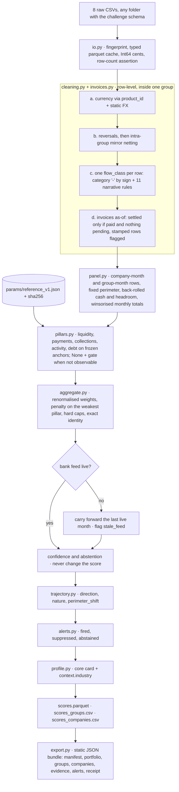

# How the X-Ray score works

This document is the **source of truth** for the X-Ray engine v2: what is measured, in which
order, with which frozen constants, and how any number on screen can be recomputed by hand.
Read it before changing anything under `engine/src/xray_engine/` or
`params/reference_v1.json`.

**Thesis.** X-Ray is a **measurement engine, not a trained model**. The dataset carries no
outcome label — no default, no rating, no "healthy" flag — so anything trained on it would
have to learn a target we wrote ourselves: it would learn its own formula and hand it back
with noise. The engine therefore *measures* five observable facts per entity and month
(liquidity, payments to suppliers, collections from customers, activity, debt burden), maps
each one to 0–100 through **frozen anchor tables**, combines them with a
**non-compensatory** rule, and publishes next to the number everything needed to audit it:
the exact additive explanation, the confidence, the gates that fired and the validation
receipt. No statistic of the scored cohort enters a score, so a group scored alone gets the
same number as the same group scored among 250.

Related docs:

- [DECISIONS.md](./DECISIONS.md) — one record per design decision and free parameter, with
  its evidence and status (`DATA` / `DOMAIN` / `JUDGEMENT`)
- [DATA_TRAPS.md](./DATA_TRAPS.md) — every dataset trap, its measured size and the rule that
  neutralises it
- [VALIDATION.md](./VALIDATION.md) — the label-free validation protocol and its results
- [OPEN_QUESTIONS.md](./OPEN_QUESTIONS.md) — what the team still has to decide or confirm
- [../INDUSTRY_CLASSIFICATION.md](../INDUSTRY_CLASSIFICATION.md) and
  [../BENCHMARK_REFERENCE.mdx](../BENCHMARK_REFERENCE.mdx) — context attributes; never score
  inputs
- [../UI_FORMATTING.mdx](../UI_FORMATTING.mdx) — how the numbers below are rendered
- `analysis/*.py` — stdlib-only scripts that regenerate every measured number quoted here
  (`python3 analysis/<name>.py --data <dir>`)

## Design rules

| Rule | Meaning | Enforced by |
|------|---------|-------------|
| **Deterministic** | Same folder + same params file ⇒ byte-identical outputs. No training, no sampling, no LLM in the number. | `test_determinism.py`, check `determinism` |
| **Cohort-independent** | A score depends only on the entity's own rows (plus its group's rows) and the frozen params. | `test_isolation.py`, check `isolation` (tol 1e-9) |
| **Point-in-time** | Month *t* uses only facts knowable at the end of *t*. Snapshot columns never feed past months, with two declared exceptions: the balance row as back-roll anchor and the `granted` limit assumed constant (flagged). | `test_truncation.py`, check `truncation` |
| **`None` is not zero** | A quantity that cannot be observed is `None` with a named **gate**; it is never imputed as 0, 50, 75 or 100. Weights renormalise over what is observable. | `PillarResult.gates`, `test_additivity.py` |
| **Exact explanation** | `score = base + Σ contributions − penalty − cap_adjustment`, to 1e-9, on every row; on screen in integer tenths that add up. | `test_additivity.py`, check `additivity` |
| **Integer cents** | Money is `Int64` cents in account currency until the last aggregation step; mirror matching is integer equality. | `io.py`, `cleaning.py` |
| **Context is not input** | Industry archetype, benchmarks, concentration and the rest of the profile card never reach `pillars.py` or `aggregate.py`. | `test_industry_is_context_only.py` |

## Pipeline



| Module | Responsibility | Contract |
|--------|----------------|----------|
| `io.py` | `dataset_fingerprint`, `build_cache`, `load_tables`; derives the window from the data | `SCHEMAS`, `Window` |
| `cleaning.py` | currency, reversals, mirror netting, flow classes; no row is ever dropped, only flagged | `CLEAN_TRANSACTION_COLUMNS` |
| `invoices.py` | invoice cleaning and as-of days beyond terms | `CLEAN_INVOICE_COLUMNS`, `DBT_COLUMNS` |
| `panel.py` | entity-month rows, perimeter, cash back-roll, robust sums | `PanelRow` / `PANEL_COLUMNS` |
| `pillars.py` | five pure functions `PanelRow → PillarResult` | `PILLAR_INPUT_KEYS`, `PILLAR_GATES` |
| `aggregate.py` | branch, penalty, caps, identity, confidence, abstention | `ScoreParts`, `DeltaParts` |
| `trajectory.py` | past-only direction and nature | `Trajectory` |
| `alerts.py` | alert inbox with suppression reasons | `Alert`, `SuppressedBy` |
| `profile.py` | core profile card, context | `ProfileCard`, `PROFILE_KEYS` |
| `reference.py` | `fit-reference`: the only step that looks at a cohort | `Params` |
| `scoring.py`, `cli.py` | orchestration, `xray-score predict / validate / fit-reference` | `EntitySnapshot`, `SNAPSHOT_SCHEMA` |
| `export.py` | static bundle, integer tenths by largest remainder | `contracts/xray-export-v1.schema.json` |
| `validation.py` | label-free checks → `artifacts/validation.json` | see [VALIDATION.md](./VALIDATION.md) |

`pillars.py`, `aggregate.py`, `trajectory.py` and `alerts.py` are **pure**: no I/O, no data
frames, no imports outside `contracts`. Everything they need is pre-aggregated, as-of, in
one `PanelRow`.

## What a run reads

| Rule | Value | Why |
|------|-------|-----|
| Records | 2,556,437 transactions and 897,894 invoices, asserted against a stdlib `csv` recount | 74,512 descriptions contain quoted newlines and the file contains NUL bytes; a line-based reader silently miscounts |
| Window | complete months only; on the challenge data **2024-09 … 2026-08**; derived from the data (last complete month = month before the maximum date's month, unless that date is a month end) | 2026-09 is a single day (9,228 booked rows) |
| Status | `pending` dropped (6,579 rows); blank = booked (29,839 rows) | blank rows are needed for the cash back-roll identity |
| Date | `date`, never `value_date` | `value_date` is a feed artefact |
| Money | `Int64` cents in **account** currency; converted to EUR after summing | exact mirror matching, no float drift |
| Schema | explicit `schema_overrides` for every column | small folders have all-null columns; nothing is inferred |

The same code path runs on **any folder** holding the eight CSVs — fewer companies, other
currencies, shorter history — which is what a hidden test looks like.

## The unit: group first, company as drill-down

The scoring unit is the **consolidated group** with a **fixed perimeter per group-month**;
every company is scored too and shown as drill-down.

- **Why the group.** 60% of mirror pairs cross company boundaries inside a group and carry
  the large amounts; subsidiaries are swept to a treasury centre; debt concentrates in one
  member. A company-level ratio often measures treasury plumbing, not health.
- **How.** Group rows **sum member flows in cents first and take ratios afterwards**. A group
  score is never an average of company scores. Invoice windows pool the invoices of all
  members.
- **Company rows** use the same columns (`PANEL_COLUMNS`) and the same pillars. Intra-group
  mirror legs are excluded from a company's operating flows and reported apart as
  `intragroup_in` / `intragroup_out` (context, never scored).
- **Swept subsidiaries inherit the group's liquidity.** A company whose cash is swept to the
  group (zero-balance accounts holding a marginal share of group cash, or repeated sweep
  pairs; thresholds in `params.liquidity.swept_*`) gets the **group** liquidity pillar with
  gate `inherited_from_group` and flag `inherited_from_group`. Its empty account is a
  treasury policy, not stress.
- **Perimeter.** `perimeter(g, m)` = accounts whose first booked month ≤ *m*, of members
  whose first booked month ≤ *m*. `created_at` is never used. `perimeter_changed` marks a
  month in which a member or an account starts reporting (events deduplicated to
  company-month). Every delta that compares two windows is **like-for-like**: only accounts
  reporting in both windows.

Both `scores_groups.csv` and `scores_companies.csv` are always written, because the unit of
the hidden test is not confirmed (see [OPEN_QUESTIONS.md](./OPEN_QUESTIONS.md), Q-01).

## Cleaning

Order is binding: **currency → reversals → mirror netting → flow classes → invoices**. Every
step is a row-wise rule or a join inside one `group_id`, and pairing only joins rows of the
same calendar month, so month *t* never changes when later rows arrive.

### Currency

Transactions have no currency column; a row inherits the currency of its `product_id`
(`banking_products` / `debt_products`). Conversion to EUR uses a **static table** frozen in
`params.fx`. `exchange_rate` is never used: it relates account currency to the company's
*accounting* currency (not EUR), in the inverse direction of the naive reading, and 4–14% of
cross-currency rows are inconsistent. Rows in a currency outside the table (about 12,000)
or of a product absent from both product files (1,313) **stay in counts and leave value
aggregates**; the panel exposes `fx_excluded_share` and `orphan_product_share`.

### Reversals and mirror netting

Netting runs **before any category logic, on all categories**.

1. **Reversals**: same `product_id`, opposite sign, equal cents, within ±1 day → both legs
   dropped from operating measures.
2. **Mirror pairs** (single recipe): booked in-window rows of the **same group**,
   **different `product_id`**, opposite sign, **same account currency**, **equal integer
   cents**, `|amount| ≥ 100 EUR`, `|Δdate| ≤ 1 day`, extended to ≤ 3 days only when the
   earlier leg falls on a Friday or Saturday (weekend bridge). Matching is 1:1, nearest date
   first, independent of row order (passes by day gap 0, +1, −1, …; ties ranked by
   `transaction_id`). Both legs get `mirror_id` and `mirror_scope ∈ {intra_company,
   intra_group}` and leave every operating measure.

`category == 'transfer'` is **never** the criterion: only a third of mirror rows carry it
(34%), while 42% are labelled `payment` / `collection`. Unmatched `transfer` rows are still
class `internal`. The verified headline — mirror pairs are **46.6% of outflow value** against
1.9% for a 9–11-day date placebo and 0.001% for a ×1.01 amount placebo — was measured with
the pairing alone on a flat ±2-day window. The shipped two-step recipe nets **8.7% of
outflow rows and 59% of outflow value** (reversals 42%, mirror pairs 17%: both steps compete
for the same round trips; date placebos 1.9% and 0.3%) (`analysis/mirrors.py`). An entity
whose operating inflow nets to exactly 0 gets the flag `no_external_revenue` and an activity
pillar of `None` — never a 0 score.

### Flow classes

Every booked row gets exactly one `flow_class`; first rule that applies:

| # | Condition | `flow_class` |
|---|-----------|--------------|
| 1 | leg of a reversal or of a mirror pair | `internal` |
| 2 | category `transfer` | `internal` |
| 3 | category `-`: first matching **narrative rule** of `params.dash_rules`; otherwise **by sign** (`> 0 → op_in`, `< 0 → op_out`) | rule's class / by sign |
| 4 | `amount < 0` in `debt_repayment`, `interest_charge` | `debt_service` |
| 5 | `amount > 0` in `collection`, `bulk_collection`, `pos_settlement`, `cash_settlement` | `op_in` |
| 6 | `amount < 0` in `payment`, `bulk_payment`, `salary`, `tax`, `social_security`, `utility`, `fee` | `op_out` |
| 7 | `investment_deployment`, `investment_return` | `financial` |
| 8 | anything else (refunds, withdrawals, zero amounts) | `other` |

Category `-` is a quarter of all rows and sits on operating accounts, so it cannot be thrown
away. Sign predicts the flow family at 0.89 (inflows) / 0.93 (outflows) on 1.9 M labelled
rows; only the **11 narrative rules with measured precision ≥ 0.83** override the sign
(internal ledger adjustments and payouts → `internal`; amortisation patterns →
`debt_service`; social security, tax agency, utilities, fees → `op_out`; one foreign
transfer template → `op_in`). Retention adjustments (`RETENCION`, `AP.RET.DST`: 406 rows that
carry 35% of all `-` value) are class **`adjustment`** and excluded from everything. Revolving
credit lines are operating accounts: their rows are classified like any other.

### Invoices as-of

Only `document_type == 'invoice'`. `settled_date = payment_date` **iff** `status == 'paid'`
and `pending_amount == 0`; otherwise null (on open invoices `payment_date` is an expected
date). Payment dates after the extraction date stay null; impossible dates are dropped. AR is
`amount > 0`, AP is `amount < 0`. A row with `due == issue` and `settle == due` is
**ERP-stamped**: it says nothing about behaviour and is excluded at **row** level.

## Panel

One row per entity-month, identical columns for companies and groups (`PANEL_COLUMNS` in
`contracts.py` documents every column, its unit and its window).

- **Robust monthly totals.** Every trailing-window sum adds monthly totals **winsorised at
  3× the median positive month of the same window** — as-of by construction. There are no
  row-level caps and **no epsilon floors**: a zero or undefined denominator makes the metric
  `None` with a gate (`buffer_undefined`, `coverage_undefined`, `burden_undefined`).
- **No seasonality.** Month-of-year R² is at the noise floor (0.505 against a permutation
  null of 0.479), so nothing is deseasonalised and params hold no seasonal factors.
- **Cash** is reconstructed per product by back-rolling from each balance row's own date:
  `balance(d) = anchor − Σ booked amounts dated in (d, anchor_date]`. Cash products are
  `checking`, `saving`, `wallet`; sentinel anchors (`|balance| ≥ 9e8`) are dropped. The panel
  keeps the **month-end** cash and the **intra-month minimum**.
- **Headroom** is reconstructed **per month** by back-rolling each credit line:
  `headroom(m) = max(0, |granted| − drawn(m))`, with the limit taken from the snapshot and
  assumed constant (flag `limit_assumed_constant`). Headroom lives **only** in the liquidity
  pillar.
- `no_cash_anchor_share` reports cash products that move but have no balance row: for those
  entities older months are under-stated.

## The five pillars

Each pillar is a pure function `PanelRow → PillarResult(score, inputs, gates, evidence)`.
Anchors are **piecewise-linear tables** frozen in params, clamped to their end values.
`score = None` always comes with at least one gate that says why.

| Pillar | Weight | Measures | Source |
|--------|--------|----------|--------|
| `liquidity` | 0.30 | days of outflows covered by cash + undrawn lines | transactions, balances |
| `payments` | 0.20 | days beyond terms paying suppliers (AP) | invoices |
| `collections` | 0.15 | days beyond terms collecting from customers (AR) | invoices |
| `activity` | 0.20 | operating coverage and like-for-like inflow momentum | transactions |
| `debt` | 0.15 | debt service as a share of operating inflow | transactions |

### Liquidity

```
daily_outflow = median monthly (op_out + debt_service), trailing 3 complete months / 30
                (12-month median when the 3-month one is 0; else None → buffer_undefined)
buffer_days   = (cash + headroom) / daily_outflow
P_liquidity   = 0.6 · A(buffer at month end) + 0.4 · A(buffer at the intra-month minimum)
```

Anchors are **segmented by size band**. The band comes from the annualised trailing-12-month
operating inflow (as-of, winsorised) with the EU SME turnover thresholds — micro < 2 M€,
small < 10 M€, medium < 50 M€, large ≥ 50 M€. Per band, `fit-reference` freezes the buffer
days at the reference quantiles and maps them to fixed scores:

| Reference quantile of the band | 0 days | p10 | p25 | p50 | p75 | p90 |
|--------------------------------|--------|-----|-----|-----|-----|-----|
| Score | 0 | 15 | 35 | 60 | 85 | 100 |

Reason: under one absolute table the pillar is a size proxy — its median falls from about 85
for micro groups to 18 for large ones (34 with headroom), and the gradient survives mirror
netting, inclusive denominators and capping (`analysis/liquidity_size_gradient.py`). Large
groups run lean cash and live on lines; that is structure, not distress. Setting
`params.liquidity.segmented = false` switches every band to the **absolute fallback**:

| Buffer days | 0 | 13 | 27 | 62 | 180 |
|-------------|---|----|----|----|-----|
| Score | 0 | 35 | 60 | 85 | 100 |

The 13 / 27 / 62-day points are the quartiles of small-business cash buffer days published
by the JPMorgan Chase Institute; every value read from this table carries the gate
`absolute_anchors`.

| Gate | Meaning | Score |
|------|---------|-------|
| `buffer_undefined` | no outflow in the last 3 nor 12 months | `None` |
| `no_cash_anchor` | no cash product has a usable balance anchor | `None` |
| `inherited_from_group` | swept subsidiary: value taken from the group row | group's score |
| `absolute_anchors` | read from the absolute table | unchanged |

### Payments (AP) and collections (AR)

**As-of days beyond terms.** For month end *T*: invoices with `due_date ∈ (T − 90 d, T]`,
ERP-stamped rows excluded.

```
days_i = settle_i − due_i      if settled by T
       = T − due_i             if still open at T (it keeps ageing)
days_i clipped to [−30, 90];   DBT = Σ w_i · days_i / Σ w_i,   w_i = EUR amount
```

| Days beyond terms | −10 | 0 | 15 | 30 | 60 | 90 |
|-------------------|-----|---|----|----|----|----|
| Score | 100 | 80 | 70 | 50 | 40 | 30 |

The 0 → 90-day points follow the D&B Paydex days-beyond-terms scale (80 = on terms, 70 = 15
days, 50 = 30, 40 = 60, 30 = 90). **AP and AR are separate pillars, never averaged.**

Gate: **≥ 10 invoices AND Kish effective n ≥ 5 AND stamped share < 50%** in the window,
otherwise `None` — never a neutral 50.

| Gate | Meaning |
|------|---------|
| `no_invoices` | nothing falls due in the last 90 days |
| `stamped_regime` | ≥ 50% of the window is ERP-stamped: dates do not measure punctuality |
| `few_invoices` | fewer than 10 invoices with real dates |
| `low_effective_n` | value concentrated in so few invoices that the weighted mean is unreliable (`n_eff = (Σw)² / Σw² < 5`) |

Punctuality is scarce by nature: on the challenge data 83 of 250 groups have no invoices at
all and the gate leaves **120 (AP) / 96 (AR) groups** scorable at 2026-08
(`analysis/invoices_asof.py`; the first, cohort-based design reached 98 / 52 in the
verification run). This is why the pillar is nullable and the weights renormalise.

### Activity

Mean of the available sub-scores:

1. **Operating coverage** = `Σ op_in / Σ (op_out + debt_service)`, trailing 6 months,
   winsorised months.

   | Coverage | 0.70 | 0.85 | 0.95 | 1.00 | 1.10 | 1.25 |
   |----------|------|------|------|------|------|------|
   | Score | 0 | 25 | 45 | 60 | 80 | 100 |

2. **Like-for-like momentum** = mean monthly `op_in` of the last 3 complete months / mean
   monthly `op_in` of the prior 6 (minimum 4) months, **same accounts in both windows**,
   winsorised. Needs ≥ 7 observed months.

   | Momentum | 0.4 | 0.6 | 0.8 | 1.0 | 1.2 | 1.5 |
   |----------|-----|-----|-----|-----|-----|-----|
   | Score | 0 | 20 | 45 | 70 | 85 | 100 |

| Gate | Meaning | Score |
|------|---------|-------|
| `no_external_revenue` | all inflow is intra-group | `None` |
| `coverage_undefined` | no outflow in the window | coverage missing |
| `short_history` / `no_base` | < 7 months, or no comparison months on the same accounts | momentum missing |
| `coverage_only` / `momentum_only` | one sub-score available | that sub-score |

### Debt

```
burden = Σ debt_service / Σ op_in, trailing 12 months, winsorised months (min 6 months)
```

| Burden | 0.00 | 0.02 | 0.08 | 0.25 | 0.60 |
|--------|------|------|------|------|------|
| Score | 100 | 75 | 50 | 25 | 0 |

These are **frozen population anchors** (the challenge groups sit at p50 ≈ 0.018, p75 ≈
0.074, p95 ≈ 0.235), not a domain table — and the docs say so. A DSCR proxy was dropped: its
half-versus-half Spearman is 0.14 because net operating flow from bank data is ≈ 0 by
construction.

| Gate | Meaning | Score |
|------|---------|-------|
| `no_debt` | no debt product **and** no debt service in the window | `None` (weights renormalise; not an imputed 75) |
| `burden_undefined` | no operating inflow in the window | `None` |

## Aggregation

```
branch        = pillars with a score (coverage branch)
w_ef,k        = w_k / Σ_{j ∈ branch} w_j                       (weights renormalised, no imputation)
level_w       = Σ_k w_ef,k · P_k
penalty       = min( λ · max(0, τ − min_k P_k), level_w )      λ = 0.5, τ = 45 points
cap_adjustment= max(0, level_w − penalty − ceiling)             lowest ceiling that holds
score = level = level_w − penalty − cap_adjustment             ∈ [0, 100]
```

- **Non-compensatory.** A strong pillar cannot fully buy back a broken one: below 45 points
  the weakest pillar costs half of its shortfall, at most 22.5 points. Capping the penalty at
  `level_w` keeps the score inside [0, 100] without a clip, so the identity below stays exact.
- **Hard caps**, only with a live feed:

  | Cap | Condition | Ceiling |
  |-----|-----------|---------|
  | `negative_liquidity` | `cash + headroom < 0` in ≥ 3 of the last 6 month ends, and no cash product lacks an anchor | 40 |
  | `weak_payments` | payments pillar < 25 | 50 |

  `caps_fired` lists every rule that holds, strictest first. With the current payments table
  (floor 30 at 90 days) `weak_payments` cannot bind; see [DECISIONS.md](./DECISIONS.md) D-46.
- **No confidence shrink, no smoothing.** The score is the level of the month.
- **Bands** (frozen, decided on integer tenths so screen and engine agree):

  | Band | `critical` · Crítico | `watch` · Vigilancia | `stable` · Estable | `solid` · Sólido |
  |------|------|------|------|------|
  | Score | < 40 | 40 – 60 | 60 – 80 | ≥ 80 |

Effective weights of the main branches:

| Branch | liquidity | payments | collections | activity | debt |
|--------|-----------|----------|-------------|----------|------|
| all five | 0.300 | 0.200 | 0.150 | 0.200 | 0.150 |
| no debt | 0.353 | 0.235 | 0.176 | 0.235 | — |
| bank + debt (no invoices) | 0.462 | — | — | 0.308 | 0.231 |
| bank only | 0.600 | — | — | 0.400 | — |

## Exact explanation

With `B_k` the frozen reference median of pillar *k* (`params.reference.medians`):

```
base            = Σ_k w_ef,k · B_k                 (one base per coverage branch)
contribution_k  = w_ef,k · (P_k − B_k)
score           = base + Σ_k contribution_k − penalty − cap_adjustment        (|error| ≤ 1e-9)
```

Month on month:

```
Δscore = Δbase + Σ_k Δcontribution_k − Δpenalty − Δcap_adjustment            (|error| ≤ 1e-9)
```

A pillar missing on one side contributes 0 on that side; `Δbase` is non-zero only when the
coverage branch changes, and makes a change of coverage visible instead of hiding it inside
the pillars. Both identities are property-tested on every branch and re-checked on every
real row. The bundle emits `[base, contributions…, −penalty, −cap]` in **integer tenths by
largest remainder**, so the numbers on screen add up to the displayed score exactly.

Worked example (illustrative values, `B_k = 60`): liquidity 20, payments 80, activity 65,
no collections, no debt → `w_ef = 0.429 / 0.286 / 0.286`; `level_w = 50.0`; `penalty =
0.5 · (45 − 20) = 12.5`; no cap → **score 37.5, band Crítico**. On screen, in tenths: base
60.0, liquidity −17.1, payments +5.7, activity +1.4, penalty −12.5 = 37.5 (liquidity is
−17.14; the largest-remainder rule gives it the spare tenth so that the column adds up).

## Live-feed gate and carry-forward

```
ratio = rows(t−2 … t) / (3 · median monthly rows(t−12 … t−4))
stale ⇔ ratio < 0.5  OR  rows(t−2 … t) == 0  OR  (group level) a month with zero rows
short history (baseline undefined) ⇒ live, unless rows(t−2 … t) == 0
```

A stale feed is a **data fact, not a health fact**: when social-security payments disappear,
total row volume falls to 0.17× — the connector died, the company did not stop paying. When
the gate fails:

- the explanation block (pillars, weights, base, contributions, penalty, caps, score, band)
  is **carried forward verbatim from the last live month**; `carried_from` names it and every
  pillar gets the gate `carried_forward`;
- flag `stale_feed`; penalty, caps and every absence-based signal are off; the month is
  abstained with reason `stale_feed`; the only possible alert is `stale_feed`;
- the month's own arithmetic survives in `level` for audit; without an earlier live month
  nothing is copied.

## Confidence and abstention

`confidence = c_history × c_coverage × c_quality`, each in [0, 1], from tables in
`params.confidence`. **It never changes the score.** It is displayed as *alta* (≥ 0.75),
*media* (≥ 0.50) or *baja*, next to its three parts.

| Part | Input | Shape |
|------|-------|-------|
| `c_history` | `months_observed` | 0 → 0, 3 → 0.4, 6 → 0.7, 12 → 0.9, 18 → 1.0 |
| `c_coverage` | sum of nominal weights of available pillars | 0.3 → 0.5, 0.5 → 0.7, 0.65 → 0.85, 0.85 → 0.95, 1 → 1 |
| `c_quality` | product of factors for `dash_share`, `fx_excluded_share`, `orphan_product_share`, `no_cash_anchor_share`, × 0.95 when `limit_assumed_constant`, × 0.6 when the feed is stale | see params |

**Abstention**: `abstained ⇔ months_observed < 4 OR feed dead OR no bank-based pillar
(liquidity / activity) available`. A number is **still emitted**, no alert fires, and
`unlock_hint` says in Spanish what would lift the abstention (reasons: `stale_feed`,
`short_history`, `no_bank_pillar`).

## Trajectory

Trajectory lives **outside the arithmetic** (adding a delta to a level built on rolling
windows double counts) and is past-only: a verdict never changes when later months arrive.

```
delta3    = score(t) − score(t − 3)
sigma_own = std of the entity's monthly score changes, floor 2 points
direction = improving / deteriorating   iff |delta3| ≥ max(6, 1.5 · sigma_own);   else stable
```

| Field | Rule |
|-------|------|
| `nature = shock_pending` | first month in which a direction fires |
| `nature = structural` | the same direction holds 2 consecutive months |
| `nature = bump` | the move reverts (≥ 50%) within 2 months |
| `direction = perimeter_shift` | a perimeter change within (t − 3, t] brought > 20% of operating inflow (`new_perimeter_inflow_share_3m`): no improvement / deterioration call |
| availability | ≥ 6 scored months; none on a carried (stale) month |

`pillars_moved` lists the pillars that moved ≥ 5 points in the direction of `delta3`
(evidence for the explanation, not a condition). `persistence_months` and `detected_since`
date the current run.

### Slow drift: the long horizon

Erosion is invisible to a three-month delta: the brief's canonical trajectories move
2–3 points a quarter and stay `stable` in every month (Q-05). A robust Theil-Sen slope of
the monthly score runs next to the short verdict, over the live months of
`t − long_horizon + 1 .. t` that are measured like month `t`, stopping at the latest
`perimeter_shift` flag:

```
drift_points = theil_sen(score over ≤ long_horizon = 12 months) × months spanned
drift_call   = improving / deteriorating   iff |drift_points| ≥ max(8, 2 · sigma_own)
```

`long_min_months = 6` comparable live months are needed for any measurement; a month whose
two horizons disagree calls with the recent move (`horizon = short`, unconfirmed) and says
so (`trajectory_note`). The long call is confirmed like a short one: `shock_pending` in its
first month, `structural` once it holds two months. `Trajectory` carries `horizon`
(`short` / `long` / `both`), `drift_points`, `drift_months` and `drift_call`; the drift is
descriptive and never enters the score. The export leaves the drift to the alert copy and
to an evidence row ("Deriva acumulada del score"), so the frozen bundle contract is
unchanged. Exact tests: `engine/tests/test_canonical_drift.py`.

## Alerts and suppression

| Kind | Fires when |
|------|-----------|
| `deterioration_structural` / `improvement_structural` | direction with `nature == structural`, first month of the run; when the long horizon makes the call (`horizon = long` / `both`) the detail names the slow drift ("deriva lenta y sostenida") with its accumulated points and months |
| `level_critical` | score < 35 on a live feed, first month of each spell |
| `cap_fired` | `cap_adjustment > 0`, first month of each spell of the binding rule |
| `stale_feed` | first month of each stale spell; never suppressed |

State is `fired`, `suppressed` or `abstained`; a non-fired alert always carries
`suppressed_by {reason, since, until}`. **Hard suppression applies in the perimeter-change
month only** (reason `perimeter_change`): a new account runs at a median 0.8× of its plateau
in its first month and is back at parity the month after; beyond that, like-for-like deltas
and `perimeter_shift` do the work that waiting cannot. Abstained months emit no alert (reason
`abstention`). Suppressed alerts are shown, not hidden: the product's claim is *decision
quality*, and a suppressed false alarm is part of the evidence.

## Profile card and context

`profile.py` builds a core card of 12 attributes, each `{key, value, evidence, coverage}`:
country, size band, ERP tier / has invoices, group role, treasury structure, financing
profile + headroom, history depth, seasonality, customer concentration, payment policy,
revenue model, data quality. It is **product surface and gates, never normalisation**.

- **Concentration** (top-1 counterparty ≥ 20% of total monthly collections in ≥ 6 of the
  trailing 12 months; 29.6% prevalence, bimodal) is a segment flag — not a pillar input, not
  an alert.
- **Industry archetype** is attached as `context.industry` only. About 70% of companies fall
  in its fallback class, so it is a label, not an axis.
- **Benchmarks** are a sourced context sentence. Their metric (invoice → cash days) is not
  days beyond terms and the two must not be equated.

## Frozen parameters and cohort independence

`params/reference_v1.json` holds **every** constant: weights, anchors, size-band tables, λ/τ,
caps, bands, live-feed and trajectory thresholds, confidence tables, FX table, narrative
rules with their measured precision, reference medians `B_k`. Its `sha256` is taken over the
canonical dump; `load_params` refuses a file whose hash does not match its content, and
`predict` stamps `params_hash` on every row and on the bundle manifest.

`fit-reference` is the **only** step that looks at a cohort. It measures, once, on the
250-group panel: the per-band liquidity quantiles, the reference medians `B_k` and the
precision / support of each narrative rule. Hand-set values are kept as they are.
`predict` never refits. Hence the **guarantee**: scoring 60 groups alone gives the same rows
as the full run (tolerance 1e-9) — the property a hidden test of unseen entities needs.

## Outputs

| File | Content |
|------|---------|
| `artifacts/scores.parquet` | one row per entity-month (`SNAPSHOT_SCHEMA`): score, band, pillars, weights, contributions, penalty, caps, confidence parts, trajectory, gates, flags, series, hashes |
| `artifacts/scores_groups.csv`, `artifacts/scores_companies.csv` | flat CSVs for any scoring script |
| `artifacts/validation.json` | label-free checks (see [VALIDATION.md](./VALIDATION.md)) |
| bundle (`--export-dir`) | `manifest.json`, `portfolio.json`, `groups/<id>.json`, `companies/<id>.json`, `evidence/<id>.json`, `alerts.json`, `receipt.json` — contract `contracts/xray-export-v1.schema.json` |

`artifacts/`, the bundle and the dataset are git-ignored and never committed.

## Operations

```bash
export PATH="$HOME/Library/Python/3.12/bin:$PATH"

# Measure and freeze the cohort-dependent constants (once per reference dataset)
make fit-reference XRAY_DATA=/path/to/output

# Score any folder with the eight CSVs: parquet + group and company CSVs
uv run --package xray-engine xray-score predict /path/to/folder --out artifacts

# Same, and write the static bundle the web app reads
make export XRAY_DATA=/path/to/folder

# Label-free validation → artifacts/validation.json (exit code 1 on a failed check)
make validate XRAY_DATA=/path/to/folder

# Property tests on the synthetic dataset; add the real-data ones with XRAY_DATA
make test-engine
make test-engine-data XRAY_DATA=/path/to/output
```

## How this answers the brief

### The six questions

| Question (brief) | Engine output | Honest limit |
|------------------|---------------|--------------|
| **Quién está sano** | `score` and `band`; `solid` ≥ 80 requires every observable pillar to be strong, because the penalty is non-compensatory | bank-only entities are judged on two pillars; confidence says so |
| **Quién está mejorando** | `direction = improving`, `improvement_structural` alert, positive `delta_parts`; slow drift called by the Theil-Sen long horizon | the brief's 45 → 65 case is alerted ≥ 6 months before month 24; the 82 → 68 erosion still misses the frozen 8-point bar (Q-05, `test_canonical_drift.py`) |
| **Quién empieza a torcerse** | `direction = deteriorating` while the band is still `stable` / `solid`; `pillars_moved` names the pillar | same threshold as above |
| **Bache o caída** | `nature`: `shock_pending` → `bump` if it reverts within 2 months, `structural` if it holds 2 months | online, a spike is only *pending*; the bump is confirmed a posteriori, by design |
| **Por qué ha cambiado** | exact `delta_parts` (base, per-pillar, penalty, cap) + `Evidence` rows behind each pillar | explains the measurement, not causes outside the data |
| **Cuándo se vio venir** | `detected_since`, `persistence_months`; detection delay measured by injected deteriorations | the data shows no lead–lag between signals; anticipation is measured, not promised |

### The requirement table

| Requirement (brief) | Status | How it is met |
|---------------------|--------|---------------|
| Predicción sobre el test oculto | Obligatorio | `xray-score predict <folder>` on any folder, frozen params, isolation-tested; group **and** company CSVs |
| Señal en las dos direcciones | Obligatorio | symmetric direction rule; `improvement_structural` alert; anchors reward strength (≥ 80) as much as they punish weakness |
| Trayectoria, no foto | Obligatorio | 24 monthly scores per entity, `direction`, `nature`, `persistence_months`; pillars built on trailing windows, not on the last month alone |
| Explicación | Obligatorio | exact additive and delta identities, gates, evidence rows, all in the bundle |
| Producto encima del score | Obligatorio | static web app on the bundle: portfolio, group and company views, alert inbox, profile card, receipt |
| Comprador identificado | Obligatorio | product-level answer, outside this document; the engine's contribution is a verdict that can be handed to a third party with its receipt |
| Demo navegable | Obligatorio | static bundle + static site: nothing to run server-side |
| Anticipación medida *(bonus)* | Bonus | injection study: detection delay by shape (spike / step / ramp) and size band, false-alert rate |
| Monitor que avisa *(bonus)* | Bonus | `alerts.json` with fired / suppressed / abstained states and reasons |

## Known limitations

- **No ground truth.** Validity rests on construction (anchors, identities, invariances) and
  on label-free checks; no accuracy figure exists or is claimed.
- **Judgement parameters.** Weights, λ, τ, cap ceilings, band cuts, confidence tables and
  trajectory thresholds are judgement calls, listed one by one in
  [DECISIONS.md](./DECISIONS.md) with the sensitivity test that covers each.
- **Size-band liquidity anchors are a frozen relative scale** within each band. They remove a
  measured structural gradient at the price of reading liquidity against peers of the same
  size; the absolute table is one switch away.
- **Punctuality levels carry an ERP effect.** ERP tier explains far more of the lateness
  level than size does; row-level exclusion of stamped invoices removes the grossest part,
  and the neutrality check reports the rest.
- **Slow drifts.** A 3-month delta with a 6-point floor does not flag drifts of 2–3 points
  per quarter, which is the pace of the two canonical cases of the brief.
- **Limits are snapshots.** `granted` is assumed constant over the window; months before a
  limit change mis-state headroom (flag `limit_assumed_constant`).
- **Back-roll drift.** Products without a balance anchor under-state older months; the
  negative-liquidity cap is disabled for those entities.
- **Static FX.** One rate per currency for the whole window; currencies outside the table
  count rows, not value.
- **Month boundaries.** A mirror pair whose legs fall in different calendar months is not
  netted (the price of truncation invariance).
- **Short histories.** 66 of 250 groups have ≤ 9 live months and 80 have ≤ 10: level yes,
  trajectory late or never.
- **`weak_payments` cap is dormant** under the current payments anchors (floor 30).

## Extending the engine

1. Change constants only in `params/reference_v1.json`, then re-stamp
   (`python -m xray_engine.params params/reference_v1.json`) or re-run `fit-reference`.
2. Add a decision record in [DECISIONS.md](./DECISIONS.md) with evidence and status before
   merging a new parameter.
3. A new panel column goes to `PanelRow` with unit and docstring; the pure core reads
   nothing else.
4. Re-run `make test-engine` and `make validate`; update the *Results* section of
   [VALIDATION.md](./VALIDATION.md).
