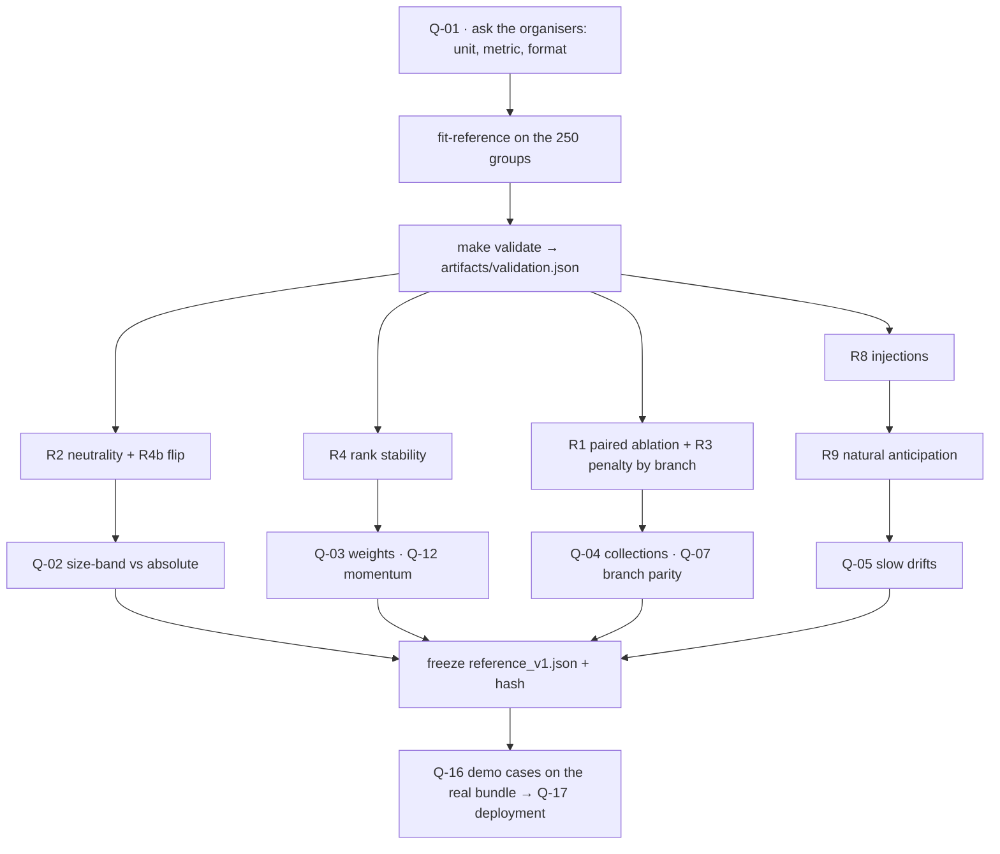

# Open questions for the team

What the team still has to **decide or confirm** about the X-Ray engine. Each question states
why it matters, what we already measured, the options, the **default the engine takes if
nobody decides**, and how to settle it. Nothing here blocks a run: every default is
implemented, flagged and reversible from `params/reference_v1.json`.

Related docs:

- [ENGINE.md](./ENGINE.md) — the design these questions would change
- [DECISIONS.md](./DECISIONS.md) — the record behind each default (D-nn)
- [VALIDATION.md](./VALIDATION.md) — the check that settles most of them (P-n, R-n)
- [DATA_TRAPS.md](./DATA_TRAPS.md) — the traps quoted as T-nn

## Order of resolution

## Overview

| Id | Question | Priority | Default in the engine | Settled by |
|----|----------|----------|-----------------------|------------|
| Q-01 | Unit and metric of the hidden test | **blocker for the leaderboard** | both group and company CSVs, every month | asking the organisers; a draft submission |
| Q-02 | Size-band or absolute liquidity anchors | high | size-band (`liquidity.segmented = true`) | R2 under both settings, R4b flip |
| Q-03 | Pillar weights | high | 30 / 20 / 15 / 20 / 15 | R4; the leaderboard if a metric exists |
| Q-04 | Do collections (AR) belong in the score? | high | yes, weight 0.15, separate pillar | R1 variant nulling AR only |
| Q-05 | Slow drifts: the brief's own canonical cases read as `stable` | high | 3-month delta, 6-point floor | **Mostly closed**: Theil-Sen long horizon + drift-named alerts shipped; the 82 → 68 case still misses the frozen bar (see the question) |
| Q-06 | `weak_payments` cap is dormant; Paydex tail | medium | cap kept, cannot fire | team decision |
| Q-07 | Coverage-branch parity: penalty minimum and pillar medians | medium | minimum over all available pillars | R1, R3 |
| Q-08 | Invoice window: 90 or 120 days | medium | 90 days, clip [−30, 90] | R4b flip |
| Q-09 | Confidence in error units | medium | hand-set tables | R5, R1 |
| Q-10 | ERP effect on punctuality level | medium | stamped rows excluded; effect reported | R2 (ERP tier) |
| Q-11 | Band edges: cap at exactly 40, critical alert at 35 | low | ceiling 40 ⇒ *Vigilancia*; alert at 35 | team decision |
| Q-12 | Momentum inside the level | low | kept, half of the activity pillar | R4, R8 P(structural \| spike) |
| Q-13 | Concentration threshold | low | 20% in ≥ 6 of 12 months, flag only | product decision |
| Q-14 | Static FX rates | low | 22-currency table | R4b flip ±20% |
| Q-15 | Mirror pairs across a month boundary | low | not netted | `analysis/mirrors.py` count |
| Q-16 | Demo cases to film | **needed for the video** | none chosen | the checklist below, on real engine output |
| Q-17 | Deployment | **needed for the demo URL** | static bundle + static site prepared, not deployed | team lead |
| Q-18 | Wording of the context modules | low | context only | owners of those docs |

---

## Q-01 · Unit and metric of the hidden test

- **Why it matters.** It decides what file we hand in and whether any `JUDGEMENT` parameter
  can be tuned against something real.
- **What we know.** The brief says the prediction on the hidden test "es lo que entra en el
  leaderboard" (`track.md`, requirement table) and that the organisers provide "el test
  oculto, el script de scoring y el leaderboard" (`track.md`, last section). It also speaks
  of "250 empresas" while the dataset has 250 **groups** and 1,286 companies, which suggests
  that the brief's *empresa* is our *group* and that the hidden set is 60–80 groups. None of
  this is confirmed.
- **To ask the organisers.** (1) Unit: group or company? (2) Which months: the last one or
  all? (3) File format and id column. (4) Metric: rank agreement, error against a hidden
  number, direction hits, something else? (5) Does the hidden folder carry the same eight
  CSVs? (6) How many submissions are allowed?
- **Default.** `xray-score predict <folder>` writes `scores_groups.csv` **and**
  `scores_companies.csv` for every month of any folder; adapting to a submission format is a
  few lines once it is known.
- **If a metric exists.** Draft submissions become the cheapest test of every `JUDGEMENT`
  record, starting with Q-02 and Q-03. Tune only what R4 shows to be influential, and keep
  the frozen-params discipline (one new `reference_v*.json` per attempt, hash recorded).

## Q-02 · Size-band or absolute liquidity anchors

- **Why it matters.** Liquidity is the heaviest pillar (0.30; 0.60 for bank-only entities).
- **What we know.** Under absolute anchors the median pillar falls from about 85 (micro) to
  18 cash-only / 34 with headroom (large), and the gradient survives every variant tried
  (D-33, T-41). Large groups run lean cash on credit lines. The bands hold 33 / 50 / 79 / 63
  groups with a defined buffer at 2026-08, so the outer quantile anchors are thin.
- **Options.**
  - **A — size-band anchors (default).** Frozen per-band quantile tables. Keeps isolation.
    Cost: liquidity becomes a *frozen peer scale within size band*; a judge may say "you
    brought peers back". Answer: yes, frozen once, stated on screen, and one switch away.
  - **B — absolute anchors.** A pure public scale (13 / 27 / 62 days). Cost: the score ranks
    size; remove size from the neutrality suite and say on screen that large groups run lean.
- **Settled by.** R2 (excess η² by size band under both settings), R4b (`segmented = false`:
  how many groups change band), and the hidden metric if there is one.
- **Do not.** Percentile-normalise at scoring time: it breaks isolation (P1).

## Q-03 · Pillar weights

- **What we know.** No data can set them. They are also not the effective weights: most
  entities lack invoices or debt, so the common branches are 0.60 / 0.40 and 0.46 / 0.31 /
  0.23 (D-42).
- **Options.** Keep 30 / 20 / 15 / 20 / 15; flatten to equal weights; raise liquidity.
- **Settled by.** R4: if Spearman stays ≥ 0.90 under ±0.10 the choice is immaterial and the
  current priors stand; if not, the unstable pillar is the one to discuss.

## Q-04 · Do collections (AR) belong in the score?

- **Why it matters.** The Paydex scale describes a **payer**. Applied to AR it scores the
  behaviour of the group's *customers*: relevant to its cash risk, but not its own conduct.
- **Options.** (a) Keep AR as a pillar (default; late-paying customers are a real cash risk).
  (b) Move AR to context and give its 0.15 to liquidity and activity. (c) Keep it with a
  lower weight.
- **Settled by.** R1 variant that nulls `collections` only: mean shift and rank change. If the
  ranking barely moves, (b) is the more defensible story.

## Q-05 · Slow drifts: the brief's canonical cases read as `stable` — mostly closed

- **Why it mattered.** The brief's two examples (45 → 65 and 82 → 68 over 23 months) move 2–3
  points per quarter. Our direction rule needs |Δ3| ≥ max(6, 1.5 σ), so both would be
  `stable` in every single month — while "quién está mejorando" and "quién empieza a
  torcerse" are two of the six questions.
- **Shipped.** A robust Theil-Sen slope over the last `long_horizon = 12` comparable live
  months (`long_min_months = 6`, `long_threshold = 8` points, `long_sigma_mult = 2`) runs
  next to the three-month verdict: `Trajectory` carries `horizon`, `drift_points`,
  `drift_months` and `drift_call`; the long call confirms like a short one and the
  structural alert's detail names the slow drift. The score is untouched and the export
  keeps the frozen v1 contract (drift via alert copy + evidence row).
  `engine/tests/test_canonical_drift.py` pins the brief's cases end to end.
- **Still open, with numbers.** The improvement case (45 → 65) is alerted with 13 months of
  lead. The erosion case (82 → 68) accumulates only ~7.3 points inside any twelve-month
  window, under the frozen 8-point bar, so it is never called — pinned as an xfail in the
  same file. Settling it is a parameter decision: lower `long_threshold`, lengthen
  `long_horizon`, or fit the bar per size band; each needs the false-alert cost measured by
  the R8 ramp report (see VALIDATION.md).
- **What already helps.** Both cases **cross a band** (watch → stable, solid → stable), and
  the trajectory chart shows the slope.
- **Options.** (a) Add a long-horizon reading next to Δ3 (for example the 12-month delta with
  the same σ logic), reported as `drift`, no new alert. (b) Fire an informational alert on a
  band change that holds two months. (c) Leave it and explain it in the pitch.
- **Constraint.** Any addition must stay past-only (P2) and outside the arithmetic (D-57).
- **Settled by.** R8 ramp results (how late a six-month ramp is called) and a product call.

## Q-06 · `weak_payments` cap is dormant; Paydex tail

- **What we know.** Each invoice is clipped at 90 days and 90 days maps to 30 points, so the
  payments pillar cannot go below 30 and "payments < 25 ⇒ ≤ 50" never fires (D-46). The early
  end of the table (−10 days → 100) is also steeper than Paydex, which grants 100 at about
  30 days early (D-36).
- **Options.** (a) Extend the table with Paydex's next point (120 days → 20) and clip at
  120: the cap binds above roughly 105 value-weighted days. (b) Delete the cap. (c) Move the
  early end to −30 → 100.
- **Default.** Cap kept and documented as dormant.

## Q-07 · Coverage-branch parity: penalty minimum and pillar medians

- **Why it matters.** Two mechanisms can make coverage itself move the score: the minimum of
  five pillars is lower in expectation than the minimum of two (larger penalty for richer
  data), and if the reference medians differ across pillars the base differs by branch.
- **Options.** (a) Minimum over all available pillars (default). (b) Minimum over the bank
  pillars only, which exist in almost every branch. (c) Re-centre anchor tables so that every
  pillar's reference median sits at the same score.
- **Settled by.** R3 (spread of mean penalties across branches) and R1 (mean shift when the
  invoice pillars are nulled on the same groups).

## Q-08 · Invoice window: 90 or 120 days

- **What we know.** The as-of definition removes the censoring wall of the cohort design
  (T-24). Both 90 and 120 days were proposed; 90 days with clip [−30, 90] is implemented and
  leaves 120 (AP) / 96 (AR) of 250 groups scorable at 2026-08, with 13 / 21 groups failing
  only because nothing falls due in the window (`analysis/invoices_asof.py`). A longer window
  scores more entities and reacts more slowly.
- **Settled by.** R4b flip to 60 and 120 days: groups gaining / losing the pillar, rank
  change. Decide together with Q-06, since the clip and the table end at the same point.

## Q-09 · Confidence in error units

- **What we know.** The three tables are hand-set (D-55). Confidence never touches the score,
  so the cost of a wrong table is presentational — but "alta / media / baja" is on screen.
- **Option.** Re-derive `c_history` from R5 (error by months of history) and `c_coverage`
  from R1 (error from missing invoice pillars): confidence = 1 − error / direction threshold,
  clipped to [0, 1].
- **Default.** Tables as they are; bank-only coverage reads 0.7.

## Q-10 · ERP effect on punctuality level

- **What we know.** ERP tier explains far more of the lateness level than size (T-27), and
  the level is a stable trait. Stamped rows are excluded at row level and fully stamped
  entities are gated, which removes the grossest part only.
- **Options.** (a) Accept and disclose (default). (b) Score the deviation from the entity's
  own 12-month base instead of the level — costs the public anchor. (c) Frozen ERP-tier
  tables, as for size bands — more peer scale.
- **Settled by.** R2 on ERP tier, at score level and at pillar level.

## Q-11 · Band edges: cap at exactly 40, critical alert at 35

- **What we know.** Bands are `< 40` critical, `≥ 40` watch. A group capped by
  `negative_liquidity` at exactly 40.0 displays as *Vigilancia*. `level_critical` fires at
  35, not at the band edge.
- **Options.** Ceiling 39.9 (or "capped ⇒ critical" by rule); alert at 40 with a two-month
  hold to avoid flapping. Cosmetic, but visible in a demo.

## Q-12 · Momentum inside the level

- **What we know.** Momentum is a delta living inside a level, while trajectory is kept
  outside to avoid double counting (D-39, D-57). It carries half of the activity pillar, i.e.
  0.10 nominal and 0.20 in the bank-only branch.
- **Options.** Keep (default); coverage only; move momentum to the trajectory layer.
- **Settled by.** R4 (activity weight) and R8 (whether a one-month inflow spike is called
  `structural` because the 3-month window holds it).

## Q-13 · Concentration threshold

- **What we know.** 20% in ≥ 6 of 12 months flags 29.6% of companies; the 6-month cut is
  insensitive, the 20% is a judgement (disclosure conventions start at 10%, credit practice
  often uses 30%). It is a profile flag only (D-63).
- **Decision needed.** Which threshold the product wants to show; it cannot move a score.

## Q-14 · Static FX rates

- **What we know.** The key (account currency) is measured; the rates are a judgement. The
  ARS rate implied by the data is 37% away from the table (D-08). Only multi-currency
  entities are exposed.
- **Option.** Re-derive each static rate as the median implied by same-direction
  `exchange_rate` rows where they are consistent — still frozen, still in params.

## Q-15 · Mirror pairs across a month boundary

- **What we know.** Pairing only joins rows of the same calendar month, which keeps month *t*
  immutable when later rows arrive (P2). A sweep booked on the 31st and mirrored on the 1st
  is therefore not netted.
- **To measure.** How many pairs and how much value the constraint leaves in
  (`analysis/mirrors.py` can count pairs whose legs straddle a month end).
- **Option.** Allow the pair and accept that month *t* may change once, one day into *t* + 1;
  the truncation test would need the same one-day tolerance.

## Q-16 · Demo cases to film

Pick from **real engine output** (the bundle), never from expectations. One case per claim:

| Claim to show | What to look for in the bundle | Candidates from exploration † |
|---------------|--------------------------------|-------------------------------|
| "Red liquidity that is a sweep, not stress" | company with gate `inherited_from_group` inside a multi-member group | any `swept_subsidiary` with low own cash |
| "Improving, but living on a drawn line" | group with `improving` direction and headroom close to zero | — |
| Bump vs fall, side by side | one `bump` and one `deterioration_structural` of similar first-month size | one-month cash dips that reverted: COMP_0180, COMP_0264, COMP_0773, COMP_0128; eroding buffers: COMP_1015 (GROUP_0132), COMP_0763 |
| Payment discipline turning | payments pillar falling with `pillars_moved = [payments]` | COMP_0089 in GROUP_0153 (long clean record, then late payments while the buffer shrinks); COMP_0523, COMP_0793; improving: COMP_0219, COMP_0293 |
| A suppressed false alarm | alert with `state = suppressed`, reason `perimeter_change`; or `perimeter_shift` | COMP_0265 (volume jump in the month a second account connects); onboarding ramps COMP_0249, COMP_0794 |
| Abstention with an unlock hint | `abstained = true`, reason `short_history` or `stale_feed` | COMP_0965 (four months of data, large operator: level yes, trajectory no) |
| `no_external_revenue` | flag set, activity `None` | COMP_0917, COMP_0315 |
| Debt rollovers tamed | high raw debt service, moderate burden after winsorising | COMP_0087 (GROUP_0065) |
| Cold hidden-test drill | `predict` on a folder of 60 unseen groups, same numbers as the full run | P1's own sample |

† Candidates come from exploratory analysis done before v2.1; each must be re-checked on the
bundle. The repository also names three demo companies after the brief's examples
(`backend/app/benchmarks/demo_overrides.py`); confirm that their engine-v2 trajectories match
that story, or drop the names — nothing on screen may be simulated.

## Q-17 · Deployment

- **What is prepared.** A static site reading the static bundle (`manifest.json`,
  `portfolio.json`, per-entity files, `alerts.json`, `receipt.json`). No server is needed at
  demo time.
- **Open points.** (1) The bundle and the dataset are git-ignored and must stay out of the
  public repository; the deployment therefore has to upload a locally built site that
  includes the bundle. (2) Logging in to the hosting provider and the first production deploy
  are human steps. (3) Confirm that publishing derived aggregates of the synthetic dataset on
  a public URL is acceptable to the organisers. (4) Freeze `params_hash` and `dataset_hash`
  shown on the receipt before filming.
- **Default.** Build and bundle ready; nothing deployed or submitted without the team lead.

## Q-18 · Wording of the context modules

- **What we know.** The industry archetype places about 70% of companies in its fallback
  class and its rules lean on invoice counts and tickets (ERP and size); the external AR
  benchmark measures invoice → cash days, which is not days beyond terms (T-47).
- **Decision needed.** On screen both appear as *context* with their source and coverage, and
  the metric correspondence in [../BENCHMARK_REFERENCE.mdx](../BENCHMARK_REFERENCE.mdx) should
  stop equating the two quantities. Owners: the authors of those modules.

## Known limitations

- This list is as of engine v2.1 with **unfitted** reference values; several questions (Q-02,
  Q-07, Q-10) can only be answered after `fit-reference` and `validate` have run on the real
  data and the *Results* section of [VALIDATION.md](./VALIDATION.md) is filled.
- Questions are ordered by impact on the score, not by effort.

## Closing a question

1. Record the decision and its evidence in [DECISIONS.md](./DECISIONS.md) (update the status
   if a `JUDGEMENT` became `DATA`).
2. Change `params/reference_v1.json` if needed, re-stamp it, re-run `make validate`.
3. Delete the question here; keep the id retired, never reuse it.
