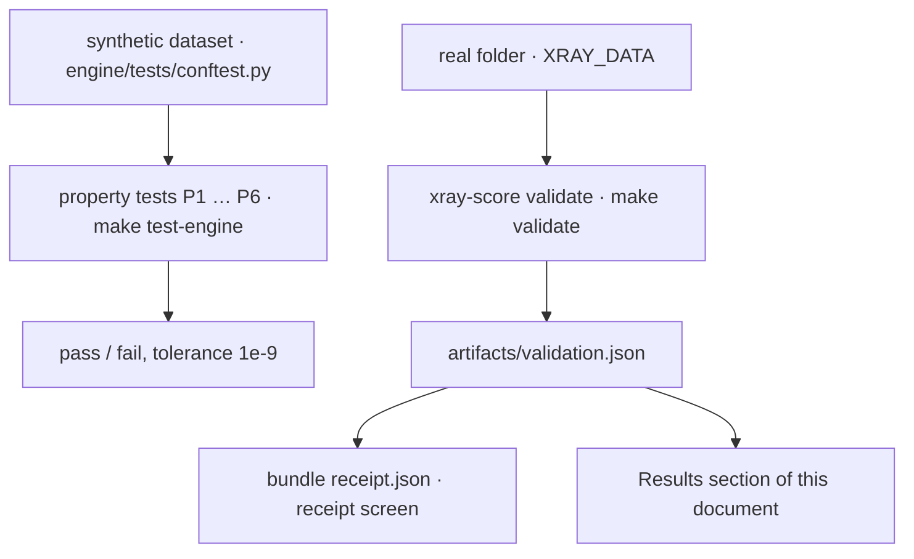

# Validation protocol

How the X-Ray engine is validated **without labels**. The dataset has no outcome column, so
no accuracy figure exists and none is claimed. What can be proven is of two kinds: that the
engine **has the properties it promises** (property tests, exact, run in CI on a synthetic
dataset) and that its judgement calls **do not decide the result** (receipt checks, run on
real data, published on the product's receipt screen). This document defines each check —
what it proves, how to run it, its pass criterion — and holds the results.

Related docs:

- [ENGINE.md](./ENGINE.md) — the properties being tested
- [DECISIONS.md](./DECISIONS.md) — every `JUDGEMENT` record points to a check below
- [DATA_TRAPS.md](./DATA_TRAPS.md) — the traps the synthetic dataset reproduces
- [OPEN_QUESTIONS.md](./OPEN_QUESTIONS.md) — what a failed check would reopen

## Flow



## Summary

| Id | Check | Key in `validation.json` | Proves | Pass criterion | Kind |
|----|-------|--------------------------|--------|----------------|------|
| P1 | Isolation | `isolation` | cohort independence | 60 groups alone = full run, max abs diff ≤ 1e-9, no categorical mismatch | gate |
| P2 | Truncation invariance | `truncation` | no look-ahead | rows ≤ *t* from data cut at *t* = full run, ≤ 1e-9 | gate |
| P3 | Additivity | `additivity` | the explanation is exact | score and delta identities ≤ 1e-9 on every row; integer tenths sum to the score | gate |
| P4 | Scale invariance | `scale` | money enters through ratios only | EUR columns × 1024 ⇒ identical scores (pure core) | gate |
| P5 | Determinism | `determinism` | reproducibility | two runs and a row-shuffled run give equal frames and a byte-identical bundle | gate |
| P6 | Industry is context only | — (pytest) | context never reaches the number | pure modules import nothing but `contracts`; scores equal with and without industry | gate |
| R1 | Paired ablation | `ablation` | the score does not measure "having an ERP" | \|mean shift\| < 6 points on the same groups *(proposed)* | gate |
| R2 | Neutrality | `neutrality` | the score is not a proxy for size, ERP, bank, month or coverage | excess η² < 0.06 per factor *(proposed)* | gate |
| R3 | Penalty by branch | `branch_parity` | the weakest-pillar rule does not punish coverage | spread of branch mean penalties < 3 points *(proposed)* | info |
| R4 | Rank stability | `rank_stability` | weights and λ do not decide the ranking | Spearman ≥ 0.90 and ≤ 15% of groups change band, every perturbation *(proposed)* | gate |
| R4b | Parameter flips | — (manual) | the other judgement calls do not decide it either | same two statistics, reported | info |
| R5 | History truncation | `history_truncation` | the eligibility cuts are in the right place | median \|error\| < 6 points at the abstention cut *(proposed)* | info |
| R6 | Netting placebo | `netting_placebo` | mirror pairs are not chance matches | real value share ≥ 10 × date-placebo share | gate |
| R7 | Persistence | `persistence` | levels persist, which is what a level score needs | P(negative at t+6 \| negative at t) ≥ 5 × P(negative at t+6 \| positive at t) | info |
| R8 | Injected deteriorations | `injection` | detection delay, bump vs fall, false alerts | step: median delay to `structural` ≤ 3 months *(proposed)* | info |

A *gate* makes `xray-score validate` exit with code 1. Criteria marked *(proposed)* are tied
to a constant the engine already uses or to a public convention, and wait for the team's
confirmation.

---

## Property tests

Run all of them with `make test-engine`. They use the synthetic dataset built by
`engine/tests/conftest.py` (six archetype groups plus random ones; it reproduces the traps of
[DATA_TRAPS.md](./DATA_TRAPS.md): multi-line descriptions, sentinels, stamped invoices,
mirror pairs, perimeter changes, a dead feed). The same properties are re-checked on real
data by `xray-score validate`.

### P1 · Isolation

- **Proves.** A score depends only on the entity's own rows and the frozen params. This is
  the property a hidden test of unseen entities needs, and it is what makes the size-band
  anchors (D-33) legitimate: they are frozen, not recomputed.
- **How.** Filter the eight CSVs at file level to a subset of groups, score it alone, compare
  with the same groups in the full run: every numeric column within 1e-9, every other column
  equal, alerts identical. CI: `engine/tests/test_isolation.py`. Real data: 60 groups drawn
  with seed 7, stratified by size and invoice coverage.
- **Pass.** `max_abs_diff ≤ 1e-9`, `categorical_mismatches = 0`, no missing rows.

### P2 · Truncation invariance

- **Proves.** Month *t* uses only facts knowable at the end of *t*.
- **How.** For *t* ∈ {2025-08, 2026-02, 2026-05}: cut transactions and invoices at the end
  of *t*, re-open invoices settled later, roll balance anchors back in cents, score, and
  require every row with `month ≤ t` — snapshot, panel and alerts — to equal the full run.
  CI: `engine/tests/test_truncation.py`, plus `test_invoices_as_of.py` for the invoice rule
  alone.
- **Pass.** Same as P1. The two declared exceptions (`granted` assumed constant, the debt
  product list) are flagged, not tested away.

### P3 · Additivity

- **Proves.** `score = base + Σ contributions − penalty − cap_adjustment` and its
  month-on-month counterpart with `Δbase`, on **every coverage branch**; and that the
  integer tenths shown on screen add up.
- **How.** All 32 availability masks × random pillar values; 2,000 random panel rows; random
  pairs of months for the delta identity (the test also asserts that `Δbase ≠ 0` happens,
  i.e. that the term is needed); `round_preserving_sum` on random parts. CI:
  `engine/tests/test_additivity.py`. Real data: every row.
- **Pass.** Both identities ≤ 1e-9; `sum(tenths) == round(score × 10)`; score ∈ [0, 100].

### P4 · Scale invariance

- **Proves.** Scores read money only through ratios, so currency scale and company size in
  euros do not enter by themselves.
- **How.** Multiply every EUR column of the panel (`PANEL_MONEY_COLUMNS`) by 1024 — a power
  of two, exact in floating point — and re-score. CI: `engine/tests/test_scale_invariance.py`.
- **Pass.** Identical scores, pillars, flags and gates.
- **Scope.** Pure core only. The mirror gate of 100 EUR (D-14) and the size bands (D-33) are
  deliberate absolute thresholds upstream of it.

### P5 · Determinism

- **Proves.** Same input, same bytes — across runs, cache state and row order.
- **How.** Two cold runs, one warm-cache run, one run on row-shuffled CSVs; compare frames
  with `equals` and the exported bundle by tree hash. CI: `engine/tests/test_determinism.py`.
- **Pass.** All equal. The bundle carries no wall-clock value.

### P6 · Industry is context only

- **Proves.** The industry archetype — and with it every benchmark joined on it — cannot
  influence a score.
- **How.** AST check: `pillars`, `aggregate`, `trajectory`, `alerts` import nothing but
  `contracts` and each other, and no I/O or data-frame library; scoring with and without the
  industry mapping gives identical snapshots. CI:
  `engine/tests/test_industry_is_context_only.py`.
- **Pass.** No forbidden import; frames equal.

Supporting tests: `test_params.py` (a params file whose content does not match its `sha256`
is refused), `test_export_contract.py` (bundle validates against
`contracts/xray-export-v1.schema.json`), `test_synthetic_dataset.py` (the generator really
contains the traps).

---

## Receipt checks

Run on a real folder:

```bash
export PATH="$HOME/Library/Python/3.12/bin:$PATH"
make validate XRAY_DATA=/path/to/output            # everything → artifacts/validation.json
uv run --package xray-engine xray-score validate /path/to/output --quick   # skips R8
```

Only aggregates are written; nothing per company or per group leaves the machine.

### R1 · Paired ablation

- **Proves.** That the score of a group does not depend on *whether its invoices are
  connected*. A cross-population comparison cannot show this: groups with invoices are larger
  and liquidity depends on size, so any PSI between them fails for the wrong reason.
- **How.** Take the groups with at least one invoice pillar at the last month. Score them
  twice from the same pillars: as they are, and with `payments` and `collections` forced to
  `None` (weights renormalise). Report mean shift, mean |shift|, Spearman between the two
  rankings, share of groups changing band, and the same by size band. The same harness
  nulls the debt pillar for low-burden groups (D-41).
- **Pass (proposed).** |mean shift| < 6 points — `trajectory.min_delta_points`: connecting an
  ERP must not look like a trajectory event. Spearman and band changes are reported.
- **If it fails.** The pillar reference medians differ too much across pillars, so the base
  differs by branch (Q-07).

### R2 · Neutrality by excess η²

- **Proves.** The score is not a proxy for a nuisance factor.
- **How.** For each factor, η² of the group score on the factor, **minus** the mean η² of 200
  random partitions with the same cell sizes (a small-cell partition explains variance by
  chance; on this data the random baseline is about 0.003–0.009 †). Factors: **size band**
  (run under `liquidity.segmented` true and false), **ERP tier**, **main bank** (modal bank of
  the group's rows — `-` handling is a potential bank fixed effect), **coverage branch**, all
  on the last month; **calendar month** on pooled group-months (seasonality was removed,
  D-26). Pillar-level η² is reported too: it says *where* a dependency enters.
- **Pass (proposed).** Excess η² < 0.06 for every factor; ≥ 0.14 is a failure that needs
  action. These are Cohen's benchmarks for a medium and a large effect.
- **Expected tension.** ERP tier on the punctuality pillars (T-27) and coverage branch (R1).

### R3 · Penalty by branch

- **Proves.** That the weakest-pillar penalty does not systematically punish richer
  coverage: the expected minimum of five pillars is lower than the expected minimum of two.
- **How.** Mean penalty, share of group-months with a positive penalty and share where each
  cap binds, per coverage branch (branches with ≥ 20 group-months). The descriptive PSI of
  score distributions between branches is reported with its usual reading (< 0.10 stable,
  0.10–0.25 shift, > 0.25 major) and never used as the criterion (D-65).
- **Pass (proposed).** Spread of branch mean penalties < 3 points. Otherwise restrict the
  minimum to the bank pillars (Q-07).

### R4 · Rank stability

- **Proves.** That the judgement calls on **weights** and **λ** do not decide who is ranked
  where.
- **How.** Re-aggregate the stored pillars (no CSV pass needed) under each perturbation: every
  weight ±0.10 (floor 0.05, renormalised to 1) — ten runs — and λ ∈ {0.3, 0.7}. For each run:
  Spearman of group ranks at the last month against the baseline, and share of groups
  changing band.
- **Pass (proposed).** Spearman ≥ 0.90 and ≤ 15% of groups changing band on every run.

### R4b · Parameter flips (manual harness)

The other `JUDGEMENT` parameters need a CSV pass, so they are not in the default run. Same
two statistics, one flip at a time:

```bash
cp params/reference_v1.json /tmp/flip.json          # edit one value
python -m xray_engine.params /tmp/flip.json         # re-stamp the sha256
uv run --package xray-engine xray-score predict /path/to/output --params /tmp/flip.json --out artifacts/flip
```

| Flip | Values | Record |
|------|--------|--------|
| `liquidity.segmented` | `false` | D-33 |
| `penalty.tau` | 40, 50 | D-44 |
| `robust.monthly_winsor_multiple` | 2, 5 | D-24 |
| `liquidity.month_end_weight` / `intra_min_weight` | 0.5 / 0.5, 0.7 / 0.3 | D-31 |
| `liquidity.outflow_window_months` | 6 | D-29 |
| `invoices.window_days` (and clip) | 60, 120 | D-35 |
| `invoices.min_invoices`, `min_effective_n` | (5, 3), (20, 8) | D-37 |
| `anchors.debt_burden` | one quantile step up / down | D-40 |
| `trajectory.min_delta_points`, `min_sigma_multiple` | (5, 1.0), (8, 2.0) | D-58 |
| `trajectory.perimeter_shift_share` | 0.1, 0.3 | D-61 |
| `live_feed.threshold` | 0.4, 0.6 | D-52 |
| `fx.rates` (non-EUR) | ±20% | D-08 |

### R5 · History truncation

- **Proves.** That the eligibility cuts (abstain below 4 months, trajectory from 6, momentum
  from 7) sit where a short history stops being misleading.
- **How.** Take the groups with all 24 months. For *k* ∈ {3, 4, 6, 9, 12, 18}, keep only the
  last *k* months of rows (balances untouched: the back-roll runs backwards from the anchor),
  re-score the last month, compare with the full-history score: median and p90 of |error|,
  share changing band.
- **Pass (proposed).** Median |error| < 6 points at *k* = `abstention.min_months_observed`.
  The curve is what re-derives the `c_history` table (D-55).

### R6 · Netting placebo

- **Proves.** That mirror pairs are internal transfers, not amount coincidences.
- **How.** Re-run each step (reversals, mirror pairs) with everything equal except (a) a date
  offset of 9–11 days instead of ≤ 1, (b) the positive leg matched to 1.01 × the amount.
  Report pairs, share of outflow rows and share of outflow value, against the real rule.
- **Pass.** For each step, real value share ≥ 10 × its date-placebo share; amount placebo
  < 0.1% of value. Measured by `analysis/mirrors.py`: mirror pairs 17.2% against 0.28%,
  reversals 42.0% against 1.9%, amount placebo 0.001%; pairing alone on a flat ±2-day window
  (the verified headline) 46.6% against 1.8%.

### R7 · Persistence

- **Proves.** The one empirical regularity a level-based score stands on: levels persist.
  It is also the evidence behind the negative-liquidity cap (D-45).
- **How.** Group level, all (t, t + 6) pairs: P(cash + headroom < 0 at t + 6 | < 0 at t)
  against P(· | ≥ 0 at t) and the base rate; same for band `critical`.
- **Pass.** Conditional probability ≥ 5 × the probability given a positive start.
  Verification run (cash only): 72.5% against 1.5%, base rate 7.3%.

### R8 · Injected deteriorations

- **Proves.** How many months the monitor needs to call a change, whether it separates a bump
  from a fall, and how often it cries wolf — *measured*, since the data shows no lead–lag
  between signals that would allow a claim of natural anticipation.
- **How.** Healthy groups (score ≥ 60, live feed, long history, no perimeter change in the
  injection window), stratified by **size band**, seed 7. Three shapes of the same final
  magnitude on operating inflow: **spike** (one month), **step** (permanent), **ramp** (linear
  over six months). The balance anchor is adjusted by the injected amount so that every row
  before the onset is unchanged — asserted, as in P2. Only the touched groups are re-scored
  (P1 makes that legitimate). A mirrored run injects improvements.
- **Reports.** Detection delay from onset to the first `deteriorating` month and to
  `structural`, by shape and size band; **P(structural | spike)**; false-alert rate =
  structural alerts per 100 untouched group-months; the same for improvements.
- **Pass (proposed).** Step: median delay to `structural` ≤ 3 months. P(structural | spike)
  is the number that decides whether D-59 needs a stricter rule.

---

## Results

> Filled from `artifacts/validation.json` by a later step. Every placeholder has the form
> `TODO(<key>.<field>)`; replace it with the value and leave the key in a comment.

**Run.** dataset `TODO(dataset_hash)` · params `TODO(params_hash)` · engine
`TODO(engine_version)` · date `TODO(run_date)` · groups `TODO(n_groups)` · companies
`TODO(n_companies)` · months `TODO(window)`

### Property checks on real data

| Check | Rows compared | Max abs diff | Categorical mismatches | Status |
|-------|---------------|--------------|------------------------|--------|
| P1 isolation (60 groups, seed 7) | `TODO(isolation.n)` | `TODO(isolation.max_abs_diff)` | `TODO(isolation.categorical_mismatches)` | `TODO(isolation.pass)` |
| P2 truncation 2025-08 | `TODO(truncation.2025-08.n)` | `TODO(truncation.2025-08.max_abs_diff)` | `TODO(truncation.2025-08.categorical_mismatches)` | `TODO(truncation.2025-08.pass)` |
| P2 truncation 2026-02 | `TODO(truncation.2026-02.n)` | `TODO(truncation.2026-02.max_abs_diff)` | `TODO(truncation.2026-02.categorical_mismatches)` | `TODO(truncation.2026-02.pass)` |
| P2 truncation 2026-05 | `TODO(truncation.2026-05.n)` | `TODO(truncation.2026-05.max_abs_diff)` | `TODO(truncation.2026-05.categorical_mismatches)` | `TODO(truncation.2026-05.pass)` |
| P3 additivity (score) | `TODO(additivity.n)` | `TODO(additivity.max_abs_error_score)` | — | `TODO(additivity.pass)` |
| P3 additivity (delta) | `TODO(additivity.n_delta)` | `TODO(additivity.max_abs_error_delta)` | — | `TODO(additivity.pass)` |
| P3 integer tenths | `TODO(additivity.n)` | `TODO(additivity.tenths_mismatches)` | — | `TODO(additivity.pass)` |
| P4 scale × 1024 | `TODO(scale.n)` | `TODO(scale.max_abs_diff)` | `TODO(scale.categorical_mismatches)` | `TODO(scale.pass)` |
| P5 determinism | `TODO(determinism.n)` | — | `TODO(determinism.frames_equal)` | `TODO(determinism.pass)` |

### Coverage of the scored population (last month)

| Quantity | Groups | Companies |
|----------|--------|-----------|
| Scored | `TODO(coverage.groups.scored)` | `TODO(coverage.companies.scored)` |
| Abstained (by reason) | `TODO(coverage.groups.abstained)` | `TODO(coverage.companies.abstained)` |
| Stale feed | `TODO(coverage.groups.stale_feed)` | `TODO(coverage.companies.stale_feed)` |
| Payments pillar available (as-of gate; `analysis/invoices_asof.py` gives 120 groups) | `TODO(coverage.groups.payments)` | `TODO(coverage.companies.payments)` |
| Collections pillar available (script: 96 groups) | `TODO(coverage.groups.collections)` | `TODO(coverage.companies.collections)` |
| Debt pillar available | `TODO(coverage.groups.debt)` | `TODO(coverage.companies.debt)` |
| Liquidity inherited from group | — | `TODO(coverage.companies.inherited_from_group)` |
| `no_external_revenue` | `TODO(coverage.groups.no_external_revenue)` | `TODO(coverage.companies.no_external_revenue)` |
| `perimeter_shift` group-months | `TODO(coverage.groups.perimeter_shift_months)` | — |
| Bands critical / watch / stable / solid | `TODO(coverage.groups.bands)` | `TODO(coverage.companies.bands)` |

### R1 · Paired ablation

| Metric | All | micro | small | medium | large |
|--------|-----|-------|-------|--------|-------|
| Groups | `TODO(ablation.n)` | `TODO(ablation.by_band.micro.n)` | `TODO(ablation.by_band.small.n)` | `TODO(ablation.by_band.medium.n)` | `TODO(ablation.by_band.large.n)` |
| Mean shift (points) | `TODO(ablation.mean_shift)` | `TODO(ablation.by_band.micro.mean_shift)` | `TODO(ablation.by_band.small.mean_shift)` | `TODO(ablation.by_band.medium.mean_shift)` | `TODO(ablation.by_band.large.mean_shift)` |
| Mean \|shift\| | `TODO(ablation.mean_abs_shift)` | | | | |
| Spearman of ranks | `TODO(ablation.spearman)` | | | | |
| Share changing band | `TODO(ablation.band_change_share)` | | | | |
| Status | `TODO(ablation.pass)` | | | | |

### R2 · Neutrality (excess η²)

| Factor | η² | Random-partition η² | Excess | Status |
|--------|----|---------------------|--------|--------|
| Size band, segmented anchors | `TODO(neutrality.size_band.segmented.eta2)` | `TODO(neutrality.size_band.segmented.random)` | `TODO(neutrality.size_band.segmented.excess)` | `TODO(neutrality.size_band.segmented.pass)` |
| Size band, absolute anchors | `TODO(neutrality.size_band.absolute.eta2)` | `TODO(neutrality.size_band.absolute.random)` | `TODO(neutrality.size_band.absolute.excess)` | `TODO(neutrality.size_band.absolute.pass)` |
| ERP tier | `TODO(neutrality.erp_tier.eta2)` | `TODO(neutrality.erp_tier.random)` | `TODO(neutrality.erp_tier.excess)` | `TODO(neutrality.erp_tier.pass)` |
| Main bank | `TODO(neutrality.main_bank.eta2)` | `TODO(neutrality.main_bank.random)` | `TODO(neutrality.main_bank.excess)` | `TODO(neutrality.main_bank.pass)` |
| Calendar month | `TODO(neutrality.calendar_month.eta2)` | `TODO(neutrality.calendar_month.random)` | `TODO(neutrality.calendar_month.excess)` | `TODO(neutrality.calendar_month.pass)` |
| Coverage branch | `TODO(neutrality.branch.eta2)` | `TODO(neutrality.branch.random)` | `TODO(neutrality.branch.excess)` | `TODO(neutrality.branch.pass)` |

### R3 · Penalty by branch

| Branch | Group-months | Mean penalty | Share with penalty > 0 | `negative_liquidity` binds | `weak_payments` binds |
|--------|--------------|--------------|------------------------|----------------------------|-----------------------|
| all five | `TODO(branch_parity.full.n)` | `TODO(branch_parity.full.mean_penalty)` | `TODO(branch_parity.full.penalty_share)` | `TODO(branch_parity.full.cap_negative_liquidity)` | `TODO(branch_parity.full.cap_weak_payments)` |
| no debt | `TODO(branch_parity.no_debt.n)` | `TODO(branch_parity.no_debt.mean_penalty)` | `TODO(branch_parity.no_debt.penalty_share)` | `TODO(branch_parity.no_debt.cap_negative_liquidity)` | `TODO(branch_parity.no_debt.cap_weak_payments)` |
| bank + debt | `TODO(branch_parity.bank_debt.n)` | `TODO(branch_parity.bank_debt.mean_penalty)` | `TODO(branch_parity.bank_debt.penalty_share)` | `TODO(branch_parity.bank_debt.cap_negative_liquidity)` | — |
| bank only | `TODO(branch_parity.bank_only.n)` | `TODO(branch_parity.bank_only.mean_penalty)` | `TODO(branch_parity.bank_only.penalty_share)` | `TODO(branch_parity.bank_only.cap_negative_liquidity)` | — |

Spread of mean penalties: `TODO(branch_parity.penalty_spread)` · descriptive PSI with /
without invoices: `TODO(branch_parity.psi)`

### R4 · Rank stability

| Perturbation | Spearman vs baseline | Share of groups changing band | Status |
|--------------|----------------------|-------------------------------|--------|
| liquidity +0.10 / −0.10 | `TODO(rank_stability.liquidity_up.spearman)` / `TODO(rank_stability.liquidity_down.spearman)` | `TODO(rank_stability.liquidity_up.band_change)` / `TODO(rank_stability.liquidity_down.band_change)` | `TODO(rank_stability.liquidity.pass)` |
| payments +0.10 / −0.10 | `TODO(rank_stability.payments_up.spearman)` / `TODO(rank_stability.payments_down.spearman)` | `TODO(rank_stability.payments_up.band_change)` / `TODO(rank_stability.payments_down.band_change)` | `TODO(rank_stability.payments.pass)` |
| collections +0.10 / −0.10 | `TODO(rank_stability.collections_up.spearman)` / `TODO(rank_stability.collections_down.spearman)` | `TODO(rank_stability.collections_up.band_change)` / `TODO(rank_stability.collections_down.band_change)` | `TODO(rank_stability.collections.pass)` |
| activity +0.10 / −0.10 | `TODO(rank_stability.activity_up.spearman)` / `TODO(rank_stability.activity_down.spearman)` | `TODO(rank_stability.activity_up.band_change)` / `TODO(rank_stability.activity_down.band_change)` | `TODO(rank_stability.activity.pass)` |
| debt +0.10 / −0.10 | `TODO(rank_stability.debt_up.spearman)` / `TODO(rank_stability.debt_down.spearman)` | `TODO(rank_stability.debt_up.band_change)` / `TODO(rank_stability.debt_down.band_change)` | `TODO(rank_stability.debt.pass)` |
| λ = 0.3 / 0.7 | `TODO(rank_stability.lambda_0.3.spearman)` / `TODO(rank_stability.lambda_0.7.spearman)` | `TODO(rank_stability.lambda_0.3.band_change)` / `TODO(rank_stability.lambda_0.7.band_change)` | `TODO(rank_stability.lambda.pass)` |

### R4b · Parameter flips

| Flip | Spearman vs baseline | Share of groups changing band | Note |
|------|----------------------|-------------------------------|------|
| `liquidity.segmented = false` | `TODO(flips.segmented_false.spearman)` | `TODO(flips.segmented_false.band_change)` | |
| `penalty.tau` 40 / 50 | `TODO(flips.tau.spearman)` | `TODO(flips.tau.band_change)` | |
| winsor multiple 2 / 5 | `TODO(flips.winsor.spearman)` | `TODO(flips.winsor.band_change)` | |
| invoice window 60 / 120 d | `TODO(flips.invoice_window.spearman)` | `TODO(flips.invoice_window.band_change)` | |
| other flips | `TODO(flips.other)` | | not run unless listed |

### R5 · History truncation

| Last *k* months | Groups | Median \|error\| | p90 \|error\| | Share changing band |
|-----------------|--------|------------------|----------------|---------------------|
| 3 | `TODO(history_truncation.k3.n)` | `TODO(history_truncation.k3.median_abs_error)` | `TODO(history_truncation.k3.p90_abs_error)` | `TODO(history_truncation.k3.band_change)` |
| 4 | `TODO(history_truncation.k4.n)` | `TODO(history_truncation.k4.median_abs_error)` | `TODO(history_truncation.k4.p90_abs_error)` | `TODO(history_truncation.k4.band_change)` |
| 6 | `TODO(history_truncation.k6.n)` | `TODO(history_truncation.k6.median_abs_error)` | `TODO(history_truncation.k6.p90_abs_error)` | `TODO(history_truncation.k6.band_change)` |
| 9 | `TODO(history_truncation.k9.n)` | `TODO(history_truncation.k9.median_abs_error)` | `TODO(history_truncation.k9.p90_abs_error)` | `TODO(history_truncation.k9.band_change)` |
| 12 | `TODO(history_truncation.k12.n)` | `TODO(history_truncation.k12.median_abs_error)` | `TODO(history_truncation.k12.p90_abs_error)` | `TODO(history_truncation.k12.band_change)` |
| 18 | `TODO(history_truncation.k18.n)` | `TODO(history_truncation.k18.median_abs_error)` | `TODO(history_truncation.k18.p90_abs_error)` | `TODO(history_truncation.k18.band_change)` |

### R6 · Netting placebo

| Rule | Pairs | Share of outflow rows | Share of outflow value |
|------|-------|-----------------------|------------------------|
| Reversals (same account, ±1 d) | `TODO(netting_placebo.reversals.pairs)` | `TODO(netting_placebo.reversals.row_share)` | `TODO(netting_placebo.reversals.value_share)` |
| Reversals, date placebo (9–11 d) | `TODO(netting_placebo.reversals_date.pairs)` | `TODO(netting_placebo.reversals_date.row_share)` | `TODO(netting_placebo.reversals_date.value_share)` |
| Mirror pairs, shipped rule (±1 d + weekend bridge, ≥ 100 EUR) | `TODO(netting_placebo.real.pairs)` | `TODO(netting_placebo.real.row_share)` | `TODO(netting_placebo.real.value_share)` |
| Mirror pairs, date placebo (9–11 d) | `TODO(netting_placebo.date.pairs)` | `TODO(netting_placebo.date.row_share)` | `TODO(netting_placebo.date.value_share)` |
| Mirror pairs, amount placebo (× 1.01) | `TODO(netting_placebo.amount.pairs)` | `TODO(netting_placebo.amount.row_share)` | `TODO(netting_placebo.amount.value_share)` |

Status: `TODO(netting_placebo.pass)` · reference from `analysis/mirrors.py` (stdlib
re-implementation, not the engine): reversals 59,511 pairs, 3.98% of rows, 41.96% of value
(date placebo 0.86% / 1.92%); mirror pairs 70,751, 4.74%, 17.20% (date placebo 0.77% /
0.28%; amount placebo 0.02% / 0.001%); total netted 8.72% of rows, 59.16% of value. Pairing
alone on a flat ±2-day window: 98,141 pairs, 6.57%, 46.58% (date placebo 1.22% / 1.80%).

### R7 · Persistence

| State at *t* (group level) | P(same state at *t* + 6) | P(state at *t* + 6 \| not at *t*) | Base rate | Pairs |
|----------------------------|--------------------------|-----------------------------------|-----------|-------|
| cash + headroom < 0 | `TODO(persistence.negative_liquidity.p_stay)` | `TODO(persistence.negative_liquidity.p_enter)` | `TODO(persistence.negative_liquidity.base)` | `TODO(persistence.negative_liquidity.n)` |
| band `critical` | `TODO(persistence.critical.p_stay)` | `TODO(persistence.critical.p_enter)` | `TODO(persistence.critical.base)` | `TODO(persistence.critical.n)` |
| band `solid` | `TODO(persistence.solid.p_stay)` | `TODO(persistence.solid.p_enter)` | `TODO(persistence.solid.base)` | `TODO(persistence.solid.n)` |

### R8 · Injected deteriorations

| Shape | Size band | Groups | Median delay to `deteriorating` | Median delay to `structural` | P(structural) |
|-------|-----------|--------|--------------------------------|------------------------------|---------------|
| spike | all | `TODO(injection.spike.n)` | `TODO(injection.spike.delay_direction)` | — | `TODO(injection.spike.p_structural)` |
| step | all | `TODO(injection.step.n)` | `TODO(injection.step.delay_direction)` | `TODO(injection.step.delay_structural)` | `TODO(injection.step.p_structural)` |
| ramp | all | `TODO(injection.ramp.n)` | `TODO(injection.ramp.delay_direction)` | `TODO(injection.ramp.delay_structural)` | `TODO(injection.ramp.p_structural)` |
| step | micro / small / medium / large | `TODO(injection.step.by_band.n)` | `TODO(injection.step.by_band.delay_direction)` | `TODO(injection.step.by_band.delay_structural)` | `TODO(injection.step.by_band.p_structural)` |

False structural alerts per 100 untouched group-months: `TODO(injection.false_alert_rate)` ·
injected magnitude: `TODO(injection.magnitude)` · improvements (mirrored run), median delay to
`structural`: `TODO(injection.improvement.step.delay_structural)`

---

## Known limitations

- **No accuracy.** Nothing here says the score predicts an outcome; it says the score is
  what it claims to be and is stable under its own assumptions.
- **Proposed criteria.** Thresholds marked *(proposed)* borrow an existing constant (the
  6-point direction threshold) or a public convention (Cohen's η² benchmarks, the PSI
  reading). They are defensible, not derived.
- **Injection realism.** R8 injects clean shapes into operating inflow; real deteriorations
  are messier and may start in payments. Delays are lower bounds.
- **R4b is manual.** A judgement parameter is only as defended as its last flip.
- **Synthetic CI data.** Property tests prove the code path, not the data; that is why each
  property is re-run on the real folder.

## Extending the suite

1. A new check returns a plain dict with at least `{"pass": bool | None}` and aggregates
   only; register its key in `run_validation` and in the `checks` description of
   `contracts/xray-export-v1.schema.json`.
2. Add its row to the summary table, its protocol section and a *Results* table with
   `TODO(<key>.<field>)` placeholders.
3. Point the decision record it defends to the new id.
