Este catálogo documenta todo lo que existe en la interfaz de Embat X-Ray tal como está en la rama `main` (commit `cad5b5a`), qué hace cada pieza y cómo funciona por dentro. Se ha redactado con Gemini a partir de dos fuentes: el código fuente completo del frontend, que manda en caso de duda, y 113 capturas reales tomadas con el dataset del reto en escritorio (1440 px), tablet (1024 px) y móvil (390 px).

# I. La aplicación

## 1. Visión general y mapa de la interfaz

### Arquitectura de la interfaz y validación de datos

El frontend de Embat X-Ray está construido como una **Single Page Application (SPA) estática** utilizando SvelteKit 5. Su arquitectura se basa en la lectura de un paquete de datos precalculado, eliminando la necesidad de un backend transaccional tradicional para la visualización.

*   **Adaptador estático:** La aplicación se compila utilizando `@sveltejs/adapter-static` (activado mediante la variable de entorno `XRAY_TARGET=static` o en el entorno de Vercel). Todo el enrutamiento dinámico recae en el lado del cliente, utilizando un archivo `200.html` como *fallback* para la resolución de rutas.
*   **El Bundle de datos (`/data/v1/`):** La fuente de verdad exclusiva de la interfaz es un conjunto de archivos JSON estáticos exportados por el motor de *scoring*. Estos archivos (`manifest.json`, `portfolio.json`, `alerts.json`, `receipt.json` y los directorios `groups/`, `companies/` y `evidence/`) se alojan en el directorio público y son consumidos vía `fetch`.
*   **Contrato y validación estricta:** Cada archivo JSON leído pasa por una validación exhaustiva utilizando esquemas de Zod (`src/lib/xray/contract.ts`). Si la validación falla, la aplicación lanza un `BundleError` (`src/lib/xray/bundle.ts`) que es capturado por los *hooks* del cliente (`src/hooks.client.ts`). Los tipos de error son:
    *   `missing`: Lanza un error 404 con el mensaje «El bundle no contiene [ruta]».
    *   `invalid`: Lanza el mensaje «[ruta] no cumple el contrato [tipo]: [mensaje de Zod]».
    *   `network`: Lanza «El servidor respondió [estado] al leer [ruta]» o «No se pudo leer [ruta]: [detalle]».
*   **Caché en memoria por `bundle_id`:** Para optimizar el rendimiento, los archivos validados se almacenan en un `Map` en memoria (`cache`). La clave combina el `bundle_id` (truncado a 12 caracteres, extraído del manifiesto) con la ruta del archivo (ej. `550980d25a18:groups/GROUP_0153.json`). Si el paquete de datos se actualiza, la caché se invalida automáticamente.

### Gestión del estado

Dado que el *bundle* de datos es de solo lectura, Embat X-Ray gestiona el estado de la sesión distribuyéndolo entre la URL, la memoria del navegador y el almacenamiento local (`localStorage`).

#### Estado en la URL (Parámetros de búsqueda)

La URL es la principal fuente de verdad para la navegación transversal. Los cambios en los parámetros utilizan `replaceState` con `keepFocus: true` y `noScroll: true` para no saturar el historial del navegador ni interrumpir al usuario.

| Parámetro | Dónde aplica | Valores válidos | Comportamiento por defecto | Descripción |
| :--- | :--- | :--- | :--- | :--- |
| `m` | Global | Cadena `YYYY-MM` presente en `manifest.months`. | El último mes disponible en el *bundle* (cierre más reciente). | Define el mes de análisis activo. Gestionado por `monthStore`. Si el valor solicitado no existe, se resuelve al mes anterior más cercano disponible. |
| `tab` | Dashboard (`/`) | `radar`, `diagnostico`, `escenario`, `acciones`, `tecnico`. | `radar` | Determina qué módulo principal se muestra en la pantalla de inicio. |
| `focus` | Dashboard (`/`) | Cualquier ID de grupo válido (ej. `GROUP_0153`). | El primer grupo de la cartera que tenga un *score* válido (`shown !== null`) en el mes seleccionado. | Define qué grupo se está analizando en las pestañas «Diagnóstico», «Escenarios» y «Técnico». |
| `section` | Pestaña «Técnico» | `desglose`, `alertas`, `recibo`. | `desglose` | Controla la subpestaña activa dentro del detalle técnico. |
| `q` | Bandeja de Alertas | Cadena de texto libre. | Vacío | Término de búsqueda para filtrar alertas por ID de grupo o empresa. |
| `estado` | Bandeja de Alertas | `fired`, `suppressed`, `abstained`. | La primera pestaña que contenga alertas para el contexto actual, priorizando `fired`. | Define qué categoría de alertas se muestra en la lista. |
| `ver` | Bandeja de Alertas | `mes` | `history` (todo el histórico). | Si equivale a `mes`, restringe la vista de alertas exclusivamente al mes de análisis seleccionado en `m`. |

#### Estado en `localStorage`

Al carecer de base de datos de escritura, las decisiones del analista persisten localmente en el navegador:

*   `xray:alert-triage:v1`: Diccionario que almacena el triaje de las alertas. Las claves son los ID de las alertas y los valores pueden ser `seen` (vista) o `dismissed` (descartada).
*   `xray.actions.done.v1`: Array serializado que actúa como un conjunto (*Set*) de identificadores compuestos (`[entityId]:[actionId]`), registrando qué acciones operativas han sido marcadas como hechas.
*   `sidebar:state`: Booleano que recuerda si la barra lateral de navegación está expandida o colapsada. Expira en 7 días (`SIDEBAR_COOKIE_MAX_AGE`).

#### Estado en memoria

*   **`monthStore`**: Un *store* reactivo global inicializado en el *layout* principal. Mantiene sincronizado el parámetro `m` de la URL con un retraso (*debounce*) de 200 ms (`URL_WRITE_DELAY_MS`) para evitar escrituras excesivas al arrastrar el control deslizante temporal.
*   **`focus` (`FocusFrame`)**: Estado reactivo local que gestiona el ciclo de vida de la carga de un grupo. Sus estados determinan qué se renderiza:
    *   `loading`: Muestra dos esqueletos de carga (`Skeleton class="h-72"`).
    *   `ready`: Renderiza el contenido si hay datos en el mes, o un estado vacío (`CalendarOff`) con el texto «Sin datos de [id] en [mes]» si no los hay.
    *   `error`: Muestra un estado vacío (`FileWarning`) con el texto «No se pudo leer [id]».
    *   `idle`: Muestra un estado vacío (`MousePointerClick`) con el texto «Elige un grupo».

### Formato de datos transversal

La presentación de datos sigue reglas estrictas definidas en `src/lib/format.ts`:
*   **Scores (`formatScore`)**: Se reciben en décimas enteras (ej. `724`) y se formatean con un decimal (ej. `72,4`).
*   **Deltas (`formatScoreDelta`)**: Incluyen siempre el signo explícito (ej. `+1,2`, `-6,1`, `0,0`).
*   **Moneda (`formatEuroCompact`)**: Valores grandes se abrevian a miles (`k€`) o millones (`M€`) con un decimal (ej. `1,2 M€`).
*   **Fechas (`formatPeriod`)**: Se humanizan a formato largo (ej. «agosto de 2026»). En gráficos se usa `formatPeriodShort` (ej. «ago 2026») o `formatAxisMonth` (ej. «08/26»).
*   **Hashes (`shortHash`)**: Se truncan eliminando el prefijo `sha256:` y mostrando los primeros 8 o 10 caracteres.

### Mapa de rutas y navegación

La estructura de rutas de SvelteKit refleja la jerarquía de las entidades financieras.

#### 1. Rutas de error (`+error.svelte`)
Interceptan fallos de navegación o carga de datos:
*   **Error 404 (Ruta inexistente):** Muestra el icono `SearchX` con el título «Esta página no existe» y la descripción «La dirección no corresponde a ninguna pantalla. La cartera de grupos es el punto de entrada a todo lo demás.». Incluye el botón «Ir a la cartera».
*   **Error 500 / BundleError (Fallo de datos):** Muestra el icono `FileWarning` en tono `danger` con el título «No se pudo cargar el bundle de datos» (en la raíz) o «No se pudo leer este dato del bundle» (dentro de la app). Incluye el botón «Reintentar» o «Volver al radar».

#### 2. Dashboard Principal (`/`)
Actúa como contenedor de las cinco herramientas principales, conmutadas mediante el parámetro `tab`. Incluye elementos globales:
*   **Cabecera:** Logotipo, buscador global (filtra grupos por ID o sector y muestra hasta 8 coincidencias en un desplegable; al pulsar `Enter` navega al primer resultado) y pastilla con el hash del bundle truncado a 8 caracteres («Bundle [hash]»).
*   **Barra lateral (Sidebar):** Muestra «WORKSPACE», «Cartera de [counts.groups] grupos», el mes actual, el menú de navegación y el pie con la versión del motor («Motor [engine_version]») y los hashes de parámetros y datos.

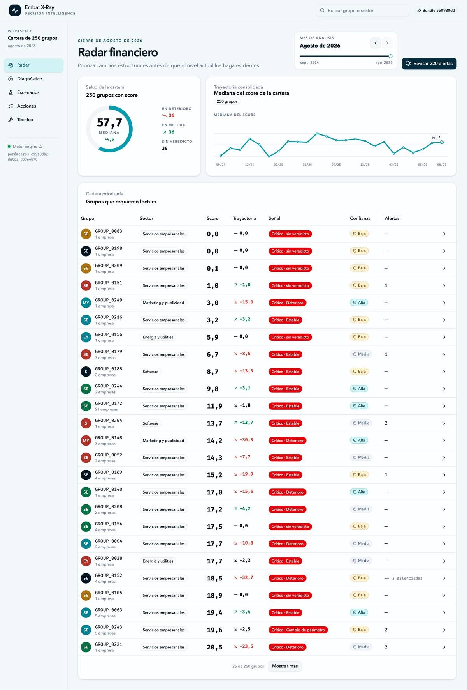

**Módulos del Dashboard:**

*   **Radar (`tab=radar`):** La vista de entrada. Muestra KPIs agregados, un gráfico de la trayectoria mediana consolidada y una tabla priorizada de todos los grupos. La tabla se ordena por defecto de menor a mayor *score* (`sortRows(rows, 'shown', 'asc')`).
    
*   **Diagnóstico (`tab=diagnostico`):** Análisis profundo del grupo definido en `focus`. Muestra el *score* actual, la trayectoria histórica, los impulsores de los pilares y las alertas de cambio de tendencia.
    
*   **Escenarios (`tab=escenario`):** Laboratorio interactivo. Permite al usuario marcar casillas de acciones recomendadas (almacenadas en un `SvelteSet` local) y visualizar en tiempo real cómo impactarían en el *score* y en la curva de trayectoria.
*   **Acciones (`tab=acciones`):** Centro operativo transversal. Lee los 40 grupos con menor score del mes (`GROUPS_READ = 40`) y muestra las 30 acciones (`ACTIONS_SHOWN = 30`) que más puntos devuelven en toda la cartera.
*   **Técnico (`tab=tecnico`):** Herramienta de auditoría dividida por el parámetro `section`:
    *   *Desglose:* Gráfico de cascada (*waterfall*) exacto al décimo y tabla de evidencias crudas.
    *   *Alertas:* Bandeja de entrada con gráfico de barras apiladas, filtros por estado y triaje manual.
    *   *Recibo:* Huella criptográfica de la ejecución, validación de pruebas sin etiquetas y señales descartadas.

#### 3. Fichas de Entidad

*   **Ficha de Grupo (`/group/[id]`):**
    Carga `groups/[id].json`. Presenta el diagnóstico completo del grupo. El antetítulo (*eyebrow*) muestra: «Grupo · [n] empresas · con datos desde [mes]». Incluye un desglose tabular de todas las empresas que lo componen y una tarjeta con la ficha de atributos inferidos.
    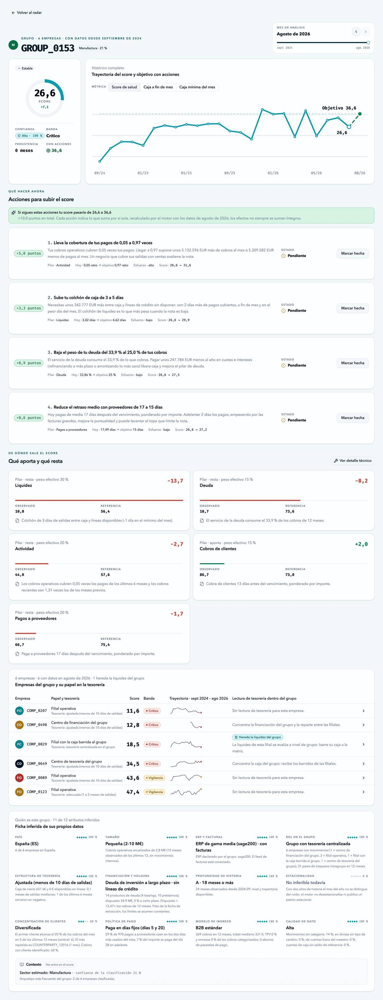

*   **Ficha de Empresa (`/group/[id]/company/[companyId]`):**
    Carga `companies/[companyId].json` y su grupo matriz para el contexto. El antetítulo muestra: «Empresa · Grupo [id] · [role] · [treasury_class]». Si el archivo de la empresa no existe en el *bundle* (la carpeta `companies/` es opcional en el contrato), la función `loadCompany` devuelve `null` y la interfaz muestra un estado vacío (`FileX`) con el texto: «Este bundle no incluye el detalle de [id]» y la descripción «La exportación trae solo el resumen de la empresa dentro de su grupo. Su score mensual figura en la tabla de empresas del grupo.».
    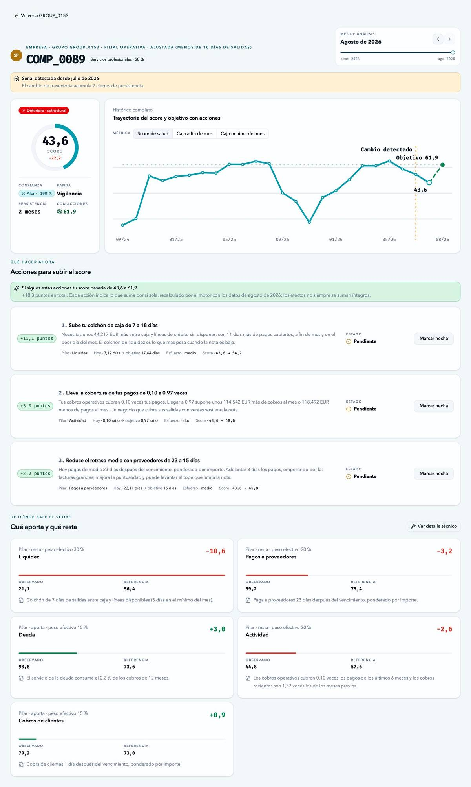

*   **Redirección de Empresa (`/company/[id]`):**
    Ruta de atajo. Lee el archivo de la empresa para descubrir a qué grupo pertenece y redirige inmediatamente (HTTP 307) a `/group/[id]/company/[id]`. Si la empresa no existe, lanza un error 404 con el mensaje «Este bundle no incluye el detalle de [id]: abre la empresa desde la página de su grupo.».

## 2. Armazón común: cabecera, buscador, barra lateral y selector de mes

### Cabecera global (Header)

**Qué es** · La franja superior fija que proporciona la identidad de marca, la búsqueda global de entidades y la referencia técnica del paquete de datos cargado.

**Dónde aparece** · En la parte superior de todas las pantallas de la aplicación, fijada al techo del navegador mediante las clases `sticky top-0 z-30` y con un fondo translúcido que desenfoca el contenido subyacente (`bg-background/92 backdrop-blur-xl`).

**Anatomía**
*   **Logotipo e identidad:** Ubicado en el extremo izquierdo. Consta de un contenedor cuadrado oscuro (`bg-[var(--ink)] text-white`) con el pictograma `Activity` (una línea de pulso), seguido del texto «Embat X-Ray» en negrita (`tracking-[-0.02em]`) y el subtítulo «DECISION INTELLIGENCE» en mayúsculas pequeñas y muy espaciadas (`tracking-[0.18em]`).
*   **Buscador global:** Situado en el centro-derecha. Es una caja de texto (`Input`) que incluye el icono `Search` posicionado de forma absoluta a la izquierda. Presenta el texto de marcador de posición literal «Buscar grupo o sector» y cuenta con los atributos `aria-label="Buscar grupo o sector"` y `autocomplete="off"`.
*   **Identificador del bundle:** En el extremo derecho. Una pastilla (`Badge` con variante `outline`) que contiene el icono `Sparkles` y el texto literal «Bundle» seguido de los primeros 8 caracteres del identificador del paquete (calculado mediante la función `shortHash(manifest.bundle_id, 8)`).

**Cómo funciona**
*   **Buscador global:**
    *   **Interacción y despliegue:** Al hacer clic o tabular hacia el campo (`onfocus`), se activa la variable de estado `searchFocused`. Si el usuario ha introducido texto (`query`) y existen coincidencias (`matches.length > 0`), se despliega una lista flotante (`ul` con `role="listbox"` y `aria-label="Resultados de grupo"`) justo debajo del campo. Al perder el foco (`onblur`), el menú se cierra con un retraso intencionado de 150 ms (`setTimeout`); esto permite que, si el usuario hace clic en un resultado, el evento `onmousedown` se registre antes de que el menú desaparezca del DOM.
    *   **Normalización y filtrado:** El texto introducido se procesa mediante la función `normalizeText` (ubicada en `portfolio.ts`), que elimina marcas diacríticas (tildes) usando la normalización Unicode `NFD`, pasa todo a minúsculas y elimina espacios en blanco en los extremos. El filtro busca si este texto normalizado está incluido en la concatenación del identificador del grupo y su sector (`normalizeText(`${row.id} ${row.group.industry ?? ''}`)`). Esto permite que buscar «hosteleria» sin tilde encuentre grupos cuyo sector es «Hostelería».
    *   **Límite de resultados:** La lista desplegable está limitada a un máximo de 8 coincidencias (`slice(0, 8)`).
    *   **Navegación por teclado:** Si el usuario presiona la tecla `Enter` y hay al menos un resultado, se abre directamente la ficha del primer grupo de la lista (`matches[0]`). Presionar `Escape` fuerza el cierre del desplegable (`searchFocused = false`).
    *   **Anatomía del resultado:** Cada fila del desplegable es un botón (`button type="button"`) que muestra:
        *   A la izquierda: El identificador del grupo (`row.id`) en tipografía de datos (`font-data`) y, debajo, el sector (`row.group.industry`) o el texto literal «Sin sector» si es nulo.
        *   A la derecha: El *score* del grupo formateado con `formatScore(row.shown)` (ej. «57,7») o el texto literal «—» si el valor es nulo. Si el grupo se encuentra en la banda crítica (`row.band === 'critical'`), el *score* se tiñe de rojo (`text-[var(--danger)]`).
    *   **Navegación al detalle:** Al hacer clic en un resultado (`onmousedown`), se limpia la búsqueda (`query = ''`), se cierra el menú y se navega a la ruta del grupo (`/group/${id}`) conservando el mes seleccionado mediante `monthStore.href`.
*   **Identificador del bundle:** Aunque visualmente solo muestra 8 caracteres, el hash completo de 64 caracteres está disponible en el atributo nativo `title` del elemento, mostrándose como un *tooltip* nativo del sistema operativo al mantener el cursor encima. Este elemento se oculta por completo en pantallas móviles (`hidden sm:flex`).

**Estados y variantes**
*   **Sin resultados:** Si el texto introducido no produce coincidencias, la lista flotante simplemente no se renderiza en el DOM (condición `{#if searchFocused && matches.length > 0}`).

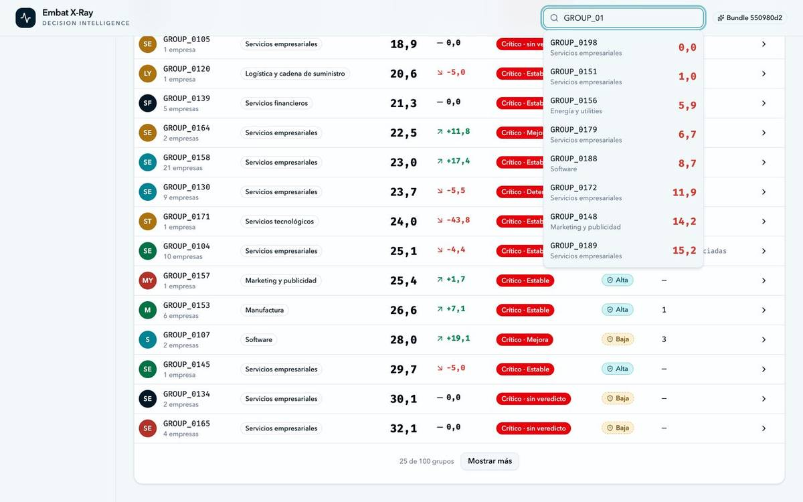
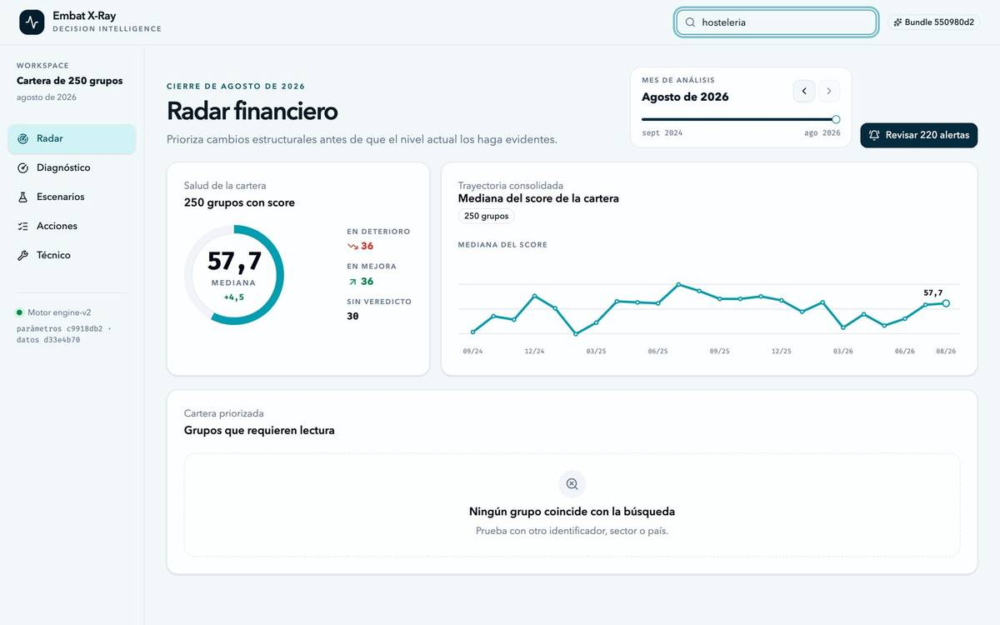
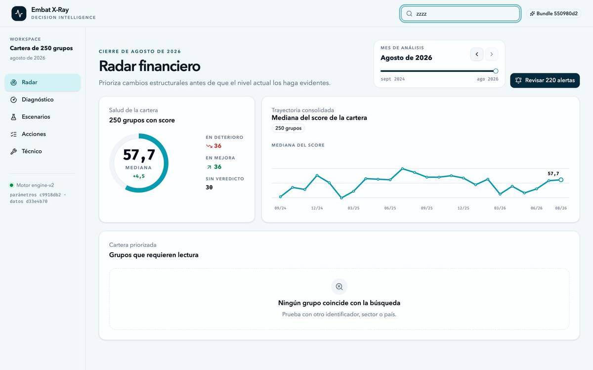

**Fuente** · `src/lib/xray/xray-dashboard.svelte`, `src/lib/xray/portfolio.ts` (para `normalizeText`), `src/lib/format.ts` (para `shortHash` y `formatScore`).

### Barra lateral de navegación (Sidebar)

**Qué es** · El panel vertical izquierdo que contextualiza el espacio de trabajo actual y permite la navegación principal entre los distintos módulos de la aplicación.

**Dónde aparece** · En el lateral izquierdo, visible únicamente en pantallas de escritorio (`hidden lg:block`). Ocupa la altura total de la pantalla menos la cabecera (`min-h-[calc(100vh-4rem)]`).

**Anatomía**
*   **Bloque Workspace:**
    *   Etiqueta superior: Texto literal «Workspace» estilizado con la clase `.metric-label` (mayúsculas pequeñas y espaciadas).
    *   Título: Texto literal «Cartera de {X} grupos», donde X es el valor numérico extraído de `manifest.counts.groups`.
    *   Subtítulo: El mes de análisis actualmente seleccionado, formateado mediante `formatPeriod` (ej. «agosto de 2026») y forzando la primera letra a mayúscula (`first-letter:uppercase`). Incluye el atributo `data-testid="shell-month"`.
*   **Pestañas verticales:** Implementadas utilizando las primitivas `Tabs.Root` y `Tabs.List` configuradas con `orientation="vertical"`.
*   **Pie de la barra (Estado del motor):**
    *   Indicador visual: Un punto verde (`bg-[var(--success)]`) con un anillo exterior translúcido (`shadow-[0_0_0_4px_var(--success-soft)]`).
    *   Texto de versión: Texto literal «Motor {manifest.engine_version}» (ej. «Motor engine-v2»).
    *   Hashes técnicos: Muestra los primeros 8 caracteres de los parámetros y los datos, con el texto literal «parámetros {hash} · datos {hash}» en tipografía de datos (`font-data`) y tamaño reducido (`text-[0.68rem]`).

**Opciones de navegación**

| Valor interno | Etiqueta visible | Icono |
| :--- | :--- | :--- |
| `radar` | «Radar» | `Radar` |
| `diagnostico` | «Diagnóstico» | `CircleGauge` |
| `escenario` | «Escenarios» | `FlaskConical` |
| `acciones` | «Acciones» | `ListChecks` |
| `tecnico` | «Técnico» | `Wrench` |

**Cómo funciona**
*   **Estado activo:** La pestaña seleccionada recibe automáticamente el atributo `data-[state=active]`. Mediante CSS, esto le aplica un fondo suave y un color de texto intenso basados en el tono de señal (`data-[state=active]:bg-[var(--signal-soft)] data-[state=active]:text-[var(--signal-strong)]`).
*   **Sincronización de URL:** Al hacer clic en una pestaña, se invoca la función `setActive`, que actualiza el parámetro `?tab=` en la URL mediante la función auxiliar `setParams`. Esta función utiliza `goto` con las opciones `replaceState: true` (para no crear un historial de navegación infinito al cambiar de pestañas), `keepFocus: true` y `noScroll: true`.
*   **Comportamiento por defecto:** Si se selecciona la pestaña «Radar» (la vista principal), el parámetro `tab` se elimina por completo de la URL (`tab: value === 'radar' ? null : value`), manteniendo las direcciones web limpias.

**Fuente** · `src/lib/xray/xray-dashboard.svelte`.

### Navegación en pantallas estrechas (Móvil y Tablet)

**Qué es** · La adaptación de la navegación principal para dispositivos donde la barra lateral vertical no tiene espacio suficiente.

**Dónde aparece** · Justo debajo de la cabecera global y por encima del contenido principal, visible únicamente en pantallas móviles y tabletas (`lg:hidden`).

**Anatomía y comportamiento**
*   Se renderiza como una fila horizontal de pestañas (`Tabs.List`) dividida en 5 columnas iguales (`grid-cols-5`).
*   Muestra exactamente las mismas opciones e iconos que la barra lateral de escritorio.
*   **Comportamiento responsivo:** En pantallas muy estrechas (móviles), el texto de las pestañas se oculta (`hidden sm:inline`), dejando únicamente los iconos centrados para maximizar el espacio táctil. En tabletas (`sm` a `lg`), el texto vuelve a ser visible junto al icono.
*   El buscador global de la cabecera adapta su ancho (`w-44 sm:w-72`) y su menú desplegable se superpone al contenido inferior ocupando el espacio disponible.

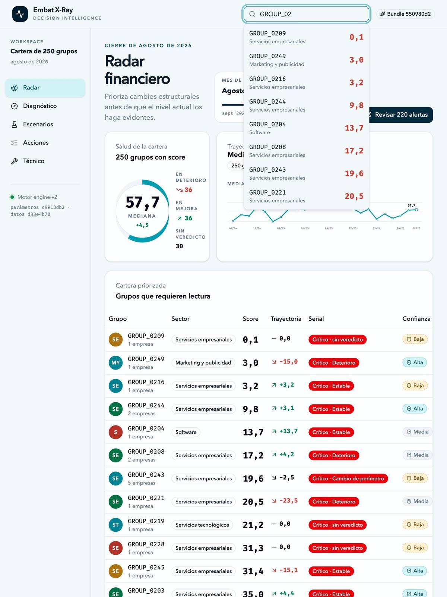
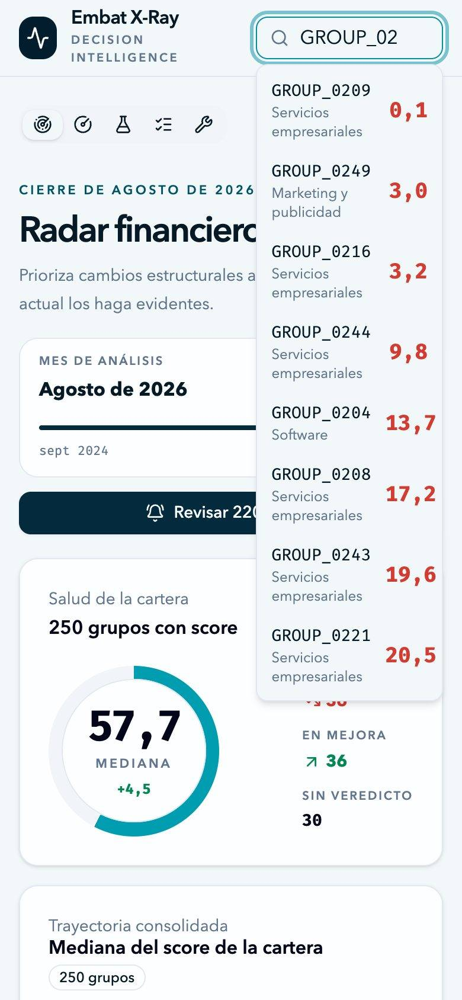

**Fuente** · `src/lib/xray/xray-dashboard.svelte`.

### Proveedor de *tooltips* global

**Qué es** · El componente envoltorio invisible que gestiona la aparición y el comportamiento de las descripciones emergentes (tooltips) construidas con shadcn-svelte en toda la interfaz.

**Cómo funciona** · Toda la aplicación (el contenido renderizado por el enrutador) está envuelta en un componente `<Tooltip.Provider delayDuration={150}>` a nivel del *layout* principal. Esto asegura que cualquier componente hijo que implemente un *tooltip* (como los puntos de los gráficos de trayectoria o los botones de iconos) comparta un retraso exacto de 150 milisegundos antes de mostrarse. Esta regla global evita parpadeos inmediatos y molestos al mover el ratón rápidamente por la pantalla.

**Fuente** · `src/routes/(app)/+layout.svelte`.

### Selector de mes de análisis

**Qué es** · El control global interactivo que determina el punto exacto en el tiempo sobre el que se calculan, filtran y muestran los datos en toda la aplicación.

**Dónde aparece** ·
*   En la vista **Radar** (`radar-view.svelte`), junto al título principal.
*   En las vistas de **Diagnóstico** y **Escenarios** a nivel de grupo o empresa (`entity-view.svelte`).
*   En la **Bandeja de alertas** (`alerts-inbox.svelte`), pero condicionado a que el conmutador de alcance temporal esté configurado en «Solo el mes de análisis».

**Anatomía**
*   **Etiqueta superior:** Texto literal «MES DE ANÁLISIS» (o un texto personalizado pasado por la *prop* `label`), estilizado con la clase `.metric-label`. Posee un `id` único generado dinámicamente que se enlaza con el deslizador mediante `aria-labelledby` para accesibilidad.
*   **Texto principal:** El mes seleccionado formateado con `formatPeriod` (ej. «agosto de 2026»), forzando la primera letra a mayúscula y con el atributo `aria-live="polite"` para que los lectores de pantalla anuncien los cambios de fecha.
*   **Botón «Último cierre»:** Un botón de variante `ghost` con el icono `History` y el texto literal «Último cierre».
*   **Controles de paso:** Dos botones cuadrados pequeños (`size="icon-sm"`) con los iconos `ChevronLeft` y `ChevronRight`, y los atributos `aria-label="Mes anterior"` y `aria-label="Mes siguiente"`.
*   **Deslizador (*Slider*):** Una barra horizontal interactiva (`Slider` de shadcn-svelte).
*   **Etiquetas de los extremos:** El primer y último mes disponibles en el *bundle*, formateados en versión corta con `formatPeriodShort` (ej. «sept 2024» y «ago 2026»), situados debajo del deslizador.

**Estados y variantes**
*   **Botón «Último cierre»:** Solo se renderiza en el DOM (`{#if !monthStore.isLatest}`) si el mes actualmente seleccionado *no* es el último mes disponible en el *bundle*.
*   **Límites de navegación:** Las flechas de paso se deshabilitan automáticamente (`disabled`) si se alcanza el primer mes (`monthStore.index <= 0`) o el último mes (`monthStore.index >= last`).
*   **Bundle de un solo mes:** Si el paquete de datos exportado contiene un único mes de historia, tanto el deslizador interactivo como las etiquetas de los extremos se ocultan por completo (`{#if months.length > 1}`).

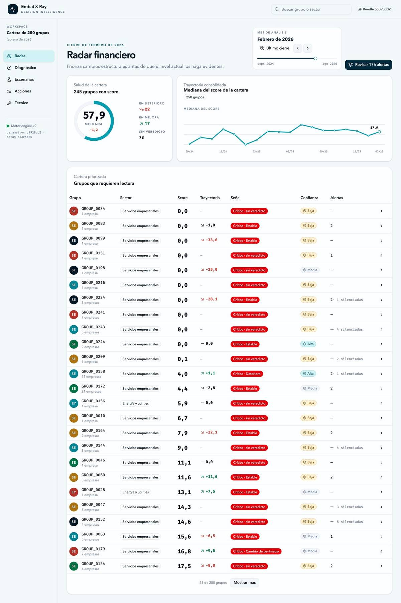
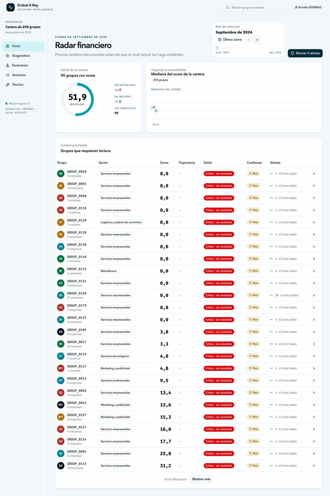

**Cómo funciona (Lógica y Estado)**
El componente visual (`month-slider.svelte`) es una representación del estado global gestionado por la clase reactiva `MonthStore` (`month-store.svelte.ts`).

*   **Inicialización:** Antes del primer renderizado (`$effect.pre` en `+layout.svelte`), el *store* se inicializa llamando a `monthStore.init(data.manifest.months)` con la lista cronológica de meses que dicta el contrato del *bundle*. Por defecto, el mes activo (`monthStore.month`) es el último disponible (`latest`).
*   **Interacción del usuario:**
    *   Las flechas llaman a `monthStore.step(-1)` o `monthStore.step(1)`, modificando el índice.
    *   El deslizador mapea su valor numérico (`min={0}`, `max={last}`, `step={1}`) directamente al índice del array de meses mediante `onValueChange`. El tirador del deslizador recibe el atributo `aria-valuetext` con el nombre del mes formateado para accesibilidad.
    *   El botón «Último cierre» invoca `monthStore.select(monthStore.latest)`.
*   **Sincronización con la URL (`?m=`):**
    *   **Lectura:** Al cargar la aplicación o navegar (`afterNavigate`), el método `readUrl()` busca el parámetro `m` en la URL. Valida que tenga el formato correcto mediante la función `isMonth` (expresión regular `^[0-9]{4}-(0[1-9]|1[0-2])$`).
    *   **Resolución de conflictos:** Si la URL pide un mes válido, se procesa con la función `resolveMonth`. Si el mes pedido existe en el *bundle*, se selecciona. Si se pide un mes anterior al inicio del *bundle*, se selecciona el primer mes disponible. Si se pide un mes intermedio que falta en los datos, se selecciona el mes inmediatamente anterior que sí exista.
    *   **Escritura:** Al cambiar el mes desde la interfaz, el método `syncUrl()` actualiza la barra de direcciones. Para evitar saturar el historial del navegador o bloquear el hilo principal mientras el usuario arrastra rápidamente el deslizador, la escritura está retrasada (*debounced*) 200 ms (`URL_WRITE_DELAY_MS`) y utiliza `replaceState` en lugar de `pushState`.
    *   **Limpieza:** Si el mes seleccionado coincide con el último cierre disponible (el comportamiento por defecto), el parámetro `?m=` se elimina de la URL para mantener los enlaces limpios.
*   **Persistencia en la navegación:** Para garantizar que el usuario no pierda su contexto temporal al cambiar de pantalla (ej. al hacer clic en un grupo en la tabla del Radar), todos los enlaces internos utilizan el método `monthStore.href(path)`. Este método inyecta automáticamente el parámetro `?m=` actual en la URL de destino antes de que ocurra la navegación.

**Fuente** · `src/lib/xray/month-slider.svelte`, `src/lib/xray/month-store.svelte.ts`, `src/lib/xray/month.ts`, `src/routes/(app)/+layout.svelte`.

# II. Pantallas

## 3. Radar financiero

### Visión general del Radar financiero

El **Radar financiero** es la vista principal y punto de entrada de la aplicación Embat X-Ray. Su propósito es ofrecer una visión consolidada de la salud financiera de toda la cartera de grupos empresariales en un mes determinado, permitiendo identificar rápidamente qué entidades requieren atención prioritaria debido a su bajo nivel de *score* o a un deterioro estructural reciente.

La pantalla se divide en un área superior con controles globales y métricas agregadas (KPIs), y un área inferior que contiene la tabla interactiva de la cartera priorizada.

**Fuente:** `src/routes/(app)/+page.svelte`, `src/lib/xray/xray-dashboard.svelte`, `src/lib/xray/radar-view.svelte`.

### Cabecera y controles globales

La parte superior del área de trabajo establece el contexto temporal y proporciona el acceso directo a la gestión de excepciones (alertas).

*   **Dónde aparece:** En la franja superior de la vista `RadarView`, bajo la cabecera global de la aplicación (`XrayDashboard`).
*   **Anatomía:**
    *   **Antetítulo:** «Cierre de [Mes y año]» (ej. «Cierre de agosto de 2026»), formateado mediante la función `formatPeriod`. Aplica la clase `eyebrow`.
    *   **Título principal:** «Radar financiero» (`<h1 id="radar-heading">`).
    *   **Descripción:** «Prioriza cambios estructurales antes de que el nivel actual los haga evidentes.» (`
`).
*   **Cómo funciona:**
    *   **Buscador global:** Ubicado en la cabecera de la aplicación (`xray-dashboard.svelte`). Contiene el *placeholder* «Buscar grupo o sector». Al escribir, filtra los grupos en tiempo real. Si el campo tiene el foco (`searchFocused`) y hay coincidencias, despliega una lista flotante (`<ul role="listbox">`) con un máximo de 8 resultados (`matches.slice(0, 8)`). Cada fila del desplegable muestra el identificador, el sector y el *score* (en color `var(--danger)` si la banda es `critical`). Al pulsar `Enter` o hacer clic en un resultado, navega a la vista del grupo.
    *   **Identificador de Bundle:** Pastilla en la cabecera global con el icono `Sparkles` y el texto «Bundle [Hash]» (ej. «Bundle 550980d2»), truncado a 8 caracteres mediante `shortHash`. El atributo `title` revela el hash completo al hacer *hover*.
    *   **Selector de mes (`<MonthSlider />`):** Tarjeta ubicada a la derecha que muestra la etiqueta «MES DE ANÁLISIS» y el mes actual. Permite cambiar el mes activo mediante botones de flecha (`<` y `>`) o arrastrando el control deslizante (`<Slider>`) sobre la línea temporal que abarca desde el primer hasta el último mes disponible en el *bundle* (etiquetados con `formatPeriodShort`, ej. «sept 2024» y «ago 2026»). Si el mes seleccionado no es el último, aparece un botón «Último cierre» con el icono `History`. Al cambiar el mes, toda la vista se recalcula y la URL se actualiza con el parámetro `?m=YYYY-MM`.
    *   **Botón de alertas:** Botón destacado con el icono `BellRing` y el texto «Revisar [N] alertas». El número `N` corresponde a la suma de todas las alertas en estado `fired` (activas) para el mes seleccionado, calculado en `portfolio.ts` (`summary.fired`). Al pulsarlo, ejecuta `setParams({ tab: 'tecnico', section: 'alertas' })`, redirigiendo a la pestaña de alertas del detalle técnico.

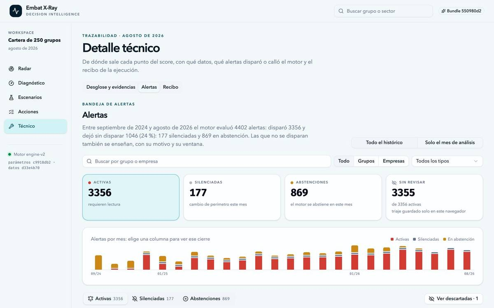

### Tarjetas de resumen (KPIs de la cartera)

Debajo de la cabecera se presentan dos tarjetas que agregan los datos de todos los grupos de la cartera para el mes seleccionado. Los cálculos se realizan en la función `summarize` de `src/lib/xray/portfolio.ts`.

#### Salud de la cartera

Muestra la distribución de los estados de salud y la mediana del *score* actual mediante el componente `<ScoreGauge />`.

*   **Anatomía y cálculos:**
    *   **Título y subtítulo:** «Salud de la cartera» · «[N] grupos con score». Solo se cuentan los grupos que tienen un *score* observable en el mes (`row.observed === true`).
    *   **Mediana:** Muestra la mediana de los *scores* de todos los grupos observados (`summary.median`). El valor interno está en décimas y se formatea dividiendo por 10 con un decimal (ej. `577` se muestra como `57,7`).
    *   **Variación (Delta):** Muestra la diferencia entre la mediana del mes actual y la mediana de hace 3 meses (`DELTA_MONTHS`). Se formatea con signo explícito mediante `formatSigned(delta, 1)` (ej. `+4,5`).
    *   **Desglose de estados:**
        *   **«EN DETERIORO»:** Número de grupos con `direction === 'deteriorating'` y que no están en abstención (`!row.abstained`). Acompañado del icono `TrendingDown` y renderizado con la clase `negative` (rojo).
        *   **«EN MEJORA»:** Número de grupos con `direction === 'improving'` y que no están en abstención. Acompañado del icono `ArrowUpRight` y renderizado con la clase `positive` (verde).
        *   **«SIN VEREDICTO»:** Número de grupos donde el motor se abstiene (`row.abstained === true`). Se muestra en color neutro (`font-data`).

#### Trayectoria consolidada

Muestra la evolución histórica de la mediana de la cartera mediante el componente `<TrajectoryChart />`.

*   **Anatomía y cálculos:**
    *   **Textos:** Título «Mediana del score de la cartera», subtítulo «Trayectoria consolidada», y un *badge* indicando el total de grupos en el *bundle* (ej. «250 grupos»).
    *   **Gráfico:** Recibe un array con las medianas calculadas para cada mes desde el inicio del *bundle* hasta el mes seleccionado (`portfolio.months.slice(0, upTo)`). El eje X muestra los meses en formato corto (`MM/AA`), y el último punto dibuja el valor exacto de la mediana actual formateado a un decimal. Se renderiza en modo `compact={true}`.

### Cartera priorizada (Tabla y listado)

Es el núcleo del Radar: un listado exhaustivo de todos los grupos, ordenado para destacar aquellos que requieren atención inmediata.

*   **Ordenación por defecto:** Los grupos se ordenan de menor a mayor *score* (`sortRows(rows, 'shown', 'asc')`). Los grupos sin datos en el mes (`shown === null`) se envían al final de la lista. Los empates se resuelven alfabéticamente por el identificador del grupo (`id`).

#### Buscador y filtrado

*   **Cómo funciona:** El texto introducido en el buscador global se pasa como la *prop* `query` a `RadarView`. La función `filterRows` (en `portfolio.ts`) normaliza el texto (elimina tildes y pasa a minúsculas mediante `normalizeText`) y busca coincidencias en el `id` del grupo, el `industry` (sector), el `country` (código ISO) y el nombre del país traducido al español (`countryName(country)`).

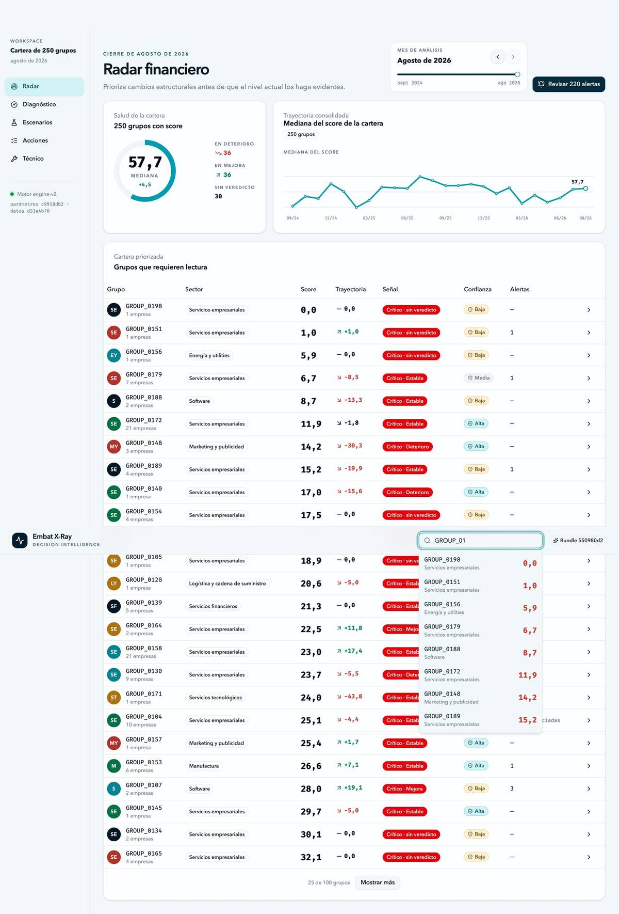

#### Columnas de la tabla (Escritorio y Tablet)

En resoluciones medias y grandes (`md:block`), los datos se presentan mediante el componente `<Table.Root>`. Toda la fila (`<Table.Row>`) tiene un efecto *hover* que oscurece ligeramente el fondo (`hover:bg-muted/50`), indicando que es interactiva.

| Columna | Contenido y Lógica | Componentes y Formato |
| :--- | :--- | :--- |
| **Grupo** | Avatar, identificador y número de empresas. | `<CompanyAvatar />` genera un color basado en el hash del nombre. Muestra `row.id` y `row.group.n_companies` pluralizado (ej. «1 empresa» o «7 empresas»). |
| **Sector** | Sector inferido del grupo. | `<Badge variant="outline">` con `row.group.industry`. Si es `null`, muestra «—» con la clase `text-sm text-muted-foreground`. |
| **Score** | Puntuación del mes seleccionado. | Tipografía grande y negrita (`font-data text-xl font-semibold`). Usa `formatScore(row.shown)`. Si es `null`, muestra «—». |
| **Trayectoria** | Variación del *score* respecto a hace 3 meses (`DELTA_MONTHS`). | Si `delta > 0`: `ArrowUpRight` (clase `positive`). Si `delta < 0`: `ArrowDownRight`. Si `delta === 0`: `Minus`. Formateado con `formatScoreDelta`. **Regla de color:** Solo recibe la clase `negative` (rojo) si la caída es estrictamente menor a -3,0 puntos (`row.delta < -30` décimas). |
| **Señal** | Estado de salud y dirección. | `<Badge>`. Si no hay datos: «Sin datos este mes». Si hay abstención: «[Banda] · sin veredicto». Si hay datos: «[Banda] · [Dirección]» (ej. «Crítico · Deterioro»). Variante `destructive` (rojo) si la banda es `critical` o si la dirección es `deteriorating` (sin abstención). Si no, variante `outline`. |
| **Confianza** | Nivel de confianza del motor. | `<ConfidencePill compact />`. Muestra el icono y el nivel (Alta, Media, Baja) coloreado según `CONF_TONE`. |
| **Alertas** | Conteo de alertas del grupo en el mes. | Muestra `row.fired` formateado. Si hay alertas silenciadas (`row.muted > 0`), añade en texto pequeño gris: «· [N] silenciadas» con el atributo `title="Alertas que el motor decidió no disparar"`. Si no hay alertas, muestra «—». |
| **Acción** | Botón de navegación. | `<Button variant="ghost" size="icon-sm">` con icono `ChevronRight`. Enlaza a la vista de detalle del grupo (`monthStore.href('/group/' + row.id)`). |

#### Vista en tarjetas (Móvil)

En resoluciones pequeñas (`md:hidden`), la tabla se oculta y se renderiza una lista de enlaces (`<a>`) estructurados como tarjetas.
*   **Anatomía:** Cada tarjeta muestra a la izquierda el Avatar, el ID, el número de empresas, el *badge* del sector y el *badge* de la señal. A la derecha, alineado al final, se muestra el *Score* en tamaño `text-2xl`, la trayectoria y el conteo de alertas activas pluralizado (ej. «1 alerta» o «2 alertas»). Toda la tarjeta es un área clicable que navega al detalle del grupo.

#### Paginación y carga diferida

Para mantener el rendimiento del DOM con carteras grandes, la lista está paginada en el cliente.
*   **Cómo funciona:** Inicialmente se muestran `PAGE_SIZE` (25) filas.
*   **Controles:** Al final de la lista, si hay más grupos filtrados que los visibles (`filtered.length > visible`), aparece un texto indicando el progreso (ej. «25 de 250 grupos») y un botón «Mostrar más». Al pulsarlo, la variable `visible` se incrementa en 50 unidades (`PAGE_SIZE * 2`), revelando más filas instantáneamente.

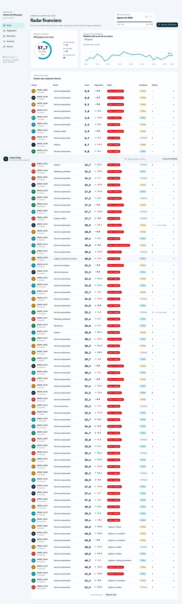

### Estados y variantes

#### Búsqueda sin resultados

*   **Cuándo ocurre:** Cuando el texto introducido en el buscador no coincide con ningún grupo, sector o país (`filtered.length === 0`).
*   **Qué se ve:** Se oculta la tabla y se muestra el componente `<EmptyState compact />`.
*   **Textos literales:**
    *   Icono: `SearchX`.
    *   Título: «Ningún grupo coincide con la búsqueda».
    *   Descripción: «Prueba con otro identificador, sector o país.»

#### Primer mes del bundle

*   **Cuándo ocurre:** Cuando el usuario selecciona el primer mes cronológico disponible en el *bundle* (ej. septiembre de 2024).
*   **Comportamiento:**
    *   **Trayectorias:** Como el cálculo de la trayectoria (`delta`) requiere comparar el mes actual con el de hace 3 meses (`DELTA_MONTHS`), en los primeros meses este valor es `null` al no existir histórico suficiente. La columna «Trayectoria» muestra un guion gris («—»).
    *   **Gráfico consolidado:** El gráfico de líneas solo dibuja un punto (el del mes actual), ya que no hay histórico previo que trazar.

## 4. Diagnóstico explicable

### Diagnóstico explicable

La vista de «Diagnóstico explicable» (`diagnosis-view.svelte`) ofrece una disección visual y cuantitativa del *score* de salud financiera de un grupo empresarial específico en un mes determinado. Su objetivo es explicar de forma transparente cómo el motor analítico ha llegado a la puntuación final, mostrando la contribución exacta de cada pilar, el nivel de confianza y la trayectoria histórica.

#### Cabecera y selector de grupo (`focus-picker`)

**Qué es** · El encabezado de la vista que identifica a la entidad bajo análisis y permite cambiar a otro grupo sin abandonar la pestaña.

**Dónde aparece** · En la parte superior de la vista, bajo las pestañas de navegación principales.

**Anatomía y textos literales** ·
- **Avatar (`CompanyAvatar`)**: Un círculo de color generado a partir de un *hash* del nombre o ID de la entidad (`seed = nombre + id` módulo la longitud de la paleta de tonos), que contiene las iniciales del sector o del grupo (las dos primeras letras de las dos primeras palabras, o los dos últimos caracteres del ID).
- **Miga de pan (*eyebrow*)**: Muestra el identificador y el mes, por ejemplo, «GROUP_0153 · agosto de 2026» (`formatPeriod`). Si no hay grupo cargado, muestra «Grupo».
- **Título**: «Diagnóstico explicable».
- **Pastilla de contexto sectorial**: Un `Badge` con la variante `outline` que muestra el sector inferido y su confianza (`{industry.label} · {formatPercent(industry.confidence, 0)}`), por ejemplo, «Manufactura · 21 %». El atributo HTML `title` contiene el motivo de la clasificación (`industry.reason`).
- **Selector de grupo (`focus-picker.svelte`)**:
  - Etiqueta superior: «Grupo» (`metric-label`).
  - Botón disparador (`Select.Trigger`) con el texto del grupo seleccionado o «Elegir grupo».
  - Menú desplegable (`Select.Content`) con la lista de grupos. Cada ítem muestra el ID del grupo y, alineado a la derecha, su *score* formateado a un decimal (`formatScore`) o un guion «—» si es nulo.
- **Texto introductorio**: «El score se descompone en cinco pilares: cada uno aporta o resta puntos sobre la base.»

**Cómo funciona** ·
El selector lee y escribe el parámetro de URL `focus`. La selección del grupo por defecto se resuelve en `xray-dashboard.svelte` siguiendo una jerarquía estricta:
1. Si la URL contiene el parámetro `focus` y este coincide con un grupo válido del *bundle*, se selecciona ese grupo.
2. Si no hay parámetro o es inválido, el sistema busca el primer grupo de la lista priorizada (`rows`) que tenga un *score* válido en el mes seleccionado (`rows.find((row) => row.shown !== null)?.id`). Dado que `rows` se ordena de menor a mayor *score* (`sortRows(..., 'shown', 'asc')`), el diagnóstico se abre por defecto en el grupo con peor salud financiera del mes.

Al seleccionar un nuevo grupo en el desplegable, se actualiza el parámetro `focus` en la URL mediante `setParams({ focus: id })`, lo que desencadena la recarga reactiva de los datos sin recargar la página.

**Fuente** · `frontend/src/lib/xray/diagnosis-view.svelte`, `frontend/src/lib/xray/focus-picker.svelte`, `frontend/src/lib/xray/company-avatar.svelte`, `frontend/src/lib/xray/xray-dashboard.svelte`.

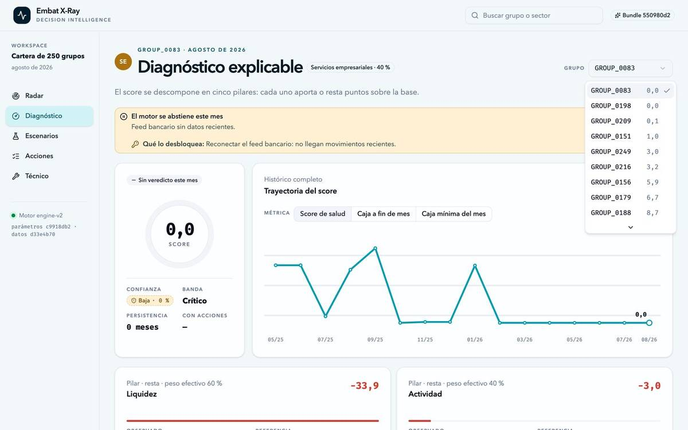
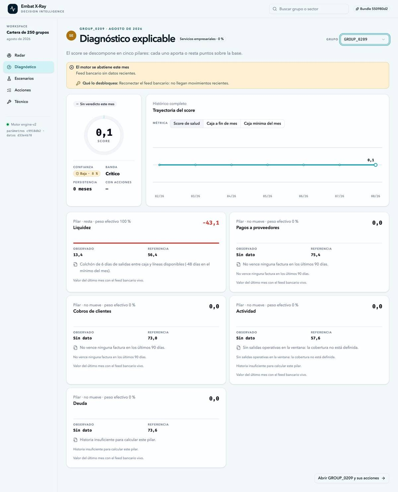

#### Gestión de estados de carga (`focus-frame`)

**Qué es** · Un componente contenedor que gestiona el ciclo de vida de la petición asíncrona para obtener el archivo JSON específico del grupo (`groups/[id].json`) y maneja los casos límite de disponibilidad de datos.

**Estados y variantes** ·
El estado se maneja mediante el tipo `FocusState`, que transita por cuatro posibles valores:
- `idle`: Estado inicial o cuando no hay un grupo seleccionado. Muestra un `EmptyState` con el icono `MousePointerClick`, el título «Elige un grupo» y la descripción «Ningún grupo tiene score en este mes.».
- `loading`: Mientras se resuelve la promesa `loadGroup(fetch, id)`. Muestra un contenedor con `aria-label="Cargando grupo"` y dos esqueletos de carga (`Skeleton`) de altura `h-72` que simulan la disposición de las tarjetas principales.
- `error`: Si la promesa es rechazada (por ejemplo, un `BundleError` por archivo faltante). Muestra un `EmptyState` con tono `danger`, el icono `FileWarning`, el título «No se pudo leer [id]» y el mensaje de error capturado.
- `ready`: La petición ha tenido éxito. El componente extrae la entrada del mes correspondiente (`entryAt(focus.group.months, monthStore.month)`).
  - **Subestado sin datos**: Si el grupo existe pero no tiene datos para el mes seleccionado, muestra un `EmptyState` con el icono `CalendarOff`, el título «Sin datos de [id] en [mes]» (`formatPeriod`) y la descripción «Su primer cierre observado es [mes] (`formatPeriod(focus.group.first_month)`). Elige otro mes u otro grupo.».
  - **Subestado con datos**: Renderiza el contenido completo del diagnóstico.

*Nota sobre discrepancias:* La captura proporcionada bajo el nombre `074-diagnostico-error-cargando-grupo` muestra en realidad la interfaz completamente renderizada en estado `ready` para el grupo «GROUP_0153», contradiciendo su nombre de archivo. El estado de carga real se ilustra en la captura `075-diagnostico-estado-cargando`.

**Fuente** · `frontend/src/lib/xray/focus-frame.svelte`.

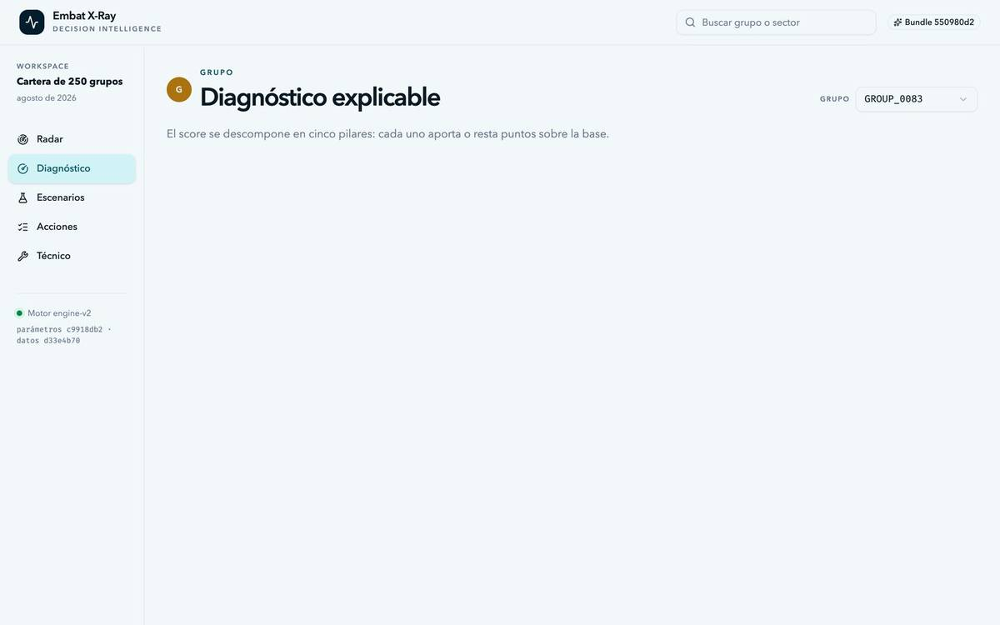
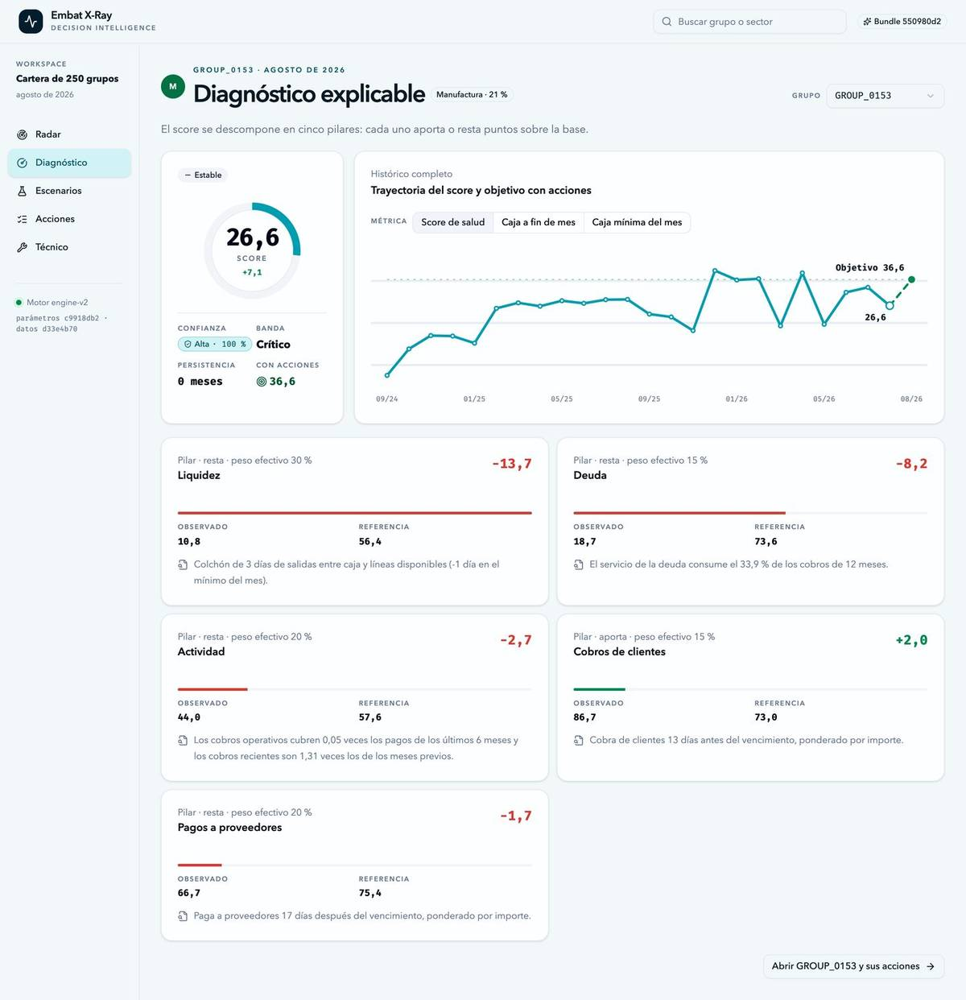

#### Alertas condicionales: Abstención y Señal

Antes de las métricas principales, el sistema inyecta avisos críticos basados en las reglas del motor si se cumplen ciertas condiciones.

**Abstención (`abstained-state`)**
Si el motor no dispone de datos suficientes para emitir un veredicto fiable, la propiedad `entry.abstain` contiene datos.
- **Anatomía**: Se renderiza un componente `Alert` con la clase `border-[var(--warning)]/40 bg-[var(--warning-soft)]` (fondo amarillo suave, bordes ámbar) y el icono `PauseCircle`.
- **Textos**:
  - Título: «El motor se abstiene este mes».
  - Descripción: Muestra el motivo de la abstención traducido mediante `glossaryText` desde el manifiesto (por ejemplo, «Feed bancario sin datos recientes.»).
  - Desbloqueo: Precedido por un icono de llave (`KeyRound`) en tono `warning-strong`, muestra el texto literal «Qué lo desbloquea:» seguido de la acción correctiva (`entry.abstain.unlock`).
- **Lógica**: Durante una abstención, el *score* se muestra en el resto de la vista, pero se considera no vinculante.

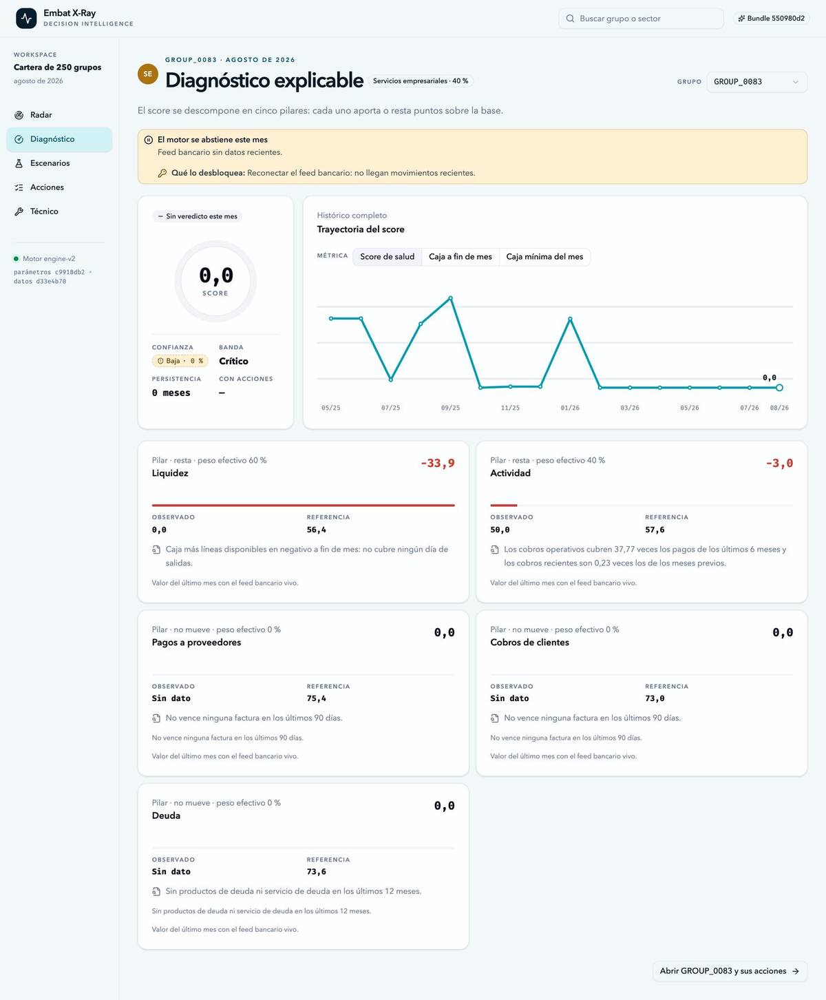

**Señal detectada**
Si el motor ha confirmado un cambio de tendencia (`entry.verdict.detected_since` no es nulo), se muestra una alerta advirtiendo del inicio de la señal.
- **Anatomía**: Componente `Alert` con clases `border-[var(--warning)]/35 bg-[var(--warning-soft)]` y el icono `CalendarClock`.
- **Textos**:
  - Título: «Señal detectada desde [mes]» (`formatPeriod(entry.verdict.detected_since)`).
  - Descripción: «El cambio de trayectoria acumula [n] [cierre/cierres] de persistencia.» (pluralización basada en `entry.verdict.persistence_months`).

#### Héroe de entidad (`entity-hero`)

**Qué es** · El bloque visual principal que resume la salud financiera del grupo. Se divide en dos tarjetas: el estado actual (izquierda) y la trayectoria histórica (derecha).

**Anatomía y funcionamiento de la tarjeta de Score actual** ·
- **Insignia de tendencia**: Un `Badge` en la esquina superior izquierda.
  - **Lógica de color**: Variante `destructive` (rojo) si `verdict.direction` es `deteriorating`; variante `secondary` (gris) para el resto.
  - **Icono**: `ArrowUpRight` (si es `improving`), `ArrowDownRight` (si es `deteriorating`), o `Minus` (para el resto).
  - **Texto**: Si no hay veredicto disponible (`!verdict.available`), muestra «Sin veredicto este mes». Si lo hay, concatena la dirección (`DIRECTION_TEXT`) y la naturaleza (`NATURE_TEXT` en minúsculas), por ejemplo, «↘ Deterioro · estructural» o «— Estable».
- **Medidor de score (`score-gauge`)**: Un gráfico circular generado mediante un `conic-gradient` en CSS.
  - **Lógica visual**: El grado de llenado se calcula como `score * 3.6deg`. El color del trazo se vincula a la variable CSS `--signal`.
  - **Textos**: En el centro muestra el *score* (`entry.shown / 10`) formateado a un decimal (`formatNumber(rawScore, 1)`), la etiqueta «SCORE» y la variación respecto al periodo de comparación (`verdict.delta3 / 10`). La variación se formatea con `formatSigned(delta, 1)` (que fuerza el signo `+` o `-`) y se colorea con las clases `positive` (verde) o `negative` (rojo) según su valor. Si el *score* es nulo, muestra «—».
- **Cuadrícula de métricas (2x2)**:
  - **Confianza**: Componente `ConfidencePill` que evalúa `entry.conf.label` (`high`, `medium`, `low`). Aplica un tono semántico mediante `CONF_TONE` (verde, gris, amarillo) y muestra el icono correspondiente (`ShieldCheck`, `ShieldQuestion`, `ShieldAlert`). El texto concatena `CONF_TEXT` y el porcentaje de confianza global (`formatPercent(entry.conf.value, 0)`), por ejemplo, «Alta · 100 %».
  - **Banda**: Muestra el nombre de la banda en la que cae el *score* (`entry.band`), traducido desde el manifiesto mediante `bandLabel`.
  - **Persistencia**: Muestra `verdict.persistence_months` junto a la palabra «mes» o «meses» (`formatNumber`).
  - **Con acciones**: Calcula el *score* potencial máximo si se aplicaran todas las acciones recomendadas mediante la función `fullPlanTenths(entry)`. Si existen acciones, muestra el valor proyectado (`formatScore`) junto a un icono de diana (`Target`) y aplica la clase de color `text-[var(--success-strong)]`; si no, muestra un guion «—».

**Estados y variantes por Banda** ·
El color de los elementos de acento en la interfaz (como los puntos en las tablas o las pastillas en otras vistas) cambia según la banda, aunque el `score-gauge` mantiene su color corporativo `--signal`. Las bandas posibles y sus tonos (`BAND_TONE`) son:
- **Crítico:** *Score* < 40. Tono `danger` (rojo).
- **Vigilancia:** *Score* 40 – 60. Tono `warning` (naranja/amarillo).
- **Estable:** *Score* 60 – 80. Tono `signal` (azul/turquesa).
- **Sólido:** *Score* ≥ 80. Tono `success` (verde).

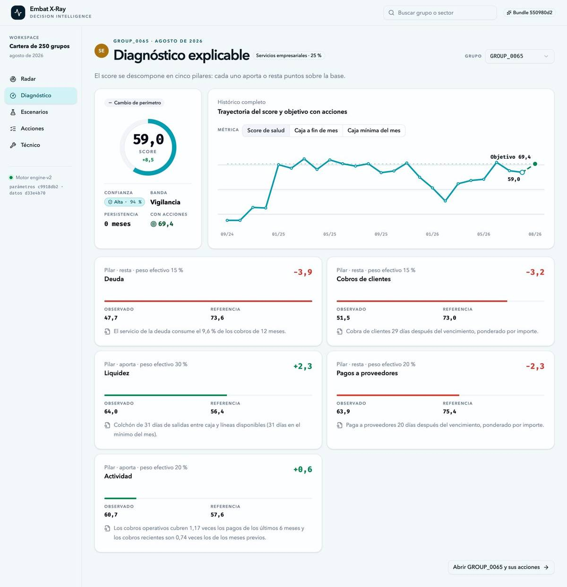
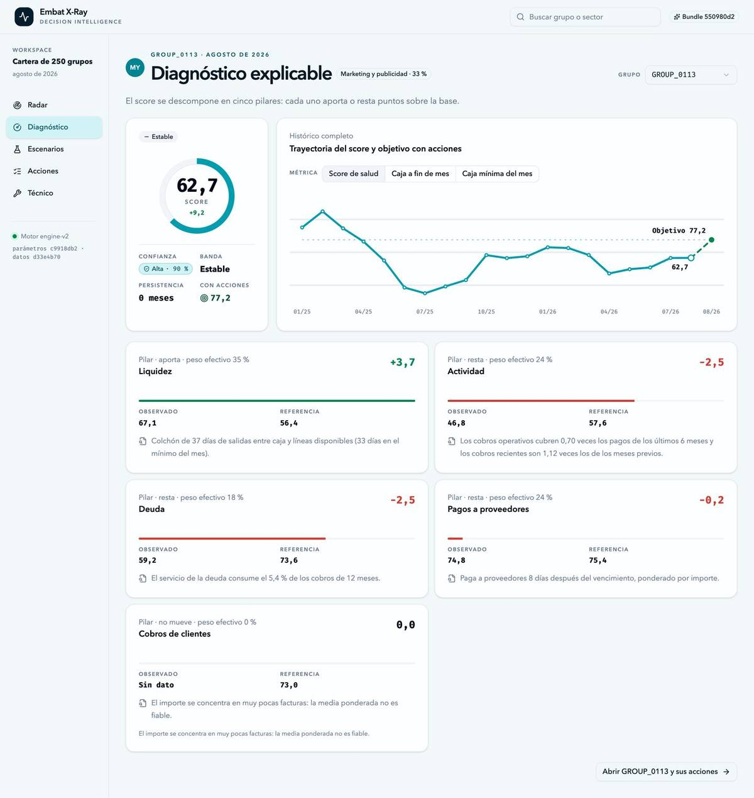
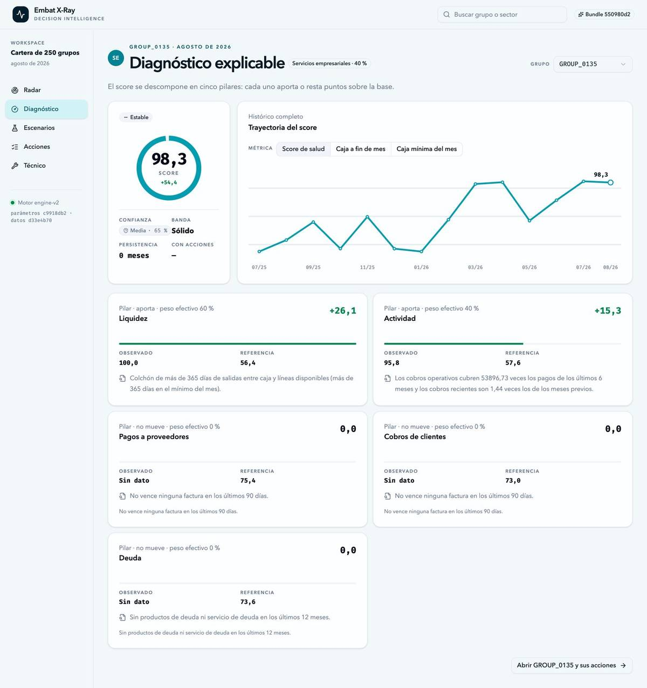
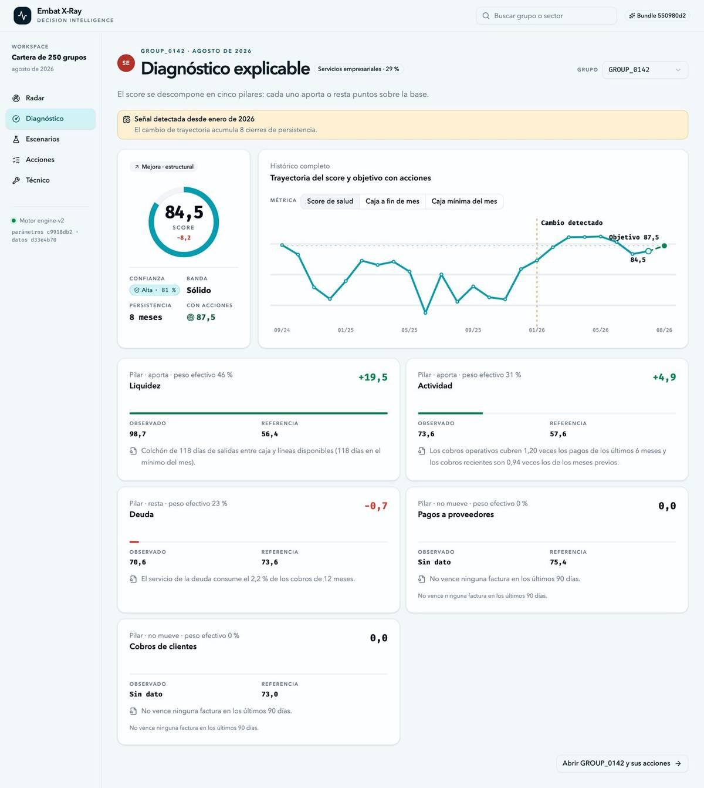

**Fuente** · `frontend/src/lib/xray/entity-hero.svelte`, `frontend/src/lib/xray/score-gauge.svelte`, `frontend/src/lib/xray/confidence-pill.svelte`, `frontend/src/lib/xray/tones.ts`.

#### Trayectoria del score (`trajectory-chart`)

**Qué es** · Un gráfico de líneas interactivo situado en la tarjeta derecha del héroe, que muestra la evolución de las métricas a lo largo del tiempo, recortado hasta el mes seleccionado.

**Anatomía y textos** ·
- **Cabecera**: Subtítulo «Histórico completo». El título cambia dinámicamente: si se muestra el *score* y hay acciones, dice «Trayectoria del score y objetivo con acciones»; si solo es el *score*, «Trayectoria del score»; si es otra métrica, muestra el nombre de la métrica (`activeSeries?.label`).
- **Selector de métricas**: Un `ToggleGroup` etiquetado como «MÉTRICA». Por defecto muestra el «Score de salud», pero itera sobre las series adicionales exportadas por el motor en `group.series` (por ejemplo, «Caja a fin de mes» o «Caja mínima del mes»).
- **Gráfico (SVG)**:
  - Eje X: Etiquetas de meses formateadas como `MM/AA` (`shortMonth`).
  - Línea observada (`observed-line`): Trazo continuo en color `--signal`.
  - Puntos observados (`observed-dot`): Círculos en cada mes con datos.
  - Tooltip interactivo (`hover-tooltip`): Al pasar el cursor (`onpointermove`), muestra el mes y el valor exacto.

**Lógica y cálculos** ·
- Los datos se preparan mediante la función `entitySeries(entries, month)`, que filtra el historial de meses (`group.months`) para incluir solo aquellos menores o iguales al mes seleccionado.
- **Formato de valores**: Si la métrica es el *score*, se formatea a un decimal (`formatNumber(value, 1)`). Si es una serie monetaria (`unit === 'EUR'`), usa `formatEuroCompact` (ej. `1,2 M€`). Para otras unidades, concatena el número con dos decimales y la unidad.
- **Marcador de cambio**: Si el motor detectó un cambio de tendencia (`changeIndex !== null`), dibuja una línea vertical discontinua de color `warning` (naranja) con la etiqueta «Cambio detectado».
- **Proyección**: Si la métrica activa es el *score* y existen acciones de mejora (`targetTenths !== null`), dibuja una línea discontinua verde (`projected-line`, color `success`) desde el último punto real hasta un nodo final (`target-dot`) que representa el objetivo alcanzable. Se añade una línea horizontal tenue de referencia y la etiqueta «Objetivo [valor]».

**Fuente** · `frontend/src/lib/xray/trajectory-chart.svelte`, `frontend/src/lib/xray/entity-series.ts`.

#### Desglose de pilares (`pillar-drivers`)

**Qué es** · Una cuadrícula de tarjetas (dispuestas en 1 o 2 columnas según el ancho de pantalla) que explica la aportación matemática de cada uno de los cinco pilares financieros al *score* base.

**Lógica de ordenación y escala** ·
- Las tarjetas se ordenan dinámicamente por el impacto absoluto de su contribución (`Math.abs(b.contrib) - Math.abs(a.contrib)`), asegurando que el pilar que más mueve el *score* (ya sea sumando o restando) aparezca primero.
- La escala máxima para las barras de progreso se calcula buscando el valor absoluto mayor entre todas las contribuciones (`Math.max(1, ...entry.pillars.map(p => Math.abs(p.contrib)))`).

**Anatomía de la tarjeta** ·
- **Cabecera**:
  - Descripción: «Pilar · [verbo] · peso efectivo [w_eff]%». El verbo se calcula dinámicamente: `contrib > 0 ? 'aporta' : contrib < 0 ? 'resta' : 'no mueve'`. El peso se formatea con `formatPercent(driver.w_eff, 0)`.
  - Título: Nombre del pilar traducido mediante `pillarLabel` (ej. «Liquidez», «Actividad»).
  - Impacto: El valor exacto de la contribución en puntos (`formatScoreDelta(driver.contrib)`), coloreado con las clases `positive` (verde) o `negative` (rojo) según su signo.
- **Barra de progreso (`Progress`)**:
  - Su porcentaje de llenado es proporcional a la contribución del pilar respecto a la escala máxima calculada (`(Math.abs(driver.contrib) / scale) * 100`).
  - El color del indicador (`progress-indicator`) es verde (`bg-[var(--success)]`) si suma, o rojo (`bg-[var(--danger)]`) si resta.
- **Cuadrícula comparativa**:
  - «OBSERVADO»: Muestra `driver.score` formateado a un decimal (`formatScore`). Si es nulo, muestra el texto literal «Sin dato».
  - «REFERENCIA»: Muestra el `baseline` extraído del manifiesto para ese pilar. Si no existe, muestra un guion «—».
- **Notas y compuertas (Gates)**:
  - Si el motor exporta una nota (`driver.note`), se muestra precedida por el icono `FileSearch`.
  - Si existen reglas de exclusión o condiciones especiales (`driver.gates`), se iteran y se muestra su texto traducido mediante el glosario del manifiesto (`glossaryText(manifest, 'gates', gate)`).

**Tope (Cap) y Penalización** ·
Aunque las tarjetas de pilares muestran las contribuciones puras, el *score* final puede verse afectado por reglas no compensatorias. Si un pilar es excesivamente débil, el motor aplica una **penalización** que resta puntos adicionales. Asimismo, pueden existir **topes** (`caps`) que impiden que el *score* supere un umbral máximo (por ejemplo, por liquidez negativa recurrente). Estos ajustes matemáticos no tienen una tarjeta propia en esta vista (se detallan exhaustivamente en la cascada de la pestaña «Técnico»), pero su efecto ya está descontado en el *score* global mostrado en el héroe de la entidad.

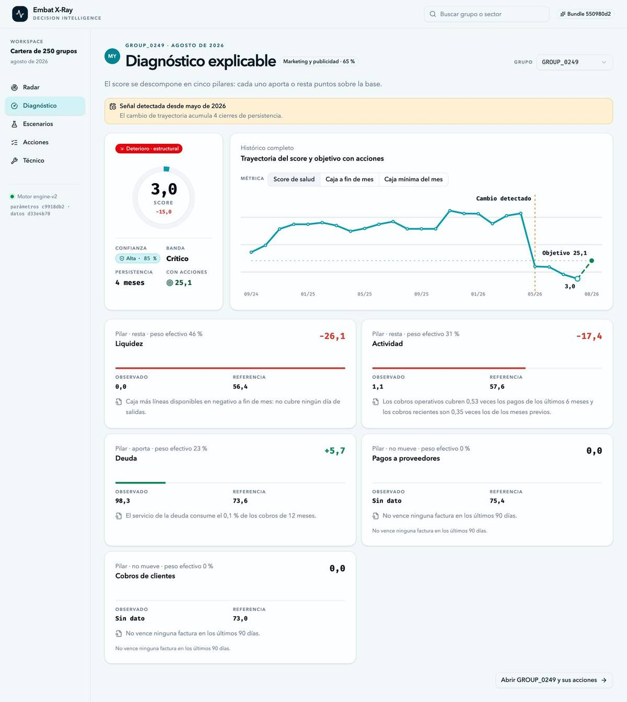

**Fuente** · `frontend/src/lib/xray/pillar-drivers.svelte`.

#### Navegación al detalle del grupo

Al final de la vista de diagnóstico, alineado a la derecha, se presenta un botón (`Button`) con la variante `outline` y el texto «Abrir [ID] y sus acciones →» acompañado del icono `ArrowRight`. Este botón utiliza la función `monthStore.href('/group/[id]')` para generar un enlace seguro hacia la ruta de la entidad, manteniendo el mes de análisis seleccionado en los parámetros de la URL (`?m=YYYY-MM`), permitiendo al usuario transitar hacia la vista operativa completa de la entidad sin perder el contexto temporal.

## 5. Escenarios

### Laboratorio de escenarios

**Qué es** · Es un entorno de simulación interactivo que permite al usuario medir el impacto potencial de las acciones recomendadas sobre el *score* de salud financiera de un grupo empresarial. A diferencia del «Centro de acciones», que lista las mejores palancas de toda la cartera, esta vista se centra en una única entidad y permite combinar múltiples acciones para ver su efecto conjunto.
**Dónde aparece** · En la pestaña «Escenarios» (`scenario-view.svelte`), accesible desde la barra lateral de navegación principal.
**Fuente** · `src/lib/xray/scenario-view.svelte`, `src/lib/xray/actions.ts`, `src/lib/xray/focus-frame.svelte`, `src/lib/xray/focus-picker.svelte`.

#### Cabecera y contexto de simulación

La parte superior de la vista establece el contexto temporal y la entidad sobre la que se va a simular, apoyándose en el estado global de la aplicación.

**Anatomía y textos literales** ·
*   **Miga de pan (*eyebrow*)**: Muestra el identificador del grupo y el mes seleccionado. Plantilla: `{focus.state === 'ready' ? focus.group.id : 'Grupo'} · {formatPeriod(monthStore.month)}`. Por CSS (`uppercase`), se muestra en mayúsculas, por ejemplo: «GROUP_0153 · AGOSTO DE 2026».
*   **Título principal (`h1`)**: «Laboratorio de escenarios».
*   **Descripción (`.page-lead`)**: «Activa las acciones que el motor calculó para este grupo; el histórico observado permanece intacto.».
*   **Selector de grupo (`FocusPicker`)**: Un control desplegable a la derecha para cambiar la entidad bajo análisis sin abandonar la pestaña.
    *   Etiqueta: «Grupo».
    *   Texto por defecto si no hay selección: «Elegir grupo».
    *   Opciones: Lista todos los grupos de la cartera. Muestra el identificador (`row.id`) y su *score* formateado con `formatScore(row.shown)`. Si el grupo no tiene *score* ese mes, muestra un guion «—».
*   **Pastilla de estado estática**: Un *badge* con la variante `outline` que acompaña al selector. Muestra el icono `FlaskConical` y el texto literal «Estimación no aplicada». Este *badge* es estático y advierte de que el laboratorio es un entorno de pruebas, no la realidad consolidada.

**Cómo funciona el estado** · 
La selección de acciones se gestiona mediante un `SvelteSet` local llamado `selected`, que almacena los identificadores (`id`) de las acciones marcadas. Para evitar que una simulación se arrastre por error al cambiar de contexto, un efecto reactivo (`$effect`) observa la variable `scope` (compuesta por el `id` del grupo y el mes activo en `monthStore`). Si el usuario cambia de grupo en el `FocusPicker` o de mes en el deslizador superior, el conjunto `selected` se vacía automáticamente (`selected.clear()`).

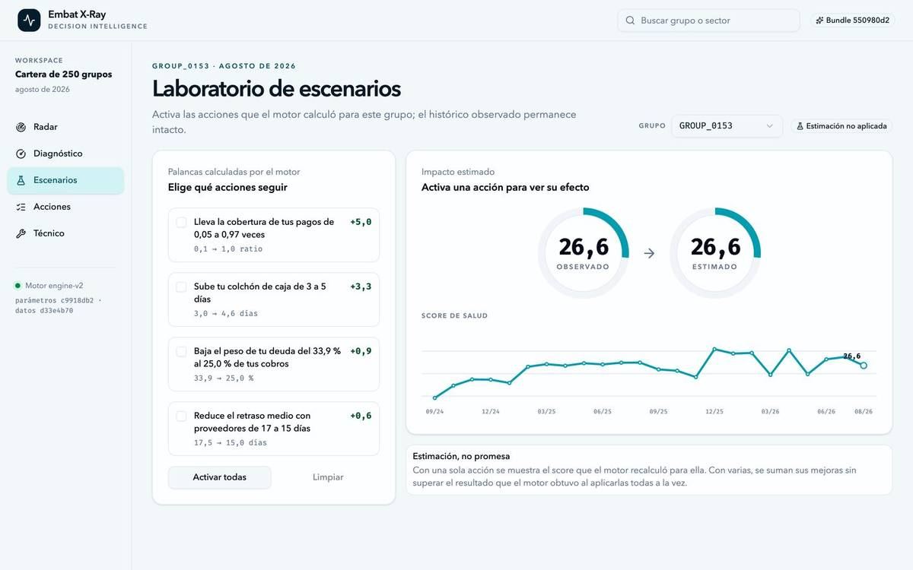

#### Palancas calculadas por el motor (Columna izquierda)

**Qué es** · El panel interactivo donde el usuario selecciona qué recomendaciones desea simular.
**Datos de origen** · Lee el array `actions` dentro del objeto `EntityMonth` del bundle. Las acciones se ordenan de mayor a menor impacto potencial utilizando la función `entryActions` (que ordena por `uplift_tenths` descendente).

**Anatomía** ·
*   **Cabecera de la tarjeta**:
    *   Descripción (`Card.Description`): «Palancas calculadas por el motor».
    *   Título (`Card.Title`): «Elige qué acciones seguir».
*   **Lista de acciones**: Se itera sobre el array de acciones. Cada elemento es un `<label>` interactivo que envuelve:
    *   **Casilla de verificación (`Checkbox`)**: Vinculada reactivamente a `selected.has(action.id)`. Al cambiar, ejecuta `toggle(action.id, on)`.
    *   **Título de la acción**: Texto literal exportado por el motor en `action.title` (ej. «Lleva la cobertura de tus pagos de 0,05 a 0,97 veces»).
    *   **Detalle métrico**: Si la acción incluye `action.current` y `action.target`, muestra la transición de la métrica subyacente formateada a un decimal: `{formatNumber(action.current, 1)} → {formatNumber(action.target, 1)} {action.unit ?? ''}`. Ejemplo real: «0,1 → 1,0 ratio».
    *   **Impacto individual**: Alineado a la derecha, muestra los puntos que suma la acción por sí sola, formateados con `formatScoreDelta(action.uplift_tenths)` y en color verde (`text-[var(--success-strong)]`). Ejemplo: «+5,0».
*   **Botonera inferior**:
    *   **«Activar todas»**: Botón (`variant="outline"`) que ejecuta `selectAll(entry)`, iterando sobre todas las acciones del mes y añadiéndolas al `SvelteSet`.
    *   **«Limpiar»**: Botón de texto plano (`variant="ghost"`) que ejecuta `selected.clear()`. Se deshabilita (`disabled={selected.size === 0}`) si no hay ninguna acción marcada.

**Interacción y estilos dinámicos** ·
El `<label>` de cada acción reacciona al estado del `Checkbox` mediante selectores CSS avanzados (`has-[[data-state=checked]]`). 

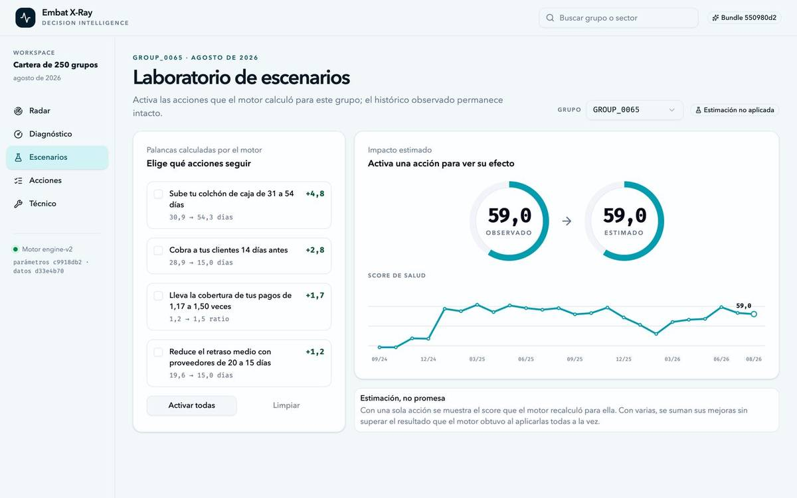
*Estado inicial: Ninguna acción seleccionada. El contenedor de cada palanca tiene fondo blanco, borde gris y reacciona al hover con `hover:bg-muted/40`.*

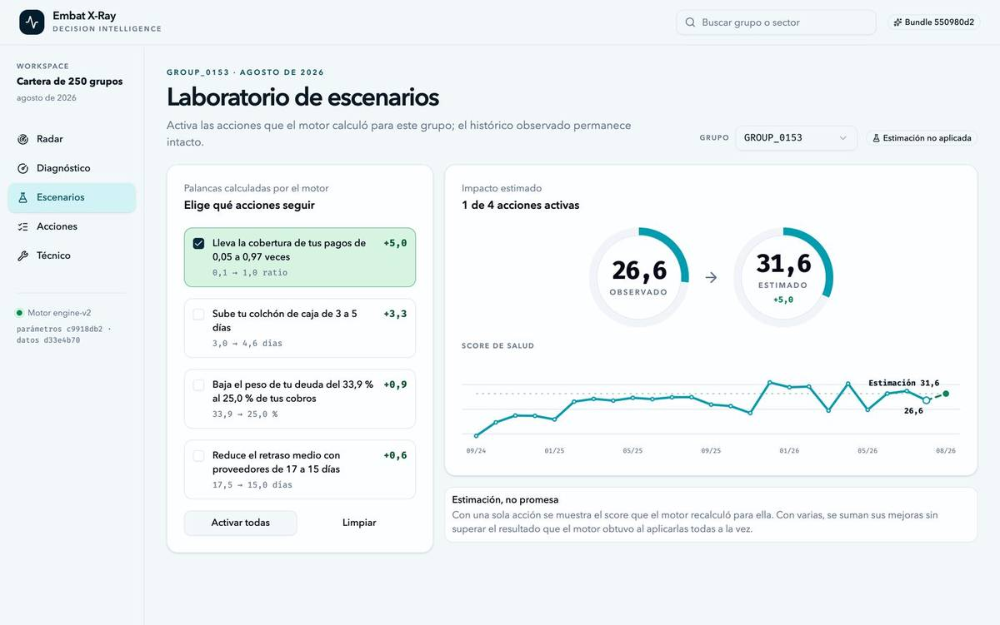
*Estado activo: Al marcar una casilla, todo su contenedor adquiere un fondo verde menta suave (`bg-[var(--success-soft)]`) y un borde verde definido (`border-[var(--success)]/50`).*

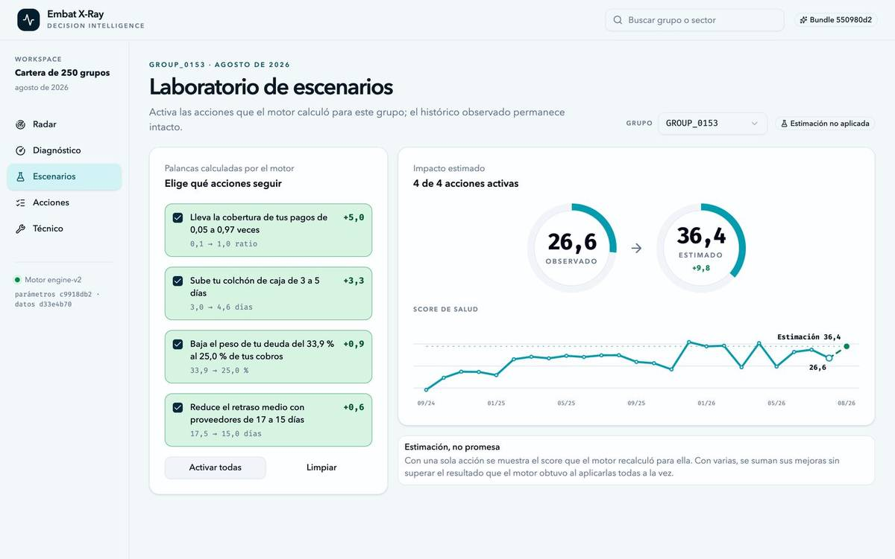
*Uso del botón «Activar todas»: Todas las palancas se resaltan simultáneamente y el impacto en la columna derecha se recalcula al máximo posible.*

*Uso del botón «Limpiar»: Las palancas vuelven a su estado de reposo y la estimación de la columna derecha se iguala al valor observado.*

#### Impacto estimado (Columna derecha)

**Qué es** · El panel de resultados que refleja visualmente el recálculo del *score* basado en las palancas activadas. Se compone de dos tarjetas apiladas verticalmente.

**Anatomía de la tarjeta principal** ·
*   **Cabecera**:
    *   Descripción: «Impacto estimado».
    *   Título dinámico: Si no hay acciones seleccionadas (`selected.size === 0`), muestra «Activa una acción para ver su efecto». Si hay selección, muestra la proporción: `{formatNumber(selected.size)} de {formatNumber(actions.length)} acciones activas` (ej. «1 de 4 acciones activas»).
*   **Comparador de medidores (`ScoreGauge`)**:
    *   **Medidor izquierdo («OBSERVADO»)**: Muestra el *score* real del mes (`entry.shown / 10`).
    *   **Icono central**: Una flecha hacia la derecha (`ArrowRight`) en color gris (`text-muted-foreground`).
    *   **Medidor derecho («ESTIMADO»)**: Muestra el *score* proyectado (`projected / 10`). Si es mayor que el observado, el componente `ScoreGauge` calcula automáticamente el diferencial (`delta={(projected - entry.shown) / 10}`) y lo muestra en verde debajo del número (ej. «+5,0»).
*   **Gráfico de evolución (`TrajectoryChart`)**:
    *   Se renderiza en modo compacto (`compact={true}`), reduciendo su altura de 230 px a 150 px.
    *   Muestra la serie histórica (`trajectory.values`) y los meses (`trajectory.months`) calculados por `entitySeries`.
    *   Si hay acciones seleccionadas (`selected.size > 0`), se le pasa el valor proyectado (`projected=[projected / 10]`). El gráfico dibuja automáticamente una línea discontinua verde desde el último punto real hasta un nuevo nodo verde, etiquetado con el texto pasado en `projectedLabel="Estimación"`.

**Anatomía de la tarjeta de aviso metodológico (`Alert`)** ·
Situada debajo del gráfico, explica la lógica matemática subyacente para gestionar las expectativas del usuario.
*   **Título (`Alert.Title`)**: «Estimación, no promesa».
*   **Descripción (`Alert.Description`)**: «Con una sola acción se muestra el score que el motor recalculó para ella. Con varias, se suman sus mejoras sin superar el resultado que el motor obtuvo al aplicarlas todas a la vez.».

##### Lógica de proyección matemática

El cálculo del *score* estimado no es una simple suma lineal. Se rige por la función `projectedTenths` (en `src/lib/xray/actions.ts`), que implementa las reglas de negocio del motor para evitar proyecciones irreales que superen el máximo teórico:

| Cantidad de acciones seleccionadas | Regla de cálculo aplicada |
| :--- | :--- |
| **0 acciones** | Devuelve exactamente el *score* real mostrado en el mes (`entry.shown`). |
| **1 acción** | Devuelve exactamente el valor precalculado por el motor para esa acción individual (`action.new_score_tenths`). |
| **> 1 acción** | Suma los `uplift_tenths` de las acciones seleccionadas, pero **topa el incremento máximo** al valor de `entry.actions_combined.uplift` (el cálculo del motor aplicando todas las acciones a la vez). El resultado final se suma a `entry.shown` y se restringe matemáticamente (`Math.min(1000, ...)` y `Math.max(ceiling, 0)`) para que nunca baje de 0 ni supere los 1000 puntos (100,0 en pantalla). |

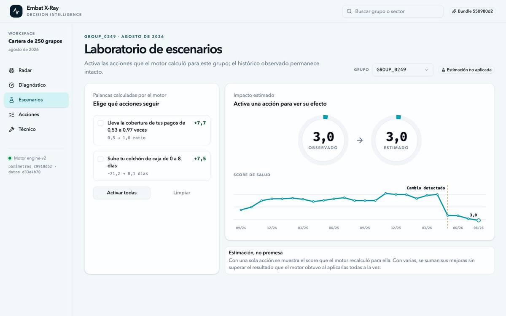
*Ejemplo de proyección en un grupo crítico. El gráfico traza la línea discontinua hacia la estimación calculada, respetando el tope combinado del motor.*

#### Estados gestionados por `FocusFrame` y excepciones

La vista de escenarios delega la gestión de estados de carga, error y ausencia de datos al componente envolvedor `FocusFrame`. Además, maneja sus propios estados vacíos según el contenido del bundle.

**Estados del `FocusFrame`** ·
*   **`idle`**: Si no hay un grupo en foco, muestra un `EmptyState` con el icono `MousePointerClick`. Título: «Elige un grupo». Descripción: «Ningún grupo tiene score en este mes.».
*   **`loading`**: Mientras se lee el JSON del grupo, muestra un esqueleto de carga (`Skeleton`) simulando las dos columnas.
*   **`error`**: Si falla la carga, muestra un `EmptyState` con el icono `FileWarning` en tono `danger`. Título: «No se pudo leer [ID_GRUPO]». Descripción: El mensaje de error capturado.
*   **Mes sin datos**: Si el grupo cargado no tiene datos en el mes seleccionado en el `monthStore`, muestra un `EmptyState` con el icono `CalendarOff`. Título: «Sin datos de [ID_GRUPO] en [MES]». Descripción: «Su primer cierre observado es [MES_INICIAL]. Elige otro mes u otro grupo.».

**Estados específicos de la vista de Escenarios** ·
*   **Sin acciones calculadas**: Si el array de acciones del mes está vacío (`actions.length === 0`), se ocultan las columnas de palancas e impacto. En su lugar, se muestra el componente `EmptyState` con el icono `ListChecks`.
    *   *Título*: «Sin acciones con las que construir un escenario».
    *   *Descripción*: «El bundle no trae acciones para [ID_GRUPO] en [MES]. El laboratorio solo usa mejoras recalculadas por el motor: no inventa palancas ni resultados.».
    

*   **Abstención del motor**: Si el motor se abstuvo de puntuar a la entidad en ese mes (`entry.abstain` no es nulo), el `FocusFrame` inyecta automáticamente el componente `AbstainedState` en la parte superior. Muestra el motivo (ej. «Feed bancario sin datos recientes.») y qué lo desbloquea. Si la abstención implica que no hay acciones calculadas, se mostrará el estado vacío descrito en el punto anterior.
    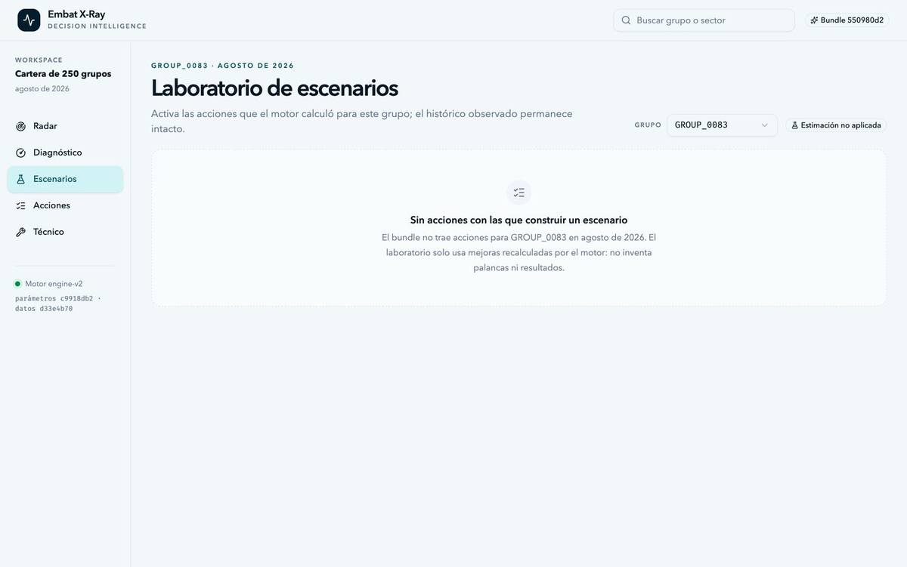

## 6. Acciones

### Centro de acciones (Vista global)

**Qué es** · Es la bandeja global de seguimiento operativo de la cartera. Agrupa y prioriza las recomendaciones financieras emitidas por el motor para los grupos con peor salud financiera, permitiendo al analista gestionar las tareas de mitigación de riesgo desde un único punto.

**Dónde aparece** · En la pestaña «Acciones» de la navegación principal del panel de control (`/?tab=acciones`).

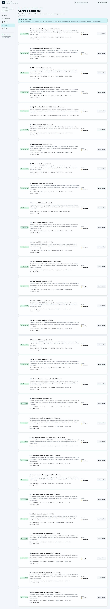

**Cómo funciona (Lógica de carga y ordenación)** · Para evitar descargas masivas en carteras grandes y mantener el rendimiento, la vista no lee las acciones de todos los grupos. La lógica (`actions-view.svelte`) opera de la siguiente manera:
1. Toma la lista de grupos del portfolio (`rows`) y filtra aquellos que tienen un *score* válido en el mes seleccionado (`row.shown !== null`).
2. Selecciona los **40 grupos con menor *score*** (`.slice(0, GROUPS_READ)`).
3. Carga los ficheros JSON de estos 40 grupos de forma concurrente mediante `Promise.allSettled(wanted.map(...))`. Esto garantiza que el fallo de un fichero no detenga la carga del resto.
4. Extrae todas las acciones (`entryActions(entry)`) correspondientes al mes de análisis.
5. Ordena el conjunto global de acciones de mayor a menor impacto en puntos (`b.action.uplift_tenths - a.action.uplift_tenths`).
6. Muestra únicamente las **30 acciones con mayor impacto** (`top = status.items.slice(0, ACTIONS_SHOWN)`).

**Anatomía y textos**
- **Cabecera**: 
  - Antetítulo (`eyebrow`): «Seguimiento operativo · `{formatPeriod(month)}`» (ej. «Seguimiento operativo · agosto de 2026»).
  - Título (`h1`): «Centro de acciones» (con `id="actions-heading"`).
  - Descripción (`page-lead`): «Las acciones que más puntos de score devuelven en la cartera, con el grupo al que pertenecen.».
- **Alerta de resumen**: Una alerta de tono azul suave (`border-[var(--signal)]/30 bg-[var(--signal-soft)]`) con el icono `BellRing`.
  - **Título**: Muestra el recuento total y el estado de triaje dinámico: «`{formatNumber(top.length)}` acciones · `{formatNumber(done)}` hechas». El valor `done` se calcula filtrando las acciones visibles cuyo estado en `actionState` sea verdadero.
  - **Descripción**: Explica la regla de negocio al usuario: «Se han leído los `{formatNumber(status.read)}` grupos con menor score del mes y se ordenan sus acciones por puntos ganados. El estado hecha / pendiente se guarda solo en este navegador.».

**Estados y variantes**
- **Cargando (`status.state === 'loading'`)**: Mientras se resuelven las promesas de los 40 ficheros de grupo, se muestra un contenedor con `aria-label="Cargando acciones"` que apila tres componentes `<Skeleton class="h-28" />`.
- **Error parcial (`status.failed > 0`)**: Si alguno de los ficheros de grupo falla al cargar (por ejemplo, un error 404 de red), la vista se renderiza con los que hayan tenido éxito, pero añade una alerta roja (`variant="destructive"`) con el icono `FileWarning`. 
  - Título: «`{formatNumber(status.failed)}` grupos no se pudieron leer». 
  - Descripción: «Sus acciones no figuran en esta lista.».
- **Vacío (`top.length === 0`)**: Si tras leer los grupos no se encuentra ninguna acción (ya sea porque el motor no encontró palancas o porque el *bundle* es antiguo), se muestra el componente `EmptyState` con el icono `ListChecks`. 
  - Título: «Sin acciones calculadas para este mes». 
  - Descripción: «Los grupos leídos no traen acciones en este cierre: o el motor no encontró palancas que suban el score, o esta exportación es anterior al cálculo de acciones.».

**Fuente** · `src/lib/xray/actions-view.svelte`.

### Bloque de acciones por entidad

**Qué es** · Es la versión contextualizada de la lista de acciones, restringida a una única entidad (grupo o empresa).

**Dónde aparece** · En la vista de detalle de grupo (`/group/[id]`) y en la vista de detalle de empresa (`/group/[id]/company/[companyId]`), justo debajo del bloque del *score* y la trayectoria.

**Anatomía y textos**
- **Cabecera**: Antetítulo «Qué hacer ahora» (`eyebrow`) y título «Acciones para subir el score» (`h2` con `id="entity-actions-heading"`). El contenedor principal lleva `data-testid="entity-actions"`.
- **Alerta de impacto global**: Se muestra solo si la entidad tiene acciones (`actions.length > 0`) y un objetivo calculado (`target !== null`). Es una alerta verde (`border-[var(--success)]/35 bg-[var(--success-soft)]`) con el icono `Sparkles`.
  - **Título** (`data-testid="actions-headline"`): «Si sigues estas acciones tu score pasaría de `{formatScore(entry.shown)}` a `{formatScore(target)}`» (ej. «Si sigues estas acciones tu score pasaría de 26,6 a 36,6»).
  - **Descripción**: «`{formatScoreDelta(target - entry.shown)}` puntos en total. Cada acción indica lo que suma por sí sola, recalculado por el motor con los datos de `{formatPeriod(entry.month)}`; los efectos no siempre se suman íntegros.».
- **Lista**: Renderiza el mismo componente `ActionList` que la vista global, mapeando las acciones de la entidad actual y pasando su `href` nulo (ya que el usuario ya está en la entidad).

**Lógica de estimación combinada** · El *score* objetivo (`target`) que se muestra en la alerta verde se calcula mediante la función `fullPlanTenths` (`src/lib/xray/actions.ts`). 
- Si el motor exportó el nodo `actions_combined` (que evalúa el efecto conjunto de aplicar todas las palancas a la vez, evitando dobles conteos), se usa `entry.actions_combined.new_score`. 
- Si este nodo no existe (por retrocompatibilidad con *bundles* antiguos), se asume como objetivo el máximo `new_score_tenths` de las acciones individuales (`Math.max(...actions.map(a => a.new_score_tenths))`).
- Las acciones se ordenan siempre de mayor a menor impacto mediante `entryActions` (`b.uplift_tenths - a.uplift_tenths`).

**Estado vacío** · Si la entidad no tiene acciones en ese mes, se muestra un `EmptyState` con el icono `ListChecks`. 
- Título: «Sin acciones calculadas para este mes». 
- Descripción: «El bundle no trae acciones para `{entityId}` en `{formatPeriod(entry.month)}`: o el motor no encontró palancas que suban el score, o esta exportación es anterior al cálculo de acciones.».

**Fuente** · `src/lib/xray/entity-actions.svelte`, `src/lib/xray/actions.ts`.

### Tarjeta de acción (Anatomía y datos)

**Qué es** · El componente individual que representa una recomendación operativa, utilizado tanto en la vista global como en la de entidad.

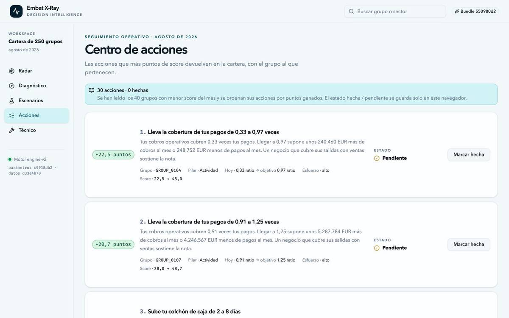

**Anatomía**
La tarjeta (`Card.Root` con `data-action={action.id}`) contiene un `Card.Content` que se divide visualmente en tres columnas en pantallas grandes mediante la clase `lg:grid-cols-[auto_1fr_12rem_auto] lg:items-center`:

1. **Insignia de impacto (Izquierda)**:
   - Un `Badge` con `variant="outline"` estilizado en tonos verdes (`border-[var(--success)]/40 bg-[var(--success-soft)] text-[var(--success-strong)]`).
   - Lleva `data-testid="action-uplift"`.
   - Muestra el incremento individual de la acción formateado con signo: «`{formatScoreDelta(action.uplift_tenths)}` puntos» (ej. «+22,5 puntos»).

2. **Cuerpo descriptivo (Centro)**:
   - **Título**: El índice de la acción en la lista (basado en 1) seguido del título literal exportado por el motor: «`{index + 1}.{action.title}`» (ej. «1. Lleva la cobertura de tus pagos de 0,33 a 0,97 veces»).
   - **Detalle**: Párrafo en gris (`text-muted-foreground text-sm`) con la explicación financiera (`action.detail`), renderizado solo si existe.
   - **Metadatos**: Una cuadrícula flexible (`flex flex-wrap gap-x-5 gap-y-2 text-xs`) de etiquetas. Se muestran condicionalmente si el dato existe en el JSON:
     - **Grupo**: Solo aparece si se pasa `item.href` (vista global). Muestra «`Grupo · <a href={item.href}>{item.entityId}</a>`». El enlace redirige a la vista de la entidad manteniendo el mes seleccionado.
     - **Pilar**: Si `action.pillar` existe. Texto: «`Pilar · {pillarLabel(manifest, action.pillar)}`» (ej. «Pilar · Actividad»).
     - **Hoy / Objetivo**: Si `action.current` y `action.target` existen. Utiliza una función local `quantity` que formatea el número sin decimales si es entero, o con dos si es flotante, añadiendo la unidad (`action.unit`) separada por un espacio de no separación (`\u00A0`). Texto: «`Hoy · {quantity(action.current, action.unit)} → objetivo {quantity(action.target, action.unit)}`» (ej. «Hoy · 0,33 ratio → objetivo 0,97 ratio»).
     - **Esfuerzo**: Si `action.effort` existe. Texto: «`Esfuerzo · {action.effort}`» (ej. «Esfuerzo · alto»).
     - **Score**: Muestra el salto del *score* individual formateado a un decimal: «`Score · {formatScore(item.shown)} → {formatScore(action.new_score_tenths)}`» (ej. «Score · 22,5 → 45,0»).

3. **Estado y control (Derecha)**:
   - Etiqueta superior: «Estado» (con clase `metric-label`).
   - **Indicador visual**:
     - Si está **Hecha** (`done === true`): Icono `Check` en verde (`text-[var(--success)]`) y el texto «Hecha».
     - Si está **Pendiente** (`done === false`): Icono `CircleDot` en amarillo/naranja (`text-[var(--warning)]`) y el texto «Pendiente».
   - **Botón de acción**: Un `Button` con `variant="outline"` que ejecuta `actionState.toggle(item.entityId, action.id)`. Su texto cambia dinámicamente: «Reabrir» si está hecha, o «Marcar hecha» si está pendiente.

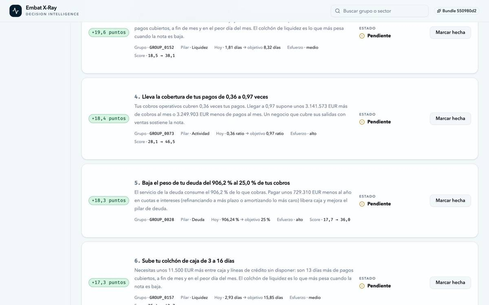

**Fuente** · `src/lib/xray/action-list.svelte`.

### Interacción y persistencia del estado

**Qué es** · El sistema que permite al analista marcar acciones como completadas y recordar esta decisión entre sesiones y entre distintas vistas (global y de entidad).

**Cómo funciona**
El estado de las acciones se gestiona íntegramente en el navegador del usuario, ya que el *bundle* JSON es de solo lectura y la aplicación es estática.
- La clase `ActionState` (`src/lib/xray/action-state.svelte.ts`) inicializa un `SvelteSet` reactivo (`#done`) leyendo del `localStorage` del navegador.
- La clave de almacenamiento es `xray.actions.done.v1`.
- Durante la inicialización, comprueba si está en el navegador (`import { browser } from '$app/environment'`) para evitar errores de SSR, y parsea el JSON guardado (`JSON.parse(localStorage.getItem(STORAGE_KEY) ?? '[]')`).
- Cada acción se identifica de forma única mediante una clave compuesta generada por el método `key`: `${entityId}:${actionId}`. Esto asegura que una misma acción genérica no se marque como hecha accidentalmente para dos empresas distintas.
- Al pulsar el botón «Marcar hecha» o «Reabrir», el método `toggle` comprueba si la clave existe en el `SvelteSet`. Si existe, la elimina; si no, la añade.
- Tras la mutación, serializa el conjunto actualizado como un array JSON (`JSON.stringify([...this.#done])`) y lo guarda en `localStorage`.
- **Degradación elegante**: Si el `localStorage` está bloqueado (por políticas de privacidad o modo incógnito estricto) o lleno, los bloques `try/catch` tanto en el constructor como en el método `toggle` capturan el error silenciosamente. El triaje seguirá funcionando en memoria de forma reactiva durante la sesión actual, aunque no sobrevivirá a una recarga de página.

**Fuente** · `src/lib/xray/action-state.svelte.ts`.

## 7. Técnico: desglose y evidencias

### Estructura general de la vista Técnica

**Qué es** · El espacio de auditoría de la aplicación, diseñado para explicar de forma determinista y transparente el origen de cada cálculo del motor, la fiabilidad de los datos y las decisiones de alerta.
**Dónde aparece** · Se accede a través de la barra lateral de navegación (ítem «Técnico») y su estado se refleja en la URL mediante los parámetros `?tab=tecnico` y `?focus=<id_grupo>`.
**Anatomía** · El contenedor principal (`technical-view.svelte`) presenta una cabecera con el epígrafe «Trazabilidad · [Mes]» (ej. «TRAZABILIDAD · AGOSTO DE 2026»), el título «Detalle técnico» y la descripción literal: «De dónde sale cada punto del score, con qué datos, qué alertas disparó o calló el motor y el recibo de la ejecución.».
**Cómo funciona** · La navegación se divide en tres subpestañas controladas por el componente `Tabs.Root` y enlazadas al parámetro de URL `?section=`:
1. **«Desglose y evidencias»** (`?section=desglose`): Pestaña activa por defecto. Muestra la cascada matemática del *score*, la confianza y los datos de origen.
2. **«Alertas»** (`?section=alertas`): Bandeja de entrada de las alertas evaluadas por el motor.
3. **«Recibo»** (`?section=recibo`): Huella criptográfica y validación de la ejecución del motor.

En la esquina superior derecha del área de contenido, alineado con las pestañas, se ubica el componente `focus-picker.svelte`, un menú desplegable etiquetado como «GRUPO» que permite al usuario cambiar la entidad bajo análisis sin abandonar la vista técnica. Al montar la vista, se disparan las promesas `loadAlerts` y `loadReceipt` para alimentar las otras dos pestañas.

### Gestión de estados y foco (`focus-frame.svelte`)

**Qué es** · Un componente envoltura que gestiona el ciclo de vida de la carga de datos del grupo seleccionado para las vistas que dependen de una entidad específica.
**Cómo funciona** · Evalúa la disponibilidad del grupo (`GroupFile`) y extrae la entrada correspondiente al mes seleccionado (`EntityMonth`) mediante `entryAt(focus.group.months, monthStore.month)`.
**Estados y variantes**:
* **Estado de carga (`loading`)**: Mientras se resuelve `loadGroup`, muestra una cuadrícula (`lg:grid-cols-[17rem_1fr]`) con dos esqueletos animados (`Skeleton`) de clase `h-72` y el atributo `aria-label="Cargando grupo"`.
* **Estado de error (`error`)**: Si el fichero no se puede leer o rompe el contrato, renderiza un `EmptyState` con el icono `FileWarning` en tono `danger`. El título es «No se pudo leer [ID]» y la descripción inyecta el mensaje de la excepción (`focus.message`).
* **Sin selección (`idle`)**: Si no hay un grupo en foco, muestra un `EmptyState` con el icono `MousePointerClick`. Título: «Elige un grupo». Descripción: «Ningún grupo tiene score en este mes.».
* **Mes sin datos**: Si el grupo se ha cargado pero `entryAt` devuelve `null` (la entidad no tiene datos en el mes seleccionado en el `MonthSlider`), muestra un `EmptyState` con el icono `CalendarOff`.
  * Título: «Sin datos de [ID] en [Mes]» (ej. «Sin datos de GROUP_0001 en marzo de 2025»).
  * Descripción: «Su primer cierre observado es [Mes de inicio]. Elige otro mes u otro grupo.».

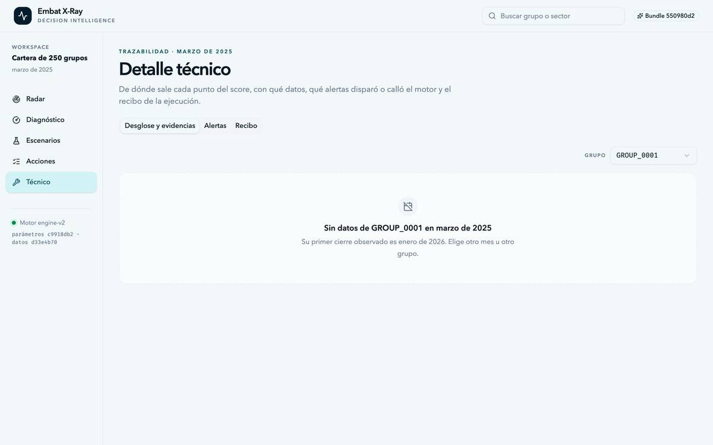

### Estado de abstención del motor (`abstained-state.svelte`)

**Qué es** · Un banner de alerta destacado que aparece en la parte superior del desglose cuando los datos de entrada no alcanzan los requisitos mínimos para emitir un veredicto fiable (`entry.abstain !== null`).
**Anatomía y estilos** · Utiliza el componente `Alert.Root` con clases específicas para el tono de advertencia: `border-[var(--warning)]/40 bg-[var(--warning-soft)]`. Incluye el icono `PauseCircle` y establece el atributo `data-abstain={abstain.reason}`.
**Textos y lógica**:
* **Título**: Por defecto es «El motor se abstiene este mes».
* **Motivo**: La descripción principal traduce el código de la abstención extrayendo el texto legible desde el manifiesto: `glossaryText(manifest, 'reasons', abstain.reason)` (ej. «Feed bancario sin datos recientes.»).
* **Desbloqueo**: En una segunda línea, precedida por el icono `KeyRound` en color `warning-strong`, se muestra la acción correctiva literal provista por el motor en `abstain.unlock`: `Qué lo desbloquea: {humanizeMonths(abstain.unlock)}`.

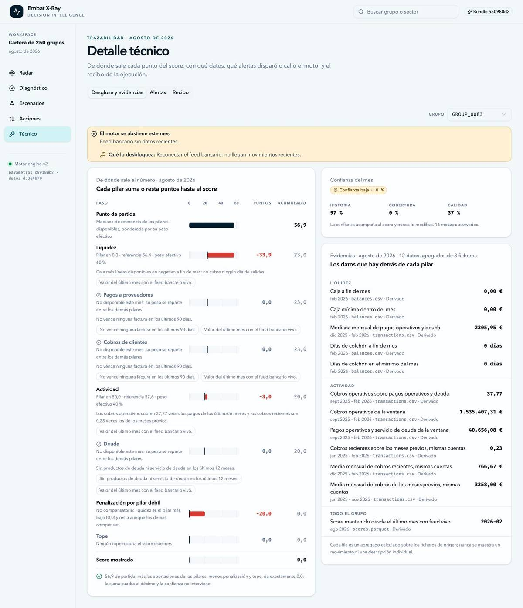

### Cascada de contribuciones (`contribution-waterfall.svelte`)

**Qué es** · El componente central del desglose técnico. Demuestra visualmente la identidad matemática exacta del *score* calculada en `explain.ts`: `base + suma(contribuciones) - penalización - tope = score mostrado`.
**Dónde aparece** · En la columna izquierda de la pestaña «Desglose y evidencias».
**Anatomía** · Una tarjeta (`Card.Root`) con el epígrafe «De dónde sale el número · [Mes]» y el título «Cada pilar suma o resta puntos hasta el score». La tabla interior usa una cuadrícula CSS (`md:grid-cols-[15rem_1fr_4.5rem_5rem]`) con las cabeceras: «Paso», un eje gráfico con marcas de escala, «Puntos» y «Acumulado».
**Cómo funciona** · Todo el motor y el frontend operan en décimas enteras (*integer tenths*) para evitar errores de coma flotante. La función `waterfallSteps` genera una matriz secuencial calculando el inicio (`start`) y el fin (`end`) de cada paso. El eje gráfico calcula sus límites (`bounds`) añadiendo un margen (`padding`) al valor mínimo y máximo de la cascada, y genera marcas (`ticks`) dinámicas (en pasos de 10, 20, 50, 100, etc.) formateadas con `formatNumber(fromTenths(tick))`.

#### Pasos de la cascada y variantes

| Paso | Clave | Comportamiento, textos y visualización |
| :--- | :--- | :--- |
| **Punto de partida** | `base` | Etiqueta: «Punto de partida». Detalle: «Mediana de referencia de los pilares disponibles, ponderada por su peso efectivo». Se dibuja como una barra absoluta desde el inicio del eje hasta su valor, en color oscuro (`bg-[var(--ink)]`). |
| **Pilares (5)** | `liquidity`, `payments`, `collections`, `activity`, `debt` | Etiqueta: `pillarLabel(manifest, pillar.key)`. • **Con datos**: Detalle: «Pilar en [Score] · referencia [Base] · peso efectivo [w_eff %]». Si aporta (`delta > 0`), la barra es verde (`bg-[var(--success)]`); si resta (`delta < 0`), es roja (`bg-[var(--danger)]`). Debajo se listan las compuertas (`gates`) activadas como pastillas (`Badge`), traduciendo sus códigos mediante `manifest.glossary.gates`. • **Sin datos (`muted`)**: Detalle: «No disponible este mes: su peso se reparte entre los demás pilares». El texto se atenúa, aparece el icono `CircleSlash` y el impacto es `0,0`. |
| **Penalización** | `penalty` | Etiqueta: «Penalización por pilar débil». • **Aplica (`delta < 0`)**: Detalle: «No compensatoria: [Pilar más débil] es el pilar más bajo ([Score]) y resta aunque los demás compensen». Barra roja hacia la izquierda. • **No aplica (`delta === 0`)**: Detalle: «Sin penalización este mes». Fila atenuada (`muted`). |
| **Tope** | `cap` | Etiqueta: «Tope». • **Aplica (`delta < 0`)**: Detalle: «Una regla limita el score máximo aunque el resto de pilares sea alto». Se listan las reglas activadas (`cap.fired`) como pastillas, traducidas mediante `manifest.glossary.caps`. • **No aplica (`delta === 0`)**: Detalle: «Ningún tope recorta el score este mes». Fila atenuada. |
| **Score mostrado** | `shown` | Etiqueta: «Score mostrado». Se dibuja como un marcador absoluto oscuro (`bg-[var(--ink)]`) en la posición final. La fila tiene un borde superior (`border-t pt-3`). |

**Auditoría matemática** · Al pie de la tarjeta (`data-testid="waterfall-check"`), un bloque verifica en tiempo real que la brecha (`waterfallGap(entry)`) sea exactamente cero:
* **Si cuadra (`gap === 0`)**: Muestra el icono `CircleCheck` en color `success`. Texto: «[Base] de partida, más las aportaciones de los pilares, menos penalización y tope, da exactamente [Score]: la suma cuadra al décimo y la confianza no interviene.».
* **Si no cuadra (`gap !== 0`)**: Muestra el icono `TriangleAlert` en color `danger`. Texto: «La suma no cuadra por [Gap] puntos.». (Esto solo ocurre si el JSON del *bundle* viola el contrato matemático).

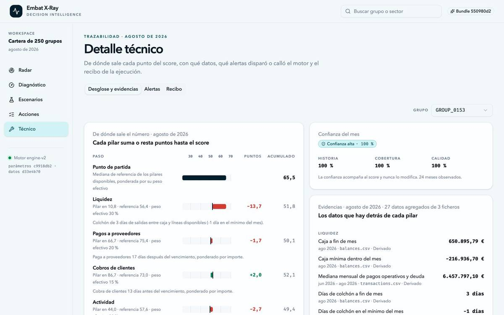

### Confianza del mes y atributos de calidad

**Qué es** · Una tarjeta que desglosa la fiabilidad estadística del dato. La confianza es un indicador de 0 a 100 % que acompaña al *score* pero que **nunca modifica su valor numérico**.
**Dónde aparece** · En la parte superior de la columna derecha de la pestaña «Desglose y evidencias».
**Anatomía y textos**:
* **Cabecera**: Título «Confianza del mes». A la derecha, el componente `ConfidencePill` muestra el nivel cualitativo y el porcentaje global (`entry.conf.value`). Usa los iconos `ShieldCheck` (Alta, tono `signal`), `ShieldQuestion` (Media, tono `neutral`) o `ShieldAlert` (Baja, tono `warning`). Texto: «Confianza [alta/media/baja] · [Valor %]».
* **Métricas (Cuadrícula de 3 columnas)**:
  1. **«HISTORIA»**: Porcentaje basado en la profundidad de meses observados (`entry.conf.history`).
  2. **«COBERTURA»**: Porcentaje basado en cuántos pilares tienen datos frente al total posible (`entry.conf.coverage`).
  3. **«CALIDAD»**: Porcentaje que evalúa la limpieza del dato (`entry.conf.quality`).
  Los valores se formatean con `formatPercent(valor, 0)` y se muestran en tipografía `font-data` en negrita.
* **Pie de tarjeta**: Texto explicativo: «La confianza acompaña al score y nunca lo modifica. [N] [mes observado / meses observados].».

### Tabla de evidencias (`evidence-table.svelte`)

**Qué es** · Una tabla exhaustiva que expone los datos crudos y agregados que alimentan los pilares.
**Cómo funciona** · Dado que el fichero de evidencias (`evidence/<id>.json`) puede ser pesado, se carga de forma perezosa (*lazy loading*) mediante `loadEvidence` solo cuando el componente se monta.
**Estados y variantes**:
* **Cargando (`loading`)**: Muestra 5 esqueletos rectangulares (`Skeleton`) de clase `h-8 w-full` con el atributo `aria-label="Cargando evidencias"`.
* **Fichero ausente (`missing`)**: Si el servidor devuelve 404 (ej. la entidad no tiene evidencias exportadas), muestra un `EmptyState` compacto con el icono `FileX`. Título: «Este bundle no incluye evidencias de esta entidad». Descripción: «Las filas de evidencia se exportan por entidad; el score y los pilares de arriba no dependen de este fichero.».
* **Error de red/parseo (`error`)**: Muestra un `EmptyState` con el icono `FileWarning` en tono `danger`. Título: «No se pudieron leer las evidencias». Descripción: el mensaje de la excepción.
* **Mes sin datos**: Si el fichero existe pero `entryAt` devuelve `null` para el mes actual, muestra un `EmptyState` con el icono `CalendarOff`. Título: «Sin evidencias exportadas para [Mes]».
  * Si el fichero tiene datos en otros meses: Descripción: «El bundle guarda las evidencias de [Primer mes] a [Último mes].». Incluye un botón interactivo «Ir a [Último mes]» que invoca a `monthStore.select()` para saltar al último cierre disponible.
  * Si el fichero está completamente vacío: Descripción: «El fichero de evidencias de esta entidad está vacío.».
* **Sin agregados**: Si el array de filas está vacío para el mes, muestra un `EmptyState` con el icono `FileSearch`. Título: «Ningún dato agregado este mes». Descripción: «El motor no exportó filas de evidencia para este cierre.».

**Anatomía con datos (`ready`)**:
* **Cabecera**: Descripción dinámica: «Evidencias · [Mes] · [N] [dato agregado / datos agregados] de [N] [fichero / ficheros]». Título: «Los datos que hay detrás de cada pilar».
* **Estructura de la tabla**: Las filas (`EvidenceRow`) se agrupan en secciones (`sections`) siguiendo el orden del contrato (`PILLAR_KEYS`), añadiendo una sección final para métricas a nivel de entidad (cuyo título es «Todo el grupo» o «Toda la empresa», dependiendo de la prop `kind`).
* **Columnas**:
  1. **«Dato»**: Etiqueta descriptiva de la métrica (`row.label`).
  2. **«Valor»**: Alineado a la derecha en tipografía tabular. Si la unidad es `ratio` y el valor es numérico, usa `formatRatio(row.value)`. Para el resto, usa `formatUnitValue(row.value, row.unit)` (ej. «650.895,79 €», «35,11 facturas»).
  3. **«Periodo»**: Rango temporal de los datos de origen, formateado por `formatEvidencePeriod` (ej. «3 jun 2026 – 31 ago 2026»).
  4. **«Fichero»**: Nombre del archivo CSV original (`row.source_file`), en tipografía monoespaciada gris (ej. `invoices.csv`).
  5. **«Filas»**: Número de registros procesados. Si `row.n_rows` es `null`, muestra el texto «Derivado». Si tiene valor, muestra «[N] [fila / filas]».
* **Pie de tabla**: Texto legal/técnico en gris: «Cada fila es un agregado calculado sobre los ficheros de origen; nunca se muestra un movimiento ni una descripción individual.».

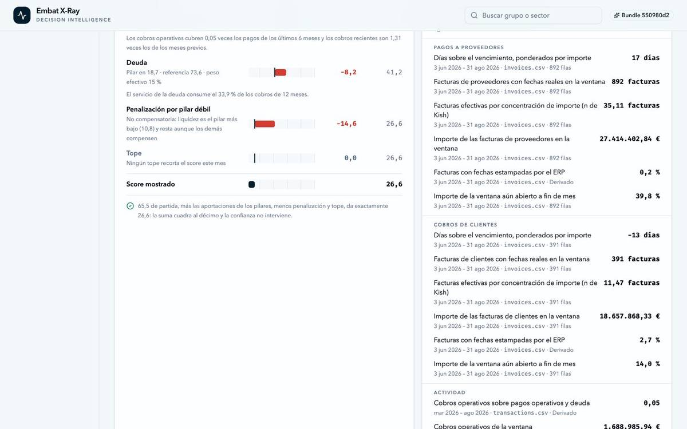

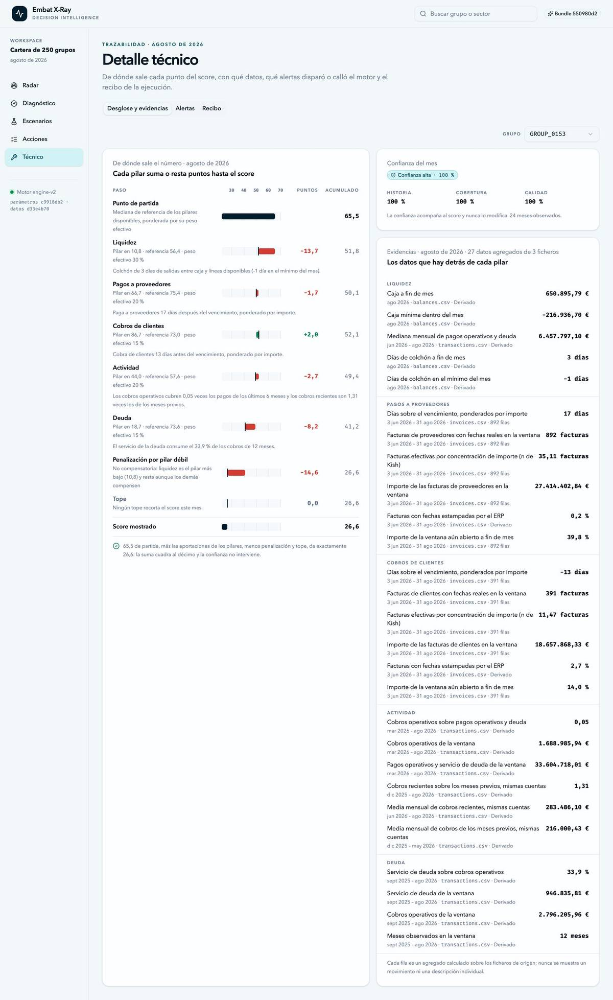

### Barras integradas (`inline-bars.svelte`)

**Qué es** · Una primitiva técnica (`<ul>`) que renderiza barras horizontales proporcionales para comparar magnitudes. Aunque su uso principal recae en la pestaña «Recibo» para mostrar distribuciones estadísticas, es un componente base del ecosistema de trazabilidad.
**Anatomía y estilos** · Cada fila (`<li>`) utiliza una cuadrícula `grid-cols-[minmax(4rem,7.5rem)_1fr_minmax(2.5rem,auto)]` y el atributo `data-bar={bar.label}`. Contiene:
1. La etiqueta a la izquierda en color `muted-foreground`.
2. Una pista de fondo (`bg-muted/60`) con una barra de relleno posicionada de forma absoluta. El color de la barra depende de la prop `tone` (por defecto `signal`, mapeado a través de `TONE_COLOR`).
3. El valor numérico formateado a la derecha en tipografía `tabular-nums` y `font-semibold`.
**Cómo funciona** · Recibe un array de objetos `{ label, value }`. Calcula dinámicamente el valor mínimo (`low = Math.min(0, ...bars)`) y máximo (`high = Math.max(0, max ?? 0, ...bars)`) para establecer un eje común. La posición de la barra se calcula mediante porcentajes: `left: {from}%` y `width: max(2px, {to - from}%)`.
**Casos límite** · Si el eje incluye números negativos (`low < 0`), el componente dibuja automáticamente una fina línea vertical (`w-px bg-foreground/40`) en la posición exacta del cero (`percent(0)`), garantizando que las longitudes de las barras positivas y negativas se comparen de forma honesta.

## 8. Técnico: bandeja de alertas

### Qué es y dónde aparece

La bandeja de alertas es el centro de notificaciones del motor de *scoring*. Se encuentra en la pestaña **«Alertas»** de la sección **«Técnico»** (ruta `/?tab=tecnico&section=alertas`). Su propósito es listar, filtrar y permitir el triaje de todas las alertas generadas por el motor para la cartera de grupos y empresas, incluyendo aquellas que el motor decidió silenciar o no disparar por abstención.

La vista principal está gobernada por el componente `alerts-inbox.svelte`, que orquesta los filtros, las métricas, el gráfico temporal y el listado de tarjetas.

### Cabecera y texto de resumen dinámico

La cabecera de la sección presenta un texto introductorio (`page-lead`) que resume el volumen total de alertas evaluadas. Este texto se construye dinámicamente evaluando las alertas que cumplen los filtros actuales (`scoped`) y se adapta a cuatro escenarios posibles:

1.  **Sin alertas:** «[Período] el motor no evaluó ninguna alerta [con estos filtros].» (El inciso final se añade si hay filtros activos).
2.  **Todas disparadas (cero silenciadas o en abstención):** «[Período] el motor evaluó [X] alerta(s) y [la disparó | las disparó todas]: ninguna quedó silenciada ni en abstención.»
3.  **Ninguna disparada (todas silenciadas o en abstención):** «[Período] el motor evaluó [X] alertas y no disparó ninguna: [Y] silenciadas y [Z] en abstención. Las que no se disparan también se enseñan, con su motivo y su ventana.»
4.  **Mixto (caso habitual):** «[Período] el motor evaluó [X] alertas: disparó [F] y dejó sin disparar [N] ([%]): [Y] silenciadas y [Z] en abstención. Las que no se disparan también se enseñan, con su motivo y su ventana.»

El `[Período]` varía según el alcance: «En [mes]» si se mira un solo mes, o «Entre [mes inicial] y [mes final]» si se mira el histórico.

### Controles de alcance y filtrado

A la derecha del texto introductorio y debajo de él, se despliegan los controles para acotar la lista. La lógica de filtrado reside en la función `filterAlerts` de `alerts.ts`.

*   **Alcance temporal (`scope`):** Un `ToggleGroup` con `aria-label="Periodo de la bandeja"`.
    *   **«Todo el histórico»** (`history`): Muestra y contabiliza las alertas de todos los meses disponibles en el *bundle*.
    *   **«Solo el mes de análisis»** (`month`): Restringe la vista al mes seleccionado. Al activar esta opción, aparece inmediatamente debajo el componente `MonthSlider` para navegar entre meses.
*   **Buscador por texto (`query`):** Un campo `Input` con `type="search"`, el icono `Search`, `autocomplete="off"` y el texto de marcador de posición y `aria-label` «Buscar por grupo o empresa». Filtra buscando coincidencias (ignorando mayúsculas y tildes mediante `normalizeText`) en los campos `entity_id` y `group_id` de cada alerta.
*   **Filtro por entidad (`entity`):** Un `ToggleGroup` con `aria-label="Filtrar por tipo de entidad"` y las opciones «Todo» (`all`), «Grupos» (`group`) y «Empresas» (`company`).
*   **Filtro por tipo (`kind`):** Un componente `Select` con `aria-label="Filtrar por tipo de alerta"`. Muestra «Todos los tipos» por defecto y despliega dinámicamente solo los tipos de alerta que realmente existen en el *bundle* cargado (`kindsPresent`).
*   **Botón «Limpiar filtros»:** Aparece dinámicamente a la derecha (con el icono `FilterX`) si cualquiera de los tres filtros anteriores tiene un valor distinto al de por defecto.

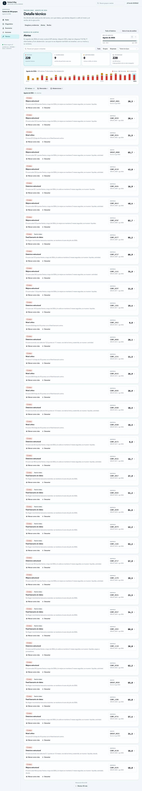

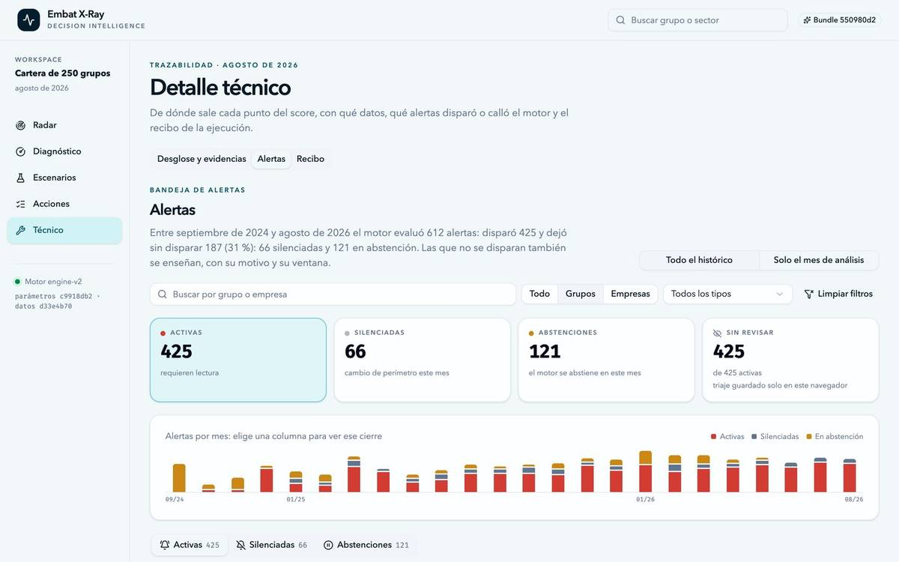

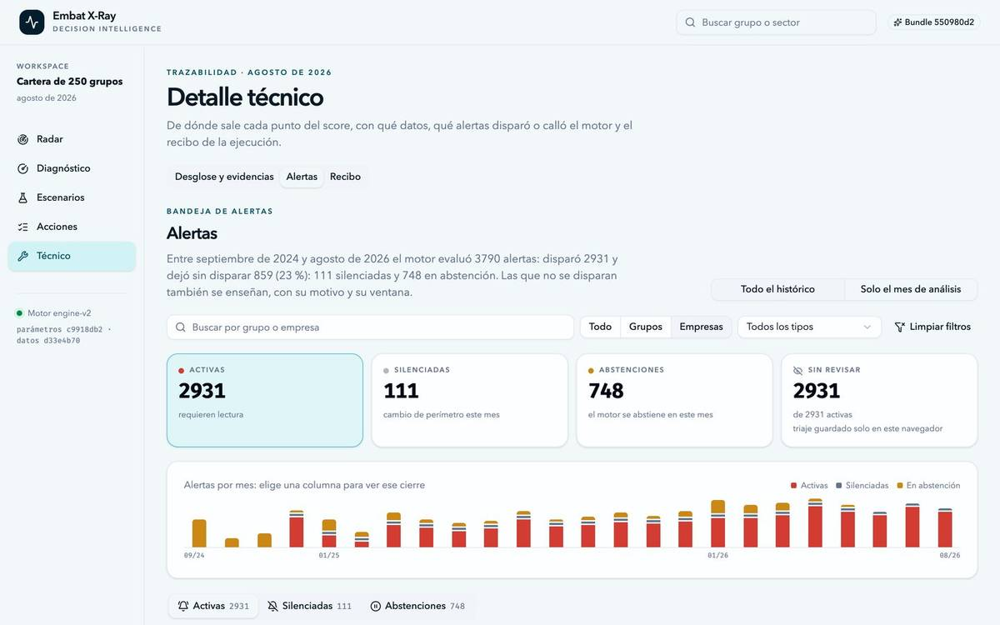

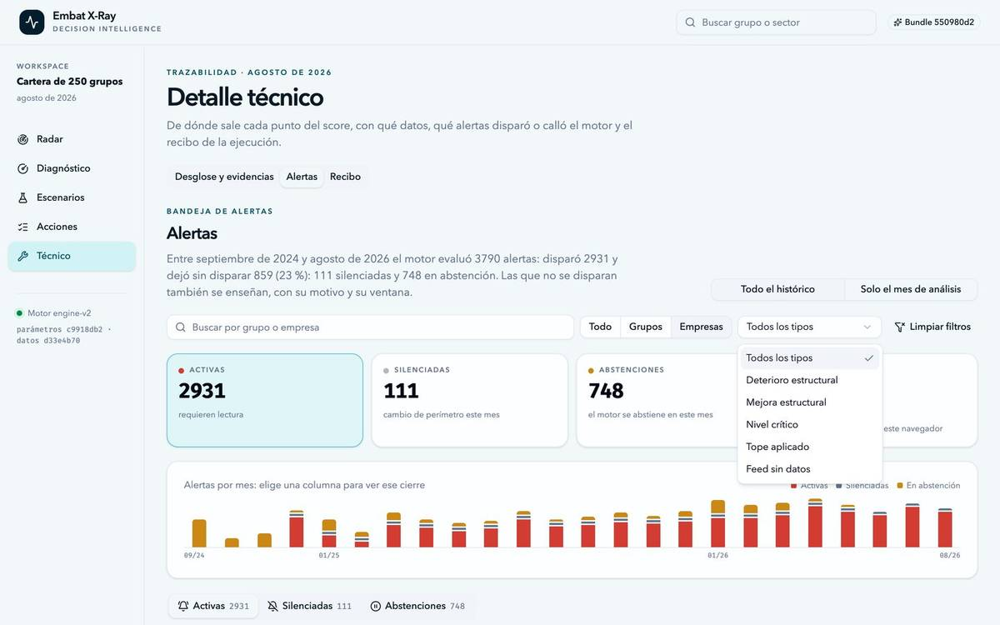

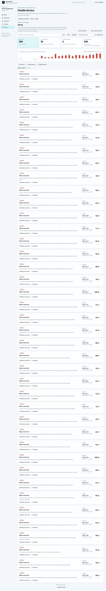

#### Tipos de alerta disponibles

La correspondencia entre las claves del JSON (`ALERT_KINDS`) y los textos mostrados en la interfaz (`ALERT_KIND_TEXT` en `contract.ts`) es la siguiente:

| Clave en el *bundle* (`kind`) | Texto en la interfaz |
| :--- | :--- |
| `deterioration_structural` | «Deterioro estructural» |
| `improvement_structural` | «Mejora estructural» |
| `level_critical` | «Nivel crítico» |
| `cap_fired` | «Tope aplicado» |
| `stale_feed` | «Feed sin datos» |

### Tarjetas de estado (KPIs)

Una cuadrícula de cuatro tarjetas (`StatTile`) muestra el recuento de alertas según su estado (`AlertState`), calculados mediante la función `countByState` sobre las alertas que cumplen los filtros actuales. Las tres primeras actúan como botones (`pressed={tab === key}`) que cambian la pestaña activa del listado inferior.

1.  **«ACTIVAS» (`fired`):** Alertas que el motor ha disparado. Tono `danger` (rojo). Subtexto fijo: «requieren lectura».
2.  **«SILENCIADAS» (`suppressed`):** Alertas generadas pero pausadas por el motor. Tono `neutral` (gris).
3.  **«ABSTENCIONES» (`abstained`):** Alertas no disparadas porque el motor no emite veredicto. Tono `warning` (mostaza).

**Lógica de los subtextos dinámicos (`tileHint`):** Para las tarjetas de silenciadas y abstenciones, el componente evalúa si todas las alertas de ese estado comparten el mismo motivo de supresión (`suppressed_by.reason`). Si es así, extrae el texto del glosario del manifiesto, le quita el punto final y lo pone en minúsculas (ej. «cambio de perímetro este mes»). Si hay varios motivos mezclados, muestra «por varios motivos». Si no hay alertas, usa los valores por defecto: «alertas en pausa» y «número visible, sin alerta».

4.  **«SIN REVISAR»:** Tarjeta puramente informativa (no es un botón). Muestra cuántas de las alertas activas aún no han sido marcadas como vistas o descartadas en el triaje local. Utiliza el icono `EyeOff`. Subtextos: «de [X] activa(s)» y «triaje guardado solo en este navegador».

### Gráfico temporal apilado (`alerts-timeline.svelte`)

A la derecha de las tarjetas KPI (o debajo en pantallas menores), se presenta un histograma que muestra la distribución de las alertas a lo largo de los meses del *bundle*.

*   **Lógica y datos:** Utiliza la función `monthlyCounts` (`alerts.ts`) para generar un array con los totales por estado para cada mes, incluyendo meses con cero alertas.
*   **Anatomía visual:** Cada columna representa un mes. La altura máxima se fija en 64 píxeles (`PLOT_HEIGHT`), y las demás columnas se escalan proporcionalmente al mes con mayor volumen (`peak`). Cada columna apila visualmente los estados de abajo hacia arriba: `fired` (rojo), `suppressed` (gris) y `abstained` (mostaza). Si un mes no tiene alertas, se renderiza un espacio vacío (``).
*   **Eje X:** Las etiquetas de los meses (formato `MM/AA` mediante `formatAxisMonth`) solo se imprimen para el primer mes, el último mes, los meses de enero (que terminan en `-01`), y el mes que esté actualmente seleccionado.
*   **Interacción:**
    *   **Hover/Focus:** Al pasar el cursor o enfocar una columna con el teclado, la columna se resalta (`bg-muted`) y el texto superior del gráfico (`aria-live="polite"`) se actualiza para describir el mes enfocado (ej. «Agosto de 2026 · 220 activas, 9 silenciadas, 0 en abstención»).
    *   **Clic:** Al hacer clic en una columna, se ejecuta `onSelect`, que cambia el alcance (`scope`) a «Solo el mes de análisis» y selecciona ese mes en el `monthStore`.

### Pestañas de estado y listado agrupado

Debajo del gráfico, un componente `Tabs.Root` permite alternar el listado de alertas entre los tres estados principales.

*   **Pestañas:** Botones con los textos «Activas [X]» (icono `BellRing`), «Silenciadas [X]» (icono `BellOff`) y «Abstenciones [X]» (icono `PauseCircle`). En pantallas pequeñas (`sm`), los iconos se ocultan.
*   **Botón «Ver descartadas»:** Si la pestaña activa es «Activas» y existen alertas descartadas en el triaje local (`dismissedCount > 0`), aparece un componente `Toggle` a la derecha con el icono `EyeOff` y el texto «Ver descartadas · [X]» para incluirlas en el listado.
*   **Agrupación y orden:** Las alertas se ordenan mediante `sortAlerts` (mes más reciente primero, luego por grupo, luego empresas, luego ID de alerta) y se agrupan visualmente por mes mediante `groupByMonth`. Cada grupo mensual tiene un encabezado con el mes (`first-letter:uppercase`) y un contador pluralizado (ej. «Agosto de 2026 40 alertas»).
*   **Paginación:** El listado carga un máximo inicial de 40 tarjetas (`PAGE_SIZE`). Si hay más, aparece al final un bloque con el texto «Mostrando [limit] de [total]» y un botón «Mostrar [X] más» (con el icono `ChevronDown`) que incrementa el límite visible.

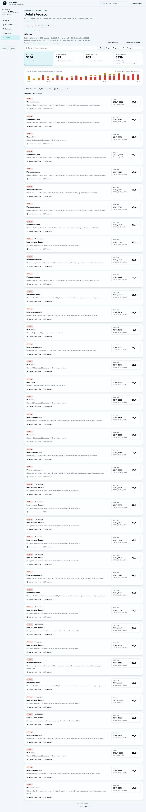

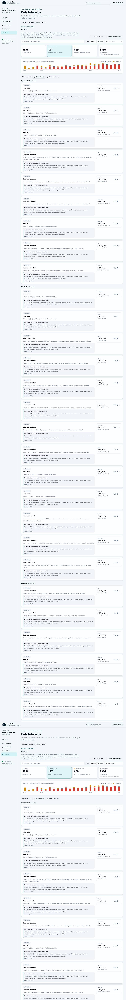

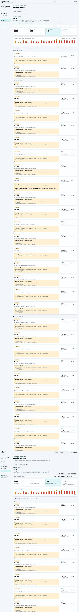

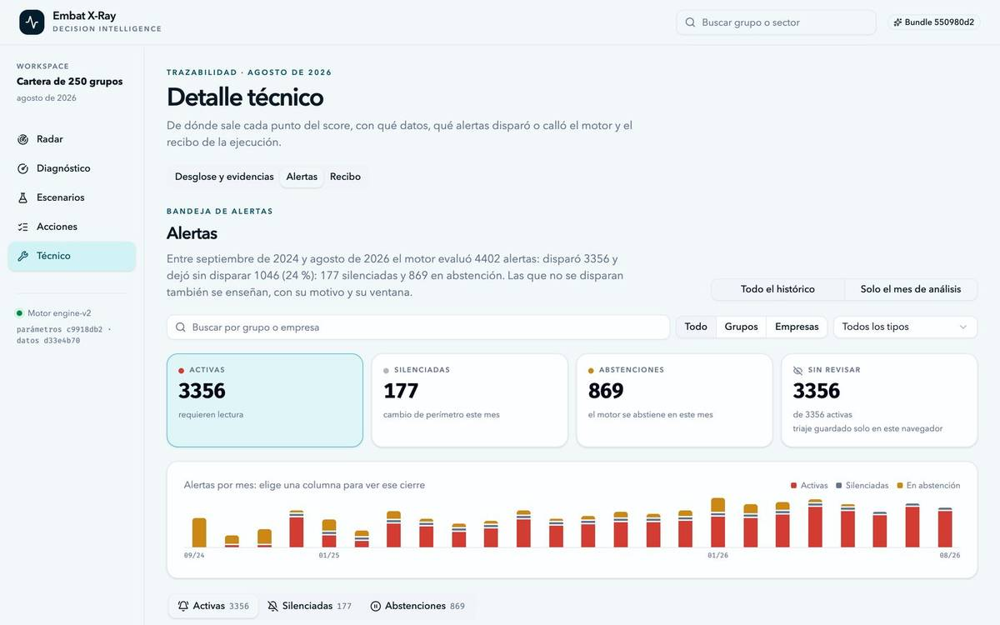

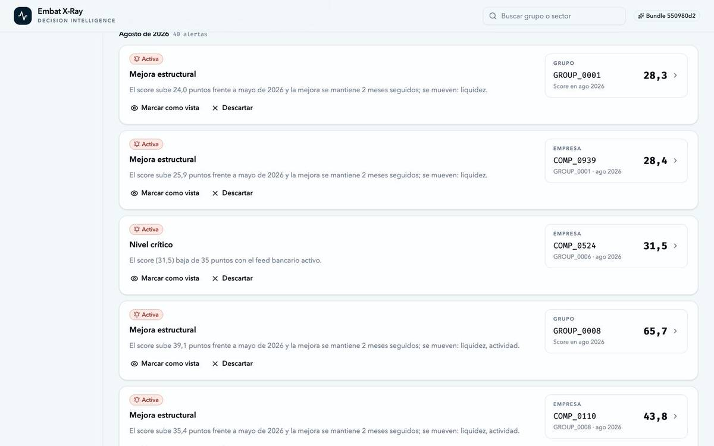

### Estados vacíos (`EmptyState`)

Si una pestaña no tiene alertas que mostrar, se renderiza el componente `EmptyState` con un icono, un título y una descripción que evalúa secuencialmente el contexto para dar la mejor ayuda:

1.  **Todas descartadas:** Si hay alertas en la pestaña, pero todas están ocultas por el triaje, el título es «[Estado] [en mes]» y la descripción: «Todas las alertas activas de este periodo están descartadas en este navegador.». Muestra el botón «Ver descartadas».
2.  **Filtros muy restrictivos:** Si hay alertas en la pestaña, pero ninguna coincide con la búsqueda o los filtros de entidad/tipo, la descripción es: «Ninguna alerta coincide con los filtros. Límpialos o amplía el periodo.». Muestra el botón «Limpiar filtros» (con icono `FilterX`).
3.  **Mes sin alertas:** Si el alcance es «Solo el mes de análisis» y no hay alertas en ese mes, la descripción es: «Elige otro mes en la línea temporal o amplía la bandeja a todo el histórico.». Muestra el botón «Ver todo el histórico».
4.  **Sin alertas en el *bundle*:** Si el JSON realmente no contiene alertas para ese estado, la descripción es: «El bundle no contiene alertas en este estado.».
5.  **Sugerencias de navegación:** En todos los casos vacíos, se generan dinámicamente botones secundarios para saltar a otras pestañas que sí contengan alertas (ej. «Silenciadas · 177»).

**Enlace al recibo:** Específicamente en la pestaña de «Abstenciones», al final del listado (o bajo el estado vacío), se incluye un párrafo con el icono `ReceiptText` y un enlace directo al recibo (`/?tab=tecnico&section=recibo`), explicando que allí se listan todas las entidades en abstención en el último cierre y qué dato las desbloquea.

### Anatomía de la tarjeta de alerta (`alert-card.svelte`)

Cada alerta se renderiza en una tarjeta dividida en dos columnas principales (en escritorio):

#### Columna izquierda (Detalles y Triaje)
*   **Insignias (*Badges*):** 
    *   **Estado:** «Activa» (rojo, `BellRing`), «Silenciada» (gris, `BellOff`) o «Abstención» (mostaza, `PauseCircle`).
    *   **Tipo de alerta:** Solo aparece si el texto del tipo (`ALERT_KIND_TEXT`) difiere del título de la alerta.
    *   **Triaje:** Si la alerta ha sido triada, muestra «Vista» (gris, `Check`) o «Descartada» (gris, `EyeOff`).
*   **Título y Descripción:** El título de la alerta (`alert.title`) en negrita, seguido del detalle (`alert.detail`). Las fechas en el detalle se formatean a lenguaje natural mediante `humanizeMonths` (ej. «2025-09» pasa a «septiembre de 2025»).
*   **Caja de supresión/abstención:** Si la alerta tiene el campo `suppressed_by`, se muestra una caja con fondo tintado (mostaza para abstenciones, gris para silenciadas) y un borde lateral izquierdo más grueso.
    *   **Motivo:** Muestra «No se dispara:» o «Silenciada:» seguido del texto exacto extraído del glosario del manifiesto (`manifest.glossary.reasons`).
    *   **Explicación didáctica:** Si el motivo es `perimeter_change`, añade: «En [mes] se conectó una empresa o una cuenta nueva: el salto del score refleja el perímetro nuevo, no un deterioro del negocio. Las alertas quedan en pausa [hasta mes].». Si es `abstention`, añade: «Con estos datos el motor no sostiene un veredicto: enseña el número, pero no dispara la alerta.».
    *   **Ventana:** Muestra el texto «Ventana: » seguido del rango. Si no hay fin (`!muted.until`), dice «desde [mes]». Si el inicio y fin son el mismo mes, dice solo «[mes]». Si son distintos, dice «[mes inicio] – [mes fin]» (usando `formatPeriodShort`, ej. «sep 2026»).
    *   **Estado de la abstención en el último cierre:** Si es una abstención, comprueba en `receipt.abstentions` si la entidad sigue en abstención en el último cierre del *bundle* (`standingAbstention`). Si es así, muestra el icono `KeyRound` y el texto: «Sigue en abstención en [mes]. Qué la desbloquea: [acción]». Si ya no lo está (y el recibo se pudo leer), avisa: «En [mes], el último cierre, la entidad ya no está en abstención.».
*   **Botones de triaje:** Solo visibles si la alerta está en estado `fired`.

#### Columna derecha (Entidad y Score)
*   Renderizada como un enlace (`<a>`) que apunta a la ruta de la entidad (`alertEntityPath`), manteniendo el mes de la alerta en la URL (`?m=YYYY-MM`). Al hacer *hover*, el fondo se oscurece (`hover:bg-muted`).
*   Muestra el tipo de entidad («Grupo» o «Empresa»), el identificador (`entity_id`) con la clase `font-data` (monoespaciada) que rompe palabras si es muy largo (`break-all`), y un texto de contexto (`scoreCaption`): si es empresa, muestra «[ID del grupo] · [mes corto]»; si es grupo, muestra «Score en [mes corto]».
*   A la derecha, el componente `ScoreCell` muestra la puntuación en décimas (`alert.shown`), atenuada (`muted`) si la alerta no está activa, junto a un icono de *chevron* (`ChevronRight`).

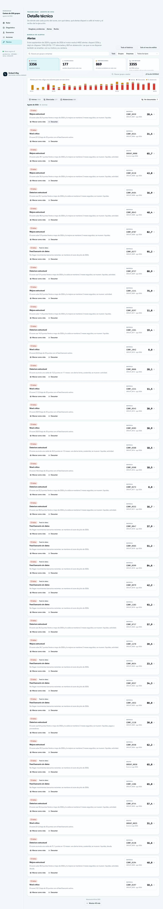

### Sistema de triaje local (`alert-state.svelte.ts`)

El triaje permite al analista gestionar su flujo de trabajo marcando las alertas activas. Si una alerta tiene el estado `dismissed`, toda su tarjeta recibe la clase `opacity-60`.

*   **Almacenamiento:** El estado se guarda **exclusivamente en el navegador** del usuario mediante `localStorage` bajo la clave `xray:alert-triage:v1`. No se envía a ningún *backend* ni modifica el *bundle* original. Si el almacenamiento está bloqueado (modo privado estricto), el triaje funciona en memoria durante la sesión actual.
*   **Estados posibles (`Triage`):** `seen` («Vista») o `dismissed` («Descartada»). Si no tiene marca, es `null` (nueva/pendiente).
*   **Interacción en la tarjeta:**
    *   **«Marcar como vista» / «Marcar como no vista»:** Botón `ghost` de tamaño `sm`. Alterna el estado `seen`. Mantiene la alerta en la lista principal pero actualiza los contadores (resta 1 a «Sin revisar»). Usa los iconos `Eye` y `EyeOff`.
    *   **«Descartar»:** Botón `ghost` con el icono `X`. Asigna el estado `dismissed`. La alerta desaparece inmediatamente de la vista principal (a menos que el botón «Ver descartadas» esté activo).
    *   **«Restaurar»:** Si la alerta está descartada (y visible gracias al filtro), este es el único botón que aparece (con el icono `RotateCcw`). Elimina la marca (`null`), devolviéndola a la bandeja principal con opacidad normal.
*   **Sincronización:** La clase `AlertTriage` escucha el evento `storage` del navegador (`window.addEventListener('storage', ...)`), por lo que si el usuario marca una alerta en una pestaña, el estado se actualiza en tiempo real en otras pestañas abiertas de la misma aplicación.

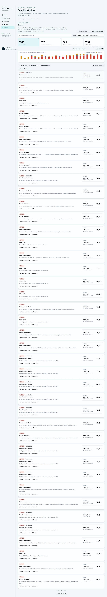

## 9. Técnico: recibo

### Técnico: recibo

**Qué es** · Es la tercera pestaña de la vista «Detalle técnico» (`/?tab=tecnico&section=recibo`). Actúa como una pista de auditoría y transparencia metodológica del motor de *Decision Intelligence*, mostrando la huella criptográfica de la ejecución, los resultados de la validación sin etiquetas, los pesos de las señales utilizadas y el registro de abstenciones.
**Dónde aparece** · En el área principal de contenido de la vista técnica cuando se selecciona la pestaña «Recibo».
**Fuente** · `src/lib/xray/receipt-view.svelte`, `src/lib/xray/receipt-check-card.svelte`, `src/lib/xray/receipt-signals.svelte`, `src/lib/xray/receipt-abstentions.svelte`, leyendo los datos de `receipt.json` a través de `loadReceipt`.

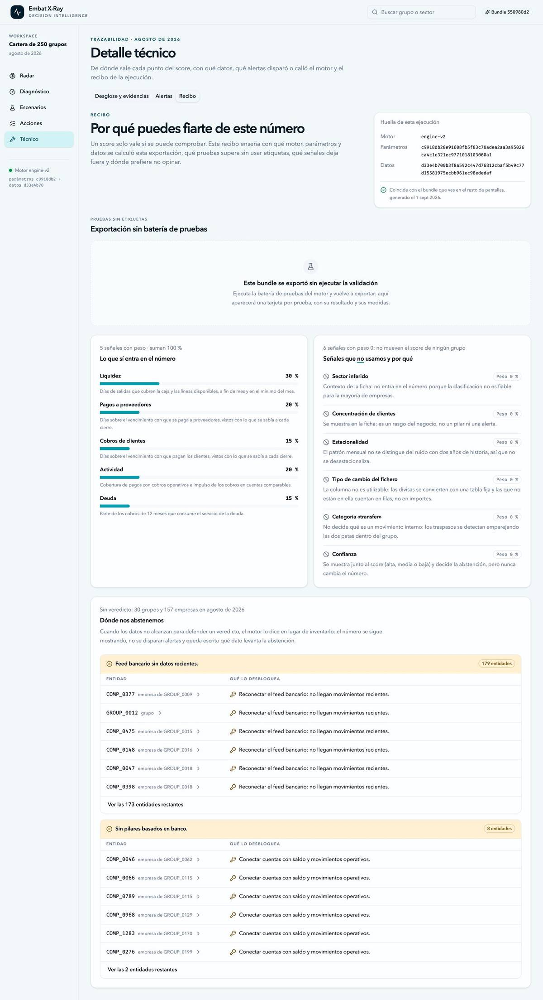

#### Huella de esta ejecución

**Qué es** · Un bloque que certifica que el recibo mostrado corresponde exactamente a los datos que se están visualizando en el resto de la aplicación.

**Anatomía y funcionamiento** ·
- **Textos introductorios**: Epígrafe «Recibo», título «Por qué puedes fiarte de este número» y el texto explicativo: «Un score solo vale si se puede comprobar. Este recibo enseña con qué motor, parámetros y datos se calculó esta exportación, qué pruebas supera sin usar etiquetas, qué señales deja fuera y dónde prefiere no opinar.».
- **Tarjeta «Huella de esta ejecución»**: Muestra una lista de definición (`dl`) con tres pares clave-valor extraídos de `receipt.json`:
  - **«Motor»**: Versión del motor (ej. `engine-v2`).
  - **«Parámetros»**: Hash SHA-256 del archivo de parámetros (`receipt.params_hash`), con la clase `break-all` para forzar el salto de línea.
  - **«Datos»**: Hash SHA-256 del conjunto de datos (`receipt.dataset_hash`), también con `break-all`.

**Lógica de validación y estados** · El componente `receipt-view.svelte` calcula la variable `sameRun` comprobando que la versión del motor y los hashes de parámetros y datos del recibo coinciden exactamente con los del manifiesto (`manifest`).
- **Estado válido (`sameRun === true`)**: Al pie de la tarjeta de la huella, separado por un borde superior, aparece un icono `CircleCheck` en tono `success` (verde) y el texto: «Coincide con el bundle que ves en el resto de pantallas, generado el [fecha].». La fecha se formatea con `formatTimestamp(manifest.generated_at)` (ej. «1 sept 2026»).
- **Estado de error (`sameRun === false`)**: Se oculta el mensaje de éxito en la tarjeta y se renderiza un componente `Alert.Root` con `variant="destructive"` debajo del bloque de la huella. Muestra el icono `TriangleAlert`, el título «El recibo no corresponde a este bundle» y la descripción: «La versión del motor o las huellas del recibo no coinciden con las del manifiesto: estas pruebas describen otra ejecución.».

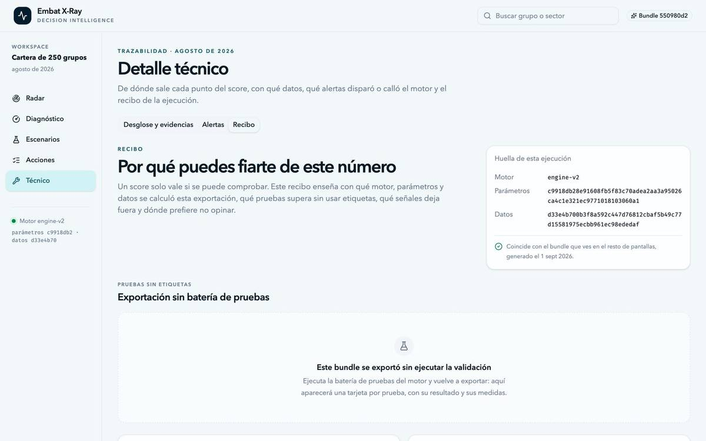

#### Pruebas sin etiquetas (Validación del modelo)

**Qué es** · Una sección que expone los resultados de la batería de pruebas de validación ejecutadas por el motor, listadas en `receipt.checks`.

**Anatomía del encabezado y KPIs** ·
- **Epígrafe**: «Pruebas sin etiquetas».
- **Título dinámico (`conclusion`)**: Se calcula a partir de los estados de las pruebas. Se define `judged` como la suma de las pruebas superadas (`pass`) y no superadas (`fail`).
  - Si `judged === 0`: «Esta exportación no trae pruebas con veredicto».
  - Si no hay fallos (`counts.fail === 0`): «La prueba con veredicto se supera» (si `judged === 1`) o «Las [X] pruebas con veredicto se superan» (si `judged > 1`).
  - Si hay fallos: «[X] de [Y] pruebas con veredicto no se superan» (o «no se supera» en singular).
- **Alertas de fallo**: Si hay pruebas no superadas (`failed.length > 0`), se listan sus títulos debajo del encabezado en texto rojo (`var(--danger-strong)`): «No superadas: [Título 1] · [Título 2]».
- **Tarjetas de contadores**: Cuatro métricas que agrupan las pruebas por su estado (`CheckStatus`), utilizando los tonos definidos en `CHECK_STATUS_TONE` y los textos de `CHECK_STATUS_TEXT`:
  - **«Superada»** (`pass`): Icono `CircleCheck`, tono `success` (verde). Significado: «La propiedad se cumple».
  - **«No superada»** (`fail`): Icono `CircleX`, tono `danger` (rojo). Significado: «La propiedad no se cumple».
  - **«Informativa»** (`info`): Icono `Info`, tono `signal` (turquesa). Significado: «Mide, no aprueba ni suspende».
  - **«No ejecutada»** (`not_run`): Icono `CircleDashed`, tono `neutral` (gris). Significado: «Fuera de esta exportación».
  - El valor numérico se formatea con `formatNumber`. Si el recuento es 0, el número se muestra atenuado (`text-muted-foreground`).

**Tarjetas de prueba (`receipt-check-card.svelte`)** · Cada prueba se renderiza en una tarjeta individual en una cuadrícula:
- **Cabecera**: Muestra el icono correspondiente al estado, el título de la prueba (`check.title`), una pastilla (`Badge`) con el texto del estado y el tono correspondiente, y la descripción (`check.summary`).
- **Métricas (`check.metrics`)**: Lista de definición (`dl`) con pares clave-valor. La función `display(metric)` determina el formato:
  - Si el valor es una cadena que coincide con una lista de meses separados por comas (detectado mediante la expresión regular `MONTH_LIST`), se hace un `split`, se aplica `trim` y se formatea cada mes con `formatPeriodShort`, uniéndolos con « · » (ej. «sept 2026 · oct 2026»).
  - Para el resto de valores, se usa `formatUnitValue(metric.value, metric.unit)`.
- **Distribución (`check.bars`)**: Si la prueba incluye un histograma, se renderiza usando el componente `InlineBars`, mostrando el título «Distribución de [check.title]» y barras horizontales proporcionales.
- **Variantes visuales**:
  - Si el estado es `fail`, la tarjeta recibe un borde rojo (`border-[var(--danger)]/40`).
  - Si es `not_run`, la tarjeta se muestra con borde discontinuo, fondo translúcido y sin sombra (`border-dashed bg-card/60 shadow-none`).

**Estado vacío** · Si el array `receipt.checks` está vacío, se oculta la cuadrícula de tarjetas y los contadores, y se muestra el componente `EmptyState` con el icono `FlaskConical`, el título «Este bundle se exportó sin ejecutar la validación» y la descripción: «Ejecuta la batería de pruebas del motor y vuelve a exportar: aquí aparecerá una tarjeta por prueba, con su resultado y sus medidas.».

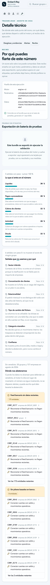

#### Señales ponderadas y descartadas

**Qué es** · El componente `receipt-signals.svelte` divide la matriz de señales del motor (`receipt.signals`) en dos bloques según su peso (`weight`). El peso se formatea como porcentaje usando `share(weight)`: si el porcentaje es un número entero (múltiplo de 10 en milésimas), no muestra decimales (ej. «30 %»); si no, muestra un decimal (ej. «12,5 %»).

**«Lo que sí entra en el número» (Señales con peso > 0)** ·
- **Cabecera**: Indica el número de señales y la suma total de sus pesos (ej. «5 señales con peso · suman 100 %»).
- **Lista**: Cada señal muestra su nombre (`signal.label`) en negrita, su peso exacto alineado a la derecha, una barra de progreso visual cuyo relleno (`bg-[var(--signal)]`) es proporcional a su peso (`signal.weight * 100%`), y la justificación técnica (`signal.why`) en texto atenuado.
- **Estado vacío**: Si no hay señales con peso, muestra un `EmptyState` con el icono `Scale`, el título «Ninguna señal con peso» y la descripción «El recibo de esta exportación no declara los pesos del score.».

**«Señales que no usamos y por qué» (Señales con peso 0)** ·
- **Cabecera**: Indica el número de señales descartadas (ej. «6 señales con peso 0: no mueven el score de ningún grupo»). El título de la tarjeta subraya la palabra «no» con el color de señal (`decoration-[var(--signal)]`).
- **Lista**: Cada señal se presenta con un icono de prohibición (`Ban`) en gris claro, su nombre en negrita, una pastilla con borde que indica «Peso [X] %», y el texto explicativo (`signal.why`) que justifica la exclusión (ej. «El patrón mensual no se distingue del ruido con dos años de historia, así que no se desestacionaliza.»).
- **Estado vacío**: Si no hay señales con peso 0, muestra un `EmptyState` con el icono `Ban`, el título «Ninguna señal con peso 0» y la descripción «Todas las señales que declara el motor entran en el score.».

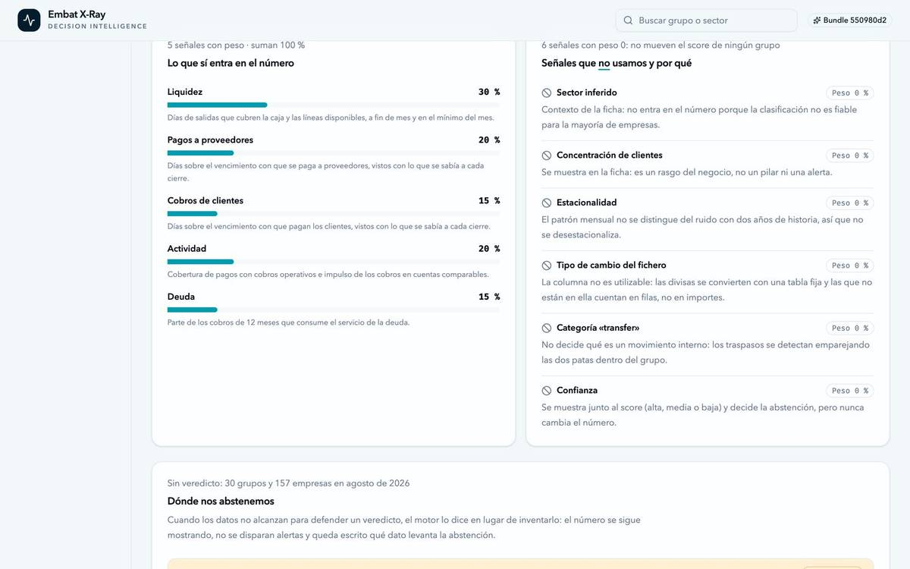

#### Dónde nos abstenemos

**Qué es** · El componente `receipt-abstentions.svelte` lista todas las entidades (grupos y empresas) sobre las que el motor se ha abstenido de emitir un veredicto en el último mes de la exportación, basándose en el array `receipt.abstentions`.

**Anatomía y funcionamiento** ·
- **Resumen (`summary`)**: El subtítulo calcula dinámicamente cuántos grupos y empresas están en abstención. Si todos los registros pertenecen a un único mes, añade el periodo (ej. «Sin veredicto: 30 grupos y 157 empresas en agosto de 2026»).
- **Textos introductorios**: Título «Dónde nos abstenemos» y la descripción: «Cuando los datos no alcanzan para defender un veredicto, el motor lo dice en lugar de inventarlo: el número se sigue mostrando, no se disparan alertas y queda escrito qué dato levanta la abstención.».
- **Agrupación por motivo (`byReason`)**: Las abstenciones se agrupan por su código de razón (`item.reason`). Los bloques se ordenan de mayor a menor cantidad de entidades afectadas, y en caso de empate, alfabéticamente por el código de la razón. Dentro de cada bloque, las entidades se ordenan por `group_id`, priorizando el grupo sobre sus empresas, y finalmente por `entity_id`.
- **Cabecera del bloque**: Cada motivo se presenta en un contenedor con fondo amarillo/ámbar (`bg-[var(--warning-soft)]`) y borde inferior. Muestra el icono `PauseCircle` en tono `warning-strong`, el texto del motivo traducido mediante el glosario del manifiesto (`glossaryText(manifest, 'reasons', reason)`), y una pastilla (`Badge`) con el recuento de entidades afectadas (ej. «179 entidades»).
- **Tabla de entidades**:
  - **Columnas (solo en escritorio)**: «Entidad» y «Qué lo desbloquea».
  - **Fila de entidad**:
    - **Enlace**: Toda la celda de la entidad es un enlace interactivo (con un chevron `>` que se desplaza al hacer hover) que navega a la vista de la entidad en ese mes específico mediante `monthStore.href(...)`.
    - **Identificador**: Muestra el `item.entity_id` en negrita (ej. «COMP_0377»).
    - **Subtexto**: Si es un grupo, indica «grupo»; si es una empresa, indica «empresa de [group_id]». Si el array de abstenciones contiene registros de múltiples meses, añade el mes formateado (ej. « · ago 2026»).
  - **Columna de desbloqueo**: Muestra un icono de llave (`KeyRound`) en tono `warning-strong` y el texto de la acción correctiva (`item.unlock`), procesado por `humanizeMonths` para formatear correctamente cualquier fecha mencionada (ej. «Reconectar el feed bancario: no llegan movimientos recientes.»).
- **Paginación / Despliegue**: Para evitar listas inmensas, inicialmente solo se muestran las primeras 6 entidades de cada bloque (`PREVIEW = 6`). Si hay más, aparece un botón en el pie del bloque:
  - Si está contraído: «Ver la entidad restante» o «Ver las [X] entidades restantes» (ej. «Ver las 173 entidades restantes»).
  - Si está expandido: «Ver menos».
  - Al pulsarlo, se alterna el estado en el diccionario `expanded[block.reason]`.

**Estado vacío** · Si no hay abstenciones en el último cierre (`abstentions.length === 0`), se oculta la lista y se muestra un `EmptyState` con el icono `CircleCheck`, tono `success`, el título «Sin abstenciones» y la descripción: «El motor emite veredicto para todas las entidades en el último cierre de esta exportación.».

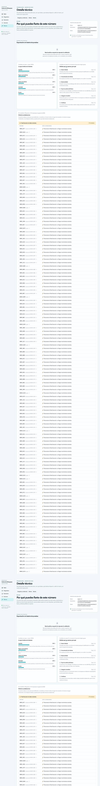

## 10. Página de grupo

### Navegación y cabecera de la entidad

**Qué es** · Es el bloque superior fijo que identifica al grupo empresarial analizado, proporciona el contexto de su sector y tamaño, y permite la navegación temporal a través de los cierres mensuales disponibles en el *bundle*.

**Dónde aparece** · En la parte superior de la ruta `/group/[id]`, inmediatamente debajo de la cabecera global de la aplicación. Está orquestado por el componente `src/lib/xray/entity-view.svelte`.

**Anatomía y textos literales** ·
*   **Botón de retroceso**: Enlace con el icono `ArrowLeft` y el texto literal «← Volver al radar» (pasado como *prop* `backLabel` desde la ruta).
*   **Metadatos del grupo (*Eyebrow*)**: Texto en mayúsculas pequeñas. Se compone dinámicamente en `+page.svelte`: «Grupo · [X] empresas · con datos desde [mes formateado]» (ej. «Grupo · 6 empresas · con datos desde septiembre de 2024»). Pluraliza correctamente: «1 empresa» o «X empresas».
*   **Identificación**:
    *   **Avatar (`company-avatar.svelte`)**: Círculo coloreado de forma determinista según el nombre o ID, mostrando hasta dos iniciales en mayúscula.
    *   **Título**: Identificador del grupo (`group.id`), por ejemplo, «GROUP_0153».
    *   **Pastilla sectorial**: *Badge* con estilo `outline` que muestra el sector estimado y la confianza de la clasificación formateada sin decimales: «[Sector] · [X] %» (ej. «Manufactura · 21 %»). El atributo HTML `title` contiene el motivo de la clasificación (`industry.reason`).
*   **Selector temporal (`month-slider.svelte`)**: Tarjeta ubicada a la derecha.
    *   Etiqueta superior: «Mes de análisis».
    *   Mes seleccionado: Formateado con `formatPeriod` (ej. «Agosto de 2026»).
    *   Botones de navegación: Flecha izquierda (`ChevronLeft`) con `aria-label="Mes anterior"` y flecha derecha (`ChevronRight`) con `aria-label="Mes siguiente"`.
    *   Control deslizante (*slider*): Muestra en los extremos el primer y último mes del *bundle* formateados con `formatPeriodShort` (ej. «sept 2024» y «ago 2026»).
    *   Botón de retorno: Si el mes seleccionado no es el último disponible, aparece el botón «Último cierre» con el icono `History`.

**Cómo funciona** ·
*   El botón de retroceso utiliza `monthStore.href('/')` para volver al radar manteniendo el mes seleccionado en la URL mediante el parámetro `?m=YYYY-MM`.
*   El `MonthSlider` lee y escribe en la clase reactiva `monthStore.svelte.ts`. Al arrastrar el *slider* o pulsar las flechas, se actualiza el estado global y la URL (con un *debounce* de 200 ms). Esto provoca que la variable derivada `entry = entryAt(entries, monthStore.month)` se recalcule, actualizando instantáneamente todos los componentes de la página.

**Fuente** · `src/routes/(app)/group/[id]/+page.svelte`, `src/lib/xray/entity-view.svelte`, `src/lib/xray/month-slider.svelte`.

### Alertas de estado y señales

**Qué es** · Banners informativos de ancho completo que aparecen justo debajo de la cabecera para advertir sobre situaciones excepcionales en el cálculo del *score* o cambios de tendencia detectados por el motor.

**Estados y variantes** ·
*   **Abstención del motor (`abstained-state.svelte`)**:
    *   *Lógica*: Aparece si el objeto `entry.abstain` no es nulo (el motor no tiene datos suficientes para emitir un veredicto).
    *   *Aspecto*: Componente `Alert.Root` con clases personalizadas para aplicar el tono de advertencia (`border-[var(--warning)]/40 bg-[var(--warning-soft)]`). Icono `PauseCircle`.
    *   *Textos*: Título por defecto «El motor se abstiene este mes». La descripción muestra el motivo traducido desde el manifiesto (`glossaryText(manifest, 'reasons', abstain.reason)`), por ejemplo, «Feed bancario sin datos recientes.». Debajo, precedido por el icono `KeyRound`, el texto: «**Qué lo desbloquea:** [texto de `abstain.unlock` formateado con `humanizeMonths`]».
*   **Señal detectada**:
    *   *Lógica*: Aparece si `entry.verdict.detected_since` tiene valor (el motor ha confirmado un cambio de trayectoria estructural).
    *   *Aspecto*: Componente `Alert.Root` con tono de advertencia (`border-[var(--warning)]/35 bg-[var(--warning-soft)]`). Icono `CalendarClock`.
    *   *Textos*: Título «Señal detectada desde [mes formateado]». Descripción: «El cambio de trayectoria acumula [X] [cierre/cierres] de persistencia.» (pluraliza según `verdict.persistence_months`).

**Fuente** · `src/lib/xray/entity-view.svelte`, `src/lib/xray/abstained-state.svelte`.

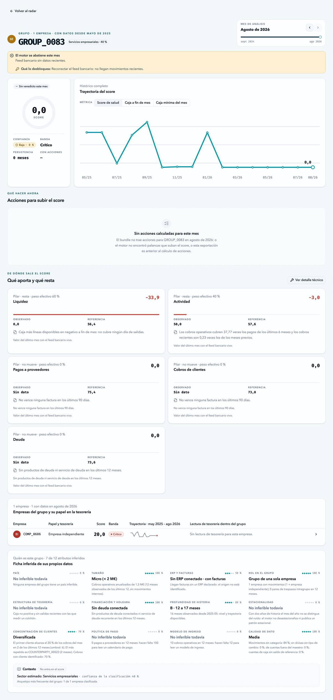
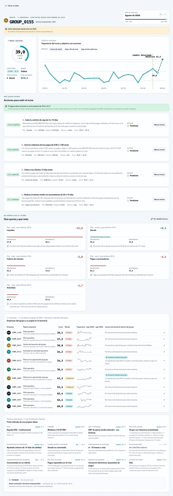

### Héroe: Score actual y trayectoria

**Qué es** · El bloque visual principal (`entity-hero.svelte`) que presenta la calificación financiera del grupo en el mes seleccionado y su evolución histórica. Se divide en dos tarjetas contiguas.

#### Tarjeta de Score actual
**Anatomía y textos literales** ·
*   **Pastilla de tendencia**: Muestra la dirección y naturaleza del veredicto.
    *   *Lógica*: Si `verdict.available` es falso, muestra «Sin veredicto este mes». Si es verdadero, concatena `DIRECTION_TEXT` y `NATURE_TEXT` (ej. «Deterioro · estructural»).
    *   *Aspecto*: Usa el componente `Badge`. Variante `destructive` si la dirección es `deteriorating`, de lo contrario `secondary`. Iconos: `ArrowUpRight` (mejora), `ArrowDownRight` (deterioro), `Minus` (estable o cambio de perímetro).
*   **Gráfico radial (`score-gauge.svelte`)**:
    *   *Lógica*: El anillo se rellena proporcionalmente al *score* (`entry.shown / 10`) usando un gradiente cónico CSS.
    *   *Textos*: Muestra el valor central formateado con un decimal (`formatNumber(rawScore, 1)`), la etiqueta «Score» y el diferencial respecto a hace 3 meses (`verdict.delta3 / 10`) formateado con signo (`formatSigned`). El diferencial aplica la clase CSS `positive` o `negative` según su valor.
*   **Cuadrícula de métricas (2x2)**:
    *   **Confianza (`confidence-pill.svelte`)**: Muestra el nivel (Alta, Media, Baja) y el porcentaje (`entry.conf.value`) formateado sin decimales. El color del *badge* y el icono (`ShieldCheck`, `ShieldQuestion`, `ShieldAlert`) dependen del nivel (`entry.conf.label`).
    *   **Banda**: Etiqueta textual de la banda de riesgo (`entry.band`), traducida mediante `bandLabel` (Crítico, Vigilancia, Estable, Sólido).
    *   **Persistencia**: Muestra `[X] [mes/meses]` leyendo `verdict.persistence_months`.
    *   **Con acciones**: Si el cálculo de acciones arroja un objetivo (`targetTenths !== null`), muestra el icono `Target` y el *score* potencial formateado con un decimal. Si no hay acciones, muestra un guion «—».

#### Tarjeta de Trayectoria (`trajectory-chart.svelte`)
**Anatomía y funcionamiento** ·
*   **Selector de métrica**: Pestañas (`ToggleGroup`) para alternar la serie temporal. Por defecto es «Score de salud». Si el *bundle* incluye series adicionales en `group.series` (ej. «Caja a fin de mes»), se añaden dinámicamente. El título de la tarjeta cambia a «Trayectoria del score y objetivo con acciones» (si hay objetivo), «Trayectoria del score» (si no lo hay), o al nombre de la serie activa (ej. «Caja a fin de mes»).
*   **Gráfico de líneas (SVG personalizado)**:
    *   *Eje X*: Meses del histórico (`trajectory.months`), formateados como `MM/AA` mediante la función interna `shortMonth`.
    *   *Serie histórica*: Línea continua (`stroke: var(--signal)`) que une los valores observados. Los meses sin datos (`null`) rompen la línea. El último punto observado se resalta con un círculo hueco y su valor numérico.
    *   *Línea de cambio detectado*: Si existe `changeIndex` (derivado de `verdict.detected_since`), se dibuja una línea vertical discontinua naranja (`stroke: var(--warning)`) con la etiqueta «Cambio detectado».
    *   *Proyección objetivo*: Si hay un *score* objetivo calculado, se dibuja una línea discontinua verde (`stroke: var(--success)`) desde el último punto real hasta un nodo verde final etiquetado como «Objetivo [valor]».
*   **Interacción (Hover)**: Al mover el cursor sobre el SVG (`onpointermove`), se calcula el índice más cercano. Aparece una línea vertical tenue, un punto resaltado y un *tooltip* flotante absoluto que muestra el mes (añadiendo «(proy.)» si es futuro) y el valor exacto formateado.
*   **Formatos dinámicos**: Si se selecciona una serie monetaria (unidad `EUR`), el gráfico formatea los valores del eje y del *tooltip* con `formatEuroCompact` (ej. «+26,60 €») y ajusta los márgenes (`domain`) dinámicamente.

**Fuente** · `src/lib/xray/entity-hero.svelte`, `src/lib/xray/score-gauge.svelte`, `src/lib/xray/confidence-pill.svelte`, `src/lib/xray/trajectory-chart.svelte`, `src/lib/xray/entity-series.ts`.

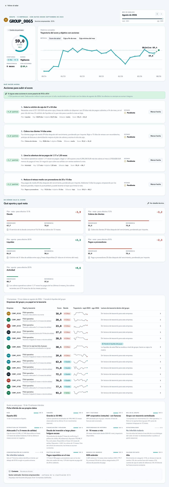
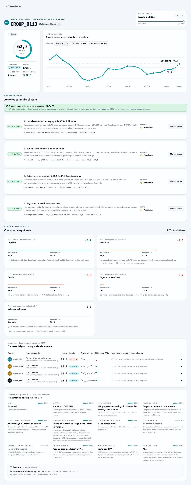
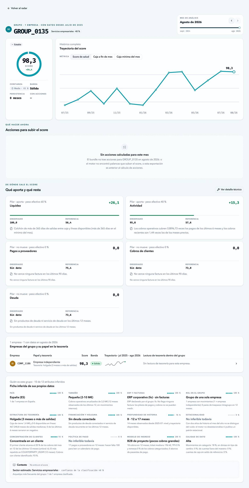

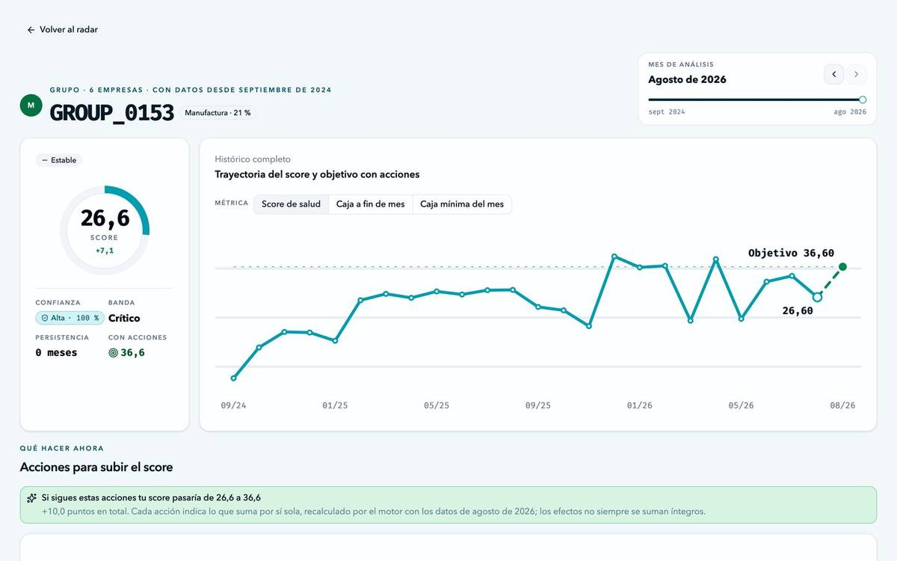
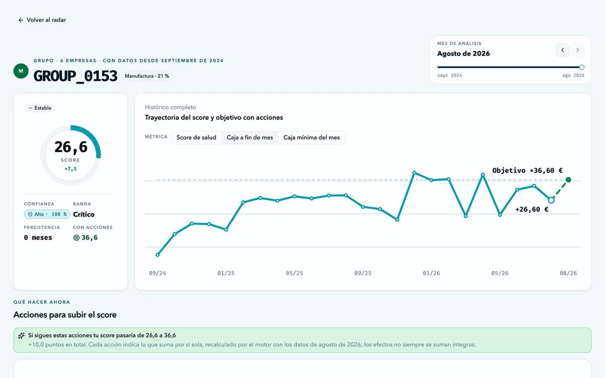

### Acciones recomendadas

**Qué es** · Sección (`entity-actions.svelte`) que lista las palancas operativas que el grupo puede accionar para mejorar su *score*, calculadas por el motor para el mes en curso.

**Anatomía y textos literales** ·
*   **Encabezado**: *Eyebrow* «Qué hacer ahora» y título «Acciones para subir el score».
*   **Banner de impacto**: Componente `Alert.Root` con clases `border-[var(--success)]/35 bg-[var(--success-soft)]` y el icono `Sparkles`.
    *   *Título*: «Si sigues estas acciones tu score pasaría de [actual] a [objetivo]» (formateados con un decimal).
    *   *Descripción*: «+[X] puntos en total. Cada acción indica lo que suma por sí sola, recalculado por el motor con los datos de [mes formateado]; los efectos no siempre se suman íntegros.».
*   **Lista de acciones (`action-list.svelte`)**: Tarjetas ordenadas de mayor a menor impacto (`uplift_tenths`).
    *   *Badge de impacto*: Pastilla con borde verde (`border-[var(--success)]/40 bg-[var(--success-soft)] text-[var(--success-strong)]`) que muestra los puntos ganados formateados con signo (ej. «+5,0 puntos»).
    *   *Título*: Numerado y con la instrucción directa (`{index + 1}. {action.title}`).
    *   *Descripción*: Texto detallado (`action.detail`) que cuantifica el esfuerzo en euros o días.
    *   *Metadatos*: Fila inferior con etiquetas en gris y valores. Muestra el «Pilar» (`pillarLabel`), «Hoy» y «objetivo» (formateados con `formatNumber` y su unidad), «Esfuerzo» (`action.effort`), y la proyección individual del «Score» («[actual] → [estimado]»). *Nota: A diferencia de la vista global de acciones, aquí no se muestra el enlace al grupo porque ya estamos en su página.*
    *   *Estado e interacción*: Muestra la etiqueta «Estado» y un indicador visual: «Hecha» (icono `Check` verde) o «Pendiente» (icono `CircleDot` amarillo). Un botón secundario permite alternar el estado («Marcar hecha» o «Reabrir»). Este triaje se guarda localmente en el navegador mediante la clase reactiva `ActionState` (`localStorage`).

**Estados y variantes** ·
*   **Sin acciones**: Si el array de acciones está vacío, se muestra el componente `EmptyState` con el icono `ListChecks`. Título: «Sin acciones calculadas para este mes». Descripción: «El bundle no trae acciones para [ID] en [mes formateado]: o el motor no encontró palancas que suban el score, o esta exportación es anterior al cálculo de acciones.».

**Fuente** · `src/lib/xray/entity-actions.svelte`, `src/lib/xray/action-list.svelte`, `src/lib/xray/actions.ts`.

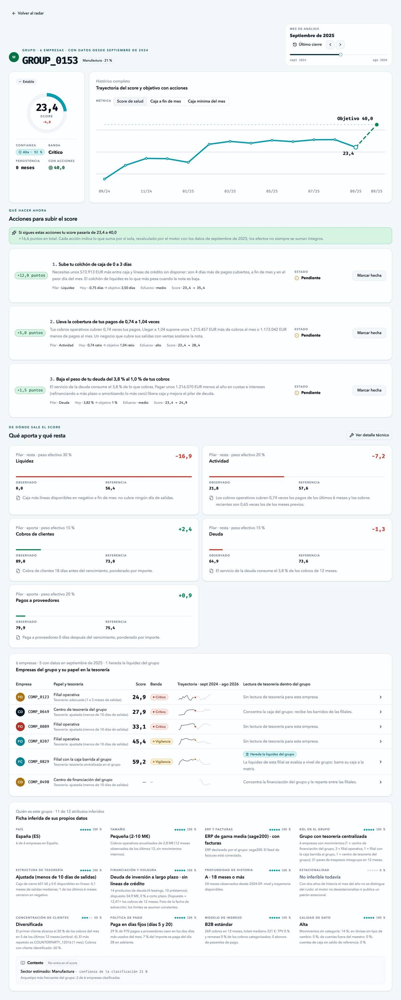

### Desglose de pilares

**Qué es** · Sección (`pillar-drivers.svelte`) que explica matemáticamente cómo se construye el *score* del mes a partir de los cinco pilares fundamentales.

**Anatomía y lógica de ordenación** ·
*   **Encabezado**: *Eyebrow* «De dónde sale el score», título «Qué aporta y qué resta». A la derecha, un botón «Ver detalle técnico» (icono `Wrench`) que enlaza a la pestaña técnica del grupo (`/?tab=tecnico&focus=[id]`).
*   **Tarjetas de pilares**: Se muestran en una cuadrícula (`grid`) de dos columnas. **Se ordenan por el valor absoluto de su contribución** (`Math.abs(b.contrib) - Math.abs(a.contrib)`), de modo que el pilar que más mueve el *score* (ya sea sumando o restando) aparece primero.
*   **Anatomía de cada tarjeta**:
    *   *Cabecera*: Texto gris «Pilar · [aporta/resta/no mueve] · peso efectivo [X] %». El verbo se calcula dinámicamente según el signo de `contrib`. A la derecha, el impacto en puntos (`contrib / 10`) coloreado en verde (clase `positive`) o rojo (clase `negative`) y formateado con signo.
    *   *Barra de progreso*: Componente `Progress`. Su longitud es proporcional a la contribución del pilar respecto a la contribución máxima absoluta de ese mes (`scale`). El color de la barra de llenado es verde (`bg-[var(--success)]`) o rojo (`bg-[var(--danger)]`).
    *   *Métricas*: Cuadrícula con «Observado» (`driver.score === null ? 'Sin dato' : formatScore(driver.score)`) y «Referencia» (obtenido de `manifest.pillars.baseline`).
    *   *Explicaciones*: Párrafo con el icono `FileSearch` que muestra la nota del motor (`driver.note`). Debajo, se listan como texto gris las reglas o compuertas lógicas que han saltado (`driver.gates`), traducidas a lenguaje natural mediante `glossaryText(manifest, 'gates', gate)`.

**Fuente** · `src/lib/xray/pillar-drivers.svelte`.

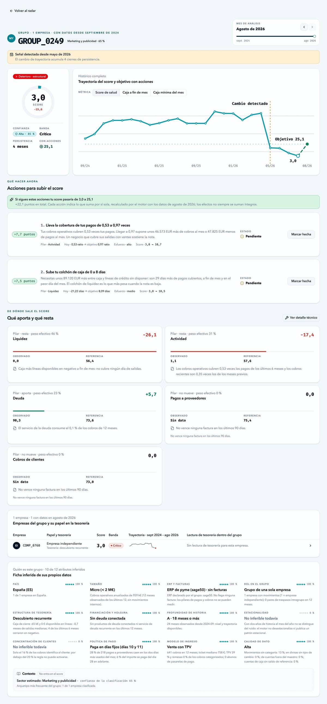

### Empresas del grupo y su papel en la tesorería

**Qué es** · Tabla (`company-drilldown.svelte`) que desglosa las filiales que componen el grupo consolidado, mostrando su rol, su *score* individual y su comportamiento de tesorería.

**Anatomía y funcionamiento** ·
*   **Resumen**: Subtítulo dinámico que cuenta el total de empresas, cuántas tienen datos en el mes seleccionado y cuántas heredan la liquidez de la matriz. Ejemplo: «22 empresas · 22 con datos en agosto de 2026 · 4 heredan la liquidez del grupo».
*   **Ordenación de la tabla**: Las empresas se ordenan de menor a mayor *score* (`(a.score ?? Infinity) - (b.score ?? Infinity)`). Las que no tienen datos en el mes van al final. Los empates se rompen por orden alfabético del ID.
*   **Columnas**:
    *   **Empresa**: Componente `CompanyAvatar` (genera un color determinista basado en el nombre/ID y muestra hasta 2 iniciales). Nombre en negrita (`company.id`).
    *   **Papel y tesorería**: Muestra `company.role` (ej. «Filial operativa») y, en texto menor gris, «Tesorería: [clase en minúsculas]». Si no hay rol inferido, muestra «Sin papel inferido».
    *   **Score y Banda**: Componente `ScoreCell` (formatea a un decimal) y `BandBadge` (pastilla coloreada según el tono de la banda con un punto indicador).
    *   **Trayectoria (`score-sparkline.svelte`)**: Minigráfico vectorial (SVG) que dibuja la línea de tendencia de la empresa en toda la ventana del *bundle*.
        *   *Línea*: Trazo gris (`stroke-opacity="0.16"` para el futuro, `0.62` para el pasado). Los meses sin datos rompen la línea.
        *   *Marcas de perímetro*: Líneas verticales que indican meses donde `perimeter_changed` es true.
        *   *Punto actual*: Círculo relleno con el color de la banda actual (`TONE_COLOR[BAND_TONE[band]]`).
    *   **Lectura de tesorería**: Si `company.inherits_liquidity` es true, muestra un *badge* destacado («Hereda la liquidez del grupo» con icono `Landmark` y tono `signal`). Debajo, el texto explicativo del motor (`company.truth`) o «Sin lectura de tesorería para esta empresa.».
    *   **Acción**: Un chevron (`ChevronRight`) a la derecha. Toda la fila tiene un efecto *hover* (`hover:bg-muted/40`) y funciona como enlace hacia la ruta `/group/[id]/company/[companyId]`.

**Estados y variantes** ·
*   **Sin empresas**: Si el array `group.companies` está vacío, muestra el componente `EmptyState` con el título «El bundle no lista empresas para este grupo» y la descripción «El desglose aparece cuando la exportación incluye los miembros del grupo.».
*   **Responsividad**: En pantallas pequeñas (`< @4xl`), la tabla se transforma en una lista de tarjetas apiladas (`ul.divide-y`), manteniendo toda la información e interactividad.

**Fuente** · `src/lib/xray/company-drilldown.svelte`, `src/lib/xray/score-sparkline.svelte`.

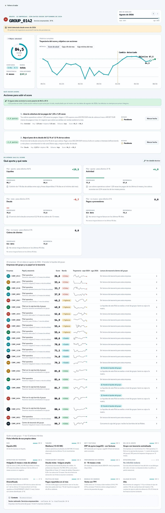
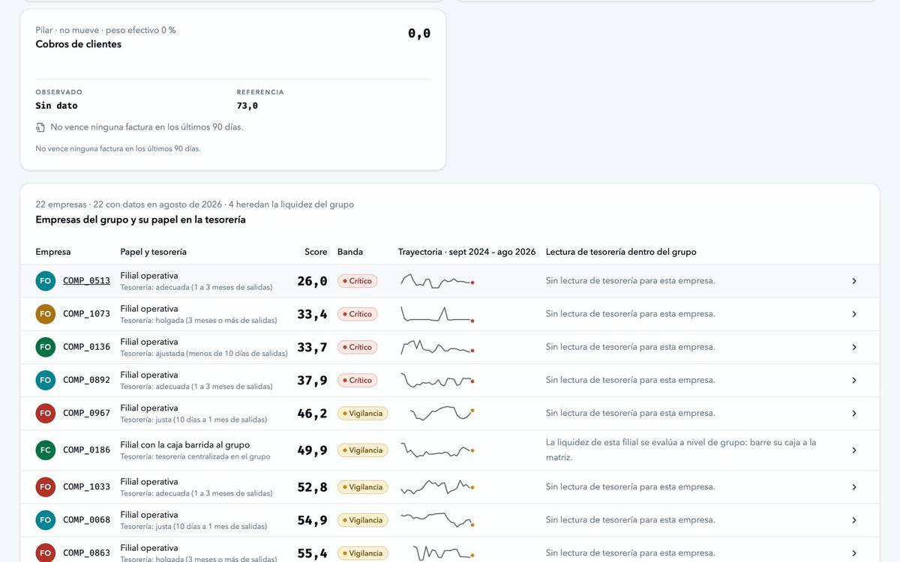

### Ficha inferida de sus propios datos

**Qué es** · Tarjeta (`profile-card.svelte`) que expone los atributos cualitativos y estructurales que el motor ha deducido analizando la transaccionalidad del grupo, sin depender de bases de datos externas.

**Anatomía y lógica** ·
*   **Resumen**: Subtítulo que indica cuántos atributos han podido ser inferidos (valor distinto de `null`) frente al total disponible. Ejemplo: «Quién es este grupo · 11 de 12 atributos inferidos».
*   **Cuadrícula de atributos**: Matriz responsiva (hasta 4 columnas en pantallas grandes) que itera sobre `group.profile`.
    *   *Cabecera del atributo*: Muestra el nombre (`attribute.label`) y un indicador visual de **cobertura** (5 puntos circulares que se rellenan de color `var(--signal)` proporcionalmente al valor `attribute.coverage` de 0 a 1, acompañados del porcentaje formateado sin decimales). El atributo `title` explica: «Cobertura: parte de los datos necesarios que estaba disponible para inferir este atributo».
    *   *Valor*: Texto en negrita (`attribute.value`). Si es `null`, se muestra en gris con el texto «No inferible todavía». Si tiene unidad, se formatea con `formatUnitValue`.
    *   *Evidencia*: Texto menor en gris (`attribute.evidence`) que explica exactamente qué datos llevaron a esa conclusión (ej. «6 de 6 empresas en España.»).
*   **Bloque de Contexto**: Recuadro inferior con borde discontinuo y fondo `bg-muted/30`. Solo aparece si hay datos de industria o *benchmark*.
    *   Lleva la etiqueta «Contexto» (icono `BookOpen`) y un *badge* aclaratorio: «No entra en el score».
    *   Muestra el sector estimado (`context.industry.label`), la confianza de esa clasificación (`formatPercent(context.industry.confidence, 0)`) y la razón (`context.industry.reason`).
    *   Si existe, muestra información de *benchmarks* externos (`context.benchmark.text` y `context.benchmark.source`).

**Estados y variantes** ·
*   **Sin perfil**: Si el array `profile` está vacío, muestra un `EmptyState` con el título «El bundle no trae ficha para esta entidad» y la descripción «La ficha se exporta con el perfil del motor; vuelve a generar el bundle para verla.».

**Fuente** · `src/lib/xray/profile-card.svelte`.

*(Esta sección es visible en la parte inferior de las capturas de grupo completo, como la 054).*

### Estados vacíos y de error

**Qué es** · Pantallas o componentes de sustitución que aparecen cuando no hay datos para mostrar en el contexto solicitado o falla la carga del fichero JSON.

**Estados y variantes** ·
*   **Sin datos en el mes seleccionado**:
    *   *Lógica*: El usuario navega a un mes (vía URL o slider) en el que el grupo aún no existía o ya no reporta datos (`entryAt(entries, monthStore.month)` devuelve `null`).
    *   *Aspecto*: Componente `EmptyState` con el icono `CalendarOff`.
    *   *Textos*: Título «Sin datos de [id] en [mes formateado]». La descripción informa de los límites reales de datos: «El primer cierre observado es [mes] y el último, [mes].».
    *   *Interacción*: Botón «Ir al último cierre» que ejecuta `monthStore.select(lastMonth)`, actualizando la URL y recargando la vista con datos válidos.
*   **Error de carga del grupo**:
    *   *Lógica*: Falla la promesa `loadGroup` en `+page.ts` (el archivo JSON no existe, devuelve 404, o está corrupto). El error se captura y redirige a la página `+error.svelte` genérica de la aplicación.
    *   *Aspecto*: Pantalla completa con el componente `EmptyState`. Icono `FileWarning` en tono `danger`.
    *   *Textos*: Título «No se pudo leer este dato del bundle» (o «Esta página no existe» si es un 404 de ruta). Descripción: Muestra el mensaje de error técnico capturado (ej. «El bundle no contiene groups/GROUP_9999.json»).
    *   *Interacción*: Botón «Volver al radar» que enlaza a la raíz de la aplicación.

**Fuente** · `src/lib/xray/entity-view.svelte`, `src/routes/(app)/group/[id]/+page.ts`, `src/routes/(app)/+error.svelte`.

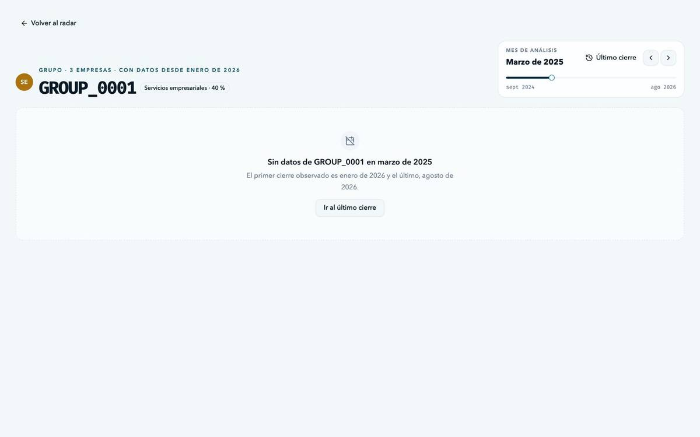
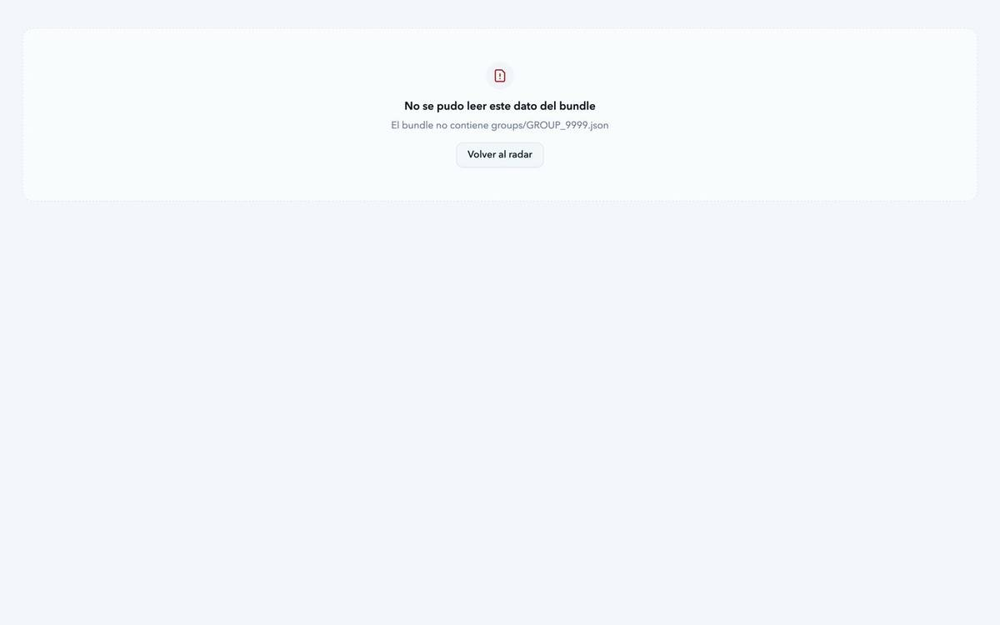

## 11. Página de empresa

### Página de empresa

**Qué es** · **Dónde aparece** · Es la vista de detalle analítico enfocada en una filial o empresa individual. Reside en la ruta canónica `/group/[id]/company/[companyId]` y proporciona el mismo nivel de profundidad diagnóstica que la vista de grupo, pero acotada al perímetro de la entidad específica. 

**Anatomía y diferencias con la página de grupo** · La página delega el renderizado principal en el componente compartido `EntityView` (`frontend/src/lib/xray/entity-view.svelte`), por lo que la estructura visual (tarjeta de score, gráfico de trayectoria, acciones recomendadas, desglose de pilares y ficha inferida) es idéntica a la del grupo. Sin embargo, presenta adaptaciones clave en su contexto y navegación:
*   **Botón de retroceso**: En lugar de volver al radar general, el botón superior izquierdo muestra el texto literal «← Volver a [id del grupo]» (ejemplo: «← Volver a GROUP_0153») y enlaza directamente a la ficha del grupo matriz mediante la función `monthStore.href`, lo que preserva el mes seleccionado en la URL.
*   **Cejilla (Eyebrow)**: Es altamente específica y contextual. Se construye dinámicamente concatenando cuatro elementos: la palabra literal «Empresa», el identificador del grupo matriz («Grupo [id]»), el rol de la empresa en el grupo (`summary.role`) y su clasificación de tesorería (`summary.treasury_class`). El código utiliza `.filter(Boolean).join(' · ')`, por lo que si la empresa carece de rol o clase de tesorería, esos segmentos se omiten limpiamente. Un ejemplo real completo es: «EMPRESA · GRUPO GROUP_0153 · FILIAL OPERATIVA · AJUSTADA (MENOS DE 10 DÍAS DE SALIDAS)».
*   **Enlace técnico**: El botón «Ver detalle técnico» (ubicado sobre la sección de pilares) redirige a la vista técnica enfocada en el grupo matriz (`/?tab=tecnico&focus=[id del grupo]`), ya que la trazabilidad, las evidencias y el recibo de ejecución se evalúan y muestran a nivel consolidado.
*   **Ausencia de tabla de filiales**: Al tratarse del último nivel de desglose, la página no pasa ningún bloque `children` al componente `EntityView`, por lo que no se renderiza la tabla de empresas del grupo que sí aparece en la vista matriz.

**Fuente** · `frontend/src/routes/(app)/group/[id]/company/[companyId]/+page.svelte`, `frontend/src/routes/(app)/group/[id]/company/[companyId]/+page.ts`.

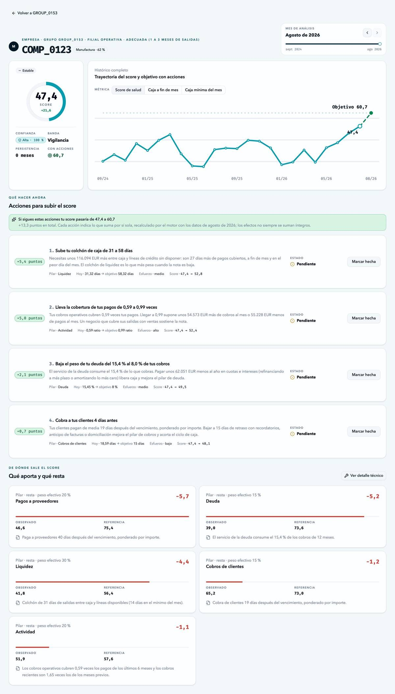

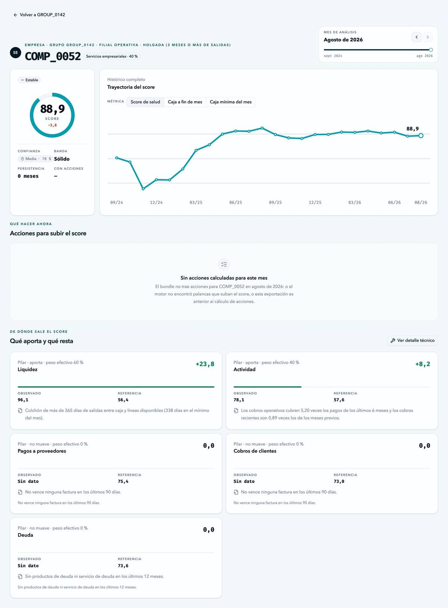

#### Atajo y redirección

**Qué es** · **Cómo funciona** · Para facilitar el acceso directo a una empresa sin necesidad de conocer de antemano a qué grupo pertenece (por ejemplo, desde un enlace externo o un buscador), la aplicación expone la ruta de conveniencia `/company/[id]`.

**Lógica y estados** · El archivo `+page.ts` de esta ruta actúa como un interceptor puro:
1.  Utiliza la función `loadCompany(fetch, params.id)` para buscar el archivo JSON de la empresa en el bundle.
2.  Si lo encuentra, extrae la propiedad `group_id` y ejecuta una redirección HTTP `307 Temporary Redirect` hacia la ruta canónica `${base}/group/${company.group_id}/company/${company.id}${url.search}`, preservando intactos los parámetros de URL (como el mes de análisis `?m=YYYY-MM`).
3.  Durante la fracción de segundo que puede durar la redirección en el cliente, el componente `+page.svelte` renderiza un `EmptyState` con el título «Abriendo la empresa dentro de su grupo».
4.  Si la empresa no existe en el bundle, lanza un error HTTP 404 con el mensaje literal: «Este bundle no incluye el detalle de [id]: abre la empresa desde la página de su grupo.».

**Fuente** · `frontend/src/routes/(app)/company/[id]/+page.ts`, `frontend/src/routes/(app)/company/[id]/+page.svelte`.

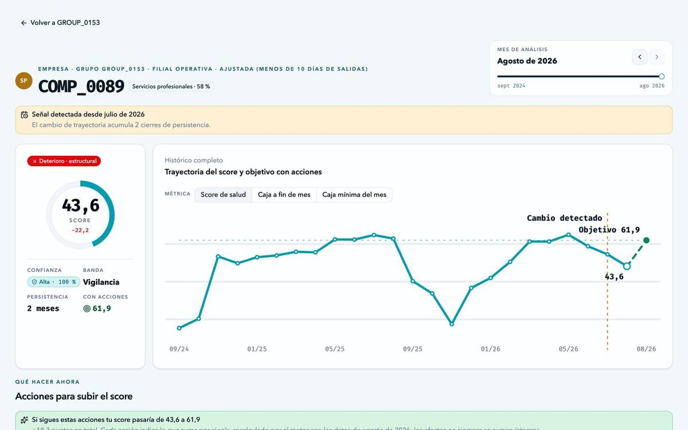

#### Estados de error y ausencia de datos

La página canónica de empresa maneja dos casos excepcionales relacionados con la topología del bundle exportado por el motor:

1.  **Empresa sin detalle en el bundle**: El contrato de datos permite que un bundle se exporte sin la carpeta `companies/` para ahorrar peso, incluyendo a las filiales únicamente en el resumen tabular del grupo (`group.companies`). En este escenario, la promesa `loadCompany` se resuelve como `null`. El componente `+page.svelte` intercepta esta ausencia y, en lugar de renderizar el `EntityView`, muestra un contenedor con el botón de retroceso y un estado vacío (`EmptyState`) con el icono `FileX`.
    *   **Textos literales**: Título «Este bundle no incluye el detalle de [id]», descripción «La exportación trae solo el resumen de la empresa dentro de su grupo. Su score mensual figura en la tabla de empresas del grupo.».
    *   **Interacción**: El botón de retroceso «← Volver a [id del grupo]» se mantiene operativo para permitir al usuario regresar a la vista matriz.

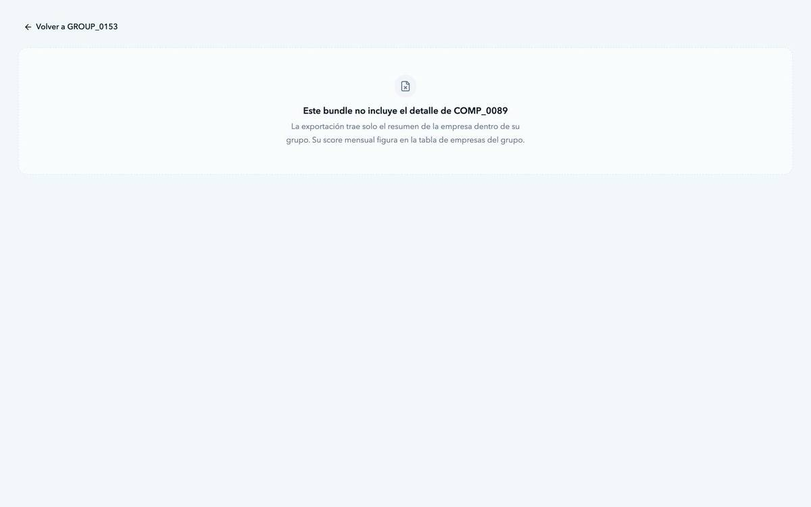

2.  **Empresa fuera del grupo**: Si se intenta acceder a una URL donde el identificador de la empresa (`companyId`) no coincide con ninguna de las filiales listadas en el array `group.companies` del grupo especificado en la ruta, el cargador de la página (`+page.ts`) rechaza la navegación.
    *   **Lógica**: Lanza un error HTTP 404 con el texto literal «La empresa [companyId] no pertenece al grupo [id].». Este error es capturado y renderizado por la página de error genérica de la aplicación (`+error.svelte`), mostrando el icono `FileWarning` en rojo y el botón «Volver al radar».

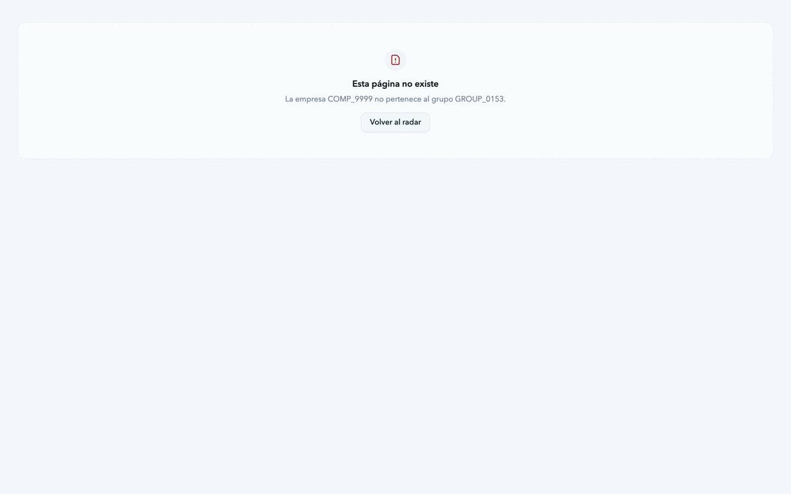

#### Panel de productos de deuda (Financiación contratada)

**Qué es** · **Discrepancia con el código** · El componente `DebtProductsPanel` existe en el código fuente (`frontend/src/lib/xray/debt-products-panel.svelte`) y está diseñado para mostrar los instrumentos de financiación activos. Sin embargo, **el código manda**: este componente es actualmente un elemento huérfano. No se importa ni se instancia en `EntityView`, ni en la página de empresa, ni en la de grupo. Además, los esquemas `CompanyFile` y `GroupFile` del contrato de datos (`contract.ts`) no incluyen ninguna matriz `products` que pueda alimentarlo. Se documenta aquí su anatomía por exhaustividad técnica, ya que forma parte del código base preparado para futuras extensiones del esquema.

**Anatomía** · Se presenta como una tarjeta (`Card.Root`).
*   **Cabecera**: Icono `Landmark` (edificio clásico), título «Financiación contratada» y descripción «Productos de deuda activos en el cierre actual.».
*   **Estado vacío**: Si la lista de productos está vacía, muestra el texto «Sin productos de financiación registrados.» en color gris atenuado.
*   **Lista de productos**: Si hay datos, renderiza una lista (`<ul>`) con separadores (`divide-y`). Cada fila muestra:
    *   El logotipo de la entidad bancaria (``).
    *   El tipo de producto dentro de una pastilla (`Badge` variante `outline`, ej. `type_label`).
    *   El nombre o alias del producto en negrita (`label`).
    *   El nombre del banco en texto secundario (`bank_name`).
    *   Una lista de definiciones (`<dl>`) alineada a la derecha con los importes. Si existe el valor `granted`, muestra «Concedido» y la cifra; si existe `outstanding`, muestra «Pendiente» y la cifra.

**Cómo funciona** · 
*   **Resolución de logotipos**: El componente incluye una constante interna `BANK_DOMAINS` que mapea subcadenas de texto a dominios web reales para 14 entidades: Santander, CaixaBank, BBVA, Banco Sabadell, Bankinter, Banca March, ING, Santander Consumer, Wizink, Evo Banco, Unicaja, Kutxabank, Abanca e Ibercaja.
*   **Lógica de imagen**: La función `resolveBank` normaliza el nombre del banco a minúsculas y busca coincidencias. Si no encuentra ninguna, usa el dominio de respaldo `example.com`. La URL de la imagen se construye llamando al servicio de favicons de Google (`https://www.google.com/s2/favicons?domain=[dominio]&sz=32`). Si la carga de la imagen falla, un evento `onerror` oculta el elemento (`target.style.display = 'none'`) para evitar mostrar un recuadro roto.
*   **Formato numérico**: Los importes monetarios se formatean utilizando la función `formatEuroCompact`, que abrevia cifras grandes (ej. «180 k€», «1,2 M€»).
*   **Fuente**: `frontend/src/lib/xray/debt-products-panel.svelte`.

# III. Estados y formatos

## 12. Estados vacíos, errores y carga

### Componentes base de retroalimentación

La aplicación, al ser una SPA estática que lee ficheros JSON exportados por el motor, gestiona la ausencia de datos, los tiempos de red y los errores de contrato mediante un sistema unificado de componentes de retroalimentación.

#### EmptyState (`empty-state.svelte`)
**Qué es** · El componente universal para representar estados vacíos, búsquedas sin resultados o errores de lectura de ficheros específicos.
**Dónde aparece** · En cualquier vista, tarjeta o tabla donde falten los datos esperados o la interacción del usuario devuelva un conjunto vacío.
**Anatomía** · Contenedor centrado con borde discontinuo (`border-dashed`) y fondo translúcido (`bg-card/60`). Incluye un icono circular, un título en negrita, una descripción opcional en gris y un espacio para botones de acción (`children`).
**Estados y variantes** · 
- `tone`: Define el color del icono y su fondo (`neutral`, `success`, `danger`, `warning`, `signal`). Se mapea mediante los diccionarios `TONE_TEXT` y `TONE_DOT` de `src/lib/xray/tones.ts`.
- `compact`: Si es `true`, reduce el relleno (`px-4 py-6` y `gap-2`) para encajar dentro de tarjetas o tablas; si es `false`, usa el tamaño holgado para páginas completas (`px-6 py-12` y `gap-3`).
**Fuente** · `src/lib/xray/empty-state.svelte`.

#### AbstainedState (`abstained-state.svelte`)
**Qué es** · Una alerta destacada que explica por qué el motor no ha emitido un veredicto para una entidad en un mes concreto.
**Dónde aparece** · En la cabecera de las vistas de Diagnóstico, Escenarios y Desglose técnico cuando la propiedad `entry.abstain` del mes evaluado no es nula.
**Anatomía** · Usa el componente `Alert.Root` con fondo y bordes amarillos (`border-[var(--warning)]/40 bg-[var(--warning-soft)]`). Muestra el icono de pausa (`PauseCircle`), el título por defecto «El motor se abstiene este mes», la razón traducida y la acción necesaria para desbloquearlo (precedida por el icono `KeyRound`).
**Cómo funciona** · Lee `abstain.reason` y busca su texto en el diccionario del manifiesto mediante `glossaryText(page.data.manifest, 'reasons', abstain.reason)`. Muestra la propiedad `abstain.unlock` procesada por la función `humanizeMonths` para formatear las fechas que el motor devuelve en formato `YYYY-MM` a texto natural (ej. «septiembre de 2026»).
**Fuente** · `src/lib/xray/abstained-state.svelte`.

#### FocusFrame (`focus-frame.svelte`)
**Qué es** · Un enrutador de estados interno para las vistas que dependen de la carga asíncrona de un grupo específico (Diagnóstico, Escenarios, Técnico).
**Cómo funciona** · Recibe un objeto `FocusState` que determina qué renderizar:
- `ready`: Si el grupo está cargado, busca el mes seleccionado mediante `entryAt(focus.group.months, monthStore.month)`. Si el mes existe, renderiza el contenido (`children`); si no, muestra un `EmptyState` indicando la falta de datos temporales.
- `loading`: Muestra los esqueletos de carga.
- `error`: Muestra un `EmptyState` con el mensaje de error de la promesa rechazada.
- `idle`: Muestra un `EmptyState` pidiendo al usuario que seleccione un grupo.
**Fuente** · `src/lib/xray/focus-frame.svelte`.

### Estados de carga (Skeletons)

Dado que la aplicación carga ficheros JSON bajo demanda (grupos, empresas, evidencias), utiliza esqueletos animados (`Skeleton` con la clase `animate-pulse` y fondo `bg-accent`) para mantener la estructura visual mientras se resuelven las promesas de red (`fetch`).

- **Carga de grupo (FocusFrame)**: Muestra una cuadrícula de dos columnas (`lg:grid-cols-[17rem_1fr]`) con dos bloques grises de altura `h-72`.
- **Carga de acciones globales (ActionsView)**: Muestra tres bloques rectangulares apilados de altura `h-28`.
- **Carga de evidencias (EvidenceTable)**: Muestra cinco líneas horizontales apiladas de altura `h-8 w-full`.
- **Carga de alertas y recibo (TechnicalView)**: Muestra un bloque grande de altura `h-72` mientras se descargan y parsean `alerts.json` o `receipt.json`.

*(Nota: La captura `074-diagnostico-error-cargando-grupo.jpg` muestra visualmente el estado `ready` con los datos cargados correctamente, lo que demuestra que el sistema se recupera de fallos transitorios o que la captura documenta el éxito posterior a una carga).*

### Errores globales y de enrutamiento

La gestión de errores de red o de incumplimiento de contrato de datos recae sobre la clase `BundleError` (`src/lib/xray/bundle.ts`), que clasifica los fallos en `missing` (código 404), `invalid` (fallo de validación del esquema Zod) o `network` (código 500 o fallo de red). Estos errores son capturados por el enrutador de SvelteKit y renderizados en páginas de error dedicadas.

#### Error raíz (`+error.svelte` en la raíz)
**Qué es** · La página de error de nivel superior. Captura fallos críticos al cargar el `manifest.json` (sin el cual la aplicación no puede arrancar) o navegaciones a rutas completamente inexistentes fuera del contexto de la app.
**Lógica y textos literales** ·
- **Si `page.status === 404`**: Muestra un `EmptyState` con el icono `SearchX`. Título: «Esta página no existe». Descripción: «La dirección no corresponde a ninguna pantalla. La cartera de grupos es el punto de entrada a todo lo demás.». Botón: «Ir a la cartera» (navega a `base/`).
- **Si es fallo de bundle (ej. 500)**: Muestra un `EmptyState` con el icono `FileWarning` y tono `danger`. Título: «No se pudo cargar el bundle de datos». Descripción: Compone el mensaje del error (`page.error?.message`) seguido de «La aplicación solo muestra lo que exporta el motor en /data/v1; sin ese bundle no hay nada que enseñar.». Botón: «Reintentar» (ejecuta `window.location.reload()`).

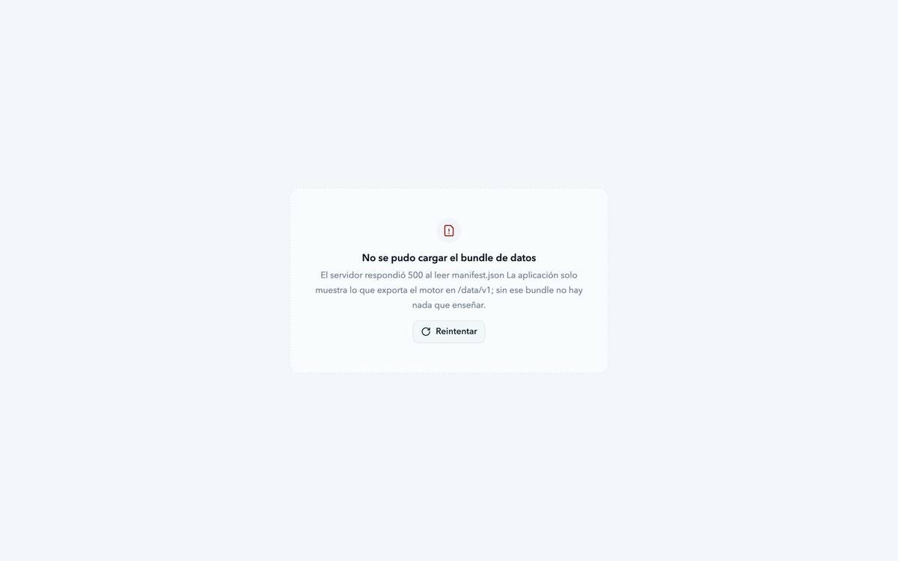

#### Error de aplicación (`(app)/+error.svelte`)
**Qué es** · Captura errores de carga de datos dentro de la interfaz de la aplicación, manteniendo el layout principal intacto. Ocurre al intentar acceder a un fichero JSON de grupo o empresa que no existe en el bundle.
**Lógica y textos literales** · Usa un `EmptyState` con el icono `FileWarning` y tono `danger`.
- **Si `page.status === 404`**: Título «Esta página no existe».
- **Otros errores (`BundleError`)**: Título «No se pudo leer este dato del bundle». La descripción inyecta el mensaje exacto del error (ej. «El bundle no contiene groups/GROUP_9999.json»).
- **Interacción**: Botón «Volver al radar» que navega a la raíz manteniendo el mes seleccionado mediante `monthStore.href('/')`.

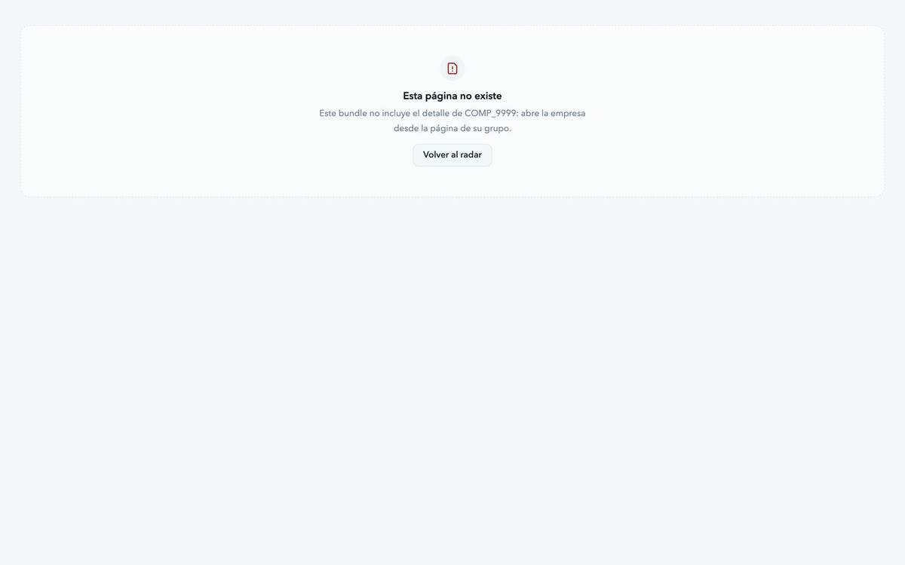

#### Error de pertenencia de empresa (`group/[id]/company/[companyId]/+page.ts`)
**Qué es** · Un error 404 forzado desde el servidor/cliente si se intenta acceder a una empresa que existe en el bundle, pero que no pertenece al grupo indicado en la URL.
**Lógica y textos literales** · Lanza un `error(404)` con el mensaje: «La empresa [COMP_ID] no pertenece al grupo [GROUP_ID].», que es capturado y renderizado por `(app)/+error.svelte`.

### Estados vacíos por pantalla

#### Radar financiero (`radar-view.svelte`)
- **Búsqueda sin resultados**: Se dispara cuando el filtro de texto (`query`) no coincide con el ID, sector o país de ningún grupo en la tabla (`filtered.length === 0`).
  - **Textos**: Título «Ningún grupo coincide con la búsqueda». Descripción: «Prueba con otro identificador, sector o país.».
  - **Visual**: `EmptyState` con variante `compact` e icono `SearchX`.

#### Vistas de Entidad (Grupo / Empresa)
- **Mes sin datos (`focus-frame.svelte` / `entity-view.svelte`)**: Se dispara cuando el mes seleccionado en el `monthStore` no tiene un registro correspondiente en el array `months` de la entidad cargada.
  - **Textos**: Título compuesto con variables: «Sin datos de [ID] en [formatPeriod(monthStore.month)]». Descripción: «El primer cierre observado es [formatPeriod(firstMonth)] y el último, [formatPeriod(lastMonth)].» (o variaciones similares en `focus-frame`).
  - **Interacción**: Botón «Ir al último cierre» que ejecuta `monthStore.select(lastMonth)`.
  - **Visual**: `EmptyState` con icono `CalendarOff`.

- **Empresa sin fichero de detalle (`group/[id]/company/[companyId]/+page.svelte`)**: Se dispara cuando la promesa `loadCompany` devuelve `null` (el bundle no incluye la carpeta `companies/`), pero la empresa sí figura en el resumen del grupo.
  - **Textos**: Título «Este bundle no incluye el detalle de [ID]». Descripción: «La exportación trae solo el resumen de la empresa dentro de su grupo. Su score mensual figura en la tabla de empresas del grupo.».
  - **Interacción**: Botón «Volver a [Grupo]» que navega a la ruta del grupo matriz.
  - **Visual**: `EmptyState` con icono `FileX`.

- **Ficha inferida vacía (`profile-card.svelte`)**: Se dispara si el array `profile` de la entidad está vacío.
  - **Textos**: Título «El bundle no trae ficha para esta entidad». Descripción: «La ficha se exporta con el perfil del motor; vuelve a generar el bundle para verla.».
  - **Visual**: `EmptyState` con variante `compact`.

- **Desglose de empresas vacío (`company-drilldown.svelte`)**: Se dispara si el array `companies` del grupo está vacío (`rows.length === 0`).
  - **Textos**: Título «El bundle no lista empresas para este grupo». Descripción: «El desglose aparece cuando la exportación incluye los miembros del grupo.».
  - **Visual**: `EmptyState` con variante `compact`.

#### Escenarios y Acciones
- **Sin acciones en Escenarios (`scenario-view.svelte`)**: Se dispara si el array `actions` devuelto por `entryActions(entry)` está vacío.
  - **Textos**: Título «Sin acciones con las que construir un escenario». Descripción: «El bundle no trae acciones para [ID] en [formatPeriod(entry.month)]. El laboratorio solo usa mejoras recalculadas por el motor: no inventa palancas ni resultados.».
  - **Visual**: `EmptyState` con icono `ListChecks`.

- **Sin acciones en Entidad (`entity-actions.svelte`)**: Se dispara si `actions.length === 0` o el objetivo calculado es `null`.
  - **Textos**: Título «Sin acciones calculadas para este mes». Descripción: «El bundle no trae acciones para [ID] en [formatPeriod(entry.month)]: o el motor no encontró palancas que suban el score, o esta exportación es anterior al cálculo de acciones.».
  - **Visual**: `EmptyState` con icono `ListChecks`.

- **Sin acciones en Centro Global (`actions-view.svelte`)**: Se dispara si tras leer los grupos con peor score, el array resultante `top` está vacío.
  - **Textos**: Título «Sin acciones calculadas para este mes». Descripción: «Los grupos leídos no traen acciones en este cierre: o el motor no encontró palancas que suban el score, o esta exportación es anterior al cálculo de acciones.».
  - **Visual**: `EmptyState` con icono `ListChecks`.
  - **Error parcial de lectura**: Si algunas promesas de `loadGroup` fallan, muestra un `Alert.Root` destructivo con el título «[formatNumber(status.failed)] grupos no se pudieron leer» y la descripción «Sus acciones no figuran en esta lista.».

#### Detalle Técnico: Desglose y Evidencias (`evidence-table.svelte`)
Este componente gestiona cuatro estados de excepción distintos basados en la resolución de `loadEvidence`:

1. **Fichero no encontrado (`status.state === 'missing'`)**: Lanza un `BundleError` de tipo `missing`.
   - **Textos**: Título «Este bundle no incluye evidencias de esta entidad». Descripción: «Las filas de evidencia se exportan por entidad; el score y los pilares de arriba no dependen de este fichero.».
   - **Visual**: `EmptyState` compacto con icono `FileX`.
2. **Error de lectura (`status.state === 'error'`)**: Falla el parseo Zod o la red.
   - **Textos**: Título «No se pudieron leer las evidencias». Descripción: Muestra el mensaje exacto del error (`status.message`).
   - **Visual**: `EmptyState` compacto con icono `FileWarning` y tono `danger`.
3. **Mes no cubierto por el fichero (`rows === null`)**: El fichero existe, pero no tiene entrada para el mes seleccionado.
   - **Textos**: Título «Sin evidencias exportadas para [formatPeriod(month)]». Si el fichero tiene otros meses (`covered.length > 0`), la descripción es «El bundle guarda las evidencias de [formatPeriod(covered[0])] a [formatPeriod(covered[covered.length - 1])].» y muestra un botón «Ir a [formatPeriod(último_mes)]» que ejecuta `monthStore.select()`. Si está totalmente vacío, la descripción es «El fichero de evidencias de esta entidad está vacío.».
   - **Visual**: `EmptyState` compacto con icono `CalendarOff`.
4. **Mes con array vacío (`rows.length === 0`)**: El mes existe pero no contiene filas.
   - **Textos**: Título «Ningún dato agregado este mes». Descripción: «El motor no exportó filas de evidencia para este cierre.».
   - **Visual**: `EmptyState` compacto con icono `FileSearch`.

#### Detalle Técnico: Alertas (`alerts-inbox.svelte`)
La bandeja de alertas gestiona estados vacíos complejos dependiendo de la pestaña activa (`tab`), el alcance temporal (`scope`) y los filtros aplicados (`filtered`).

- **Pestaña sin alertas (`listed.length === 0`)**: Se dispara cuando la combinación de estado y filtros no devuelve resultados.
  - **Título dinámico**: Depende de la pestaña activa (`TAB[key].empty`), añadiendo « en [formatPeriod(month)]» si el alcance es mensual.
    - `fired`: «El motor no disparó ninguna alerta»
    - `suppressed`: «El motor no silenció ninguna alerta»
    - `abstained`: «Ninguna alerta quedó sin disparar por abstención»
  - **Descripción y botones dinámicos** (evaluados en orden):
    1. Si hay alertas en la pestaña pero todas están descartadas por el usuario (`inTab.length > 0`): Descripción «Todas las alertas activas de este periodo están descartadas en este navegador.». Botón «Ver descartadas» (activa `showDismissed = true`).
    2. Si hay filtros activos (`filtered` es `true`): Descripción «Ninguna alerta coincide con los filtros. Límpialos o amplía el periodo.». Botón «Limpiar filtros» con icono `FilterX` (ejecuta `clearFilters()`).
    3. Si el alcance es mensual (`scope === 'month'`): Descripción «Elige otro mes en la línea temporal o amplía la bandeja a todo el histórico.». Botón «Ver todo el histórico» (cambia `scope` a `'history'`).
    4. Por defecto: Descripción «El bundle no contiene alertas en este estado.».
  - **Botones de salto**: Además de la acción principal, renderiza botones secundarios para saltar a otras pestañas que sí tengan datos: «[TAB[state].label] · [formatNumber(counts[state])]».
  - **Visual**: `EmptyState` con el icono correspondiente a la pestaña (`BellRing`, `BellOff`, `PauseCircle`).

#### Detalle Técnico: Recibo (`receipt-view.svelte`)
El recibo audita la ejecución y muestra estados vacíos o de error si las validaciones o señales no están presentes.

- **Recibo de otra ejecución (`!sameRun`)**: Se dispara si `engine_version`, `params_hash` o `dataset_hash` no coinciden exactamente con los del `manifest.json`.
  - **Textos**: Título «El recibo no corresponde a este bundle». Descripción: «La versión del motor o las huellas del recibo no coinciden con las del manifiesto: estas pruebas describen otra ejecución.».
  - **Visual**: Componente `Alert.Root` con variante `destructive` e icono `TriangleAlert`.
- **Sin pruebas de validación (`receipt.checks.length === 0`)**:
  - **Textos**: Título «Este bundle se exportó sin ejecutar la validación». Descripción: «Ejecuta la batería de pruebas del motor y vuelve a exportar: aquí aparecerá una tarjeta por prueba, con su resultado y sus medidas.».
  - **Visual**: `EmptyState` con icono `FlaskConical`.
- **Sin señales con peso (`weighted.length === 0`)**:
  - **Textos**: Título «Ninguna señal con peso». Descripción: «El recibo de esta exportación no declara los pesos del score.».
  - **Visual**: `EmptyState` compacto con icono `Scale`.
- **Sin señales descartadas (`unweighted.length === 0`)**:
  - **Textos**: Título «Ninguna señal con peso 0». Descripción: «Todas las señales que declara el motor entran en el score.».
  - **Visual**: `EmptyState` compacto con icono `Ban`.
- **Sin abstenciones (`abstentions.length === 0`)**:
  - **Textos**: Título «Sin abstenciones». Descripción: «El motor emite veredicto para todas las entidades en el último cierre de esta exportación.».
  - **Visual**: `EmptyState` compacto con icono `CircleCheck` y tono `success`.

### Tabla resumen de estados de excepción

| Contexto / Pantalla | Condición | Componente visual | Texto principal / Comportamiento |
| :--- | :--- | :--- | :--- |
| **Global** | Falla carga de `manifest.json` | `+error.svelte` (raíz) | «No se pudo cargar el bundle de datos» + Botón «Reintentar». |
| **Global** | Ruta inexistente (404) | `+error.svelte` (raíz) | «Esta página no existe» + Botón «Ir a la cartera». |
| **App** | Falla carga de JSON de entidad | `+error.svelte` (app) | «No se pudo leer este dato del bundle» + Ruta del fichero. |
| **App** | Empresa no pertenece al grupo | `+error.svelte` (app) | «La empresa [X] no pertenece al grupo [Y].» |
| **Cualquier vista** | Carga de datos en curso | `Skeleton` | Bloques grises con animación de pulso (`animate-pulse`). |
| **Radar** | Búsqueda sin coincidencias | `EmptyState` | «Ningún grupo coincide con la búsqueda». |
| **Entidad (Grupo/Empresa)** | Mes seleccionado sin datos | `EmptyState` | «Sin datos de [ID] en [Mes]» + Botón al último cierre. |
| **Empresa (Ruta directa)** | Falta carpeta `companies/` | `EmptyState` | «Este bundle no incluye el detalle de [ID]» + Botón al grupo. |
| **Diagnóstico / Escenarios** | Motor no emite veredicto | `AbstainedState` | Alerta amarilla: «El motor se abstiene este mes» + Motivo. |
| **Escenarios / Acciones** | Sin acciones en el JSON | `EmptyState` | «Sin acciones con las que construir un escenario / calculadas». |
| **Técnico > Evidencias** | Fichero `evidence` no existe | `EmptyState` | «Este bundle no incluye evidencias de esta entidad». |
| **Técnico > Evidencias** | Mes sin evidencias | `EmptyState` | «Sin evidencias exportadas para [Mes]». |
| **Técnico > Alertas** | Filtros muy restrictivos | `EmptyState` | «Ninguna alerta coincide con los filtros.» + Botones dinámicos. |
| **Técnico > Recibo** | Hashes no coinciden | `Alert` (Destructive) | «El recibo no corresponde a este bundle». |
| **Técnico > Recibo** | Sin validaciones ejecutadas | `EmptyState` | «Este bundle se exportó sin ejecutar la validación». |

## 13. Adaptación a tablet y móvil

### Principios de diseño responsivo y puntos de ruptura

La interfaz de Embat X-Ray está construida bajo un enfoque *mobile-first* utilizando las utilidades de Tailwind CSS. La adaptación a diferentes tamaños de pantalla no depende de redirecciones ni de vistas separadas, sino de una reorganización fluida del DOM basada en *media queries* estándar y *container queries* para componentes aislados. El código fuente (`frontend/src/lib/xray/`) y las primitivas de interfaz (`frontend/src/lib/components/ui/`) dictan el comportamiento exacto.

Los puntos de ruptura (*breakpoints*) clave que determinan los cambios estructurales son:
- **`sm` (640 px):** Transición de elementos compactos en móvil. Oculta textos en pestañas para dejar solo iconos (`hidden sm:inline`) y muestra elementos secundarios como la pastilla del *bundle* (`hidden sm:flex`).
- **`md` (768 px):** Punto de inflexión para la visualización de datos tabulares. Por debajo de este ancho, las tablas HTML nativas se ocultan (`hidden md:block`) y se transforman en listas de tarjetas apiladas (`divide-y md:hidden`). También reorganiza el gráfico de cascada (`md:grid-cols-[15rem_1fr_4.5rem_5rem]`).
- **`lg` (1024 px - Tablet):** Punto de ruptura principal para el *layout* global. A partir de aquí se muestra la barra lateral izquierda (`lg:block`) y se habilitan las cuadrículas de dos columnas para el contenido principal (`lg:grid-cols-2`, `lg:grid-cols-[17rem_1fr]`).
- **`xl` (1280 px) y `2xl` (1536 px):** Expansión de cuadrículas en monitores grandes, como el desglose técnico (`xl:grid-cols-[minmax(0,6fr)_minmax(0,5fr)]`) o las tarjetas de pruebas del recibo (`2xl:grid-cols-3`).
- **`@container` (Container queries):** Utilizados en componentes reutilizables para que su diseño dependa del espacio disponible en su contenedor padre y no del ancho total de la ventana. Se aplica en `evidence-table.svelte` (`@2xl:block`), `company-drilldown.svelte` (`@4xl:block`) y `profile-card.svelte` (`@lg:grid-cols-2 @4xl:grid-cols-3 @6xl:grid-cols-4`).

---

### Navegación global y estructura base (Shell)

La estructura principal de la aplicación (`xray-dashboard.svelte`) sufre una transformación radical entre la vista de escritorio/tablet y la vista móvil.

#### Vista en Tablet (1024 px)
En 1024 px, la aplicación mantiene el paradigma de escritorio. La barra lateral izquierda (`<aside>`) está visible (`class="hidden min-h-[calc(100vh-4rem)] border-r px-3 py-6 lg:block"`), ocupando un ancho fijo dentro de la cuadrícula principal (`lg:grid-cols-[13rem_1fr]`). 
- Muestra la etiqueta «WORKSPACE», el título «Cartera de {manifest.counts.groups} grupos» y el mes activo formateado con `formatPeriod(monthStore.month)`.
- Las pestañas de navegación se renderizan verticalmente (`orientation="vertical"`).
- El pie muestra el estado del motor (`manifest.engine_version`) y los *hashes* truncados con `shortHash(manifest.params_hash, 8)`.
- La cabecera superior muestra el logotipo completo, el buscador global (con el *placeholder* «Buscar grupo o sector») y, en el extremo derecho, la pastilla identificadora del *bundle* con el texto «Bundle {shortHash(manifest.bundle_id, 8)}» (`hidden sm:flex`).

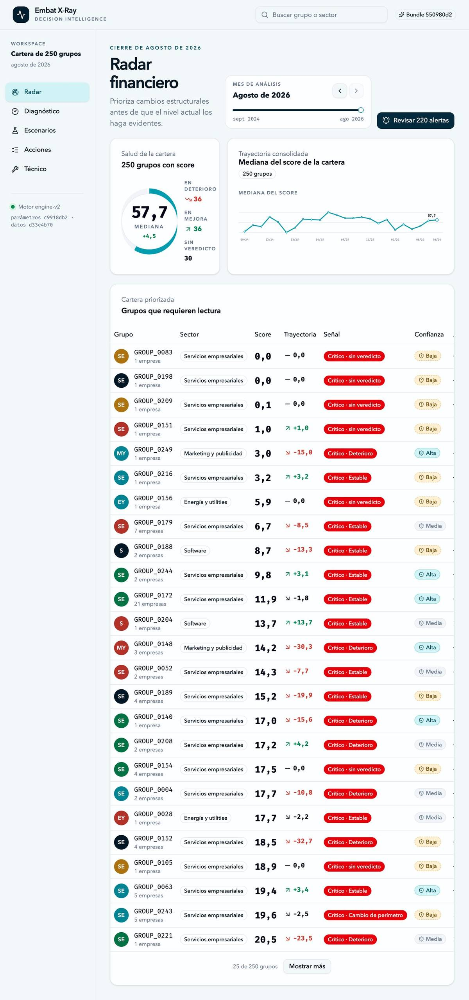

#### Vista en Móvil (390 px)
Al descender de los 1024 px (`< lg`), la barra lateral desaparece por completo. Para mantener la navegación entre los módulos, el menú se transforma en una barra horizontal de iconos situada inmediatamente debajo de la cabecera (`<Tabs.List class="mb-6 grid h-auto grid-cols-5 lg:hidden">`).
- Las etiquetas de texto de las pestañas desaparecen (`{tab.label}`), dejando únicamente los iconos de `lucide-svelte` (Radar, CircleGauge, FlaskConical, ListChecks, Wrench).
- La pastilla del *bundle* en la cabecera se oculta (`hidden sm:flex`) para maximizar el espacio del buscador.
- El buscador global reduce su ancho pero mantiene su funcionalidad. Al recibir el foco (`onfocus`), si hay coincidencias (`matches.length > 0`), despliega los resultados en una capa flotante (`<ul role="listbox">`) que superpone la tabla principal. Cada resultado muestra el identificador (`row.id`), el sector (`row.group.industry ?? 'Sin sector'`) y el score formateado (`formatScore(row.shown)`). Al pulsar *Enter* o hacer clic en un resultado, se ejecuta `openGroup(row.id)`, actualizando la URL y la vista.

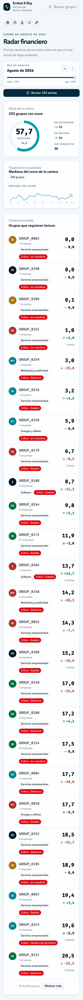

---

### Radar financiero

La pantalla principal de entrada (`radar-view.svelte`) adapta su densidad de información según el dispositivo.

#### Comportamiento en Tablet (1024 px)
La cabecera mantiene el título «Radar financiero» y el selector temporal (`MonthSlider`) alineados. Las tarjetas de métricas superiores se disponen en una cuadrícula de tres columnas (`md:grid-cols-3`):
- «Salud de la cartera» ocupa una columna (`md:col-span-1`), mostrando el gráfico radial con la mediana (`summary.median / 10`) y el desglose de estados («EN DETERIORO», «EN MEJORA», «SIN VEREDICTO») calculados mediante `summarize(rows)`.
- «Trayectoria consolidada» ocupa dos columnas (`md:col-span-2`), mostrando el gráfico de líneas con el histórico de medianas (`trajectory`).
- La lista de grupos se renderiza como una tabla HTML nativa (`
` con `<Table.Root>`).

#### Comportamiento en Móvil (390 px)
- **Tarjetas de métricas:** La cuadrícula colapsa a una sola columna. La tarjeta de «Salud de la cartera» se apila sobre la de «Trayectoria consolidada».
- **Tabla a tarjetas:** La tabla HTML desaparece. En su lugar, se renderiza una lista de elementos `<a>` separados por bordes (`
`). Cada fila se convierte en una tarjeta interactiva con `href={href(row)}`.
- **Anatomía de la tarjeta móvil:** Apila a la izquierda el avatar (`CompanyAvatar`), el identificador (`row.id`), el conteo de empresas pluralizado («{formatNumber(row.group.n_companies)} {row.group.n_companies === 1 ? 'empresa' : 'empresas'}»), el sector (`row.group.industry`) y la pastilla de señal (`signal(row)`). A la derecha, alinea el *score* (`formatScore(row.shown)`), la trayectoria (`formatScoreDelta(row.delta)`) y, si aplica, el conteo de alertas («{formatNumber(row.fired)} {row.fired === 1 ? 'alerta' : 'alertas'}»).

---

### Vistas de Grupo y Empresa

Las pantallas de detalle de entidad (`entity-view.svelte`) comparten una estructura que se adapta progresivamente mediante *container queries* y *media queries*.

#### Comportamiento en Tablet (1024 px)
- **Cabecera (Hero):** El componente `EntityHero` utiliza una cuadrícula de dos columnas (`lg:grid-cols-[17rem_1fr]`). A la izquierda se sitúa el medidor radial del score actual (`formatScore(entry.shown / 10)`) y la cuadrícula 2x2 de métricas (Confianza, Banda, Persistencia, Con acciones). A la derecha, el gráfico de trayectoria histórica (`TrajectoryChart`).
- **Desglose de empresas (`CompanyDrilldown`):** Al tener suficiente ancho (`@4xl:block`), se muestra la tabla detallada (`<Table.Root>`) con las columnas de empresa, papel (`company.role ?? 'Sin papel inferido'`), score, banda, *sparkline* de trayectoria y lectura de tesorería. Si una empresa hereda liquidez (`company.inherits_liquidity`), se muestra la pastilla «Hereda la liquidez del grupo».
- **Ficha inferida (`ProfileCard`):** Los atributos se distribuyen en tres columnas (`@4xl:grid-cols-3`), mostrando el nivel de cobertura (5 puntos calculados con `Math.round(attribute.coverage * 5)`), el valor (`formatUnitValue(attribute.value)`) y la evidencia textual.

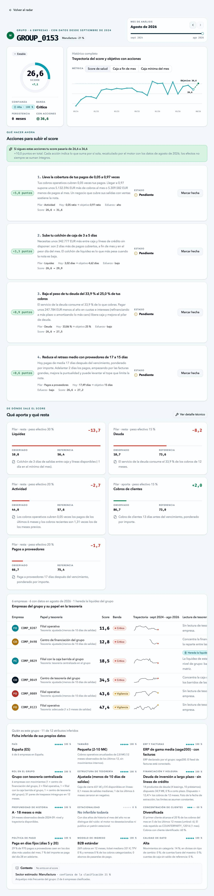
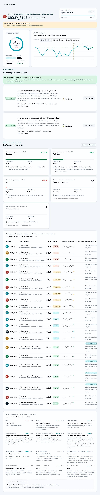
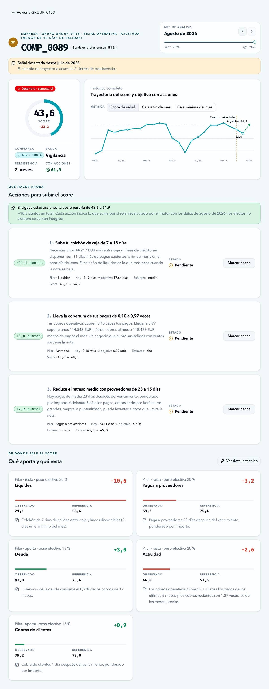

#### Comportamiento en Móvil (390 px)
- **Cabecera (Hero):** La cuadrícula colapsa. El medidor radial del score se sitúa en la parte superior, ocupando todo el ancho, y el gráfico de trayectoria pasa a la parte inferior.
- **Desglose de empresas:** La tabla se oculta y entra en acción la vista de lista (`<ul class="divide-y @4xl:hidden">`). Cada empresa se muestra como un bloque apilado donde el avatar y el rol están a la izquierda, y el *sparkline* junto al score se alinean a la derecha.
- **Ficha inferida:** La cuadrícula de atributos colapsa a una sola columna, listando los 12 atributos uno debajo del otro.
- **Casos límite:** Si el grupo no tiene empresas listadas en el *bundle*, se muestra el `EmptyState` con el texto «El bundle no lista empresas para este grupo». Si no hay ficha inferida, se muestra «El bundle no trae ficha para esta entidad».

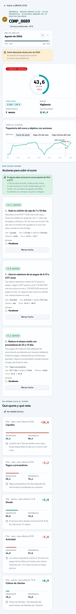

---

### Diagnóstico explicable

La vista que desglosa los pilares del score (`diagnosis-view.svelte` y `pillar-drivers.svelte`) adapta su cuadrícula principal para mantener la legibilidad de las barras de impacto.

- **Tablet (1024 px):** Las tarjetas de los cinco pilares se distribuyen en una cuadrícula de dos columnas (`lg:grid-cols-2`). Cada tarjeta muestra el impacto (`formatScoreDelta(driver.contrib)`), el peso efectivo (`formatPercent(driver.w_eff, 0)`), y la barra de progreso cuyo color depende de si el impacto es negativo (`driver.contrib < 0`).
- **Móvil (390 px):** La cuadrícula pasa a una sola columna. Las tarjetas de los pilares se apilan verticalmente. Si el motor se abstiene, se muestra el componente `AbstainedState` con el texto «El motor se abstiene este mes» y la razón extraída del glosario (`glossaryText(manifest, 'reasons', abstain.reason)`).

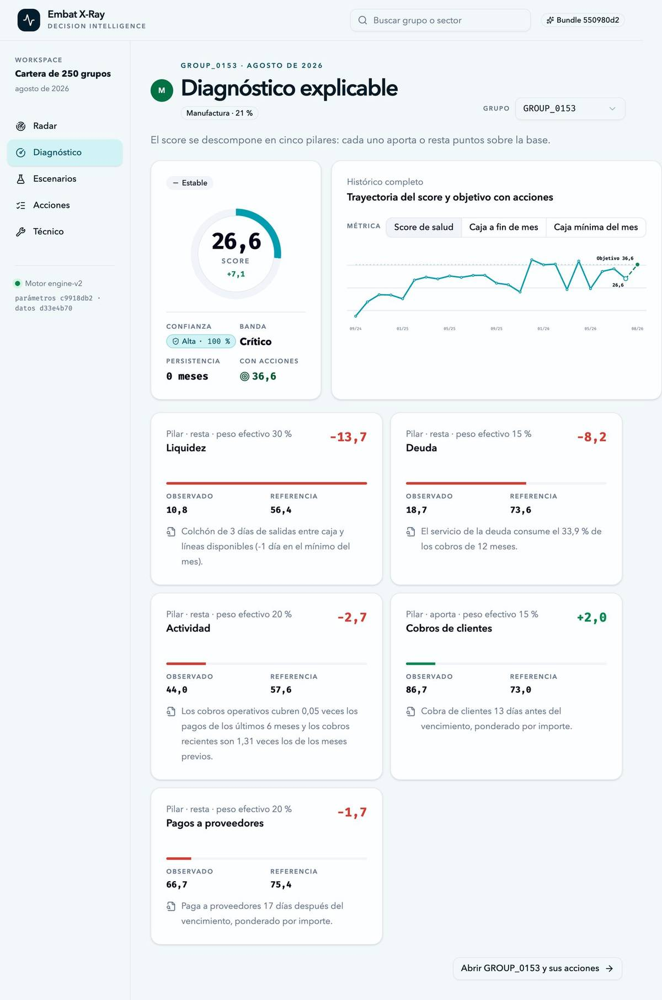
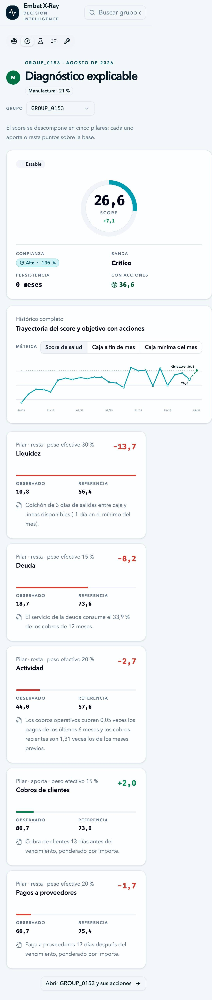

---

### Laboratorio de escenarios

El simulador interactivo (`scenario-view.svelte`) requiere una reorganización drástica para mantener la usabilidad de los controles (*checkboxes*) y la visualización del impacto en tiempo real.

- **Tablet (1024 px):** Se utiliza una cuadrícula asimétrica (`lg:grid-cols-[24rem_1fr]`). La columna izquierda contiene la lista de palancas interactivas. Al marcar una casilla (`selected.has(action.id)`), se actualiza el estado local. La columna derecha, más ancha, muestra el impacto estimado calculado mediante `projectedTenths(entry, selected)`, actualizando los dos medidores radiales (Observado → Estimado) y dibujando la proyección en el gráfico de evolución.
- **Móvil (390 px):** La cuadrícula colapsa. El panel de selección de palancas aparece primero. Inmediatamente debajo se apila la tarjeta de impacto estimado. Si el *bundle* no trae acciones para el mes, se muestra el `EmptyState` con el texto «Sin acciones con las que construir un escenario».

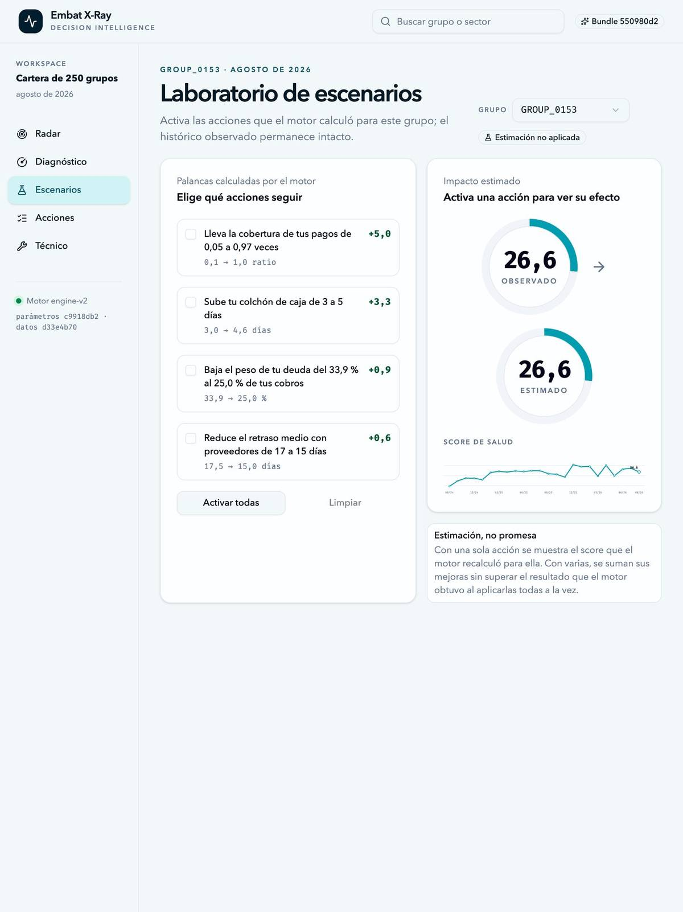
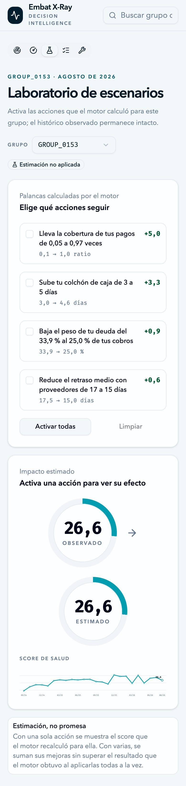

---

### Centro de acciones

El listado de recomendaciones operativas (`actions-view.svelte` y `action-list.svelte`) cambia la anatomía de sus tarjetas para evitar el desbordamiento horizontal.

- **Tablet (1024 px):** Cada tarjeta de acción se comporta como una fila de tabla (`lg:grid-cols-[auto_1fr_12rem_auto] lg:items-center`). De izquierda a derecha: la pastilla de impacto (`formatScoreDelta(action.uplift_tenths)`), el bloque de texto («{index + 1}. {action.title}»), los metadatos, el estado y el botón de acción que ejecuta `actionState.toggle(item.entityId, action.id)`.
- **Móvil (390 px):** La disposición en fila se rompe. La pastilla de impacto se sitúa en la esquina superior izquierda. El título y la descripción ocupan todo el ancho. Los metadatos (Grupo, Pilar, Hoy, Esfuerzo, Score) fluyen en línea. El estado y el botón («Marcar hecha» o «Reabrir» si `done` es verdadero) se desplazan a la parte inferior de la tarjeta, ocupando todo el ancho disponible.

---

### Detalle técnico: Desglose y evidencias

Esta pestaña (`technical-view.svelte` > `desglose`) contiene el gráfico de cascada (*waterfall*) y la tabla de evidencias.

- **Tablet (1024 px):** El diseño base es `xl:grid-cols-[minmax(0,6fr)_minmax(0,5fr)]`. Al estar en 1024 px (por debajo de `xl`), la cuadrícula principal colapsa a una columna: el gráfico de cascada ocupa el ancho total en la parte superior, y las tarjetas de confianza y evidencias se apilan debajo. El gráfico de cascada (`contribution-waterfall.svelte`) mantiene su estructura tabular interna (`md:grid-cols-[15rem_1fr_4.5rem_5rem]`), mostrando las barras visuales calculadas con `position(tick)`. La tabla de evidencias (`evidence-table.svelte`) se muestra como tabla HTML (`@2xl:block`).
- **Móvil (390 px):** El gráfico de cascada simplifica su estructura interna a `grid-cols-[1fr_auto]`. Las barras visuales y las columnas de «Puntos» y «Acumulado» se ocultan, mostrando únicamente el nombre del paso, la descripción y el valor final a la derecha (`formatScore(row.end)` o `formatScoreDelta(row.delta)`). La tabla de evidencias utiliza *container queries* (`@2xl:hidden`): la tabla HTML desaparece y se transforma en una lista vertical donde cada fila muestra el nombre del dato, el valor formateado (`formatRatio` o `formatUnitValue`), y debajo en texto gris el periodo (`formatEvidencePeriod`), el fichero de origen y el número de filas.

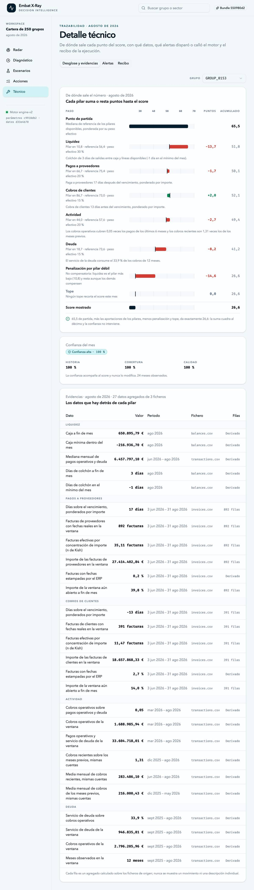
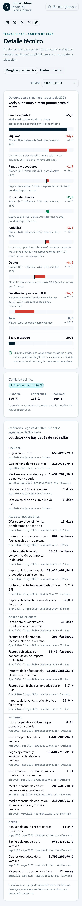

---

### Detalle técnico: Bandeja de alertas

La gestión de alertas (`alerts-inbox.svelte` y `alert-card.svelte`) adapta sus filtros, KPIs y el listado de tarjetas.

- **Tablet (1024 px):** Las cuatro tarjetas de KPIs (Activas, Silenciadas, Abstenciones, Sin revisar) se muestran en una fila (`lg:grid-cols-4`). El gráfico de barras apiladas ocupa todo el ancho.
- **Móvil (390 px):** 
  - Las tarjetas de KPIs colapsan a una cuadrícula de 2x2 (`grid-cols-2`). Los valores se calculan con `formatNumber(counts[key])`.
  - Las pestañas de estado (Activas, Silenciadas, Abstenciones) pasan de ser una fila horizontal a ajustarse al ancho disponible, permitiendo *scroll* horizontal si es necesario (`sm:inline-flex sm:w-fit`).
  - Las tarjetas de alerta individuales apilan su contenido: las pastillas de estado y el título van arriba, la descripción en el centro, los botones de triaje («Marcar como vista», «Descartar», «Restaurar») debajo, y la caja gris con la entidad y el score (`formatScore(alert.shown)`) se sitúa al fondo de la tarjeta.
  - **Casos límite:** Si no hay alertas tras aplicar filtros, se muestra el `EmptyState` con el texto «Ninguna alerta coincide con los filtros. Límpialos o amplía el periodo.».

---

### Detalle técnico: Recibo

El recibo de ejecución (`receipt-view.svelte`) reorganiza sus bloques de validación y auditoría.

- **Tablet (1024 px):** La cabecera explicativa y la tarjeta «Huella de esta ejecución» se sitúan lado a lado (`lg:grid-cols-[minmax(0,1fr)_minmax(0,26rem)]`). Las tarjetas de señales ponderadas y excluidas se muestran en dos columnas (`lg:grid-cols-2`). Las tarjetas de pruebas sin etiquetas se distribuyen en `lg:grid-cols-2 2xl:grid-cols-3`.
- **Móvil (390 px):** Todo el contenido se apila en una única columna. La tarjeta de la huella criptográfica (mostrando `receipt.engine_version`, `receipt.params_hash`, `receipt.dataset_hash`) pasa a estar debajo del texto introductorio. Las listas de señales (las que entran en el número con `formatPercent(signal.weight, 0)` y las que no) se muestran una debajo de la otra. Las tablas de abstenciones mantienen su formato de acordeón (`expanded[block.reason]`), pero ajustan el ancho de la columna «Qué lo desbloquea».

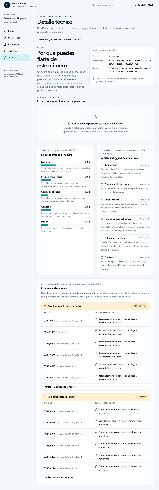

---

### Páginas de Error (404 y Bundle Missing)

Las pantallas de error (`+error.svelte` a nivel de ruta y a nivel raíz) utilizan el componente `EmptyState` para garantizar una presentación consistente.
- Tanto en **Tablet (1024 px)** como en **Móvil (390 px)**, el comportamiento es idéntico: el contenedor se centra vertical y horizontalmente en la pantalla (`grid min-h-screen place-items-center`). 
- En móvil, los márgenes laterales (`px-4` o `p-6`) aseguran que el texto no toque los bordes, pero la estructura interna (icono, título, descripción, botón) se mantiene en una sola columna centrada.
- **Textos exactos:** Si la ruta no existe (404), muestra «Esta página no existe» y el botón «Ir a la cartera» o «Volver al radar». Si falla la carga del *bundle*, muestra «No se pudo cargar el bundle de datos» con el botón «Reintentar» que ejecuta `window.location.reload()`. Si falla la carga de una entidad específica, muestra «No se pudo leer este dato del bundle».

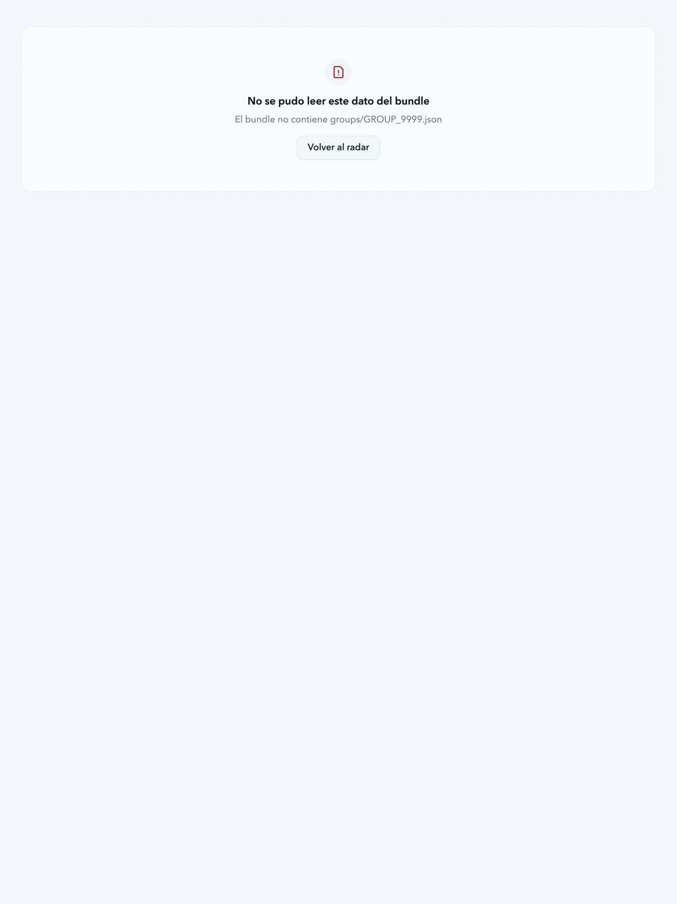
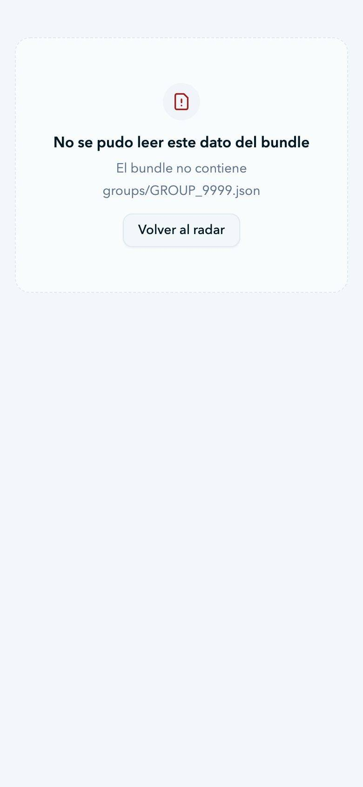

# IV. Piezas

## 14. Catálogo de componentes de dominio (I)

### abstained-state.svelte

**Qué es** · Componente de alerta visual que informa al usuario de que el motor analítico no ha emitido un veredicto (score) para la entidad en el mes seleccionado, explicando el motivo exacto y la acción correctiva necesaria para recuperar la lectura.

**Dónde aparece** · Se inyecta dinámicamente en la vista de Diagnóstico (`diagnosis-view.svelte`), en el Laboratorio de escenarios (`scenario-view.svelte`), en el Desglose técnico (`technical-view.svelte`) y en las fichas individuales de Grupo y Empresa (`entity-view.svelte`) siempre que la propiedad `abstain` del mes evaluado no sea nula.

**Anatomía** · Utiliza el componente base `Alert.Root` con un tono de advertencia personalizado (`warning`).
*   **Contenedor:** Fondo amarillo/crema suave (`bg-[var(--warning-soft)]`) y borde ámbar (`border-[var(--warning)]/40`).
*   **Icono:** `PauseCircle` (pausa) en color ámbar/marrón oscuro.
*   **Título:** Texto en negrita, por defecto «El motor se abstiene este mes» (`<Alert.Title>{title}</Alert.Title>`).
*   **Descripción:** Dos párrafos en `<Alert.Description>`. El primero expone la causa técnica traducida a lenguaje natural (`
{reason}
`). El segundo, precedido por un icono de llave (`KeyRound`) en color ámbar fuerte (`text-[var(--warning-strong)]`), indica en negrita «Qué lo desbloquea:» seguido de la instrucción exacta para resolverlo.

**Cómo funciona** · Recibe el objeto `abstain` del bundle. Traduce el código de la razón (`abstain.reason`) a lenguaje natural consultando el diccionario `reasons` del `manifest.json` mediante la función `glossaryText`. Formatea cualquier mes mencionado en la instrucción de desbloqueo usando la función `humanizeMonths` (ej. convierte "2026-08" en "agosto de 2026"). El contenedor recibe el atributo `data-abstain={abstain.reason}` para facilitar pruebas automatizadas.

**Props**

| Propiedad | Tipo | Descripción |
| :--- | :--- | :--- |
| `abstain` | `{ reason: string; unlock: string }` | Objeto del bundle con el código del motivo y el texto de desbloqueo. |
| `title` | `string` | Título de la alerta (opcional, por defecto «El motor se abstiene este mes»). |
| `class` | `string` | Clases CSS adicionales para el contenedor raíz. |

**Fuente** · `src/lib/xray/abstained-state.svelte`

### action-list.svelte

**Qué es** · Lista renderizada de tarjetas de acciones recomendadas (palancas operativas) que el motor sugiere para mejorar la salud financiera de una entidad, ordenadas por impacto.

**Dónde aparece** · En el «Centro de acciones» global (`actions-view.svelte`) y en el bloque «Qué hacer ahora» de las fichas de entidad (`entity-actions.svelte`).

**Anatomía** · Un contenedor de cuadrícula (`grid gap-3`) que itera sobre una lista de acciones. Cada tarjeta (`Card.Root`) presenta un diseño responsivo (`lg:grid-cols-[auto_1fr_12rem_auto]`) con cuatro bloques:
*   **Insignia de impacto:** Pastilla verde (`Badge variant="outline"`) en la columna izquierda indicando los puntos que suma, formateados con `formatScoreDelta` (ej. «+22,5 puntos»).
*   **Cuerpo central:** 
    *   Título en negrita con el índice numerado: `{index + 1}.{action.title}`.
    *   Párrafo descriptivo (`action.detail`) en texto secundario, si existe.
    *   Fila de metadatos (`text-xs`): Muestra condicionalmente el Grupo (con enlace si hay `item.href`), el Pilar (traducido con `pillarLabel`), la métrica actual vs. objetivo («Hoy · X → objetivo Y»), el nivel de esfuerzo («Esfuerzo · alto/medio/bajo») y la proyección del score («Score · X → Y»).
*   **Columna de estado:** Etiqueta «Estado» y un indicador visual con texto: icono `Check` verde si está hecha, o `CircleDot` amarillo si está pendiente.
*   **Botón de acción:** Botón secundario (`Button variant="outline"`) para alternar el estado.

**Cómo funciona** · Itera sobre el array `items`. Para cada elemento, consulta el estado global reactivo `actionState.isDone(item.entityId, action.id)` para determinar si la acción ha sido marcada como completada en el navegador actual. El botón de la derecha ejecuta `actionState.toggle(item.entityId, action.id)`, lo que actualiza la interfaz de forma inmediata. Los valores numéricos de las métricas se formatean dinámicamente con la función local `quantity`, que respeta los decimales solo si el número no es entero y añade la unidad si existe.

**Props**

| Propiedad | Tipo | Descripción |
| :--- | :--- | :--- |
| `items` | `ActionItem[]` | Array de acciones a renderizar. Cada `ActionItem` incluye `entityId`, `href` (opcional), `shown` (score actual en décimas) y el objeto `action` del contrato. |

**Fuente** · `src/lib/xray/action-list.svelte`

### action-state.svelte.ts

**Qué es** · Módulo de estado global reactivo (Svelte 5) que gestiona el triaje local de las acciones recomendadas, recordando cuáles han sido marcadas como "hechas" o "pendientes" por el analista.

**Cómo funciona** · Instancia la clase `ActionState` como un singleton. 
*   **Inicialización:** Al cargarse en el navegador (`if (!browser) return`), lee la clave `xray.actions.done.v1` de `localStorage`. Si existe y es un array válido, carga los identificadores en un `SvelteSet` reactivo. Si el almacenamiento es ilegible o está vacío, captura el error silenciosamente y comienza con un conjunto vacío (todo pendiente).
*   **Identificadores:** La clave única de cada acción se compone concatenando el ID de la entidad y el ID de la acción (`entityId:actionId`).
*   **Mutación:** Al llamar a `toggle()`, añade o elimina la clave del *set* y persiste inmediatamente el array resultante en `localStorage` mediante `JSON.stringify`. Si el almacenamiento está bloqueado (ej. modo incógnito estricto) o lleno, el `catch` ignora el error y el estado se mantiene en memoria durante la sesión actual.

**Exportaciones**

| Exportación | Tipo | Descripción |
| :--- | :--- | :--- |
| `actionState` | `ActionState` | Instancia singleton del gestor de estado de acciones. Expone los métodos `isDone(entityId, actionId)` y `toggle(entityId, actionId)`. |

**Fuente** · `src/lib/xray/action-state.svelte.ts`

### actions-view.svelte

**Qué es** · Pantalla principal del «Centro de acciones», accesible desde la pestaña «Acciones» de la navegación global. Agrupa, calcula y prioriza las mejores palancas operativas de toda la cartera para el mes seleccionado.

**Dónde aparece** · Se renderiza dentro de `xray-dashboard.svelte` cuando la pestaña activa es `acciones`.

**Anatomía** · 
*   **Cabecera:** Epígrafe «Seguimiento operativo · {mes}», título «Centro de acciones» y descripción «Las acciones que más puntos de score devuelven en la cartera, con el grupo al que pertenecen.».
*   **Estados de carga:** Mientras resuelve las promesas, muestra tres esqueletos (`Skeleton class="h-28"`).
*   **Banner de resumen:** Alerta azul (`bg-[var(--signal-soft)]`) con icono de campana (`BellRing`). Título: «{X} acciones · {Y} hechas». Descripción: «Se han leído los {Z} grupos con menor score del mes y se ordenan sus acciones por puntos ganados. El estado hecha / pendiente se guarda solo en este navegador.».
*   **Alerta de error:** (Condicional) Si falla la carga de algún grupo, muestra una alerta roja (`variant="destructive"`) con icono `FileWarning`: «{X} grupos no se pudieron leer. Sus acciones no figuran en esta lista.».
*   **Contenido:** Renderiza `ActionList` con las acciones priorizadas. Si el array resultante está vacío, muestra un `EmptyState` con el icono `ListChecks`: «Sin acciones calculadas para este mes» y la explicación «Los grupos leídos no traen acciones en este cierre: o el motor no encontró palancas que suban el score, o esta exportación es anterior al cálculo de acciones.».

**Cómo funciona** · Es una vista asíncrona y optimizada. Al montarse o al cambiar el mes (`monthStore.month`), selecciona únicamente los 40 grupos con menor score de la cartera (`GROUPS_READ = 40`) para acotar la descarga de red. Lanza promesas concurrentes (`Promise.allSettled`) para cargar los ficheros JSON de esos grupos mediante `loadGroup`. Por cada grupo cargado con éxito, extrae las acciones del mes activo usando `entryActions`, les añade el contexto de la entidad (incluyendo el enlace a la ficha del grupo) y las acumula. Finalmente, ordena todas las acciones recolectadas por su impacto (`uplift_tenths` descendente) y recorta el array para mostrar solo las 30 mejores (`ACTIONS_SHOWN = 30`). Cuenta reactivamente cuántas de estas acciones top están marcadas como hechas consultando `actionState`.

**Props**

| Propiedad | Tipo | Descripción |
| :--- | :--- | :--- |
| `rows` | `PortfolioRow[]` | Filas de la cartera ya ordenadas por score ascendente (los peores primero), inyectadas desde el dashboard. |

**Fuente** · `src/lib/xray/actions-view.svelte`

### actions.ts

**Qué es** · Módulo de funciones puras que encapsula la aritmética de estimación y proyección de escenarios (What-If) sobre las acciones exportadas por el motor.

**Cómo funciona** · Ninguna función de este fichero modela el score ni inventa datos; se limitan a operar sobre los incrementos (`uplift_tenths`) y objetivos (`new_score_tenths`) que el motor ya ha precalculado y escrito en el bundle. Si un mes no tiene acciones (`actions` es `undefined`), se trata como un plan vacío.

**Exportaciones**

| Exportación | Firma | Descripción |
| :--- | :--- | :--- |
| `entryActions` | `(entry) => EntityAction[]` | Devuelve las acciones del mes ordenadas de mayor a menor impacto (`b.uplift_tenths - a.uplift_tenths`). Devuelve `[]` si el bundle no trae acciones. |
| `fullPlanTenths` | `(entry) => number \| null` | Devuelve el score proyectado si se aplican *todas* las acciones. Si el motor exportó una combinación (`actions_combined`), devuelve `new_score`. Si no, devuelve el máximo `new_score_tenths` de las acciones individuales. Devuelve `null` si no hay acciones. |
| `projectedTenths` | `(entry, selected) => number` | Estima el score para un subconjunto de acciones seleccionadas (`ReadonlySet<string>`). Si se selecciona una, devuelve su `new_score_tenths`. Si se seleccionan varias, suma sus incrementos (`sum`), pero topa el resultado (`Math.max(ceiling, 0)`) para que nunca supere el incremento combinado máximo dictado por el motor (`actions_combined.uplift`). Garantiza que el resultado final nunca exceda los 1000 puntos (`Math.min(1000, ...)`). |

**Fuente** · `src/lib/xray/actions.ts`

### alert-card.svelte

**Qué es** · Tarjeta individual que representa una alerta disparada, silenciada o en abstención dentro de las listas de la bandeja de alertas.

**Dónde aparece** · En la vista de la bandeja de alertas (`alerts-inbox.svelte`).

**Anatomía** ·
*   **Cabecera de estado:** Fila de pastillas (badges) que indican el estado de la alerta.
    *   Estado principal: Usa `STATE_LABEL` (Activa, Silenciada, Abstención) y `STATE_ICON` (`BellRing`, `BellOff`, `PauseCircle`), coloreado mediante `ALERT_STATE_TONE`.
    *   Tipo de alerta: `{#if ALERT_KIND_TEXT[alert.kind] !== alert.title}` muestra un badge secundario con el tipo original si el título ha sido sobrescrito.
    *   Triaje local: `{#if triage === 'seen'}` muestra un badge gris «Vista» con icono `Check`. `{#if triage === 'dismissed'}` muestra «Descartada» con icono `EyeOff`.
*   **Cuerpo:** Título de la alerta en negrita (`alert.title`) y descripción detallada (`alert.detail`) formateada con `humanizeMonths` para convertir fechas "YYYY-MM" en texto legible.
*   **Bloque de silenciamiento/abstención:** `{#if muted}` (es decir, si hay `suppressed_by`), muestra una caja con borde lateral de color (amarillo para abstención, gris para silenciada).
    *   Muestra el motivo traducido: `{alert.state === 'abstained' ? 'No se dispara' : 'Silenciada'}: {glossaryText(manifest, 'reasons', muted.reason)}`.
    *   Añade una explicación didáctica (`explanation`) si el motivo es `perimeter_change` ("En {mes} se conectó una empresa o una cuenta nueva...") o `abstention` ("Con estos datos el motor no sostiene un veredicto...").
    *   Muestra la ventana temporal (`windowText`): "desde {mes}" o "{mes_inicio} – {mes_fin}".
    *   `{#if alert.state === 'abstained' && standing}`: Si la entidad sigue en abstención en el último cierre, muestra un aviso con icono de llave (`KeyRound`): «Sigue en abstención en {mes}. Qué la desbloquea: {unlock}». Si ya no lo está (`standingKnown`), avisa: «En {mes}, el último cierre, la entidad ya no está en abstención.».
*   **Botonera de triaje:** `{#if alert.state === 'fired' && onTriage}` muestra botones fantasma (`variant="ghost" size="sm"`). Si está descartada, muestra «Restaurar» (`RotateCcw`). Si no, muestra «Marcar como vista/no vista» (`Eye` / `EyeOff`) y «Descartar» (`X`).
*   **Enlace a entidad:** Bloque inferior interactivo (`<a href={href}>`) con fondo gris al *hover*. Muestra el tipo de entidad («Grupo» o «Empresa»), el identificador (`alert.entity_id`), un subtítulo de contexto (`scoreCaption`), el score formateado (`ScoreCell`) y un chevron de navegación (`ChevronRight`).

**Cómo funciona** · La tarjeta es puramente presentacional pero contiene lógica de derivación compleja para los textos explicativos (`explanation`, `windowText`, `scoreCaption`). Si la alerta está descartada (`triage === 'dismissed'`), todo el contenedor raíz reduce su opacidad (`opacity-60`).

**Props**

| Propiedad | Tipo | Descripción |
| :--- | :--- | :--- |
| `alert` | `Alert` | Objeto de alerta del contrato. |
| `manifest` | `Manifest` | Manifiesto del bundle (para leer el glosario de motivos). |
| `standing` | `Abstention \| null` | (Opcional) Registro de abstención vigente en el último cierre para esta entidad. |
| `standingKnown` | `boolean` | (Opcional) Indica si se pudo leer el recibo para saber si la abstención sigue vigente. |
| `triage` | `Triage \| null` | (Opcional) Estado de triaje local de esta alerta (`seen`, `dismissed` o `null`). |
| `onTriage` | `(value) => void` | (Opcional) Callback que se ejecuta al pulsar los botones de triaje. |

**Fuente** · `src/lib/xray/alert-card.svelte`

### alert-state.svelte.ts

**Qué es** · Módulo de estado global reactivo (Svelte 5) que gestiona el triaje local de la bandeja de alertas (marcar como vista o descartar).

**Cómo funciona** · Es una nota exclusiva del analista que se guarda en el `localStorage` del navegador bajo la clave `xray:alert-triage:v1`. Nunca altera los datos exportados por el motor. 
*   **Inicialización:** Al llamar a `init()`, si está en el navegador y no se ha inicializado, lee el almacenamiento, lo parsea validando que los valores sean estrictamente `'seen'` o `'dismissed'` (ignorando basura), y se suscribe al evento `storage` de `window` para sincronizar el estado en tiempo real si el usuario tiene varias pestañas abiertas.
*   **Mutación:** El método `set(id, value)` actualiza el estado reactivo `#marks` y llama a `#save()`. Si el objeto queda vacío, elimina la clave del `localStorage` para no dejar rastro. Si el almacenamiento está bloqueado (ej. modo privado), el `catch` ignora el error y el triaje sigue funcionando en memoria durante la visita.
*   **Consultas:** Expone `get(id)` para leer una marca, `count(ids, value)` para contar cuántas alertas de un array tienen una marca específica, y `pending(ids)` para contar cuántas no tienen ninguna marca.

**Exportaciones**

| Exportación | Tipo | Descripción |
| :--- | :--- | :--- |
| `Triage` | `type` | Unión de literales: `'seen' \| 'dismissed'`. |
| `TRIAGE_STORAGE_KEY` | `string` | Clave usada en `localStorage` (`'xray:alert-triage:v1'`). |
| `alertTriage` | `AlertTriage` | Instancia singleton. Métodos: `init()`, `get(id)`, `set(id, value)`, `count(ids, value)`, `pending(ids)`, `reset(ids)`. |

**Fuente** · `src/lib/xray/alert-state.svelte.ts`

### alerts-inbox.svelte

**Qué es** · Vista completa y compleja de la «Bandeja de alertas». Permite explorar, filtrar, analizar temporalmente y triar todas las alertas generadas por el motor en la cartera.

**Dónde aparece** · Es el contenido principal de la pestaña «Alertas» dentro de la vista «Técnico» (`technical-view.svelte`).

**Anatomía** ·
*   **Cabecera y alcance:** Epígrafe «Bandeja de alertas», título «Alertas» y un párrafo dinámico (`lead`) que resume la actividad del motor. A la derecha, un selector segmentado (`ToggleGroup`) para elegir entre «Todo el histórico» o «Solo el mes de análisis». Si se elige el mes, inyecta el componente `MonthSlider`.
*   **Barra de filtros:** Buscador de texto (`Input type="search"`), selector de tipo de entidad (Todo, Grupos, Empresas) y desplegable de tipo de alerta (`Select.Root`). Si hay filtros activos, muestra un botón fantasma «Limpiar filtros» (`FilterX`).
*   **Tarjetas KPI:** Cuatro componentes `StatTile` que muestran los recuentos de Activas, Silenciadas, Abstenciones y Sin revisar. Actúan como botones para cambiar la pestaña activa (`tab`).
*   **Línea temporal:** Tarjeta que contiene el componente `AlertsTimeline` (gráfico de barras apiladas por mes).
*   **Pestañas y listado:** Pestañas (`Tabs.Root`) para alternar entre los estados de alerta. Si hay alertas descartadas en la pestaña "Activas", muestra un botón *toggle* «Ver descartadas · {X}» (`EyeOff`). El listado agrupa las alertas por mes (`groupByMonth`) y renderiza componentes `AlertCard`.
*   **Paginación:** Incluye paginación local («Mostrar más») con un tamaño de página de 40 elementos (`PAGE_SIZE`). Muestra el texto «Mostrando {limit} de {total}».
*   **Pie de abstenciones:** En la pestaña de abstenciones, añade un texto explicativo con un enlace hacia la pestaña del recibo: «El recibo lista todas las entidades en abstención en el último cierre...».

**Cómo funciona** · 
*   **URL Params:** Lee los parámetros de la URL al inicializarse: `?ver=mes` activa el scope mensual, `?estado=` fuerza una pestaña, `?q=` pre-rellena el buscador. La función `firstTab()` decide inteligentemente qué pestaña abrir si no se especifica (la primera que tenga alertas).
*   **Filtros en cascada:** Aplica filtros de forma reactiva: primero texto/tipo/entidad (`matching`), luego alcance temporal (`scoped`). Calcula los contadores (`counts`) y la línea temporal (`timeline`).
*   **Textos dinámicos:** El párrafo `lead` se construye lógicamente. Si no hay alertas: "En {periodo} el motor no evaluó ninguna alerta...". Si disparó todas: "...y las disparó todas: ninguna quedó silenciada ni en abstención.". Si hubo silenciamientos: "...disparó X y dejó sin disparar Y (Z %): A silenciadas y B en abstención. Las que no se disparan también se enseñan...". Los `hints` de los KPI también son dinámicos, extrayendo el motivo de silenciamiento más común usando `reasonHint`.
*   **Triaje:** Sincroniza el estado de triaje con `alertTriage.init()`. Filtra las alertas descartadas de la vista principal a menos que `showDismissed` sea `true`.

**Props**

| Propiedad | Tipo | Descripción |
| :--- | :--- | :--- |
| `alerts` | `Alert[]` | Array completo de alertas del fichero `alerts.json`. |
| `manifest` | `Manifest` | Manifiesto del bundle. |
| `abstentions` | `Abstention[] \| null` | Lista de abstenciones vigentes leídas del recibo (opcional, para inyectar en `AlertCard`). |

**Fuente** · `src/lib/xray/alerts-inbox.svelte`

### alerts-timeline.svelte

**Qué es** · Gráfico interactivo de barras apiladas que visualiza la distribución mensual de alertas según su estado (Activas, Silenciadas, Abstenciones) a lo largo de toda la ventana temporal del bundle.

**Dónde aparece** · En la sección central de la bandeja de alertas (`alerts-inbox.svelte`).

**Anatomía** ·
*   **Leyenda y accesibilidad:** `<figcaption>` con texto descriptivo dinámico a la izquierda (actualizado al hacer *hover* o foco) y tres elementos de leyenda a la derecha indicando el color de cada estado (Rojo para activas, Gris para silenciadas, Mostaza para abstenciones).
*   **Gráfico de barras:** Contenedor flexible (`flex items-end`) donde cada mes es un botón (`<button>`). Cada botón contiene hasta tres segmentos (``) coloreados mediante `TONE_COLOR[ALERT_STATE_TONE[state]]`.
*   **Eje X:** Etiquetas de meses en la parte inferior, formateadas con `formatAxisMonth` (ej. «08/26»). Para evitar solapamientos, la función `labelled(index)` decide qué meses llevan etiqueta: el primero, el último, y los meses de enero (`endsWith('-01')`), además del mes actualmente seleccionado.

**Cómo funciona** · Recibe un array de conteos mensuales (`MonthlyAlertCount[]`). Calcula el pico máximo (`peak`) para establecer la escala vertical. La altura de cada segmento se calcula en píxeles mediante la función `segment(count)`: `Math.max(3, (count / peak) * PLOT_HEIGHT)`, garantizando un mínimo de 3px para que los valores pequeños (ej. 1 alerta silenciada) sean siempre visibles y clicables. Cada barra es interactiva: al hacer *hover* o *focus*, actualiza el estado `hovered` que cambia el texto del `figcaption` (anunciado por lectores de pantalla gracias a `aria-live="polite"`); al hacer clic, emite el evento `onSelect` con el mes correspondiente.

**Props**

| Propiedad | Tipo | Descripción |
| :--- | :--- | :--- |
| `counts` | `MonthlyAlertCount[]` | Array con los totales por estado para cada mes de la ventana. |
| `selected` | `string \| null` | Mes actualmente seleccionado/resaltado (opcional). |
| `onSelect` | `(month: string) => void` | Callback al hacer clic en una columna. |
| `class` | `string` | Clases CSS adicionales. |

**Fuente** · `src/lib/xray/alerts-timeline.svelte`

### alerts.ts

**Qué es** · Módulo de funciones puras y utilidades de filtrado, agrupación y conteo para la bandeja de alertas. Toda la lógica opera en memoria sobre el array estático extraído de `alerts.json`.

**Cómo funciona** · 
*   `filterAlerts` normaliza el texto de búsqueda (sin tildes, minúsculas) y busca coincidencias parciales tanto en `entity_id` como en `group_id`.
*   `sortAlerts` establece un orden determinista estricto: mes más reciente primero (`b.month.localeCompare(a.month)`), luego por grupo, luego empresas frente a grupos, y finalmente por ID de alerta.
*   `monthlyCounts` construye la serie temporal para el gráfico iterando sobre `manifest.months`, garantizando una entrada por cada mes del bundle incluso si el motor no generó ninguna alerta en ese mes (rellenando con ceros).

**Exportaciones**

| Exportación | Firma / Tipo | Descripción |
| :--- | :--- | :--- |
| `AlertScope` | `type` | `'history' \| 'month'`. |
| `AlertEntityFilter` | `type` | `'all' \| 'group' \| 'company'`. |
| `AlertKindFilter` | `type` | `'all' \| AlertKind`. |
| `filterAlerts` | `(alerts, filters) => Alert[]` | Filtra alertas por texto, tipo de alerta y tipo de entidad. |
| `inScope` | `(alerts, scope, month) => Alert[]` | Acota el array de alertas a un mes específico si el scope es `'month'`. |
| `countByState` | `(alerts) => Record<AlertState, number>` | Devuelve un objeto con el conteo exacto de alertas en estado `fired`, `suppressed` y `abstained`. |
| `sortAlerts` | `(alerts) => Alert[]` | Ordena alertas para su visualización en lista. |
| `groupByMonth` | `(alerts) => { month, alerts }[]` | Agrupa un array de alertas (previamente ordenado) en bloques contiguos por mes. |
| `monthlyCounts` | `(alerts, months) => MonthlyAlertCount[]` | Construye la serie temporal para el gráfico. |
| `alertEntityPath` | `(alert) => string` | Construye la ruta URL relativa hacia la ficha de la entidad afectada por la alerta (`/group/X` o `/group/X/company/Y`). |
| `standingAbstention` | `(alert, abstentions) => Abstention \| null` | Busca si la entidad de una alerta sigue en abstención en el último cierre (leyendo del array de abstenciones del recibo). |

**Fuente** · `src/lib/xray/alerts.ts`

### band-badge.svelte

**Qué es** · Componente visual (pastilla/badge) que muestra la banda de riesgo en la que se clasifica una entidad según su score (Crítico, Vigilancia, Estable, Sólido).

**Dónde aparece** · Tablas de desglose de empresas (`company-drilldown.svelte`), tarjetas de resumen de score (`entity-hero.svelte`), y listados del radar (`radar-view.svelte`).

**Anatomía** · 
*   `{#if band && text}`: Utiliza el componente base `Badge` con variante `outline`. Incluye un pequeño punto circular de color a la izquierda (``) y el texto de la banda a la derecha.
*   `{:else}`: Si el valor es nulo (entidad no observada ese mes), renderiza un guion largo («—») en texto gris (`text-muted-foreground`) con `aria-label="Sin dato"`.

**Cómo funciona** · Determina el color del punto y del fondo/borde del badge consultando los diccionarios `BAND_TONE`, `TONE_BADGE` y `TONE_DOT` del módulo `tones.ts` (ej. `critical` -> `danger` -> rojo). El texto se obtiene del manifiesto mediante la función `bandLabel` de `labels.ts`, a menos que se pase la prop `label` para forzar un texto específico.

**Props**

| Propiedad | Tipo | Descripción |
| :--- | :--- | :--- |
| `band` | `Band \| null` | Clave de la banda (ej. `'critical'`, `'stable'`). Si es `null`, muestra estado vacío. |
| `label` | `string` | (Opcional) Sobrescribe el texto del manifiesto para esa banda. |
| `class` | `string` | Clases CSS adicionales. |

**Fuente** · `src/lib/xray/band-badge.svelte`

### bundle.ts

**Qué es** · Capa de acceso a datos de la aplicación. Gestiona la carga asíncrona, validación estricta y caché en memoria de todos los ficheros JSON estáticos que componen el bundle exportado por el motor en `/data/v1/`.

**Cómo funciona** · 
1.  Usa la función `fetch` nativa inyectada por SvelteKit en las funciones `load`.
2.  Añade el prefijo `BUNDLE_ROOT` (`/data/v1`).
3.  **Manejo de errores de red/SPA:** Si la respuesta es 404, o si devuelve 200 pero el `content-type` incluye `text/html` (el típico *fallback* de una SPA en hosts estáticos cuando falta un JSON), lanza un `BundleError` de tipo `missing` con el mensaje «El bundle no contiene {path}».
4.  **Parseo y validación:** Pasa el JSON crudo por la función `parseBundleFile` (que usa Zod en `contract.ts`). Si falla la validación, captura el `ZodError` y lanza un `BundleError` de tipo `invalid` detallando la ruta del error en el esquema.
5.  **Caché:** Mantiene un mapa de promesas (`cache`) indexado por `bundle_id:ruta` para garantizar que cada fichero se descarga y parsea exactamente una vez por sesión, evitando cascadas de red. El `bundle_id` se extrae del manifiesto y se añade como parámetro `?v=` a las URLs para cache busting.
6.  **Comportamiento opcional:** La función `loadCompany` captura silenciosamente el error `missing` y devuelve `null`, ya que la carpeta `companies/` es opcional en el contrato del motor.

**Exportaciones**

| Exportación | Tipo | Descripción |
| :--- | :--- | :--- |
| `BundleError` | `class` | Error personalizado con propiedades `kind` (`missing`, `invalid`, `network`), `path` y `status`. |
| `clearBundleCache` | `() => void` | Limpia la caché en memoria (útil para tests o recargas forzadas). |
| `loadManifest` | `(fetch) => Promise<Manifest>` | Carga `manifest.json`. Es el punto de entrada que define el `bundle_id`. |
| `loadPortfolio` | `(fetch) => Promise<Portfolio>` | Carga `portfolio.json`. |
| `loadGroup` | `(fetch, id) => Promise<GroupFile>` | Carga `groups/<id>.json`. |
| `loadCompany` | `(fetch, id) => Promise<CompanyFile \| null>` | Carga `companies/<id>.json`. Devuelve `null` si no existe. |
| `loadEvidence` | `(fetch, id) => Promise<EvidenceFile>` | Carga `evidence/<id>.json`. |
| `loadAlerts` | `(fetch) => Promise<AlertsFile>` | Carga `alerts.json`. |
| `loadReceipt` | `(fetch) => Promise<Receipt>` | Carga `receipt.json`. |

**Fuente** · `src/lib/xray/bundle.ts`

### company-avatar.svelte

**Qué es** · Componente visual que muestra un avatar circular con iniciales para representar gráficamente a un grupo o empresa, facilitando la identificación visual rápida en listas densas.

**Dónde aparece** · Tablas del radar (`radar-view.svelte`), cabeceras de vistas de entidad (`entity-view.svelte`), listas de empresas (`company-drilldown.svelte`) y tarjetas de alertas.

**Anatomía** · Utiliza los primitivos de `Avatar` (de `bits-ui` / shadcn-svelte). Muestra un `Avatar.Fallback` con texto blanco en tipografía pequeña, seminegrita y espaciada (`tracking-[0.04em]`).

**Cómo funciona** · 
*   **Acrónimo:** Toma las dos primeras palabras de la prop `name` (separando por espacios), y extrae su primera letra en mayúscula. Si el nombre está vacío, usa los dos últimos caracteres del `id` (ej. "01" para "GROUP_01").
*   **Color determinista:** Calcula un valor numérico sumando los códigos ASCII de todos los caracteres de `name` + `id` (semilla). Usa el módulo de esta suma (`seed % tones.length`) para seleccionar un color de fondo de un array fijo de 5 tonos semánticos (`var(--signal)`, `var(--success)`, `var(--warning)`, `var(--danger)`, `var(--ink)`). Para asegurar contraste con el texto blanco, oscurece el tono base mezclándolo con un 88% de negro mediante la función CSS `color-mix(in oklch, ${tone} 88%, black)`.

**Props**

| Propiedad | Tipo | Descripción |
| :--- | :--- | :--- |
| `name` | `string` | Nombre o rol de la entidad (usado para las iniciales y la semilla de color). |
| `id` | `string` | (Opcional) Identificador de la entidad (usado como respaldo y para la semilla). |
| `class` | `string` | Clases CSS adicionales (por defecto `size-9`). |

**Fuente** · `src/lib/xray/company-avatar.svelte`

### company-drilldown.svelte

**Qué es** · Sección que desglosa las empresas pertenecientes a un grupo consolidado, mostrando su rol en la tesorería, su score individual y su trayectoria histórica.

**Dónde aparece** · En la parte inferior de la vista de detalle de Grupo (`group/[id]/+page.svelte`).

**Anatomía** · 
*   **Cabecera:** Tarjeta con título «Empresas del grupo y su papel en la tesorería» y una descripción dinámica que resume la situación: `{plural(group.companies.length, 'empresa', 'empresas')} · {formatNumber(observed)} con datos en {formatPeriod(month)}`. Si hay empresas que heredan liquidez, añade: `· {plural(inheriting, 'hereda', 'heredan')} la liquidez del grupo`.
*   **Estado vacío:** Si el array de empresas está vacío, muestra un `EmptyState` compacto: «El bundle no lista empresas para este grupo».
*   **Vista Móvil/Estrecha (`@4xl:hidden`):** Lista apilada (`ul divide-y`) donde cada empresa es un bloque clicable (`<a>`) con el avatar, rol, score, banda, trayectoria (`ScoreSparkline`) y notas de tesorería.
*   **Vista Escritorio (`hidden @4xl:block`):** Tabla de datos (`Table.Root`) con columnas: "Empresa", "Papel y tesorería", "Score", "Banda", "Trayectoria · {mes_inicio} – {mes_fin}", "Lectura de tesorería dentro del grupo" y un botón de apertura (`>`).
*   **Badges:** Si la empresa tiene una clase de tesorería distinta a su rol, muestra un badge «Tesorería: {clase}». Si hereda liquidez (`inherits_liquidity`), muestra un badge destacado (`TONE_BADGE.signal`) con el icono `Landmark`: «Hereda la liquidez del grupo».

**Cómo funciona** · Recibe el objeto `group` y el `month` activo. Extrae el índice del mes en los arrays columnares del grupo (`labels.indexOf(month)`). Mapea `group.companies` para inyectar el `score` y `bandNow` de ese índice. Ordena las filas: primero las que tienen score (de menor a mayor, priorizando las más críticas), luego las no observadas (`Infinity`), desempatando alfabéticamente por ID. El texto de lectura de tesorería muestra `company.truth` o, si es nulo, el texto por defecto «Sin lectura de tesorería para esta empresa.».

**Props**

| Propiedad | Tipo | Descripción |
| :--- | :--- | :--- |
| `group` | `GroupFile` | Objeto completo del grupo cargado desde el bundle. |
| `month` | `string` | Mes seleccionado actualmente en la interfaz (formato `YYYY-MM`). |

**Fuente** · `src/lib/xray/company-drilldown.svelte`

### confidence-pill.svelte

**Qué es** · Pastilla (badge) visual que indica el nivel de confianza estadística o de calidad de datos que el motor otorga al score calculado.

**Dónde aparece** · Tarjetas de resumen de score (`entity-hero.svelte`), tablas del radar (`radar-view.svelte`) y desglose técnico (`technical-view.svelte`).

**Anatomía** · Badge con variante `outline`.
*   **Color:** Determinado por el nivel consultando `CONF_TONE` en `tones.ts` (Alta = cian/signal, Media = gris/neutral, Baja = amarillo/warning). Si es baja, el borde es discontinuo (`border-dashed`).
*   **Icono:** `ShieldCheck` (Alta), `ShieldQuestion` (Media) o `ShieldAlert` (Baja).
*   **Texto:** Construido dinámicamente. Si `compact` es true, usa solo el literal traducido (ej. «Alta»). Si es false, antepone la palabra: `Confianza ${CONF_TEXT[label].toLowerCase()}` (ej. «Confianza alta»).
*   **Valor:** `{#if value !== null}` muestra el porcentaje exacto formateado sin decimales (`formatPercent(value, 0)`), ej. «· 85 %».
*   **Tooltip:** Incluye el atributo `title="La confianza acompaña al score y no lo modifica"`.

**Cómo funciona** · Traduce el literal `label` (`high`, `medium`, `low`) a textos en español usando `CONF_TEXT`. Si el label es nulo (entidad no observada), renderiza un guion («—») en texto gris (`text-muted-foreground`) con `aria-label="Sin dato"`.

**Props**

| Propiedad | Tipo | Descripción |
| :--- | :--- | :--- |
| `label` | `ConfLabel \| null` | Nivel de confianza (`high`, `medium`, `low`). |
| `value` | `number \| null` | (Opcional) Valor numérico de 0 a 1. |
| `compact` | `boolean` | (Opcional) Si es `true`, omite la palabra "Confianza". |
| `class` | `string` | Clases CSS adicionales. |

**Fuente** · `src/lib/xray/confidence-pill.svelte`

### contract.ts

**Qué es** · El corazón de la validación de datos. Define los esquemas de Zod y los tipos de TypeScript que modelan exactamente la estructura del bundle JSON estático (`xray-export-v1.schema.json`) generado por el motor en Python.

**Cómo funciona** · Define esquemas estrictos para cada tipo de fichero (`manifest`, `portfolio`, `group`, `company`, `evidence`, `alerts`, `receipt`). Incluye validaciones complejas (`superRefine`) que garantizan la integridad referencial y matemática de los datos *en el cliente*:
*   **Alineación columnar:** En `portfolioSchema`, `groupSchema` y `companySchema`, verifica que los arrays columnares (ej. `shown`, `band`, `series.values`) tengan exactamente la misma longitud que el array de `months`.
*   **Identidad del Waterfall:** En `entityMonthSchema`, verifica que la identidad matemática se cumpla al décimo exacto: `base + contribuciones - penalización - tope === shown` (`identityGap`).
*   **Orden de pilares:** Verifica que el array `pillars` venga exactamente en el orden definido por `PILLAR_KEYS`.
*   **Alertas:** En `alertSchema`, verifica que el estado `fired` sea mutuamente excluyente con la presencia de `suppressed_by`.

**Exportaciones principales**

| Exportación | Tipo | Descripción |
| :--- | :--- | :--- |
| `BUNDLE_FILES` | `object` | Rutas relativas de los ficheros dentro de `/data/v1/`. |
| `PILLAR_KEYS`, `BAND_KEYS`, `DIRECTIONS`, `NATURES`, `CONF_LABELS`, `ALERT_KINDS`, `ALERT_STATES`, `CHECK_STATUSES` | `array` | Tuplas constantes que definen los vocabularios cerrados del contrato. |
| `bundleSchemas` | `object` | Diccionario con los esquemas Zod de cada tipo de fichero. |
| `parseBundleFile` | `function` | Función que toma un tipo de fichero y datos crudos, los pasa por Zod y devuelve el objeto tipado (o lanza error). |
| `Manifest`, `Portfolio`, `GroupFile`, `Alert`, etc. | `type` | Tipos TypeScript inferidos automáticamente de los esquemas Zod (`z.infer`). |
| `DIRECTION_TEXT`, `NATURE_TEXT`, `CONF_TEXT`, `ALERT_KIND_TEXT`, `ALERT_STATE_TEXT`, `CHECK_STATUS_TEXT` | `Record` | Diccionarios que traducen las claves internas (inglés) a los literales exactos en español que exige la UI. |
| `fromTenths` | `function` | Convierte décimas enteras (formato del bundle) a puntos de score (float). |

**Fuente** · `src/lib/xray/contract.ts`

### contribution-waterfall.svelte

**Qué es** · Gráfico de cascada (waterfall) tabular que explica matemáticamente, paso a paso, cómo se construye el score final de un mes a partir de una base, sumando y restando el impacto de cada pilar, penalizaciones y topes.

**Dónde aparece** · En la pestaña «Desglose y evidencias» de la vista «Técnico» (`technical-view.svelte`).

**Anatomía** · 
*   **Cabecera:** Título «Cada pilar suma o resta puntos hasta el score» y descripción «De dónde sale el número · {mes}».
*   **Eje X simulado:** Fila oculta en móvil, visible en escritorio, que dibuja las marcas del eje (ticks) calculadas dinámicamente para hacer zoom sobre la variación de los datos.
*   **Filas de pasos (`ol > li`):** Cada paso muestra:
    *   *Izquierda:* Nombre del paso y descripción detallada. Para pilares: «Pilar en {score} · referencia {base} · peso efectivo {peso}%» o «No disponible este mes...». Para base: «Mediana de referencia...». Para penalización: «No compensatoria: {pilar} es el pilar más bajo...». Para tope: «Una regla limita el score máximo...». Muestra también notas y "chips" (pastillas con las reglas/gates que han saltado, leídas del glosario).
    *   *Centro:* Barra gráfica. Gris de fondo, con un segmento relleno (negro para absolutos, verde para sumas, rojo para restas) posicionado exactamente en el eje X según su valor de inicio y fin.
    *   *Derecha:* Puntos aportados (con signo, formateados con `formatScoreDelta`) y el acumulado parcial (`formatScore`).
*   **Pie de validación:** Mensaje con icono de check verde (`CircleCheck`) que certifica que la suma matemática cuadra al décimo exacto: «{base} de partida, más las aportaciones de los pilares, menos penalización y tope, da exactamente {shown}: la suma cuadra al décimo y la confianza no interviene.». Si hay error (solo en desarrollo), muestra un `TriangleAlert` rojo.

**Cómo funciona** · Recibe un `EntityMonth`. Llama a `waterfallSteps` (de `explain.ts`) para generar la secuencia matemática exacta. Mapea cada paso para inyectar textos descriptivos, buscar el pilar correspondiente, formatear los valores y extraer las reglas (`gates`, `cap.fired`) traduciéndolas con `glossaryText`. 
*   **Cálculo del eje X:** Calcula los límites (`bounds`) buscando el mínimo y máximo de los acumulados, añadiendo un padding del 12% (`Math.max(30, (high - low) * 0.12)`), para que las barras visuales maximicen el espacio disponible. Calcula los `ticks` buscando un paso (10, 20, 50, 100...) que genere un máximo de 6 marcas.

**Props**

| Propiedad | Tipo | Descripción |
| :--- | :--- | :--- |
| `entry` | `EntityMonth` | Objeto con los datos del mes específico a desglosar. |

**Fuente** · `src/lib/xray/contribution-waterfall.svelte`

### debt-products-panel.svelte

**Qué es** · Panel informativo que lista los productos de financiación contratados por una entidad (préstamos, líneas de crédito, factoring, etc.), mostrando la entidad bancaria, el tipo de producto y los importes concedidos y pendientes.

**Dónde aparece** · Diseñado como un bloque de contexto adicional para las vistas de entidad (aunque su renderizado final depende de la composición de `children` en `entity-view.svelte`).

**Anatomía** · Tarjeta (`Card.Root`) con el título «Financiación contratada» y el icono `Landmark`. Contiene una lista (`ul divide-y`) donde cada fila representa un producto.
*   **Izquierda:** Favicon del banco, tipo de producto (en un badge `variant="outline"`), nombre del producto y nombre del banco en texto secundario.
*   **Derecha:** Lista de definiciones (`dl`) con los importes «Concedido» (`product.granted`) y «Pendiente» (`product.outstanding`), formateados con `formatEuroCompact` (ej. "180 k€").

**Cómo funciona** · Recibe un array de `DebtProduct`. Utiliza una heurística interna (`BANK_DOMAINS`) que busca coincidencias de texto en el nombre del banco (ej. "santander", "caixabank", "bbva", "sabadell", "bankinter", "banca march", "ing", "santander consumer", "wizink", "evo", "unicaja", "kutxabank", "abanca", "ibercaja") para resolver un dominio web. Usa el servicio `google.com/s2/favicons` para obtener y mostrar dinámicamente el logotipo del banco. Si la imagen falla al cargar, se oculta mediante el evento `onerror` (`target.style.display = 'none'`).

**Props**

| Propiedad | Tipo | Descripción |
| :--- | :--- | :--- |
| `products` | `DebtProduct[]` | Array de productos de deuda a listar. |

**Fuente** · `src/lib/xray/debt-products-panel.svelte`

### diagnosis-view.svelte

**Qué es** · Pantalla principal del módulo «Diagnóstico explicable». Muestra la radiografía completa de la salud financiera de un grupo en un mes determinado, desglosando el score en sus pilares fundamentales.

**Dónde aparece** · Se renderiza dentro de `xray-dashboard.svelte` cuando la pestaña activa es `diagnostico`.

**Anatomía** ·
*   **Cabecera:** Avatar del grupo, título «Diagnóstico explicable», pastilla con el sector estimado y su confianza (ej. «Manufactura · 21 %») y selector de grupo (inyectado vía `picker`). Texto descriptivo: «El score se descompone en cinco pilares: cada uno aporta o resta puntos sobre la base.».
*   **Contenedor de estado:** Usa `FocusFrame` para manejar los estados de carga, error o selección vacía.
*   **Alertas contextuales:** 
    *   `{#if entry.abstain}`: Muestra `AbstainedState` si el motor se abstiene.
    *   `{#else if entry.verdict.detected_since}`: Muestra una alerta amarilla (`CalendarClock`) indicando «Señal detectada desde {mes}» y «El cambio de trayectoria acumula {X} cierres de persistencia.».
*   **Héroe (`EntityHero`):** Tarjetas superiores con el score actual (gauge) y el gráfico de trayectoria histórica.
*   **Pilares (`PillarDrivers`):** Cuadrícula de tarjetas que explican el impacto individual de cada pilar (Liquidez, Actividad, Deuda, etc.).
*   **Llamada a la acción:** Botón inferior derecho para «Abrir [ID] y sus acciones →», que navega a la ficha completa del grupo.

**Cómo funciona** · Es una vista de ensamblaje. Recibe el estado de foco (`focus`) gestionado por el dashboard. Si el estado es `ready`, extrae el mes activo (`entryAt`) y el contexto de la industria. Calcula el score proyectado (`fullPlanTenths`) para pasárselo al gráfico de trayectoria como objetivo.

**Props**

| Propiedad | Tipo | Descripción |
| :--- | :--- | :--- |
| `focus` | `FocusState` | Estado de carga y datos del grupo seleccionado. |
| `picker` | `Snippet` | Fragmento Svelte inyectado desde el layout padre que renderiza el componente `FocusPicker`. |

**Fuente** · `src/lib/xray/diagnosis-view.svelte`

### empty-state.svelte

**Qué es** · Componente de interfaz genérico utilizado para representar estados vacíos, ausencias de datos, resultados de búsqueda nulos o mensajes de error bloqueantes.

**Dónde aparece** · Ubicuo. Se usa en el dashboard (búsquedas sin resultados), en la bandeja de alertas (filtros vacíos), en las tablas de evidencias (ficheros no exportados), en el recibo (sin validación) y en las páginas de error globales (`+error.svelte`).

**Anatomía** · Contenedor centrado con texto alineado al medio.
*   **Fondo/Borde:** Por defecto, fondo grisáceo (`bg-card/60`) con borde discontinuo (`border-dashed`).
*   **Icono:** Círculo superior con un icono de Lucide (por defecto `Inbox`). El color del círculo y del icono depende de la prop `tone` (usando `TONE_TEXT[tone]`).
*   **Textos:** Título en negrita y descripción opcional en gris (`text-muted-foreground`).
*   **Acciones:** `{#if children}` renderiza un contenedor inferior flexible (`flex flex-wrap justify-center gap-2`) para inyectar botones de recuperación (ej. "Limpiar filtros", "Volver al radar").

**Estados y variantes** ·
*   `tone`: Cambia el color semántico del icono (`neutral`, `danger`, `warning`, `success`, `signal`). Usa los diccionarios de `tones.ts`.
*   `compact`: Si es `true`, reduce drásticamente el padding vertical y horizontal (`px-4 py-6` en lugar de `px-6 py-12`), útil para incrustar el estado vacío dentro de tarjetas o tablas pequeñas.

**Props**

| Propiedad | Tipo | Descripción |
| :--- | :--- | :--- |
| `title` | `string` | Título principal del mensaje. |
| `description` | `string` | (Opcional) Texto explicativo secundario. |
| `icon` | `Component` | (Opcional) Componente de icono de Lucide. Por defecto `Inbox`. |
| `tone` | `Tone` | (Opcional) Tono semántico visual. Por defecto `neutral`. |
| `compact` | `boolean` | (Opcional) Reduce el espaciado interno. |
| `class` | `string` | Clases CSS adicionales. |
| `children` | `Snippet` | (Opcional) Contenido inyectado bajo los textos (generalmente botones). |

**Fuente** · `src/lib/xray/empty-state.svelte`

### entity-actions.svelte

**Qué es** · Bloque de interfaz que agrupa y presenta las acciones recomendadas específicas para una entidad en un mes determinado.

**Dónde aparece** · En la vista de detalle de Entidad (`entity-view.svelte`), justo debajo del bloque de héroe (score y trayectoria).

**Anatomía** ·
*   **Cabecera:** Epígrafe «Qué hacer ahora» y título «Acciones para subir el score».
*   **Banner de impacto:** `{#if actions.length > 0 && target !== null}` muestra una alerta verde (`success-soft`) con un icono de destellos (`Sparkles`). El título indica el salto de score proyectado: «Si sigues estas acciones tu score pasaría de {score} a {target}». La descripción aclara: «+{delta} puntos en total. Cada acción indica lo que suma por sí sola, recalculado por el motor con los datos de {mes}; los efectos no siempre se suman íntegros.».
*   **Lista:** Renderiza el componente `ActionList` pasándole las acciones mapeadas.
*   **Estado vacío:** `{:else}` renderiza un `EmptyState` con el icono `ListChecks`: «Sin acciones calculadas para este mes» y la descripción «El bundle no trae acciones para {id} en {mes}: o el motor no encontró palancas que suban el score, o esta exportación es anterior al cálculo de acciones.».

**Cómo funciona** · Extrae las acciones del mes usando `entryActions(entry)`. Calcula el score objetivo máximo usando `fullPlanTenths(entry)`. Mapea las acciones al formato `ActionItem` que requiere `ActionList`, inyectando el `entityId` y el score actual (`shown`).

**Props**

| Propiedad | Tipo | Descripción |
| :--- | :--- | :--- |
| `entityId` | `string` | Identificador de la entidad (Grupo o Empresa). |
| `entry` | `EntityMonth` | Datos del mes activo para esa entidad. |

**Fuente** · `src/lib/xray/entity-actions.svelte`

### entity-hero.svelte

**Qué es** · El componente visual principal (héroe) de las vistas de análisis de entidad. Combina el medidor del score actual con el gráfico interactivo de su trayectoria histórica.

**Dónde aparece** · En la vista de Diagnóstico (`diagnosis-view.svelte`) y en la vista genérica de Entidad (`entity-view.svelte`).

**Anatomía** · Un grid de dos columnas (en escritorio):
*   **Tarjeta Izquierda (Score actual):**
    *   Cabecera con un badge que indica la dirección de la tendencia (Mejora, Estable, Deterioro) con su icono correspondiente (`ArrowUpRight`, `Minus`, `ArrowDownRight`). El texto se forma con `DIRECTION_TEXT` y `NATURE_TEXT` (ej. «Deterioro · estructural» o «Sin veredicto este mes»).
    *   Componente `ScoreGauge` centrado.
    *   Cuadrícula inferior con 4 métricas: Confianza (`ConfidencePill`), Banda (`bandLabel`), Persistencia (meses) y Con acciones (`{#if targetTenths !== null}` muestra el objetivo con un icono `Target`, si no, muestra «—»).
*   **Tarjeta Derecha (Trayectoria):**
    *   Cabecera con título dinámico: Si muestra el score y hay objetivo, «Trayectoria del score y objetivo con acciones». Si no hay objetivo, «Trayectoria del score». Si muestra otra métrica, el nombre de la métrica.
    *   Componente `TrajectoryChart` que dibuja la evolución.
    *   Si se proporcionan `series` adicionales, muestra botones para alternar la métrica del gráfico (ej. cambiar de "Score de salud" a "Caja a fin de mes").

**Cómo funciona** · Extrae el veredicto del mes (`entry.verdict`). Construye la serie temporal histórica llamando a `entitySeries(entries, entry.month)`. Prepara el array de `metrics` para el gráfico, combinando el score por defecto con hasta dos series adicionales exportadas por el motor (`series.slice(0, 2)`). Formatea los euros con `formatEuroCompact` y otras unidades con `formatNumber`. Si el gráfico está mostrando el score (`onScore`) y hay un `targetTenths`, se lo pasa al gráfico para que dibuje la línea de proyección discontinua.

**Props**

| Propiedad | Tipo | Descripción |
| :--- | :--- | :--- |
| `entry` | `EntityMonth` | Datos del mes activo. |
| `entries` | `EntityMonth[]` | Histórico completo de meses de la entidad. |
| `series` | `Series[]` | (Opcional) Series temporales adicionales (ej. saldos de caja). |
| `targetTenths` | `number \| null` | (Opcional) Score proyectado si se aplican acciones, en décimas. |
| `targetLabel` | `string` | (Opcional) Etiqueta para la proyección (por defecto «Objetivo»). |

**Fuente** · `src/lib/xray/entity-hero.svelte`

### entity-series.ts

**Qué es** · Módulo de lógica pura que extrae y formatea la serie temporal histórica de una entidad hasta el mes de análisis seleccionado, preparándola para ser consumida por los gráficos.

**Cómo funciona** · Recibe el array completo de meses de la entidad y el mes de corte. Filtra el array para quedarse solo con los meses anteriores o iguales al mes de corte (`upTo`). Extrae las etiquetas de los meses (`months`) y los valores del score convertidos a puntos flotantes (`shown / 10`). Busca si el motor emitió un veredicto con fecha de detección (`detected_since`) en el último mes del corte; si es así, busca el índice de ese mes en el array filtrado para marcar visualmente dónde comenzó el cambio de tendencia (`changeIndex`).

**Exportaciones**

| Exportación | Firma / Tipo | Descripción |
| :--- | :--- | :--- |
| `EntitySeries` | `type` | Objeto con `months` (etiquetas), `values` (puntos de score) y `changeIndex` (índice del cambio detectado, o null). |
| `entitySeries` | `(entries, month) => EntitySeries` | Función que construye la serie temporal truncada al mes de análisis. |

**Fuente** · `src/lib/xray/entity-series.ts`

### entity-view.svelte

**Qué es** · Plantilla de página (layout de vista) completa y reutilizable para mostrar el análisis detallado de una entidad individual (ya sea un Grupo o una Empresa).

**Dónde aparece** · Es el componente raíz renderizado por las rutas `/group/[id]/+page.svelte` y `/group/[id]/company/[companyId]/+page.svelte`.

**Anatomía** ·
*   **Navegación superior:** Botón fantasma para volver atrás (`backHref`, `backLabel` ej. "Volver al radar").
*   **Cabecera:** Avatar de la entidad, epígrafe (ej. "Grupo · 6 empresas"), título (ID de la entidad), badge de sector y el control `MonthSlider` a la derecha.
*   **Cuerpo (Si hay datos en el mes):**
    *   `{#if entry.abstain}`: Muestra `AbstainedState`.
    *   `{#else if entry.verdict.detected_since}`: Muestra alerta amarilla indicando persistencia de la señal.
    *   `EntityHero` (Score y gráfico).
    *   `EntityActions` (Recomendaciones).
    *   Cabecera "De dónde sale el score" con botón "Ver detalle técnico" (`technicalHref`).
    *   `PillarDrivers` (Desglose de pilares).
    *   `{@render children()}` (Contenido inyectado, como la tabla de empresas o la ficha de perfil).
*   **Cuerpo (Si no hay datos en el mes):**
    *   `EmptyState` con icono `CalendarOff`: «Sin datos de {id} en {mes}» y descripción «El primer cierre observado es {firstMonth} y el último, {lastMonth}.». Incluye un botón para saltar al último cierre disponible.

**Cómo funciona** · Centraliza la presentación de cualquier entidad. Resuelve el mes activo desde `monthStore`. Busca los datos de ese mes (`entryAt`). Si existen, calcula el objetivo de acciones (`fullPlanTenths`) y renderiza la cascada de componentes de dominio pasándoles el `entry` resuelto.

**Props**

| Propiedad | Tipo | Descripción |
| :--- | :--- | :--- |
| `id` | `string` | Identificador de la entidad. |
| `eyebrow` | `string` | Texto superior de contexto (ej. "Filial operativa"). |
| `entries` | `EntityMonth[]` | Histórico completo de meses. |
| `series` | `Series[]` | (Opcional) Series temporales adicionales. |
| `context` | `EntityContext` | Contexto de la entidad (industria, benchmark). |
| `firstMonth` | `string` | Primer mes con datos observados. |
| `backHref` | `string` | URL para el botón de retroceso. |
| `backLabel` | `string` | Texto para el botón de retroceso. |
| `technicalHref` | `string` | URL hacia la pestaña técnica enfocada en esta entidad. |
| `children` | `Snippet` | (Opcional) Bloques extra a renderizar al final de la página. |

**Fuente** · `src/lib/xray/entity-view.svelte`

### evidence-table.svelte

**Qué es** · Tabla exhaustiva que lista todos los datos agregados (evidencias) que el motor ha calculado a partir de los ficheros CSV crudos para alimentar los pilares de una entidad en un mes concreto.

**Dónde aparece** · En la pestaña «Desglose y evidencias» de la vista «Técnico» (`technical-view.svelte`), debajo de la tarjeta de confianza.

**Anatomía** ·
*   **Cabecera:** Título «Los datos que hay detrás de cada pilar» y descripción dinámica con el recuento de evidencias y ficheros de origen: «Evidencias · {mes} · {X} datos agregados de {Y} ficheros».
*   **Estados de carga:** Maneja `loading` (esqueletos), `missing` (fichero no exportado, muestra `EmptyState` con "Este bundle no incluye evidencias..."), `error` (fallo de red/parseo) y vacío (sin filas en el mes, muestra "Sin evidencias exportadas para {mes}").
*   **Vista Móvil (`@2xl:hidden`):** Lista agrupada por secciones (pilares). Cada fila muestra el nombre del dato, el valor formateado a la derecha, y debajo en texto pequeño el periodo, el fichero origen y el número de filas.
*   **Vista Escritorio (`hidden @2xl:block`):** Tabla (`Table.Root`) agrupada por `Table.Body` (uno por sección/pilar). Columnas: Dato, Valor, Periodo, Fichero, Filas.
*   **Pie:** Nota aclaratoria: «Cada fila es un agregado calculado sobre los ficheros de origen; nunca se muestra un movimiento ni una descripción individual.».

**Cómo funciona** · Es un componente de carga perezosa (lazy). Al montarse o cambiar el mes/entidad, dispara `loadEvidence(fetch, entityId)`. Agrupa las filas devueltas (`EvidenceRow`) por pilar (`PILLAR_KEYS`), añadiendo una sección final para las evidencias a nivel de entidad (`pillar === null`). Formatea los valores dinámicamente según su unidad (`formatRatio`, `formatUnitValue`) y los periodos (`formatEvidencePeriod`). Si la fila es un cálculo del motor sin filas directas, muestra "Derivado" en lugar del número de filas.

**Props**

| Propiedad | Tipo | Descripción |
| :--- | :--- | :--- |
| `entityId` | `string` | ID de la entidad para cargar `evidence/<id>.json`. |
| `month` | `string` | Mes de análisis seleccionado. |
| `kind` | `'group' \| 'company'` | (Opcional) Tipo de entidad, solo cambia el texto de la sección global ("Todo el grupo" vs "Toda la empresa"). |

**Fuente** · `src/lib/xray/evidence-table.svelte`

### explain.ts

**Qué es** · Módulo central de lógica aritmética pura. Contiene las funciones que explican matemáticamente la construcción del score, los cambios mes a mes y el posicionamiento en las bandas de riesgo. Opera exclusivamente con enteros (décimas) para garantizar sumas exactas sin errores de coma flotante.

**Cómo funciona** · Implementa las reglas de negocio descritas en el contrato del motor.
*   **Waterfall:** `waterfallSteps` inicia en `base`, suma cada `pillar.contrib`, resta `penalty` y `cap.amount`, terminando en `shown`. El orden estricto es: base, pilares, penalización, tope, score mostrado. `waterfallGap` verifica que esta suma cuadre exactamente a 0.
*   **Cambios mensuales:** `monthChanges` calcula la diferencia exacta de cada componente del waterfall entre dos meses consecutivos, detectando si un pilar ha aparecido o desaparecido (`availability` es `'gained'` o `'lost'`).
*   **Bandas:** `bandZones` convierte los umbrales del manifiesto en rangos continuos `[min, max)`. `bandDomain` calcula los límites óptimos para el eje Y de un gráfico de score asegurando que siempre se vea la banda actual y las adyacentes (el máximo es `SCORE_MAX = 1000`).

**Exportaciones principales**

| Exportación | Firma / Tipo | Descripción |
| :--- | :--- | :--- |
| `WaterfallStep` | `type` | Estructura de un paso del cálculo (`key`, `delta`, `start`, `end`). |
| `waterfallSteps` | `(entry) => WaterfallStep[]` | Genera la secuencia aditiva exacta que explica el score del mes. |
| `waterfallGap` | `(entry) => number` | Devuelve la diferencia entre la suma calculada y el score mostrado (debe ser 0). |
| `weakestPillar` | `(entry) => { key, score } \| null` | Encuentra el pilar disponible con menor puntuación (usado para explicar la penalización no compensatoria). |
| `monthChanges` | `(current, previous) => MonthChanges` | Calcula las diferencias exactas de cada componente entre dos meses. |
| `verdictDelta` | `(entry, months) => number \| null` | Calcula la diferencia de score real frente al mes de comparación del veredicto. |
| `bandZones` | `(bands) => BandZone[]` | Transforma los umbrales del manifiesto en zonas contiguas. |
| `bandDomain` | `(values, zones) => { low, high }` | Calcula los límites del eje Y para gráficos de score. |

**Fuente** · `src/lib/xray/explain.ts`

## 15. Catálogo de componentes de dominio (II)

### `src/lib/xray/focus-frame.svelte`

**Qué es** · Un contenedor reactivo que gestiona los estados de carga, error y ausencia de datos cuando una vista requiere el detalle de un grupo específico.
**Dónde aparece** · Envuelve el contenido principal en `diagnosis-view.svelte`, `scenario-view.svelte` y la pestaña de desglose en `technical-view.svelte`.
**Anatomía** · Recibe el estado de foco (`focus` de tipo `FocusState`) y un fragmento (`children`) con el contenido a renderizar si los datos están listos, pasándole el grupo y la entrada del mes.
**Cómo funciona** · Evalúa la propiedad `focus.state`. Si el estado es `ready`, busca la entrada del mes seleccionado mediante `entryAt(focus.group.months, monthStore.month)`. Si existe, renderiza el contenido; si no, muestra un estado vacío.
**Estados y variantes** ·
*   **`ready` con datos**: Muestra el contenido hijo.
*   **`ready` sin datos en el mes**: Muestra un `EmptyState` con el icono `CalendarOff`. Textos: «Sin datos de {focus.group.id} en {formatPeriod(monthStore.month)}» y «Su primer cierre observado es {formatPeriod(focus.group.first_month)}. Elige otro mes u otro grupo.».
*   **`loading`**: Muestra un esqueleto de carga simulando la disposición de las tarjetas con dos `Skeleton` de clase `h-72`.
*   **`error`**: Muestra un `EmptyState` destructivo (tono `danger`) con el icono `FileWarning`. Textos: «No se pudo leer {focus.id}» y el mensaje de error devuelto por la promesa (`focus.message`).
*   **`idle`**: Muestra un `EmptyState` con el icono `MousePointerClick`. Textos: «Elige un grupo» y «Ningún grupo tiene score en este mes.».

### `src/lib/xray/focus-picker.svelte`

**Qué es** · Un menú desplegable que permite al usuario seleccionar un grupo de la cartera para analizarlo en detalle.
**Dónde aparece** · En la cabecera de `diagnosis-view.svelte`, `scenario-view.svelte` y la pestaña de desglose en `technical-view.svelte`.
**Anatomía** · Utiliza el componente `Select` de shadcn-svelte (basado en `bits-ui`). Muestra la etiqueta «Grupo» y el identificador del grupo seleccionado.
**Cómo funciona** · Recibe la lista de grupos ya ordenada por prioridad (`rows`). Al desplegarse, muestra cada `row.id` y su score formateado (`formatScore(row.shown)` o «—» si es nulo). Al seleccionar un elemento, invoca la función `onChange` con el identificador del grupo, lo que actualiza el parámetro `?focus=` en la URL. El texto por defecto si no hay selección es «Elegir grupo».

### `src/lib/xray/inline-bars.svelte`

**Qué es** · Un componente visual que renderiza una lista de barras horizontales proporcionales para mostrar distribuciones de valores.
**Dónde aparece** · En las tarjetas de pruebas de validación (`receipt-check-card.svelte`).
**Anatomía** · Una lista no ordenada (`ul`) con el atributo `aria-label={label}`. Cada elemento (`li`) muestra una etiqueta, una barra de progreso visual y el valor numérico formateado.
**Cómo funciona** · Calcula el valor mínimo (`low = Math.min(0, ...bars.map(b => b.value))`) y máximo (`high = Math.max(0, max ?? 0, ...bars.map(b => b.value))`) de la serie para establecer un eje común que siempre contiene el cero. La longitud y posición de cada barra se calculan como porcentajes sobre este rango (`span = high - low || 1`), permitiendo representar valores negativos (alineados a la izquierda del cero con bordes redondeados a la izquierda) y positivos (a la derecha con bordes redondeados a la derecha) de forma honesta. Si `low < 0`, dibuja una línea vertical en la posición del cero.

### `src/lib/xray/labels.ts`

**Qué es** · Un módulo de funciones puras para extraer los textos en español definidos en el manifiesto del bundle.
**Cómo funciona** ·
*   `bandLabel`: Devuelve el nombre de la banda (ejemplo: «Crítico») a partir de su clave buscando en `manifest.bands`.
*   `pillarLabel`: Devuelve el nombre del pilar (ejemplo: «Pagos a proveedores») buscando en `manifest.pillars`.
*   `glossaryText`: Devuelve la explicación detallada de un código abierto (puertas, topes, banderas, motivos de abstención) buscando en `manifest.glossary[kind][code]`. Si el código no existe en el glosario, devuelve el propio código como medida de seguridad para no ocultar información.

### `src/lib/xray/month-slider.svelte`

**Qué es** · El control principal de navegación temporal de la aplicación.
**Dónde aparece** · En la cabecera de `alerts-inbox.svelte`, `entity-view.svelte`, `radar-view.svelte` y `xray-dashboard.svelte`.
**Anatomía** · Una tarjeta que muestra el mes seleccionado en texto (ejemplo: «Agosto de 2026»), botones de avance y retroceso (`<`, `>`), un botón para volver al último cierre (si no se está en él) y un control deslizante (`Slider`) con los extremos temporales del bundle.
**Cómo funciona** · Lee y escribe directamente en `monthStore`. Los botones incrementan o decrementan el índice del mes (`monthStore.step(-1)` o `1`), deshabilitándose si se alcanza el límite (`monthStore.index <= 0` o `>= last`). El deslizador permite saltos rápidos invocando `monthStore.selectIndex(index)`.
**Textos literales** · La etiqueta superior es configurable mediante la prop `label` (por defecto «Mes de análisis»). El botón de retorno muestra «Último cierre» junto al icono `History`. Los extremos del deslizador usan `formatPeriodShort` (ejemplo: «sept 2024» y «ago 2026»).

### `src/lib/xray/month-store.svelte.ts`

**Qué es** · El estado global reactivo (Svelte 5) que mantiene el mes bajo análisis y lo sincroniza con la URL.
**Cómo funciona** ·
*   **Estado**: Almacena la lista de meses del bundle (`#months`) y el mes seleccionado (`#selected`). Si `#selected` es nulo, el *getter* `month` devuelve el último mes disponible (`latest`).
*   **Sincronización**: `syncUrl` escribe el mes en el parámetro `?m=` de la URL mediante `replaceState` (sin añadir entradas al historial del navegador). Utiliza un retraso (`URL_WRITE_DELAY_MS = 200`) para evitar saturar el enrutador durante el arrastre del deslizador. Si se selecciona el último mes, elimina el parámetro de la URL.
*   **Resolución**: `resolveMonth` asegura que cualquier mes solicitado (por URL o interacción) se ajuste a los meses válidos del bundle, devolviendo el mes exacto o el inmediatamente anterior disponible.
*   **Navegación interna**: El método `href(path, month)` genera URLs que preservan el mes seleccionado (ejemplo: `/group/G1?m=2026-03`), asegurando que la navegación entre pantallas no pierda el contexto temporal.

### `src/lib/xray/month.ts`

**Qué es** · Funciones puras para el manejo de cadenas de mes en formato `YYYY-MM`.
**Cómo funciona** ·
*   Define la constante `MONTH_PARAM = 'm'` y la expresión regular `MONTH_PATTERN = /^[0-9]{4}-(0[1-9]|1[0-2])$/`.
*   `isMonth`: Valida si una cadena cumple el patrón.
*   `resolveMonth`: Encuentra el mes solicitado en una lista ordenada. Si no existe, devuelve el mes anterior más cercano (comportamiento *as-of*). Si la lista está vacía o no hay solicitud, devuelve el último mes.
*   `monthIndex`, `entryAt`, `valueAt`: Funciones de utilidad para extraer datos alineados por índice en las matrices columnares del bundle.

### `src/lib/xray/pillar-drivers.svelte`

**Qué es** · Una cuadrícula de tarjetas que explica el impacto individual de cada pilar en el score de una entidad.
**Dónde aparece** · En `diagnosis-view.svelte` y `entity-view.svelte`.
**Anatomía** · Cada tarjeta muestra el nombre del pilar, su peso efectivo, los puntos que aporta o resta, una barra de progreso, los valores observado y de referencia, y las notas o reglas (puertas) que aplican.
**Cómo funciona** · Ordena los pilares por su contribución absoluta (`Math.abs(b.contrib) - Math.abs(a.contrib)`), de modo que el pilar que más mueve el score (ya sea a favor o en contra) aparece primero. La barra de progreso se escala respecto a la mayor contribución absoluta del mes (`scale = Math.max(1, ...entry.pillars.map(p => Math.abs(p.contrib)))`). Si la contribución es negativa, la barra se pinta con el tono `danger`; si es positiva, con `success`.
**Textos literales** ·
*   Cabecera: «Pilar · {verb} · peso efectivo {formatPercent(driver.w_eff, 0)}», donde `verb` es «aporta» (>0), «resta» (<0) o «no mueve» (0).
*   Métricas: «OBSERVADO» (muestra el score o «Sin dato» si es nulo) y «REFERENCIA» (muestra el `baseline` del manifiesto o «—»).
*   Notas: Muestra `driver.note` precedido del icono `FileSearch`, y cada código de `driver.gates` traducido mediante `glossaryText`.

### `src/lib/xray/portfolio.ts`

**Qué es** · El motor de proyecciones, filtrado y ordenación para la tabla de la cartera de grupos.
**Cómo funciona** ·
*   **`portfolioRows`**: Transforma las matrices columnares de `portfolio.json` en un array de objetos `PortfolioRow` para un mes específico. Calcula la variación a 3 meses (`DELTA_MONTHS = 3`) restando el score actual del score de hace tres meses.
*   **`summarize`**: Calcula los KPIs de la cabecera del radar. La mediana se calcula ordenando los valores y promediando los centrales si la longitud es par. Cuenta los grupos por banda, dirección (separando estructurales y pendientes de shock), cambios de perímetro, abstenciones y alertas (activas y silenciadas).
*   **`closingNotes`**: Extrae hasta tres titulares automáticos sobre el cierre: la mayor caída (`fall`), el score más bajo (`lowest`), y el mayor incremento (`rise`), cambio de perímetro (`perimeter`) o abstención (`abstained`). Si no hay caídas, emite la nota `no_fall`.
*   **`filterRows`**: Aplica los filtros de búsqueda (normalizando texto sin tildes ni mayúsculas mediante `normalizeText`), banda, dirección y movimiento. Busca coincidencias en el ID, sector, tamaño, código de país y nombre del país.
*   **`sortRows`**: Ordena las filas según la clave (`id`, `shown`, `delta`, `move`, `conf`, `companies`, `alerts`) y dirección (`asc`, `desc`). Los valores nulos siempre se envían al final de la lista, y los empates se resuelven por el identificador del grupo. La confianza se ordena numéricamente asignando pesos (`low: 0, medium: 1, high: 2`).
*   **`countryName`**: Traduce códigos ISO 3166 alfa-2 a nombres en español usando `Intl.DisplayNames` (ejemplo: «ES» -> «España»).

### `src/lib/xray/profile-card.svelte`

**Qué es** · La tarjeta que muestra los atributos cualitativos y cuantitativos inferidos para una entidad.
**Dónde aparece** · En la vista de detalle de grupo (`group/[id]/+page.svelte`) y de empresa (`company/[id]/+page.svelte`).
**Anatomía** · Una lista de definiciones (`dl`) en cuadrícula (hasta 4 columnas en pantallas grandes). Cada atributo muestra su etiqueta, un indicador visual de cobertura (5 puntos), el valor inferido y la evidencia que lo sustenta. Incluye un bloque inferior para el contexto sectorial.
**Cómo funciona** · El indicador de cobertura rellena los puntos proporcionalmente al valor `coverage` (0 a 1) del atributo (`filled = Math.round(coverage * COVERAGE_STEPS)` con `COVERAGE_STEPS = 5`). Los puntos llenos usan el tono `signal`, los vacíos `muted-foreground/25`.
**Textos literales** ·
*   Cabecera: «Quién es este grupo» o «Quién es esta empresa» (según la prop `kind`), seguido de «· {inferred} de {profile.length} atributos inferidos». Título: «Ficha inferida de sus propios datos».
*   Atributos: Si el valor es nulo, muestra «No inferible todavía» en color atenuado.
*   Contexto: «Contexto», «No entra en el score». Si hay industria: «Sector estimado: {context.industry.label} · confianza de la clasificación {formatPercent(context.industry.confidence, 0)}» y su justificación (`context.industry.reason`). Si hay benchmark: el texto y la fuente.

### `src/lib/xray/radar-view.svelte`

**Qué es** · La vista principal del producto, que muestra la salud global de la cartera y la lista priorizada de grupos.
**Dónde aparece** · Es el contenido de la pestaña «Radar» en `xray-dashboard.svelte`.
**Anatomía** ·
*   Cabecera con el título, el selector de mes (`MonthSlider`) y el botón para revisar alertas.
*   Dos tarjetas de KPIs: «Salud de la cartera» (con `ScoreGauge` para la mediana y desglose de direcciones) y «Trayectoria consolidada» (con `TrajectoryChart` para la evolución de la mediana).
*   Tarjeta «Cartera priorizada» con la tabla de grupos y avatares de empresa (`CompanyAvatar`).
**Cómo funciona** · Recibe las filas ya filtradas por el buscador global (`query`) y ordenadas. Implementa paginación local (`PAGE_SIZE = 25`) mediante el botón «Mostrar más». Determina la señal visual de cada fila combinando la banda y la dirección.
**Lógica visual** · La función `isDanger` devuelve `true` si la banda es crítica o si hay deterioro estructural sin abstención, aplicando el tono destructivo a la pastilla de señal.
**Textos literales** ·
*   Cabecera: «Cierre de {formatPeriod(monthStore.month)}», «Radar financiero», «Prioriza cambios estructurales antes de que el nivel actual los haga evidentes.». Botón: «Revisar {formatNumber(summary.fired)} alertas».
*   KPIs: «Salud de la cartera», «{formatNumber(summary.scored)} grupos con score», «Mediana», «En deterioro», «En mejora», «Sin veredicto». «Trayectoria consolidada», «Mediana del score de la cartera», «{formatNumber(summary.total)} grupos».
*   Tabla: «Cartera priorizada», «Grupos que requieren lectura». Cabeceras: «Grupo», «Sector», «Score», «Trayectoria», «Señal», «Confianza», «Alertas».
*   Señal: Si no hay datos, «Sin datos este mes». Si hay abstención, «{bandLabel} · sin veredicto». Si hay datos, «{bandLabel} · {DIRECTION_TEXT}».
*   Estados vacíos y paginación: «Ningún grupo coincide con la búsqueda» (con el icono `SearchX`). «Mostrando {formatNumber(limit)} de {formatNumber(filtered.length)} grupos». Botón: «Mostrar {n} más».

### `src/lib/xray/receipt-abstentions.svelte`

**Qué es** · Un componente que lista todas las entidades sobre las que el motor se ha abstenido de emitir un veredicto en el último cierre.
**Dónde aparece** · En la parte inferior de `receipt-view.svelte`.
**Anatomía** · Agrupa las abstenciones por motivo. Para cada motivo, muestra una cabecera con el texto del glosario y una tabla con las entidades afectadas y la acción necesaria para desbloquearlas.
**Cómo funciona** · Agrupa las abstenciones por `reason`. Ordena los motivos por volumen de entidades afectadas (de mayor a menor). Dentro de cada motivo, ordena las entidades primero por grupo, luego grupos antes que empresas, y finalmente por identificador. Para evitar listas kilométricas en carteras grandes, muestra un máximo de 6 entidades por motivo (`PREVIEW = 6`) y oculta el resto tras un botón, gestionado mediante un estado local `expanded`.
**Textos literales** ·
*   Cabecera: Si hay abstenciones, «Sin veredicto: {grupos} y {empresas}». Si hay un solo mes, añade «en {formatPeriod(mes)}». Si no hay, «Último cierre de la exportación». Título: «Dónde nos abstenemos». Descripción: «Cuando los datos no alcanzan para defender un veredicto, el motor lo dice en lugar de inventarlo: el número se sigue mostrando, no se disparan alertas y queda escrito qué dato levanta la abstención.».
*   Estado vacío: «Sin abstenciones» (icono `CircleCheck`, tono `success`). «El motor emite veredicto para todas las entidades en el último cierre de esta exportación.».
*   Tabla: Cabeceras «Entidad» y «Qué lo desbloquea» (solo visibles en escritorio). Subtexto de entidad: «grupo» o «empresa de {group_id}».
*   Botón de expansión: «Ver menos» (si está abierto) o «Ver la entidad restante» / «Ver las {n} entidades restantes» (si está cerrado).

### `src/lib/xray/receipt-check-card.svelte`

**Qué es** · Una tarjeta que muestra el resultado de una prueba de validación sin etiquetas del motor.
**Dónde aparece** · En la cuadrícula de pruebas de `receipt-view.svelte`.
**Anatomía** · Título con icono de estado, pastilla con el resultado (Superada, No superada, Informativa, No ejecutada), descripción, lista de métricas y, opcionalmente, un gráfico de distribución (`InlineBars`).
**Cómo funciona** · Asigna iconos (`CircleCheck`, `CircleX`, `Info`, `CircleDashed`) y tonos semánticos (`success`, `danger`, `signal`, `neutral`) según el estado de la prueba (`check.status`). Si el estado es `fail`, el borde de la tarjeta se tiñe de rojo. Si es `not_run`, la tarjeta se muestra con borde discontinuo y fondo atenuado.
**Lógica de formato** · Si una métrica es una lista de meses separados por comas (evaluada con la expresión regular `MONTH_LIST`), la formatea como fechas legibles separadas por «·» (ejemplo: «ago 2026 · sept 2026»).
**Textos literales** · Muestra `check.title`, `CHECK_STATUS_TEXT[check.status]` y `check.summary`. Para las barras, la etiqueta de accesibilidad es «Distribución de {check.title}».

### `src/lib/xray/receipt-signals.svelte`

**Qué es** · Un componente que divide y explica las señales utilizadas por el motor y las descartadas.
**Dónde aparece** · En `receipt-view.svelte`.
**Anatomía** · Dos tarjetas: «Lo que sí entra en el número» (señales con peso mayor a 0) y «Señales que no usamos y por qué» (señales con peso 0).
**Cómo funciona** · Divide `receipt.signals` en `weighted` y `unweighted`. Para las señales con peso, dibuja una barra de progreso proporcional a su peso sobre el total (100 %), coloreada con el tono `signal`. Para las descartadas, muestra el icono de prohibición (`Ban`) y la justificación técnica exportada por el motor.
**Textos literales** ·
*   Con peso: «{n} señales con peso · suman {share(total)}». Título: «Lo que sí entra en el número».
*   Sin peso: «{n} señales con peso 0: no mueven el score de ningún grupo». Título: «Señales que no usamos y por qué». Pastilla: «Peso {share(signal.weight)}».
*   Estados vacíos: «Ninguna señal con peso» («El recibo de esta exportación no declara los pesos del score.») y «Ninguna señal con peso 0» («Todas las señales que declara el motor entran en el score.»).

### `src/lib/xray/receipt-view.svelte`

**Qué es** · La vista que expone la trazabilidad y auditoría de la ejecución del motor.
**Dónde aparece** · Es el contenido de la pestaña «Recibo» en `technical-view.svelte`.
**Anatomía** · Muestra la huella criptográfica (hashes), el resumen de pruebas de validación, el detalle de las señales (`ReceiptSignals`) y las abstenciones (`ReceiptAbstentions`).
**Cómo funciona** · Verifica la integridad de la ejecución comparando los hashes y la versión del motor del recibo con los del manifiesto (`sameRun`). Si no coinciden, muestra una alerta destructiva indicando que el recibo pertenece a otra ejecución. Cuenta las pruebas por estado para generar la conclusión principal.
**Textos literales** ·
*   Cabecera: «Recibo», «Por qué puedes fiarte de este número», «Un score solo vale si se puede comprobar. Este recibo enseña con qué motor, parámetros y datos se calculó esta exportación...».
*   Huella: «Huella de esta ejecución», «Motor», «Parámetros», «Datos». Mensaje de éxito: «Coincide con el bundle que ves en el resto de pantallas, generado el {formatTimestamp(manifest.generated_at)}.». Alerta de error: «El recibo no corresponde a este bundle».
*   Pruebas: «Pruebas sin etiquetas». Conclusión dinámica: «Esta exportación no trae pruebas con veredicto» (si no hay pass/fail), «La prueba con veredicto se supera» (si hay 1 y 0 fallos), «Las {n} pruebas con veredicto se superan» (si hay >1 y 0 fallos), o «{n} de {total} pruebas con veredicto no se superan». Si hay fallos, lista los nombres: «No superadas: {nombres}».
*   Estado vacío de pruebas: «Este bundle se exportó sin ejecutar la validación» (icono `FlaskConical`).

### `src/lib/xray/scenario-view.svelte`

**Qué es** · El «Laboratorio de escenarios», una herramienta interactiva para simular el impacto de las acciones recomendadas.
**Dónde aparece** · Es el contenido de la pestaña «Escenarios» en `xray-dashboard.svelte`.
**Anatomía** · Columna izquierda con la lista de acciones como casillas de verificación (`Checkbox`). Columna derecha con la comparativa del score (dos `ScoreGauge` conectados por una flecha) y el gráfico de trayectoria proyectada (`TrajectoryChart`).
**Cómo funciona** · Mantiene un conjunto reactivo (`SvelteSet`) con los identificadores de las acciones seleccionadas. Al marcar o desmarcar, recalcula el score estimado utilizando la función `projectedTenths` de `actions.ts`. El estado se limpia automáticamente si el usuario cambia de grupo o de mes (evaluando el cambio en la variable derivada `scope`).
**Textos literales** ·
*   Cabecera: «Laboratorio de escenarios», «Activa las acciones que el motor calculó para este grupo; el histórico observado permanece intacto.». Pastilla: «Estimación no aplicada».
*   Palancas: «Palancas calculadas por el motor», «Elige qué acciones seguir». Botones: «Activar todas», «Limpiar».
*   Impacto: «Impacto estimado». Título dinámico: «Activa una acción para ver su efecto» (si 0) o «{n} de {total} acciones activas». Medidores: «OBSERVADO», «ESTIMADO».
*   Aviso: «Estimación, no promesa», «Con una sola acción se muestra el score que el motor recalculó para ella. Con varias, se suman sus mejoras sin superar el resultado que el motor obtuvo al aplicarlas todas a la vez.».
*   Estado vacío: «Sin acciones con las que construir un escenario» (icono `ListChecks`). «El bundle no trae acciones para {group.id} en {formatPeriod(entry.month)}. El laboratorio solo usa mejoras recalculadas por el motor: no inventa palancas ni resultados.».

### `src/lib/xray/score-cell.svelte`

**Qué es** · Un componente tipográfico para mostrar el score formateado en tablas y listas.
**Props** ·
| Prop | Tipo | Descripción |
| :--- | :--- | :--- |
| `tenths` | `number \| null` | El score en décimas. Si es nulo, muestra un guion. |
| `band` | `Band \| null` | Si se proporciona, añade un punto del color de la banda. |
| `size` | `'sm' \| 'md' \| 'lg' \| 'xl'` | Tamaño de la tipografía (clases Tailwind predefinidas). |
| `muted` | `boolean` | Si es verdadero, atenúa el color del texto (`text-muted-foreground`). |
**Cómo funciona** · Si `tenths` es nulo, renderiza «—» con la etiqueta `aria-label="Sin score"`. Si tiene valor, lo formatea con `formatScore` y establece `aria-label="Score {valor} sobre 100"`. Si recibe una `band`, utiliza `TONE_DOT` para pintar el círculo indicador.

### `src/lib/xray/score-gauge.svelte`

**Qué es** · Un gráfico circular (donut) para mostrar el score de forma destacada en las tarjetas de resumen.
**Anatomía** · Un círculo con un borde coloreado proporcional al score, el valor numérico en el centro, una etiqueta y la variación respecto al periodo anterior.
**Cómo funciona** · Utiliza un `conic-gradient` en CSS inyectado mediante el atributo `style` para dibujar el arco de progreso, calculando los grados como `score * 3.6`. El color del arco usa la variable CSS `var(--signal)`.
**Textos literales** · Muestra el valor formateado con un decimal (`formatNumber(rawScore, 1)`) o «—» si es nulo. La etiqueta por defecto es «Score». Si hay variación (`delta`), la muestra con signo (`formatSigned(delta, 1)`) y aplica las clases `positive` o `negative` según el valor. Etiqueta de accesibilidad: «{label}: {text} sobre 100».

### `src/lib/xray/score-sparkline.svelte`

**Qué es** · Un minigráfico de líneas (sparkline) SVG para mostrar la trayectoria del score en tablas y espacios reducidos.
**Anatomía** · Dibuja la línea histórica, marca los cambios de perímetro con líneas verticales tenues, y resalta el punto del mes seleccionado con el color de su banda.
**Cómo funciona** · Calcula el dominio Y dinámicamente (`domain`), asegurando un rango mínimo (`MIN_SPAN = 300` décimas) para que el ruido mensual no parezca volatilidad extrema. Si la diferencia entre el máximo y el mínimo es menor a 300, expande el dominio simétricamente sin salirse de los límites 0-1000. Genera el atributo `d` del `<path>` SVG agrupando los meses consecutivos (`runs`) para saltar los meses sin datos (creando huecos en la línea). Dibuja una línea tenue para el histórico completo (`fullPath`) y una más opaca hasta el mes seleccionado (`pastPath`).
**Textos literales** · Incluye etiquetas `<title>` para accesibilidad: «Cambio de perímetro en {formatPeriod(mes)}» y un `aria-label` dinámico: «Trayectoria del score: de {inicio} a {fin}» o «Sin score en la ventana».

### `src/lib/xray/stat-tile.svelte`

**Qué es** · Una tarjeta reutilizable para mostrar indicadores clave (KPIs) en las cabeceras de sección.
**Anatomía** · Muestra un icono o punto de color, una etiqueta, un valor numérico grande y líneas de contexto (hints).
**Estados y variantes** ·
*   **Enlace**: Si recibe `href`, se renderiza como una etiqueta `<a>` interactiva.
*   **Botón**: Si recibe `pressed` y `onclick`, se renderiza como un `<button>`. Si `pressed` es verdadero, aplica un fondo y borde resaltados (`bg-[var(--signal-soft)]/60`).
*   **Estático**: Si no recibe ninguno de los anteriores, se renderiza como un `
`. Permite inyectar contenido adicional a la derecha mediante el snippet `children`.
Incluye el atributo `data-kpi` y `data-kpi-value` para facilitar las pruebas automatizadas.

### `src/lib/xray/technical-view.svelte`

**Qué es** · La vista principal del módulo técnico, que agrupa el desglose matemático, la bandeja de alertas y el recibo de ejecución.
**Dónde aparece** · Es el contenido de la pestaña «Técnico» en `xray-dashboard.svelte`.
**Anatomía** · Cabecera con título y pestañas (`Tabs`). El contenido de la pestaña «Desglose y evidencias» incluye el `FocusFrame` con el `ContributionWaterfall`, la tarjeta de confianza y la `EvidenceTable`.
**Cómo funciona** · Carga los ficheros `alerts.json` y `receipt.json` de forma diferida (lazy loading) cuando el componente se monta (dentro de un `$effect`), ya que no son necesarios para el resto de la aplicación. Gestiona sus propios estados de carga (`loading`), éxito (`ready`) y error (`error`) para estos ficheros.
**Textos literales** ·
*   Cabecera: «Trazabilidad · {formatPeriod(monthStore.month)}», «Detalle técnico», «De dónde sale cada punto del score, con qué datos, qué alertas disparó o calló el motor y el recibo de la ejecución.».
*   Pestañas: «Desglose y evidencias», «Alertas», «Recibo».
*   Confianza: «Confianza del mes». Columnas: «Historia», «Cobertura», «Calidad». Nota: «La confianza acompaña al score y nunca lo modifica. {entry.months_observed} meses observados.».
*   Estados de error: «No se pudieron leer las alertas» / «No se pudo leer el recibo» (con el icono `FileWarning` y el mensaje de error).

### `src/lib/xray/tones.ts`

**Qué es** · El diccionario central que mapea los estados del dominio a los tonos visuales de la interfaz.
**Cómo funciona** · Define el tipo `Tone` (`danger`, `warning`, `signal`, `success`, `neutral`) y exporta mapas constantes que asocian las bandas (`BAND_TONE`), direcciones (`DIRECTION_TONE`), niveles de confianza (`CONF_TONE`), estados de alerta (`ALERT_STATE_TONE`) y estados de validación (`CHECK_STATUS_TONE`) a su tono correspondiente. También exporta las clases CSS de Tailwind para pintar pastillas (`TONE_BADGE`), textos (`TONE_TEXT`), puntos (`TONE_DOT`) y variables CSS para gráficos (`TONE_COLOR`).

### `src/lib/xray/trajectory-chart.svelte`

**Qué es** · El gráfico principal de líneas interactivo para mostrar series temporales y proyecciones.
**Dónde aparece** · En las tarjetas de trayectoria del radar, diagnóstico y escenarios.
**Anatomía** · Un SVG que dibuja la línea histórica (`observed-line`), los puntos de datos (`observed-dot`), la línea de cambio detectado (`change-line`), la proyección objetivo (`projected-line`, `target-line`) y un eje X con las fechas. Incluye un selector de métricas (`ToggleGroup`) si se proporcionan varias.
**Cómo funciona** · Calcula las coordenadas X e Y basándose en los valores proporcionados, determinando el mínimo y máximo con un margen dinámico (`margin`). Agrupa los puntos observados en segmentos (`observedSegments`) para no dibujar líneas sobre meses sin datos. Implementa interactividad nativa capturando eventos de puntero (`onpointermove`) para calcular el índice más cercano (`hoverIndex`) y mostrar un *tooltip* flotante con el valor exacto del mes sobre el que se pasa el cursor, ajustando su posición para que no se salga de la pantalla.
**Textos literales** ·
*   Selector: «Métrica», «Unidad · {unidad}».
*   Gráfico: `changeLabel` (por defecto «Cambio detectado»), `projectedLabel` (por defecto «Objetivo»).
*   Tooltip: Muestra la fecha (`pointHint`) y el valor formateado, o «Sin dato» si es nulo. Etiqueta de accesibilidad: «Trayectoria de {currentLabel} observada y proyectada».

### `src/lib/xray/xray-dashboard.svelte`

**Qué es** · El componente contenedor principal (shell) de la aplicación Embat X-Ray.
**Dónde aparece** · Es renderizado por la ruta raíz `+page.svelte`.
**Anatomía** ·
*   **Cabecera**: Logotipo, buscador global con autocompletado y pastilla del bundle.
*   **Barra lateral**: Información del workspace y menú de pestañas principales (Radar, Diagnóstico, Escenarios, Acciones, Técnico).
*   **Área principal**: Renderiza el componente correspondiente a la pestaña activa.
**Cómo funciona** ·
*   **Enrutamiento**: El estado de la aplicación se mantiene en la URL mediante parámetros de búsqueda (`?tab=`, `?focus=`, `?section=`). La función `setParams` actualiza la URL usando `replaceState` para no ensuciar el historial.
*   **Buscador**: Filtra los grupos por identificador o sector (`normalizeText`), mostrando un menú flotante con los 8 mejores resultados. Al pulsar enter o hacer clic, navega a la vista de detalle del grupo.
*   **Carga diferida**: El grupo enfocado (`focusId`) se carga bajo demanda mediante `loadGroup` dentro de un `$effect`. Las pestañas inactivas permanecen montadas en el DOM (gracias a la estructura de `Tabs.Content`), pero sus componentes internos gestionan su propia reactividad.
**Textos literales** ·
*   Cabecera: «Embat X-Ray», «DECISION INTELLIGENCE». Buscador: «Buscar grupo o sector». Pastilla: «Bundle {shortHash(manifest.bundle_id, 8)}».
*   Sidebar: «WORKSPACE», «Cartera de {manifest.counts.groups} grupos», «{formatPeriod(monthStore.month)}». Pestañas: «Radar», «Diagnóstico», «Escenarios», «Acciones», «Técnico». Pie: «Motor {manifest.engine_version}», «parámetros {hash} · datos {hash}».

### `src/lib/format.ts`

**Qué es** · Colección de funciones puras para el formateo de números, monedas, fechas y textos según las convenciones de la interfaz (español de España).
**Cómo funciona** ·
*   Utiliza `Intl.NumberFormat` y `Intl.DateTimeFormat` con el locale `es-ES`.
*   `formatScore`: Convierte décimas a puntos con un decimal (ejemplo: 724 -> «72,4»).
*   `formatScoreDelta`: Igual que el anterior, pero fuerza el signo explícito (ejemplo: «+1,2», «-6,1», «0,0»).
*   `formatEuroCompact`: Abrevia cifras grandes (k€, M€).
*   `formatFeatureValue`: Aplica el formato correcto (ratio, días, moneda, cantidad) según el nombre de la característica consultando conjuntos predefinidos (`RATIO_FEATURES`, `DAY_FEATURES`, `MONEY_FEATURES`).
*   `humanizeMonths`: Busca patrones `YYYY-MM` en textos generados por el motor y los convierte a lenguaje natural (ejemplo: «frente a 2025-09» -> «frente a septiembre de 2025»).
*   `formatUnitValue`: Añade la unidad correspondiente (EUR, %, días) al valor, manejando casos nulos («—») y booleanos («Sí» / «No»).
*   `formatEvidencePeriod`: Formatea rangos de fechas de las evidencias (ejemplo: «jun 2026 – ago 2026»).

### `src/lib/utils.ts`

**Qué es** · Utilidades generales de la aplicación.
**Cómo funciona** · Exporta la función `cn` (basada en `clsx` y `tailwind-merge`) para la composición condicional de clases CSS, resolviendo conflictos de Tailwind. Exporta tipos de utilidad para TypeScript (`WithoutChild`, `WithoutChildren`, `WithoutChildrenOrChild`, `WithElementRef`) utilizados extensivamente en los componentes de interfaz para tipar correctamente los *snippets* y referencias al DOM.

### `src/lib/hooks/is-mobile.svelte.ts`

**Qué es** · Un estado reactivo que indica si la ventana del navegador tiene un ancho inferior al punto de ruptura móvil.
**Cómo funciona** · Extiende la clase `MediaQuery` de Svelte 5, evaluando la regla `max-width: 767px` (`DEFAULT_MOBILE_BREAKPOINT - 1`). Permite a los componentes adaptar su renderizado (por ejemplo, el comportamiento del `Sidebar`) sin depender exclusivamente de clases CSS.

### Rutas (`src/routes`)

La aplicación está configurada como una Single Page Application (SPA) estática.

*   **`+layout.ts` / `+layout.svelte`**: Desactiva el renderizado en servidor (`ssr = false`) y el prerenderizado. Carga el manifiesto del bundle (`loadManifest`) e inicializa el `monthStore` antes del primer renderizado (`$effect.pre`). Sincroniza el parámetro `?m=` de la URL tras cada navegación (`afterNavigate`).
*   **`+page.ts` / `+page.svelte`**: Ruta raíz. Carga el portfolio (`loadPortfolio`) y renderiza el `XrayDashboard`.
*   **`group/[id]/+page.ts` / `+page.svelte`**: Vista de detalle de grupo. Carga el fichero del grupo (`loadGroup`) y renderiza `EntityView` con el `CompanyDrilldown` y la `ProfileCard`.
*   **`company/[id]/+page.ts`**: Atajo de URL. Carga la empresa para descubrir a qué grupo pertenece y redirige (HTTP 307) a la ruta canónica `group/[id]/company/[id]`. Si la empresa no existe, lanza un error 404 con el texto: «Este bundle no incluye el detalle de {id}: abre la empresa desde la página de su grupo.».
*   **`group/[id]/company/[companyId]/+page.ts` / `+page.svelte`**: Vista de detalle de empresa. Carga el grupo y la empresa. Si el bundle no incluye ficheros de empresa (la promesa devuelve `null`), muestra un `EmptyState` con el icono `FileX` y el texto: «Este bundle no incluye el detalle de {id}» / «La exportación trae solo el resumen de la empresa dentro de su grupo. Su score mensual figura en la tabla de empresas del grupo.».
*   **`+error.svelte`**: Páginas de error. Capturan fallos de red, ficheros JSON inválidos o rutas inexistentes (404). Si es un 404 en la raíz, muestra «Esta página no existe» / «La dirección no corresponde a ninguna pantalla. La cartera de grupos es el punto de entrada a todo lo demás.» con el icono `SearchX`. Si es un fallo del bundle, muestra «No se pudo cargar el bundle de datos» con el icono `FileWarning` y un botón «Reintentar».
*   **`(app)/+error.svelte`**: Página de error dentro del *shell* de la aplicación. Muestra «Esta página no existe» o «No se pudo leer este dato del bundle» con un botón «Volver al radar».

## 16. Primitivas de interfaz (shadcn-svelte)

### Configuración base (`components.json`) y utilidades

El ecosistema de componentes de interfaz está orquestado por `shadcn-svelte`, cuya configuración reside en `components.json`. Este fichero define las reglas de generación y las rutas de importación para todas las primitivas:

*   **Estilos y color base**: Utiliza el color base `slate` para la generación de variables CSS. La hoja de estilos principal donde se inyectan las variables y utilidades es `src/routes/layout.css`.
*   **Alias de importación**:
    *   `components`: apunta a `$lib/components`.
    *   `utils`: apunta a `$lib/utils`.
    *   `ui`: apunta a `$lib/components/ui` (directorio exclusivo de las primitivas).
    *   `hooks`: apunta a `$lib/hooks`.
    *   `lib`: apunta a `$lib`.

Todas las primitivas utilizan la función `cn` (exportada desde `src/lib/utils.ts`), que combina `clsx` y `tailwind-merge` para permitir la inyección y sobrescritura segura de clases CSS desde los componentes de dominio. Las variantes visuales se gestionan mediante `tailwind-variants` (`tv`).

### Primitivas activas en el dominio

Las siguientes primitivas están instanciadas directamente en los componentes de dominio de la aplicación (`src/lib/xray/`) y en las rutas principales.

#### Alert (`alert`)

**Qué es**: Contenedor para mostrar mensajes de atención, advertencias o estados excepcionales. Basado en HTML nativo con `role="alert"`.
**Subcomponentes**: `Alert` (raíz), `AlertTitle`, `AlertDescription`, `AlertAction`.

| Propiedad | Valor | Clases de `tailwind-variants` |
| :--- | :--- | :--- |
| `variant` | `default` | `bg-card text-card-foreground` |
| `variant` | `destructive` | `text-destructive bg-card *:data-[slot=alert-description]:text-destructive/90 *:[svg]:text-current` |

**Uso en dominio y lógica**:
Se utiliza para comunicar tres tipos de estados, inyectando colores semánticos personalizados mediante la propiedad `class` que sobrescriben el fondo y el borde por defecto:

1.  **Abstención del motor (Advertencia)**:
    *   **Dónde**: `abstained-state.svelte`.
    *   **Estilos**: `border-[var(--warning)]/40 bg-[var(--warning-soft)]`.
    *   **Textos e iconos**: Icono `PauseCircle`. Título por defecto: «El motor se abstiene este mes». La descripción muestra el motivo exacto extraído del glosario (`glossaryText(page.data.manifest, 'reasons', abstain.reason)`) y, precedido por el icono `KeyRound`, el texto literal «Qué lo desbloquea: » seguido de la instrucción formateada con `humanizeMonths(abstain.unlock)`.
    *   **Captura**: 

2.  **Información y Éxito**:
    *   **Dónde**: `actions-view.svelte`, `entity-actions.svelte`, `entity-view.svelte`, `scenario-view.svelte`.
    *   **Estilos**: `border-[var(--signal)]/30 bg-[var(--signal-soft)]` (informativo) o `border-[var(--success)]/35 bg-[var(--success-soft)]` (éxito).
    *   **Textos e iconos**:
        *   En el centro de acciones (`actions-view.svelte`), con el icono `BellRing`, muestra el recuento: «{formatNumber(top.length)} acciones · {formatNumber(done)} hechas».
        *   En las acciones de entidad (`entity-actions.svelte`), con el icono `Sparkles`, proyecta el impacto: «Si sigues estas acciones tu score pasaría de {formatScore(entry.shown)} a {formatScore(target)}».
        *   En la vista de entidad (`entity-view.svelte`), si hay una señal detectada (`entry.verdict.detected_since`), usa el icono `CalendarClock` y el texto: «Señal detectada desde {formatPeriod(entry.verdict.detected_since)}».
        *   En el laboratorio de escenarios (`scenario-view.svelte`), advierte: «Estimación, no promesa» con la explicación de que los efectos no se suman linealmente.

3.  **Errores (Destructivo)**:
    *   **Dónde**: `actions-view.svelte`, `receipt-view.svelte`.
    *   **Estilos**: Utiliza la variante nativa `variant="destructive"`.
    *   **Textos e iconos**:
        *   Si fallan lecturas de grupos (`status.failed > 0`), muestra el icono `FileWarning` y el título «{formatNumber(status.failed)} grupos no se pudieron leer».
        *   Si el recibo no coincide con el manifiesto (`!sameRun`), muestra el icono `TriangleAlert` y el título «El recibo no corresponde a este bundle».

#### Avatar (`avatar`)

**Qué es**: Representación gráfica de una entidad (empresa o grupo). Basado en la primitiva de `bits-ui`.
**Subcomponentes**: `Avatar` (raíz), `AvatarImage`, `AvatarFallback`.

**Uso en dominio y lógica**:
*   **Dónde**: `company-avatar.svelte`. Se instancia en las tablas de radar (`radar-view.svelte`), desglose de empresas (`company-drilldown.svelte`), cabeceras de entidad (`entity-view.svelte`, `diagnosis-view.svelte`) y en el buscador global.
*   **Cálculo del acrónimo**: Extrae la primera letra de las dos primeras palabras del nombre (`name.split(/\s+/).slice(0, 2)`). Si no hay nombre, usa los dos últimos caracteres del ID en mayúsculas, o un punto medio «·» como último recurso.
*   **Cálculo del color (Seed determinista)**: Suma los códigos ASCII de todos los caracteres del nombre y el ID (`charCodeAt(0)`). El resultado módulo 5 selecciona un tono de la lista: `var(--signal)`, `var(--success)`, `var(--warning)`, `var(--danger)`, `var(--ink)`.
*   **Estilos**: El componente `AvatarFallback` inyecta el color calculado oscurecido mediante CSS moderno: `style="background: color-mix(in oklch, {tone} 88%, black);"`, con texto blanco en negrita y tracking amplio (`tracking-[0.04em]`).
*   **Captura**: 

#### Badge (`badge`)

**Qué es**: Pequeña pastilla visual para estados, etiquetas o recuentos. Renderiza un `` o un `<a>` si recibe la propiedad `href`.
**Subcomponentes**: `Badge`.

| Propiedad | Valor | Clases de `tailwind-variants` |
| :--- | :--- | :--- |
| `variant` | `default` | `bg-primary text-primary-foreground [a&]:hover:bg-primary/90 border-transparent` |
| `variant` | `secondary` | `bg-secondary text-secondary-foreground [a&]:hover:bg-secondary/90 border-transparent` |
| `variant` | `destructive` | `bg-destructive [a&]:hover:bg-destructive/90 focus-visible:ring-destructive/20 dark:focus-visible:ring-destructive/40 dark:bg-destructive/70 border-transparent text-white` |
| `variant` | `outline` | `text-foreground [a&]:hover:bg-accent [a&]:hover:text-accent-foreground` |

**Uso en dominio y lógica**:
Es una de las primitivas más utilizadas para clasificar información densa:

*   **Impacto de acciones (`action-list.svelte`)**: Usa `variant="outline"` con clases inyectadas `border-[var(--success)]/40 bg-[var(--success-soft)] text-[var(--success-strong)]`. Muestra el texto literal «{formatScoreDelta(action.uplift_tenths)} puntos».
*   **Estados de alerta (`alert-card.svelte`)**:
    *   Estado principal (Activa/Silenciada/Abstención): Usa `variant="outline"` y mapea el tono mediante `TONE_BADGE[ALERT_STATE_TONE[alert.state]]`.
    *   Tipo de alerta: Si el título no coincide con el tipo (`ALERT_KIND_TEXT[alert.kind] !== alert.title`), muestra un badge `variant="outline"` con el tipo.
    *   Triaje local: Si `triage === 'seen'`, muestra `variant="secondary"` con el icono `Check` y el texto «Vista». Si `triage === 'dismissed'`, muestra `variant="secondary"` con el icono `EyeOff` y el texto «Descartada».
*   **Bandas de score (`band-badge.svelte`)**: Usa `variant="outline"` y mapea el color mediante `TONE_BADGE[BAND_TONE[band]]`. Incluye un punto circular (`span` con `size-1.5 rounded-full`) coloreado con `TONE_DOT[BAND_TONE[band]]`. Si la banda es nula, muestra un guion «—».
*   **Confianza (`confidence-pill.svelte`)**: Usa `variant="outline"` y mapea el color mediante `TONE_BADGE[CONF_TONE[label]]`. Si la confianza es baja (`label === 'low'`), inyecta la clase `border-dashed`. Muestra el texto «Confianza alta/media/baja» y, si hay valor, « · {formatPercent(value, 0)}».
*   **Tendencia (`entity-hero.svelte`)**: Si la dirección es `deteriorating`, usa `variant="destructive"`. Para el resto, `variant="secondary"`. Muestra iconos direccionales (`ArrowUpRight`, `ArrowDownRight`, `Minus`) y el texto compuesto: «{DIRECTION_TEXT[verdict.direction]} · {NATURE_TEXT[verdict.nature].toLowerCase()}».
*   **Atributos de tesorería (`company-drilldown.svelte`)**: Usa `variant="outline"` para mostrar la clase de tesorería («Tesorería: {company.treasury_class.toLowerCase()}») y, si hereda liquidez, inyecta `TONE_BADGE.signal` con el icono `Landmark` y el texto «Hereda la liquidez del grupo».
*   **Captura**: 

#### Button (`button`)

**Qué es**: Elemento interactivo principal. Renderiza un `<button>` o un `<a>` si recibe la propiedad `href`.
**Subcomponentes**: `Button`.

| Propiedad | Valor | Clases de `tailwind-variants` |
| :--- | :--- | :--- |
| `variant` | `default` | `bg-primary text-primary-foreground shadow-xs hover:bg-primary/90` |
| `variant` | `destructive` | `bg-destructive shadow-xs hover:bg-destructive/90 focus-visible:ring-destructive/20 dark:focus-visible:ring-destructive/40 dark:bg-destructive/60 text-white` |
| `variant` | `outline` | `bg-background shadow-xs hover:bg-accent hover:text-accent-foreground dark:bg-input/30 dark:border-input dark:hover:bg-input/50 border` |
| `variant` | `secondary` | `bg-secondary text-secondary-foreground shadow-xs hover:bg-secondary/80` |
| `variant` | `ghost` | `hover:bg-accent hover:text-accent-foreground dark:hover:bg-accent/50` |
| `variant` | `link` | `text-primary underline-offset-4 hover:underline` |
| `size` | `default` | `h-9 px-4 py-2 has-[>svg]:px-3` |
| `size` | `sm` | `h-8 gap-1.5 rounded-md px-3 has-[>svg]:px-2.5` |
| `size` | `lg` | `h-10 rounded-md px-6 has-[>svg]:px-4` |
| `size` | `icon` | `size-9` |
| `size` | `icon-sm` | `size-8` |
| `size` | `icon-lg` | `size-10` |

**Uso en dominio y lógica**:
*   **Navegación principal**: En `entity-view.svelte`, el botón de retroceso usa `variant="ghost" size="sm"` con el icono `ArrowLeft` y el texto dinámico `backLabel`. El botón para ir al detalle técnico usa `variant="outline" size="sm"` con el icono `Wrench` y el texto «Ver detalle técnico».
*   **Triaje de alertas (`alert-card.svelte`)**: Utiliza botones `variant="ghost" size="sm"`.
    *   Si está descartada: Icono `RotateCcw` y texto «Restaurar».
    *   Si está activa: Icono `Eye` o `EyeOff` con texto «Marcar como vista» o «Marcar como no vista» (usa `aria-pressed={triage === 'seen'}`). Icono `X` con texto «Descartar».
*   **Gestión de acciones (`action-list.svelte`)**: Usa `variant="outline"`. El texto cambia dinámicamente según el estado guardado en `localStorage`: `done ? 'Reabrir' : 'Marcar hecha'`.
*   **Filtros y paginación (`alerts-inbox.svelte`, `radar-view.svelte`)**:
    *   Limpiar filtros: `variant="ghost" size="sm"` con icono `FilterX` y texto «Limpiar filtros». Solo se muestra si `filtered` es `true`.
    *   Cargar más: `variant="outline"`. El texto calcula el remanente: «Mostrar {formatNumber(Math.min(PAGE_SIZE, listed.length - limit))} más».
*   **Navegación temporal (`month-slider.svelte`)**:
    *   Botón «Último cierre»: `variant="ghost" size="sm"` con icono `History`. Solo visible si `!monthStore.isLatest`.
    *   Flechas de mes: `variant="outline" size="icon-sm"`. Se deshabilitan (`disabled={monthStore.index <= 0}` o `>= last`) en los extremos del histórico.
*   **Estados vacíos (`empty-state.svelte`)**: Los botones de recuperación (ej. «Ir al último cierre», «Reintentar») se inyectan mediante *snippets* y suelen usar `variant="outline"`.
*   **Captura**: 

#### Card (`card`)

**Qué es**: Contenedor con fondo, borde y sombra para agrupar información relacionada.
**Subcomponentes**: `Card` (raíz), `CardHeader`, `CardTitle`, `CardDescription`, `CardContent`, `CardFooter`, `CardAction`.

**Uso en dominio y lógica**:
Es la estructura fundamental para organizar la información en la pantalla.
*   **Tarjetas de métricas (KPIs)**: En `radar-view.svelte` y `alerts-inbox.svelte`, envuelven los resúmenes numéricos. En `stat-tile.svelte`, aunque no usa el componente Svelte directamente, replica sus clases exactas (`rounded-xl border bg-card px-4 py-4 text-left text-card-foreground shadow-sm`) para permitir que la tarjeta entera sea un `<button>` o un `<a>` interactivo con estados de *hover* (`hover:border-[var(--signal)]/50 hover:bg-muted/40`).
*   **Desglose de pilares (`pillar-drivers.svelte`, `explain.ts`)**: Cada pilar se renderiza en una `Card`. El `Card.Description` muestra el peso efectivo: «Pilar · {verb(driver.contrib)} · peso efectivo {formatPercent(driver.w_eff, 0)}». El `Card.Title` muestra el nombre del pilar (`pillarLabel`).
*   **Ficha de perfil (`profile-card.svelte`)**: Usa `Card.Content` con un contenedor `@container` para aplicar un grid responsivo (`@lg:grid-cols-2 @4xl:grid-cols-3 @6xl:grid-cols-4`) a los atributos inferidos.
*   **Recibo de ejecución (`receipt-check-card.svelte`)**: Cambia dinámicamente las clases del contenedor raíz según el estado de la prueba. Si `status === 'fail'`, inyecta `border-[var(--danger)]/40`. Si `status === 'not_run'`, inyecta `border-dashed bg-card/60 shadow-none`.
*   **Captura**: 

#### Checkbox (`checkbox`)

**Qué es**: Control de selección binaria. Basado en la primitiva de `bits-ui`.
**Subcomponentes**: `Checkbox`.

**Uso en dominio y lógica**:
*   **Dónde**: `scenario-view.svelte` (Laboratorio de escenarios).
*   **Lógica**: Se utiliza para activar o desactivar las palancas de simulación. Está enlazado reactivamente al conjunto `selected` (`bind:checked={() => selected.has(action.id), (on) => toggle(action.id, on)}`).
*   **Interacción visual**: El componente padre `<label>` reacciona al estado del checkbox utilizando el selector CSS `has-[[data-state=checked]]` para cambiar su propio borde y fondo (`border-[var(--success)]/50 bg-[var(--success-soft)]`), proporcionando un *feedback* visual inmediato de que la acción está aplicada en la estimación.
*   **Captura**: 

#### Input (`input`)

**Qué es**: Campo de entrada de texto nativo con estilos unificados.
**Subcomponentes**: `Input`.

**Uso en dominio y lógica**:
*   **Buscador global (`xray-dashboard.svelte`)**:
    *   **Atributos**: `type="search"`, `placeholder="Buscar grupo o sector"`, `autocomplete="off"`.
    *   **Interacción**: Enlazado a la variable `query`. Los eventos `onfocus` y `onblur` controlan la visibilidad del menú desplegable de resultados (`searchFocused`). El evento `onkeydown` intercepta la tecla `Enter` para navegar automáticamente al primer resultado (`openGroup(matches[0].id)`) y la tecla `Escape` para cerrar el menú.
*   **Buscador de bandeja (`alerts-inbox.svelte`)**:
    *   **Atributos**: `type="search"`, `placeholder="Buscar por grupo o empresa"`, `autocomplete="off"`.
    *   **Interacción**: Filtra reactivamente la lista de alertas en memoria.
*   **Captura**: 

#### Progress (`progress`)

**Qué es**: Barra de progreso horizontal. Basado en la primitiva de `bits-ui`.
**Subcomponentes**: `Progress`.

**Uso en dominio y lógica**:
*   **Dónde**: `pillar-drivers.svelte`.
*   **Cálculo**: Representa el impacto absoluto de un pilar respecto al pilar de mayor impacto en ese mes. `value={Math.min(100, (Math.abs(driver.contrib) / scale) * 100)}`, donde `scale` es el máximo valor absoluto de contribución.
*   **Estilos dinámicos**: Inyecta clases en el indicador interno (`[data-slot=progress-indicator]`) basándose en el signo de la contribución. Si `driver.contrib < 0`, usa `bg-[var(--danger)]`; si es positivo, usa `bg-[var(--success)]`.
*   **Captura**: 

#### Select (`select`)

**Qué es**: Menú desplegable para selección de opciones. Basado en la primitiva de `bits-ui`.
**Subcomponentes**: `Select` (raíz), `SelectGroup`, `SelectLabel`, `SelectItem`, `SelectContent`, `SelectTrigger`, `SelectSeparator`, `SelectScrollDownButton`, `SelectScrollUpButton`, `SelectGroupHeading`.

**Uso en dominio y lógica**:
*   **Filtro de tipología de alertas (`alerts-inbox.svelte`)**:
    *   **Lógica**: Permite filtrar por tipo de alerta. Las opciones se generan dinámicamente (`kindsPresent`) iterando sobre `ALERT_KINDS` y comprobando cuáles existen realmente en el bundle cargado.
    *   **Textos**: El valor por defecto es «Todos los tipos». Las opciones mapean su valor técnico al texto en español mediante `ALERT_KIND_TEXT` (ej. `level_critical` -> «Nivel crítico»).
*   **Selector de grupo contextual (`focus-picker.svelte`)**:
    *   **Dónde**: Se inyecta en la cabecera de las vistas de Diagnóstico, Escenarios y Técnico.
    *   **Lógica**: Permite cambiar el grupo bajo análisis sin volver al radar. La lista de opciones (`rows`) ya viene ordenada por prioridad (menor score primero).
    *   **Textos**: El `Select.Trigger` muestra el ID del grupo o «Elegir grupo». Cada `Select.Item` muestra el ID del grupo alineado a la izquierda y su score formateado (`formatScore(row.shown)`) alineado a la derecha en color gris.
    *   **Interacción**: Al seleccionar un valor, dispara `onChange(next)`, que actualiza el parámetro `?focus=` en la URL mediante `goto(..., { replaceState: true })`.
*   **Captura**: 

#### Separator (`separator`)

**Qué es**: Línea divisoria visual o semántica. Basado en la primitiva de `bits-ui`.
**Subcomponentes**: `Separator`.

**Uso en dominio y lógica**:
*   Se utiliza internamente en los componentes compuestos de `shadcn-svelte` (como `select-separator.svelte` y `dropdown-menu-separator.svelte`).
*   En el dominio, las divisiones visuales se suelen resolver mediante clases de utilidad de Tailwind (`border-t`, `divide-y`) en lugar de instanciar el componente explícitamente, para mantener el DOM más ligero en listas largas.

#### Sheet (`sheet`)

**Qué es**: Panel lateral superpuesto (offcanvas). Basado en el componente `Dialog` de `bits-ui`.
**Subcomponentes**: `Sheet` (raíz), `SheetClose`, `SheetTrigger`, `SheetPortal`, `SheetOverlay`, `SheetContent`, `SheetHeader`, `SheetFooter`, `SheetTitle`, `SheetDescription`.

| Propiedad | Valor | Clases de `tailwind-variants` |
| :--- | :--- | :--- |
| `side` | `top` | `data-[state=closed]:slide-out-to-top data-[state=open]:slide-in-from-top inset-x-0 top-0 h-auto border-b` |
| `side` | `bottom` | `data-[state=closed]:slide-out-to-bottom data-[state=open]:slide-in-from-bottom inset-x-0 bottom-0 h-auto border-t` |
| `side` | `left` | `data-[state=closed]:slide-out-to-left data-[state=open]:slide-in-from-left inset-y-0 left-0 h-full w-3/4 border-r sm:max-w-sm` |
| `side` | `right` | `data-[state=closed]:slide-out-to-right data-[state=open]:slide-in-from-right inset-y-0 right-0 h-full w-3/4 border-l sm:max-w-sm` |

**Uso en dominio y lógica**:
*   **Navegación móvil (`sidebar.svelte`)**: La primitiva `sidebar` utiliza `Sheet` internamente para renderizar el menú lateral cuando la pantalla es pequeña (`sidebar.isMobile`).
*   **Lógica**: El estado de apertura se enlaza a `sidebar.openMobile`. Utiliza `side="left"` para deslizarse desde el borde izquierdo. El contenido del menú se inyecta dentro de `Sheet.Content`.
*   **Accesibilidad**: Incluye `Sheet.Header`, `Sheet.Title` («Sidebar») y `Sheet.Description` ocultos visualmente (`class="sr-only"`) para cumplir con los requisitos de accesibilidad de los diálogos modales.

#### Skeleton (`skeleton`)

**Qué es**: Marcador de posición animado (`animate-pulse`) para estados de carga.
**Subcomponentes**: `Skeleton`.

**Uso en dominio y lógica**:
Se utiliza para evitar saltos de diseño (Layout Shifts) mientras se resuelven las promesas de carga de los ficheros JSON del bundle.

*   **Centro de acciones (`actions-view.svelte`)**: Muestra 3 bloques de `h-28` mientras se leen los grupos candidatos.
*   **Tabla de evidencias (`evidence-table.svelte`)**: Muestra 5 bloques de `h-8 w-full` simulando las filas de la tabla.
*   **Vistas de detalle (`focus-frame.svelte`)**: Muestra 2 bloques grandes de `h-72` en un grid (`lg:grid-cols-[17rem_1fr]`) simulando las tarjetas de score y trayectoria.
*   **Detalle técnico (`technical-view.svelte`)**: Muestra bloques de `h-72` mientras se cargan los ficheros `alerts.json` y `receipt.json`.
*   **Captura**: 

#### Slider (`slider`)

**Qué es**: Control deslizante para seleccionar un valor en un rango. Basado en la primitiva de `bits-ui`.
**Subcomponentes**: `Slider`.

**Uso en dominio y lógica**:
*   **Dónde**: `month-slider.svelte`.
*   **Lógica**: Es el control principal para viajar en el tiempo a través de los meses del bundle.
    *   `min={0}`, `max={last}` (donde `last` es el índice del último mes disponible).
    *   `step={1}`.
    *   `value={monthStore.index}`.
*   **Interacción**: Al arrastrar el tirador, el evento `onValueChange` llama a `monthStore.selectIndex(index)`, lo que actualiza el estado global y refleja el cambio en la URL (`?m=YYYY-MM`).
*   **Accesibilidad**: Se inyectan propiedades al tirador mediante `thumbProps`: `aria-labelledby` apuntando al ID del título, y `aria-valuetext={period}` para que los lectores de pantalla anuncien el mes formateado (ej. «agosto de 2026») en lugar del índice numérico.
*   **Captura**: 

#### Table (`table`)

**Qué es**: Estructura de tabla HTML nativa con estilos unificados.
**Subcomponentes**: `Table` (raíz), `TableBody`, `TableCaption`, `TableCell`, `TableFooter`, `TableHead`, `TableHeader`, `TableRow`.

**Uso en dominio y lógica**:
El componente raíz envuelve la tabla en un `div` con `overflow-x-auto` para garantizar el desplazamiento horizontal en pantallas pequeñas.

*   **Radar financiero (`radar-view.svelte`)**:
    *   **Estructura**: Columnas para Grupo, Sector, Score, Trayectoria, Señal, Confianza, Alertas y un botón de apertura.
    *   **Lógica**: Itera sobre `shownRows` (la lista filtrada y paginada). Cada fila (`TableRow`) tiene la clase `group` para permitir efectos de *hover* coordinados.
*   **Desglose de empresas (`company-drilldown.svelte`)**:
    *   **Estructura**: Columnas para Empresa, Papel y tesorería, Score, Banda, Trayectoria (que incluye el componente `ScoreSparkline`), Lectura de tesorería.
    *   **Lógica**: Oculta la tabla en pantallas pequeñas (`hidden @4xl:block`) y muestra una vista de lista alternativa (`ul.divide-y`) para mejor usabilidad en móviles.
*   **Evidencias (`evidence-table.svelte`)**:
    *   **Estructura**: Columnas para Dato, Valor, Periodo, Fichero, Filas.
    *   **Lógica**: Agrupa las filas por pilar. Utiliza un `Table.Body` distinto para cada sección (`section.key`), encabezado por un `TableRow` con fondo gris (`bg-muted/40`) que actúa como título de la agrupación mediante un `Table.Head colspan={5}`.
*   **Captura**: 

#### Tabs (`tabs`)

**Qué es**: Sistema de navegación por pestañas para alternar vistas en el mismo contexto. Basado en la primitiva de `bits-ui`.
**Subcomponentes**: `Tabs` (raíz), `TabsContent`, `TabsList`, `TabsTrigger`.

**Uso en dominio y lógica**:
*   **Navegación principal (`xray-dashboard.svelte`)**:
    *   **Lógica**: Controla las 5 vistas principales (Radar, Diagnóstico, Escenarios, Acciones, Técnico). El valor activo se enlaza a la URL (`?tab=`).
    *   **Estilos**: En escritorio, la lista de pestañas (`Tabs.List`) se sitúa en la barra lateral (`<aside>`) y utiliza `orientation="vertical"` con clases `flex-col items-stretch bg-transparent`. En móvil, se muestra como una fila horizontal sobre el contenido.
    *   **Rendimiento**: Los paneles (`Tabs.Content`) utilizan bloques `{#if active === '...'}` en su interior. Esto asegura que los componentes pesados (como gráficos o tablas) solo se monten en el DOM cuando su pestaña está activa, optimizando la memoria.
*   **Navegación técnica (`technical-view.svelte`)**:
    *   Alterna entre «Desglose y evidencias», «Alertas» y «Recibo». El valor se enlaza al parámetro de URL `?section=`.
*   **Bandeja de alertas (`alerts-inbox.svelte`)**:
    *   Alterna entre los estados de alerta: «Activas», «Silenciadas», «Abstenciones».
    *   **Textos**: Cada `Tabs.Trigger` incluye el icono correspondiente, la etiqueta y el recuento exacto formateado (`formatNumber(counts[key])`) en una fuente monoespaciada pequeña.
*   **Captura**: 

#### Toggle y Toggle Group (`toggle`, `toggle-group`)

**Qué es**: Botones de estado (activado/desactivado) que pueden agruparse para selecciones únicas o múltiples. Basado en la primitiva de `bits-ui`.
**Subcomponentes**: `Toggle`, `ToggleGroup`, `ToggleGroupItem`.

| Propiedad | Valor | Clases de `tailwind-variants` |
| :--- | :--- | :--- |
| `variant` | `default` | `bg-transparent` |
| `variant` | `outline` | `border-input shadow-xs hover:bg-accent hover:text-accent-foreground border bg-transparent` |
| `size` | `default` | `h-9 min-w-9 px-2` |
| `size` | `sm` | `h-8 min-w-8 px-1.5` |
| `size` | `lg` | `h-10 min-w-10 px-2.5` |

**Uso en dominio y lógica**:
*   **Filtros de la bandeja de alertas (`alerts-inbox.svelte`)**:
    *   **Alcance temporal**: `ToggleGroup` con `type="single" variant="outline" size="sm"`. Opciones: «Todo el histórico» (`value="history"`) y «Solo el mes de análisis» (`value="month"`).
    *   **Tipo de entidad**: `ToggleGroup` con `type="single" variant="outline" size="sm"`. Opciones: «Todo», «Grupos», «Empresas».
    *   **Ver descartadas**: Un `Toggle` individual (`variant="outline" size="sm"`) que solo aparece si la pestaña activa es «Activas» y hay alertas descartadas en el triaje local (`dismissedCount > 0`). Texto: «Ver descartadas · {formatNumber(dismissedCount)}».
*   **Selector de métrica en gráficos (`trajectory-chart.svelte`)**:
    *   **Lógica**: Permite alternar la serie temporal dibujada en el gráfico.
    *   **Textos**: Las opciones se pasan mediante la prop `metrics`. Por defecto: «Score de salud», «Caja a fin de mes», «Caja mínima del mes».
*   **Captura**: 

### Primitivas instaladas sin uso directo

El repositorio contiene varias primitivas instaladas en `src/lib/components/ui` que no se instancian directamente en los componentes de dominio actuales. Su presencia responde a instalaciones en bloque o iteraciones previas del diseño:

*   **Chart (`chart`)**: Envoltorio sobre la librería `layerchart`. No se utiliza porque el componente `trajectory-chart.svelte` implementa su propio SVG a medida para garantizar el control exacto sobre las proyecciones, los nodos interactivos y las líneas de cambio de tendencia.
*   **Data Table (`data-table`)**: Envoltorio sobre `@tanstack/table-core`. Las tablas de la aplicación (como el radar o las evidencias) utilizan la primitiva estática `table` nativa por simplicidad, ya que el filtrado y la ordenación se resuelven de forma reactiva en memoria mediante funciones puras en Svelte 5 (ej. `sortRows`, `filterRows` en `portfolio.ts`).
*   **Drawer (`drawer`)**: Panel inferior deslizante basado en `vaul-svelte`.
*   **Dropdown Menu (`dropdown-menu`)**: Menús contextuales basados en `bits-ui`. La aplicación resuelve las selecciones mediante `select` o listas flotantes a medida (como en el buscador global).
*   **Field y Label (`field`, `label`)**: Componentes para la construcción de formularios. La aplicación es de naturaleza analítica y de solo lectura (SPA estática que consume un JSON), por lo que no requiere formularios de entrada de datos.
*   **Sidebar (`sidebar`)**: Sistema complejo de navegación lateral. Aunque está instalado, el layout principal en `xray-dashboard.svelte` implementa su propia etiqueta `<aside>` estática con pestañas verticales (`Tabs`) para gestionar la navegación en escritorio, utilizando únicamente el componente `Sheet` para la versión móvil.
*   **Tooltip (`tooltip`)**: El proveedor global (`Tooltip.Provider`) está instanciado en `+layout.svelte` con un `delayDuration={150}` para dar soporte a toda la aplicación, pero no existen disparadores (`Tooltip.Trigger`) ni contenidos (`Tooltip.Content`) instanciados explícitamente en los componentes de dominio. Las explicaciones contextuales se resuelven mediante el atributo HTML nativo `title` (ej. en `confidence-pill.svelte` o `profile-card.svelte`) o mediante paneles flotantes a medida (ej. el *hover* en `trajectory-chart.svelte`).

## 17. Sistema visual y convenciones de formato

### Tokens de color y variables CSS

El sistema visual de Embat X-Ray se construye sobre una paleta de variables CSS definidas en la raíz de `src/routes/layout.css`, utilizando el espacio de color `oklch` para garantizar una percepción uniforme de la luminosidad. La paleta extiende los colores base de la biblioteca shadcn-svelte con una familia de tonos semánticos propios diseñados específicamente para la visualización de datos financieros.

| Variable CSS | Valor (Light Mode) | Uso principal |
| :--- | :--- | :--- |
| `--background` | `oklch(0.975 0.007 221)` | Fondo general de la aplicación (gris muy claro azulado). |
| `--foreground` | `oklch(0.205 0.035 239)` | Texto principal (azul marino muy oscuro). |
| `--card` | `oklch(0.997 0.002 220)` | Fondo de las tarjetas (blanco casi puro). |
| `--muted` | `oklch(0.968 0.007 247.896)` | Fondos secundarios, elementos inactivos y pistas de gráficos. |
| `--muted-foreground` | `oklch(0.554 0.046 257.417)` | Textos secundarios, descripciones y ejes de gráficos. |
| `--border` / `--input` | `oklch(0.929 0.013 255.508)` | Bordes de tarjetas, tablas y campos de formulario. |
| `--sidebar-*` | Varios | Familia de tokens dedicada a la barra lateral izquierda (ej. `--sidebar-accent`). |
| `--chart-1` a `-5` | Varios | Colores categóricos para gráficos genéricos (shadcn-svelte por defecto). |
| `--ink` | `oklch(0.22 0.047 239)` | Tono neutro oscuro para avatares y barras de punto de partida en la cascada. |
| `--signal` | `oklch(0.62 0.14 206)` | Tono azul verdoso/turquesa. Usado para bandas estables, mejoras y confianza alta. |
| `--success` | `oklch(0.55 0.13 157)` | Tono verde esmeralda. Usado para bandas sólidas y aportaciones positivas. |
| `--warning` | `oklch(0.68 0.14 73)` | Tono amarillo/mostaza. Usado para bandas de vigilancia y abstenciones. |
| `--danger` | `oklch(0.58 0.19 28)` | Tono rojo/coral. Usado para bandas críticas, deterioros y penalizaciones. |

Cada tono semántico del dominio (`signal`, `success`, `warning`, `danger`) cuenta con dos variantes calculadas manualmente en el CSS:
- `-strong`: Variante más oscura y saturada, utilizada para textos e iconos sobre fondos tintados, garantizando el contraste accesible (AA).
- `-soft`: Variante muy clara y desaturada, utilizada para los fondos de las pastillas (*badges*) y alertas.

El sistema define un radio de borde global `--radius: 0.75rem` (12 px) que se aplica a tarjetas y contenedores principales. Este valor se escala matemáticamente para elementos interiores mediante variables calculadas en línea (`--radius-md: calc(var(--radius) - 2px)`, `--radius-sm: calc(var(--radius) - 4px)`).

Además, `layout.css` define tres variantes personalizadas de Tailwind (`@custom-variant`):
- `dark`: Aplica estilos cuando un ancestro tiene la clase `.dark`.
- `data-horizontal`: Atajo para `&[data-orientation='horizontal']` (usado en el componente `Slider`).
- `data-vertical`: Atajo para `&[data-orientation='vertical']`.

### Tipografía y clases utilitarias

El proyecto utiliza dos familias tipográficas principales, configuradas a través de clases utilitarias globales en `layout.css`:

1. **Tipografía base (Sans-serif):** Se utiliza la pila nativa del sistema (`'Avenir Next', 'Segoe UI', system-ui, sans-serif`) con las características OpenType `ss01` y `cv11` activadas mediante `font-feature-settings`. Se aplica por defecto al `body` para toda la interfaz de lectura, encabezados y descripciones.
2. **Tipografía de datos (Monoespaciada):** Se utiliza `Fira Mono` (importada vía `@fontsource/fira-mono` en pesos 400 y 700), respaldada por `ui-monospace` y `monospace`. Se aplica exclusivamente a cifras, identificadores de entidades (ej. `GROUP_0153`), hashes y fechas en ejes de gráficos.

Para mantener la consistencia en la jerarquía visual sin repetir clases de Tailwind, se han creado clases utilitarias específicas aplicadas mediante la directiva `@layer components`:

| Clase CSS | Estilo aplicado | Uso en la interfaz |
| :--- | :--- | :--- |
| `.font-data` | `font-family: var(--font-data)` | Cifras de *score*, deltas, identificadores y tablas de evidencias. |
| `.eyebrow` | Texto `0.67rem`, seminegrita, mayúsculas, *tracking* amplio (`0.2em`), color `--signal-strong`. | Sobretítulos de sección (ej. «QUÉ HACER AHORA», «WORKSPACE»). |
| `.metric-label` | Texto `0.63rem`, seminegrita, mayúsculas, *tracking* `0.14em`, color `--muted-foreground`. | Etiquetas de métricas en tarjetas y ejes de gráficos. |
| `.page-lead` | Texto tamaño base/mediano, altura de línea `leading-6`, color `--muted-foreground`, ancho máximo `2xl`. | Párrafos introductorios debajo de los títulos H1. |
| `.positive` | `color: var(--success)` | Valores numéricos que suman puntos al *score* o deltas positivos. |
| `.negative` | `color: var(--danger)` | Valores numéricos que restan puntos al *score* o deltas negativos. |

A nivel de base (`@layer base`), los encabezados `h1` tienen un tamaño `3xl` (escalando a `4xl` en pantallas medianas) con un *tracking* muy ajustado de `-0.045em`. Los `h2` aplican un *tracking* de `-0.02em`. Todos los elementos interactivos (`button`, `a`, `input`, `[role='tab']`) comparten un anillo de foco unificado (`focus-visible:ring-2 focus-visible:ring-ring focus-visible:ring-offset-2`).

### Tonos semánticos y mapeo de estados

El fichero `src/lib/xray/tones.ts` actúa como la fuente de verdad para asignar colores a los distintos estados del dominio financiero. Todo concepto evaluable se mapea a uno de los cinco tonos base (`danger`, `warning`, `signal`, `success`, `neutral`).

#### Mapeo por dominio

| Dominio | Valor del contrato | Tono asignado |
| :--- | :--- | :--- |
| **Banda de salud** (`BAND_TONE`) | `critical` | `danger` (Rojo) |
| | `watch` | `warning` (Amarillo) |
| | `stable` | `signal` (Turquesa) |
| | `solid` | `success` (Verde) |
| **Dirección** (`DIRECTION_TONE`) | `improving` | `success` |
| | `stable` | `neutral` (Gris) |
| | `deteriorating` | `danger` |
| | `perimeter_shift` | `signal` |
| **Confianza** (`CONF_TONE`) | `high` | `signal` |
| | `medium` | `neutral` |
| | `low` | `warning` |
| **Estado de alerta** (`ALERT_STATE_TONE`) | `fired` | `danger` |
| | `suppressed` | `neutral` |
| | `abstained` | `warning` |
| **Estado de prueba** (`CHECK_STATUS_TONE`) | `pass` | `success` |
| | `fail` | `danger` |
| | `info` | `signal` |
| | `not_run` | `neutral` |

#### Aplicación en componentes

Para aplicar estos tonos de manera uniforme en el marcado HTML, `tones.ts` exporta diccionarios de clases Tailwind precalculadas:
- `TONE_BADGE`: Aplica un fondo `-soft`, texto `-strong` y un borde translúcido (ej. `border-[var(--danger)]/30 bg-[var(--danger-soft)] text-[var(--danger-strong)]`). Utilizado en las pastillas de estado (`band-badge.svelte`, `confidence-pill.svelte`).
- `TONE_TEXT`: Aplica el color de texto `-strong` (ej. `text-[var(--danger-strong)]`). Utilizado en iconos y cifras destacadas.
- `TONE_DOT`: Aplica el color base como fondo (ej. `bg-[var(--danger)]`). Utilizado en los pequeños círculos indicadores (ej. leyenda de gráficos o el componente `stat-tile.svelte`).
- `TONE_COLOR`: Devuelve la variable CSS cruda como cadena (ej. `'var(--danger)'`). Utilizado exclusivamente para inyectar estilos en línea en elementos SVG o atributos `style` dinámicos (gráficos de trayectoria, cascada, anillos y barras en línea).

### Avatares de entidades

Las entidades (grupos y empresas) se representan visualmente mediante el componente `src/lib/xray/company-avatar.svelte`. 

- **Acrónimo:** Se genera tomando la primera letra de las dos primeras palabras del nombre (o rol) de la entidad, pasadas a mayúsculas. La lógica exacta es `name.split(/\s+/).filter(Boolean).slice(0, 2).map(word => word[0]?.toUpperCase() ?? '').join('')`. Si la cadena resultante está vacía, recurre a los dos últimos caracteres del identificador (`id?.slice(-2).toUpperCase()`) y, si tampoco existe, muestra un punto centrado (`'·'`).
- **Color de fondo:** Se calcula una semilla numérica (`seed`) sumando los códigos de carácter (ASCII) de la concatenación del nombre y el ID (``${name}${id ?? ''}`.split('').reduce((total, letter) => total + letter.charCodeAt(0), 0)`). Este *seed* se usa para seleccionar mediante módulo (`%`) uno de los cinco tonos disponibles en el array `['var(--signal)', 'var(--success)', 'var(--warning)', 'var(--danger)', 'var(--ink)']`.
- **Contraste:** Para asegurar la legibilidad del texto blanco sobre cualquier tono, el color de fondo se oscurece dinámicamente inyectando un estilo en línea que mezcla el tono elegido con un 12 % de negro mediante la función CSS `color-mix`: `style="background: color-mix(in oklch, ${tone} 88%, black);"`.

### Iconografía

La aplicación utiliza la biblioteca **Lucide Svelte** para toda la iconografía de la interfaz (navegación, acciones, estados vacíos, alertas).

Adicionalmente, existen convenciones iconográficas específicas dictadas por el producto:
- **Productos financieros (`docs/PRODUCT_ICONOGRAPHY.md`):** La semántica visual agrupa los productos en tres familias:
  - *Protección / Riesgo:* Tonos azules, metáfora de escudo o colchón (ej. Línea de crédito, Factoring, Confirming).
  - *Mitigación de concentración:* Tono violeta, metáfora de paraguas (ej. Seguro de crédito).
  - *Optimización / Inversión:* Tonos verdes o dorados, metáfora de crecimiento escalonado (ej. Cuenta remunerada, Depósitos, Plan de pensiones).
- **Logotipos bancarios (`src/lib/xray/debt-products-panel.svelte`):** En el panel de financiación contratada, los iconos de los bancos no son SVGs locales, sino que se obtienen dinámicamente a través de la API de favicons de Google (`https://www.google.com/s2/favicons?domain=${domain}&sz=32`). El componente mapea nombres de bancos en texto plano a sus dominios reales mediante una tabla de resolución interna de 14 entidades (Santander, CaixaBank, BBVA, Sabadell, Bankinter, Banca March, ING, Santander Consumer, Wizink, Evo Banco, Unicaja, Kutxabank, Abanca, Ibercaja). Si el banco no está en la lista, usa `example.com` como dominio de respaldo. La etiqueta `` incluye un manejador `onerror` que oculta la imagen si falla la carga (`target.style.display = 'none'`).

### Estados vacíos (Empty States)

El componente `src/lib/xray/empty-state.svelte` estandariza la presentación de la ausencia de datos, errores o resultados de búsqueda nulos. Nunca se limita a mostrar un espacio en blanco.

- **Anatomía:** Un contenedor centrado con borde discontinuo (`border-dashed`), fondo translúcido (`bg-card/60`) y texto centrado.
- **Props:**
  - `title`: Qué falta o qué ha ocurrido (ej. «Sin acciones calculadas para este mes»).
  - `description` (opcional): Motivo técnico o acción a realizar (ej. «El bundle no trae acciones para GROUP_0153 en agosto de 2026...»).
  - `icon`: Componente de Lucide (por defecto `Inbox`).
  - `tone`: Tono semántico aplicado al fondo del icono (por defecto `neutral`).
  - `compact`: Booleano que reduce el relleno (`px-4 py-6` frente a `px-6 py-12`) para su uso dentro de tarjetas o tablas.
  - `children`: Espacio para inyectar botones de acción (ej. «Ir al último cierre» o «Limpiar filtros»).

### Reglas de formato y localización (es-ES)

Toda la representación de números, monedas y fechas está centralizada en `src/lib/format.ts` y obedece estrictamente a las reglas definidas en `docs/UI_FORMATTING.mdx`. La aplicación nunca utiliza `toLocaleString()` sin especificar el *locale*, garantizando que la salida sea siempre `es-ES` independientemente del entorno del navegador.

#### Números y moneda
- **Separadores:** Coma (`,`) para decimales y punto (`.`) para miles, derivados de `Intl.NumberFormat('es-ES')`.
- **Moneda (`formatEuro`):** El símbolo del euro (`€`) se coloca siempre al final, separado por un espacio de no separación (`\u00A0`), evitando saltos de línea indeseados (ej. `1.234,56 €`). Si el valor es mayor que cero, se fuerza el signo positivo (`+`).
- **Cantidades grandes (`formatEuroCompact`):** Se abrevian con un decimal para millones (`1,2 M€`) y sin decimales para miles (`185 k€`). Nunca se mezclan magnitudes en una misma lista.
- **Porcentajes (`formatPercent`):** Se multiplican por 100 y se formatean con un espacio de no separación antes del símbolo (`42,5 %`). Se utiliza un decimal por defecto, o cero si el número es un entero exacto.
- **Días y ratios:** Los días se muestran como enteros con la unidad escrita (`19 días`). Los ratios mantienen dos decimales sin sufijo (`0,81`).
- **Atributos dinámicos (`formatFeatureValue`):** Utiliza conjuntos (`Set`) para decidir el formato según el nombre de la característica: `RATIO_FEATURES` (aplica `formatRatio`), `DAY_FEATURES` (aplica `formatDays`), `MONEY_FEATURES` (aplica `formatEuroCompact`). El resto mantiene dos decimales, o cero si es entero.
- **Valores con unidad (`formatUnitValue`):** Maneja dinámicamente la unidad proporcionada por el bundle. Si es `EUR`, aplica `formatMoney` (sin signo positivo forzado); si es `cuota`, aplica porcentaje; si es `días`, aplica días. Convierte booleanos a «Sí» o «No» y nulos a un guion largo («—»).

#### Puntuación del Score (Décimas enteras)
El motor exporta todas las puntuaciones y contribuciones en **décimas enteras** para evitar errores de coma flotante. El frontend divide este valor por 10 y lo formatea forzando siempre **un decimal exacto**, incluso si es cero (ej. `72,4` o `50,0`), mediante la función `formatScore`. La función `formatScoreDelta` incluye siempre el signo explícito (`+1,2`, `-6,1`, `0,0`) usando la opción `signDisplay: 'exceptZero'`.

#### Fechas y periodos
- **Periodo completo (`formatPeriod`):** Mes en minúsculas y año a cuatro dígitos (ej. «septiembre de 2026»).
- **Periodo corto (`formatPeriodShort`):** Mes abreviado (ej. «sep 2026»). Utilizado en los extremos de los deslizadores temporales y etiquetas compactas.
- **Ejes de gráficos (`formatAxisMonth`):** Formato compacto de dos dígitos para mes y año (ej. «09/26»).
- **Rangos de evidencia (`formatEvidencePeriod`):** Divide la cadena por `..` y formatea cada parte, uniéndolas con un guion medio espaciado (ej. «jun 2026 – ago 2026»).

#### Hashes criptográficos
Para mostrar las huellas de ejecución (parámetros, datos, bundle), la función `shortHash` recorta las cadenas SHA-256 a la longitud deseada (por defecto 10 caracteres) y elimina el prefijo `sha256:` si estuviera presente mediante una expresión regular (`/^sha256:/`), mostrándose siempre en tipografía monoespaciada.

### Tono y redacción (Copywriting)

El tono de la aplicación es directo, profesional y explicativo.
- **Capitalización:** Se utiliza el estilo de oración (*Sentence case*) para todos los títulos y encabezados (ej. «Diagnóstico explicable», no «Diagnóstico Explicable»).
- **Etiquetas de métricas:** Son sustantivos cortos y directos, sin punto final (ej. «Retraso de cobro»).
- **Pluralización:** Se maneja dinámicamente en las plantillas. Por ejemplo, en `alerts-inbox.svelte`: `` `${formatNumber(count)} ${count === 1 ? one : many}` `` genera textos como «1 alerta» o «40 alertas».
- **Humanización de textos del motor:** El motor exporta justificaciones en texto plano que pueden contener referencias a meses en formato ISO (`2025-09`). La función `humanizeMonths` intercepta estos textos mediante la expresión regular `/\b[0-9]{4}-(0[1-9]|1[0-2])\b(?!-[0-9])/g` y los convierte al formato natural español («septiembre de 2025») antes de renderizarlos en pantalla (ej. «frente a septiembre de 2025; se mueven: pagos»).

### Gestión del modo oscuro

Aunque el código fuente (específicamente `layout.css`) contiene la directiva `@custom-variant dark` y define una paleta completa de colores para el modo oscuro bajo la clase `.dark`, **la aplicación actual opera exclusivamente en modo claro**.

Como se evidencia en la captura `076-radar-con-preferencia-oscura-sin-tema-oscuro` y en el archivo `app.html`, no existe ningún script de inicialización que lea la preferencia del sistema (`prefers-color-scheme: dark`) ni un conmutador en la interfaz que inyecte la clase `.dark` en la etiqueta `<html>`. Por tanto, independientemente de la configuración del sistema operativo del usuario, el frontend de Embat X-Ray renderizará siempre su paleta de colores claros por defecto.

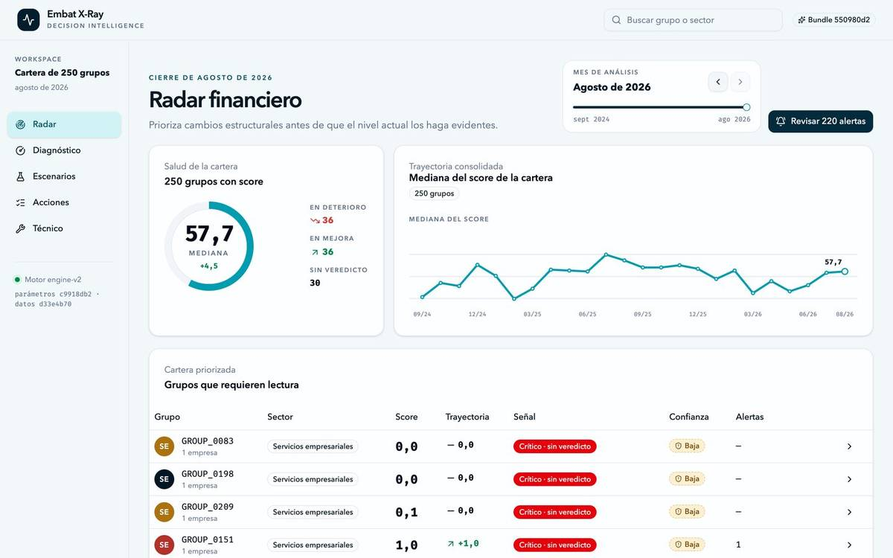

# V. Fondo

## 18. Modelo de datos, lógica de negocio y glosario

### El contrato de datos (Bundle JSON)

La interfaz de Embat X-Ray es una aplicación de página única (SPA) estática que no se comunica con una base de datos ni con una API transaccional en tiempo real. Toda la información que muestra proviene de un paquete de archivos JSON estáticos (el *bundle*) exportado por el motor analítico y servido desde la ruta `/data/v1/`. 

El esquema de este contrato (`xray-export-v1` definido en `contract.ts`) garantiza que la interfaz solo lea datos precalculados, inmutables y auditables. El módulo `bundle.ts` se encarga de la carga y el cacheo en memoria, añadiendo un parámetro de versión (`?v=`) basado en los primeros 12 caracteres del `bundle_id` para evitar problemas de caché en el navegador. El bundle se compone de los siguientes ficheros:

*   `manifest.json`: Contiene los metadatos de la ejecución (versión del motor, *hashes* criptográficos de parámetros y datos), la lista de meses evaluados, las definiciones de los pilares y bandas, y el glosario de textos en español para las reglas abiertas (puertas, topes, motivos de abstención).
*   `portfolio.json`: Matriz consolidada con el resumen de todos los grupos de la cartera mes a mes. Alimenta la vista del radar sin necesidad de cargar el detalle de cada entidad.
*   `groups/<id>.json`: Ficha exhaustiva de un grupo empresarial. Contiene su perfil inferido, el desglose mensual de su *score* (pilares, topes, penalizaciones), las empresas que lo componen, sus series temporales y sus alertas.
*   `companies/<id>.json`: Ficha exhaustiva de una empresa individual, con la misma estructura que el grupo. Si este directorio no se exporta, la aplicación recurre al resumen incluido en el fichero del grupo.
*   `evidence/<id>.json`: Fichero de auditoría que contiene las filas de datos agregados (evidencias) que justifican el cálculo de cada pilar para una entidad en un mes concreto.
*   `alerts.json`: Bandeja centralizada con todas las alertas evaluadas en la cartera, sus estados y motivos de silenciamiento.
*   `receipt.json`: El recibo de ejecución. Detalla las pruebas de validación sin etiquetas, el peso real aplicado a cada señal y la lista de entidades en abstención técnica.

**Gestión de errores de carga:**
Si la carga de un fichero falla, `bundle.ts` lanza un `BundleError` que es capturado por el enrutador de SvelteKit (`+error.svelte`). La interfaz contempla tres estados de error visuales:
*   **Falta el manifiesto:** Pantalla completa con el icono `FileWarning` rojo y el texto «No se pudo cargar el bundle de datos», seguido de la explicación técnica (ej. «El servidor respondió 500 al leer manifest.json») y un botón «Reintentar» que recarga la página.
*   **Falta una entidad:** Tarjeta de error centrada con el texto «No se pudo leer este dato del bundle» y el detalle de la ruta (ej. «El bundle no contiene groups/GROUP_9999.json»), con un botón «Volver al radar».
*   **Ruta inexistente (404):** Tarjeta con el icono `SearchX`, el título «Esta página no existe» y el texto «La dirección no corresponde a ninguna pantalla. La cartera de grupos es el punto de entrada a todo lo demás.».

### El Score de Salud Financiera y su Formato

El *score* es una medida absoluta del riesgo y la salud financiera de una entidad. Para evitar errores de redondeo y derivas en coma flotante, el motor calcula y exporta absolutamente todos los valores del *score* en **décimas enteras** (de 0 a 1000). 

El módulo `format.ts` centraliza la presentación de todos los datos numéricos utilizando la API `Intl.NumberFormat` con la configuración local `es-ES`:
*   **Score (`formatScore`):** Divide las décimas entre 10 y fuerza siempre un decimal. Un valor interno de `724` se muestra como «72,4».
*   **Deltas de Score (`formatScoreDelta`):** Igual que el *score*, pero fuerza la visualización del signo (`signDisplay: 'exceptZero'`). Muestra «+1,2», «-6,1» o «0,0».
*   **Moneda (`formatEuroCompact`):** Los importes grandes se abrevian para facilitar la lectura. Valores ≥ 1.000.000 se muestran en millones («1,2 M€»), valores ≥ 1.000 en miles («185 k€»), y el resto con dos decimales («83.281,13 €»). Siempre se usa un espacio de no separación (`\u00A0`) antes del símbolo.
*   **Fechas (`formatPeriod` y `humanizeMonths`):** Los meses en formato `YYYY-MM` se transforman a texto legible (ej. «agosto de 2026»). La función `humanizeMonths` busca patrones de fecha en los textos generados por el motor y los traduce dinámicamente (ej. «frente a 2025-09» se renderiza como «frente a septiembre de 2025»).

El cálculo del *score* es estrictamente aditivo y determinista. Para cualquier entidad y mes, se cumple la siguiente identidad matemática exacta (la «cascada» o *waterfall*, calculada en `explain.ts`):

`Score = Base + Σ Contribuciones de los pilares − Penalización − Tope`

### Bandas de Riesgo y Tonos Visuales

El *score* ubica a la entidad en una de las cuatro bandas de riesgo predefinidas. Los umbrales son estáticos y se definen en el `manifest.json`. El fichero `tones.ts` mapea estas bandas y otros estados a una paleta semántica estricta que aplica variables CSS globales:

| Clave JSON | Etiqueta UI | Tono semántico | Color visual |
| :--- | :--- | :--- | :--- |
| `critical` | «Crítico» | `danger` | Rojo (`--danger`) |
| `watch` | «Vigilancia» | `warning` | Naranja/Ámbar (`--warning`) |
| `stable` | «Estable» | `signal` | Azul/Cian (`--signal`) |
| `solid` | «Sólido» | `success` | Verde (`--success`) |

Estos tonos se aplican mediante clases utilitarias (`TONE_BADGE`, `TONE_TEXT`, `TONE_DOT`, `TONE_COLOR`) para garantizar que un estado crítico siempre se vea rojo, ya sea en el texto de una tabla, en el fondo de una pastilla o en el trazo de un gráfico SVG.

### Pilares, Pesos y Contribuciones (La Cascada)

El modelo evalúa cinco áreas observables (pilares). Cada pilar tiene un peso nominal y una puntuación de referencia (mediana de la población base):

1.  **Liquidez** (`liquidity`): Días de salidas cubiertos por caja y líneas de crédito.
2.  **Actividad** (`activity`): Cobertura de pagos con cobros operativos e impulso de ingresos.
3.  **Pagos a proveedores** (`payments`): Días de retraso sobre el vencimiento.
4.  **Cobros de clientes** (`collections`): Días de retraso en el cobro.
5.  **Deuda** (`debt`): Proporción de los cobros consumida por el servicio de la deuda.

**Lógica de datos faltantes y peso efectivo (`w_eff`):**
El motor nunca inventa datos. Si un pilar no se puede medir (por ejemplo, una empresa sin deuda o sin facturas emitidas), su valor es `null` y se acompaña de una regla o puerta (`gates`) que explica el motivo. Cuando un pilar falta, su peso se reparte proporcionalmente entre los pilares disponibles, dando lugar al **peso efectivo**.

El componente `contribution-waterfall.svelte` renderiza la explicación exacta de este cálculo paso a paso:
*   **Punto de partida (Base):** Se muestra con el texto «Mediana de referencia de los pilares disponibles, ponderada por su peso efectivo».
*   **Pilares disponibles:** Muestran su impacto visual con una barra hacia la derecha (verde) o izquierda (roja). El texto detalla: «Pilar en {score} · referencia {baseline} · peso efectivo {w_eff} %». Las puertas (`gates`) se renderizan como pastillas grises debajo de la explicación (ej. «Valor del último mes con el feed bancario vivo.»).
*   **Pilares no disponibles:** Se marcan con un icono de círculo tachado (`CircleSlash`) y el texto se atenúa. El detalle indica: «No disponible este mes: su peso se reparte entre los demás pilares».

### Penalizaciones y Topes (Caps)

El modelo es **no compensatorio**. Un pilar excelente no puede ocultar un pilar desastroso. Estas reglas se aplican al final de la cascada y se explican explícitamente en la interfaz:

*   **Penalización por pilar débil (`penalty`):** Si el pilar más bajo de la entidad cae por debajo de 45 puntos, se aplica una penalización. 
    *   Si aplica (`entry.penalty > 0`), la interfaz muestra: «No compensatoria: {nombre_del_pilar} es el pilar más bajo ({score}) y resta aunque los demás compensen».
    *   Si no aplica: «Sin penalización este mes».
*   **Topes (`caps`):** Son reglas duras que limitan la puntuación máxima. El motor calcula el ajuste necesario (`cap.amount`) para recortar el *score* hasta el límite establecido.
    *   Si aplica (`entry.cap.amount > 0`), se muestra: «Una regla limita el score máximo aunque el resto de pilares sea alto», seguido de pastillas con los textos del glosario (ej. «Caja más líneas disponibles en negativo 3 de los últimos 6 meses: score máximo 40.»).
    *   Si no aplica: «Ningún tope recorta el score este mes».

Al pie de la cascada, un bloque de validación (`waterfallGap === 0`) certifica la matemática: «{base} de partida, más las aportaciones de los pilares, menos penalización y tope, da exactamente {score}: la suma cuadra al décimo y la confianza no interviene.». Si por algún error en los datos la suma no cuadrara, el icono cambia a un triángulo de alerta rojo (`TriangleAlert`) con el texto «La suma no cuadra por {gap} puntos.».

### Confianza y Abstención

La **Confianza** (`conf`) evalúa la calidad de la medición, pero **nunca modifica el score**. Se calcula como el producto de tres factores (Historia × Cobertura × Calidad) y se clasifica en tres niveles visuales (`confidence-pill.svelte`):
*   `high` («Alta»): Tono cian (`signal`). Icono `ShieldCheck`.
*   `medium` («Media»): Tono gris neutro (`neutral`). Icono `ShieldQuestion`.
*   `low` («Baja»): Tono amarillo/naranja (`warning`) con borde discontinuo. Icono `ShieldAlert`.

**Abstención técnica (`abstain`):**
Cuando los datos son insuficientes para sostener un veredicto fiable, el motor se abstiene. El componente `abstained-state.svelte` inyecta un *banner* destacado en la parte superior de las vistas de Diagnóstico y Técnico.
*   **Anatomía del banner:** Fondo amarillo suave (`warning-soft`), borde naranja (`warning`), icono `PauseCircle`.
*   **Textos:** Título fijo «El motor se abstiene este mes». La descripción lee el motivo del glosario (ej. «Feed bancario sin datos recientes.») y añade una línea con el icono de una llave (`KeyRound`) indicando la solución: «Qué lo desbloquea: {texto_de_desbloqueo}».
*   **Efectos en la UI:** El *score* se muestra atenuado (gris), la pastilla de trayectoria indica «— Sin veredicto este mes», y no se disparan alertas nuevas.

### Trayectoria y Veredicto

La trayectoria evalúa el cambio del *score* mirando exclusivamente al pasado. El **Veredicto** (`verdict`) se compone de:

*   **Dirección (`direction`):** Compara el *score* actual con el de hace 3 meses. Se traduce visualmente en pastillas (`Badge`) en la cabecera de la entidad:
    *   `improving`: «↗ Mejora» (Tono `success`).
    *   `deteriorating`: «↘ Deterioro» (Tono `danger`).
    *   `stable`: «— Estable» (Tono `neutral`).
    *   `perimeter_shift`: «Cambio de perímetro» (Tono `signal`).
*   **Naturaleza (`nature`):** Acompaña a la dirección (ej. «↗ Mejora · estructural»).
    *   `shock_pending`: «Shock por confirmar» (Primer mes que se detecta el cambio).
    *   `structural`: «Estructural» (La dirección se mantiene 2 meses consecutivos).
    *   `bump`: «Bache» (El movimiento revierte antes de consolidarse).

Si el motor detecta un cambio de tendencia (`entry.verdict.detected_since`), la vista de la entidad muestra un *banner* de alerta amarillo con el icono `CalendarClock`: «Señal detectada desde {mes}» y el texto «El cambio de trayectoria acumula {n} cierres de persistencia.». En el gráfico de trayectoria, este momento se marca con una línea vertical discontinua naranja y la etiqueta «Cambio detectado».

### Alertas y Triaje Local

El motor genera alertas (`alerts.json`) basadas en reglas estrictas. La vista «Bandeja de Alertas» (`alerts-inbox.svelte`) permite filtrarlas por texto, tipo de entidad (Grupo/Empresa) y tipo de alerta.

**Tipos de alerta (`kind`):**
*   `deterioration_structural`: Deterioro estructural.
*   `improvement_structural`: Mejora estructural.
*   `level_critical`: Nivel crítico.
*   `cap_fired`: Tope aplicado.
*   `stale_feed`: Feed sin datos.

**Estados de la alerta (`state`) y Pestañas:**
La bandeja se divide en tres pestañas principales que filtran la lista:
*   **Activas (`fired`):** La alerta es válida y requiere atención. Tono rojo.
*   **Silenciadas (`suppressed`):** La alerta se ha detectado, pero una regla superior la pone en pausa. El componente `alert-card.svelte` muestra un bloque gris destacado con el motivo: «Silenciada: {motivo_del_glosario}» y el periodo de aplicación: «Ventana: desde {inicio} hasta {fin}».
*   **Abstenciones (`abstained`):** La alerta matemática existe, pero el motor está en abstención técnica. Tono amarillo. El bloque explicativo indica: «No se dispara: {motivo}».

**Triaje local (`alert-state.svelte.ts`):**
El analista puede gestionar las alertas activas directamente desde las tarjetas.
*   **Interacción:** Botones «Marcar como vista» (icono `Eye`) y «Descartar» (icono `X`).
*   **Efecto:** Al marcar como vista, aparece una pastilla gris «Vista» con el icono `Check`. Al descartar, la alerta desaparece de la lista principal, la tarjeta se atenúa (opacidad 60%) y aparece la pastilla «Descartada» con el icono `EyeOff`. El botón cambia a «Restaurar» (`RotateCcw`).
*   **Persistencia:** Este estado se guarda exclusivamente en el `localStorage` del navegador (`xray:alert-triage:v1`). Un texto en la tarjeta KPI «Sin revisar» lo advierte explícitamente: «triaje guardado solo en este navegador».
*   **Filtro de descartadas:** Si hay alertas descartadas, aparece un botón *toggle* «Ver descartadas · {n}» junto a las pestañas para volver a mostrarlas en la lista.

### Acciones y Laboratorio de Escenarios

El motor calcula recomendaciones operativas (`actions`) para mejorar el *score*. El «Centro de acciones» muestra la lista priorizada para toda la cartera, mientras que la vista de la entidad muestra solo las suyas.

*   **Anatomía de la acción (`action-list.svelte`):** Cada tarjeta muestra el impacto en una pastilla verde (ej. «+5,0 puntos»), el título, la descripción financiera, y una fila de metadatos: «Grupo · {id}», «Pilar · {pilar}», «Hoy · {actual} → objetivo {meta}», «Esfuerzo · {nivel}», «Score · {inicial} → {final}».
*   **Estado local:** Al igual que las alertas, el estado de la acción se guarda en `localStorage` (`xray.actions.done.v1`). El botón «Marcar hecha» cambia el estado a «✓ Hecha» y el botón pasa a decir «Reabrir».

**Laboratorio de Escenarios (`scenario-view.svelte`):**
Permite al usuario simular la aplicación de estas palancas mediante casillas de verificación (*checkboxes*).
*   **Interacción:** Al marcar una o varias acciones, el gráfico de anillo «ESTIMADO» se actualiza en tiempo real, mostrando el nuevo valor y el delta en verde. El gráfico de trayectoria dibuja una línea discontinua verde hacia el nuevo «Objetivo». Los botones «Activar todas» y «Limpiar» permiten selecciones masivas.
*   **Lógica de combinación (`projectedTenths`):** Como el modelo no es lineal, la suma de los impactos individuales suele ser mayor que el impacto real conjunto. El motor precalcula el escenario máximo (`actions_combined.new_score`). Al seleccionar varias acciones, la interfaz suma los impactos individuales pero **topa el resultado** a este valor combinado.
*   **Aviso metodológico:** Una tarjeta inferior advierte: «Estimación, no promesa. Con una sola acción se muestra el score que el motor recalculó para ella. Con varias, se suman sus mejoras sin superar el resultado que el motor obtuvo al aplicarlas todas a la vez.».

### Contexto: Ficha Inferida, Sector y Benchmarks

El modelo de *score* es agnóstico al sector. Sin embargo, el motor infiere atributos del negocio basándose en sus patrones transaccionales. Esta información se muestra en la «Ficha inferida de sus propios datos» (`profile-card.svelte`).

*   **Atributos:** Se muestran en una cuadrícula. Cada atributo tiene un indicador visual de cobertura (5 puntos que se rellenan según el porcentaje de datos disponibles). Si el valor es `null`, se muestra el texto «No inferible todavía» en gris.
*   **Contexto y Sector:** Se muestran en un recuadro inferior con borde discontinuo. El texto indica: «Sector estimado: {sector} · confianza de la clasificación {confianza} %». Para dejar clara la separación entre contexto y cálculo, se incluye una pastilla gris explícita: «No entra en el score».

### El Recibo de Ejecución (Auditoría)

La pestaña «Recibo» (`receipt-view.svelte`) es la pista de auditoría técnica de la exportación.

*   **Huella de ejecución:** Muestra la versión del motor y los *hashes* SHA-256 completos de los parámetros y los datos. Una comprobación interna (`sameRun`) verifica que estos *hashes* coinciden con los del `manifest.json`. Si coinciden, muestra: «Coincide con el bundle que ves en el resto de pantallas...». Si no, muestra una alerta roja: «El recibo no corresponde a este bundle».
*   **Pruebas sin etiquetas:** Muestra el resultado de la validación interna del motor. Las tarjetas (`receipt-check-card.svelte`) indican el estado: «Superada» (verde), «No superada» (rojo), «Informativa» (azul) o «No ejecutada» (gris). Si no hay pruebas, un *empty state* indica: «Este bundle se exportó sin ejecutar la validación».
*   **Señales ponderadas vs. excluidas:** Dos tarjetas comparan «Lo que sí entra en el número» (con barras de progreso según su peso) frente a «Señales que no usamos y por qué» (marcadas con un icono de prohibición y la pastilla «Peso 0 %»).
*   **Lista de abstenciones:** Un acordeón agrupa todas las entidades en abstención por motivo. Para evitar listas inmensas, solo se muestran las primeras 6 entidades por defecto, ocultando el resto tras un botón interactivo: «Ver las {n} entidades restantes».

### Glosario de la Interfaz

Definición de los términos técnicos y de negocio tal y como se presentan en la interfaz de Embat X-Ray:

*   **Abstención:** Estado en el que el motor se niega a emitir un veredicto de trayectoria o a disparar alertas debido a la falta de datos suficientes o fiables (ej. *feed* bancario caído). El *score* se sigue calculando y mostrando.
*   **Base (Punto de partida):** Puntuación inicial de una entidad antes de sumar o restar el rendimiento de sus pilares. Es la mediana de referencia ponderada de los pilares que tiene disponibles.
*   **Bundle:** Paquete de archivos JSON estáticos y precalculados que contiene toda la información financiera, *scores*, evidencias y alertas de una cartera para un periodo determinado.
*   **Colchón de caja:** Métrica del pilar de Liquidez. Representa el número de días de pagos operativos y deuda que la empresa puede afrontar utilizando únicamente su saldo en caja y las líneas de crédito no dispuestas.
*   **Confianza:** Índice porcentual que evalúa la fiabilidad del *score* basándose en la profundidad histórica, la cobertura de pilares y la calidad de los datos. No modifica la puntuación.
*   **Delta:** Diferencia matemática entre dos valores. En la trayectoria, suele referirse al `delta3` (cambio del *score* respecto a hace 3 meses).
*   **Esfuerzo:** Estimación cualitativa (bajo, medio, alto) de la dificultad operativa que supone para la empresa llevar a cabo una acción recomendada.
*   **Feed bancario:** Conexión automatizada que extrae los movimientos y saldos de las cuentas bancarias de la entidad.
*   **N de Kish (Facturas efectivas):** Medida estadística mostrada en las evidencias que indica la concentración del riesgo. Un número bajo significa que el importe total depende de muy pocas facturas, lo que resta fiabilidad a la media de días de pago/cobro.
*   **Naturaleza:** Clasificación del cambio de trayectoria de un *score*. Puede ser un «Bache» (caída puntual que revierte), un «Shock por confirmar» (primer mes de caída) o «Estructural» (tendencia consolidada).
*   **Penalización (por pilar débil):** Regla no compensatoria que resta puntos al *score* global si el pilar con peor rendimiento de la entidad cae por debajo de un umbral crítico de 45 puntos.
*   **Perímetro (Cambio de):** Situación detectada cuando se añaden nuevas cuentas bancarias o empresas al grupo, alterando bruscamente el volumen de dinero. Silencia temporalmente las alertas para evitar falsos positivos.
*   **Persistencia:** Número de meses consecutivos que una entidad lleva manteniendo la misma dirección en su trayectoria (mejora o deterioro).
*   **Peso efectivo (`w_eff`):** Porcentaje real de influencia de un pilar sobre el *score* final. Si un pilar no está disponible, su peso nominal se reparte entre los demás, recalculando el peso efectivo de los restantes.
*   **Pilar:** Cada una de las cinco grandes áreas de evaluación financiera del motor: Liquidez, Actividad, Pagos a proveedores, Cobros de clientes y Deuda.
*   **Score (de salud):** Calificación global de 0,0 a 100,0 que mide la salud financiera y el riesgo de la entidad en un mes concreto.
*   **Tope (Cap):** Regla estricta que limita la puntuación máxima que puede alcanzar una entidad si incumple condiciones críticas (ej. liquidez negativa recurrente), independientemente de lo bien que puntúen otros pilares.
*   **Triaje:** Acción manual del usuario en la interfaz para gestionar la bandeja de alertas, marcándolas como «Vistas» o «Descartadas». Se guarda localmente en el navegador.
*   **Ventana:** Rango de meses durante el cual una alerta permanece silenciada (ej. por un cambio de perímetro reciente).
*   **Veredicto:** Conclusión del motor sobre la evolución de la entidad, compuesta por la dirección (mejora, deterioro, estable) y su naturaleza. Solo se emite si hay datos suficientes y no hay abstención.

## 19. Accesibilidad, rendimiento, pruebas y observaciones

### Accesibilidad (a11y)

La aplicación está construida sobre primitivas de `bits-ui` (a través de `shadcn-svelte`), lo que garantiza un cumplimiento estricto de los estándares WAI-ARIA en los componentes base, complementado con atributos semánticos específicos en las vistas de dominio.

*   **Semántica HTML y jerarquía:** Se hace un uso exhaustivo de etiquetas semánticas. Las vistas principales se envuelven en `<section>` o `<main>` con atributos `aria-labelledby` que apuntan a los encabezados `<h1>` o `<h2>` (por ejemplo, `<section class="space-y-5" aria-labelledby="alerts-heading">` en `alerts-inbox.svelte`). Las listas de atributos, como la ficha inferida o las métricas del recibo, utilizan listas de definición (`<dl>`, `<dt>`, `<dd>`).
*   **Roles ARIA y estados dinámicos:** 
    *   Los estados de error, advertencia y carga utilizan `role="alert"` o `role="status"` para ser anunciados por lectores de pantalla (ej. `
` en `evidence-table.svelte`).
    *   Los gráficos interactivos y selectores notifican sus cambios mediante regiones vivas: `<strong class="block text-base first-letter:uppercase" aria-live="polite">{period}</strong>` en `month-slider.svelte`.
    *   Los botones que actúan como conmutadores de estado utilizan `aria-pressed` (ej. `<button aria-pressed={pressed}>` en `stat-tile.svelte` o en las columnas del gráfico `alerts-timeline.svelte`).
    *   Los elementos desplegables, como el acordeón de abstenciones en el recibo, gestionan su estado con `aria-expanded={open}` y `aria-controls="abstentions-{block.reason}"`.
*   **Etiquetas invisibles y ocultación:** 
    *   Los elementos puramente decorativos (puntos de color de los tonos, iconos ilustrativos, barras de progreso visuales) se ocultan con `aria-hidden="true"`.
    *   Se provee contexto a los lectores de pantalla mediante clases `.sr-only` (ej. `Toggle Sidebar` en `sidebar-trigger.svelte` o `Cobertura ` en `profile-card.svelte`).
    *   Los controles sin texto visible llevan `aria-label` explícito: `aria-label="Mes anterior"` en los botones del slider temporal, o `aria-label="Buscar por grupo o empresa"` en los inputs de búsqueda.
*   **Navegación por teclado y foco:** Todos los elementos interactivos (botones, enlaces, pestañas, selectores) son accesibles mediante tabulación. El estado de foco está unificado mediante las clases de utilidad `focus-visible:ring-2 focus-visible:ring-ring focus-visible:ring-offset-2`, garantizando un anillo visible.
*   **Contraste visual percibido:** El sistema de diseño, definido en `tones.ts` y `layout.css`, empareja fondos suaves con textos fuertes (ej. `--danger-soft` con `--danger-strong`). Esto asegura que las pastillas de estado y las alertas mantengan un ratio de contraste mínimo AA, perceptible claramente en capturas como la .

### Formatos, cálculos y pluralizaciones

La presentación de datos numéricos y textuales está centralizada en `src/lib/format.ts` y se apoya en la API `Intl` nativa del navegador, garantizando la consistencia en toda la interfaz.

*   **Formato de puntuaciones (Score):** El motor exporta los scores en décimas enteras (ej. `724`) para evitar errores de coma flotante. La función `formatScore` lo divide por 10 y fuerza un decimal (`72,4`). Para las variaciones, `formatScoreDelta` fuerza la visualización del signo (`+1,2` o `-6,1`).
*   **Formato monetario y unidades:** `formatEuroCompact` abrevia cifras grandes (`1,2 M€`, `185 k€`), mientras que `formatUnitValue` añade la unidad correspondiente con un espacio de no separación (`\u00A0`), gestionando casos especiales como `cuota` (que se multiplica por 100 y se le añade `%`) o booleanos (`Sí`/`No`).
*   **Fechas y periodos:** El formato interno `YYYY-MM` se transforma mediante `Intl.DateTimeFormat`:
    *   `formatPeriod`: «agosto de 2026» (usado en cabeceras y textos largos).
    *   `formatPeriodShort`: «ago 2026» (usado en sliders y pastillas).
    *   `formatAxisMonth`: «08/26» (usado en los ejes X de los gráficos).
*   **Pluralización dinámica:** Las plantillas Svelte implementan funciones locales para gestionar la concordancia gramatical exacta basada en las variables.
    *   En `alerts-inbox.svelte`: `` const plural = (count: number, one: string, many: string) => `${formatNumber(count)} ${count === 1 ? one : many}`; `` genera textos como «1 alerta» o «40 alertas».
    *   En `company-drilldown.svelte`: `` `${formatNumber(observed)} con datos en ${formatPeriod(month)}` ``.
    *   En `receipt-abstentions.svelte`: `` `Ver ${hidden === 1 ? 'la entidad restante' : `las ${formatNumber(hidden)} entidades restantes`}` ``.
*   **Cálculos de interfaz:**
    *   **Identidad del Waterfall:** En `explain.ts`, `waterfallSteps` calcula la cascada exacta: `base + Σ contribuciones - penalización - tope = score mostrado`. La función `waterfallGap` verifica que esta diferencia sea exactamente `0`, lo cual se renderiza como un mensaje de éxito en la interfaz: «la suma cuadra al décimo y la confianza no interviene» (visible en ).
    *   **Proyección de escenarios:** En `actions.ts`, `projectedTenths` suma los impactos de las acciones seleccionadas por el usuario, pero aplica un límite estricto (`Math.min`) para que la suma nunca supere el valor `actions_combined.new_score` precalculado por el motor.

### Estados límite, condicionales y ramas de interfaz

El código contempla exhaustivamente los estados donde los datos están ausentes, en proceso o presentan anomalías, renderizando componentes específicos (`empty-state.svelte`, `abstained-state.svelte`, `alert.svelte`).

*   **Estados de carga (`state: 'loading'`):** Se muestran componentes `<Skeleton>` que imitan la estructura final. En `actions-view.svelte`, se renderizan tres bloques grises parpadeantes mientras se resuelven las promesas de los grupos.
*   **Estados de error (`state: 'error'`):** Si una promesa es rechazada (ej. fallo de red o JSON inválido), se captura el `BundleError` y se muestra un `<EmptyState tone="danger">`.
    *   *Ejemplo literal:* «No se pudieron leer las evidencias» acompañado del mensaje de error técnico.
    *   *Ejemplo en captura:*  muestra «No se pudo leer este dato del bundle. El bundle no contiene groups/GROUP_9999.json».
*   **Ausencia de datos en el mes (`rows === null`):** Si el usuario navega a un mes donde la entidad aún no existía o ya no existe.
    *   *Ejemplo literal:* «Sin datos de GROUP_0001 en marzo de 2025. El primer cierre observado es enero de 2026...» (visible en ).
*   **Abstención del motor (`entry.abstain`):** Si el motor no puede emitir un veredicto fiable (ej. feed caído), se renderiza el componente `<AbstainedState>`.
    *   *Ejemplo literal:* «El motor se abstiene este mes. Feed bancario sin datos recientes. Qué lo desbloquea: Reconectar el feed bancario...» (visible en ).
*   **Estados vacíos por filtrado o falta de eventos:**
    *   Búsqueda sin resultados en el radar: «Ningún grupo coincide con la búsqueda. Prueba con otro identificador, sector o país.» (visible en ).
    *   Sin acciones calculadas: «El bundle no trae acciones para GROUP_0153 en agosto de 2026: o el motor no encontró palancas que suban el score, o esta exportación es anterior al cálculo de acciones.» (visible en ).
    *   Recibo sin validación: «Este bundle se exportó sin ejecutar la validación. Ejecuta la batería de pruebas del motor y vuelve a exportar...» (visible en ).

### Enlaces compartibles y estado en la URL

El frontend es una SPA (Single Page Application) estática, pero mantiene el estado clave de la interfaz sincronizado con la URL para permitir enlaces profundos (*deep linking*) y preservar el contexto al recargar la página.

| Parámetro / Ruta | Fichero responsable | Comportamiento e Interacción |
| :--- | :--- | :--- |
| `?m=YYYY-MM` | `month-store.svelte.ts` | Almacena el mes de análisis global. Si el usuario selecciona el último cierre disponible, el parámetro se elimina de la URL para mantenerla limpia. La escritura en la URL utiliza `replaceState` y está *debounced* (200 ms) para no saturar el historial de navegación del navegador al arrastrar el slider. |
| `?tab=` | `xray-dashboard.svelte` | Guarda la pestaña activa de la navegación principal (ej. `radar`, `tecnico`, `escenarios`). |
| `?section=` | `xray-dashboard.svelte` | Guarda la subpestaña activa dentro de la vista Técnica (ej. `desglose`, `alertas`, `recibo`). |
| `?focus=` | `xray-dashboard.svelte` | Guarda el identificador del grupo seleccionado en las vistas que requieren un contexto específico (Diagnóstico, Escenarios, Técnico). El componente `<FocusPicker>` actualiza este valor. |
| `/group/[id]` | `(app)/group/[id]/+page.ts` | Ruta dinámica para la vista de detalle de un grupo. Valida la existencia del grupo mediante `loadGroup`; si no existe, lanza un error 404 que es capturado por `+error.svelte`. |
| `/group/[id]/company/[companyId]` | `(app)/group/[id]/company/[companyId]/+page.ts` | Ruta canónica para el detalle de una empresa. Carga tanto el grupo como la empresa para validar la pertenencia. |
| `/company/[id]` | `(app)/company/[id]/+page.ts` | Ruta de atajo. Carga la empresa, identifica a qué grupo pertenece y ejecuta un `redirect(307)` hacia la ruta canónica anidada, preservando los parámetros de búsqueda (`url.search`). |

### Caché, almacenamiento local y rendimiento

Dado que la aplicación lee un *bundle* JSON estático fragmentado que puede pesar varios megabytes en total, el rendimiento se gestiona mediante estrategias de caché en memoria, almacenamiento local y renderizado perezoso.

*   **Caché de lectura del bundle:** El fichero `bundle.ts` implementa una caché en memoria (`Map`) indexada por el `bundle_id` y la ruta del fichero. Cuando se navega de un grupo a otro, los ficheros JSON (`portfolio.json`, `groups/[id].json`) se descargan una sola vez. Si la promesa está en curso, las peticiones concurrentes se acoplan a la misma promesa mediante la función `cached()`.
*   **Persistencia de triaje y acciones (Local Storage):** Como el bundle es de solo lectura, las interacciones del usuario se guardan en el navegador utilizando clases reactivas (`SvelteSet` y `$state.raw`).
    *   `action-state.svelte.ts`: Guarda las acciones marcadas como hechas bajo la clave `xray.actions.done.v1`.
    *   `alert-state.svelte.ts`: Guarda el triaje de alertas (vistas o descartadas) bajo la clave `xray:alert-triage:v1`. Escucha el evento `storage` de la ventana para sincronizar pestañas del navegador.
*   **Montaje perezoso de vistas:** En `xray-dashboard.svelte`, el contenido de las pestañas principales se envuelve en bloques `{#if active === '...'}`. Esto significa que los componentes pesados se destruyen y se retiran del DOM cuando no están visibles, liberando memoria.
*   **Paginación en cliente:** Para evitar bloquear el hilo principal renderizando miles de nodos DOM, las listas largas están paginadas en el cliente. En `radar-view.svelte` se muestran de 25 en 25 grupos (`PAGE_SIZE = 25`), y en `alerts-inbox.svelte` de 40 en 40. La interacción con el botón «Mostrar más» simplemente incrementa la variable `limit`, reactivando el bloque `{#each}` (visible en la captura ).

### Pruebas (Testing)

El repositorio cuenta con una suite de pruebas exhaustiva que abarca desde la lógica pura hasta el renderizado en el navegador, utilizando Vitest y Playwright.

*   **Pruebas unitarias de lógica:** Ficheros como `format.spec.ts`, `actions.spec.ts`, `alerts.spec.ts`, `explain.spec.ts` y `portfolio.spec.ts` validan la aritmética del frontend. Comprueban que `monthChanges` sume exactamente la diferencia de score entre dos meses, que los filtros de alertas funcionen correctamente y que las proyecciones de escenarios no superen los topes matemáticos (`projectedTenths`).
*   **Pruebas de integridad del bundle:** El fichero `bundle-integrity.spec.ts` es una prueba masiva que lee el *fixture* real (`e2e/fixtures/bundle/v1/`) y valida cada archivo JSON contra los esquemas de Zod definidos en `contract.ts`. Verifica reglas de negocio estrictas:
    *   Que la cascada de puntuación sea matemáticamente exacta (`waterfallEnd(entry) === entry.shown`).
    *   Que la banda asignada corresponda exactamente al umbral del score (`bandOf`).
    *   Que las alertas silenciadas coincidan temporalmente con ventanas de cambio de perímetro o abstención.
    *   Que todas las explicaciones del glosario existan en el manifiesto.
*   **Pruebas de componente:** Ficheros como `receipt-view.svelte.spec.ts` utilizan `vitest-browser-svelte` para montar componentes en un entorno de navegador real (Playwright). Verifican que los elementos DOM se rendericen correctamente, que los roles ARIA estén presentes, que los textos literales coincidan y que la interacción (como expandir el acordeón de abstenciones) funcione como se espera.

### Despliegue estático en Vercel

La aplicación está configurada como una SPA puramente estática, sin renderizado en el servidor (SSR).

*   **Adaptador:** En `svelte.config.js` se utiliza `@sveltejs/adapter-static` con una página de *fallback* configurada como `200.html` cuando la variable de entorno `XRAY_TARGET=static` está presente.
*   **Enrutamiento en Vercel:** El fichero `vercel.json` define una regla de reescritura (`rewrites`) que envía cualquier petición que no coincida con un archivo estático (o con la carpeta `/data/`) al archivo `/200.html`. Esto permite que el enrutador del lado del cliente de SvelteKit tome el control de las URLs profundas (como `/group/GROUP_0153`).
*   **Cabeceras de caché:** Se configuran cabeceras inmutables (`max-age=31536000, immutable`) para los activos compilados de la aplicación (`/_app/immutable/`), mientras que la carpeta `/data/` (donde reside el *bundle* JSON) se configura con `must-revalidate` para garantizar que los usuarios siempre descarguen la última exportación del motor sin retenciones de caché indeseadas.

### Observaciones y posibles mejoras

A partir del análisis exhaustivo del código fuente y las capturas proporcionadas, se detectan las siguientes inconsistencias y áreas de mejora en la interfaz:

1.  **Mezcla de idiomas (Spanglish):** Aunque la aplicación está en español, persisten términos en inglés incrustados en la interfaz que rompen la coherencia lingüística.
    *   «WORKSPACE» (en el encabezado de la barra lateral de todas las capturas).
    *   «DECISION INTELLIGENCE» (en el logotipo de todas las capturas).
    *   «Bundle» (en la pastilla de versión superior derecha).
    *   «Score» y «Feed» (utilizados profusamente en textos explicativos y títulos).
2.  **Errores de concordancia gramatical:** En el banner de la sección de Acciones (captura ), cuando solo hay una acción completada, el texto muestra «30 acciones · 1 hechas». El código en `actions-view.svelte` (`{formatNumber(done)} hechas`) no aplica lógica de pluralización a la palabra «hecha» en función del contador, a diferencia de otras partes de la app que sí usan la función `plural()`.
3.  **Redundancia de textos en los pilares:** En las tarjetas de los pilares «Pagos a proveedores» y «Cobros de clientes» (visible en capturas como  y ), el texto explicativo «No vence ninguna factura en los últimos 90 días.» aparece duplicado: una vez junto al icono del documento (`driver.note`) y otra vez inmediatamente debajo en color gris (proveniente de `driver.gates`).
4.  **Impacto visual del Score «0,0»:** Cuando el motor se abstiene (por ejemplo, por un *feed* bancario caído, como en la captura ), el score mostrado es «0,0» y la banda es «Crítico». Aunque matemáticamente es el resultado de la anulación de los pilares, visualmente transmite un mensaje de quiebra inminente en lugar de una falta de datos. La pastilla amarilla de advertencia intenta mitigarlo, pero el número gigante en rojo genera alarma innecesaria.
5.  **Falta de *affordance* en botones secundarios:** En la vista de Escenarios (captura ), el botón «Limpiar» es un texto plano gris sin contorno ni fondo (`variant="ghost"`). Podría pasar desapercibido como un elemento interactivo frente al botón «Activar todas» que sí tiene forma de pastilla.
6.  **Soporte incompleto para modo oscuro:** El fichero `layout.css` define una paleta completa de variables bajo la clase `.dark`, y la captura  evidencia que el sistema operativo solicita el modo oscuro, pero la aplicación se renderiza en modo claro. Falta un mecanismo (como un botón de alternancia o la lectura de `prefers-color-scheme` en el HTML base) para inyectar la clase `.dark` al documento.

7.  **Ubicación contextual de banderas de calidad:** En la ficha inferida de datos (`profile-card.svelte`), si el límite de las líneas de crédito se asume constante, el texto explicativo se añade al atributo «CALIDAD DE DATO» («El límite de las líneas se asume constante.», texto que llega del bundle, no del código de la interfaz), lo cual podría encajar mejor semánticamente en el atributo «FINANCIACIÓN Y HOLGURA».

# Anexo. Fichas de las 113 capturas

Las 113 capturas en el orden en que se tomaron, cada una con su ficha: qué estado muestra y qué se ve en ella de forma específica. La cabecera y la barra lateral comunes solo se describen cuando cambian.

## Escritorio

#### 001 · Radar completo

**Estado que muestra:** Vista general del «Radar financiero» al cierre de agosto de 2026, con los indicadores consolidados de salud y evolución de la cartera y la tabla de entidades priorizadas que requieren lectura urgente.

##### Cabecera de contexto y controles
* Antetítulo «CIERRE DE AGOSTO DE 2026», título «Radar financiero» y descripción «Prioriza cambios estructurales antes de que el nivel actual los haga evidentes.».
* Módulo «MES DE ANÁLISIS»: fijado en «Agosto de 2026» con botones de navegación cronológica (`<` y `>`) sobre un rango que abarca desde «sept 2024» hasta «ago 2026».
* Botón de acción global: «Revisar 220 alertas» con icono de campana.

##### Indicadores consolidados de cartera
* **«Salud de la cartera»** (sobre «250 grupos con score»):
  * Gráfico de anillo con mediana centrada en «57,7» y variación de «+4,5».
  * Desglose por estado: «EN DETERIORO» con valor 36 (flecha roja `↘`), «EN MEJORA» con valor 36 (flecha verde `↗`) y «SIN VEREDICTO» con valor 30.
* **«Trayectoria consolidada»** («Mediana del score de la cartera», 250 grupos):
  * Gráfico de línea temporal con registros periódicos entre «09/24» y «08/26».
  * Punto final resaltado en agosto de 2026 con la etiqueta de valor «57,7».

##### Tabla «Cartera priorizada» («Grupos que requieren lectura»)
* Presenta las primeras 25 entidades de un total de 250, ordenadas por severidad/score ascendente (desde 0,0 hasta 20,5).
* Columnas visibles: «Grupo», «Sector», «Score», «Trayectoria», «Señal», «Confianza», «Alertas» y chevron de navegación (`>`).
* Tipologías de señal mostradas (todas en categoría crítica con pastilla roja): «Crítico · sin veredicto», «Crítico · Deterioro», «Crítico · Estable» y «Crítico · Cambio de perímetro» (caso «GROUP_0243»).
* Niveles de confianza: «Baja», «Media» y «Alta».
* Detalle de alertas: valores vacíos («–»), conteo activo («1» o «2») y avisos silenciados («– 3 silenciadas» en «GROUP_0152»).
* Listado visible de entidades: «GROUP_0083» (0,0), «GROUP_0198» (0,0), «GROUP_0209» (0,1), «GROUP_0151» (1,0), «GROUP_0249» (3,0), «GROUP_0216» (3,2), «GROUP_0156» (5,9), «GROUP_0179» (6,7), «GROUP_0188» (8,7), «GROUP_0244» (9,8), «GROUP_0172» (11,9), «GROUP_0204» (13,7), «GROUP_0148» (14,2), «GROUP_0052» (14,3), «GROUP_0189» (15,2), «GROUP_0140» (17,0), «GROUP_0208» (17,2), «GROUP_0154» (17,5), «GROUP_0004» (17,7), «GROUP_0028» (17,7), «GROUP_0152» (18,5), «GROUP_0105» (18,9), «GROUP_0063» (19,4), «GROUP_0243» (19,6) y «GROUP_0221» (20,5).
* Pie de listado: texto de paginación «25 de 250 grupos» junto al botón «Mostrar más».

#### 002 · Radar primer pliegue

**Estado que muestra:** Vista general del primer pliegue del módulo «Radar» al corte de «Agosto de 2026», con el resumen consolidado de la cartera de 250 grupos y el listado de grupos prioritarios que requieren revisión.

##### Elementos de contexto y navegación particulares
* Pestaña activa en el menú lateral: «Radar».
* Botón de acción destacado en la cabecera: «Revisar 220 alertas» en azul oscuro con icono de campana.

##### Encabezado y controles temporales
* Contexto y títulos: sobretítulo «CIERRE DE AGOSTO DE 2026», título «Radar financiero» y descripción «Prioriza cambios estructurales antes de que el nivel actual los haga evidentes.».
* Selector «MES DE ANÁLISIS»: tarjeta con paginadores `<` y `>`, mostrando «Agosto de 2026» y un control deslizante temporal comprendido entre «sept 2024» y «ago 2026» (posicionado al límite derecho).

##### Tarjetas de métricas principales
* **«Salud de la cartera»** («250 grupos con score»):
  * Gráfico de donut con métrica central: mediana de «57,7» y variación de «+4,5».
  * Desglose lateral de estados: «EN DETERIORO» con «36» (icono de flecha descendente quebrada roja), «EN MEJORA» con «36» (icono de flecha ascendente verde) y «SIN VEREDICTO» con «30».
* **«Trayectoria consolidada»** («Mediana del score de la cartera», distintivo «250 grupos»):
  * Gráfico de línea temporal para «MEDIANA DEL SCORE» con marcas de fecha de «09/24» a «08/26» (incluyendo «12/24», «03/25», «06/25», «09/25», «12/25», «03/26» y «06/26»).
  * Marcador final del gráfico destacado con el valor «57,7».

##### Tabla «Cartera priorizada» («Grupos que requieren lectura»)
Presenta columnas para «Grupo», «Sector», «Score», «Trayectoria», «Señal», «Confianza», «Alertas» y acción de navegación «>». Filas visibles en este pliegue:
* **«GROUP_0083»** («1 empresa»): sector «Servicios empresariales», score «0,0», trayectoria «- 0,0», señal «Crítico · sin veredicto», confianza «Baja» (pastilla amarilla punteada) y alertas «-».
* **«GROUP_0198»** («1 empresa»): sector «Servicios empresariales», score «0,0», trayectoria «- 0,0», señal «Crítico · sin veredicto», confianza «Baja» y alertas «-».
* **«GROUP_0209»** («1 empresa»): sector «Servicios empresariales», score «0,1», trayectoria «- 0,0», señal «Crítico · sin veredicto», confianza «Baja» y alertas «-».
* **«GROUP_0151»** («1 empresa»): sector «Servicios empresariales», score «1,0», trayectoria «↗ +1,0» en verde, señal «Crítico · sin veredicto», confianza «Baja» y alertas con valor «1».

#### 003 · Radar hover fila

**Estado que muestra:** Vista principal del Radar financiero con interacción de cursor sobre la primera fila de la tabla de cartera priorizada.

##### Contexto temporal y controles de cabecera
* Contexto temporal activo: «CIERRE DE AGOSTO DE 2026».
* Título principal «Radar financiero» acompañado de la descripción «Prioriza cambios estructurales antes de que el nivel actual los haga evidentes.»
* Selector de «MES DE ANÁLISIS»: muestra «Agosto de 2026» con botones de avance/retroceso («<» y «>») y barra deslizadora situada en su límite derecho («ago 2026», con inicio en «sept 2024»).
* Botón de acción destacado con icono de campana: «Revisar 220 alertas».

##### Tarjetas de métricas consolidadas
* **«Salud de la cartera»** («250 grupos con score»):
  * Gráfico de donut con valor central «57,7» («MEDIANA») y variación «+4,5».
  * Desglose lateral: «EN DETERIORO» con «36» (en rojo), «EN MEJORA» con «36» (en verde) y «SIN VEREDICTO» con «30».
* **«Trayectoria consolidada»** («Mediana del score de la cartera», «250 grupos»):
  * Gráfico de línea temporal continua (marzo de 2024 a agosto de 2026).
  * Punto final destacado en agosto de 2026 con etiqueta «57,7».

##### Tabla «Cartera priorizada» («Grupos que requieren lectura»)
* Columnas: «Grupo», «Sector», «Score», «Trayectoria», «Señal», «Confianza», «Alertas» y acceso a detalle («>»).
* **Fila 1 (`GROUP_0083`) en estado hover:** fondo sutilmente sombreado respecto al resto de la tabla.
  * Avatar marrón «SE», «GROUP_0083» («1 empresa»).
  * Sector: pastilla «Servicios empresariales».
  * Score: «0,0»; Trayectoria: «— 0,0».
  * Señal: pastilla roja «Crítico · sin veredicto».
  * Confianza: pastilla naranja con borde discontinuo «Baja».
  * Alertas: «—».
* Filas subsiguientes visibles (estado en reposo):
  * `GROUP_0198`: Score «0,0», trayectoria «— 0,0», señal «Crítico · sin veredicto», confianza «Baja», alertas «—».
  * `GROUP_0209`: Score «0,1», trayectoria «— 0,0», señal «Crítico · sin veredicto», confianza «Baja», alertas «—».
  * `GROUP_0151`: Score «1,0», trayectoria «↗ +1,0» (en verde), señal «Crítico · sin veredicto», confianza «Baja», alertas «1».

#### 004 · Radar ver más grupos

**Estado que muestra:** Vista del Radar financiero tras accionar la paginación incremental mediante el botón «Mostrar más», mostrando 75 de los 250 grupos de la cartera ordenados por puntuación ascendente.

##### Resumen analítico superior
* **Control temporal y alertas:** Mes visible en «Agosto de 2026» con selector interactivo («sept 2024» a «ago 2026») y botón de acción «Revisar 220 alertas».
* **Tarjeta «Salud de la cartera»:**
  * Total de «250 grupos con score».
  * Gráfico de donut con mediana central de «57,7» y variación positiva «+4,5».
  * Desglose de situación: «EN DETERIORO» (36 grupos), «EN MEJORA» (36 grupos) y «SIN VEREDICTO» (30 grupos).
* **Tarjeta «Trayectoria consolidada»:** Gráfico mensual de la mediana del score de la cartera desde septiembre de 2024 hasta agosto de 2026, culminando en «57,7».

##### Tabla «Cartera priorizada» («Grupos que requieren lectura»)
* **Estado de carga incremental:** La lista ha ampliado su visualización hasta alcanzar 75 filas desplegadas en scroll continuo, abarcando desde un score de 0,0 hasta 41,4.
* **Columnas de datos visibles:** «Grupo», «Sector», «Score», «Trayectoria», «Señal», «Confianza», «Alertas» y acceso a ficha individual mediante chevrón («>»).
* **Muestreo de datos en los extremos e intermedios:**
  * *Primera fila (Score mínimo):* «GROUP_0083» (1 empresa), sector «Servicios empresariales», Score «0,0», trayectoria «- 0,0», señal en pastilla roja «Crítico · sin veredicto», confianza «Baja» y sin alertas («—»).
  * *Fila 20:* «GROUP_0152» (4 empresas), «Servicios empresariales», Score «18,5», trayectoria «↘ -32,7», señal «Crítico · Deterioro», confianza «Baja» y alertas con desglose «— · 3 silenciadas».
  * *Fila 31:* «GROUP_0104» (10 empresas), «Servicios empresariales», Score «25,1», trayectoria «↘ -4,4», señal «Crítico · Estable», confianza «Media» y alertas «2 · 1 silenciadas».
  * *Fila 75 (Última fila cargada):* «GROUP_0138» (18 empresas), sector «Servicios empresariales», Score «41,4», trayectoria «↗ +12,6», señal con borde neutro «Vigilancia · Estable», confianza «Media» y «1» alerta activa.
* **Controles al pie de la tabla:**
  * Indicador de progreso con el texto centrado «75 de 250 grupos».
  * Botón «Mostrar más» habilitado para seguir incorporando lotes adicionales de filas al listado.

#### 005 · Buscador desplegable grupo

**Estado que muestra:** Campo de búsqueda global enfocado con el término «GROUP_01» introducido y menú desplegable flotante de resultados rápidos superpuesto sobre la tabla principal de grupos.

##### Elementos interactivos y desplegable de búsqueda
* **Buscador global:** Caja de texto activa con borde resaltado en tono verde azulado/turquesa y el término «GROUP_01» escrito en su interior.
* **Panel emergente de resultados rápidos:** Ventana flotante superpuesta inmediatamente debajo del buscador, dotada de sombra y esquinas redondeadas, que lista 8 coincidencias directas ordenadas por puntuación:
  * «GROUP_0198» | «Servicios empresariales» | Puntuación «0,0» en rojo coral | Flecha de navegación `>`
  * «GROUP_0151» | «Servicios empresariales» | Puntuación «1,0» en rojo coral | Flecha de navegación `>`
  * «GROUP_0156» | «Energía y utilities» | Puntuación «5,9» en rojo coral | Flecha de navegación `>`
  * «GROUP_0179» | «Servicios empresariales» | Puntuación «6,7» en rojo coral | Flecha de navegación `>`
  * «GROUP_0188» | «Software» | Puntuación «8,7» en rojo coral | Flecha de navegación `>`
  * «GROUP_0172» | «Servicios empresariales» | Puntuación «11,9» en rojo coral | Flecha de navegación `>`
  * «GROUP_0148» | «Marketing y publicidad» | Puntuación «14,2» en rojo coral | Flecha de navegación `>`
  * «GROUP_0189» | «Servicios empresariales» | Puntuación «15,2» en rojo coral | Flecha de navegación `>`

##### Tabla principal de fondo
* **Efecto de superposición:** El panel desplegable oculta parcialmente las columnas de estado de criticidad, nivel de confianza y acciones de las ocho primeras filas de la tabla.
* **Filas inferiores visibles (totalmente descubiertas):**
  * Fila 9: Avatar «MY», «GROUP_0157» (1 empresa), sector «Marketing y publicidad», índice «25,4», tendencia «+1,7», etiqueta roja «Crítico · Estable», confianza azul «Alta», métrica auxiliar «-», flecha `>`.
  * Fila 10: Avatar «M», «GROUP_0153» (6 empresas), sector «Manufactura», índice «26,6», tendencia «+7,1», etiqueta roja «Crítico · Estable», confianza azul «Alta», métrica auxiliar «1», flecha `>`.
  * Fila 11: Avatar «S», «GROUP_0107» (2 empresas), sector «Software», índice «28,0», tendencia «+19,1», etiqueta roja «Crítico · Mejora», confianza crema «Baja», métrica auxiliar «3», flecha `>`.
  * Fila 12: Avatar «SE», «GROUP_0145» (1 empresa), sector «Servicios empresariales», índice «29,7», tendencia «-5,0», etiqueta roja «Crítico · Estable», confianza azul «Alta», métrica auxiliar «-», flecha `>`.
  * Fila 13: Avatar «SE», «GROUP_0134» (2 empresas), sector «Servicios empresariales», índice «30,1», tendencia «- 0,0», etiqueta roja «Crítico · sin veredicto», confianza crema «Baja», métrica auxiliar «-», flecha `>`.
  * Fila 14: Avatar «SE», «GROUP_0165» (4 empresas), sector «Servicios empresariales», índice «32,1», tendencia «- 0,0», etiqueta roja «Crítico · sin veredicto», confianza crema «Baja», métrica auxiliar «-», flecha `>`.
* **Pie de tabla:** Contador de registros con el texto «25 de 100 grupos» y botón secundario «Mostrar más».

#### 006 · Buscador tabla filtrada

**Estado que muestra:** Despliegue interactivo del buscador rápido sobre la vista de «Radar financiero», con la consulta «GROUP_01» introducida y el menú contextual de autocompletado superpuesto sobre la tabla de cartera.

##### Buscador flotante y resultados de autocompletado
* **Campo de búsqueda activo:** Borde resaltado en azul celeste con el texto introducido «GROUP_01».
* **Menú desplegable de resultados coincidentes:** Lista flotante alineada bajo el campo de texto con ocho sugerencias directas, mostrando identificador, sector, score en color rojo y flecha de acceso:
  * «GROUP_0198» (Servicios empresariales, score: 0,0).
  * «GROUP_0151» (Servicios empresariales, score: 1,0).
  * «GROUP_0156» (Energía y utilities, score: 5,9).
  * «GROUP_0179» (Servicios empresariales, score: 6,7).
  * «GROUP_0188» (Software, score: 8,7).
  * «GROUP_0172» (Servicios empresariales, score: 11,9).
  * «GROUP_0148» (Marketing y publicidad, score: 14,2).
  * «GROUP_0189» (Servicios empresariales, score: 15,2).

##### Cabecera y paneles analíticos
* **Contexto temporal y acciones:** Etiqueta «CIERRE DE AGOSTO DE 2026», título «Radar financiero», selector de mes en «Agosto de 2026» (con histórico de septiembre de 2024 a agosto de 2026) y botón de acción «Revisar 220 alertas».
* **Tarjeta «Salud de la cartera» («250 grupos con score»):** Mediana general de **57,7** (+4,5) en gráfico de arco; recuento de estados con 36 grupos «EN DETERIORO», 36 «EN MEJORA» y 30 «SIN VEREDICTO».
* **Tarjeta «Trayectoria consolidada»:** Gráfico temporal de línea de la mediana de la cartera («250 grupos») entre septiembre de 2024 y agosto de 2026, culminando en el valor destacado **57,7**.

##### Tabla «Cartera priorizada» («Grupos que requieren lectura»)
* Estructurada en 7 columnas: «Grupo», «Sector», «Score», «Trayectoria», «Señal», «Confianza» y «Alertas».
* Registros superiores visibles:
  * «GROUP_0198» (Servicios empresariales): score 0,0, trayectoria `- 0,0`, señal «Crítico · sin veredicto», confianza «Baja», sin alertas (`–`).
  * «GROUP_0151» (Servicios empresariales): score 1,0, trayectoria `+1,0`, señal «Crítico · sin veredicto», confianza «Baja», 1 alerta.
  * «GROUP_0156» (Energía y utilities): score 5,9, trayectoria `- 0,0`, señal «Crítico · sin veredicto», confianza «Baja», sin alertas (`–`).
  * «GROUP_0179» (Servicios empresariales): score 6,7, trayectoria `-8,5`, señal «Crítico · Estable», confianza «Media», 1 alerta.
  * «GROUP_0188» (Software): score 8,7, trayectoria `-13,3`, señal «Crítico · Estable», confianza «Baja», sin alertas (`–`).
  * «GROUP_0172» (Servicios empresariales): score 11,9, trayectoria `-1,8`, señal «Crítico · Estable», confianza «Alta», sin alertas (`–`).
  * «GROUP_0148» (Marketing y publicidad): score 14,2, trayectoria `-30,3`, señal «Crítico · Deterioro», confianza «Alta», sin alertas (`–`).
  * «GROUP_0189» (Servicios empresariales): score 15,2, trayectoria `-19,9`, señal «Crítico · Estable», confianza «Baja», 1 alerta.
  * «GROUP_0140» (Servicios empresariales): score 17,0, trayectoria `-15,6`, señal «Crítico · Deterioro», confianza «Alta», sin alertas (`–`).
  * «GROUP_0154» (Servicios empresariales): score 17,5, trayectoria `- 0,0`, señal «Crítico · sin veredicto», confianza «Baja», sin alertas (`–`).
* La parte inferior de la tabla continúa tras el desplegable flotante con grupos adicionales («GROUP_0105», «GROUP_0120», «GROUP_0139», «GROUP_0164», «GROUP_0158», «GROUP_0130», «GROUP_0171», «GROUP_0104», «GROUP_0157», «GROUP_0153», «GROUP_0107», «GROUP_0145», «GROUP_0134» y «GROUP_0165»).
* Pie de tabla con el contador «25 de 100 grupos» y el botón «Mostrar más».

#### 007 · Buscador por sector sin tilde

**Estado que muestra:** Vista del «Radar financiero» en estado vacío (*empty state*) dentro del bloque «Cartera priorizada» tras ejecutar una búsqueda sin coincidencias con el término «hosteleria».

##### Elementos específicos de la pantalla

* **Buscador global:**
  * Campo de búsqueda con borde turquesa resaltado que denota foco activo.
  * Texto introducido: «hosteleria» (sin tilde).

* **Cabecera y contexto temporal:**
  * Epígrafe superior: «CIERRE DE AGOSTO DE 2026».
  * Título: «Radar financiero» con la descripción «Prioriza cambios estructurales antes de que el nivel actual los haga evidentes.».
  * Control «MES DE ANÁLISIS»: fecha activa «Agosto de 2026», botones de navegación «‹» y «›», y selector deslizante posicionado en el extremo final de la escala («sept 2024» a «ago 2026»).
  * Botón de acción principal: «Revisar 220 alertas».

* **Métricas agregadas de la cartera (mantienen la agregación global):**
  * Tarjeta «Salud de la cartera»: subtítulo «250 grupos con score», gráfico de anillo con valor central «57,7» («MEDIANA») y variación «+4,5», junto con el desglose «EN DETERIORO» («36»), «EN MEJORA» («36») y «SIN VEREDICTO» («30»).
  * Tarjeta «Trayectoria consolidada»: subtítulo «Mediana del score de la cartera» con pastilla «250 grupos», trazado temporal desde «09/24» hasta «08/26» y punto final rotulado en «57,7».

* **Bloque inferior («Cartera priorizada»):**
  * Título: «Grupos que requieren lectura».
  * Caja centralizada de estado sin resultados (*empty state*):
    * Icono circular con ilustración de lupa sin coincidencias.
    * Mensaje principal en negrita: «Ningún grupo coincide con la búsqueda».
    * Texto de sugerencia secundario: «Prueba con otro identificador, sector o país.».
  * Ausencia total del listado habitual de grupos prioritarios debido al filtro de texto aplicado.

#### 008 · Buscador sin resultados

**Estado que muestra:** Estado vacío (*empty state*) en la sección inferior de «Cartera priorizada» tras introducir un término sin coincidencias en el buscador global activo.

##### Control de búsqueda y cabecera
* Campo de búsqueda global con foco activo (contorno resaltado en color turquesa) y texto introducido: «zzzz».

##### Encabezado y controles de periodo
* Pestaña activa en la navegación: «Radar».
* Epígrafe superior «CIERRE DE AGOSTO DE 2026», título «Radar financiero» y subtítulo explicativo: «Prioriza cambios estructurales antes de que el nivel actual los haga evidentes.»
* Tarjeta selectora «MES DE ANÁLISIS»: muestra «Agosto de 2026», botones de navegación temporal «<» y «>», y barra deslizante con rango de «sept 2024» a «ago 2026» fijada en el extremo derecho.
* Botón de acción destacado en azul marino: «Revisar 220 alertas».

##### Tarjetas de métricas agregadas (invariables ante la búsqueda)
* **«Salud de la cartera»** («250 grupos con score»):
  * Gráfico de anillo con valor central «57,7», etiqueta «MEDIANA» e indicador «+4,5».
  * Desglose lateral: «EN DETERIORO» con «36», «EN MEJORA» con «36» y «SIN VEREDICTO» con «30».
* **«Trayectoria consolidada»** («Mediana del score de la cartera», distintivo «250 grupos»):
  * Gráfico de línea temporal desde «09/24» hasta «08/26» (etiquetas intermedias: «12/24», «03/25», «06/25», «09/25», «12/25», «03/26», «06/26»).
  * Cierre de la serie en «08/26» con valor «57,7».

##### Bloque inferior «Cartera priorizada» (diferencia respecto al estado normal)
* Encabezado con epígrafe «Cartera priorizada» y título «Grupos que requieren lectura».
* La tabla habitual de grupos queda sustituida íntegramente por un recuadro de línea discontinua con fondo gris claro.
* Icono central circular con aspa interior.
* Mensaje principal: «Ningún grupo coincide con la búsqueda».
* Texto de ayuda: «Prueba con otro identificador, sector o país.»

#### 009 · Radar mes anterior 6 meses

**Estado que muestra:** Vista general del módulo «Radar financiero» configurada en el cierre histórico de febrero de 2026, con métricas globales de cartera y el listado de grupos en situación crítica.

##### Controles de análisis y alertas
* Antetítulo de período «CIERRE DE FEBRERO DE 2026» junto al lema «Prioriza cambios estructurales antes de que el nivel actual los haga evidentes.»
* Selector de fecha «MES DE ANÁLISIS» fijado en «Febrero de 2026», flanqueado por flechas de navegación mes a mes («<» y «>»), botón de retorno rápido «Último cierre» y barra de desplazamiento temporal acotada entre «sept 2024» y «ago 2026».
* Botón de acción destacado en bloque oscuro: «Revisar 176 alertas».

##### Tarjetas de resumen consolidado (KPI)
* **«Salud de la cartera»** (sobre «245 grupos con score»):
  * Donut central con valor de mediana fijado en «57,9» y descenso de «-1,2» en rojo.
  * Desglose de estado estructural: «EN DETERIORO» con «↘ 22», «EN MEJORA» con «↗ 17» y «SIN VEREDICTO» con «78».
* **«Trayectoria consolidada»** («250 grupos»):
  * Gráfico de líneas temporales de la «MEDIANA DEL SCORE» a lo largo de los hitos «09/24», «12/24», «03/25», «06/25», «09/25», «12/25» y «02/26».
  * Muestra una inflexión a la baja en marzo de 2025 (`03/25`), recuperación posterior y punto de cierre en «57,9».

##### Cartera priorizada («Grupos que requieren lectura»)
* Tabla de grupos ordenada por puntuación de salud ascendente, visualizando los primeros 25 registros de un total de 250 («25 de 250 grupos»).
* Rangos de «Score» visibles entre «0,0» (como GROUP_0034 a GROUP_0244) y «17,5» (GROUP_0154).
* Todos los elementos listados presentan etiqueta roja de severidad crítica:
  * «Crítico · sin veredicto»
  * «Crítico · Estable»
  * «Crítico · Deterioro» (visible en GROUP_0158, con score «4,0» y trayectoria «↗ +1,1»)
  * «Crítico · Cambio de perímetro» (visible en GROUP_0179, con score «16,8» y trayectoria «↗ +9,6»)
* Niveles de «Confianza» clasificados mediante distintivos de color: «Baja» (amarillo), «Media» (azul) y «Alta» (cian, destacable en GROUP_0244 y GROUP_0158).
* Columna «Alertas» reflejando incidencias activas combinadas con avisos atenuados (por ejemplo, «2 · 1 silenciadas» en GROUP_0224 o «— · 4 silenciadas» en GROUP_0243).
* Predominio del sector «Servicios empresariales», con apariciones de «Energía y utilities» en GROUP_0156 y GROUP_0028.
* Pie de listado con botón interactivo «Mostrar más» para la paginación continua.

#### 010 · Radar primer mes del bundle

**Estado que muestra:** Vista del «Radar financiero» posicionada en el primer mes del conjunto de datos («Septiembre de 2024»), caracterizada por la ausencia de histórico temporal previo y la consiguiente falta de veredictos evolutivos.

##### Selector temporal y cabecera
* **Cabecera:** Sobretítulo «CIERRE DE SEPTIEMBRE DE 2024», título «Radar financiero» y subtítulo descriptivo «Prioriza cambios estructurales antes de que el nivel actual los haga evidentes.».
* **Control «MES DE ANÁLISIS»:** Seleccionado «Septiembre de 2024». Al tratarse del primer mes del bundle, el control de navegación temporal muestra la flecha izquierda `<` deshabilitada/atenuada, mientras que la flecha derecha `>` está activa. El selector deslizante sitúa el marcador en el extremo izquierdo («sept 2024») frente al límite final («ago 2026»).
* **Alertas:** Botón de acción con el estado «Revisar 0 alertas».

##### Tarjetas de resumen métrico
* **«Salud de la cartera»:**
  * Subtítulo con «95 grupos con score».
  * Gráfico de anillo con mediana situada en «51,9».
  * Desglose de situación sin histórico acumulado: «EN DETERIORO» con «0», «EN MEJORA» con «0» y la totalidad concentrada en «SIN VEREDICTO» con «95».
* **«Trayectoria consolidada»:**
  * Mediana del score de la cartera calculada sobre «250 grupos».
  * Gráfico temporal con un único punto inicial situado en «09/24» sobre el valor «51,9», sin trazado de línea continuo al no existir observaciones anteriores.

##### Cartera priorizada / Grupos que requieren lectura
* **Estructura de la tabla:** Columnas «Grupo», «Sector», «Score», «Trayectoria», «Señal», «Confianza», «Alertas» y botón de acceso lateral.
* **Patrón de datos en el mes inicial:**
  * **Score:** Rango entre «0,0» y «31,2» en las 25 entidades visibles, priorizadas por menor puntuación.
  * **Trayectoria:** Indicada uniformemente con un guion «–» en todas las filas debido a la inexistencia de datos comparativos previos.
  * **Señal:** Todas las filas visibles exhiben la etiqueta crítica «Crítico · sin veredicto».
  * **Confianza:** Calificación homogénea de «🛡 Baja».
  * **Alertas:** Registros de alertas inactivas o silenciadas (por ejemplo, «-- 3 silenciadas», «-- 5 silenciadas», «-- 20 silenciadas»).
* **Entidades visibles:** Muestra las primeras 25 entidades de la cartera (como `GROUP_0050`, `GROUP_0065`, `GROUP_0158` o `GROUP_0143`), con desglose de empresas vinculadas y sector de actividad.
* **Paginación:** Indicador de estado «25 de 250 grupos» junto al botón «Mostrar más».

#### 011 · Diagnóstico por defecto

**Estado que muestra:** Pantalla de «Diagnóstico explicable» en estado de abstención del motor de cálculo para la entidad «GROUP_0083» en «AGOSTO DE 2026», provocada por la falta de datos recientes procedentes del feed bancario.

##### Contexto y aviso de bloqueo
* **Entidad y sector:** Seleccionado el grupo «GROUP_0083» con el descriptor «Servicios empresariales · 40 %». Subtítulo descriptivo: «El score se descompone en cinco pilares: cada uno aporta o resta puntos sobre la base.».
* **Banner de alerta del sistema:** Notificación destacada en tono ámbar que detalla:
  * Alerta principal: «El motor se abstiene este mes» junto a «Feed bancario sin datos recientes.».
  * Vía de resolución: «Qué lo desbloquea: Reconectar el feed bancario: no llegan movimientos recientes.».

##### Score y trayectoria
* **Tarjeta de score actual:**
  * Indicador superior: «- Sin veredicto este mes».
  * Gráfico de anillo tenue con la puntuación central fijada en «0,0».
  * Métricas base: «CONFIANZA» en «Baja · 0 %» (distintivo amarillo con icono informativo), «BANDA» en «Crítico», «PERSISTENCIA» de «0 meses» y «CON ACCIONES» con valor «-».
* **Gráfico de «Trayectoria del score»:**
  * Pestaña activa «Score de salud» dentro del selector «MÉTRICA» (con «Caja a fin de mes» y «Caja mínima del mes» disponibles e inactivas).
  * Evolución histórica (05/25 a 08/26): trazado continuo que desciende y se mantiene aplanado en cero desde «03/26» hasta marcar «0,0» en «08/26».

##### Desglose de los 5 pilares analíticos
Todas las tarjetas muestran al pie la nota contextual «Valor del último mes con el feed bancario vivo.»:
* **«Liquidez»:** Clasificado como «Pilar · resta · peso efectivo 60 %» con un impacto negativo de «-33,9» y barra roja de estado. Valor «OBSERVADO» de «0,0» frente a una «REFERENCIA» de «56,4». Detalle: «Caja más líneas disponibles en negativo a fin de mes: no cubre ningún día de salidas.».
* **«Actividad»:** Clasificado como «Pilar · resta · peso efectivo 40 %» con impacto de «-3,0» y barra roja. Valor «OBSERVADO» de «50,0» frente a «57,6» de «REFERENCIA». Detalle: «Los cobros operativos cubren 37,77 veces los pagos de los últimos 6 meses y los cobros recientes son 0,23 veces los de los meses previos.».
* **«Pagos a proveedores»:** Clasificado como «Pilar · no mueve · peso efectivo 0 %» e impacto «0,0». Valor «OBSERVADO» en «Sin dato» frente a «75,4» de «REFERENCIA». Detalle: «No vence ninguna factura en los últimos 90 días.».
* **«Cobros de clientes»:** Clasificado como «Pilar · no mueve · peso efectivo 0 %» e impacto «0,0». Valor «OBSERVADO» en «Sin dato» frente a «73,0» de «REFERENCIA». Detalle: «No vence ninguna factura en los últimos 90 días.».
* **«Deuda»:** Clasificado como «Pilar · no mueve · peso efectivo 0 %» e impacto «0,0». Valor «OBSERVADO» en «Sin dato» frente a «73,6» de «REFERENCIA». Detalle: «Sin productos de deuda ni servicio de deuda en los últimos 12 meses.».

##### Navegación secundaria
* Enlace en la esquina inferior derecha: botón «Abrir GROUP_0083 y sus acciones →».

#### 012 · Escenarios por defecto

**Estado que muestra:** Vista por defecto del laboratorio de escenarios para el grupo «GROUP_0083» en «agosto de 2026», en la que se presenta un estado vacío por ausencia de acciones disponibles calculadas por el motor.

* **Navegación contextual:** Pestaña «Escenarios» activa en la barra lateral, resaltada con fondo aguamarina claro, texto en azul petróleo e icono de matraz Erlenmeyer.
* **Cabecera y controles de la sección:**
  * Metadato superior de contexto: «GROUP_0083 · AGOSTO DE 2026».
  * Título: «Laboratorio de escenarios».
  * Subtítulo descriptivo: «Activa las acciones que el motor calculó para este grupo; el histórico observado permanece intacto.».
  * Selector «GRUPO»: Desplegable con el valor «GROUP_0083» seleccionado.
  * Indicador de simulación: Pastilla con icono de matraz y el texto «Estimación no aplicada», indicando la ausencia de variaciones sobre los datos reales.
* **Contenedor central (estado vacío):**
  * Panel delimitado por un borde rectangular discontinuo (*dashed*) de color gris claro.
  * Icono superior circular gris con un glifo de lista/doble cursor en ángulo.
  * Título central: «Sin acciones con las que construir un escenario».
  * Mensaje explicativo: «El bundle no trae acciones para GROUP_0083 en agosto de 2026. El laboratorio solo usa mejoras recalculadas por el motor: no inventa palancas ni resultados.».
  * Ausencia total de controles interactivos o llamadas a la acción (*CTA*) en el panel, condicionada por los datos deterministas del paquete cargado.

#### 013 · Acciones por defecto

**Estado que muestra:** Vista inicial del «Centro de acciones» para la cartera en agosto de 2026, con el catálogo completo de 30 recomendaciones operativas y financieras priorizadas por ganancia de puntuación, figurando todas ellas en estado pendiente sin marcar.

##### Cabecera y aviso de estado
*   **Pestaña activa:** Sección «Acciones» seleccionada en la barra de navegación lateral.
*   **Contexto temporal y título:** Epígrafe «SEGUIMIENTO OPERATIVO · AGOSTO DE 2026», título «Centro de acciones» y subtítulo «Las acciones que más puntos de score devuelven en la cartera, con el grupo al que pertenecen.»
*   **Banner informativo:** Cuadro en tono azul con el recuento destacado «30 acciones · 0 hechas» y la indicación literal: «Se han leído los 40 grupos con menor score del mes y se ordenan sus acciones por puntos ganados. El estado hecha / pendiente se guarda solo en este navegador.»

##### Estructura y controles de las tarjetas
Cada una de las 30 tarjetas presenta una estructura común compuesta por:
*   **Insignia de impacto:** Pastilla verde situada a la izquierda con la ganancia proyectada (`+[X,X] puntos`), ordenada en sentido descendente de +22,5 a +7,7 puntos.
*   **Detalle central:** Título numerado con la directriz operativa, explicación cuantitativa en euros (EUR) y días de cobertura o porcentaje, acompañado de una fila de metadatos con cinco atributos: `Grupo`, `Pilar` (Actividad, Liquidez o Deuda), `Hoy → objetivo`, `Esfuerzo` (alto, medio o bajo) y evolución de `Score`.
*   **Columna de control de estado:** Encabezado «ESTADO», indicador con punto amarillo «Pendiente» y botón interactivo «Marcar hecha» en estado por defecto (sin accionar).

##### Catálogo de acciones visibles (ordenadas por impacto)
1.  **+22,5 puntos:** «1. Lleva la cobertura de tus pagos de 0,33 a 0,97 veces» | `GROUP_0164` | Pilar: Actividad | Hoy: 0,33 ratio → objetivo 0,97 ratio (+240.460 EUR cobros/mes o -248.752 EUR pagos/mes) | Esfuerzo: alto | Score: 22,5 → 45,0.
2.  **+20,7 puntos:** «2. Lleva la cobertura de tus pagos de 0,91 a 1,25 veces» | `GROUP_0107` | Pilar: Actividad | Hoy: 0,91 ratio → objetivo 1,25 ratio (+5.287.784 EUR cobros/mes o -4.246.567 EUR pagos/mes) | Esfuerzo: alto | Score: 28,0 → 48,7.
3.  **+19,6 puntos:** «3. Sube tu colchón de caja de 2 a 8 días» | `GROUP_0152` | Pilar: Liquidez | Hoy: 1,81 días → objetivo 8,32 días (necesita 3.152.759 EUR más; 7 días más de pagos cubiertos) | Esfuerzo: medio | Score: 18,5 → 38,1.
4.  **+18,4 puntos:** «4. Lleva la cobertura de tus pagos de 0,36 a 0,97 veces» | `GROUP_0073` | Pilar: Actividad | Hoy: 0,36 ratio → objetivo 0,97 ratio (+3.141.573 EUR cobros/mes o -3.249.903 EUR pagos/mes) | Esfuerzo: alto | Score: 28,1 → 46,5.
5.  **+18,3 puntos:** «5. Baja el peso de tu deuda del 906,2 % al 25,0 % de tus cobros» | `GROUP_0028` | Pilar: Deuda | Hoy: 906,24 % → objetivo 25 % (pagar 729.310 EUR menos al año en cuotas e intereses) | Esfuerzo: alto | Score: 17,7 → 36,0.
6.  **+17,3 puntos:** «6. Sube tu colchón de caja de 3 a 16 días» | `GROUP_0157` | Pilar: Liquidez | Hoy: 2,93 días → objetivo 15,85 días (necesita 11.500 EUR más; 13 días más cubiertos) | Esfuerzo: medio | Score: 25,4 → 42,7.
7.  **+16,5 puntos:** «7. Sube tu colchón de caja de 0 a 5 días» | `GROUP_0216` | Pilar: Liquidez | Hoy: -37,14 días → objetivo 4,66 días (necesita 26.262.714 EUR más; 42 días más cubiertos) | Esfuerzo: medio | Score: 3,2 → 19,7.
8.  **+16,5 puntos:** «8. Sube tu colchón de caja de 0 a 2 días» | `GROUP_0179` | Pilar: Liquidez | Hoy: -0,28 días → objetivo 1,91 días (necesita 4.617.473 EUR más; 2 días más cubiertos) | Esfuerzo: medio | Score: 6,7 → 23,2.
9.  **+16,4 puntos:** «9. Sube tu colchón de caja de 4 a 16 días» | `GROUP_0171` | Pilar: Liquidez | Hoy: 3,62 días → objetivo 15,89 días (necesita 96.212 EUR más; 12 días más cubiertos) | Esfuerzo: medio | Score: 24,0 → 40,4.
10. **+14,5 puntos:** «10. Sube tu colchón de caja de 0 a 2 días» | `GROUP_0120` | Pilar: Liquidez | Hoy: 0 días → objetivo 1,61 días (necesita 6.106 EUR más; 2 días más cubiertos) | Esfuerzo: medio | Score: 20,6 → 35,1.
11. **+14,4 puntos:** «11. Sube tu colchón de caja de 0 a 5 días» | `GROUP_0208` | Pilar: Liquidez | Hoy: -14,73 días → objetivo 4,66 días (necesita 4.043.470 EUR más; 19 días más cubiertos) | Esfuerzo: medio | Score: 17,2 → 31,6.
12. **+14,4 puntos:** «12. Sube tu colchón de caja de 0 a 4 días» | `GROUP_0243` | Pilar: Liquidez | Hoy: -2,77 días → objetivo 3,66 días (necesita 1.454.846 EUR más; 6 días más cubiertos) | Esfuerzo: medio | Score: 19,6 → 34,0.
13. **+13,7 puntos:** «13. Lleva la cobertura de tus pagos de 0,82 a 1,06 veces» | `GROUP_0130` | Pilar: Actividad | Hoy: 0,82 ratio → objetivo 1,06 ratio (+2.625.111 EUR cobros/mes o -2.469.676 EUR pagos/mes) | Esfuerzo: alto | Score: 23,7 → 37,4.
14. **+13,3 puntos:** «14. Sube tu colchón de caja de 0 a 1 día» | `GROUP_0188` | Pilar: Liquidez | Hoy: 0,25 días → objetivo 1,11 días (necesita 127.787 EUR más; 1 día más cubierto) | Esfuerzo: medio | Score: 8,7 → 22,0.
15. **+13,2 puntos:** «15. Sube tu colchón de caja de 3 a 8 días» | `GROUP_0158` | Pilar: Liquidez | Hoy: 3,30 días → objetivo 8,32 días (necesita 1.032.653 EUR más; 5 días más cubiertos) | Esfuerzo: medio | Score: 23,0 → 36,2.
16. **+12,8 puntos:** «16. Sube tu colchón de caja de 0 a 2 días» | `GROUP_0148` | Pilar: Liquidez | Hoy: -2,16 días → objetivo 1,61 días (necesita 46.349 EUR más; 4 días más cubiertos) | Esfuerzo: medio | Score: 14,2 → 27,0.
17. **+12,0 puntos:** «17. Sube tu colchón de caja de 0 a 3 días» | `GROUP_0139` | Pilar: Liquidez | Hoy: -4,17 días → objetivo 2,51 días (necesita 158.597 EUR más; 7 días más cubiertos) | Esfuerzo: medio | Score: 21,3 → 33,3.
18. **+10,2 puntos:** «18. Sube tu colchón de caja de 0 a 1 día» | `GROUP_0204` | Pilar: Liquidez | Hoy: 0,20 días → objetivo 1 días (necesita 524.226 EUR más; 1 día más cubierto) | Esfuerzo: medio | Score: 13,7 → 23,9.
19. **+10,0 puntos:** «19. Lleva la cobertura de tus pagos de 0,92 a 1,29 veces» | `GROUP_0001` | Pilar: Actividad | Hoy: 0,92 ratio → objetivo 1,29 ratio (+7.786.583 EUR cobros/mes o -6.045.389 EUR pagos/mes) | Esfuerzo: alto | Score: 28,3 → 38,3.
20. **+9,5 puntos:** «20. Sube tu colchón de caja de 0 a 1 día» | `GROUP_0172` | Pilar: Liquidez | Hoy: 0,36 días → objetivo 1,04 días (necesita 1.842.550 EUR más; 1 día más cubierto) | Esfuerzo: bajo | Score: 11,9 → 21,4.
21. **+9,4 puntos:** «21. Lleva la cobertura de tus pagos de 0,06 a 0,85 veces» | `GROUP_0047` | Pilar: Actividad | Hoy: 0,06 ratio → objetivo 0,85 ratio (+139.858.018 EUR cobros/mes o -164.538.845 EUR pagos/mes) | Esfuerzo: alto | Score: 24,6 → 34,0.
22. **+9,3 puntos:** «22. Baja el peso de tu deuda del 128,8 % al 25,0 % de tus cobros» | `GROUP_0244` | Pilar: Deuda | Hoy: 128,83 % → objetivo 25 % (pagar 3.206.020 EUR menos al año en cuotas e intereses) | Esfuerzo: alto | Score: 9,8 → 19,1.
23. **+9,3 puntos:** «23. Lleva la cobertura de tus pagos de 0,98 a 1,50 veces» | `GROUP_0152` | Pilar: Actividad | Hoy: 0,98 ratio → objetivo 1,50 ratio (+8.908.217 EUR cobros/mes o -5.938.811 EUR pagos/mes) | Esfuerzo: alto | Score: 18,5 → 27,8.
24. **+8,8 puntos:** «24. Lleva la cobertura de tus pagos de 0,78 a 1,02 veces» | `GROUP_0216` | Pilar: Actividad | Hoy: 0,78 ratio → objetivo 1,02 ratio (+3.473.587 EUR cobros/mes o -3.405.691 EUR pagos/mes) | Esfuerzo: alto | Score: 3,2 → 12,0.
25. **+8,3 puntos:** «25. Lleva la cobertura de tus pagos de 0,57 a 0,98 veces» | `GROUP_0052` | Pilar: Actividad | Hoy: 0,57 ratio → objetivo 0,98 ratio (+49.439 EUR cobros/mes o -50.265 EUR pagos/mes) | Esfuerzo: alto | Score: 14,3 → 22,6.
26. **+8,2 puntos:** «26. Sube tu colchón de caja de 58 a 117 días» | `GROUP_0028` | Pilar: Liquidez | Hoy: 58,36 días → objetivo 116,82 días (necesita 2.268.875 EUR más; 58 días más cubiertos) | Esfuerzo: medio | Score: 17,7 → 25,9.
27. **+8,1 puntos:** «27. Lleva la cobertura de tus pagos de 0,41 a 0,97 veces» | `GROUP_0026` | Pilar: Actividad | Hoy: 0,41 ratio → objetivo 0,97 ratio (+227.062 EUR cobros/mes o -234.892 EUR pagos/mes) | Esfuerzo: alto | Score: 28,3 → 36,4.
28. **+7,7 puntos:** «28. Lleva la cobertura de tus pagos de 0,53 a 0,97 veces» | `GROUP_0249` | Pilar: Actividad | Hoy: 0,53 ratio → objetivo 0,97 ratio (+46.573 EUR cobros/mes o -47.825 EUR pagos/mes) | Esfuerzo: alto | Score: 3,0 → 10,7.
29. **+7,7 puntos:** «29. Lleva la cobertura de tus pagos de 0,11 a 0,97 veces» | `GROUP_0172` | Pilar: Actividad | Hoy: 0,11 ratio → objetivo 0,97 ratio (+69.324.422 EUR cobros/mes o -71.714.920 EUR pagos/mes) | Esfuerzo: alto | Score: 11,9 → 19,6.
30. **+7,7 puntos:** «30. Lleva la cobertura de tus pagos de 0,01 a 0,97 veces» | `GROUP_0028` | Pilar: Actividad | Hoy: 0,01 ratio → objetivo 0,97 ratio (+964.436 EUR cobros/mes o -997.692 EUR pagos/mes) | Esfuerzo: alto | Score: 17,7 → 25,4.

#### 013b · Acciones primer pliegue

**Estado que muestra:** Vista inicial del «Centro de acciones» (primer pliegue) con la pestaña «Acciones» seleccionada en la navegación, mostrando el resumen de seguimiento operativo y las primeras tarjetas de medidas prioritarias sin completar.

##### Cabecera y resumen de seguimiento
* **Contexto de la vista:** supertítulo «SEGUIMIENTO OPERATIVO · AGOSTO DE 2026», encabezado «Centro de acciones» y descripción explicativa «Las acciones que más puntos de score devuelven en la cartera, con el grupo al que pertenecen.».
* **Banner informativo de progreso:** bloque rectangular en fondo azul cyan claro con icono de campana:
  * Indicador de progreso: «30 acciones · 0 hechas».
  * Texto aclaratorio: «Se han leído los 40 grupos con menor score del mes y se ordenan sus acciones por puntos ganados. El estado hecha / pendiente se guarda solo en este navegador.».

##### Tarjetas de acción visibles en el pliegue
* **Acción 1:**
  * Impacto potencial: pastilla destacada con «+22,5 puntos».
  * Título: «1. Lleva la cobertura de tus pagos de 0,33 a 0,97 veces».
  * Descripción operativa: «Tus cobros operativos cubren 0,33 veces tus pagos. Llegar a 0,97 supone unos 240.460 EUR más de cobros al mes o 248.752 EUR menos de pagos al mes. Un negocio que cubre sus salidas con ventas sostiene la nota.».
  * Metadatos asociados: «Grupo · GROUP_0164», «Pilar · Actividad», «Hoy · 0,33 ratio → objetivo 0,97 ratio», «Esfuerzo · alto» y «Score · 22,5 → 45,0».
  * Columna de control: etiqueta «ESTADO», punto indicador ámbar con texto «Pendiente» y botón interactivo «Marcar hecha».
* **Acción 2:**
  * Impacto potencial: pastilla destacada con «+20,7 puntos».
  * Título: «2. Lleva la cobertura de tus pagos de 0,91 a 1,25 veces».
  * Descripción operativa: «Tus cobros operativos cubren 0,91 veces tus pagos. Llegar a 1,25 supone unos 5.287.784 EUR más de cobros al mes o 4.246.567 EUR menos de pagos al mes. Un negocio que cubre sus salidas con ventas sostiene la nota.».
  * Metadatos asociados: «Grupo · GROUP_0107», «Pilar · Actividad», «Hoy · 0,91 ratio → objetivo 1,25 ratio», «Esfuerzo · alto» y «Score · 28,0 → 48,7».
  * Columna de control: etiqueta «ESTADO», punto indicador ámbar con texto «Pendiente» y botón interactivo «Marcar hecha».
* **Acción 3 (parcialmente visible):**
  * Tarjeta recortada en el límite inferior de la pantalla donde únicamente se visualiza el encabezado «3. Sube tu colchón de caja de 2 a 8 días».

#### 013b · Acciones segundo pliegue

**Estado que muestra:** Vista con desplazamiento vertical (segundo pliegue) del listado de acciones de optimización financiera, mostrando las recomendaciones intermedias ordenadas por impacto decreciente en el *score*.

##### Tarjetas de acción visibles

* **Estructura común de las tarjetas:** Cada bloque dispone de una pastilla verde con el incremento estimado de puntos en el lateral izquierdo, cuerpo central con título, explicación cuantitativa y metadatos («Grupo», «Pilar», «Hoy → objetivo», «Esfuerzo» y evolución del «Score»), y lateral derecho con el indicador «ESTADO», el valor «Pendiente» junto a un punto concéntrico amarillo y el botón interactivo «Marcar hecha».

* **Acción previa (cortada por el borde superior):**
  * Impacto: «+19,6 puntos».
  * Título: Oculto por el corte de pantalla.
  * Detalle visible: «pagos cubiertos, a fin de mes y en el peor día del mes. El colchón de liquidez es lo que más pesa cuando la nota es baja.».
  * Metadatos: «Grupo · GROUP_0152», «Pilar · Liquidez», «Hoy · 1,81 días → objetivo 8,32 días», «Esfuerzo · medio» y «Score · 18,5 → 38,1».
  * Estado: «Pendiente», con botón «Marcar hecha».

* **Acción 4:**
  * Impacto: «+18,4 puntos».
  * Título: «4. Lleva la cobertura de tus pagos de 0,36 a 0,97 veces».
  * Detalle: «Tus cobros operativos cubren 0,36 veces tus pagos. Llegar a 0,97 supone unos 3.141.573 EUR más de cobros al mes o 3.249.903 EUR menos de pagos al mes. Un negocio que cubre sus salidas con ventas sostiene la nota.».
  * Metadatos: «Grupo · GROUP_0073», «Pilar · Actividad», «Hoy · 0,36 ratio → objetivo 0,97 ratio», «Esfuerzo · alto» y «Score · 28,1 → 46,5».
  * Estado: «Pendiente», con botón «Marcar hecha».

* **Acción 5:**
  * Impacto: «+18,3 puntos».
  * Título: «5. Baja el peso de tu deuda del 906,2 % al 25,0 % de tus cobros».
  * Detalle: «El servicio de la deuda consume el 906,2 % de lo que cobras. Pagar unos 729.310 EUR menos al año en cuotas e intereses (refinanciando a más plazo o amortizando lo más caro) libera caja y mejora el pilar de deuda.».
  * Metadatos: «Grupo · GROUP_0028», «Pilar · Deuda», «Hoy · 906,24 % → objetivo 25 %», «Esfuerzo · alto» y «Score · 17,7 → 36,0».
  * Estado: «Pendiente», con botón «Marcar hecha».

* **Acción 6 (cortada por el borde inferior):**
  * Impacto: «+17,3 puntos».
  * Título: «6. Sube tu colchón de caja de 3 a 16 días».
  * Detalle: «Necesitas unos 11.500 EUR más entre caja y líneas de crédito sin disponer: son 13 días más de pagos cubiertos, a fin de mes y en el peor día del mes. El colchón de liquidez es lo que más pesa cuando la nota es baja.».
  * Metadatos: «Grupo · GROUP_0157», «Pilar · Liquidez», «Hoy · 2,93 días → objetivo 15,85 días», «Esfuerzo · medio» (el valor proyectado del *score* queda oculto por el pliegue).
  * Estado: «Pendiente», con botón «Marcar hecha».

#### 014 · Técnico por defecto

**Estado que muestra:** Vista por defecto del detalle técnico y trazabilidad matemática de la puntuación para el grupo «GROUP_0083» en agosto de 2026, con el motor en estado de abstención por ausencia de movimientos bancarios recientes.

##### Controles de cabecera y contexto
* Miga de pan de contexto: «TRAZABILIDAD · AGOSTO DE 2026».
* Título y descripción de la sección: «Detalle técnico», subtitulado «De dónde sale cada punto del score, con qué datos, qué alertas disparó o calló el motor y el recibo de la ejecución.».
* Selector de grupo: desplegable posicionado en «GROUP_0083».
* Pestañas de navegación interna: «Desglose y evidencias» seleccionada como activa; «Alertas» y «Recibo» inactivas.

##### Bloque de aviso: motor en abstención
* Banner de advertencia en tono amarillo con icono de pausa: «El motor se abstiene este mes», indicando «Feed bancario sin datos recientes.».
* Mensaje de resolución: «Qué lo desbloquea: Reconectar el feed bancario: no llegan movimientos recientes.».

##### Desglose de puntuación («De dónde sale el número»)
Tabla en cascada que detalla el cálculo del score desde el punto de partida hasta el resultado final:
* «Punto de partida»: «Mediana de referencia de los pilares disponibles, ponderada por su peso efectivo», con un acumulado inicial de «56,9».
* «Liquidez»: pilar en «0,0», referencia «56,4» y peso efectivo «60 %». Diagnóstico: «Caja más líneas disponibles en negativo a fin de mes: no cubre ningún día de salidas.», con etiqueta «Valor del último mes con el feed bancario vivo.». Resta «-33,9» puntos, dejando el acumulado en «23,0».
* «Pagos a proveedores»: no disponible, marcado con icono de prohibición. Mensaje: «No disponible este mes: su peso se reparte entre los demás pilares» y «No vence ninguna factura en los últimos 90 días.». Aporta «0,0» puntos (acumulado en «23,0»).
* «Cobros de clientes»: no disponible con icono de prohibición. Diagnóstico: «No vence ninguna factura en los últimos 90 días.». Aporta «0,0» puntos (acumulado en «23,0»).
* «Actividad»: pilar en «50,0», referencia «57,6» y peso efectivo «40 %». Explicación: «Los cobros operativos cubren 37,77 veces los pagos de los últimos 6 meses y los cobros recientes son 0,23 veces los de los meses previos.», con etiqueta «Valor del último mes con el feed bancario vivo.». Resta «-3,0» puntos, situando el acumulado en «20,0».
* «Deuda»: no disponible con icono de prohibición. Explicación: «Sin productos de deuda ni servicio de deuda en los últimos 12 meses.». Aporta «0,0» puntos (acumulado en «20,0»).
* «Penalización por pilar débil»: penalización no compensatoria («liquidez es el pilar más bajo (0,0) y resta aunque los demás compensen»). Resta «-20,0» puntos, llevando el acumulado a «0,0».
* «Tope»: «Ningún tope recorta el score este mes», aporta «0,0» puntos.
* «Score mostrado»: resultado final fijado en «0,0».
* Cuadro de validación al pie: «56,9 de partida, más las aportaciones de los pilares, menos penalización y tope, da exactamente 0,0: la suma cuadra al décimo y la confianza no interviene.».

##### Métricas de confianza
* Tarjeta «Confianza del mes» con distintivo amarillo: «Confianza baja · 0 %».
* Desglose de indicadores: «HISTORIA» en «97 %», «COBERTURA» en «0 %» y «CALIDAD» en «37 %».
* Nota aclaratoria inferior: «La confianza acompaña al score y nunca lo modifica. 16 meses observados.».

##### Evidencias de datos
Tarjeta «Evidencias · agosto de 2026 · 12 datos agregados de 3 ficheros» con el epígrafe «Los datos que hay detrás de cada pilar»:
* Bloque «LIQUIDEZ»:
  * «Caja a fin de mes» («feb 2026 · balances.csv · Derivado»): «0,00 €».
  * «Caja mínima dentro del mes» («feb 2026 · balances.csv · Derivado»): «0,00 €».
  * «Mediana mensual de pagos operativos y deuda» («dic 2025 – feb 2026 · transactions.csv · Derivado»): «2305,95 €».
  * «Días de colchón a fin de mes» («feb 2026 · balances.csv · Derivado»): «0 días».
  * «Días de colchón en el mínimo del mes» («feb 2026 · balances.csv · Derivado»): «0 días».
* Bloque «ACTIVIDAD»:
  * «Cobros operativos sobre pagos operativos y deuda» («sept 2025 – feb 2026 · transactions.csv · Derivado»): «37,77».
  * «Cobros operativos de la ventana» («sept 2025 – feb 2026 · transactions.csv · Derivado»): «1.535.407,31 €».
  * «Pagos operativos y servicio de deuda de la ventana» («sept 2025 – feb 2026 · transactions.csv · Derivado»): «40.656,08 €».
  * «Cobros recientes sobre los meses previos, mismas cuentas» («jun 2025 – feb 2026 · transactions.csv · Derivado»): «0,23».
  * «Media mensual de cobros recientes, mismas cuentas» («dic 2025 – feb 2026 · transactions.csv · Derivado»): «766,67 €».
  * «Media mensual de cobros de los meses previos, mismas cuentas» («jun 2025 – nov 2025 · transactions.csv · Derivado»): «3358,00 €».
* Bloque «TODO EL GRUPO»:
  * «Score mantenido desde el último mes con feed vivo» («ago 2026 · scores.parquet · Derivado»): «2026-02».
* Nota metodológica: «Cada fila es un agregado calculado sobre los ficheros de origen; nunca se muestra un movimiento ni una descripción individual.».

#### 015 · Diagnóstico GROUP_0153 crítico con acciones

**Estado que muestra:** Vista de «Diagnóstico explicable» para el grupo «GROUP_0153» en agosto de 2026, situado en banda «Crítico» con score 26,6 y un objetivo proyectado con acciones de 36,6.

##### Identificación y contexto
* Subtítulo superior: «GROUP_0153 · AGOSTO DE 2026».
* Título de la vista: «Diagnóstico explicable» junto a avatar con la inicial «M» y etiqueta «Manufactura · 21 %».
* Selector de grupo desplegable con el valor «GROUP_0153».
* Texto descriptivo: «El score se descompone en cinco pilares: cada uno aporta o resta puntos sobre la base.».
* Pestaña activa en navegación lateral: «Diagnóstico».

##### Resumen del score y métricas clave
* Medidor circular tipo donut con valor central «26,6», etiqueta «SCORE», variación «+7,1» e indicador superior «– Estable».
* Metadatos asociados:
  * «CONFIANZA»: «Alta · 100 %» en badge con icono de escudo.
  * «BANDA»: «Crítico».
  * «PERSISTENCIA»: «0 meses».
  * «CON ACCIONES»: «36,6» con icono de diana.

##### Trayectoria temporal y proyección
* Selector de métrica con tres opciones en píldora: «Score de salud» (activa), «Caja a fin de mes» y «Caja mínima del mes».
* Gráfico de líneas histórico («09/24» a «08/26») con evolución desde ~18 puntos hasta el cierre actual de «26,6».
* Línea horizontal discontinua de referencia situada en torno a los 40 puntos.
* Proyección discontinua ascendente desde 26,6 hasta el punto «Objetivo 36,6».

##### Desglose por pilares
* **Liquidez:** «Pilar · resta · peso efectivo 30 %», aportación «-13,7» (barra roja), observado «10,8» frente a referencia «56,4». Detalle: «Colchón de 3 días de salidas entre caja y líneas disponibles (-1 día en el mínimo del mes).».
* **Deuda:** «Pilar · resta · peso efectivo 15 %», aportación «-8,2» (barra roja), observado «18,7» frente a referencia «73,6». Detalle: «El servicio de la deuda consume el 33,9 % de los cobros de 12 meses.».
* **Actividad:** «Pilar · resta · peso efectivo 20 %», aportación «-2,7» (barra roja), observado «44,0» frente a referencia «57,6». Detalle: «Los cobros operativos cubren 0,05 veces los pagos de los últimos 6 meses y los cobros recientes son 1,31 veces los de los meses previos.».
* **Cobros de clientes:** «Pilar · aporta · peso efectivo 15 %», aportación «+2,0» (barra verde), observado «86,7» frente a referencia «73,0». Detalle: «Cobra de clientes 13 días antes del vencimiento, ponderado por importe.».
* **Pagos a proveedores:** «Pilar · resta · peso efectivo 20 %», aportación «-1,7» (barra roja), observado «66,7» frente a referencia «75,4». Detalle: «Paga a proveedores 17 días después del vencimiento, ponderado por importe.».

##### Acciones disponibles
* Botón en la esquina inferior derecha: «Abrir GROUP_0153 y sus acciones ->».

#### 015b · Diagnóstico selector grupo abierto

**Estado que muestra:** Desplegable del selector de grupos abierto sobre la vista de diagnóstico explicable, mostrando la lista de grupos disponibles con sus respectivas puntuaciones para cambiar de contexto.

##### Selector de grupo abierto
*   **Control disparador:** Etiqueta «GRUPO» junto al botón selector que muestra «GROUP_0083» con icono de flecha hacia abajo.
*   **Menú desplegable superpuesto:** Tarjeta flotante con sombra y desplazamiento vertical que lista identificadores y puntuaciones asociadas:
    *   «GROUP_0083» | «0,0» (marcado con icono de verificación ✓ como elemento activo).
    *   «GROUP_0198» | «0,0»
    *   «GROUP_0209» | «0,1»
    *   «GROUP_0151» | «1,0»
    *   «GROUP_0249» | «3,0»
    *   «GROUP_0216» | «3,2»
    *   «GROUP_0156» | «5,9»
    *   «GROUP_0179» | «6,7»
    *   «GROUP_0188» | «8,7»
    *   Indicador inferior de flecha que señala la continuidad de la lista mediante desplazamiento.

##### Contexto del grupo activo («GROUP_0083»)
*   **Encabezado:** Metadatos «GROUP_0083 · AGOSTO DE 2026», avatar con iniciales «SE», título «Diagnóstico explicable» y sector «Servicios empresariales · 40 %». Subtítulo explicativo: «El score se descompone en cinco pilares: cada uno aporta o resta puntos sobre la base.».
*   **Bloque de abstención del motor:** Aviso en caja amarilla con icono de pausa «⏸»:
    *   Mensaje principal: «El motor se abstiene este mes».
    *   Motivo: «Feed bancario sin datos recientes.».
    *   Condición de resolución: «Qué lo desbloquea: Reconectar el feed bancario: no llegan movimientos recientes.».

##### Métricas y trayectoria
*   **Tarjeta de puntuación:**
    *   Pastilla de estado: «- Sin veredicto este mes».
    *   Valor central: «0,0» con etiqueta «SCORE».
    *   Cuadrícula de atributos: «CONFIANZA» en «Baja · 0 %», «BANDA» en «Crítico», «PERSISTENCIA» en «0 meses» y «CON ACCIONES» en «-».
*   **Tarjeta de trayectoria del score:**
    *   Selector de métrica con «Score de salud» activo frente a «Caja a fin de mes» y «Caja mínima del mes».
    *   Gráfico temporal («05/25» a «08/26») que refleja una caída a cero en «11/25», un repunte puntual en «01/26» y un aplanamiento continuo en «0,0» desde «03/26» hasta «08/26».
*   **Pilares de diagnóstico (visibles parcialmente):**
    *   «Liquidez»: «Pilar · resta · peso efectivo 60 %» con impacto de «-33,9».
    *   «Actividad»: «Pilar · resta · peso efectivo 40 %» con impacto de «-3,0».

#### 015c · Diagnóstico grupo cambiado desde selector

**Estado que muestra:** Vista de diagnóstico explicable tras seleccionar «GROUP_0209» para «AGOSTO DE 2026», donde el motor analítico entra en abstención técnica por falta de movimientos recientes en el feed bancario.

##### Cabecera y contexto de la entidad
* Metadatos superiores: «GROUP_0209 · AGOSTO DE 2026».
* Título «Diagnóstico explicable» precedido por avatar con iniciales «SE» y etiqueta de sector «Servicios empresariales · 0 %».
* Selector interactivo de grupo fijado en «GROUP_0209».
* Subtítulo metodológico: «El score se descompone en cinco pilares: cada uno aporta o resta puntos sobre la base.».

##### Banner de alerta de abstención
* Recuadro de advertencia en tono amarillo suave con aviso principal: «El motor se abstiene este mes».
* Motivo indicado: «Feed bancario sin datos recientes.».
* Solución requerida: «Qué lo desbloquea: Reconectar el feed bancario: no llegan movimientos recientes.».

##### Evaluación del score y trayectoria
* **Score actual:**
  * Indicador superior: «- Sin veredicto este mes».
  * Anillo radial con valor central mínimo de **«0,1»** (etiqueta «SCORE»).
  * «CONFIANZA»: etiqueta amarilla de nivel «Baja · 8 %».
  * «BANDA»: «Crítico».
  * «PERSISTENCIA»: «0 meses».
  * «CON ACCIONES»: «-».
* **Trayectoria del score:**
  * Pestaña activa «Score de salud» (junto a «Caja a fin de mes» y «Caja mínima del mes» inactivas).
  * Gráfica con ventana temporal de «02/26» a «08/26» que muestra una línea plana turquesa colapsada en la base, concluyendo en el nodo final «08/26» con el rótulo «0,1».

##### Descomposición de pilares analíticos
Cuatro de los cinco pilares quedan neutralizados con impacto «0,0» y nota al pie común («Valor del último mes con el feed bancario vivo.»):
* **«Liquidez» (único pilar activo):**
  * Metadatos: «Pilar · resta · peso efectivo 100 %».
  * Impacto negativo de «-43,1» (resaltado en rojo).
  * Métricas: «OBSERVADO» en **13,4** frente a «REFERENCIA» de **56,4**.
  * Diagnóstico: «Colchón de 6 días de salidas entre caja y líneas disponibles (-48 días en el mínimo del mes).».
* **«Pagos a proveedores»:**
  * Metadatos: «Pilar · no mueve · peso efectivo 0 %» con impacto «0,0».
  * «OBSERVADO»: «Sin dato» | «REFERENCIA»: «75,4».
  * Detalle: «No vence ninguna factura en los últimos 90 días.».
* **«Cobros de clientes»:**
  * Metadatos: «Pilar · no mueve · peso efectivo 0 %» con impacto «0,0».
  * «OBSERVADO»: «Sin dato» | «REFERENCIA»: «73,0».
  * Detalle: «No vence ninguna factura en los últimos 90 días.».
* **«Actividad»:**
  * Metadatos: «Pilar · no mueve · peso efectivo 0 %» con impacto «0,0».
  * «OBSERVADO»: «Sin dato» | «REFERENCIA»: «57,6».
  * Diagnóstico: «Sin salidas operativas en la ventana: la cobertura no está definida.» e «Historia insuficiente para calcular este pilar.».
* **«Deuda»:**
  * Metadatos: «Pilar · no mueve · peso efectivo 0 %» con impacto «0,0».
  * «OBSERVADO»: «Sin dato» | «REFERENCIA»: «73,6».
  * Detalle: «Historia insuficiente para calcular este pilar.».

##### Controles de navegación inferior
* Botón de acceso directo en la esquina inferior derecha: «Abrir GROUP_0209 y sus acciones →».

#### 016 · Diagnóstico GROUP_0249 crítico con tope

**Estado que muestra:** Vista de «Diagnóstico explicable» para el grupo «GROUP_0249» en agosto de 2026, situado en banda crítica con deterioro estructural tras una caída abrupta de solvencia en mayo de 2026.

##### Encabezado contextual y alerta
* Identificador superior: «GROUP_0249 · AGOSTO DE 2026».
* Título de vista: «Diagnóstico explicable» junto a las iniciales «MY», la etiqueta de sector «Marketing y publicidad · 65 %» y el selector de grupo activo en «GROUP_0249».
* Subtítulo descriptivo: «El score se descompone en cinco pilares: cada uno aporta o resta puntos sobre la base.».
* Caja de advertencia de trayectoria: «Señal detectada desde mayo de 2026», indicando que «El cambio de trayectoria acumula 4 cierres de persistencia.».

##### Tarjetas de resumen del score y trayectoria
* **Resumen del Score**:
  * Etiqueta de estado en rojo: «Deterioro estructural».
  * Indicador radial con valor actual «3,0» (etiqueta «SCORE») y diferencial de «-15,0».
  * Rejilla de métricas clave:
    * «CONFIANZA»: «Alta · 85 %».
    * «BANDA»: «Crítico» (en rojo).
    * «PERSISTENCIA»: «4 meses».
    * «CON ACCIONES»: «25,1».
* **Histórico y Proyección («Trayectoria del score y objetivo con acciones»)**:
  * Pestaña activa: «Score de salud» (alternativas inactivas: «Caja a fin de mes» y «Caja mínima del mes»).
  * Gráfico temporal con registros entre «09/24» y «08/26», reflejando estabilidad previa (50-75 puntos) hasta un desplome vertical marcado en mayo de 2026 («05/26») con la línea discontinua «Cambio detectado».
  * Marcador de cierre actual en «3,0» y proyección discontinua que asciende hasta el nodo «Objetivo 25,1».

##### Descomposición por pilares
* **«Liquidez»** (Pilar · resta · peso efectivo 46 %):
  * Impacto: «-26,1» (barra de estado roja).
  * Valores: Observado «0,0» frente a referencia «56,4».
  * Detalle: «Caja más líneas disponibles en negativo a fin de mes: no cubre ningún día de salidas.».
* **«Actividad»** (Pilar · resta · peso efectivo 31 %):
  * Impacto: «-17,4» (barra de estado roja).
  * Valores: Observado «1,1» frente a referencia «57,6».
  * Detalle: «Los cobros operativos cubren 0,53 veces los pagos de los últimos 6 meses y los cobros recientes son 0,35 veces los de los meses previos.».
* **«Deuda»** (Pilar · aporta · peso efectivo 23 %):
  * Impacto: «+5,7» (barra de estado verde azulado).
  * Valores: Observado «98,3» frente a referencia «73,6».
  * Detalle: «El servicio de la deuda consume el 0,1 % de los cobros de 12 meses.».
* **«Pagos a proveedores»** (Pilar · no mueve · peso efectivo 0 %):
  * Impacto: «0,0».
  * Valores: Observado «Sin dato» frente a referencia «75,4».
  * Detalle: «No vence ninguna factura en los últimos 90 días.».
* **«Cobros de clientes»** (Pilar · no mueve · peso efectivo 0 %):
  * Impacto: «0,0».
  * Valores: Observado «Sin dato» frente a referencia «73,0».
  * Detalle: «No vence ninguna factura en los últimos 90 días.».

##### Enlace de navegación
* Enlace en el extremo inferior derecho: «Abrir GROUP_0249 y sus acciones →».

#### 017 · Diagnóstico GROUP_0083 abstención feed caído

**Estado que muestra:** Vista de diagnóstico explicable en estado de abstención del motor analítico debido a la caída del feed bancario para la empresa «GROUP_0083» en agosto de 2026.

##### Contexto y cabecera de la entidad
* Entidad analizada: «GROUP_0083 · AGOSTO DE 2026» con avatar «SE».
* Título «Diagnóstico explicable», acompañado por la pastilla sectorial «Servicios empresariales · 40 %» y el desplegable selector de grupo fijado en «GROUP_0083».
* Texto descriptivo general: «El score se descompone en cinco pilares: cada uno aporta o resta puntos sobre la base.».

##### Banner de alerta por abstención
* Notificación destacada con borde y fondo crema amarillento:
  * Encabezado con icono de pausa: «El motor se abstiene este mes».
  * Motivo principal: «Feed bancario sin datos recientes.».
  * Solución requerida indicada con icono de llave: «Qué lo desbloquea: Reconectar el feed bancario: no llegan movimientos recientes.».

##### Resumen de Score y métricas
* Indicador superior de estado: «— Sin veredicto este mes».
* Gráfico radial con valor numérico de score fijado en «0,0» («SCORE»).
* Cuadrícula de métricas de control:
  * «CONFIANZA»: «Baja · 0 %» (pastilla marrón con icono informativo).
  * «BANDA»: «Crítico».
  * «PERSISTENCIA»: «0 meses».
  * «CON ACCIONES»: «—».

##### Histórico y trayectoria del score
* Selector de métrica con «Score de salud» activo frente a «Caja a fin de mes» y «Caja mínima del mes».
* Evolución gráfica temporal (05/25 a 08/26): muestra valores oscilantes hasta enero de 2026, cayendo a cero a partir de marzo de 2026 y manteniéndose aplanada sobre el eje hasta marcar «0,0» en «08/26».

##### Desglose por pilares analíticos
Todas las tarjetas de pilares incorporan en el pie el aviso aclaratorio: «Valor del último mes con el feed bancario vivo.».

* **«Liquidez»**:
  * Metadatos: «Pilar · resta · peso efectivo 60 %».
  * Impacto y acento: «-33,9» en rojo.
  * Comparativa: «OBSERVADO» en «0,0» frente a «REFERENCIA» de «56,4».
  * Diagnóstico: «Caja más líneas disponibles en negativo a fin de mes: no cubre ningún día de salidas.».
* **«Actividad»**:
  * Metadatos: «Pilar · resta · peso efectivo 40 %».
  * Impacto: «-3,0» en rojo.
  * Comparativa: «OBSERVADO» en «50,0» frente a «REFERENCIA» de «57,6».
  * Diagnóstico: «Los cobros operativos cubren 37,77 veces los pagos de los últimos 6 meses y los cobros recientes son 0,23 veces los de los meses previos.».
* **«Pagos a proveedores»**:
  * Metadatos: «Pilar · no mueve · peso efectivo 0 %».
  * Impacto: «0,0».
  * Comparativa: «OBSERVADO» como «Sin dato» frente a «REFERENCIA» de «75,4».
  * Diagnóstico: «No vence ninguna factura en los últimos 90 días.».
* **«Cobros de clientes»**:
  * Metadatos: «Pilar · no mueve · peso efectivo 0 %».
  * Impacto: «0,0».
  * Comparativa: «OBSERVADO» como «Sin dato» frente a «REFERENCIA» de «73,0».
  * Diagnóstico: «No vence ninguna factura en los últimos 90 días.».
* **«Deuda»**:
  * Metadatos: «Pilar · no mueve · peso efectivo 0 %».
  * Impacto: «0,0».
  * Comparativa: «OBSERVADO» como «Sin dato» frente a «REFERENCIA» de «73,6».
  * Diagnóstico: «Sin productos de deuda ni servicio de deuda en los últimos 12 meses.».

##### Navegación secundaria inferior
* Botón de salida directa en la esquina inferior derecha: «Abrir GROUP_0083 y sus acciones →».

#### 018 · Diagnóstico GROUP_0065 vigilancia

**Estado que muestra:** Ficha de diagnóstico explicable del grupo «GROUP_0065» (sector «Servicios empresariales · 25 %») en banda de «Vigilancia», con un score global de 59,0 y desglose detallado de sus cinco pilares analíticos.

##### Encabezado contextual
* Miga de pan: «GROUP_0065 · AGOSTO DE 2026».
* Título «Diagnóstico explicable» con avatar naranja («SE») y etiqueta descriptiva de sector «Servicios empresariales · 25 %».
* Selector de grupo desplegable fijado en «GROUP_0065».
* Subtítulo: «El score se descompone en cinco pilares: cada uno aporta o resta puntos sobre la base.»

##### Resumen de score y trayectoria
* **Tarjeta de score:**
  * Indicador superior: «— Cambio de perímetro».
  * Gráfico de velocímetro centrado en «59,0» («SCORE») con variación «+8,5».
  * Parámetros clave:
    * «CONFIANZA»: «Alta · 94 %» (escudo con verificación).
    * «BANDA»: «Vigilancia».
    * «PERSISTENCIA»: «0 meses».
    * «CON ACCIONES»: «69,4».
* **Tarjeta de trayectoria histórica y objetivo:**
  * Título: «Trayectoria del score y objetivo con acciones».
  * Selector «MÉTRICA» con pestaña activa «Score de salud» y opciones secundarias «Caja a fin de mes» y «Caja mínima del mes».
  * Gráfico temporal (09/24 a 08/26) que refleja evolución desde ~40 hasta un pico superior a 60 en 2025, descenso a inicios de 2026 y valor actual «59,0», enlazado mediante línea discontinua a la proyección «Objetivo 69,4».

##### Desglose de pilares analíticos
* **«Deuda» (resta):**
  * Ponderación: «Pilar · resta · peso efectivo 15 %» | Impacto: «-3,9».
  * Barra de progreso roja (~75 % del ancho).
  * «OBSERVADO»: «47,7» frente a «REFERENCIA»: «73,6».
  * Detalle: «El servicio de la deuda consume el 9,6 % de los cobros de 12 meses.»
* **«Cobros de clientes» (resta):**
  * Ponderación: «Pilar · resta · peso efectivo 15 %» | Impacto: «-3,2».
  * Barra de progreso roja (~65 % del ancho).
  * «OBSERVADO»: «51,5» frente a «REFERENCIA»: «73,0».
  * Detalle: «Cobra de clientes 29 días después del vencimiento, ponderado por importe.»
* **«Liquidez» (aporta):**
  * Ponderación: «Pilar · aporta · peso efectivo 30 %» | Impacto: «+2,3».
  * Barra de progreso verde (~35 % del ancho).
  * «OBSERVADO»: «64,0» frente a «REFERENCIA»: «56,4».
  * Detalle: «Colchón de 31 días de salidas entre caja y líneas disponibles (31 días en el mínimo del mes).»
* **«Pagos a proveedores» (resta):**
  * Ponderación: «Pilar · resta · peso efectivo 20 %» | Impacto: «-2,3».
  * Barra de progreso roja (~40 % del ancho).
  * «OBSERVADO»: «63,9» frente a «REFERENCIA»: «75,4».
  * Detalle: «Paga a proveedores 20 días después del vencimiento, ponderado por importe.»
* **«Actividad» (aporta):**
  * Ponderación: «Pilar · aporta · peso efectivo 20 %» | Impacto: «+0,6».
  * Barra de progreso verde (~15 % del ancho).
  * «OBSERVADO»: «60,7» frente a «REFERENCIA»: «57,6».
  * Detalle: «Los cobros operativos cubren 1,17 veces los pagos de los últimos 6 meses y los cobros recientes son 0,74 veces los de los meses previos.»

##### Navegación contextual inferior
* Botón de acceso directo en la esquina inferior derecha: «Abrir GROUP_0065 y sus acciones →».

#### 019 · Diagnóstico GROUP_0113 estable

**Estado que muestra:** Vista detallada de «Diagnóstico explicable» para el grupo «GROUP_0113» (sector «Marketing y publicidad · 33 %») clasificado en banda «Estable» para agosto de 2026.

##### Cabecera y controles de contexto
* Contexto temporal y entidad: «GROUP_0113 · AGOSTO DE 2026», con avatar «MY», título «Diagnóstico explicable» y etiqueta «Marketing y publicidad · 33 %».
* Selector interactivo de grupo con valor «GROUP_0113» desplegable.
* Texto introductorio explicativo: «El score se descompone en cinco pilares: cada uno aporta o resta puntos sobre la base.»

##### Resumen del score y métricas de salud
* Indicador de tendencia: pastilla «– Estable».
* Gráfico de donut/indicador radial:
  * Puntuación actual: «62,7» («SCORE»).
  * Variación: «+9,2».
* Rejilla de métricas complementarias:
  * «CONFIANZA»: «Alta · 90 %» (con icono de verificación).
  * «BANDA»: «Estable».
  * «PERSISTENCIA»: «0 meses».
  * «CON ACCIONES»: «77,2» (con icono de objetivo).

##### Trayectoria histórica y proyección
* Título del panel: «Trayectoria del score y objetivo con acciones» («Histórico completo»).
* Selector de métrica visible: pestaña «Score de salud» activa; pestañas inactivas «Caja a fin de mes» y «Caja mínima del mes».
* Gráfico temporal (01/25 a 08/26):
  * Serie histórica continua en azul verdoso que evoluciona desde ~74 en 01/25, con mínimo de ~45 en 07/25, hasta situarse en el valor observado actual de «62,7».
  * Proyección discontinua hacia el futuro inmediato que culmina en el nodo «Objetivo 77,2» para 08/26.

##### Desglose por pilares explicativos
* **«Liquidez»** (aporta):
  * Metadatos: «Pilar · aporta · peso efectivo 35 %» con impacto de «+3,7» (barra completa en verde azulado).
  * Métricas: «OBSERVADO» en «67,1» frente a «REFERENCIA» de «56,4».
  * Detalle: «Colchón de 37 días de salidas entre caja y líneas disponibles (33 días en el mínimo del mes).»
* **«Actividad»** (resta):
  * Metadatos: «Pilar · resta · peso efectivo 24 %» con impacto de «-2,5» (barra completa en rojo coral).
  * Métricas: «OBSERVADO» en «46,8» frente a «REFERENCIA» de «57,6».
  * Detalle: «Los cobros operativos cubren 0,70 veces los pagos de los últimos 6 meses y los cobros recientes son 1,12 veces los de los meses previos.»
* **«Deuda»** (resta):
  * Metadatos: «Pilar · resta · peso efectivo 18 %» con impacto de «-2,5» (barra al 75 % en rojo coral).
  * Métricas: «OBSERVADO» en «59,2» frente a «REFERENCIA» de «73,6».
  * Detalle: «El servicio de la deuda consume el 5,4 % de los cobros de 12 meses.»
* **«Pagos a proveedores»** (resta):
  * Metadatos: «Pilar · resta · peso efectivo 24 %» con impacto de «-0,2» (segmento corto en rojo coral).
  * Métricas: «OBSERVADO» en «74,8» frente a «REFERENCIA» de «75,4».
  * Detalle: «Paga a proveedores 8 días después del vencimiento, ponderado por importe.»
* **«Cobros de clientes»** (neutral / sin dato):
  * Metadatos: «Pilar · no mueve · peso efectivo 0 %» con impacto de «0,0» (sin barra de color).
  * Métricas: «OBSERVADO» muestra «Sin dato» frente a «REFERENCIA» de «73,0».
  * Detalle: texto explicativo duplicado: «El importe se concentra en muy pocas facturas: la media ponderada no es fiable.»

##### Navegación inferior
* Botón de acción destacado en el extremo inferior derecho: «Abrir GROUP_0113 y sus acciones →».

#### 020 · Diagnóstico GROUP_0135 sólido

**Estado que muestra:** Vista de «Diagnóstico explicable» para el grupo «GROUP_0135» clasificado en banda «Sólido» con un score de «98,3», cuya puntuación se sustenta únicamente en los pilares de liquidez y actividad al no registrarse datos de deuda ni vencimientos de facturas.

##### Contexto del grupo
* **Ruta y metadatos:** «GROUP_0135 · AGOSTO DE 2026», avatar con iniciales «SE», título «Diagnóstico explicable» y etiqueta sectorial «Servicios empresariales · 40 %».
* **Selector:** Desplegable «GRUPO» fijado en «GROUP_0135».
* **Subtítulo descriptivo:** «El score se descompone en cinco pilares: cada uno aporta o resta puntos sobre la base.».

##### Panel de score y evolución temporal
* **Tarjeta de Score actual:**
  * Indicador de variación de tendencia: «– Estable».
  * Gráfico circular casi completo con valor central «98,3», etiqueta «SCORE» y variación positiva «+54,4» en turquesa.
  * Cuadrícula de métricas: «CONFIANZA» en «Media · 65 %», «BANDA» en «Sólido», «PERSISTENCIA» en «0 meses» y «CON ACCIONES» en «–».
* **Tarjeta de Trayectoria del score:**
  * Selector de métricas con «Score de salud» activo frente a «Caja a fin de mes» y «Caja mínima del mes».
  * Gráfico histórico (07/25 a 08/26) con tendencia ascendente oscilante que culmina en su máximo destacado de «98,3» en agosto de 2026.

##### Desglose por pilares explicativos
* **«Liquidez»:**
  * Estado: «Pilar · aporta · peso efectivo 60 %» con una contribución de «+26,1».
  * Barra de progreso turquesa al máximo, valor «OBSERVADO» de «100,0» frente a «REFERENCIA» de «56,4».
  * Explicación: «Colchón de más de 365 días de salidas entre caja y líneas disponibles (más de 365 días en el mínimo del mes).».
* **«Actividad»:**
  * Estado: «Pilar · aporta · peso efectivo 40 %» con una contribución de «+15,3».
  * Barra turquesa, valor «OBSERVADO» de «95,8» frente a «REFERENCIA» de «57,6».
  * Explicación: «Los cobros operativos cubren 53896,73 veces los pagos de los últimos 6 meses y los cobros recientes son 1,44 veces los de los meses previos.».
* **«Pagos a proveedores»:**
  * Estado: «Pilar · no mueve · peso efectivo 0 %» con impacto neutro «0,0» y línea divisoria gris.
  * Valor «OBSERVADO» en «Sin dato» («REFERENCIA» de «75,4»).
  * Explicación: «No vence ninguna factura en los últimos 90 días.».
* **«Cobros de clientes»:**
  * Estado: «Pilar · no mueve · peso efectivo 0 %» con impacto neutro «0,0» y línea divisoria gris.
  * Valor «OBSERVADO» en «Sin dato» («REFERENCIA» de «73,0»).
  * Explicación: «No vence ninguna factura en los últimos 90 días.».
* **«Deuda»:**
  * Estado: «Pilar · no mueve · peso efectivo 0 %» con impacto neutro «0,0» y línea divisoria gris.
  * Valor «OBSERVADO» en «Sin dato» («REFERENCIA» de «73,6»).
  * Explicación: «Sin productos de deuda ni servicio de deuda en los últimos 12 meses.».

##### Acciones disponibles
* Botón en la esquina inferior derecha: «Abrir GROUP_0135 y sus acciones →».

#### 021 · Diagnóstico GROUP_0142 grupo 22 empresas

**Estado que muestra:** Vista de «Diagnóstico explicable» correspondiente al grupo «GROUP_0142» en «agosto de 2026», clasificado en «Servicios empresariales · 29 %», con señal de cambio de trayectoria activa y desglose completo de sus cinco pilares de score.

##### Contexto y alerta
* Ruta superior de contexto: «GROUP_0142 · AGOSTO DE 2026».
* Cabecera con avatar «SE», título «Diagnóstico explicable», pastilla «Servicios empresariales · 29 %» y selector de grupo desplegable fijado en «GROUP_0142».
* Subtítulo explicativo: «El score se descompone en cinco pilares: cada uno aporta o resta puntos sobre la base.»
* Banner de aviso con icono de señal: «Señal detectada desde enero de 2026» y «El cambio de trayectoria acumula 8 cierres de persistencia.»

##### Resumen de score y trayectoria
* **Tarjeta de puntuación:**
  * Pastilla de tendencia: «↗ Mejora · estructural».
  * Gráfico radial con valor central «84,5» («SCORE») y variación «-8,2» en rojo salmón.
  * Cuadrícula de 4 métricas: «CONFIANZA» en «Alta · 81 %», «BANDA» en «Sólido», «PERSISTENCIA» en «8 meses» y «CON ACCIONES» en «87,5».
* **Tarjeta de trayectoria histórica:**
  * Selector de métrica con «Score de salud» activo (opciones «Caja a fin de mes» y «Caja mínima del mes» inactivas).
  * Gráfico temporal («09/24» a «08/26») con línea vertical discontinua en «01/26» señalando «Cambio detectado».
  * Curva continua con punto final en «84,5» («08/26») y proyección discontinua hacia «Objetivo 87,5».

##### Desglose por pilares
* **«Liquidez»:**
  * Impacto: «Pilar · aporta · peso efectivo 46 %» con «+19,5» y barra verde completa.
  * Valores: «OBSERVADO» en «98,7» frente a «REFERENCIA» en «56,4».
  * Detalle: «Colchón de 118 días de salidas entre caja y líneas disponibles (118 días en el mínimo del mes).»
* **«Actividad»:**
  * Impacto: «Pilar · aporta · peso efectivo 31 %» con «+4,9» y barra verde parcial.
  * Valores: «OBSERVADO» en «73,6» frente a «REFERENCIA» en «57,6».
  * Detalle: «Los cobros operativos cubren 1,20 veces los pagos de los últimos 6 meses y los cobros recientes son 0,94 veces los de los meses previos.»
* **«Deuda»:**
  * Impacto: «Pilar · resta · peso efectivo 23 %» con «-0,7» y barra roja.
  * Valores: «OBSERVADO» en «70,6» frente a «REFERENCIA» en «73,6».
  * Detalle: «El servicio de la deuda consume el 2,2 % de los cobros de 12 meses.»
* **«Pagos a proveedores»:**
  * Impacto: «Pilar · no mueve · peso efectivo 0 %» con «0,0».
  * Valores: «OBSERVADO» en «Sin dato» frente a «REFERENCIA» en «75,4».
  * Detalle: «No vence ninguna factura en los últimos 90 días.»
* **«Cobros de clientes»:**
  * Impacto: «Pilar · no mueve · peso efectivo 0 %» con «0,0».
  * Valores: «OBSERVADO» en «Sin dato» frente a «REFERENCIA» en «73,0».
  * Detalle: «No vence ninguna factura en los últimos 90 días.»

##### Navegación inferior
* Enlace en la esquina inferior derecha: «Abrir GROUP_0142 y sus acciones →».

#### 022 · Escenarios GROUP_0153 crítico con acciones

**Estado que muestra:** Vista inicial del «Laboratorio de escenarios» para el grupo en situación crítica «GROUP_0153» en agosto de 2026, con cuatro palancas de mejora calculadas por el motor sin ninguna simulación activada.

##### Cabecera y controles contextuales
* Identificador y fecha de corte: «GROUP_0153 · AGOSTO DE 2026».
* Título descriptivo: «Laboratorio de escenarios», acompañado del texto explicativo «Activa las acciones que el motor calculó para este grupo; el histórico observado permanece intacto.»
* Controles de cabecera: desplegable de selección de entidad fijado en «GROUP_0153» e indicador de estado interactivo con icono de matraz y el rótulo «Estimación no aplicada».

##### Palancas calculadas por el motor
Panel izquierdo titulado «Elige qué acciones seguir» con cuatro propuestas cuantificadas, todas con su casilla de verificación desmarcada:
* «Lleva la cobertura de tus pagos de 0,05 a 0,97 veces»: cambio de «0,1 → 1,0 ratio» con un impacto estimado de «+5,0».
* «Sube tu colchón de caja de 3 a 5 días»: cambio de «3,0 → 4,6 días» con un impacto estimado de «+3,3».
* «Baja el peso de tu deuda del 33,9 % al 25,0 % de tus cobros»: cambio de «33,9 → 25,0 %» con un impacto estimado de «+0,9».
* «Reduce el retraso medio con proveedores de 17 a 15 días»: cambio de «17,5 → 15,0 días» con un impacto estimado de «+0,6».
* Botonera inferior: botón en pastilla «Activar todas» y enlace en texto «Limpiar».

##### Impacto estimado y simulación
Panel derecho con el mensaje inicial «Activa una acción para ver su efecto»:
* Marcadores circulares de score: al no haber palancas activas, el valor «OBSERVADO» («26,6») y el valor «ESTIMADO» («26,6») muestran una puntuación idéntica conectados por una flecha «→».
* Gráfico de línea «SCORE DE SALUD»: traza continua con puntos de datos en las fechas «09/24», «12/24», «03/25», «06/25», «09/25», «12/25», «03/26», «06/26» y «08/26», finalizando con la anotación numérica destacada «26,6».
* Tarjeta metodológica inferior: bloque «Estimación, no promesa» con el texto explicativo «Con una sola acción se muestra el score que el motor recalculó para ella. Con varias, se suman sus mejoras sin superar el resultado que el motor obtuvo al aplicarlas todas a la vez.»

#### 022b · Escenarios primer pliegue

**Estado que muestra:** Vista inicial del «Laboratorio de escenarios» para el grupo «GROUP_0153» en «agosto de 2026», con todas las palancas desactivadas y la simulación en reposo.

##### Cabecera del laboratorio
* Miga de pan de contexto: «GROUP_0153 · AGOSTO DE 2026».
* Título «Laboratorio de escenarios» y descripción: «Activa las acciones que el motor calculó para este grupo; el histórico observado permanece intacto.».
* Controles superiores:
  * Selector desplegable «GRUPO» con valor actual «GROUP_0153».
  * Indicador de estado neutral con icono de matraz: «Estimación no aplicada».

##### Panel de palancas de optimización (columna izquierda)
* Encabezado: «Palancas calculadas por el motor» y «Elige qué acciones seguir».
* Cuatro tarjetas de acción disponibles, todas con su casilla de verificación desmarcada:
  * «Lleva la cobertura de tus pagos de 0,05 a 0,97 veces»: detalle «0,1 → 1,0 ratio», impacto «+5,0».
  * «Sube tu colchón de caja de 3 a 5 días»: detalle «3,0 → 4,6 días», impacto «+3,3».
  * «Baja el peso de tu deuda del 33,9 % al 25,0 % de tus cobros»: detalle «33,9 → 25,0 %», impacto «+0,9».
  * «Reduce el retraso medio con proveedores de 17 a 15 días»: detalle «17,5 → 15,0 días», impacto «+0,6».
* Controles inferiores: botón «Activar todas» y enlace «Limpiar».

##### Panel de impacto y proyección (columna derecha)
* Encabezado informativo: «Impacto estimado» junto a «Activa una acción para ver su efecto».
* Comparativa de arcos (gauges):
  * «OBSERVADO»: valor «26,6».
  * Flecha de transición: «→».
  * «ESTIMADO»: valor «26,6» (idéntico al observado al no haber palancas aplicadas).
* Gráfico de línea temporal «SCORE DE SALUD»:
  * Rango histórico desde «09/24» hasta «08/26» (con puntos intermedios en «12/24», «03/25», «06/25», «09/25», «12/25», «03/26» y «06/26»).
  * Marcador final en «08/26» etiquetado con el valor «26,6».
* Nota metodológica inferior («Estimación, no promesa»): «Con una sola acción se muestra el score que el motor recalculó para ella. Con varias, se suman sus mejoras sin superar el resultado que el motor obtuvo al aplicarlas todas a la vez.».

#### 022b · Escenarios segundo pliegue

**Estado que muestra:** Estado neutro e inicial del «Laboratorio de escenarios» con la pastilla «Estimación no aplicada» para el grupo «GROUP_0153», en el que ninguna palanca está seleccionada y el valor estimado coincide con el observado.

##### Encabezado contextual y controles
* Contexto temporal y de entidad: «GROUP_0153 · AGOSTO DE 2026».
* Título de pantalla: «Laboratorio de escenarios», acompañado del texto funcional «Activa las acciones que el motor calculó para este grupo; el histórico observado permanece intacto.».
* Selector de entidad: desplegable de grupo con el valor actual «GROUP_0153».
* Indicador de estado: pastilla informativa con icono de matraz y la leyenda «Estimación no aplicada».

##### Palancas calculadas por el motor
Panel interactivo bajo el título «Elige qué acciones seguir», con cuatro opciones desmarcadas:
* «Lleva la cobertura de tus pagos de 0,05 a 0,97 veces» (métrica: «0,1 → 1,0 ratio»; ganancia: «+5,0»).
* «Sube tu colchón de caja de 3 a 5 días» (métrica: «3,0 → 4,6 días»; ganancia: «+3,3»).
* «Baja el peso de tu deuda del 33,9 % al 25,0 % de tus cobros» (métrica: «33,9 → 25,0 %»; ganancia: «+0,9»).
* «Reduce el retraso medio con proveedores de 17 a 15 días» (métrica: «17,5 → 15,0 días»; ganancia: «+0,6»).
* Controles al pie de lista: botón de acción «Activar todas» y enlace en texto «Limpiar».

##### Impacto estimado y evolución del score
* Encabezado de sección: «Impacto estimado» con la instrucción «Activa una acción para ver su efecto».
* Marcadores circulares semicirculares enfrentados:
  * Arco «OBSERVADO»: puntuación actual de «26,6».
  * Flecha de transición («→»).
  * Arco «ESTIMADO»: puntuación proyectada de «26,6», idéntica a la observada al no existir palancas activas.
* Gráfico de línea temporal «SCORE DE SALUD»:
  * Muestra el trazado histórico continuo entre septiembre de 2024 («09/24») y agosto de 2026 («08/26»).
  * Culmina en un nodo final con la etiqueta de valor «26,6».
* Recuadro metodológico al pie:
  * Encabezado: «Estimación, no promesa».
  * Texto explicativo: «Con una sola acción se muestra el score que el motor recalculó para ella. Con varias, se suman sus mejoras sin superar el resultado que el motor obtuvo al aplicarlas todas a la vez.».

#### 023 · Escenarios GROUP_0249 crítico con tope

**Estado que muestra:** Vista inicial del laboratorio de escenarios para un grupo en nivel crítico («GROUP_0249») en agosto de 2026, sin ninguna palanca de simulación activada.

##### Contexto y estado de la simulación
* Selector de grupo fijado en «GROUP_0249» bajo el contexto temporal «GROUP_0249 · AGOSTO DE 2026».
* Indicador de estado de la simulación en pastilla con icono de matraz: «Estimación no aplicada».
* Texto funcional de cabecera: «Activa las acciones que el motor calculó para este grupo; el histórico observado permanece intacto.».

##### Palancas disponibles (desmarcadas)
* **Primera palanca:** «Lleva la cobertura de tus pagos de 0,53 a 0,97 veces», con un impacto potencial de «+7,7» y detalle métrico «0,5 → 1,0 ratio».
* **Segunda palanca:** «Sube tu colchón de caja de 0 a 8 días», con un impacto potencial de «+7,5» y detalle métrico «-21,2 → 8,1 días».
* Controles de acción: botón «Activar todas» disponible y enlace «Limpiar» en estado inactivo/reposo.

##### Visualización de impacto y evolución histórica
* Mensaje orientativo superior: «Activa una acción para ver su efecto».
* Indicadores comparativos circulares sin variación:
  * «OBSERVADO»: «3,0».
  * «ESTIMADO»: «3,0».
* Gráfico de línea «SCORE DE SALUD» (periodo 09/24 a 08/26):
  * Evolución histórica ascendente a lo largo de 2025 y primer trimestre de 2026, seguida de un desplome abrupto entre 03/26 y 06/26.
  * Marcador de evento mediante línea discontinua vertical con la etiqueta «Cambio detectado» en el tramo de caída.
  * Cierre de la serie estabilizado en el valor crítico «3,0» en «08/26».

##### Nota metodológica de agregación
* Tarjeta explicativa titulada «Estimación, no promesa» con el texto literal: «Con una sola acción se muestra el score que el motor recalculó para ella. Con varias, se suman sus mejoras sin superar el resultado que el motor obtuvo al aplicarlas todas a la vez.», explicitando el modelo de cálculo con tope (*cap*).

#### 024 · Escenarios GROUP_0083 abstención feed caído

**Estado que muestra:** Estado de abstención o pantalla vacía en el Laboratorio de escenarios para el grupo «GROUP_0083» en «agosto de 2026», debido a la ausencia de acciones precalculadas en el lote para formular simulaciones alternativas.

##### Cabecera y controles contextuales
* **Etiqueta contextual:** «GROUP_0083 · AGOSTO DE 2026».
* **Título de la sección:** «Laboratorio de escenarios».
* **Descripción operativa:** «Activa las acciones que el motor calculó para este grupo; el histórico observado permanece intacto.»
* **Selector de grupo:** etiqueta «GRUPO» con menú desplegable activo fijado en «GROUP_0083».
* **Insignia de estado:** pastilla en gris claro con icono de matraz y la leyenda «Estimación no aplicada».

##### Contenedor principal de abstención
* **Estructura visual:** tarjeta amplia delimitada por un borde perimetral discontinuo (*dashed border*) en gris claro sobre fondo neutro, que sustituye a las tablas y controles de simulación habituales.
* **Iconografía:** ilustración circular central en gris con trazos horizontales antecedidos por marcas de verificación.
* **Encabezado del estado:** «Sin acciones con las que construir un escenario».
* **Mensaje descriptivo:** «El bundle no trae acciones para GROUP_0083 en agosto de 2026. El laboratorio solo usa mejoras recalculadas por el motor: no inventa palancas ni resultados.»

#### 025 · Escenarios GROUP_0065 vigilancia

**Estado que muestra:** Vista inicial del laboratorio de escenarios para el grupo «GROUP_0065» referenciado en «AGOSTO DE 2026», en estado de reposo sin ninguna palanca de acción activada y con las puntuaciones observada y estimada idénticas.

##### Configuración y controles del escenario
* Pestaña activa en la navegación lateral: «Escenarios».
* Encabezado de trabajo contextualizado con «GROUP_0065 · AGOSTO DE 2026», selector desplegable «GRUPO» posicionado en «GROUP_0065» y badge de estado con icono de matraz bajo el rótulo «Estimación no aplicada».
* Subtítulo explicativo de la sección: «Activa las acciones que el motor calculó para este grupo; el histórico observado permanece intacto.».

##### Palancas calculadas por el motor
Panel izquierdo titulado «Elige qué acciones seguir» con cuatro controles de tipo casilla de verificación (*checkbox*), todos desmarcados por defecto:
* «Sube tu colchón de caja de 31 a 54 días»: impacto proyectado de «+4,8» y variación paramétrica de «30,9 → 54,3 días».
* «Cobra a tus clientes 14 días antes»: impacto proyectado de «+2,8» y variación paramétrica de «28,9 → 15,0 días».
* «Lleva la cobertura de tus pagos de 1,17 a 1,50 veces»: impacto proyectado de «+1,7» y variación paramétrica de «1,2 → 1,5 ratio».
* «Reduce el retraso medio con proveedores de 20 a 15 días»: impacto proyectado de «+1,2» y variación paramétrica de «19,6 → 15,0 días».
* Controles al pie de la lista: botón «Activar todas» y enlace interactivo «Limpiar».

##### Proyección de impacto y serie temporal
Panel derecho bajo el epígrafe «Impacto estimado» con el estado «Activa una acción para ver su efecto»:
* Comparador de medidores radiales:
  * Indicador «OBSERVADO» con valor «59,0».
  * Flecha de transición horizontal («→»).
  * Indicador «ESTIMADO» reflejando exactamente el mismo valor basal «59,0», al no haber simulación en curso.
* Gráfico de línea «SCORE DE SALUD»:
  * Eje temporal con marcas bimensuales desde «09/24» hasta «08/26» («09/24», «12/24», «03/25», «06/25», «09/25», «12/25», «03/26», «06/26», «08/26»).
  * Traza histórica que muestra recuperación progresiva tras una caída en marzo de 2026, culminando en la cota actual destacada de «59,0» en «08/26», sin trazos proyectados adicionales.
* Tarjeta informativa al pie («Estimación, no promesa»): especifica literalmente que «Con una sola acción se muestra el score que el motor recalculó para ella. Con varias, se suman sus mejoras sin superar el resultado que el motor obtuvo al aplicarlas todas a la vez.».

#### 026 · Escenarios una acción activada

**Estado que muestra:** Simulación de impacto en el «Laboratorio de escenarios» para el grupo «GROUP_0153» con una única acción de optimización activada de cuatro posibles.

##### Encabezado de la vista
* Contexto superior en caja alta: «GROUP_0153 · AGOSTO DE 2026».
* Título «Laboratorio de escenarios» con subtítulo «Activa las acciones que el motor calculó para este grupo; el histórico observado permanece intacto.».
* Selector desplegable «GRUPO» con el valor «GROUP_0153» seleccionado.
* Etiqueta de estado: pastilla gris con icono de matraz y el texto «Estimación no aplicada».

##### Panel de selección de palancas («Palancas calculadas por el motor»)
* Encabezado con título «Elige qué acciones seguir».
* Lista de 4 palancas disponibles, con una sola seleccionada:
  * **Palanca activa (1/4):** Fondo resaltado en verde menta y casilla de verificación marcada. Texto «Lleva la cobertura de tus pagos de 0,05 a 0,97 veces», rango «0,1 → 1,0 ratio» e indicador de impacto en pastilla verde con «+5,0».
  * **Palancas inactivas (3/4):** Fondo blanco, borde neutro y casillas desmarcadas:
    * «Sube tu colchón de caja de 3 a 5 días» (rango «3,0 → 4,6 días», pastilla gris «+3,3»).
    * «Baja el peso de tu deuda del 33,9 % al 25,0 % de tus cobros» (rango «33,9 → 25,0 %», pastilla gris «+0,9»).
    * «Reduce el retraso medio con proveedores de 17 a 15 días» (rango «17,5 → 15,0 días», pastilla gris «+0,6»).
* Botonera inferior con botón «Activar todas» y enlace de texto «Limpiar».

##### Panel de impacto estimado
* Indicador de estado superior: «1 de 4 acciones activas».
* Comparador de indicadores circulares:
  * Medidor «OBSERVADO»: valor «26,6».
  * Flecha de transición («→»).
  * Medidor «ESTIMADO»: valor «31,6» acompañado del incremento «+5,0» en verde.
* Gráfico temporal «SCORE DE SALUD»:
  * Eje temporal con marcas desde «09/24» hasta «08/26».
  * Línea continua con la evolución histórica real que concluye en «26,6» en agosto de 2026.
  * Proyección vertical discontinua hacia el valor simulado, rematada con punto verde y etiqueta «Estimación 31,6».
* Bloque informativo inferior «Estimación, no promesa» con el texto explicativo sobre el recálculo individual y acumulado del motor.

#### 027 · Escenarios todas activadas

**Estado que muestra:** Vista del «Laboratorio de escenarios» para el grupo «GROUP_0153» con todas las palancas de optimización activadas simultáneamente (4 de 4) y el cálculo resultante sobre el score proyectado.

##### Contexto y cabecera de sección
* Miga de pan de contexto: «GROUP_0153 · AGOSTO DE 2026».
* Título y descripción: «Laboratorio de escenarios», acompañado del texto «Activa las acciones que el motor calculó para este grupo; el histórico observado permanece intacto.».
* Desplegable de selección con el valor «GROUP_0153».
* Badge de advertencia con icono triangular: «Estimación no aplicada».

##### Panel de palancas («Palancas calculadas por el motor»)
* Título del bloque: «Elige qué acciones seguir».
* Las 4 palancas disponibles se encuentran seleccionadas, mostrando casillas de verificación marcadas sobre tarjetas con fondo y borde verde menta:
  * «Lleva la cobertura de tus pagos de 0,05 a 0,97 veces»: impacto de «+5,0» y métrica de cambio «0,1 → 1,0 ratio».
  * «Sube tu colchón de caja de 3 a 5 días»: impacto de «+3,3» y métrica de cambio «3,0 → 4,6 días».
  * «Baja el peso de tu deuda del 33,9 % al 25,0 % de tus cobros»: impacto de «+0,9» y métrica de cambio «33,9 → 25,0 %».
  * «Reduce el retraso medio con proveedores de 17 a 15 días»: impacto de «+0,6» y métrica de cambio «17,5 → 15,0 días».
* Controles inferiores: botón en pastilla «Activar todas» y enlace interactivo «Limpiar».

##### Panel de proyección («Impacto estimado»)
* Subtítulo de estado que indica la selección completa: «4 de 4 acciones activas».
* Indicadores semicirculares comparativos:
  * Score observado: valor central «26,6» con etiqueta «OBSERVADO».
  * Flecha de transición: «→».
  * Score estimado: valor central «36,4» con etiqueta «ESTIMADO» e incremento total destacado de «+9,8».
* Gráfico de evolución temporal («SCORE DE SALUD»):
  * Eje horizontal con marcas temporales desde «09/24» hasta «08/26».
  * Serie histórica sólida que finaliza en el valor «26,6» en «08/26».
  * Tramo proyectado mediante línea discontinua ascendente que culmina en el nodo destacado con la etiqueta «Estimación 36,4».

##### Nota metodológica inferior
* Tarjeta informativa titulada «Estimación, no promesa» con el texto literal explicativo: «Con una sola acción se muestra el score que el motor recalculó para ella. Con varias, se suman sus mejoras sin superar el resultado que el motor obtuvo al aplicarlas todas a la vez.».

#### 028 · Escenarios limpiado

**Estado que muestra:** Laboratorio de escenarios para el grupo «GROUP_0153» en estado inicial o limpiado, sin ninguna palanca de acción seleccionada y con la estimación desactivada.

##### Cabecera de contexto
* Contexto temporal y de grupo: «GROUP_0153 · AGOSTO DE 2026».
* Título y descripción: «Laboratorio de escenarios», acompañado del texto explicativo «Activa las acciones que el motor calculó para este grupo; el histórico observado permanece intacto.».
* Selector de grupo: desplegable con el valor «GROUP_0153».
* Indicador de estado: pastilla con icono de matraz y el literal «Estimación no aplicada».

##### Columna izquierda: Palancas calculadas por el motor
* Encabezado: «Palancas calculadas por el motor» y título «Elige qué acciones seguir».
* Relación de acciones disponibles, todas con su casilla de verificación desmarcada:
  * «Lleva la cobertura de tus pagos de 0,05 a 0,97 veces»: métrica «0,1 -> 1,0 ratio» e impacto «+5,0».
  * «Sube tu colchón de caja de 3 a 5 días»: métrica «3,0 -> 4,6 días» e impacto «+3,3».
  * «Baja el peso de tu deuda del 33,9 % al 25,0 % de tus cobros»: métrica «33,9 -> 25,0 %» e impacto «+0,9».
  * «Reduce el retraso medio con proveedores de 17 a 15 días»: métrica «17,5 -> 15,0 días» e impacto «+0,6».
* Acciones globales al pie del listado: botón «Activar todas» y enlace interactivo «Limpiar».

##### Columna derecha: Impacto estimado
* Encabezado: «Impacto estimado» con la indicación «Activa una acción para ver su efecto».
* Medidores de score:
  * Medidor «OBSERVADO»: valor basal de «26,6».
  * Flecha de transición horizontal («->»).
  * Medidor «ESTIMADO»: valor idéntico de «26,6» al no haber palancas activas.
* Gráfico de línea temporal («SCORE DE SALUD»):
  * Muestra la evolución histórica continua entre «09/24» y «08/26», culminando en el punto actual con etiqueta «26,6».
  * Ausencia de línea proyectada o discontinua de simulación por encontrarse las acciones desactivadas.
* Cuadro informativo inferior: tarjeta bajo el título «Estimación, no promesa» con el texto «Con una sola acción se muestra el score que el motor recalculó para ella. Con varias, se suman sus mejoras sin superar el resultado que el motor obtuvo al aplicarlas todas a la vez.».

#### 029 · Acciones una marcada

**Estado que muestra:** Listado priorizado del «Centro de acciones» donde la primera recomendación ha sido marcada como completada («Hecha») y las restantes veintinueve permanecen pendientes.

##### Contexto y cabecera
* Contexto temporal: «SEGUIMIENTO OPERATIVO · AGOSTO DE 2026».
* Título y subtítulo: «Centro de acciones» / «Las acciones que más puntos de score devuelven en la cartera, con el grupo al que pertenecen.».
* Banner informativo: fondo cian con icono de campana que indica «30 acciones · 1 hechas» y la aclaración «Se han leído los 40 grupos con menor score del mes y se ordenan sus acciones por puntos ganados. El estado hecha / pendiente se guarda solo en este navegador.».
* Pestaña activa en la navegación lateral: «Acciones».

##### Detalle de las tarjetas de acción
Cada tarjeta refleja el impacto estimado en puntos de *score* (pastilla verde), la descripción operativa con cifras de ajuste y una fila de metadatos («Grupo», «Pilar», valores «Hoy → objetivo», nivel de «Esfuerzo» y evolución de «Score»).

* **Acción completada (1):**
  * Impacto: «+22,5 puntos».
  * Título y detalle: «1. Lleva la cobertura de tus pagos de 0,33 a 0,97 veces» («Tus cobros operativos cubren 0,33 veces tus pagos. Llegar a 0,97 supone unos 240.460 EUR más de cobros al mes o 248.752 EUR menos de pagos al mes...»).
  * Metadatos: «Grupo · GROUP_0164 · Pilar · Actividad · Hoy · 0,33 ratio → objetivo 0,97 ratio · Esfuerzo · alto · Score · 22,5 → 45,0».
  * Control de estado: «✓ Hecha», acompañado del botón «Reabrir».

* **Acciones pendientes (2 a 30):**
  * Presentan el estado «⊙ Pendiente» junto al botón de acción «Marcar hecha».
  * Acción 2: «+20,7 puntos» · «2. Lleva la cobertura de tus pagos de 0,91 a 1,25 veces» · «GROUP_0107» (Actividad; esfuerzo alto; Score 28,0 → 48,7).
  * Acción 3: «+19,6 puntos» · «3. Sube tu colchón de caja de 2 a 8 días» · «GROUP_0152» (Liquidez; esfuerzo medio; Score 18,5 → 38,1).
  * Acción 4: «+18,4 puntos» · «4. Lleva la cobertura de tus pagos de 0,36 a 0,97 veces» · «GROUP_0073» (Actividad; esfuerzo alto; Score 28,1 → 46,5).
  * Acción 5: «+18,3 puntos» · «5. Baja el peso de tu deuda del 906,2 % al 25,0 % de tus cobros» · «GROUP_0028» (Deuda; esfuerzo alto; Score 17,7 → 36,0).
  * Acción 6: «+17,3 puntos» · «6. Sube tu colchón de caja de 3 a 16 días» · «GROUP_0157» (Liquidez; esfuerzo medio; Score 25,4 → 42,7).
  * Acción 7: «+16,5 puntos» · «7. Sube tu colchón de caja de 0 a 5 días» · «GROUP_0216» (Liquidez; esfuerzo medio; Score 3,2 → 19,7).
  * Acción 8: «+16,5 puntos» · «8. Sube tu colchón de caja de 0 a 2 días» · «GROUP_0179» (Liquidez; esfuerzo medio; Score 6,7 → 23,2).
  * Acción 9: «+16,4 puntos» · «9. Sube tu colchón de caja de 4 a 16 días» · «GROUP_0171» (Liquidez; esfuerzo medio; Score 24,0 → 40,4).
  * Acción 10: «+14,5 puntos» · «10. Sube tu colchón de caja de 0 a 2 días» · «GROUP_0120» (Liquidez; esfuerzo medio; Score 20,6 → 35,1).
  * Acción 11: «+14,4 puntos» · «11. Sube tu colchón de caja de 0 a 5 días» · «GROUP_0208» (Liquidez; esfuerzo medio; Score 17,2 → 31,6).
  * Acción 12: «+14,4 puntos» · «12. Sube tu colchón de caja de 0 a 4 días» · «GROUP_0243» (Liquidez; esfuerzo medio; Score 19,6 → 34,0).
  * Acción 13: «+13,7 puntos» · «13. Lleva la cobertura de tus pagos de 0,82 a 1,06 veces» · «GROUP_0130» (Actividad; esfuerzo alto; Score 23,7 → 37,4).
  * Acción 14: «+13,3 puntos» · «14. Sube tu colchón de caja de 0 a 1 día» · «GROUP_0188» (Liquidez; esfuerzo medio; Score 8,7 → 22,0).
  * Acción 15: «+13,2 puntos» · «15. Sube tu colchón de caja de 3 a 8 días» · «GROUP_0158» (Liquidez; esfuerzo medio; Score 23,0 → 36,2).
  * Acción 16: «+12,8 puntos» · «16. Sube tu colchón de caja de 0 a 2 días» · «GROUP_0148» (Liquidez; esfuerzo medio; Score 14,2 → 27,0).
  * Acción 17: «+12,0 puntos» · «17. Sube tu colchón de caja de 0 a 3 días» · «GROUP_0139» (Liquidez; esfuerzo medio; Score 21,3 → 33,3).
  * Acción 18: «+10,2 puntos» · «18. Sube tu colchón de caja de 0 a 1 día» · «GROUP_0204» (Liquidez; esfuerzo medio; Score 13,7 → 23,9).
  * Acción 19: «+10,0 puntos» · «19. Lleva la cobertura de tus pagos de 0,92 a 1,29 veces» · «GROUP_0001» (Actividad; esfuerzo alto; Score 28,3 → 38,3).
  * Acción 20: «+9,5 puntos» · «20. Sube tu colchón de caja de 0 a 1 día» · «GROUP_0172» (Liquidez; esfuerzo bajo; Score 11,9 → 21,4).
  * Acción 21: «+9,4 puntos» · «21. Lleva la cobertura de tus pagos de 0,06 a 0,85 veces» · «GROUP_0047» (Actividad; esfuerzo alto; Score 24,6 → 34,0).
  * Acción 22: «+9,3 puntos» · «22. Baja el peso de tu deuda del 128,8 % al 25,0 % de tus cobros» · «GROUP_0244» (Deuda; esfuerzo alto; Score 9,8 → 19,1).
  * Acción 23: «+9,3 puntos» · «23. Lleva la cobertura de tus pagos de 0,98 a 1,50 veces» · «GROUP_0152» (Actividad; esfuerzo alto; Score 18,5 → 27,8).
  * Acción 24: «+8,8 puntos» · «24. Lleva la cobertura de tus pagos de 0,78 a 1,02 veces» · «GROUP_0216» (Actividad; esfuerzo alto; Score 3,2 → 12,0).
  * Acción 25: «+8,3 puntos» · «25. Lleva la cobertura de tus pagos de 0,57 a 0,98 veces» · «GROUP_0052» (Actividad; esfuerzo alto; Score 14,3 → 22,6).
  * Acción 26: «+8,2 puntos» · «26. Sube tu colchón de caja de 58 a 117 días» · «GROUP_0028» (Liquidez; esfuerzo medio; Score 17,7 → 25,9).
  * Acción 27: «+8,1 puntos» · «27. Lleva la cobertura de tus pagos de 0,41 a 0,97 veces» · «GROUP_0026» (Actividad; esfuerzo alto; Score 28,3 → 36,4).
  * Acción 28: «+7,7 puntos» · «28. Lleva la cobertura de tus pagos de 0,53 a 0,97 veces» · «GROUP_0249» (Actividad; esfuerzo alto; Score 3,0 → 10,7).
  * Acción 29: «+7,7 puntos» · «29. Lleva la cobertura de tus pagos de 0,11 a 0,97 veces» · «GROUP_0172» (Actividad; esfuerzo alto; Score 11,9 → 19,6).
  * Acción 30: «+7,7 puntos» · «30. Lleva la cobertura de tus pagos de 0,01 a 0,97 veces» · «GROUP_0028» (Actividad; esfuerzo alto; Score 17,7 → 25,4).

#### 030 · Técnico desglose GROUP_0153

**Estado que muestra:** Desglose del cálculo del *score* y detalle de evidencias cuantitativas de todos los pilares para el grupo «GROUP_0153» en agosto de 2026, con confianza alta al 100 %.

##### Cabecera de sección y controles
* Miga de pan: «TRAZABILIDAD · AGOSTO DE 2026».
* Título: «Detalle técnico», con la descripción «De dónde sale cada punto del score, con qué datos, qué alertas disparó o calló el motor y el recibo de la ejecución.».
* Pestaña activa: «Desglose y evidencias» (pestañas «Alertas» y «Recibo» inactivas).
* Selector superior derecho: «GRUPO» con valor seleccionado «GROUP_0153».

##### Desglose del cálculo del Score («Cada pilar suma o resta puntos hasta el score»)
Gráfico de cascada (*waterfall*) y tabla con la descomposición paso a paso desde la mediana de referencia hasta el valor final:
* **Punto de partida**: «Mediana de referencia de los pilares disponibles, ponderada por su peso efectivo», acumulado en «65,5».
* **Liquidez**: Pilar en 10,8 (referencia 56,4; peso efectivo 30 %). Colchón de 3 días de salidas (-1 día en el mínimo del mes). Aporta «-13,7» puntos (acumulado: «51,8»).
* **Pagos a proveedores**: Pilar en 66,7 (referencia 75,4; peso efectivo 20 %). Paga a proveedores 17 días tras vencimiento. Aporta «-1,7» puntos (acumulado: «50,1»).
* **Cobros de clientes**: Pilar en 86,7 (referencia 73,0; peso efectivo 15 %). Cobra de clientes 13 días antes de vencimiento. Aporta «+2,0» puntos (acumulado: «52,1»).
* **Actividad**: Pilar en 44,0 (referencia 57,6; peso efectivo 20 %). Cobros operativos cubren 0,05 veces pagos de 6 meses; cobros recientes en 1,31 veces. Aporta «-2,7» puntos (acumulado: «49,4»).
* **Deuda**: Pilar en 18,7 (referencia 73,6; peso efectivo 15 %). Servicio de deuda consume 33,9 % de cobros de 12 meses. Aporta «-8,2» puntos (acumulado: «41,2»).
* **Penalización por pilar débil**: No compensatoria por ser liquidez el pilar más bajo (10,8). Aporta «-14,6» puntos (acumulado: «26,6»).
* **Tope**: Ningún tope recorta el score («0,0» puntos; acumulado: «26,6»).
* **Score mostrado**: Marcador final cerrado en «26,6».
* Mensaje de validación: «65,5 de partida, más las aportaciones de los pilares, menos penalización y tope, da exactamente 26,6; la suma cuadra al décimo y la confianza no interviene.».

##### Confianza del mes
* Distintivo: «Confianza alta · 100 %».
* Desglose métrico: «HISTORIA» en «100 %», «COBERTURA» en «100 %» y «CALIDAD» en «100 %».
* Nota explicativa: «La confianza acompaña al score y nunca lo modifica. 24 meses observados.».

##### Evidencias cuantitativas («Los datos que hay detrás de cada pilar»)
Detalle de 27 métricas agregadas procedentes de tres ficheros («balances.csv», «invoices.csv» y «transactions.csv»):
* **Liquidez**:
  * «Caja a fin de mes»: «650.895,79 €».
  * «Caja mínima dentro del mes»: «-216.936,70 €».
  * «Mediana mensual de pagos operativos y deuda»: «6.457.797,10 €».
  * «Días de colchón a fin de mes»: «3 días».
  * «Días de colchón en el mínimo del mes»: «-1 días».
* **Pagos a proveedores**:
  * «Días sobre el vencimiento, ponderados por importe»: «17 días».
  * «Facturas de proveedores con fechas reales en la ventana»: «892 facturas».
  * «Facturas efectivas por concentración de importe (n de Kish)»: «35,11 facturas».
  * «Importe de las facturas de proveedores en la ventana»: «27.414.402,84 €».
  * «Facturas con fechas estampadas por el ERP»: «0,2 %».
  * «Importe de la ventana aún abierto a fin de mes»: «39,8 %».
* **Cobros de clientes**:
  * «Días sobre el vencimiento, ponderados por importe»: «-13 días».
  * «Facturas de clientes con fechas reales en la ventana»: «391 facturas».
  * «Facturas efectivas por concentración de importe (n de Kish)»: «11,47 facturas».
  * «Importe de las facturas de clientes en la ventana»: «18.657.868,33 €».
  * «Facturas con fechas estampadas por el ERP»: «2,7 %».
  * «Importe de la ventana aún abierto a fin de mes»: «14,0 %».
* **Actividad**:
  * «Cobros operativos sobre pagos operativos y deuda»: «0,05».
  * «Cobros operativos de la ventana»: «1.688.985,94 €».
  * «Pagos operativos y servicio de deuda de la ventana»: «33.604.718,01 €».
  * «Cobros recientes sobre los meses previos, mismas cuentas»: «1,31».
  * «Media mensual de cobros recientes, mismas cuentas»: «283.486,10 €».
  * «Media mensual de cobros de los meses previos, mismas cuentas»: «216.000,43 €».
* **Deuda**:
  * «Servicio de deuda sobre cobros operativos»: «33,9 %».
  * «Servicio de deuda de la ventana»: «946.835,81 €».
  * «Cobros operativos de la ventana»: «2.796.205,96 €».
  * «Meses observados en la ventana»: «12 meses».
* Nota al pie: «Cada fila es un agregado calculado sobre los ficheros de origen; nunca se muestra un movimiento ni una descripción individual.».

#### 030b · Técnico desglose primer pliegue

**Estado que muestra:** Detalle técnico del cálculo del *score* y evidencias de datos para el grupo «GROUP_0153» en agosto de 2026, situado en el primer pliegue de la pestaña «Desglose y evidencias».

##### Encabezado y navegación de la sección
* Contexto superior: «TRAZABILIDAD · AGOSTO DE 2026».
* Título y descripción: «Detalle técnico», con el subtítulo «De dónde sale cada punto del score, con qué datos, qué alertas disparó o calló el motor y el recibo de la ejecución.».
* Pestañas de nivel: «Desglose y evidencias» (activa), «Alertas» y «Recibo».
* Selector de entidad: desplegable de grupo con el valor «GROUP_0153» seleccionado.

##### Desglose de pilares (gráfico en cascada)
Tarjeta titulada «Cada pilar suma o resta puntos hasta el score» («De dónde sale el número · agosto de 2026»), estructurada en tabla con escala gráfica horizontal (30 a 70), columna «PUNTOS» e impacto «ACUMULADO»:
* **Punto de partida**: «Mediana de referencia de los pilares disponibles, ponderada por su peso efectivo». Representado por barra oscura entre ~36 y 65,5. Acumulado: «65,5».
* **Liquidez**: «Pilar en 10,8 · referencia 56,4 · peso efectivo 30 %». Explicación: «Colchón de 3 días de salidas entre caja y líneas disponibles (-1 día en el mínimo del mes).». Impacto: «-13,7» (en rojo); acumulado: «51,8».
* **Pagos a proveedores**: «Pilar en 66,7 · referencia 75,4 · peso efectivo 20 %». Explicación: «Paga a proveedores 17 días después del vencimiento, ponderado por importe.». Impacto: «-1,7» (en rojo); acumulado: «50,1».
* **Cobros de clientes**: «Pilar en 86,7 · referencia 73,0 · peso efectivo 15 %». Explicación: «Cobra de clientes 13 días antes del vencimiento, ponderado por importe.». Impacto: «+2,0» (en verde); acumulado: «52,1».
* **Actividad** (visible parcialmente): «Pilar en 44,0 · referencia 57,6...». Impacto: «-2,7» (en rojo); acumulado: «49,4».

##### Tarjetas laterales de soporte
* **Confianza del mes**:
  * Indicador de estado: pastilla «Confianza alta · 100 %».
  * Desglose métrico: «HISTORIA» (100 %), «COBERTURA» (100 %) y «CALIDAD» (100 %).
  * Nota explicativa: «La confianza acompaña al score y nunca lo modifica. 24 meses observados.».
* **Evidencias («Los datos que hay detrás de cada pilar»)**:
  * Epígrafe: «Evidencias · agosto de 2026 · 27 datos agregados de 3 ficheros».
  * Bloque «LIQUIDEZ» con sus métricas base:
    * «Caja a fin de mes» («ago 2026 · balances.csv · Derivado»): «650.895,79 €».
    * «Caja mínima dentro del mes» («ago 2026 · balances.csv · Derivado»): «-216.936,70 €».
    * «Mediana mensual de pagos operativos y deuda» («jun 2026 - ago 2026 · transactions.csv · Derivado»): «6.457.797,10 €».
    * «Días de colchón a fin de mes» («ago 2026 · balances.csv · Derivado»): «3 días».
    * «Días de colchón en el mínimo del mes» (línea final parcialmente visible): «-1 días».

#### 030b · Técnico desglose segundo pliegue

**Estado que muestra:** Parte inferior del desglose técnico de la puntuación tras hacer scroll vertical, detallando el cierre de la cascada de cálculo hasta el resultado final y el panel lateral de auditoría de datos.

##### Cierre de la cascada de cálculo
*   **Fila contextual superior:** Texto residual visible tras el desplazamiento: «Los cobros operativos cubren 0,05 veces los pagos de los últimos 6 meses y los cobros recientes son 1,31 veces los de los meses previos.».
*   **Pilar «Deuda»:**
    *   Subtítulo: «Pilar en 18,7 · referencia 73,6 · peso efectivo 15 %».
    *   Detalle: «El servicio de la deuda consume el 33,9 % de los cobros de 12 meses.».
    *   Gráfico: Barra roja hacia la derecha de la marca central.
    *   Valores: Aportación de «-8,2» en color rojo y acumulado de «41,2».
*   **Penalización por pilar débil:**
    *   Subtítulo: «No compensatoria: liquidez es el pilar más bajo (10,8) y resta aunque los demás compensen».
    *   Gráfico: Barra roja ancha hacia la izquierda.
    *   Valores: Deducción de «-14,6» en rojo y acumulado de «26,6».
*   **Tope:**
    *   Subtítulo: «Ningún tope recorta el score este mes».
    *   Gráfico: Línea vertical neutra en negro sin desviación.
    *   Valores: Ajuste de «0,0» y acumulado de «26,6».
*   **Score mostrado:**
    *   Separado por línea divisoria, con indicador rectangular azul marino en la primera casilla del eje.
    *   Valor numérico final destacado: «26,6».
*   **Validación técnica:** Marcada con icono circular verde y check: «65,5 de partida, más las aportaciones de los pilares, menos penalización y tope, da exactamente 26,6: la suma cuadra al décimo y la confianza no interviene.».

##### Panel lateral de métricas y procedencia de datos
*   **Bloque «PAGOS A PROVEEDORES»:**
    *   «Días sobre el vencimiento, ponderados por importe»: «17 días» («3 jun 2026 – 31 ago 2026 · invoices.csv · 892 filas»).
    *   «Facturas de proveedores con fechas reales en la ventana»: «892 facturas» («3 jun 2026 – 31 ago 2026 · invoices.csv · 892 filas»).
    *   «Facturas efectivas por concentración de importe (n de Kish)»: «35,11 facturas» («3 jun 2026 – 31 ago 2026 · invoices.csv · 892 filas»).
    *   «Importe de las facturas de proveedores en la ventana»: «27.414.402,84 €» («3 jun 2026 – 31 ago 2026 · invoices.csv · 892 filas»).
    *   «Facturas con fechas estampadas por el ERP»: «0,2 %» («3 jun 2026 – 31 ago 2026 · invoices.csv · Derivado»).
    *   «Importe de la ventana aún abierto a fin de mes»: «39,8 %» («3 jun 2026 – 31 ago 2026 · invoices.csv · 892 filas»).
*   **Bloque «COBROS DE CLIENTES»:**
    *   «Días sobre el vencimiento, ponderados por importe»: «-13 días» («3 jun 2026 – 31 ago 2026 · invoices.csv · 391 filas»).
    *   «Facturas de clientes con fechas reales en la ventana»: «391 facturas» («3 jun 2026 – 31 ago 2026 · invoices.csv · 391 filas»).
    *   «Facturas efectivas por concentración de importe (n de Kish)»: «11,47 facturas» («3 jun 2026 – 31 ago 2026 · invoices.csv · 391 filas»).
    *   «Importe de las facturas de clientes en la ventana»: «18.657.868,33 €» («3 jun 2026 – 31 ago 2026 · invoices.csv · 391 filas»).
    *   «Facturas con fechas estampadas por el ERP»: «2,7 %» («3 jun 2026 – 31 ago 2026 · invoices.csv · Derivado»).
    *   «Importe de la ventana aún abierto a fin de mes»: «14,0 %» («3 jun 2026 – 31 ago 2026 · invoices.csv · 391 filas»).
*   **Bloque «ACTIVIDAD» (visible parcialmente al pie):**
    *   «Cobros operativos sobre pagos operativos y deuda»: «0,05» («mar 2026 – ago 2026 · transactions.csv · Derivado»).
    *   «Cobros operativos de la ventana»: «1.688.985,94 €» (cortado por el límite inferior).

#### 031 · Técnico desglose GROUP_0083 abstención

**Estado que muestra:** Vista de detalle técnico («Desglose y evidencias») para el grupo «GROUP_0083» en agosto de 2026, en situación de abstención del motor por desconexión del feed bancario.

##### Banner de abstención del motor
* Franja superior de advertencia en tono amarillo pálido indicando:
  * Icono de pausa: «El motor se abstiene este mes. Feed bancario sin datos recientes.».
  * Desbloqueo: «Qué lo desbloquea: Reconectar el feed bancario: no llegan movimientos recientes.».

##### Desglose aditivo del score («De dónde sale el número»)
* Cascada aditiva que culmina en un score de «0,0» a partir de un «Punto de partida» de «56,9»:
  * **Punto de partida:** «56,9» acumulados (mediana de referencia ponderada).
  * **Liquidez:** Aportación de «-33,9» (acumulado: «23,0»). Pilar en 0,0 frente a referencia de 56,4 (peso efectivo 60 %). Motivo: «Caja más líneas disponibles en negativo a fin de mes: no cubre ningún día de salidas.». Muestra la pastilla informativa «Valor del último mes con el feed bancario vivo.».
  * **Pagos a proveedores:** Marcado como no disponible («⊘», «0,0» puntos, acumulado «23,0»). Motivo: «No vence ninguna factura en los últimos 90 días.». Pastillas: «No vence ninguna factura en los últimos 90 días.» y «Valor del último mes con el feed bancario vivo.».
  * **Cobros de clientes:** Marcado como no disponible («⊘», «0,0» puntos, acumulado «23,0»). Motivo y pastillas idénticos a Pagos a proveedores.
  * **Actividad:** Aportación de «-3,0» (acumulado: «20,0»). Pilar en 50,0 frente a referencia de 57,6 (peso efectivo 40 %). Cobros operativos cubren 37,77 veces los pagos de los últimos 6 meses y cobros recientes son 0,23 veces los previos. Pastilla: «Valor del último mes con el feed bancario vivo.».
  * **Deuda:** Marcado como no disponible («⊘», «0,0» puntos, acumulado «20,0»). Motivo: «Sin productos de deuda ni servicio de deuda en los últimos 12 meses.». Pastillas: «Sin productos de deuda ni servicio de deuda en los últimos 12 meses.» y «Valor del último mes con el feed bancario vivo.».
  * **Penalización por pilar débil:** Resta «-20,0» puntos (acumulado: «0,0») de carácter no compensatorio al ser liquidez el pilar más bajo (0,0).
  * **Tope:** «0,0» puntos («Ningún tope recorta el score este mes»).
  * **Score mostrado:** «0,0».
* Cuadro de validación al pie con icono de verificación («✓»): «56,9 de partida, más las aportaciones de los pilares, menos penalización y tope, da exactamente 0,0: la suma cuadra al décimo y la confianza no interviene.».

##### Confianza del mes
* Insignia destacada: «Confianza baja · 0 %».
* Desglose de métricas:
  * **HISTORIA:** «97 %».
  * **COBERTURA:** «0 %» (nivel crítico).
  * **CALIDAD:** «37 %».
* Texto complementario: «La confianza acompaña al score y nunca lo modifica. 16 meses observados.».

##### Evidencias asociadas
Muestra 12 agregados calculados a partir de 3 ficheros («balances.csv», «transactions.csv» y «scores.parquet»), arrastrando referencias de febrero de 2026 (último mes con feed activo):
* **Liquidez:**
  * Caja a fin de mes (feb 2026): «0,00 €».
  * Caja mínima dentro del mes (feb 2026): «0,00 €».
  * Mediana mensual de pagos operativos y deuda (dic 2025 - feb 2026): «2305,95 €».
  * Días de colchón a fin de mes y en mínimo (feb 2026): «0 días».
* **Actividad:**
  * Cobros operativos sobre pagos operativos y deuda: «37,77» (cobros: «1.535.407,31 €»; pagos/deuda: «40.656,08 €»).
  * Cobros recientes sobre meses previos: «0,23» (media reciente: «766,67 €»; media previa: «3358,00 €»).
* **Todo el grupo:**
  * «Score mantenido desde el último mes con feed vivo»: «2026-02».

##### Controles y contexto activos
* Selector de grupo fijado en «GROUP_0083».
* Pestaña activa: «Desglose y evidencias» (junto a «Alertas» y «Recibo», ambas inactivas).

#### 032 · Técnico desglose mes sin datos

**Estado que muestra:** Estado vacío (*empty state*) en la sección «Desglose y evidencias» del detalle técnico al consultar un grupo que carece de registros para el período temporal seleccionado.

##### Cabecera de la sección y selectores
* Miga de pan contextual superior: «TRAZABILIDAD · MARZO DE 2025».
* Título «Detalle técnico» acompañado del texto explicativo: «De dónde sale cada punto del score, con qué datos, qué alertas disparó o calló el motor y el recibo de la ejecución.».
* Control de pestañas interno: «Desglose y evidencias» seleccionada en formato de pastilla blanca en relieve; «Alertas» y «Recibo» figuran como pestañas secundarias inactivas.
* Selector desplegable de grupo: ubicado en la esquina superior derecha con la etiqueta «GRUPO», mostrando el valor «GROUP_0001» junto a un icono de flecha descendente.
* Pestaña activa en la navegación lateral: «Técnico».

##### Contenedor principal de estado vacío
* Tarjeta central destacada con fondo neutro claro y perímetro delimitado por un borde discontinuo (*dashed border*).
* Icono ilustrativo central: pictograma de una hoja de papel cruzada por una línea diagonal.
* Encabezado del aviso: «Sin datos de GROUP_0001 en marzo de 2025».
* Texto de ayuda y resolución: «Su primer cierre observado es enero de 2026. Elige otro mes u otro grupo.».
* Diferencia frente al estado normal: se sustituyen las tablas de desglose métrico, evidencias documentales y puntuaciones por el mensaje de ausencia de registros, indicando la fecha real del primer cierre disponible.

#### 033 · Alertas bandeja por defecto

**Estado que muestra:** Vista por defecto de la bandeja de alertas dentro del detalle técnico, con el histórico completo seleccionado, el filtro en alertas activas y el listado de las primeras 40 alertas correspondientes a agosto de 2026.

##### Contexto y controles superiores
* Miga de pan «TRAZABILIDAD · AGOSTO DE 2026», título «Detalle técnico» y descripción «De dónde sale cada punto del score, con qué datos, qué alertas disparó o calló el motor y el recibo de la ejecución.».
* Pestaña secundaria «Alertas» activa (junto a «Desglose y evidencias» y «Recibo»).
* Epígrafe «BANDEJA DE ALERTAS» con título «Alertas» y texto explicativo: «Entre septiembre de 2024 y agosto de 2026 el motor evaluó 4402 alertas: disparó 3356 y dejó sin disparar 1046 (24 %): 177 silenciadas y 869 en abstención. Las que no se disparan también se enseñan, con su motivo y su ventana.».
* Conmutador temporal con «Todo el histórico» seleccionado frente a «Solo el mes de análisis».
* Barra de filtros: campo «Buscar por grupo o empresa», selector segmentado con «Todo» activo (opciones «Grupos» y «Empresas») y desplegable en «Todos los tipos».

##### Tarjetas de resumen métrico (KPI)
* «ACTIVAS»: «3356» con indicador rojo y subtítulo «requieren lectura».
* «SILENCIADAS»: «177» con indicador gris azulado y subtítulo «cambio de perímetro este mes».
* «ABSTENCIONES»: «869» con indicador mostaza y subtítulo «el motor se abstiene en este mes».
* «SIN REVISAR»: «3356» con icono de embudo tachado y subtítulo «de 3356 activas triaje guardado solo en este navegador».

##### Gráfico temporal «Alertas por mes»
* Evolución de 24 barras mensuales apiladas (septiembre de 2024 a agosto de 2026) con leyenda «Activas» (rojo), «Silenciadas» (gris claro) y «En abstención» (mostaza).
* Marcas de eje horizontal: «09/24», «01/25», «01/26» y «08/26». La barra de «08/26» figura seleccionada/resaltada.

##### Filtro de estado y listado de alertas
* Pestañas de categoría: «Activas 3356» seleccionada (con icono de campana), «Silenciadas 177» y «Abstenciones 869».
* Encabezado de lista: «Agosto de 2026» con pastilla «40 alertas».
* Listado de 40 tarjetas individuales (cada una con botones de acción «Marcar como vista» y «Descartar», además de enlace con chevron al detalle de la entidad):
  * «GROUP_0001» (GRUPO, Score: 28,3): «Mejora estructural» (+24,0 puntos vs. mayo 2026, 2 meses; liquidez).
  * «COMP_0939» (EMPRESA en GROUP_0001, Score: 28,4): «Mejora estructural» (+25,9 puntos vs. mayo 2026, 2 meses; liquidez).
  * «COMP_0524» (EMPRESA en GROUP_0006, Score: 31,5): «Nivel crítico» (score baja de 35 puntos con feed activo).
  * «GROUP_0008» (GRUPO, Score: 65,7): «Mejora estructural» (+39,1 puntos vs. mayo 2026, 2 meses; liquidez, actividad).
  * «COMP_0110» (EMPRESA en GROUP_0008, Score: 43,8): «Mejora estructural» (+35,4 puntos vs. mayo 2026, 2 meses; liquidez, actividad).
  * «COMP_0464» (EMPRESA en GROUP_0008, Score: 16,9): «Deterioro estructural» (-23,1 puntos vs. mayo 2026, 2 meses; liquidez).
  * «COMP_0643» (EMPRESA en GROUP_0008, Score: 48,4): «Mejora estructural» (+48,4 puntos vs. mayo 2026, 2 meses; liquidez, actividad).
  * «COMP_0787» (EMPRESA en GROUP_0008, Score: 82,7): «Mejora estructural» (+9,9 puntos vs. mayo 2026, 2 meses; liquidez).
  * «COMP_0377» (EMPRESA en GROUP_0009, Score: 95,2): «Feed bancario sin datos» (badge «Feed sin datos»; sin movimientos recientes, mantiene score de julio 2026).
  * «COMP_0727» (EMPRESA en GROUP_0009, Score: 80,9): «Deterioro estructural» (-9,9 puntos vs. mayo 2026, 2 meses; liquidez, actividad).
  * «COMP_1141» (EMPRESA en GROUP_0009, Score: 75,9): «Mejora estructural» (+24,2 puntos vs. mayo 2026, 2 meses; actividad).
  * «COMP_0297» (EMPRESA en GROUP_0011, Score: 11,8): «Mejora estructural» (+11,8 puntos vs. mayo 2026, 2 meses; liquidez).
  * «COMP_1261» (EMPRESA en GROUP_0011, Score: 19,4): «Deterioro estructural» (-14,9 puntos vs. mayo 2026, 2 meses; liquidez).
  * «COMP_1042» (EMPRESA en GROUP_0012, Score: 0,0): «Nivel crítico» (score baja de 35 puntos con feed activo).
  * «COMP_0666» (EMPRESA en GROUP_0013, Score: 28,1): «Deterioro estructural» (-13,3 puntos acumulados en 11 meses; actividad).
  * «COMP_1244» (EMPRESA en GROUP_0013, Score: 11,5): «Nivel crítico» (score baja de 35 puntos con feed activo).
  * «COMP_0545» (EMPRESA en GROUP_0015, Score: 30,9): «Nivel crítico» (score baja de 35 puntos con feed activo).
  * «COMP_0203» (EMPRESA en GROUP_0016, Score: 30,9): «Nivel crítico» (score baja de 35 puntos con feed activo).
  * «COMP_0368» (EMPRESA en GROUP_0016, Score: 18,5): «Deterioro estructural» (-34,5 puntos acumulados en 12 meses; liquidez, actividad).
  * «COMP_0368» (EMPRESA en GROUP_0016, Score: 18,5): «Nivel crítico» (score baja de 35 puntos con feed activo).
  * «COMP_0272» (EMPRESA en GROUP_0017, Score: 0,0): «Deterioro estructural» (-22,3 puntos vs. mayo 2026, 2 meses; liquidez).
  * «COMP_0532» (EMPRESA en GROUP_0017, Score: 16,7): «Deterioro estructural» (-48,0 puntos vs. mayo 2026, 2 meses; liquidez, actividad).
  * «COMP_0047» (EMPRESA en GROUP_0018, Score: 37,9): «Feed bancario sin datos» (badge «Feed sin datos»).
  * «COMP_0565» (EMPRESA en GROUP_0018, Score: 51,2): «Feed bancario sin datos» (badge «Feed sin datos»).
  * «COMP_0599» (EMPRESA en GROUP_0018, Score: 84,6): «Feed bancario sin datos» (badge «Feed sin datos»).
  * «COMP_0979» (EMPRESA en GROUP_0018, Score: 42,2): «Feed bancario sin datos» (badge «Feed sin datos»).
  * «COMP_1183» (EMPRESA en GROUP_0018, Score: 93,2): «Feed bancario sin datos» (badge «Feed sin datos»).
  * «COMP_0717» (EMPRESA en GROUP_0020, Score: 57,9): «Deterioro estructural» (-34,3 puntos vs. mayo 2026, 2 meses; liquidez, actividad).
  * «COMP_1270» (EMPRESA en GROUP_0020, Score: 39,5): «Mejora estructural» (+24,7 puntos vs. mayo 2026, 2 meses; liquidez, actividad).
  * «COMP_0634» (EMPRESA en GROUP_0022, Score: 23,5): «Feed bancario sin datos» (badge «Feed sin datos»).
  * «COMP_0557» (EMPRESA en GROUP_0023, Score: 34,3): «Feed bancario sin datos» (badge «Feed sin datos»).
  * «COMP_1032» (EMPRESA en GROUP_0023, Score: 80,0): «Feed bancario sin datos» (badge «Feed sin datos»).
  * «COMP_1118» (EMPRESA en GROUP_0023, Score: 30,8): «Deterioro estructural» (-8,4 puntos vs. mayo 2026, 2 meses; liquidez, pagos a proveedores).
  * «COMP_0558» (EMPRESA en GROUP_0026, Score: 62,2): «Mejora estructural» (+59,3 puntos vs. mayo 2026, 2 meses; liquidez, actividad).
  * «GROUP_0030» (GRUPO, Score: 65,8): «Feed bancario sin datos» (badge «Feed sin datos»).
  * «COMP_1286» (EMPRESA en GROUP_0030, Score: 65,8): «Feed bancario sin datos» (badge «Feed sin datos»).
  * «COMP_0744» (EMPRESA en GROUP_0032, Score: 57,4): «Deterioro estructural» (-42,6 puntos vs. mayo 2026, 2 meses; liquidez, actividad).
  * «GROUP_0035» (GRUPO, Score: 31,5): «Nivel crítico» (score baja de 35 puntos con feed activo).
  * «COMP_0138» (EMPRESA en GROUP_0035, Score: 16,6): «Deterioro estructural» (-21,1 puntos acumulados en 12 meses; liquidez, deuda).
  * «COMP_0194» (EMPRESA en GROUP_0035, Score: 40,0): «Mejora estructural» (+40,0 puntos vs. mayo 2026, 2 meses; liquidez, actividad, deuda).

##### Paginación
* Indicador «Mostrando 40 de 3356».
* Botón de acción «Mostrar 40 más» para carga incremental.

#### 033b · Alertas primer pliegue

**Estado que muestra:** Primer pliegue de la bandeja de alertas dentro del detalle técnico, configurado en la vista de todo el histórico y con la tarjeta de alertas activas seleccionada.

##### Navegación contextual
* Pestaña activa «Técnico» en el menú lateral y subpestaña «Alertas» seleccionada dentro de «Detalle técnico» (bajo el epígrafe «TRAZABILIDAD · AGOSTO DE 2026»), situada entre las opciones «Desglose y evidencias» y «Recibo».
* Selector de horizonte temporal en el margen superior derecho con «Todo el histórico» marcado en relieve blanco y «Solo el mes de análisis» deseleccionado.

##### Resumen cuantitativo y filtros
* Texto explicativo de la bandeja: «Entre septiembre de 2024 y agosto de 2026 el motor evaluó 4402 alertas: disparó 3356 y dejó sin disparar 1046 (24 %): 177 silenciadas y 869 en abstención. Las que no se disparan también se enseñan, con su motivo y su ventana.»
* Controles de filtrado contextual:
  * Campo de búsqueda con el texto de marcador «Buscar por grupo o empresa».
  * Selector segmentado de entidad con «Todo» activo respecto a «Grupos» y «Empresas».
  * Menú desplegable establecido en «Todos los tipos».
* Fila de cuatro tarjetas KPI:
  * «ACTIVAS»: muestra «3356» con el texto «requieren lectura», punto indicador rojo y estilo seleccionado (borde cian y fondo tintado suave).
  * «SILENCIADAS»: muestra «177» con el texto «cambio de perímetro este mes» y punto indicador gris azulado.
  * «ABSTENCIONES»: muestra «869» con el texto «el motor se abstiene en este mes» y punto indicador ocre.
  * «SIN REVISAR»: muestra «3356» con la indicación «de 3356 activas», icono de campana tachada y la nota inferior «triaje guardado solo en este navegador».

##### Módulo gráfico temporal
* Panel con el título instructivo «Alertas por mes: elige una columna para ver ese cierre».
* Leyenda con tres categorías: «Activas» (rojo), «Silenciadas» (azul petróleo) y «En abstención» (ocre/mostaza).
* Histórico de 24 barras apiladas mensuales acotadas entre «09/24» y «08/26» (con referencias intermedias «01/25» y «01/26»), donde los primeros meses muestran predominio de abstenciones y desde diciembre de 2024 predomina el volumen de alertas activas.
* Botones de segmentación al pie del gráfico: «Activas 3356» (icono de campana), «Silenciadas 177» (icono de campana tachada) y «Abstenciones 869» (icono circular con signo de pausa).

#### 033b · Alertas segundo pliegue

**Estado que muestra:** Segundo pliegue del listado de alertas tras realizar desplazamiento vertical, enfocado en el bloque temporal de agosto de 2026.

##### Encabezado de sección
* Cabecera de bloque con el texto de período «Agosto de 2026» y el contador acumulado «40 alertas».

##### Tarjetas de alerta visibles
Se muestran cinco tarjetas individuales dispuestas verticalmente con estructura de dos columnas (la última cortada parcialmente por el borde inferior de la pantalla):

* **Tarjeta 1:**
  * Columna izquierda: insignia «Activa» con icono de campana sobre fondo rosado, título «Mejora estructural», detalle descriptivo «El score sube 24,0 puntos frente a mayo de 2026 y la mejora se mantiene 2 meses seguidos; se mueven: liquidez.» y botones interactivos «Marcar como vista» (icono de ojo) y «Descartar» (icono de aspa).
  * Columna derecha: etiqueta «GRUPO», identificador «GROUP_0001», subtítulo de contexto «Score en ago 2026», puntuación destacada «28,3» y flecha indicadora «>».
* **Tarjeta 2:**
  * Columna izquierda: insignia «Activa», título «Mejora estructural», detalle descriptivo «El score sube 25,9 puntos frente a mayo de 2026 y la mejora se mantiene 2 meses seguidos; se mueven: liquidez.» y acciones «Marcar como vista» y «Descartar».
  * Columna derecha: etiqueta «EMPRESA», identificador «COMP_0939», subtítulo «GROUP_0001 · ago 2026», puntuación «28,4» y flecha «>».
* **Tarjeta 3:**
  * Columna izquierda: insignia «Activa», título «Nivel crítico», detalle descriptivo «El score (31,5) baja de 35 puntos con el feed bancario activo.» y acciones «Marcar como vista» y «Descartar».
  * Columna derecha: etiqueta «EMPRESA», identificador «COMP_0524», subtítulo «GROUP_0006 · ago 2026», puntuación «31,5» y flecha «>».
* **Tarjeta 4:**
  * Columna izquierda: insignia «Activa», título «Mejora estructural», detalle descriptivo «El score sube 39,1 puntos frente a mayo de 2026 y la mejora se mantiene 2 meses seguidos; se mueven: liquidez, actividad.» y acciones «Marcar como vista» y «Descartar».
  * Columna derecha: etiqueta «GRUPO», identificador «GROUP_0008», subtítulo «Score en ago 2026», puntuación «65,7» y flecha «>».
* **Tarjeta 5 (truncada por el límite inferior):**
  * Columna izquierda: insignia «Activa», título «Mejora estructural» y texto «El score sube 35,4 puntos frente a mayo de 2026 y la mejora se mantiene 2 meses seguidos; se mueven: liquidez, actividad.» (las acciones inferiores quedan fuera de encuadre).
  * Columna derecha: etiqueta «EMPRESA», identificador «COMP_0110», subtítulo «GROUP_0008 · ago 2026», puntuación «43,8» y flecha «>».

#### 034 · Alertas pestaña «Activas»

**Estado que muestra:** Vista de la bandeja de alertas dentro de la sección «Detalle técnico», con la subpestaña de alertas «Activas» seleccionada para el cierre de agosto de 2026 bajo el filtro temporal «Todo el histórico».

##### Controles y métricas de la bandeja
*   **Contexto de sección:** Encabezado con la miga «TRAZABILIDAD · AGOSTO DE 2026», título «Detalle técnico» y pestaña técnica activa «Alertas» (junto a «Desglose y evidencias» y «Recibo»).
*   **Resumen del motor:** Texto explicativo que resume que entre septiembre de 2024 y agosto de 2026 se evaluaron 4402 alertas, disparando 3356 y dejando sin disparar 1046 (24%: 177 silenciadas y 869 en abstención).
*   **Selector de horizonte temporal:** Control conmutador con «Todo el histórico» seleccionado frente a «Solo el mes de análisis».
*   **Filtros de búsqueda y segmentación:**
    *   Campo de texto con el marcador «Buscar por grupo o empresa».
    *   Segmentador de entidad con opciones «Todo» (seleccionado), «Grupos» y «Empresas».
    *   Menú desplegable de tipología en «Todos los tipos».
*   **Tarjetas de indicadores clave (KPIs):**
    *   «ACTIVAS»: 3356 («requieren lectura»), destacada con borde de selección.
    *   «SILENCIADAS»: 177 («cambio de perímetro este mes»).
    *   «ABSTENCIONES»: 869 («el motor se abstiene en este mes»).
    *   «SIN REVISAR»: 3356 («de 3356 activas», con la indicación «triaje guardado solo en este navegador»).
*   **Selector de subpestañas:** Botón activo «Activas 3356» con icono de campana, junto a los botones inactivos «Silenciadas 177» y «Abstenciones 869».

##### Gráfico interactivo mensual
*   Gráfico de barras apiladas («Alertas por mes: elige una columna para ver ese cierre») que abarca 24 meses desde «09/24» hasta «08/26».
*   Cada barra desglosa visualmente tres estados: «Activas» (rojo), «Silenciadas» (gris azulado) y «En abstención» (ocre).
*   La columna correspondiente a «08/26» aparece seleccionada como el cierre activo visualizado.

##### Listado de alertas activas
*   Encabezado del bloque con el texto «Agosto de 2026» y el contador «40 alertas».
*   Estructura de cada tarjeta de alerta:
    *   **Badges de estado:** Etiqueta rosa/roja «Activa» y, en alertas de desconexión, etiqueta gris «Feed sin datos».
    *   **Contenido de la regla:** Título de la alerta («Mejora estructural», «Deterioro estructural», «Nivel crítico» o «Feed bancario sin datos») y explicación técnica del motivo (variaciones de puntos, meses de persistencia, drivers afectados como «liquidez», «actividad», «deuda» o «pagos a proveedores»).
    *   **Acciones de triaje:** Enlaces «Marcar como vista» y «Descartar».
    *   **Identificación y score:** Tipo y código de la entidad («GRUPO» o «EMPRESA», por ejemplo «GROUP_0001», «COMP_0939», «COMP_0524»), referencia de pertenencia/fecha y valor numérico del score (por ejemplo, 28,3; 31,5; 0,0; 95,2) con flecha de acceso directo a su ficha.
*   **Paginación inferior:** Contador «Mostrando 40 de 3356» acompañado del botón «Mostrar 40 más».

#### 035 · Alertas pestaña «Silenciadas»

**Estado que muestra:** Pestaña «Alertas» dentro de «Detalle técnico» con la subpestaña «Silenciadas 177» seleccionada, que lista cronológicamente las alertas suprimidas por el motor debido a cambios de perímetro.

##### Controles de filtrado y métricas superiores
* Selector de rango temporal activo en «Todo el histórico» frente a «Solo el mes de análisis».
* Barra de filtros con buscador («Buscar por grupo o empresa»), selector de entidad con «Todo» activo (opciones «Grupos» y «Empresas») y desplegable «Todos los tipos».
* Cuatro tarjetas de resumen métrico:
  * «ACTIVAS»: «3356» («requieren lectura»).
  * «SILENCIADAS»: «177» («cambio de perímetro este mes»), resaltada con contorno cian correspondiente a la selección activa.
  * «ABSTENCIONES»: «869» («el motor se abstiene en este mes»).
  * «SIN REVISAR»: «3356» («de 3356 activas»).
* Gráfico de barras apiladas «Alertas por mes: elige una columna para ver ese cierre» que cubre desde «09/24» hasta «08/26», segmentando «Activas» (rojo), «Silenciadas» (gris/pizarra) y «En abstención» (amarillo/ámbar).

##### Subpestañas de triaje
* «🔔 Activas 3356» (inactiva).
* «🔕 Silenciadas 177» (activa, con fondo blanco y borde definido).
* «ⓘ Abstenciones 869» (inactiva).

##### Listado de alertas silenciadas
* Estructura de tarjeta: badge «Silenciada», tipología de alerta, condición técnica del score y caja explicativa gris con borde cian a la izquierda («Silenciada: Cambio de perímetro este mes. En [mes] se conectó una empresa o una cuenta nueva: el salto del score refleja el perímetro nuevo, no un deterioro del negocio. Las alertas quedan en pausa hasta [mes]. Ventana: [mes]»). A la derecha figuran el tipo («EMPRESA» o «GRUPO»), código identificador, contexto temporal y puntuación con acceso interactivo («>»).
* Bloque «Agosto de 2026 9 alertas»:
  * COMP_0449 («Nivel crítico», score «29,7 >»).
  * GROUP_0104 («Nivel crítico», score «25,1 >»).
  * COMP_0879 («Nivel crítico», score «21,1 >»).
  * GROUP_0150 («Deterioro estructural», score «48,3 >»).
  * GROUP_0152 («Deterioro estructural», score «18,5 >»).
  * COMP_1056 («Deterioro estructural», score «11,0 >»).
  * COMP_1056 («Nivel crítico», score «11,0 >»).
  * GROUP_0223 («Deterioro estructural», score «52,7 >»).
  * COMP_0351 («Deterioro estructural», score «52,7 >»).
* Bloque «Julio de 2026 13 alertas»:
  * Alertas visibles para COMP_0265 (score «34,3 >»), GROUP_0039 («33,2 >»), GROUP_0044 («62,0 >»), GROUP_0045 («40,3 >»), COMP_0181 («40,8 >»), COMP_0780 («77,5 >»), COMP_1163 («66,2 >»), COMP_0058 («36,5 >»), COMP_0316 («30,2 >»), COMP_0236 («18,6 >»), GROUP_0246 («66,6 >»), COMP_0550 («50,8 >») y COMP_0849 («31,5 >»), abarcando tipologías de «Nivel crítico», «Deterioro estructural» y «Mejora estructural».
* Bloque «Junio de 2026 11 alertas»:
  * Entidades visibles como GROUP_0012 («40,0 >»), COMP_1042 («40,0 >»), GROUP_0056 («78,9 >»), COMP_0274 («21,7 >»), GROUP_0114 («28,8 >») y COMP_1035 («41,6 >»).

#### 036 · Alertas pestaña «Abstenciones»

**Estado que muestra:** Pestaña «Alertas» dentro de «Detalle técnico», filtrada por «Abstenciones» en «Todo el histórico», con el listado cronológico de alertas que el motor evaluó pero decidió no disparar por falta de sostén analítico.

##### Cabecera de sección y resumen de métricas
* Ruta contextual: «TRAZABILIDAD · AGOSTO DE 2026».
* Título de página: «Detalle técnico», con la pestaña principal «Alertas» activa entre «Desglose y evidencias» y «Recibo».
* Encabezado de bloque: «BANDEJA DE ALERTAS» / «Alertas», con texto explicativo que resume que entre septiembre de 2024 y agosto de 2026 se evaluaron 4402 alertas, disparando 3356 y dejando sin disparar 1046 (177 silenciadas y 869 en abstención).
* Selector temporal: conmutador «Todo el histórico» (activo) frente a «Solo el mes de análisis».
* Filtros secundarios: buscador de texto «Buscar por grupo o empresa», selector segmentado «Todo» (activo) | «Grupos» | «Empresas», y desplegable «Todos los tipos».
* Cuatro tarjetas KPI:
  * «ACTIVAS»: «3356» («requieren lectura»).
  * «SILENCIADAS»: «177» («cambio de perímetro este mes»).
  * «ABSTENCIONES»: «869» («el motor se abstiene en este mes»), destacada con borde celeste brillante y fondo azulado.
  * «SIN REVISAR»: «3356» («de 3356 activas»).

##### Gráfico temporal de distribución
* Gráfico de barras apiladas verticales («Alertas por mes: elige una columna para ver ese cierre») que abarca 24 meses («09/24» a «08/26»).
* Leyenda con tres estados: «Activas» (rojo), «Silenciadas» (gris) y «En abstención» (amarillo/ocre), mostrando predominio de abstenciones a finales de 2024 y de activas hacia 2026.
* Selector de subpestaña bajo el gráfico: «🔔 Activas 3356», «🔕 Silenciadas 177» y «⏸ Abstenciones 869» (seleccionada).

##### Listado de alertas en abstención
Agrupadas en orden cronológico descendente por mes:

* **«Mayo de 2026 2 alertas»**:
  * Grupo «GROUP_0002» (Score «31,1 >»): alerta de «Nivel crítico» («El score (31,1) baja de 35 puntos con el feed bancario activo.»). Caja explicativa beige: «No se dispara: El motor se abstiene en este mes.», «Con estos datos el motor no sostiene un veredicto: enseña el número, pero no dispara la alerta.», «Ventana: desde may 2026» y «En agosto de 2026, el último cierre, la entidad ya no está en abstención.».
  * Empresa «COMP_1053» («GROUP_0002», Score «31,1 >»): idéntico motivo y parámetros.

* **«Abril de 2026 17 alertas»**:
  * Tarjetas de «Nivel crítico» para empresas y grupos como «COMP_0558» (Score «3,8»), «COMP_0536» (Score «0,0»), «COMP_0676» (Score «0,6»), «COMP_1208» (Score «33,2»), «COMP_1104» (Score «34,8»), «GROUP_0123» (Score «23,3»), «COMP_0570» (Score «23,3»), entre otras.
  * Caso particular con acción correctora en «COMP_0589» (Score «14,3»): la caja de aviso añade el texto destacado «🗝 Sigue en abstención en agosto de 2026. Qué la desbloquea: Reconectar el feed bancario: no llegan movimientos recientes.».
  * Otras entidades visibles en el bloque: «COMP_0677» (23,1), «COMP_1010» (26,1), «COMP_1060» (0,0), «COMP_0971» (34,9), «GROUP_0166» (31,7), «COMP_0956» (31,7), «COMP_0286» (11,3), «GROUP_0204» (0,0) y «COMP_0415» (0,0).

* **«Marzo de 2026 21 alertas»**:
  * Comienzo del bloque con ventana «desde mar 2026», incluyendo «COMP_0154» (0,0), «COMP_1080» (12,9), «GROUP_0008» (6,0), «COMP_0464» (24,4), «COMP_0514» (6,0), «COMP_0580» (0,1), «COMP_0643» (17,6), «COMP_0787» (0,0), «COMP_0409» (0,0) y «COMP_0893» (18,1).

* Todas las tarjetas incorporan el badge ocre «⏸ Abstención», la tipificación de la regla incumplida y el acceso lateral interactivo al desglose de la entidad mediante «>».

#### 037 · Alertas solo mes de análisis

**Estado que muestra:** Bandeja de alertas del «Detalle técnico» acotada exclusivamente al periodo de evaluación («Agosto de 2026») mediante el conmutador temporal «Solo el mes de análisis».

##### Controles temporales y contexto de ejecución
* Conmutador superior de alcance temporal con la opción «Solo el mes de análisis» activa (frente a «Todo el histórico», inactiva).
* Selector «MES DE ANÁLISIS» fijado en «Agosto de 2026», flanqueado por controles de salto mensual («<» y «>») y una barra deslizante con rango de «sept 2024» a «ago 2026», situada en su tope derecho.
* Resumen cuantitativo del motor: «En agosto de 2026 el motor evaluó 229 alertas: disparó 220 y dejó sin disparar 9 (4 %): 9 silenciadas y 0 en abstención. Las que no se disparan también se enseñan, con su motivo y su ventana.».

##### Filtros y tarjetas de métricas (KPIs)
* Barra de filtrado con caja de texto «Buscar por grupo o empresa», selector de nivel con «Todo» seleccionado (frente a «Grupos» y «Empresas») y desplegable de tipología en «Todos los tipos».
* Cuatro tarjetas agregadas del mes:
  * «ACTIVAS»: «220» («requieren lectura»).
  * «SILENCIADAS»: «9» («cambio de perímetro este mes»).
  * «ABSTENCIONES»: «0» («número visible, sin alerta»).
  * «SIN REVISAR»: «220» («de 220 activas», «triaje guardado solo en este navegador»).

##### Gráfico cronológico de distribución
* Gráfico de barras apiladas que cubre 24 meses («09/24» a «08/26»), destacando la columna actual con el texto «Agosto de 2026 · 220 activas, 9 silenciadas, 0 en abstención».
* Leyenda con tres estados: «Activas» (rojo), «Silenciadas» (cian) y «En abstención» (ocre/mostaza).

##### Listado paginado de alertas
* Pestañas de estado situadas sobre la lista: «Activas 220» (seleccionada), «Silenciadas 9» y «Abstenciones 0».
* Bloque inicial con indicador «Agosto de 2026 40 alertas». Cada tarjeta individual contiene:
  * Badges de estado: etiqueta roja «Activa» y, cuando corresponde, etiqueta complementaria gris «Feed sin datos».
  * Título y motivo técnico: tipologías visibles como «Mejora estructural» (ej. subida de 24,0 o 25,9 puntos mantenida 2 meses), «Nivel crítico» (caída por debajo de 35 puntos con feed activo o score en «0,0»), «Deterioro estructural» (caída de 23,1 puntos mantenida 2 meses o deriva lenta de 13,3 puntos en 11 meses) y «Feed bancario sin datos» (ausencia de movimientos recientes manteniendo score del mes previo).
  * Botones de triaje local: «Marcar como vista» y «Descartar».
  * Bloque de entidad: tipo («GRUPO» o «EMPRESA»), identificador (`GROUP_0001`, `COMP_0939`, `COMP_0524`, etc.) y matriz o fecha asociada.
  * Puntuación: valor numérico destacado con decimal (ej. «28,3», «31,5», «16,9», «95,2», «0,0») y flecha de navegación a la ficha.
* Cierre de lista con el contador «Mostrando 40 de 220» y botón de carga incremental «Mostrar 40 más».

#### 038 · Alertas filtro solo grupos

**Estado que muestra:** Vista de la bandeja de alertas dentro del «Detalle técnico», con el selector temporal situado en «Todo el histórico», las tarjetas de resumen y el gráfico de barras apiladas mensual.

##### Navegación y contexto
- Sección activa en la barra lateral: «Técnico».
- Encabezado de página con la miga «TRAZABILIDAD · AGOSTO DE 2026», el título «Detalle técnico» y el subtítulo «De dónde sale cada punto del score, con qué datos, qué alertas disparó o calló el motor y el recibo de la ejecución.».
- Selector de primer nivel con la pestaña «Alertas» activa (sobre fondo blanco destacado), junto a «Desglose y evidencias» y «Recibo» inactivas.

##### Bandeja de alertas y filtros
- Encabezado con etiqueta «BANDEJA DE ALERTAS», título «Alertas» y texto explicativo: «Entre septiembre de 2024 y agosto de 2026 el motor evaluó 612 alertas: disparó 425 y dejó sin disparar 187 (31 %): 66 silenciadas y 121 en abstención. Las que no se disparan también se enseñan, con su motivo y su ventana.».
- Selector temporal con «Todo el histórico» marcado como activo frente a «Solo el mes de análisis».
- Fila de filtros compuesta por:
  - Buscador con texto de relleno «Buscar por grupo o empresa».
  - Selector de entidad con la opción «Todo» activa frente a «Grupos» y «Empresas».
  - Desplegable de tipología mostrando «Todos los tipos».
  - Botón de acción «Limpiar filtros».

##### Métricas de triaje (KPI)
- Tarjeta «ACTIVAS»: seleccionada con borde cian, contabiliza «425» con el indicador «requieren lectura».
- Tarjeta «SILENCIADAS»: contabiliza «66» con la indicación «cambio de perímetro este mes».
- Tarjeta «ABSTENCIONES»: contabiliza «121» con el texto «el motor se abstiene en este mes».
- Tarjeta «SIN REVISAR»: contabiliza «425» con el texto «de 425 activas / triaje guardado solo en este navegador».

##### Distribución temporal y selector de listado
- Contenedor gráfico con el texto «Alertas por mes: elige una columna para ver ese cierre» y leyenda interactiva («Activas», «Silenciadas» y «En abstención»). Muestra 24 columnas apiladas entre «09/24» y «08/26».
- Botones de acceso rápido al listado inferior: «Activas 425», «Silenciadas 66» y «Abstenciones 121».

#### 039 · Alertas filtro solo empresas

**Estado que muestra:** Vista de la bandeja de alertas técnicas filtrada específicamente por el segmento de empresas, con el rango temporal completo del histórico seleccionado y la tarjeta de alertas activas resaltada.

##### Contexto y controles de filtrado
* Ubicación dentro de la plataforma: sección «Técnico» activa, en la pestaña secundaria «Alertas» (junto a «Desglose y evidencias» y «Recibo» en estado inactivo).
* Encabezado con sobretítulo «TRAZABILIDAD · AGOSTO DE 2026», título «Detalle técnico» y subtítulo explicativo sobre la procedencia de las puntuaciones, datos y alertas del motor.
* Selector de horizonte temporal en la esquina superior derecha: opción «Todo el histórico» activa frente a «Solo el mes de análisis».
* Barra de filtros interactiva configurada con:
  * Buscador de texto con el marcador «Buscar por grupo o empresa».
  * Conmutador de entidad con la opción «Empresas» seleccionada (dejando inactivas «Todo» y «Grupos»).
  * Menú desplegable «Todos los tipos».
  * Botón de acción «Limpiar filtros» con icono de embudo tachado.

##### Métricas y resumen del motor
* Texto descriptivo de balance: «Entre septiembre de 2024 y agosto de 2026 el motor evaluó 3790 alertas: disparó 2931 y dejó sin disparar 859 (23 %): 111 silenciadas y 748 en abstención. Las que no se disparan también se enseñan, con su motivo y su ventana.»
* Tarjetas de KPI en fila:
  * **«ACTIVAS»**: 2931 («requieren lectura»), con borde resaltado en tono verde agua/turquesa que indica foco o selección activa.
  * **«SILENCIADAS»**: 111 («cambio de perímetro este mes»).
  * **«ABSTENCIONES»**: 748 («el motor se abstiene en este mes»).
  * **«SIN REVISAR»**: 2931 («de 2931 activas · triaje guardado solo en este navegador»).

##### Gráfico temporal de distribución
* Gráfico de barras apiladas titulado «Alertas por mes: elige una columna para ver ese cierre».
* Leyenda con tres estados: «Activas» (rojo), «Silenciadas» (azul pizarra) y «En abstención» (amarillo ocre).
* Eje temporal que abarca desde «09/24» hasta «08/26» (con referencias intermedias «01/25» y «01/26»).
* Distribución: barras iniciales (septiembre a noviembre de 2024) compuestas en su totalidad por abstenciones, seguidas de un incremento relevante de volumen desde diciembre de 2024 dominado por alertas activas, con segmentos menores de silenciadas y abstenciones hasta agosto de 2026.

##### Bandeja inferior de triaje
* Selector de pestañas para el listado inferior:
  * «Activas 2931» (con icono de megáfono).
  * «Silenciadas 111» (con icono de campana tachada).
  * «Abstenciones 748» (con icono informativo).

#### 040 · Alertas selector tipo abierto

**Estado que muestra:** Menú desplegable de filtrado por tipología de alerta abierto en la subpestaña «Alertas» dentro de la sección «Detalle técnico».

##### Cabecera de la sección
* Cintillo: «TRAZABILIDAD · AGOSTO DE 2026».
* Título principal: «Detalle técnico».
* Subtítulo: «De dónde sale cada punto del score, con qué datos, qué alertas disparó o calló el motor y el recibo de la ejecución.»
* Pestañas de navegación técnica: «Desglose y evidencias», «Alertas» (activa) y «Recibo».

##### Controles y filtros de la «Bandeja de alertas»
* Encabezado con superíndice «BANDEJA DE ALERTAS», título «Alertas» y texto descriptivo: «Entre septiembre de 2024 y agosto de 2026 el motor evaluó 3790 alertas: disparó 2931 y dejó sin disparar 859 (23 %): 111 silenciadas y 748 en abstención. Las que no se disparan también se enseñan, con su motivo y su ventana.»
* Selector de rango temporal: botón «Todo el histórico» (activo) y botón «Solo el mes de análisis».
* Barra de herramientas de filtrado:
  * Buscador: caja de texto con icono de lupa y marcador «Buscar por grupo o empresa».
  * Segmentador de entidad: botones «Todo» (seleccionado), «Grupos» y «Empresas».
  * Selector desplegable de tipología (abierto):
    * Cabecera con el texto «Todos los tipos» y flecha hacia abajo.
    * Menú flotante superpuesto que lista las opciones: «Todos los tipos» (marcado con «✓»), «Deterioro estructural», «Mejora estructural», «Nivel crítico», «Tope aplicado» y «Feed sin datos».
  * Botón de acción: «Limpiar filtros» con icono de embudo tachado.

##### Tarjetas de métricas (KPIs)
* «ACTIVAS»: valor «2931», leyenda «requieren lectura», punto indicador rojo y borde azul cian de tarjeta enfocada.
* «SILENCIADAS»: valor «111», leyenda «cambio de perímetro este mes» y punto gris.
* «ABSTENCIONES»: valor «748», leyenda «el motor se abstiene en este mes» y punto ocre.
* Cuarta tarjeta situada a la derecha, parcialmente cubierta por el menú contextual desplegado, con el texto visible «este navegador».

##### Gráfico temporal «Alertas por mes»
* Título explicativo: «Alertas por mes: elige una columna para ver ese cierre».
* Leyenda con muestras de color: «Activas» (rojo), «Silenciadas» (azul/gris oscuro) y «En abstención» (ocre).
* Gráfico de barras apiladas con marcas de eje temporal en «09/24», «01/25», «01/26» y «08/26». Muestra una fase inicial dominada por abstenciones y una evolución mayoritaria de alertas activas a partir de finales de 2024.

##### Filtros inferiores de lista
* Fila de botones para conmutar categorías: «Activas 2931», «Silenciadas 111» y «Abstenciones 748».

#### 041 · Alertas filtrado por tipo y empresas

**Estado que muestra:** Vista de la bandeja de alertas en «Detalle técnico» filtrada por nivel «Empresas» y tipología «Mejora estructural», mostrando las tarjetas de alertas activas resultantes para el cierre de agosto de 2026.

##### Filtros y controles aplicados
* Navegación secundaria en la pestaña «Alertas» (activa).
* Conmutador temporal: «Todo el histórico» | «Solo el mes de análisis».
* Buscador contextual con el texto de posición «Buscar por grupo o empresa».
* Segmentador de nivel: «Todo», «Grupos» y «Empresas» (seleccionado).
* Desplegable de tipo de alerta con el valor «Mejora estructural» seleccionado.
* Botón de acción «Limpiar filtros» visible.

##### Métricas clave (KPIs)
* «ACTIVAS»: «559» («requieren lectura», tarjeta resaltada con borde turquesa claro).
* «SILENCIADAS»: «22» («cambio de perímetro este mes»).
* «ABSTENCIONES»: «2» («el motor se abstiene en este mes»).
* «SIN REVISAR»: «559» («de 559 activas / triaje guardado solo en este navegador»).

##### Gráfico temporal de distribución
* Gráfico de barras apiladas verticales («Alertas por mes: elige una columna para ver ese cierre») que abarca 24 meses (desde «09/24» hasta «08/26»), con leyenda para «Activas» (salmón), «Silenciadas» (gris) y «En abstención» (ámbar).

##### Listado de alertas
* Píldoras de estado: «Activas 559» (seleccionada), «Silenciadas 22» y «Abstenciones 2».
* Encabezado de sección: «Agosto de 2026» con «40 alertas».
* Cada alerta se presenta en una tarjeta horizontal con:
  * Badge «Activa».
  * Título de tipología «Mejora estructural».
  * Detalle explicativo de la subida de puntuación, meses de consolidación y factores modificados (liquidez, actividad, deuda, pagos a proveedores).
  * Botones de acción rápida: «Marcar como vista» y «Descartar».
  * Columna derecha con etiqueta «EMPRESA», identificador de la compañía, grupo asociado con fecha («ago 2026»), score numérico y chevron de navegación al detalle.
* Primeras empresas listadas:
  * «COMP_0939» («GROUP_0001 · ago 2026»): score «28,4» (sube 25,9 pts frente a mayo de 2026 en 2 meses seguidos; liquidez).
  * «COMP_0110» («GROUP_0008 · ago 2026»): score «43,8» (sube 35,4 pts frente a mayo de 2026 en 2 meses seguidos; liquidez, actividad).
  * «COMP_0643» («GROUP_0008 · ago 2026»): score «48,4» (sube 48,4 pts frente a mayo de 2026 en 2 meses seguidos; liquidez, actividad).
  * Hasta completar 40 elementos en la vista actual (cerrando con «COMP_0085» de «GROUP_0155», score «69,9»).

##### Paginación
* Texto informativo: «Mostrando 40 de 559».
* Botón de carga progresiva: «Mostrar 40 más».

#### 042 · Alertas tras triaje vista y descartada

**Estado que muestra:** Pestaña «Alertas» del detalle técnico tras haber iniciado el triaje de alertas de agosto de 2026, con una alerta descartada y el contador de elementos sin revisar actualizado.

##### Navegación de sección y contexto
* Pestaña activa «Alertas» dentro de «Detalle técnico» (junto a «Desglose y evidencias» y «Recibo»).
* Subtítulo descriptivo con balance histórico: «Entre septiembre de 2024 y agosto de 2026 el motor evaluó 4402 alertas: disparó 3356 y dejó sin disparar 1046 (24 %): 177 silenciadas y 869 en abstención. Las que no se disparan también se enseñan, con su motivo y su ventana.».
* Selectores superiores: rango temporal con «Todo el histórico» y «Solo el mes de análisis»; buscador «Buscar por grupo o empresa»; conmutador de ámbito «Todo» (activo), «Grupos» y «Empresas»; y desplegable «Todos los tipos».

##### Tarjetas de métricas (KPIs)
* «• ACTIVAS»: 3356 («requieren lectura»).
* «• SILENCIADAS»: 177 («cambio de perímetro este mes»).
* «• ABSTENCIONES»: 869 («el motor se abstiene en este mes»).
* «SIN REVISAR»: 3355 («de 3356 activas» y aviso «triaje guardado solo en este navegador»), reflejando la acción de triaje ya efectuada.

##### Gráfico temporal y controles de estado
* Gráfico de barras apiladas mensual (septiembre de 2024 a agosto de 2026) con desglose en activas, silenciadas y en abstención, situándose el foco en la columna de «08/26».
* Pestañas de filtro por categoría: «🔔 Activas 3356» (seleccionada), «🔕 Silenciadas 177» e «ⓘ Abstenciones 869».
* Botón de acceso a descartes habilitado a la derecha: «Ver descartadas · 1».

##### Bandeja de alertas activas
* Cabecera de bloque: «Agosto de 2026 40 alertas».
* Tarjetas individuales con acciones de triaje «👁 Marcar como vista» y «✕ Descartar», etiquetas («🔔 Activa», «Feed sin datos»), detalle de la variación o causa y ficha lateral con tipo («EMPRESA» o «GRUPO»), código anonimizado y valor del score:
  * «COMP_0939»: «Mejora estructural» (score 28,4).
  * «COMP_0524»: «Nivel crítico» (score 31,5).
  * «GROUP_0008»: «Mejora estructural» (score 65,7).
  * «COMP_0464»: «Deterioro estructural» (score 16,9).
  * Múltiples alertas por «Feed bancario sin datos» («COMP_0377», «COMP_0047», «COMP_0565», «COMP_0599», entre otras).
  * Alertas críticas y de deterioro con score 0,0 («COMP_1042», «COMP_0272»).
  * Entidades con varias alertas simultáneas, como «COMP_0368» (deterioro estructural y nivel crítico, score 18,5).
* Pie de lista: texto «Mostrando 40 de 3355» y botón de carga sucesiva «∨ Mostrar 40 más».

#### 043 · Alertas ver descartadas

**Estado que muestra:** Pestaña «Alertas» dentro de «Detalle técnico» con el conmutador «Ver descartadas · 1» activado, intercalando alertas descartadas en el listado junto con la opción de restaurarlas.

##### Contexto y filtros de la bandeja
* Pestaña activa: «Alertas» (junto a «Desglose y evidencias» y «Recibo»).
* Selector temporal: «Solo el mes de análisis» seleccionado frente a «Todo el histórico».
* Filtros de entidad y tipo: «Todo» activo (opciones «Grupos» y «Empresas»), buscador «Buscar por grupo o empresa» y desplegable «Todos los tipos».
* Métricas KPI superiores:
  * «• ACTIVAS»: «3356» («requieren lectura»).
  * «• SILENCIADAS»: «177» («cambio de perímetro este mes»).
  * «• ABSTENCIONES»: «869» («el motor se abstiene en este mes»).
  * «SIN REVISAR»: «3355» («de 3356 activas», «triaje guardado solo en este navegador»).
* Gráfico «Alertas por mes: elige una columna para ver ese cierre»: barras apiladas de 24 meses (09/24 a 08/26) diferenciando activas, silenciadas y en abstención.

##### Filtro de descartadas y listado
* Conmutadores sobre la lista: botones de categoría «Activas 3356», «Silenciadas 177», «Abstenciones 869» y el conmutador activado a la derecha **«Ver descartadas · 1»** (con icono de filtro/gafas y borde activo).
* Cabecera del listado: «Agosto de 2026» con contador «40 alertas».
* Alerta descartada visible (diferencial de este estado):
  * Entidad: «GRUPO» «GROUP_0001», score «28,3 >» en «ago 2026».
  * Etiquetas de estado: «Activa» (fondo salmón) y «Descartada» (fondo gris con borde).
  * Tipo y detalle: «Mejora estructural»: «El score sube 24,0 puntos frente a mayo de 2026 y la mejora se mantiene 2 meses seguidos; se mueven: liquidez.».
  * Control específico: botón **«Restaurar»** con icono de flecha circular de retorno en lugar de las acciones habituales.
* Alertas activas estándar: muestran los botones «Marcar como vista» (icono de ojo) y «Descartar» (icono de cruz).
* Pie de lista: texto «Mostrando 40 de 3356» y botón «Mostrar 40 más» con flecha hacia abajo.

#### 044 · Alertas cargar más

**Estado que muestra:** Bandeja de triaje de alertas en el «Detalle técnico» desplegada al completo tras accionar la carga continua («Cargar más»), listando las 80 alertas correspondientes al cierre analítico de «Agosto de 2026».

##### Navegación y contexto activo
* Pestaña activa: «Alertas» dentro de «Detalle técnico» (acompañada por las pestañas inactivas «Desglose y evidencias» y «Recibo»).
* Ruta de contexto: «TRAZABILIDAD · AGOSTO DE 2026».
* Texto descriptivo: «De dónde sale cada punto del score, con qué datos, qué alertas disparó o calló el motor y el recibo de la ejecución.»

##### Controles y filtros de la bandeja
* Párrafo explicativo: «Entre septiembre de 2024 y agosto de 2026 el motor evaluó 4402 alertas: disparó 3356 y dejó sin disparar 1046 (24 %): 177 silenciadas y 869 en abstención. Las que no se disparan también se enseñan, con su motivo y su ventana.»
* Selector de rango temporal: control tipo píldora con «Todo el histórico» (activo) y «Solo el mes de análisis» (inactivo).
* Barra de filtrado:
  * Campo de búsqueda con texto «Buscar por grupo o empresa».
  * Selector de ámbito: «Todo» (seleccionado), «Grupos» y «Empresas».
  * Desplegable de tipología: «Todos los tipos».

##### Métricas agregadas (KPIs de triaje)
* «• ACTIVAS»: «3356», subtexto «requieren lectura».
* «• SILENCIADAS»: «177», subtexto «cambio de perímetro este mes».
* «• ABSTENCIONES»: «869», subtexto «el motor se abstiene en este mes».
* «SIN REVISAR»: «3355», subtexto «de 3356 activas / triaje guardado solo en este navegador».

##### Gráfico histórico y selector de mes
* Título: «Alertas por mes: elige una columna para ver ese cierre».
* Leyenda interactiva: «Activas» (rojo), «Silenciadas» (azul claro), «En abstención» (amarillo).
* Gráfico de barras apiladas verticales con histórico mensual de «09/24» a «08/26».
* Pestañas de estado de listado: «Activas 3356» (seleccionada), «Silenciadas 177» y «Abstenciones 869».
* Botón lateral: «Ver descartadas · 1».
* Encabezado de sección de resultados: «Agosto de 2026» con distintivo «80 alertas».

##### Listado continuo de tarjetas de alerta
Cada elemento detalla la entidad (grupo o empresa), identificador, cálculo de score del periodo («Score en ago 2026»), badges de estado y botones de acción («Marcar como vista», «✕ Descartar» o «Restaurar»). Ejemplos visibles destacados:
* «GROUP_0001» (Score: «28,3»): badges «Activa» y «Descartada». Alerta «Mejora estructural» («El score sube 24,0 puntos frente a mayo de 2026 y la mejora se mantiene 2 meses seguidos; se mueven: liquidez.»). Botón de acción: «Restaurar».
* «COMP_0939» (Score: «28,4»): badge «Activa». Alerta «Mejora estructural» («El score sube 25,9 puntos frente a mayo de 2026...»). Pertenece a «GROUP_0001».
* «COMP_0524» (Score: «31,5»): badge «Activa». Alerta «Nivel crítico» («El score (31,5) baja de 35 puntos con el feed bancario activo.»). Pertenece a «GROUP_0006».
* «COMP_0464» (Score: «16,9»): badge «Activa». Alerta «Deterioro estructural» («El score cae 23,1 puntos frente a mayo de 2026...»). Pertenece a «GROUP_0008».
* «COMP_0377» (Score: «95,2»): badges «Activa» y «Feed sin datos». Alerta «Feed bancario sin datos» («No llegan movimientos bancarios recientes: se mantiene el score de julio de 2026.»). Pertenece a «GROUP_0009».
* «COMP_0666» (Score: «28,1»): badge «Activa». Alerta «Deterioro estructural» («El score acumula una caída de 13,3 puntos en 11 meses: una deriva lenta y sostenida; se mueven: actividad.»). Pertenece a «GROUP_0013».
* «COMP_0368» (Score: «18,5»): presenta doble alerta simultánea: «Deterioro estructural» (caída de 34,5 puntos en 12 meses) y «Nivel crítico» (baja de 35 puntos). Pertenece a «GROUP_0016».
* «COMP_0272» y «COMP_1042» (Score: «0,0»): alertas de «Deterioro estructural» y «Nivel crítico» respectivamente.

#### 045 · Alertas abiertas desde radar

**Estado que muestra:** Vista de la bandeja de alertas dentro de la sección técnica con el alcance «Todo el histórico» aplicado y la tarjeta de alertas «ACTIVAS» seleccionada.

##### Contexto y controles de filtrado
* Pestaña superior seleccionada: «Alertas» (dentro de «Detalle técnico», junto a «Desglose y evidencias» y «Recibo»), bajo el contexto «TRAZABILIDAD · AGOSTO DE 2026».
* Resumen global de ejecución: motor evaluó 4402 alertas entre septiembre de 2024 y agosto de 2026, con 3356 disparadas y 1046 sin disparar (24 % correspondiente a 177 silenciadas y 869 en abstención).
* Selector de alcance temporal: botón segmentado «Todo el histórico» seleccionado frente a «Solo el mes de análisis».
* Filtros secundarios: campo de búsqueda «Buscar por grupo o empresa», filtro de entidad con «Todo» seleccionado (frente a «Grupos» y «Empresas») y menú desplegable «Todos los tipos».

##### Tarjetas de métricas
* «ACTIVAS»: valor «3356» («requieren lectura»), con indicador circular rojo y seleccionada mediante un recuadro con borde turquesa.
* «SILENCIADAS»: valor «177» («cambio de perímetro este mes»), con indicador circular gris.
* «ABSTENCIONES»: valor «869» («el motor se abstiene en este mes»), con indicador circular marrón/dorado.
* «SIN REVISAR»: valor «3355» («de 3356 activas / triaje guardado solo en este navegador»), con icono de campana tachada.

##### Distribución mensual y listado inferior
* Gráfico de barras apiladas «Alertas por mes: elige una columna para ver ese cierre»: serie histórica de 24 meses («09/24», «01/25», «01/26» y «08/26») con categorías apiladas según la leyenda: «Activas» (rojo), «Silenciadas» (gris) y «En abstención» (amarillo ocre). Muestra una fase inicial concentrada en abstenciones que evoluciona hacia un volumen dominante de alertas activas en 2026.
* Navegación del listado inferior: pestaña «Activas 3356» activa, junto a «Silenciadas 177» y «Abstenciones 869».
* Control adicional: enlace «Ver descartadas · 1» en el extremo derecho con icono de ojo tachado.

#### 046 · Recibo

**Estado que muestra:** Pestaña «Recibo» dentro de «Detalle técnico», con la trazabilidad criptográfica del cálculo, las señales ponderadas y descartadas, el listado de abstenciones del motor y un estado vacío en la batería de pruebas de validación.

##### Huella de la ejecución y validación
* Pestaña activa: «Recibo» (dentro del selector con «Desglose y evidencias» y «Alertas»).
* Epígrafe «RECIBO» y bloque «Por qué puedes fiarte de este número», acompañado de la tarjeta «Huella de esta ejecución»:
  * **Motor:** «engine-v2».
  * **Parámetros:** `c9918db28e91608fb5f83c70adea2aa3a95026ca4c1e321ec9771018103060a1`.
  * **Datos:** `d33e4b700b3f8a592c447d76812cbaf5b49c77d15581975ecbb961ec98ededaf`.
  * Mensaje con marca de verificación verde: «Coincide con el bundle que ves en el resto de pantallas, generado el 1 sept 2026.».
* Bloque «PRUEBAS SIN ETIQUETAS» en estado vacío («Exportación sin batería de pruebas»):
  * Icono de matraz con el mensaje «Este bundle se exportó sin ejecutar la validación».
  * Texto explicativo: «Ejecuta la batería de pruebas del motor y vuelve a exportar: aquí aparecerá una tarjeta por prueba, con su resultado y sus medidas.».

##### Desglose comparativo de señales
* Tarjeta «Lo que sí entra en el número» («5 señales con peso · suman 100 %»), con barras de progreso horizontales:
  * **Liquidez:** 30 % («Días de salidas que cubren la caja y las líneas disponibles, a fin de mes y en el mínimo del mes.»).
  * **Pagos a proveedores:** 20 % («Días sobre el vencimiento con que se paga a proveedores, vistos con lo que se sabía a cada cierre.»).
  * **Cobros de clientes:** 15 % («Días sobre el vencimiento con que pagan los clientes, vistos con lo que se sabía a cada cierre.»).
  * **Actividad:** 20 % («Cobertura de pagos con cobros operativos e impulso de los cobros en cuentas comparables.»).
  * **Deuda:** 15 % («Parte de los cobros de 12 meses que consume el servicio de la deuda.»).
* Tarjeta «Señales que no usamos y por qué» («6 señales con peso 0: no mueven el score de ningún grupo»), todas identificadas con icono de prohibición y pastilla «Peso 0 %»:
  * **Sector inferido:** «Contexto de la ficha: no entra en el número porque la clasificación no es fiable para la mayoría de empresas.».
  * **Concentración de clientes:** «Se muestra en la ficha: es un rasgo del negocio, no un pilar ni una alerta.».
  * **Estacionalidad:** «El patrón mensual no se distingue del ruido con dos años de historia, así que no se desestacionaliza.».
  * **Tipo de cambio del fichero:** «La columna no es utilizable: las divisas se convierten con una tabla fija y las que no están en ella cuentan en filas, no en importes.».
  * **Categoría «transfer»:** «No decide qué es un movimiento interno: los traspasos se detectan emparejando las dos patas dentro del grupo.».
  * **Confianza:** «Se muestra junto al score (alta, media o baja) y decide la abstención, pero nunca cambia el número.».

##### Abstenciones técnicas del motor
* Cabecera de sección: «Sin veredicto: 30 grupos y 157 empresas en agosto de 2026» bajo el título «Dónde nos abstenemos».
* Dos tablas con cabecera en tono ocre y columnas «ENTIDAD» y «QUÉ LO DESBLOQUEA»:
  * **«Feed bancario sin datos recientes.»** (pastilla «179 entidades»):
    * Muestra 6 filas iniciales (`COMP_0377`, `GROUP_0012`, `COMP_0475`, `COMP_0148`, `COMP_0047`, `COMP_0398`) con enlace a su ficha correspondiente.
    * Todas señalan con icono de llave: «Reconectar el feed bancario: no llegan movimientos recientes.».
    * Pie de tabla con enlace: «Ver las 173 entidades restantes».
  * **«Sin pilares basados en banco.»** (pastilla «8 entidades»):
    * Muestra 6 filas visibles (`COMP_0046`, `COMP_0066`, `COMP_0789`, `COMP_0968`, `COMP_1283`, `COMP_0276`).
    * Todas señalan con icono de llave: «Conectar cuentas con saldo y movimientos operativos.».
    * Pie de tabla con enlace: «Ver las 2 entidades restantes».

#### 046b · Recibo primer pliegue

**Estado que muestra:** Primer pliegue de la pestaña «Recibo» dentro de la sección «Técnico», con los identificadores criptográficos de la ejecución y el estado vacío de la batería de pruebas de validación.

##### Encabezado y navegación de la sección
* Contexto superior: «TRAZABILIDAD · AGOSTO DE 2026».
* Título de sección: «Detalle técnico», acompañado de la descripción «De dónde sale cada punto del score, con qué datos, qué alertas disparó o calló el motor y el recibo de la ejecución.».
* Selector de pestañas secundarias con «Recibo» marcada como activa, junto a las pestañas inactivas «Desglose y evidencias» y «Alertas».

##### Manifiesto de auditabilidad y huella de ejecución
* **Columna izquierda:** epígrafe «RECIBO», título «Por qué puedes fiarte de este número» y texto explicativo: «Un score solo vale si se puede comprobar. Este recibo enseña con qué motor, parámetros y datos se calculó esta exportación, qué pruebas supera sin usar etiquetas, qué señales deja fuera y dónde prefiere no opinar.».
* **Tarjeta «Huella de esta ejecución» (columna derecha):**
  * «Motor»: «engine-v2».
  * «Parámetros»: hash SHA-256 completo «c9918db28e91608fb5f83c70adea2aa3a95026ca4c1e321ec9771018103060a1».
  * «Datos»: hash SHA-256 completo «d33e4b700b3f8a592c447d76812cbaf5b49c77d15581975ecbb961ec98ededaf».
  * Verificación al pie con icono de verificación verde: «Coincide con el bundle que ves en el resto de pantallas, generado el 1 sept 2026.».

##### Pruebas sin etiquetas (estado vacío)
* Epígrafe «PRUEBAS SIN ETIQUETAS» y título «Exportación sin batería de pruebas».
* Recuadro contenedor de estado vacío centrado con icono de matraz:
  * Mensaje principal: «Este bundle se exportó sin ejecutar la validación».
  * Texto explicativo de resolución: «Ejecuta la batería de pruebas del motor y vuelve a exportar: aquí aparecerá una tarjeta por prueba, con su resultado y sus medidas.».

#### 046b · Recibo segundo pliegue

**Estado que muestra:** Desglose metodológico o recibo del cálculo del *score* en su segundo pliegue, detallando los pesos de las señales activas, las variables descartadas y los criterios de abstención.

##### Tarjeta «Lo que sí entra en el número»
* Encabezado con el subtítulo «5 señales con peso · suman 100 %».
* Desglose de las 5 componentes activas mediante barras de progreso en tono verde azulado y descripciones explicativas:
  * «Liquidez» (30 %): «Días de salidas que cubren la caja y las líneas disponibles, a fin de mes y en el mínimo del mes.»
  * «Pagos a proveedores» (20 %): «Días sobre el vencimiento con que se paga a proveedores, vistos con lo que se sabía a cada cierre.»
  * «Cobros de clientes» (15 %): «Días sobre el vencimiento con que pagan los clientes, vistos con lo que se sabía a cada cierre.»
  * «Actividad» (20 %): «Cobertura de pagos con cobros operativos e impulso de los cobros en cuentas comparables.»
  * «Deuda» (15 %): «Parte de los cobros de 12 meses que consume el servicio de la deuda.»

##### Tarjeta «Señales que no usamos y por qué»
* Encabezado con el subtítulo «6 señales con peso 0: no mueven el score de ningún grupo».
* Listado de 6 factores excluidos, cada uno identificado con un icono de círculo tachado, una insignia gris con el texto «Peso 0 %» y su justificación técnica:
  * «Sector inferido»: «Contexto de la ficha: no entra en el número porque la clasificación no es fiable para la mayoría de empresas.»
  * «Concentración de clientes»: «Se muestra en la ficha: es un rasgo del negocio, no un pilar ni una alerta.»
  * «Estacionalidad»: «El patrón mensual no se distingue del ruido con dos años de historia, así que no se desestacionaliza.»
  * «Tipo de cambio del fichero»: «La columna no es utilizable: las divisas se convierten con una tabla fija y las que no están en ella cuentan en filas, no en importes.»
  * «Categoría «transfer»»: «No decide qué es un movimiento interno: los traspasos se detectan emparejando las dos patas dentro del grupo.»
  * «Confianza»: «Se muestra junto al score (alta, media o baja) y decide la abstención, pero nunca cambia el número.»

##### Sección «Dónde nos abstenemos»
* Tarjeta inferior de ancho completo cortada por el pliegue de la pantalla.
* Metadato de contexto temporal: «Sin veredicto: 30 grupos y 157 empresas en agosto de 2026».
* Texto explicativo: «Cuando los datos no alcanzan para defender un veredicto, el motor lo dice en lugar de inventarlo: el número se sigue mostrando, no se disparan alertas y queda escrito qué dato levanta la abstención.»
* En la parte inferior recortada asoma el borde superior de un contenedor interno en tono crema/amarillento con borde ocre.

#### 047 · Recibo abstenciones desplegadas

**Estado que muestra:** Pestaña «Recibo» dentro de «Detalle técnico» con el acordeón de abstenciones técnicas desplegado, listando las entidades que carecen de datos bancarios recientes y la acción requerida para desbloquearlas.

##### Navegación y contexto de cabecera
* Migas de pan: «TRAZABILIDAD · AGOSTO DE 2026».
* Título y descripción: «Detalle técnico», acompañado del texto «De dónde sale cada punto del score, con qué datos, qué alertas disparó o calló el motor y el recibo de la ejecución.».
* Pestaña activa: «Recibo» (con barra inferior indicadora y texto destacado frente a «Desglose y evidencias» y «Alertas»).

##### Huella de ejecución y justificación metodológica
* Bloque «RECIBO» / «Por qué puedes fiarte de este número»: texto explicativo que detalla que el recibo expone motor, parámetros, datos, pruebas sin etiquetas, señales omitidas y abstenciones.
* Tarjeta «Huella de esta ejecución»:
  * «Motor»: `engine-v2`.
  * «Parámetros»: `c9918db28e91608fb5f83c70adea2aa3a95026ca4c1e321ec9771018103060a1`.
  * «Datos»: `d33e4b700b3f8a592c447d76812cbaf5b49c77d15581975ecbb961ec98ededaf`.
  * Verificación al pie con icono de verificación turquesa: «Coincide con el bundle que ves en el resto de pantallas, generado el 1 sept 2026.».

##### Pruebas sin etiquetas (estado vacío)
* Sección «PRUEBAS SIN ETIQUETAS» / «Exportación sin batería de pruebas».
* Tarjeta con icono de matraz que indica: «Este bundle se exportó sin ejecutar la validación» e instruye a ejecutar la batería de pruebas del motor para visualizar resultados y medidas.

##### Comparativa de señales evaluadas
* «Lo que sí entra en el número» (5 señales con peso, suma 100 %):
  * «Liquidez» (30 %): «Días de salidas que cubren la caja y las líneas disponibles, a fin de mes y en el mínimo del mes.».
  * «Pagos a proveedores» (20 %): «Días sobre el vencimiento con que se paga a proveedores, vistos con lo que se sabía a cada cierre.».
  * «Cobros de clientes» (15 %): «Días sobre el vencimiento con que pagan los clientes, vistos con lo que se sabía a cada cierre.».
  * «Actividad» (20 %): «Cobertura de pagos con cobros operativos e impulso de los cobros en cuentas comparables.».
  * «Deuda» (15 %): «Parte de los cobros de 12 meses que consume el servicio de la deuda.».
* «Señales que no usamos y por qué» (6 señales con pastilla «Peso 0 %» e icono de exclusión):
  * «Sector inferido»: exclusión por falta de fiabilidad de la clasificación en la mayoría de empresas.
  * «Concentración de clientes»: rasgo de negocio mostrado en ficha, no pilar ni alerta.
  * «Estacionalidad»: patrón no distinguible del ruido con dos años de histórico.
  * «Tipo de cambio del fichero»: columna no utilizable; conversión por tabla fija o recuento por filas.
  * «Categoría «transfer»»: traspasos detectados por emparejamiento interno de dos patas.
  * «Confianza»: se muestra junto al score y modula la abstención, pero no altera el cálculo.

##### Bloque desplegado de abstenciones («Dónde nos abstenemos»)
* Encabezado con metadatos: «Sin veredicto: 30 grupos y 157 empresas en agosto de 2026» y título «Dónde nos abstenemos».
* Acordeón desplegado con cabecera ámbar claro, icono de pausa e indicador «179 entidades»: «Feed bancario sin datos recientes.».
* Tabla de desglose con dos columnas:
  * «ENTIDAD»: lista de identificadores (ej. `COMP_0377`, `GROUP_0012`, `COMP_0475`, `COMP_0148`, entre otros) especificando su jerarquía («empresa de GROUP_XXXX >» o «grupo >») como enlace interactivo.
  * «QUÉ LO DESBLOQUEA»: icono de herramienta acompañado de la instrucción uniforme «Reconectar el feed bancario: no llegan movimientos recientes.».

#### 048 · Grupo GROUP_0153 crítico con acciones

**Estado que muestra:** Ficha de detalle de un grupo consolidado («GROUP_0153») en banda crítica (score 26,6) con proyección activa de subida a 36,6 mediante un plan de cuatro acciones recomendadas, desglose de pilares, tabla de seis empresas filiales y ficha inferida de atributos.

##### Cabecera y controles temporales
* Enlace interactivo «← Volver al radar».
* Selector «MES DE ANÁLISIS»: «Agosto de 2026», con botones de paginación «<» y «>», y deslizador horizontal entre «sept 2024» y «ago 2026».
* Identificación del grupo: avatar circular con «M», subtítulo «GRUPO · 6 EMPRESAS · CON DATOS DESDE SEPTIEMBRE DE 2024», nombre «GROUP_0153» y etiqueta «Manufactura · 21 %».

##### Score y trayectoria proyectada
* **Tarjeta de score:**
  * Distintivo «~ Estable».
  * Indicador circular en «26,6», etiqueta «SCORE» y variación «+7,1».
  * Metadatos: «CONFIANZA» en «Alta · 100 %», «BANDA» en «Crítico», «PERSISTENCIA» en «0 meses» y «CON ACCIONES» destacado en verde con «36,6».
* **Gráfico temporal:**
  * Selector «MÉTRICA» con pestaña activa «Score de salud» frente a «Caja a fin de mes» y «Caja mínima del mes».
  * Evolución histórica continua desde «09/24» hasta «08/26» situando el valor real en «26,6».
  * Proyección discontinua ascendente hacia el hito final «Objetivo 36,6».

##### Plan de acciones («Qué hacer ahora»)
* Banner resumen: «Si sigues estas acciones tu score pasaría de 26,6 a 36,6» (+10,0 puntos acumulados recalculados para agosto de 2026).
* Cuatro acciones apiladas con estado «ESTADO: Pendiente» y botón «Marcar hecha»:
  1. «+5,0 puntos» · «1. Lleva la cobertura de tus pagos de 0,05 a 0,97 veces»: pilar Actividad, esfuerzo alto, sube de 26,6 a 31,6 (requiere +5.132.596 EUR de cobros o -5.309.582 EUR de pagos al mes).
  2. «+3,3 puntos» · «2. Sube tu colchón de caja de 3 a 5 días»: pilar Liquidez, esfuerzo bajo, sube de 26,6 a 29,9 (+342.777 EUR entre caja y líneas disponibles; de 3,02 a 4,62 días).
  3. «+0,9 puntos» · «3. Baja el peso de tu deuda del 33,9 % al 25,0 % de tus cobros»: pilar Deuda, esfuerzo bajo, sube de 26,6 a 27,5 (ahorro de 247.784 EUR al año en cuotas e intereses).
  4. «+0,6 puntos» · «4. Reduce el retraso medio con proveedores de 17 a 15 días»: pilar Pagos a proveedores, esfuerzo bajo, sube de 26,6 a 27,2 (reducción de 17,49 a 15 días de media).

##### Contribución de pilares («Qué aporta y qué resta»)
* Botón «Ver detalle técnico» en la esquina superior derecha.
* Cuadrícula comparativa frente a valores de referencia:
  * **Liquidez:** penaliza con «-13,7» (peso 30 %; observado 10,8 frente a referencia 56,4; 3 días de salidas, -1 día en el mínimo mensual).
  * **Deuda:** penaliza con «-8,2» (peso 15 %; observado 18,7 frente a referencia 73,6; servicio de deuda consume el 33,9 % de cobros anuales).
  * **Actividad:** penaliza con «-2,7» (peso 20 %; observado 44,0 frente a referencia 57,6; cobertura de 0,05 veces los pagos en 6 meses).
  * **Cobros de clientes:** aporta «+2,0» (peso 15 %; observado 86,7 frente a referencia 73,0; cobro 13 días antes del vencimiento).
  * **Pagos a proveedores:** penaliza con «-1,7» (peso 20 %; observado 66,7 frente a referencia 75,4; pago 17 días tras el vencimiento).

##### Empresas del grupo (6 entidades con datos)
* **COMP_0207:** «Filial operativa», tesorería ajustada, score «11,6», banda «• Crítico», tendencia descendente.
* **COMP_0498:** «Centro de financiación del grupo», tesorería ajustada, score «12,8», banda «• Crítico», caída pronunciada. Nota: «Concentra la financiación del grupo y la reparte entre las filiales.».
* **COMP_0829:** «Filial con la caja barrida al grupo», score «18,5», banda «• Crítico», distintivo «Hereda la liquidez del grupo» («La liquidez de esta filial se evalúa a nivel de grupo: barre su caja a la matriz.»).
* **COMP_0649:** «Centro de tesorería del grupo», tesorería ajustada, score «34,5», banda «• Crítico», subida final. Nota: «Concentra la caja del grupo: recibe los barridos de las filiales.».
* **COMP_0089:** «Filial operativa», tesorería ajustada, score «43,6», banda «• Vigilancia», evolución oscilante.
* **COMP_0123:** «Filial operativa», tesorería adecuada (1 a 3 meses), score «47,4», banda «• Vigilancia», subida reciente.

##### Atributos inferidos del negocio
* 11 de 12 atributos inferidos:
  * «PAÍS»: 100 % certeza · «España (ES)».
  * «TAMAÑO»: 100 % · «Pequeña (2-10 M€)» (2,8 M€ de cobros anualizados).
  * «ERP Y FACTURAS»: 100 % · «ERP de gama media (sage200) · con facturas».
  * «ROL EN EL GRUPO»: 100 % · «Grupo con tesorería centralizada» (31 pares de traspasos intragrupo).
  * «ESTRUCTURA DE TESORERÍA»: 100 % · «Ajustada (menos de 10 días de salidas)» (caja 651 k€, 0 € en líneas).
  * «FINANCIACIÓN Y HOLGURA»: 100 % · «Deuda de inversión a largo plazo · sin líneas de crédito» (34,9 M€ dispuestos en 14 productos).
  * «PROFUNDIDAD DE HISTORIA»: 100 % · «A · 18 meses o más» (24 meses observados).
  * «ESTACIONALIDAD»: 0 % · «No inferible todavía».
  * «CONCENTRACIÓN DE CLIENTES»: 60 % · «Diversificada» (cliente principal supera el 20 % en 5 de 12 meses).
  * «POLÍTICA DE PAGO»: 100 % · «Paga en días fijos (días 5 y 20)».
  * «MODELO DE INGRESO»: 100 % · «B2B estándar» (ticket mediano 331 €).
  * «CALIDAD DE DATO»: 100 % · «Alta» (14 % sin categorizar, 0 % errores de divisa/cuentas).
* Recuadro de contexto inferior («No entra en el score»): «Sector estimado: Manufactura · confianza de la clasificación 21 %» (2 de 6 filiales clasificadas).

#### 049 · Grupo GROUP_0249 crítico con tope

**Estado que muestra:** Ficha de detalle del grupo «GROUP_0249» en banda «Crítico» con score 3,0 tras sufrir un deterioro estructural con cuatro meses de persistencia, mostrando acciones de mejora, desglose de pilares y la ficha inferida.

##### Cabecera y periodo de análisis
* Enlace «← Volver al radar» en la esquina superior izquierda.
* Selector temporal «MES DE ANÁLISIS»: «Agosto de 2026» con botones «<» y «>», acompañado de un deslizador entre «sept 2024» y «ago 2026» posicionado en el extremo derecho.
* Identificación: avatar verde azulado con «MY», metadatos «GRUPO · 1 EMPRESA · CON DATOS DESDE SEPTIEMBRE DE 2024», título «GROUP_0249» y badge «Marketing y publicidad · 65 %».

##### Alerta de persistencia
* Banner amarillo: «Señal detectada desde mayo de 2026» con el detalle «El cambio de trayectoria acumula 4 cierres de persistencia.».

##### Resumen del score y trayectoria
* Columna izquierda:
  * Badge rojo «↘ Deterioro · estructural».
  * Score «3,0» con variación «-15,0».
  * Rejilla de métricas: «CONFIANZA» «Alta · 85 %», «BANDA» «Crítico», «PERSISTENCIA» «4 meses» y «CON ACCIONES» «25,1».
* Columna derecha:
  * Pestañas «Score de salud» (activa), «Caja a fin de mes» y «Caja mínima del mes».
  * Gráfico histórico con caída pronunciada en «05/26» rotulada como «Cambio detectado», cota final en «3,0» (08/26) y proyección discontinua hacia «Objetivo 25,1».

##### Acciones recomendadas («QUÉ HACER AHORA»)
* Banner superior: «Si sigues estas acciones tu score pasaría de 3,0 a 25,1» (+22,1 puntos).
* Acción 1 (+7,7 puntos): «1. Lleva la cobertura de tus pagos de 0,53 a 0,97 veces» (Pilar Actividad, esfuerzo alto, score 3,0 → 10,7, estado «☉ Pendiente» con botón «Marcar hecha»).
* Acción 2 (+7,5 puntos): «2. Sube tu colchón de caja de 0 a 8 días» (Pilar Liquidez, esfuerzo medio, score 3,0 → 10,5, estado «☉ Pendiente» con botón «Marcar hecha»).

##### Desglose del score («DE DÓNDE SALE EL SCORE»)
* Enlace «Ver detalle técnico» disponible.
* «Liquidez»: peso efectivo 46 %, impacto «-26,1» (Observado 0,0 vs. Referencia 56,4). Caja y líneas disponibles en negativo a fin de mes.
* «Actividad»: peso efectivo 31 %, impacto «-17,4» (Observado 1,1 vs. Referencia 57,6). Cobertura de pagos de 0,53 veces.
* «Deuda»: peso efectivo 23 %, impacto «+5,7» (Observado 98,3 vs. Referencia 73,6). Consumo del 0,1 % de los cobros en servicio de deuda.
* «Pagos a proveedores»: peso efectivo 0 %, impacto «0,0» («OBSERVADO Sin dato» vs. Referencia 75,4; sin facturas en 90 días).
* «Cobros de clientes»: peso efectivo 0 %, impacto «0,0» («OBSERVADO Sin dato» vs. Referencia 73,0; sin facturas en 90 días).

##### Empresas del grupo
* Tabla con una sola entidad: «COMP_0760» (avatar «EI»), clasificada como «Empresa independiente» con «Tesorería: descubierto recurrente», score «3,0», banda «Crítico», minigráfico en desplome terminal y detalle «Sin lectura de tesorería para esta empresa.».

##### Ficha inferida (10 de 12 atributos inferidos)
* Atributos al 100 % de fiabilidad: «PAÍS» («España (ES)»), «TAMAÑO» («Micro (< 2 M€)», cobros anualizados de 959 k€), «ERP Y FACTURAS» («ERP de pyme (sage50) · sin facturas»), «ROL EN EL GRUPO» («Grupo de una sola empresa»), «ESTRUCTURA DE TESORERÍA» («Descubierto recurrente», caja de cierre -65 k€), «FINANCIACIÓN Y HOLGURA» («Sin deuda conectada»), «PROFUNDIDAD DE HISTORIA» («A · 18 meses o más», 24 meses), «POLÍTICA DE PAGO» («Paga en días fijos (días 10 y 11)»), «MODELO DE INGRESO» («Venta con TPV», 39 % TPV) y «CALIDAD DE DATO» («Alta», 13 % sin categoría).
* Atributos no inferibles (0 %): «ESTACIONALIDAD» y «CONCENTRACIÓN DE CLIENTES» (solo 16 % de cobros identificados).
* Bloque «Contexto» (no entra en el score): sector estimado «Marketing y publicidad» (confianza 65 %).

#### 050 · Grupo GROUP_0083 abstención feed caído

**Estado que muestra:** Ficha de grupo en estado de abstención del motor debido a la interrupción de la conexión con el feed bancario, con score resultante a cero y acciones no calculadas.

##### Encabezado del grupo y contexto temporal
* Identificación: «GROUP_0083», subtitulado «GRUPO · 1 EMPRESA · CON DATOS DESDE MAYO DE 2025», con la etiqueta de sector «Servicios empresariales · 40 %».
* Enlace superior izquierdo: «← Volver al radar».
* Selector temporal en la esquina superior derecha: «Agosto de 2026», situado al final de la línea temporal que abarca desde «sept 2024» hasta «ago 2026».

##### Banner de alerta por abstención
* Recuadro de aviso con icono de pausa «⏸»:
  * Título: «El motor se abstiene este mes».
  * Motivo: «Feed bancario sin datos recientes.»
  * Solución requerida: «Qué lo desbloquea: Reconectar el feed bancario: no llegan movimientos recientes.»

##### Bloque de Score y Trayectoria
* Indicador de score: «— Sin veredicto este mes», con valor circular en «0,0» («SCORE»).
* Rejilla de métricas de soporte:
  * «CONFIANZA»: Pastilla de aviso «Baja · 0 %».
  * «BANDA»: «Crítico».
  * «PERSISTENCIA»: «0 meses».
  * «CON ACCIONES»: «—».
* Gráfico de «Trayectoria del score»: Pestaña activa «Score de salud» (alternativas: «Caja a fin de mes» y «Caja mínima del mes»). Muestra el histórico desde «05/25» hasta «08/26» con caídas previas y estabilidad en «0,0» desde marzo de 2026.

##### Acciones y desglose de pilares
* Bloque «QUÉ HACER AHORA: Acciones para subir el score»: Estado vacío con icono de configuración, bajo el título «Sin acciones calculadas para este mes» («El bundle no trae acciones para GROUP_0083 en agosto de 2026: o el motor no encontró palancas que suban el score, o esta exportación es anterior al cálculo de acciones.»).
* Bloque «DE DÓNDE SALE EL SCORE: Qué aporta y qué resta» (con botón «Ver detalle técnico»):
  * Todos los pilares reflejan la advertencia «Valor del último mes con el feed bancario vivo.»
  * «Liquidez»: «Pilar · resta · peso efectivo 60 %», impacto «-33,9» (Observado «0,0» vs. Referencia «56,4»). Diagnóstico: «Caja más líneas disponibles en negativo a fin de mes: no cubre ningún día de salidas.»
  * «Actividad»: «Pilar · resta · peso efectivo 40 %», impacto «-3,0» (Observado «50,0» vs. Referencia «57,6»). Diagnóstico: «Los cobros operativos cubren 37,77 veces los pagos de los últimos 6 meses y los cobros recientes son 0,23 veces los de los meses previos.»
  * «Pagos a proveedores»: «Pilar · no mueve · peso efectivo 0 %», impacto «0,0» (Observado «Sin dato» vs. Referencia «75,4»). «No vence ninguna factura en los últimos 90 días.»
  * «Cobros de clientes»: «Pilar · no mueve · peso efectivo 0 %», impacto «0,0» (Observado «Sin dato» vs. Referencia «73,0»). «No vence ninguna factura en los últimos 90 días.»
  * «Deuda»: «Pilar · no mueve · peso efectivo 0 %», impacto «0,0» (Observado «Sin dato» vs. Referencia «73,6»). «Sin productos de deuda ni servicio de deuda en los últimos 12 meses.»

##### Empresas del grupo
* Tabla con «1 empresa · 1 con datos en agosto de 2026»:
  * «COMP_0606» (avatar «EI»): Rol «Empresa independiente», Score «20,0», Banda «• Crítico», con sparkline descendente hacia punto rojo y anotación «Sin lectura de tesorería para esta empresa.»

##### Ficha inferida (7 de 12 atributos inferidos)
* Atributos identificados:
  * «TAMAÑO»: «••••• 100 %» | «Micro (< 2 M€)» (cobros de 1,5 M€ anualizados).
  * «ERP Y FACTURAS»: «••••• 50 %» | «Sin ERP conectado · con facturas».
  * «ROL EN EL GRUPO»: «••••• 100 %» | «Grupo de una sola empresa».
  * «FINANCIACIÓN Y HOLGURA»: «••••• 100 %» | «Sin deuda conectada».
  * «PROFUNDIDAD DE HISTORIA»: «••••• 89 %» | «B · 12 a 17 meses» (16 meses).
  * «CONCENTRACIÓN DE CLIENTES»: «••••• 70 %» | «Diversificada».
  * «CALIDAD DE DATO»: «••••• 100 %» | «Media» (84 % movimientos sin categoría).
* Atributos no inferibles («••••• 0 %» | «No inferible todavía»): «PAÍS», «ESTRUCTURA DE TESORERÍA», «ESTACIONALIDAD», «POLÍTICA DE PAGO» (0 pagos registrados) y «MODELO DE INGRESO» (10 cobros operativos observados).
* Tarjeta de «Contexto» («No entra en el score»): «Sector estimado: Servicios empresariales · confianza de la clasificación 40 %» y «Arquetipo más frecuente del grupo: 1 de 1 empresa clasificada.»

#### 051 · Grupo GROUP_0065 vigilancia

**Estado que muestra:** Ficha de grupo en banda «Vigilancia» («GROUP_0065», 13 empresas) con desglose de acciones de mejora, impacto por pilares, lista de filiales y ficha inferida de atributos.

##### Navegación y cabecera
* Enlace «← Volver al radar».
* Selector «MES DE ANÁLISIS»: «Agosto de 2026» con botones «‹» y «›», sobre deslizador temporal con topes «sept 2024» y «ago 2026» posicionado en el extremo derecho.
* Identificador «GROUP_0065» con avatar «SE» y metadatos «GRUPO · 13 EMPRESAS · CON DATOS DESDE SEPTIEMBRE DE 2024» y «Servicios empresariales · 25 %».

##### Score y trayectoria
* Calificación global: etiqueta «— Cambio de perímetro», indicador radial de score «59,0» con etiqueta «SCORE» y variación «+8,5».
* Rejilla de metadatos: «CONFIANZA» en pastilla «Alta · 94 %», «BANDA» «Vigilancia», «PERSISTENCIA» «0 meses» y «CON ACCIONES» en pastilla «69,4».
* Gráfico «Trayectoria del score y objetivo con acciones» («Histórico completo»): selector «MÉTRICA» con pestaña activa «Score de salud» y secundarias «Caja a fin de mes» y «Caja mínima del mes». Evolución mensual desde «09/24» hasta «08/26» («59,0») y proyección punteada a «Objetivo 69,4».

##### Qué hacer ahora · Acciones para subir el score
* Banner de impacto: «Si sigues estas acciones tu score pasaría de 59,0 a 69,4» (+10,4 puntos en total calculados con datos de agosto de 2026).
* 4 tarjetas de acción con estado «Pendiente» y botón «Marcar hecha»:
  * «1. Sube tu colchón de caja de 31 a 54 días» (+4,8 puntos): «Pilar · Liquidez», objetivo de 30,89 a 54,27 días (unos 6.721.103 EUR adicionales), esfuerzo «medio», score proyectado a 63,8.
  * «2. Cobra a tus clientes 14 días antes» (+2,8 puntos): «Pilar · Cobros de clientes», objetivo de 28,86 a 15 días, esfuerzo «medio», score proyectado a 61,8.
  * «3. Lleva la cobertura de tus pagos de 1,17 a 1,50 veces» (+1,7 puntos): «Pilar · Actividad», objetivo de 1,17 a 1,50 ratio (+4.396.242 EUR cobros o -2.930.828 EUR pagos al mes), esfuerzo «bajo», score proyectado a 60,7.
  * «4. Reduce el retraso medio con proveedores de 20 a 15 días» (+1,2 puntos): «Pilar · Pagos a proveedores», objetivo de 19,56 a 15 días, esfuerzo «bajo», score proyectado a 60,2.

##### De dónde sale el score · Qué aporta y qué resta
* Enlace «🔧 Ver detalle técnico».
* Pilares que restan:
  * «Deuda» (peso 15 %): impacto «-3,9» (observado 47,7 vs. referencia 73,6); servicio de deuda consume el 9,6 % de cobros de 12 meses.
  * «Cobros de clientes» (peso 15 %): impacto «-3,2» (observado 51,5 vs. referencia 73,0); cobro medio a 29 días tras vencimiento.
  * «Pagos a proveedores» (peso 20 %): impacto «-2,3» (observado 63,9 vs. referencia 75,4); pago medio a 20 días tras vencimiento.
* Pilares que aportan:
  * «Liquidez» (peso 30 %): impacto «+2,3» (observado 64,0 vs. referencia 56,4); colchón de 31 días de salidas.
  * «Actividad» (peso 20 %): impacto «+0,6» (observado 60,7 vs. referencia 57,6); cobertura de cobros sobre pagos de 1,17 veces.

##### Empresas del grupo y su papel en la tesorería
* Metadatos: «13 empresas · 13 con datos en agosto de 2026 · 1 hereda la liquidez del grupo».
* Tabla con columnas «Empresa», «Papel y tesorería», «Score», «Banda», «Trayectoria · sept 2024 - ago 2026», «Lectura de tesorería dentro del grupo» y enlace de fila:
  * COMP_0538 (16,9 · «• Crítico»), COMP_0087 (20,5 · «• Crítico»), COMP_0250 (23,8 · «• Crítico»), COMP_0549 (27,2 · «• Crítico»), COMP_0905 (28,5 · «• Crítico»).
  * COMP_0604 (38,1 · «• Crítico»): filial con caja barrida al grupo, pastilla «🏛️ Hereda la liquidez del grupo».
  * COMP_0595 (39,6 · «• Crítico»).
  * COMP_0022 (63,8 · «• Estable»), COMP_0924 (71,8 · «• Estable»), COMP_1250 (72,2 · «• Estable»), COMP_0791 (76,5 · «• Estable»), COMP_0780 (77,4 · «• Estable»).
  * COMP_0195 (93,2 · «• Sólido»).

##### Ficha inferida de sus propios datos
* Rejilla de atributos (10 de 12 inferidos):
  * «PAÍS» (100 %): «España (ES)» (13 de 13 empresas).
  * «TAMAÑO» (100 %): «Grande (≥ 50 M€)» (189,4 M€ cobros operativos anualizados).
  * «ERP Y FACTURAS» (100 %): «ERP corporativo (netsuite) · con facturas».
  * «ROL EN EL GRUPO» (100 %): «Grupo con tesorería centralizada» (12 filiales operativas, 1 filial con caja barrida; 431 pares de traspasos).
  * «ESTRUCTURA DE TESORERÍA» (98 %): «Adecuada (1 a 3 meses de salidas)» (caja de 5,2 M€ y 3,7 M€ disponibles).
  * «FINANCIACIÓN Y HOLGURA» (100 %): «Deuda de inversión a largo plazo · holgura escasa» (79,0 M€ dispuesto en 50 productos; 0,42× cobros).
  * «PROFUNDIDAD DE HISTORIA» (100 %): «A · 18 meses o más» (24 meses observados).
  * «ESTACIONALIDAD» (0 %): «No inferible todavía».
  * «CONCENTRACIÓN DE CLIENTES» (0 %): «No inferible todavía» (solo 7 % cobros con cliente identificado).
  * «POLÍTICA DE PAGO» (100 %): «Pagos repartidos en el mes».
  * «MODELO DE INGRESO» (100 %): «B2B estándar» (ticket mediano 540 €).
  * «CALIDAD DE DATO» (100 %): «Alta» (14 % sin categoría, 0 % divisas/fuera de maestro).
* Bloque «Contexto» (pastilla «No entra en el score»): sector estimado «Servicios empresariales» (confianza 25 %, arquetipo presente en 8 de 13 empresas).

#### 052 · Grupo GROUP_0113 estable

**Estado que muestra:** Ficha de detalle del grupo «GROUP_0113» en estado «Estable» con un score de 62,7 puntos para el mes de análisis «Agosto de 2026».

##### Cabecera del grupo y control temporal
* Enlace interactivo «← Volver al radar».
* Identificador «GROUP_0113» acompañado de avatar con iniciales «MY», metadatos «GRUPO · 4 EMPRESAS · CON DATOS DESDE ENERO DE 2025» y etiqueta de sector «Marketing y publicidad · 33 %».
* Selector de periodo posicionado en «Agosto de 2026» con flechas de navegación mes a mes y deslizador temporal fijado en el extremo derecho («ago 2026», rango desde «sept 2024»).

##### Diagnóstico de score y evolución histórica
* **Tarjeta de score actual:**
  * Indicador de banda «— Estable».
  * Gráfico radial con puntuación «62,7», etiqueta «SCORE» y variación mensual de «+9,2» con flecha verde ascendente.
  * Cuadrícula de atributos: «CONFIANZA» en «Alta · 90 %», «BANDA» «Estable», «PERSISTENCIA» en «0 meses» y «CON ACCIONES» proyectado en «77,2».
* **Tarjeta de trayectoria histórica:**
  * Selector de métrica con pestaña activa «Score de salud» e inactivas «Caja a fin de mes» y «Caja mínima del mes».
  * Gráfico temporal con histórico desde «01/25» hasta «08/26» (62,7) y línea de proyección discontinua hacia el hito «Objetivo 77,2».

##### Bloque prescriptivo («QUÉ HACER AHORA: Acciones para subir el score»)
* Banner de impacto potencial: «Si sigues estas acciones tu score pasaría de 62,7 a 77,2» (+14,5 puntos combinados).
* Cuatro acciones recomendadas en estado «⚪ Pendiente» con botón interactivo «Marcar hecha»:
  1. «1. Lleva la cobertura de tus pagos de 0,70 a 1,02 veces»: aporta «+5,9 puntos» (pilar Actividad, esfuerzo alto, score 62,7 → 68,6).
  2. «2. Sube tu colchón de caja de 37 a 54 días»: aporta «+4,6 puntos» (pilar Liquidez, esfuerzo medio, score 62,7 → 67,3).
  3. «3. Baja el peso de tu deuda del 5,4 % al 1,0 % de tus cobros»: aporta «+2,8 puntos» (pilar Deuda, esfuerzo medio, score 62,7 → 65,5).
  4. «4. Paga a tus proveedores 8 días antes»: aporta «+1,3 puntos» (pilar Pagos a proveedores, esfuerzo bajo, score 62,7 → 64,0).

##### Desglose por pilares («DE DÓNDE SALE EL SCORE: Qué aporta y qué resta»)
* Acceso técnico: enlace «Ver detalle técnico».
* **Liquidez:** aporta «+3,7» (peso 35 %; observado 67,1 frente a referencia 56,4; colchón de 37 días de salidas).
* **Actividad:** resta «-2,5» (peso 24 %; observado 46,8 frente a referencia 57,6; cobertura de pagos de 0,70×).
* **Deuda:** resta «-2,5» (peso 18 %; observado 59,2 frente a referencia 73,6; servicio de deuda consume el 5,4 % de los cobros).
* **Pagos a proveedores:** resta «-0,2» (peso 24 %; observado 74,8 frente a referencia 75,4; pago medio a 8 días tras vencimiento).
* **Cobros de clientes:** neutro «0,0» (peso 0 %; observado «Sin dato», referencia 73,0; no calculable por concentración en pocas facturas).

##### Desglose por filiales («Empresas del grupo y su papel en la tesorería»)
* Listado de las 4 empresas integrantes con enlace «>» a su ficha individual:
  * «COMP_0721»: centro de tesorería del grupo, score «27,4» («● Crítico»), sparkline descendente. Lectura: «Concentra la caja del grupo: recibe los barridos de las filiales.»
  * «COMP_0600»: filial operativa, score «66,9» («● Estable»), sparkline oscilante.
  * «COMP_0218»: filial operativa, score «70,9» («● Estable»), sparkline ascendente.
  * «COMP_0995»: filial operativa, score «75,6» («● Estable»), sparkline con recuperación final.

##### Ficha técnica inferida
* Panel con 10 de 12 atributos calculados al 100 % de fiabilidad:
  * País («España (ES)»), tamaño («Mediana (10-50 M€)», 35,7 M€ anualizados), ERP («Desarrollo propio · con facturas»), rol («Grupo con tesorería centralizada», 23 pares de traspasos), tesorería («Adecuada (1 a 3 meses de salidas)», 3,3 M€ caja y 750 k€ en líneas), deuda («Deuda de inversión a largo plazo · líneas sin holgura», 3,6 M€ dispuesto), profundidad de historia («A · 18 meses o más», 20 meses), política de pago («Paga en días fijos (días 15 y 16)»), modelo de ingreso («Venta con TPV», 47 % del total) y calidad de dato («Alta»).
  * Atributos no inferibles («0 %» de fiabilidad): «ESTACIONALIDAD» y «CONCENTRACIÓN DE CLIENTES».
* Nota contextual inferior: sector inferido «Marketing y publicidad» (confianza 33 %, no computa para el score).

#### 053 · Grupo GROUP_0135 sólido

**Estado que muestra:** Vista de detalle del grupo empresarial monocompañía «GROUP_0135» en agosto de 2026, situado en banda «Sólido» con un score de «98,3», sin acciones de mejora recomendadas y con solo dos pilares activos por ausencia de facturas y deuda.

##### Cabecera y contexto del grupo
* Enlace de retorno «← Volver al radar».
* Identificación con avatar «SE», metadatos «GRUPO · 1 EMPRESA · CON DATOS DESDE JULIO DE 2025», título «GROUP_0135» y subtítulo «Servicios empresariales · 40 %».
* Selector de fecha fijado en «Agosto de 2026», con controles de navegación temporal «<» y «>» y línea temporal acotada entre «sept 2024» y «ago 2026».

##### Indicador de score y evolución temporal
* Pastilla superior de estado «— Estable».
* Gráfico de donut con score central en «98,3», etiqueta «SCORE» y variación mensual destacada en verde de «+54,4».
* Cuadrícula de métricas complementarias: «CONFIANZA» en «Media · 65 %», «BANDA» en «Sólido» con indicador verde, «PERSISTENCIA» de «0 meses» y «CON ACCIONES» sin valor registrado («—»).
* Bloque de trayectoria histórica con selector de métrica activo en «Score de salud» (dejando inactivas «Caja a fin de mes» y «Caja mínima del mes»).
* Gráfico evolutivo continuo desde «07/25» hasta «08/26», rematado con marcador circular blanco y pastilla indicativa de «98,3».

##### Acciones recomendadas
* Estado vacío bajo el epígrafe «QUÉ HACER AHORA / Acciones para subir el score».
* Muestra el icono de lista atenuado, el título «Sin acciones calculadas para este mes» y la explicación literal: «El bundle no trae acciones para GROUP_0135 en agosto de 2026: o el motor no encontró palancas que suban el score, o esta exportación es anterior al cálculo de acciones.».

##### Desglose de pilares del score
* Botón de acceso a «Ver detalle técnico» con icono de herramienta.
* Reparto de pesos concentrado exclusivamente en dos dimensiones:
  * **Liquidez:** «Pilar · aporta · peso efectivo 60 %», aportación de «+26,1», valor observado «100,0» frente a referencia «56,4». Detalle: «Colchón de más de 365 días de salidas entre caja y líneas disponibles (más de 365 días en el mínimo del mes).».
  * **Actividad:** «Pilar · aporta · peso efectivo 40 %», aportación de «+15,3», valor observado «95,8» frente a referencia «57,6». Detalle: «Los cobros operativos cubren 53896,73 veces los pagos de los últimos 6 meses y los cobros recientes son 1,44 veces los de los meses previos.».
  * **Pagos a proveedores:** «Pilar · no mueve · peso efectivo 0 %», «0,0», observado «Sin dato», referencia «75,4». Detalle: «No vence ninguna factura en los últimos 90 días.».
  * **Cobros de clientes:** «Pilar · no mueve · peso efectivo 0 %», «0,0», observado «Sin dato», referencia «73,0». Detalle: «No vence ninguna factura en los últimos 90 días.».
  * **Deuda:** «Pilar · no mueve · peso efectivo 0 %», «0,0», observado «Sin dato», referencia «73,6». Detalle: «Sin productos de deuda ni servicio de deuda en los últimos 12 meses.».

##### Empresas del grupo
* Listado con una única empresa identificada como «COMP_1186» (avatar «EI»).
* Rol «Empresa independiente» y detalle «Tesorería: holgada (3 meses o más de salidas)».
* Métricas individuales idénticas al consolidado: score «98,3», banda «• Sólido», minigráfico de evolución entre julio de 2025 y agosto de 2026, y mensaje «Sin lectura de tesorería para esta empresa.».

##### Ficha inferida y contexto
* Cuadrícula de 12 atributos con indicador de confianza por puntos:
  * **País:** «España (ES)» (100%). «1 de 1 empresa en España.».
  * **Tamaño:** «Pequeña (2-10 M€)» (100%). Cobros anualizados de 3,3 M€.
  * **ERP y facturas:** «ERP corporativo (fo) · sin facturas» (100%). Ausencia de facturas que inhabilita los pilares de cobros y pagos.
  * **Rol en el grupo:** «Grupo de una sola empresa» (100%).
  * **Estructura de tesorería:** «Holgada (3 meses o más de salidas)» (100%). Caja de cierre de 1,4 M€ y 0 € en líneas.
  * **Financiación y holgura:** «Sin deuda conectada» (100%).
  * **Profundidad de historia:** «B · 12 a 17 meses» (78%). 14 meses observados.
  * **Estacionalidad:** «No inferible todavía» (0%).
  * **Concentración de clientes:** «Concentrada en un cliente» (93%). Cliente recurrente «COUNTERPARTY_05249».
  * **Política de pago:** «No inferible todavía» (0%). 17 pagos observados frente al mínimo de 100 requerido.
  * **Modelo de ingreso:** «B2B de proyecto (pocos cobros grandes)» (100%). 18 cobros en 12 meses con ticket mediano de 196 k€.
  * **Calidad de dato:** «Alta» (100%). 18% de movimientos sin categorizar y 0% de incidencias en cuentas o divisas.
* Bloque inferior «Contexto» (con distintivo «No entra en el score»): «Sector estimado: Servicios empresariales · confianza de la clasificación 40 %» y «Arquetipo más frecuente del grupo: 1 de 1 empresa clasificada.».

#### 054 · Grupo GROUP_0142 grupo 22 empresas

**Estado que muestra:** Vista de detalle y diagnóstico integral del grupo corporativo «GROUP_0142» (22 empresas) para el periodo «Agosto de 2026», mostrando su score consolidado, proyección, acciones recomendadas, desglose por pilares, desglose por filiales y ficha de atributos inferidos.

##### Cabecera y alerta temporal
* Enlace «← Volver al radar».
* Identificador «GROUP_0142», avatar «SE», subtítulo «GRUPO · 22 EMPRESAS · CON DATOS DESDE SEPTIEMBRE DE 2024» y etiqueta «Servicios empresariales · 29 %».
* Selector temporal «MES DE ANÁLISIS»: «Agosto de 2026» con botones `<` `>`, y línea temporal entre «sept 2024» y «ago 2026».
* Notificación: «Señal detectada desde enero de 2026» con el texto «El cambio de trayectoria acumula 8 cierres de persistencia.»

##### Score global y trayectoria
* Donut con valor central «84,5», etiqueta «SCORE», indicativo «↗ Mejora · estructural» y variación «-8,2».
* Parámetros: «CONFIANZA» («Alta · 81 %»), «BANDA» («Sólido»), «PERSISTENCIA» («8 meses») y «CON ACCIONES» («87,5»).
* Histórico y proyección: selector con «Score de salud» activo frente a «Caja a fin de mes» y «Caja mínima del mes». Curva histórica con corte vertical «Cambio detectado» en «01/26», valor «84,5» en «08/26» y proyección discontinua a «Objetivo 87,5».

##### Acciones recomendadas («QUÉ HACER AHORA»)
* Banner: «Si sigues estas acciones tu score pasaría de 84,5 a 87,5» (+3,0 puntos).
* Acción 1 (+2,0 puntos): «1. Lleva la cobertura de tus pagos de 1,20 a 1,45 veces». Detalle: «Tus cobros operativos cubren 1,20 veces tus pagos...». Metadatos: Pilar «Actividad», «Hoy · 1,20 ratio → objetivo 1,45 ratio», «Esfuerzo · bajo», «Score · 84,5 → 86,5». Estado «Pendiente» con botón «Marcar hecha».
* Acción 2 (+1,0 puntos): «2. Baja el peso de tu deuda del 2,2 % al 1,0 % de tus cobros». Detalle: «El servicio de la deuda consume el 2,2 % de lo que cobras...». Metadatos: Pilar «Deuda», «Hoy · 2,22 % → objetivo 1 %», «Esfuerzo · bajo», «Score · 84,5 → 85,5». Estado «Pendiente» con botón «Marcar hecha».

##### Desglose de pilares («DE DÓNDE SALE EL SCORE»)
* Enlace «🔧 Ver detalle técnico».
* «Liquidez»: aporta «+19,5» (peso efectivo 46 %). Observado «98,7» frente a referencia «56,4». «Colchón de 118 días de salidas entre caja y líneas disponibles (118 días en el mínimo del mes).»
* «Actividad»: aporta «+4,9» (peso efectivo 31 %). Observado «73,6» frente a referencia «57,6». «Los cobros operativos cubren 1,20 veces los pagos de los últimos 6 meses...»
* «Deuda»: resta «-0,7» (peso efectivo 23 %). Observado «70,6» frente a referencia «73,6». «El servicio de la deuda consume el 2,2 % de los cobros de 12 meses.»
* «Pagos a proveedores»: «0,0» (peso efectivo 0 %). Observado «Sin dato» frente a referencia «75,4». «No vence ninguna factura en los últimos 90 días.»
* «Cobros de clientes»: «0,0» (peso efectivo 0 %). Observado «Sin dato» frente a referencia «73,0». «No vence ninguna factura en los últimos 90 días.»

##### Empresas del grupo (22 filiales)
* Encabezado: «22 empresas · 22 con datos en agosto de 2026 · 4 heredan la liquidez del grupo».
* Columnas: «Empresa», «Papel y tesorería», «Score», «Banda», «Trayectoria · sept 2024 - ago 2026», «Lectura de tesorería dentro del grupo» y acceso `>`.
* Listado de empresas ordenadas por score ascendente:
  * «COMP_0513»: Filial operativa, tesorería adecuada (1 a 3 meses) | 26,0 | Crítico | «Sin lectura de tesorería para esta empresa.»
  * «COMP_1073»: Filial operativa, tesorería holgada (≥3 meses) | 33,4 | Crítico | «Sin lectura de tesorería para esta empresa.»
  * «COMP_0136»: Filial operativa, tesorería ajustada (<10 días) | 33,7 | Crítico | «Sin lectura de tesorería para esta empresa.»
  * «COMP_0892»: Filial operativa, tesorería adecuada | 37,9 | Crítico | «Sin lectura de tesorería para esta empresa.»
  * «COMP_0967»: Filial operativa, tesorería justa (10 días a 1 mes) | 46,2 | Vigilancia | «Sin lectura de tesorería para esta empresa.»
  * «COMP_0186»: Filial con caja barrida al grupo, tesorería centralizada | 49,9 | Vigilancia | «La liquidez de esta filial se evalúa a nivel de grupo: barre su caja a la matriz.»
  * «COMP_1033»: Filial operativa, tesorería adecuada | 52,8 | Vigilancia | «Sin lectura de tesorería para esta empresa.»
  * «COMP_0068»: Filial operativa, tesorería justa | 54,9 | Vigilancia | «Sin lectura de tesorería para esta empresa.»
  * «COMP_0863»: Filial operativa, tesorería holgada | 55,4 | Vigilancia | «Sin lectura de tesorería para esta empresa.»
  * «COMP_1234»: Filial operativa, tesorería adecuada | 55,4 | Vigilancia | «Sin lectura de tesorería para esta empresa.»
  * «COMP_0289»: Filial operativa, tesorería holgada | 68,6 | Estable | «Sin lectura de tesorería para esta empresa.»
  * «COMP_0400»: Filial operativa, tesorería holgada | 70,6 | Estable | «Sin lectura de tesorería para esta empresa.»
  * «COMP_1238»: Filial operativa, tesorería adecuada | 71,1 | Estable | «Sin lectura de tesorería para esta empresa.»
  * «COMP_1219»: Filial operativa, tesorería holgada | 74,0 | Estable | «Sin lectura de tesorería para esta empresa.»
  * «COMP_1082»: Filial operativa, tesorería holgada | 79,3 | Estable | «Sin lectura de tesorería para esta empresa.»
  * «COMP_0362»: Filial con caja barrida al grupo, tesorería centralizada | 81,0 | Sólido | Badge «🏛 Hereda la liquidez del grupo» + lectura de barrido a matriz.
  * «COMP_0870»: Filial operativa, tesorería holgada | 81,4 | Sólido | «Sin lectura de tesorería para esta empresa.»
  * «COMP_0888»: Filial con caja barrida al grupo, tesorería centralizada | 81,7 | Sólido | Badge «🏛 Hereda la liquidez del grupo» + lectura de barrido a matriz.
  * «COMP_0494»: Filial con caja barrida al grupo, tesorería centralizada | 86,6 | Sólido | Badge «🏛 Hereda la liquidez del grupo» + lectura de barrido a matriz.
  * «COMP_0751»: Filial con caja barrida al grupo, tesorería centralizada | 88,4 | Sólido | Badge «🏛 Hereda la liquidez del grupo» + lectura de barrido a matriz.
  * «COMP_0052»: Filial operativa, tesorería holgada | 88,9 | Sólido | «Sin lectura de tesorería para esta empresa.»
  * «COMP_0978»: Centro de tesorería del grupo, tesorería holgada | 99,7 | Sólido | «Concentra la caja del grupo: recibe los barridos de las filiales.»

##### Ficha inferida del grupo (11 de 12 atributos inferidos)
* «PAÍS» (100 %): «España (ES)» (22 de 22 empresas).
* «TAMAÑO» (100 %): «Mediana (10-50 M€)» (cobros anualizados 28,9 M€).
* «ERP Y FACTURAS» (100 %): «ERP de pyme (sage50) · con facturas».
* «ROL EN EL GRUPO» (100 %): «Grupo con tesorería centralizada» (16 filiales operativas, 5 barridas, 1 centro de tesorería; 355 pares de traspasos).
* «ESTRUCTURA DE TESORERÍA» (100 %): «Holgada (3 meses o más de salidas)» (caja 2,3 M€, 8,5 M€ en líneas).
* «FINANCIACIÓN Y HOLGURA» (100 %): «Deuda mixta · holgura amplia» (24 productos, 10,2 M€ dispuestos).
* «PROFUNDIDAD DE HISTORIA» (100 %): «A · 18 meses o más» (24 meses).
* «ESTACIONALIDAD» (0 %): «No inferible todavía».
* «CONCENTRACIÓN DE CLIENTES» (27 %): «Diversificada».
* «POLÍTICA DE PAGO» (100 %): «Pagos repartidos en el mes».
* «MODELO DE INGRESO» (100 %): «Venta con TPV».
* «CALIDAD DE DATO» (100 %): «Alta».
* Contexto fuera de score: «Sector estimado: Servicios empresariales · confianza de la clasificación 29 %» («Arquetipo más frecuente del grupo: 15 de 21 empresas clasificadas.»).

#### 055 · Grupo GROUP_0153 primer pliegue

**Estado que muestra:** Primer pliegue de la ficha de detalle del grupo «GROUP_0153» en agosto de 2026, donde se visualiza el resumen del score de salud en estado crítico, la evolución histórica con proyección de objetivo y el bloque inicial de acciones recomendadas.

##### Cabecera y contexto del grupo
- Enlace interactivo de navegación `«← Volver al radar»`.
- Identificación: avatar circular verde con la inicial «M», metadatos `«GRUPO · 6 EMPRESAS · CON DATOS DESDE SEPTIEMBRE DE 2024»`, nombre principal `«GROUP_0153»` y pastilla de sector `«Manufactura · 21 %»`.
- Selector `«MES DE ANÁLISIS»`: establecido en `«Agosto de 2026»`, con botones de navegación lateral (`«<»` y `«>»`) y barra deslizante que comprende desde `«sept 2024»` hasta `«ago 2026»` con el control posicionado en su límite derecho.

##### Resumen del Score de Salud
- Tarjeta izquierda con distintivo superior de tendencia `«– Estable»`.
- Gráfico circular de anillo con puntuación central `«26,6»` (`«SCORE»`) e incremento en verde de `«+7,1»`.
- Cuadrícula de parámetros clave:
  - `«CONFIANZA»`: indicador destacado `«Alta · 100 %»`.
  - `«BANDA»`: valor `«Crítico»`.
  - `«PERSISTENCIA»`: `«0 meses»`.
  - `«CON ACCIONES»`: valor en verde `«36,6»` junto a icono de diana.

##### Trayectoria histórica y proyección
- Tarjeta derecha bajo el subtítulo `«Histórico completo»` y título `«Trayectoria del score y objetivo con acciones»`.
- Control segmentado de `«MÉTRICA»`: botón `«Score de salud»` seleccionado; `«Caja a fin de mes»` y `«Caja mínima del mes»` disponibles e inactivos.
- Gráfico cronológico con marcas cuatrimestrales entre `«09/24»` y `«08/26»`:
  - Línea continua verde azulada con puntos mensuales que culmina en el valor actual `«26,6»`.
  - Trazado punteado ascendente hacia la meta etiquetada como `«Objetivo 36,6»`, alineada con una guía discontinua horizontal.

##### Bloque de acciones recomendadas (pliegue inferior)
- Encabezado de sección con la etiqueta `«QUÉ HACER AHORA»` y título `«Acciones para subir el score»`.
- Banner informativo de impacto estimado:
  - Mensaje principal: `«Si sigues estas acciones tu score pasaría de 26,6 a 36,6»`.
  - Nota explicativa: `«+10,0 puntos en total. Cada acción indica lo que suma por sí sola, recalculado por el motor con los datos de agosto de 2026; los efectos no siempre se suman íntegros.»`.
- Extremo superior de la tarjeta de desglose de acciones cortado por el límite de la pantalla.

#### 056 · Grupo trayectoria métrica score de salud

**Estado que muestra:** Detalle del grupo empresarial «GROUP_0153» con el gráfico de trayectoria histórica centrado en la métrica «Score de salud», junto al resumen de su puntuación actual y la proyección de mejora mediante acciones recomendadas.

##### Navegación y cabecera de grupo
* Enlace superior «← Volver al radar».
* Metadatos del grupo: etiqueta «GRUPO · 6 EMPRESAS · CON DATOS DESDE SEPTIEMBRE DE 2024», avatar circular verde con letra «M», título «GROUP_0153» y distintivo «Manufactura · 21 %».
* Selector «MES DE ANÁLISIS»:
  * Mes activo: «Agosto de 2026».
  * Controles de paginación «<» y «>».
  * Barra deslizante temporal entre «sept 2024» y «ago 2026», con el nodo situado en el extremo derecho.

##### Resumen del score actual
* Pastilla de estado de tendencia: «– Estable».
* Gráfico de donut con anillo relleno parcialmente en azul turquesa (~25 %):
  * Cifra central destacada: «26,6».
  * Subtítulo: «SCORE».
  * Variación mensual: «+7,1» en verde.
* Rejilla de indicadores complementarios:
  * «CONFIANZA»: distintivo «Alta · 100 %» con icono de escudo.
  * «BANDA»: «Crítico».
  * «PERSISTENCIA»: «0 meses».
  * «CON ACCIONES»: «36,6» en verde junto a icono de diana.

##### Trayectoria histórica y proyección
* Título del panel: «Trayectoria del score y objetivo con acciones» precedido de «Histórico completo».
* Selector segmentado de «MÉTRICA»:
  * «Score de salud»: pestaña activa (fondo blanco en relieve).
  * «Caja a fin de mes»: inactiva.
  * «Caja mínima del mes»: inactiva.
* Gráfico de líneas temporal:
  * Eje horizontal con marcas «09/24», «01/25», «05/25», «09/25», «01/26», «05/26» y «08/26».
  * Serie histórica continua en azul verdoso que finaliza en agosto de 2026 con un nodo circular hueco etiquetado como «26,60».
  * Línea horizontal discontinua de meta con la etiqueta «Objetivo 36,60».
  * Proyección discontinua ascendente desde «26,60» hasta un nodo verde final situado sobre la cota del objetivo.

##### Recomendaciones («QUÉ HACER AHORA»)
* Título de sección: «Acciones para subir el score».
* Banner informativo destacado en verde:
  * Encabezado: «Si sigues estas acciones tu score pasaría de 26,6 a 36,6».
  * Detalle explicativo: «+10,0 puntos en total. Cada acción indica lo que suma por sí sola, recalculado por el motor con los datos de agosto de 2026; los efectos no siempre se suman íntegros.».
  * Inicio visible de la tarjeta inferior de acciones, cortada por el margen de la vista.

#### 057 · Grupo trayectoria métrica caja a fin de mes

**Estado que muestra:** Vista de trayectoria histórica y proyección de score para el grupo corporativo «GROUP_0153» en agosto de 2026, con el detalle de su calificación de salud financiera y la introducción al bloque de acciones recomendadas.

##### Contexto y selector temporal
* Enlace superior izquierdo «Volver al radar» con flecha de retorno.
* Encabezado de entidad con avatar circular verde («M»), denominación «GROUP_0153», metadatos «GRUPO · 6 EMPRESAS · CON DATOS DESDE SEPTIEMBRE DE 2024» y pastilla clasificatoria «Manufactura · 21 %».
* Tarjeta «MES DE ANÁLISIS» en la esquina superior derecha: controles de paginación anterior/siguiente («<» y «>»), fecha activa «Agosto de 2026» y barra deslizante temporal completa, con el selector posicionado en el extremo derecho («sept 2024» a «ago 2026»).

##### Resumen del score actual
* Tarjeta lateral con indicador superior de tendencia «– Estable».
* Gráfico de anillo con valor central «26,6», etiqueta «SCORE» y variación mensual «+7,1» en verde.
* Matriz de indicadores clave:
  * «CONFIANZA»: badge azul con icono de escudo y texto «Alta · 100 %».
  * «BANDA»: texto destacado «Crítico».
  * «PERSISTENCIA»: valor «0 meses».
  * «CON ACCIONES»: icono de diana junto a la proyección en verde «36,6».

##### Histórico y proyección gráfica
* Subtítulo «Histórico completo» y título «Trayectoria del score y objetivo con acciones».
* Selector segmentado bajo la etiqueta «MÉTRICA» con las opciones «Score de salud», «Caja a fin de mes» y «Caja mínima del mes».
* Gráfico temporal con eje horizontal acotado entre «09/24» y «08/26» (con marcas intermedias «01/25», «05/25», «09/25», «01/26» y «05/26»):
  * Trazado histórico continuo en color turquesa que culmina en el nodo de agosto de 2026 con la etiqueta «+26,60 €».
  * Tramo proyectado mediante línea discontinua ascendente hacia una referencia horizontal punteada, finalizando en un nodo verde oscuro con la anotación «Objetivo +36,60 €».

##### Sección de acciones recomendadas
* Pretítulo «QUÉ HACER AHORA» y encabezado «Acciones para subir el score».
* Banner informativo destacado en verde claro con icono de chispa («✦»):
  * Mensaje principal en negrita: «Si sigues estas acciones tu score pasaría de 26,6 a 36,6».
  * Texto explicativo: «+10,0 puntos en total. Cada acción indica lo que suma por sí sola, recalculado por el motor con los datos de agosto de 2026; los efectos no siempre se suman íntegros.».

#### 058 · Grupo trayectoria métrica caja mínima del mes

**Estado que muestra:** Detalle del grupo «GROUP_0153» centrado en el análisis de trayectoria temporal y proyección de objetivos con acciones para el mes de agosto de 2026.

##### Identificación del grupo y período de análisis
* **Cabecera de navegación:** Enlace «Volver al radar» con flecha a la izquierda.
* **Metadatos del grupo:**
  * Categorización superior: «GRUPO · 6 EMPRESAS · CON DATOS DESDE SEPTIEMBRE DE 2024».
  * Avatar verde oscuro con la letra «M» en blanco.
  * Identificador principal: «GROUP_0153».
  * Etiqueta de sector y peso: «Manufactura · 21 %».
* **Selector temporal («MES DE ANÁLISIS»):**
  * Período seleccionado: «Agosto de 2026», con botones de avance y retroceso mensual («‹», «›»).
  * Barra deslizante ubicada en el extremo derecho del rango histórico («sept 2024» a «ago 2026»).

##### Panel resumen del score
* **Estado de estabilidad:** Indicador en pastilla gris con el texto «– Estable».
* **Medidor de puntuación:**
  * Anillo con ~26 % de progreso en azul verdoso.
  * Valor principal: «26,6» sobre la etiqueta «SCORE».
  * Variación mensual: «+7,1» en verde.
* **Métricas clave asociadas:**
  * «CONFIANZA»: «Alta · 100 %» en pastilla azul con icono de verificación.
  * «PERSISTENCIA»: «0 meses».
  * «BANDA»: «Crítico».
  * «CON ACCIONES»: «36,6» con icono de diana verde.

##### Gráfico de evolución y métricas
* **Encabezado y selector:**
  * Subtítulo «Histórico completo» y título «Trayectoria del score y objetivo con acciones».
  * Selector «MÉTRICA» con tres opciones en formato botón: «Score de salud», «Caja a fin de mes» y «Caja mínima del mes».
* **Trazado de datos:**
  * Eje temporal con marcas: «09/24», «01/25», «05/25», «09/25», «01/26», «05/26» y «08/26».
  * Línea de referencia horizontal discontinua en cian claro.
  * Serie histórica continua en cian con nodos circulares vacíos que reflejan oscilaciones desde septiembre de 2024 hasta situarse en «+26,60 €».
  * Proyección a objetivo en línea discontinua verde esmeralda que culmina en agosto de 2026 con un nodo relleno y la etiqueta «Objetivo +36,60 €».

##### Recomendaciones de mejora («QUÉ HACER AHORA»)
* **Título de sección:** «Acciones para subir el score».
* **Aviso de impacto:** Tarjeta verde con icono de estrellas («✨»), encabezada por «Si sigues estas acciones tu score pasaría de 26,6 a 36,6» y la explicación «+10,0 puntos en total. Cada acción indica lo que suma por sí sola, recalculado por el motor con los datos de agosto de 2026; los efectos no siempre se suman íntegros.».
* Asoma en el borde inferior el inicio de la primera tarjeta de acción.

#### 059 · Grupo gráfico tooltip hover

**Estado que muestra:** Ficha de detalle del grupo «GROUP_0153» correspondiente al análisis de «Agosto de 2026», con el último punto del gráfico histórico focalizado para mostrar el valor actual y la proyección hacia el objetivo tras aplicar acciones.

##### Identificación del grupo y control temporal
*   **Enlace de navegación:** «← Volver al radar» situado en la parte superior izquierda.
*   **Identificación:** Avatar circular verde oscuro con la letra «M», metadatos «GRUPO · 6 EMPRESAS · CON DATOS DESDE SEPTIEMBRE DE 2024», nombre «GROUP_0153» y pastilla sectorial «Manufactura · 21 %».
*   **Selector temporal:** Tarjeta superior derecha bajo «MES DE ANÁLISIS» fijada en «Agosto de 2026», con botones de navegación previa y posterior («‹», «›») y un deslizador temporal posicionado en el extremo derecho («sept 2024» a «ago 2026»).

##### Tarjeta de Score de salud
*   **Indicador circular:** Donut con segmento resaltado en turquesa, valor central «26,6», etiqueta «SCORE», variación «+7,1» y badge superior «— Estable».
*   **Métricas asociadas:**
    *   «CONFIANZA»: pastilla turquesa con icono de escudo y texto «Alta · 100 %».
    *   «BANDA»: «Crítico».
    *   «PERSISTENCIA»: «0 meses».
    *   «CON ACCIONES»: diana verde con el valor «36,6».

##### Gráfico de trayectoria y objetivo
*   **Encabezado y selector:** Subtítulo «Histórico completo», título «Trayectoria del score y objetivo con acciones» y selector de métricas con «Score de salud» activo frente a «Caja a fin de mes» y «Caja mínima del mes».
*   **Eje horizontal:** Marcadores temporales equidistantes «09/24», «01/25», «05/25», «09/25», «01/26», «05/26» y «08/26».
*   **Trazado y proyección focalizada:**
    *   Línea de referencia horizontal punteada situada en la cota 36,6.
    *   Línea continua turquesa con puntos mensuales que reflejan la evolución histórica.
    *   El punto final («08/26») aparece resaltado con un nodo circular hueco y el valor «26,6» debajo.
    *   Línea discontinua vertical/ascendente que une dicho nodo con el marcador verde sólido sobre la línea de referencia, acompañado de la etiqueta «Objetivo 36,6».

##### Bloque de recomendaciones
*   **Encabezados:** Epígrafe «QUÉ HACER AHORA» y título «Acciones para subir el score».
*   **Caja de impacto:** Contenedor verde claro con icono de destellos («✨»), mensaje principal en negrita «Si sigues estas acciones tu score pasaría de 26,6 a 36,6» y texto explicativo «+10,0 puntos en total. Cada acción indica lo que suma por sí sola, recalculado por el motor con los datos de agosto de 2026; los efectos no siempre se suman íntegros.». Se vislumbra en la parte inferior el corte superior del listado de acciones.

#### 060 · Grupo GROUP_0153 mes 2025 09

**Estado que muestra:** Ficha de análisis y salud financiera del grupo empresarial «GROUP_0153» correspondiente a «Septiembre de 2025», con un score global situado en banda crítica y el desglose de métricas, acciones de mejora, filiales y atributos inferidos.

##### Identificación del grupo y controles temporales
* Cabecera con enlace de retorno «← Volver al radar», avatar con letra «M», título «GROUP_0153», subtítulo «GRUPO · 6 EMPRESAS · CON DATOS DESDE SEPTIEMBRE DE 2024» y etiqueta «Manufactura · 21 %».
* Bloque «MES DE ANÁLISIS» fijado en «Septiembre de 2025», con controles interactivos de navegación («Último cierre», flechas «<» y «>») y barra deslizadora temporal comprendida entre «sept 2024» y «ago 2026».

##### Score de salud y trayectoria
* Tarjeta de puntuación actual con estado «— Estable», indicador Donut gauge con valor «23,4» sobre etiqueta «SCORE» y variación mensual de «-4,0» en rojo.
* Indicadores clave de soporte:
  * «CONFIANZA»: etiqueta turquesa «Alta · 92 %» con icono de escudo.
  * «BANDA»: texto destacado en rojo «Crítico».
  * «PERSISTENCIA»: «0 meses».
  * «CON ACCIONES»: valor potencial «🎯 40,0».
* Gráfico evolutivo «Trayectoria del score y objetivo con acciones» (con pestañas de selección para «Score de salud» [activa], «Caja a fin de mes» y «Caja mínima del mes»):
  * Línea de referencia discontinua gris en el nivel 60.
  * Curva histórica mensual continua entre «09/24» y «09/25» que asciende desde niveles bajos hasta alcanzar «23,4».
  * Proyección discontinua hacia el futuro con punto de llegada en «Objetivo 40,0».

##### Plan de mejora («Qué hacer ahora»)
* Banner resumen de impacto con fondo verde claro: «Si sigues estas acciones tu score pasaría de 23,4 a 40,0» (+16,6 puntos en total calculados para septiembre de 2025).
* Tres tarjetas de acción con estado «Pendiente» y botón interactivo «Marcar hecha»:
  * «1. Sube tu colchón de caja de 0 a 3 días»: badge «+12,0 puntos», necesidad estimada de 573.913 EUR adicionales de liquidez para cubrir 4 días de pagos; pilar «Liquidez», evolución de «-0,75 días → objetivo 3,50 días», esfuerzo «medio» y subida de score a «35,4».
  * «2. Lleva la cobertura de tus pagos de 0,74 a 1,04 veces»: badge «+5,0 puntos», necesidad de 1.215.457 EUR más de cobros mensuales o reducción de 1.173.042 EUR de pagos; pilar «Actividad», evolución de «0,74 ratio → objetivo 1,04 ratio», esfuerzo «alto» y subida de score a «28,4».
  * «3. Baja el peso de tu deuda del 3,8 % al 1,0 % de tus cobros»: badge «+1,5 puntos», reducción anual de 1.216.070 EUR en cuotas e intereses; pilar «Deuda», evolución de «3,82 % → objetivo 1 %», esfuerzo «medio» y subida de score a «24,9».

##### Desglose de pilares («De dónde sale el score»)
Enlace superior «Ver detalle técnico» con icono de llave inglesa y 5 tarjetas comparativas (observado vs. referencia):
* «Liquidez»: penaliza «-16,9» (peso efectivo 30 %), barra roja, observado 0,0 frente a referencia 56,4. Caja y líneas disponibles negativas a cierre de mes sin cobertura de salidas.
* «Actividad»: penaliza «-7,2» (peso efectivo 20 %), barra roja, observado 21,8 frente a referencia 57,6. Cobros cubren 0,74 veces los pagos a 6 meses.
* «Cobros de clientes»: aporta «+2,4» (peso efectivo 15 %), barra verde, observado 89,0 frente a referencia 73,0. Cobro medio 18 días antes del vencimiento.
* «Deuda»: penaliza «-1,3» (peso efectivo 15 %), barra roja, observado 64,9 frente a referencia 73,6. El servicio de deuda absorbe el 3,8 % de los cobros anuales.
* «Pagos a proveedores»: aporta «+0,9» (peso efectivo 20 %), barra verde, observado 79,9 frente a referencia 75,4. Pagos realizados 0 días después del vencimiento.

##### Empresas del grupo y papel en la tesorería
Subtítulo descriptivo: «6 empresas · 5 con datos en septiembre de 2025 · 1 hereda la liquidez del grupo». Tabla con desglose individual:
* «COMP_0123»: filial operativa, tesorería adecuada (1 a 3 meses), score «24,9», banda «Crítico», minigráfico en rojo.
* «COMP_0649»: centro de tesorería del grupo, tesorería ajustada (<10 días), score «27,9», banda «Crítico», minigráfico en rojo. Lectura: «Concentra la caja del grupo: recibe los barridos de las filiales.».
* «COMP_0089»: filial operativa, tesorería ajustada (<10 días), score «33,1», banda «Crítico», minigráfico en rojo.
* «COMP_0207»: filial operativa, tesorería ajustada (<10 días), score «45,4», banda «Vigilancia», minigráfico en naranja.
* «COMP_0829»: filial con caja barrida, tesorería centralizada, score «59,2», banda «Vigilancia», minigráfico en amarillo. Lectura destacada con badge «🏛 Hereda la liquidez del grupo»: la liquidez se evalúa a nivel de grupo por barrido a matriz.
* «COMP_0498»: centro de financiación del grupo, tesorería ajustada (<10 días), score y banda sin datos («— —»), minigráfico plano gris. Lectura: reparte la financiación entre las filiales.

##### Ficha inferida de sus propios datos
Bloque con subtítulo «Quién es este grupo · 11 de 12 atributos inferidos» distribuido en una cuadrícula de 12 tarjetas:
* «PAÍS» (100 %): «España (ES)» (6 de 6 empresas).
* «TAMAÑO» (100 %): «Pequeña (2-10 M€)», con cobros operativos de 2,8 M€ anualizados.
* «ERP Y FACTURAS» (100 %): «ERP de gama media (sage200) · con facturas».
* «ROL EN EL GRUPO» (100 %): «Grupo con tesorería centralizada», con 31 pares de traspasos internos en 12 meses.
* «ESTRUCTURA DE TESORERÍA» (100 %): «Ajustada (menos de 10 días de salidas)», 651 k€ de cierre, 0 € en líneas y 0,1 meses de salidas cubiertas.
* «FINANCIACIÓN Y HOLGURA» (100 %): «Deuda de inversión a largo plazo · sin líneas de crédito», 34,9 M€ dispuestos (14 productos: 4 leasings y 10 préstamos), equivalente a 12,47 veces los cobros anuales.
* «PROFUNDIDAD DE HISTORIA» (100 %): «A · 18 meses o más» (24 meses analizados desde 2024-09).
* «ESTACIONALIDAD» (0 %): «No inferible todavía» por falta de profundidad frente al ruido estadístico.
* «CONCENTRACIÓN DE CLIENTES» (60 %): «Diversificada», cliente principal COUNTERPARTY_12016.
* «POLÍTICA DE PAGO» (100 %): «Paga en días fijos (días 5 y 20)» (29 % de los pagos en esas fechas).
* «MODELO DE INGRESO» (100 %): «B2B estándar» (269 cobros, ticket mediano 331 €, sin TPV ni remesas).
* «CALIDAD DE DATO» (100 %): «Alta» (14 % sin categoría; 0 % de incidencias en divisas, cuentas o saldos).
* Recuadro inferior «Contexto» (con etiqueta «No entra en el score»): «Sector estimado: Manufactura · confianza de la clasificación 21 %», basado en que 2 de las 6 empresas están clasificadas en dicho arquetipo.

#### 061 · Grupo sin datos en el mes

**Estado que muestra:** Pantalla de detalle del grupo corporativo «GROUP_0001» en estado vacío debido a la inexistencia de datos registrados en el mes de análisis seleccionado.

##### Navegación y cabecera de entidad
- **Enlace de navegación:** en la esquina superior izquierda se ubica el acceso «Volver al radar» con icono de flecha hacia la izquierda.
- **Identificación del grupo:**
  - Metadatos en texto gris azulado: «GRUPO · 3 EMPRESAS · CON DATOS DESDE ENERO DE 2026».
  - Distintivo circular de color mostaza/ocre con las iniciales «SE».
  - Nombre del grupo: «GROUP_0001».
  - Pastilla informativa de sector y porcentaje: «Servicios empresariales · 40 %».
- **Control temporal («MES DE ANÁLISIS»):**
  - Panel superior derecho que indica como fecha activa «Marzo de 2025».
  - Enlace rápido «Último cierre» acompañado de un icono circular de historial/reloj.
  - Controles de paso de mes mediante botones cuadrados («<» y «>»).
  - Control deslizante (*slider*) acotado entre «sept 2024» a la izquierda y «ago 2026» a la derecha, con el tirador posicionado sobre marzo de 2025.

##### Tarjeta de estado vacío
- **Contenedor:** panel central a ancho completo con fondo blanco y borde punteado tenue, que sustituye a las tablas y métricas habituales.
- **Iconografía:** ilustración central de documento tachado con una barra diagonal en gris azulado claro.
- **Título de advertencia:** «Sin datos de GROUP_0001 en marzo de 2025».
- **Texto descriptivo:** «El primer cierre observado es enero de 2026 y el último, agosto de 2026.».
- **Botón de acción:** control destacado con el texto «Ir al último cierre», que permite saltar de forma directa al periodo más reciente con información disponible (agosto de 2026).

#### 062 · Grupo GROUP_0155 señal detectada

**Estado que muestra:** Ficha de detalle de grupo con una señal de cambio de trayectoria detectada y persistente en el análisis del periodo corriente.

##### Identificación y alerta de señal
* Enlace «← Volver al radar» y selector temporal en «Agosto de 2026» con línea temporal activa desde «sept 2024» hasta «ago 2026».
* Cabecera con avatar «SE», identificador «GROUP_0155», subtítulo «GRUPO · 11 EMPRESAS · CON DATOS DESDE SEPTIEMBRE DE 2024» y etiqueta «Servicios empresariales · 28 %».
* Banner de notificación de alerta en fondo amarillo suave: «Señal detectada desde julio de 2026», con el texto descriptivo «El cambio de trayectoria acumula 2 cierres de persistencia.»

##### Score y trayectoria
* Indicador Donut con puntuación «39,0», variación «+3,0», pastilla «↗ Mejora · estructural» y métricas:
  * CONFIANZA: «Alta · 85 %».
  * BANDA: «Crítico».
  * PERSISTENCIA: «2 meses».
  * CON ACCIONES: «61,5».
* Gráfico «Trayectoria del score y objetivo con acciones» con métrica activa «Score de salud» (alternativas: «Caja a fin de mes», «Caja mínima del mes»):
  * Línea histórica desde «09/24» hasta «08/26».
  * Línea vertical discontinua naranja con la etiqueta «Cambio detectado».
  * Proyección discontinua verde ascendente que marca el tránsito hacia «Objetivo 61,5».

##### Plan de acción («Qué hacer ahora»)
* Banner resumen: «Si sigues estas acciones tu score pasaría de 39,0 a 61,5» (+22,5 puntos proyectados).
* Cuatro acciones prescritas en estado «ESTADO: Pendiente» con botón interactivo «Marcar hecha»:
  1. «1. Sube tu colchón de caja de 4 a 10 días» (+13,8 puntos, liquidez, esfuerzo medio, score 39,0 → 52,8).
  2. «2. Lleva la cobertura de tus pagos de 0,85 a 1,08 veces» (+5,0 puntos, actividad, esfuerzo alto, score 39,0 → 44,0).
  3. «3. Cobra a tus clientes 12 días antes» (+2,4 puntos, cobros de clientes, esfuerzo medio, score 39,0 → 41,4).
  4. «4. Reduce el retraso medio con proveedores de 20 a 15 días» (+1,3 puntos, pagos a proveedores, esfuerzo bajo, score 39,0 → 40,3).

##### Desglose por pilares («De dónde sale el score»)
* Enlace «Ver detalle técnico» disponible.
* Distribución del impacto en cinco pilares:
  * **Liquidez:** «Pilar · resta · peso efectivo 30 % / Liquidez», penalización de «-11,6» (observado 17,8 frente a referencia 56,4; colchón de 4 días).
  * **Deuda:** «Pilar · aporta · peso efectivo 15 % / Deuda», aportación de «+3,1» (observado 94,6 frente a referencia 73,6; servicio de deuda al 0,2 %).
  * **Cobros de clientes:** «Pilar · resta · peso efectivo 15 % / Cobros de clientes», penalización de «-2,8» (observado 54,2 frente a referencia 73,0; retraso de 27 días).
  * **Pagos a proveedores:** «Pilar · resta · peso efectivo 20 % / Pagos a proveedores», penalización de «-2,4» (observado 63,3 frente a referencia 75,4; retraso de 20 días).
  * **Actividad:** «Pilar · resta · peso efectivo 20 % / Actividad», penalización de «-1,7» (observado 49,0 frente a referencia 57,6; cobertura de 0,85 veces).

##### Filiales del grupo
* Tabla con 11 entidades («11 empresas · 11 con datos en agosto de 2026 · 2 heredan la liquidez del grupo»):
  * «COMP_1138» (Filial operativa, «Crítico», 16,1).
  * «COMP_0267» (Filial operativa, «Crítico», 27,2).
  * «COMP_0813» (Centro de tesorería del grupo, «Crítico», 30,8; «Concentra la caja del grupo: recibe los barridos de las filiales.»).
  * «COMP_0712» (Sociedad sin actividad operativa, «Crítico», 34,2).
  * «COMP_0273» (Filial con la caja barrida al grupo, «Crítico», 34,3; badge «Hereda la liquidez del grupo»).
  * «COMP_0811» (Filial operativa, «Crítico», 36,4).
  * «COMP_1069» (Filial con la caja barrida al grupo, «Vigilancia», 41,3; badge «Hereda la liquidez del grupo»).
  * «COMP_1264» (Filial operativa, «Vigilancia», 51,4).
  * «COMP_1011» (Filial operativa, «Estable», 62,4).
  * «COMP_0397» (Filial operativa, «Estable», 63,4).
  * «COMP_0085» (Filial operativa, «Estable», 69,9).

##### Atributos inferidos del grupo
* Rejilla de 12 tarjetas descriptivas (11 inferidas de 12):
  * «PAÍS (91 %)»: «España (ES) · multinacional».
  * «TAMAÑO (100 %)»: «Mediana (10-50 M€)».
  * «ERP Y FACTURAS (100 %)»: «ERP de gama media (etendo) · con facturas».
  * «ROL EN EL GRUPO (100 %)»: «Grupo con tesorería centralizada».
  * «ESTRUCTURA DE TESORERÍA (100 %)»: «Ajustada (menos de 10 días de salidas)».
  * «FINANCIACIÓN Y HOLGURA (30 %)»: «Deuda no conectada».
  * «PROFUNDIDAD DE HISTORIA (100 %)»: «A · 18 meses o más».
  * «ESTACIONALIDAD (0 %)»: «No inferible todavía».
  * «CONCENTRACIÓN DE CLIENTES (69 %)»: «Concentrada en un cliente» («COUNTERPARTY_28650»).
  * «POLÍTICA DE PAGO (100 %)»: «Pagos repartidos en el mes».
  * «MODELO DE INGRESO (100 %)»: «Comercio electrónico (pasarelas de pago)».
  * «CALIDAD DE DATO (100 %)»: «Alta».
* Recuadro de contexto inferior («No entra en el score»): «Sector estimado: Servicios empresariales · confianza de la clasificación 28 %».

#### 063 · Empresa COMP_0089 de GROUP_0153

**Estado que muestra:** Ficha de detalle de la empresa «COMP_0089» en agosto de 2026, en situación de deterioro estructural del score con señal de alerta activa y desglose de acciones recomendadas de recuperación.

##### Cabecera y contexto de la entidad
* Enlace de retorno «← Volver a GROUP_0153».
* Identificador visual con insignia «SP» e indicador jerárquico «EMPRESA · GRUPO GROUP_0153 · FILIAL OPERATIVA · AJUSTADA (MENOS DE 10 DÍAS DE SALIDAS)».
* Denominación «COMP_0089», acompañada de la actividad y representatividad «Servicios profesionales · 58 %».
* Selector temporal «MES DE ANÁLISIS» fijado en «Agosto de 2026» con botones de avance y retroceso, dentro de una escala disponible entre «sept 2024» y «ago 2026».

##### Alerta de cambio de tendencia
* Notificación destacada en franja amarilla: «Señal detectada desde julio de 2026», detallando que «El cambio de trayectoria acumula 2 cierres de persistencia.».

##### Diagnóstico del score y evolución histórica
* **Panel de diagnóstico actual:**
  * Estado calificado mediante la etiqueta roja «↘ Deterioro · estructural».
  * Indicador semicircular con un valor de «43,6» en «SCORE» y una caída visible de «-22,2».
  * Cuadrícula de métricas complementarias: «CONFIANZA» en «Alta · 100 %», «BANDA» en «Vigilancia», «PERSISTENCIA» de «2 meses» y proyección «CON ACCIONES» situada en «61,9».
* **Evolución y trayectoria:**
  * Selector de métrica con «Score de salud» activo frente a las opciones inactivas «Caja a fin de mes» y «Caja mínima del mes».
  * Gráfico temporal bimensual (septiembre de 2024 a agosto de 2026) que refleja un mínimo previo en 09/25, un máximo en 05/26 y una caída acusada hasta el valor actual «43,6».
  * Línea vertical de quiebre con el texto «Cambio detectado» y trazado discontinuo de mejora hacia el «Objetivo 61,9».

##### Acciones recomendadas («QUÉ HACER AHORA»)
* Banner general de impacto: «Si sigues estas acciones tu score pasaría de 43,6 a 61,9» (+18,3 puntos potenciales en total).
* **Acción 1:** «1. Sube tu colchón de caja de 7 a 18 días» (+11,1 puntos).
  * Impacto y esfuerzo: «Pilar · Liquidez», «Hoy · 7,12 días → objetivo 17,64 días», «Esfuerzo · medio», «Score · 43,6 → 54,7».
  * Requerimiento: unos 44.217 EUR adicionales entre caja y líneas disponibles.
  * Estado «Pendiente» con botón «Marcar hecha».
* **Acción 2:** «2. Lleva la cobertura de tus pagos de 0,10 a 0,97 veces» (+5,0 puntos).
  * Impacto y esfuerzo: «Pilar · Actividad», «Hoy · 0,10 ratio → objetivo 0,97 ratio», «Esfuerzo · alto», «Score · 43,6 → 48,6».
  * Requerimiento: incremento de 114.542 EUR en cobros mensuales o reducción de 118.492 EUR en pagos mensuales.
  * Estado «Pendiente» con botón «Marcar hecha».
* **Acción 3:** «3. Reduce el retraso medio con proveedores de 23 a 15 días» (+2,2 puntos).
  * Impacto y esfuerzo: «Pilar · Pagos a proveedores», «Hoy · 23,11 días → objetivo 15 días», «Esfuerzo · medio», «Score · 43,6 → 45,8».
  * Estado «Pendiente» con botón «Marcar hecha».

##### Desglose por pilares («DE DÓNDE SALE EL SCORE»)
* Acceso secundario en cabecera mediante el botón «Ver detalle técnico».
* **Liquidez:** impacto «-10,6» («Pilar · resta · peso efectivo 30 %»); «OBSERVADO 21,1» frente a «REFERENCIA 56,4»; colchón actual de 7 días de salidas (3 días en el mínimo del mes).
* **Pagos a proveedores:** impacto «-3,2» («Pilar · resta · peso efectivo 20 %»); «OBSERVADO 59,2» frente a «REFERENCIA 75,4»; pago medio a proveedores 23 días tras vencimiento.
* **Deuda:** impacto «+3,0» («Pilar · aporta · peso efectivo 15 %»); «OBSERVADO 93,8» frente a «REFERENCIA 73,6»; servicio de deuda representativo del 0,2 % de los cobros a 12 meses.
* **Actividad:** impacto «-2,6» («Pilar · resta · peso efectivo 20 %»); «OBSERVADO 44,8» frente a «REFERENCIA 57,6»; cobertura de cobros sobre pagos de 0,10 veces en los últimos 6 meses.
* **Cobros de clientes:** impacto «+0,9» («Pilar · aporta · peso efectivo 15 %»); «OBSERVADO 79,2» frente a «REFERENCIA 73,0»; cobro medio 1 día posterior al vencimiento.

#### 064 · Empresa COMP_0089 primer pliegue

**Estado que muestra:** Vista de detalle del primer pliegue de la empresa «COMP_0089» en agosto de 2026, con una señal activa de deterioro estructural de dos meses de persistencia, desglose de métricas de salud financiera y proyección de recuperación con acciones recomendadas.

##### Identificación y contexto de la entidad
* Enlace superior de retorno: «← Volver a GROUP_0153».
* Clasificación y migas de pan: «EMPRESA · GRUPO GROUP_0153 · FILIAL OPERATIVA · AJUSTADA (MENOS DE 10 DÍAS DE SALIDAS)».
* Identificador «COMP_0089» junto a avatar con las iniciales «SP» y pastilla descriptiva «Servicios profesionales · 58 %».
* Selector «MES DE ANÁLISIS» fijado en «Agosto de 2026», con botones de salto temporal («<», «>») y control deslizante horizontal con nodo activo en el extremo final del rango («sept 2024» a «ago 2026»).

##### Alerta de señal detectada
* Banner superior de advertencia en fondo amarillo suave con icono de radar.
* Título destacado: «Señal detectada desde julio de 2026».
* Mensaje explicativo: «El cambio de trayectoria acumula 2 cierres de persistencia.».

##### Indicador de salud financiera y parámetros
* Tarjeta izquierda de diagnóstico:
  * Pastilla de severidad en rojo con flecha diagonal: «Deterioro · estructural».
  * Gráfico semicircular (*gauge*) con arco turquesa cubierto al 43%, valor central «43,6», etiqueta «SCORE» y variación en rojo de «-22,2».
  * Cuadrícula de parámetros clave:
    * «CONFIANZA»: pastilla cian con «Alta · 100 %».
    * «BANDA»: «Vigilancia».
    * «PERSISTENCIA»: «2 meses».
    * «CON ACCIONES»: diana verde con valor «61,9».

##### Trayectoria histórica y proyección
* Tarjeta derecha titulada «Trayectoria del score y objetivo con acciones» (subtítulo «Histórico completo»).
* Selector de «MÉTRICA» con la opción «Score de salud» activa frente a «Caja a fin de mes» y «Caja mínima del mes» (inactivas).
* Gráfica de evolución temporal (marcas de «09/24» a «08/26») con línea base cian discontinua y curva histórica turquesa que refleja un mínimo en «10/25», pico en «05/26» y fuerte caída posterior hasta «43,6».
* Línea vertical de corte rotulada como «Cambio detectado» entre julio y agosto de 2026.
* Tramo proyectado discontinuo en verde hacia el hito «Objetivo 61,9».

##### Sección de acciones recomendadas
* Encabezado de sección «QUÉ HACER AHORA» seguido del título «Acciones para subir el score».
* Banner de impacto potencial en verde claro con icono de varita/destellos:
  * Mensaje principal: «Si sigues estas acciones tu score pasaría de 43,6 a 61,9».
  * Texto explicativo: «+18,3 puntos en total. Cada acción indica lo que suma por sí sola, recalculada por el motor con los datos de agosto de 2026; los efectos no siempre se suman íntegros...».

#### 065 · Empresa COMP_0123 de GROUP_0153

**Estado que muestra:** Ficha de diagnóstico y plan de acción de la filial operativa «COMP_0123» perteneciente a «GROUP_0153» para el periodo de agosto de 2026, con una puntuación en banda de vigilancia y recomendaciones para mejorarla.

##### Identificación de la entidad y periodo
* Enlace superior de retorno: «← Volver a GROUP_0153».
* Clasificación contextual: «EMPRESA · GRUPO GROUP_0153 · FILIAL OPERATIVA · ADECUADA (1 A 3 MESES DE SALIDAS)».
* Nombre de la empresa: «COMP_0123», identificada con avatar de la letra «M» y etiqueta de sector «Manufactura · 62 %».
* Selector temporal situado en «Agosto de 2026», navegable mediante flechas y barra de línea temporal delimitada entre «sept 2024» y «ago 2026».

##### Nivel de score y evolución temporal
* **Score actual:**
  * Indicador circular con puntuación «47,4» sobre fondo turquesa, variación positiva de «+21,6» y tendencia «– Estable».
  * Cuadrícula de metadatos: «CONFIANZA» en «Alta · 100 %», «BANDA» clasificada como «Vigilancia», «PERSISTENCIA» de «0 meses» y proyección «CON ACCIONES» calculada en «60,7».
* **Trayectoria del score y objetivo con acciones:**
  * Pestaña activa «Score de salud» (junto a las alternativas inactivas «Caja a fin de mes» y «Caja mínima del mes»).
  * Gráfico temporal con registros entre septiembre de 2024 («09/24») y agosto de 2026 («08/26»), mostrando la serie histórica terminando en el valor «47,4» y enlazando mediante una línea discontinua con la meta proyectada («Objetivo 60,7»).

##### Plan de mejora («QUÉ HACER AHORA»)
* Banner informativo de impacto potencial: «Si sigues estas acciones tu score pasaría de 47,4 a 60,7» (+13,3 puntos en conjunto si se ejecutan las medidas recomendadas para agosto de 2026).
* Cuatro fichas de actuación pendientes de ejecución, cada una con el botón «Marcar hecha» y estado en «Pendiente»:
  * **1. Sube tu colchón de caja de 31 a 58 días:** aportaría «+5,4 puntos» al score (pasaría de 47,4 a 52,8). Asociada al pilar de liquidez, esfuerzo medio, requiriendo 116.094 EUR adicionales entre caja y líneas disponibles para pasar de 31,32 a 58,32 días cubiertos.
  * **2. Lleva la cobertura de tus pagos de 0,59 a 0,99 veces:** aportaría «+5,0 puntos» (score a 52,4). Asociada al pilar de actividad, esfuerzo alto, requiriendo 54.573 EUR adicionales en cobros al mes o recortar 55.228 EUR de pagos mensuales.
  * **3. Baja el peso de tu deuda del 15,4 % al 8,0 % de tus cobros:** aportaría «+2,1 puntos» (score a 49,5). Asociada al pilar de deuda, esfuerzo medio, reduciendo en 62.051 EUR al año las cuotas e intereses mediante amortización o refinanciación.
  * **4. Cobra a tus clientes 4 días antes:** aportaría «+0,7 puntos» (score a 48,1). Asociada al pilar de cobros de clientes, esfuerzo bajo, rebajando el retraso medio de pago de 18,59 a 15 días tras vencimiento.

##### Desglose de factores determinantes («DE DÓNDE SALE EL SCORE»)
* Acceso disponible al apartado «Ver detalle técnico».
* Cinco tarjetas con los pilares analizados, todos restando ponderación frente a la referencia:
  * **Pagos a proveedores:** impacto negativo de «-5,7» (peso efectivo del 20 %). Valor observado de «46,6» frente a una referencia de «75,4», indicando un retraso en pagos de 40 días tras vencimiento.
  * **Deuda:** impacto negativo de «-5,2» (peso efectivo del 15 %). Valor observado de «39,0» frente a referencia de «73,6», al absorber el servicio de la deuda el 15,4 % de los cobros a 12 meses.
  * **Liquidez:** impacto negativo de «-4,4» (peso efectivo del 30 %). Valor observado de «41,8» frente a referencia de «56,4», con un colchón de 31 días de salidas (14 días en el mínimo del mes).
  * **Cobros de clientes:** impacto negativo de «-1,2» (peso efectivo del 15 %). Valor observado de «65,2» frente a referencia de «73,0», reflejando cobros con 19 días de retraso medio tras vencimiento.
  * **Actividad:** impacto negativo de «-1,1» (peso efectivo del 20 %). Valor observado de «51,9» frente a referencia de «57,6», con cobros operativos que cubren 0,59 veces los pagos de los últimos 6 meses.

#### 066 · Empresa COMP_0052 de GROUP_0142

**Estado que muestra:** Vista analítica detallada de la filial operativa «COMP_0052» correspondiente a agosto de 2026, con score sólido, histórico completo, estado vacío de acciones y desglose de pilares técnicos.

##### Navegación y contexto superior
* Enlace superior izquierdo: «← Volver a GROUP_0142».
* Categorización: «EMPRESA · GRUPO GROUP_0142 · FILIAL OPERATIVA · HOLGADA (3 MESES O MÁS DE SALIDAS)».
* Identificador de entidad: avatar con iniciales «SE», nombre «COMP_0052» y descripción «Servicios empresariales · 40 %».
* Selector «MES DE ANÁLISIS»: situado a la derecha con el valor «Agosto de 2026», flechas «‹» y «›», y barra de rango temporal desde «sept 2024» hasta «ago 2026».

##### Salud financiera y evolución
* Tarjeta de score actual:
  * Tendencia: «— Estable».
  * Gráfico de donut cian con valor central «88,9», etiqueta «SCORE» y variación mensual «-3,8» en rojo.
  * Cuadrícula de métricas: «CONFIANZA» con valor «Media · 70 %», «BANDA» como «Sólido», «PERSISTENCIA» de «0 meses» y «CON ACCIONES» en «—».
* Tarjeta «Trayectoria del score»:
  * Subtítulo «Histórico completo».
  * Selector de métrica con pestaña activa «Score de salud» e inactivas «Caja a fin de mes» y «Caja mínima del mes».
  * Gráfico de línea temporal (desde «09/24» hasta «08/26») con nodo final destacado en «88,9».

##### Sección «QUÉ HACER AHORA / Acciones para subir el score»
* Estado vacío delimitado por borde discontinuo.
* Título: «Sin acciones calculadas para este mes».
* Detalle explicativo: «El bundle no trae acciones para COMP_0052 en agosto de 2026: o el motor no encontró palancas que suban el score, o esta exportación es anterior al cálculo de acciones.».

##### Sección «DE DÓNDE SALE EL SCORE / Qué aporta y qué resta»
* Botón contextual: «Ver detalle técnico» con icono de herramienta.
* Desglose por pilares:
  * «Liquidez»: metadatos «Pilar · aporta · peso efectivo 60 %», impacto «+23,8», barra turquesa, «OBSERVADO» en «96,1» frente a «REFERENCIA» en «56,4». Nota explicativa: «Colchón de más de 365 días de salidas entre caja y líneas disponibles (338 días en el mínimo del mes).».
  * «Actividad»: metadatos «Pilar · aporta · peso efectivo 40 %», impacto «+8,2», barra turquesa, «OBSERVADO» en «78,1» frente a «REFERENCIA» en «57,6». Nota explicativa: «Los cobros operativos cubren 5,20 veces los pagos de los últimos 6 meses y los cobros recientes son 0,89 veces los de los meses previos.».
  * «Pagos a proveedores»: metadatos «Pilar · no mueve · peso efectivo 0 %», impacto «0,0», «OBSERVADO» en «Sin dato», «REFERENCIA» en «75,4». Nota: «No vence ninguna factura en los últimos 90 días.».
  * «Cobros de clientes»: metadatos «Pilar · no mueve · peso efectivo 0 %», impacto «0,0», «OBSERVADO» en «Sin dato», «REFERENCIA» en «73,0». Nota: «No vence ninguna factura en los últimos 90 días.».
  * «Deuda»: metadatos «Pilar · no mueve · peso efectivo 0 %», impacto «0,0», «OBSERVADO» en «Sin dato», «REFERENCIA» en «73,6». Nota: «Sin productos de deuda ni servicio de deuda en los últimos 12 meses.».

#### 066b · Grupo drilldown hover empresa

**Estado que muestra:** Vista de desglose (*drilldown*) de tesorería de grupo con el cursor posicionado sobre la primera entidad de la tabla de empresas, activando su estado interactivo (*hover*).

##### Tarjeta superior de pilar: «Cobros de clientes»
* **Metadatos y puntuación:** Encabezado con el texto «Pilar · no mueve · peso efectivo 0 %» y la cifra destacada «0,0» a la derecha.
* **Valores comparativos:**
  * «OBSERVADO»: «Sin dato».
  * «REFERENCIA»: «73,0».
* **Mensaje de estado vacío:** Icono de campana/reloj acompañado del aviso «No vence ninguna factura en los últimos 90 días.», reiterado bajo la misma línea.

##### Tabla: «Empresas del grupo y su papel en la tesorería»
* **Encabezado y metadatos:** Subtítulo contextual «22 empresas · 22 con datos en agosto de 2026 · 4 heredan la liquidez del grupo».
* **Columnas visibles:** «Empresa», «Papel y tesorería», «Score», «Banda», «Trayectoria · sept 2024 - ago 2026» y «Lectura de tesorería dentro del grupo», concluyendo con un chevron «>» de navegación por fila.
* **Estado de interacción (*hover*) en fila 1:**
  * Fondo sombreado grisáceo continuo en toda la fila.
  * Código «COMP_0513» con subrayado de enlace activo.
  * Avatar circular con iniciales «FO» (verde azulado).
  * Papel y tesorería: «Filial operativa» y «Tesorería: adecuada (1 a 3 meses de salidas)».
  * Puntuación: «26,0».
  * Banda: pastilla roja con punto «• Crítico».
  * Gráfica de trayectoria (*sparkline*) con oscilaciones y punto de cierre en rojo.
  * Lectura: «Sin lectura de tesorería para esta empresa.».
* **Otras entidades visibles en reposo:**
  * «COMP_1073»: «Filial operativa», «Tesorería: holgada (3 meses o más de salidas)», «33,4», «• Crítico», sparkline con punto rojo y «Sin lectura de tesorería para esta empresa.».
  * «COMP_0136»: «Filial operativa», «Tesorería: ajustada (menos de 10 días de salidas)», «33,7», «• Crítico», sparkline con punto rojo y «Sin lectura de tesorería para esta empresa.».
  * «COMP_0892»: «Filial operativa», «Tesorería: adecuada (1 a 3 meses de salidas)», «37,9», «• Crítico», sparkline con punto rojo y «Sin lectura de tesorería para esta empresa.».
  * «COMP_0967»: «Filial operativa», «Tesorería: justa (10 días a 1 mes de salidas)», «46,2», badge crema «• Vigilancia», sparkline con punto dorado y «Sin lectura de tesorería para esta empresa.».
  * «COMP_0186»: Avatar «FC», papel «Filial con la caja barrida al grupo», «Tesorería: tesorería centralizada en el grupo», «49,9», «• Vigilancia», sparkline con punto dorado y lectura diferencial «La liquidez de esta filial se evalúa a nivel de grupo: barre su caja a la matriz.».
  * «COMP_1033»: «Filial operativa», «Tesorería: adecuada (1 a 3 meses de salidas)», «52,8», «• Vigilancia», sparkline con punto dorado y «Sin lectura de tesorería para esta empresa.».
  * «COMP_0068»: «Filial operativa», «Tesorería: justa (10 días a 1 mes de salidas)», «54,9», «• Vigilancia», sparkline con punto dorado y «Sin lectura de tesorería para esta empresa.».
  * «COMP_0863» (parcialmente visible al corte inferior): «Filial operativa», «Tesorería: holgada (3 meses o más de salidas)», «55,4», «• Vigilancia», sparkline con punto dorado y «Sin lectura de tesorería para esta empresa.».

#### 067 · Empresa vía atajo /company redirigida

**Estado que muestra:** Vista de detalle analítico de la empresa «COMP_0089» tras acceder mediante redirección desde su grupo, presentando el diagnóstico de score en deterioro, la trayectoria histórica con señal de cambio detectada y el plan de acciones proyectado.

##### Identificación y contexto
* Enlace superior de retorno «Volver a GROUP_0153» con flecha hacia la izquierda.
* Migas de pan de contexto: «EMPRESA · GRUPO GROUP_0153 · FILIAL OPERATIVA · AJUSTADA (MENOS DE 10 DÍAS DE SALIDAS)».
* Identificador con avatar circular en tono marrón («SP»), título «COMP_0089» y pastilla descriptiva «Servicios profesionales · 58 %».

##### Selector temporal
* Tarjeta «MES DE ANÁLISIS» situada a la derecha, fijada en «Agosto de 2026».
* Controles de paginación circular («<» y «>») y control deslizante horizontal con rango visible desde «sept 2024» hasta «ago 2026», situado en el extremo final.

##### Alerta de señal
* Banner horizontal en fondo beige suave con icono de calendario: «Señal detectada desde julio de 2026» acompañado de la explicación «El cambio de trayectoria acumula 2 cierres de persistencia.».

##### Score actual y métricas asociadas
* Tarjeta izquierda con distintivo rojo superior: «Deterioro · estructural» junto a un icono de flecha descendente.
* Gráfico de anillo (*donut gauge*) al 43% en tono azul verdoso, con el valor central «43,6», la etiqueta «SCORE» y la variación en rojo «-22,2».
* Cuadrícula de indicadores clave:
  * «CONFIANZA»: etiqueta en pastilla azul «Alta · 100 %» con icono informativo.
  * «BANDA»: «Vigilancia».
  * «PERSISTENCIA»: «2 meses».
  * «CON ACCIONES»: objetivo proyectado «61,9» con icono de diana.

##### Trayectoria histórica y proyección
* Cabecera con epígrafe «Histórico completo» y título «Trayectoria del score y objetivo con acciones».
* Selector de métricas con «Score de salud» activa, junto a «Caja a fin de mes» y «Caja mínima del mes» inactivas.
* Gráfico temporal con eje de fechas desde «09/24» hasta «08/26» y línea de referencia discontinua.
* Trazo histórico azul verdoso que desciende hasta el valor «43,6».
* Indicador vertical discontinuo en tono ocre con el rótulo «Cambio detectado».
* Tramo proyectado mediante línea discontinua verde ascendente que conecta con el hito «Objetivo 61,9».

##### Sección inferior de recomendaciones
* Encabezado «QUÉ HACER AHORA» con el título «Acciones para subir el score».
* Banner de simulación verde menta con icono de destellos: «Si sigues estas acciones tu score pasaría de 43,6 a 61,9», detallando en texto secundario un impacto acumulado de «+18,3 puntos en total» calculado con los datos de agosto de 2026 (parcialmente visible en el corte inferior).

#### 068 · Empresa sin detalle en bundle

**Estado que muestra:** Pantalla informativa de ausencia de detalle al intentar acceder a la ficha individual de una empresa (`COMP_0089`) cuyos datos completos no forman parte de la exportación (*bundle*) activa.

##### Elementos y contenido visible
* **Enlace de navegación:**
  * Control interactivo situado en la parte superior izquierda: «← Volver a GROUP_0153», que permite regresar a la vista del grupo matriz.
* **Tarjeta central de estado informativo:**
  * Bloque rectangular de fondo blanco con bordes redondeados y contorno sutil, centrado sobre el fondo general gris azulado.
  * **Icono:** Pictograma de documento con esquina doblada y una cruz o aspa («×») en su interior, alojado dentro de una cápsula redondeada de tono gris claro.
  * **Encabezado:** «Este bundle no incluye el detalle de COMP_0089», presentado en texto oscuro de peso seminegrita.
  * **Mensaje aclaratorio:** Bloque de texto secundario en dos líneas con la leyenda: «La exportación trae solo el resumen de la empresa dentro de su grupo. Su score mensual figura en la tabla de empresas del grupo.».

##### Diferencias respecto al estado normal
* Sustitución completa de las métricas financieras individuales, paneles analíticos y gráficos habituales de la ficha de empresa por una tarjeta de aviso.
* La única acción disponible en el área de contenido es el retroceso a la tabla del grupo.

#### 069 · Error grupo inexistente

**Estado que muestra:** Pantalla de error crítico generada al intentar acceder a un grupo de datos inexistente dentro del paquete cargado.

* **Distribución de la vista:** La pantalla muestra un fondo liso en tono gris azulado tenue y queda prácticamente vacía salvo por una tarjeta rectangular blanca alargada y centrada horizontalmente en la mitad superior de la interfaz, con esquinas redondeadas y un borde sutil.
* **Mensaje de error central:** En el interior de la tarjeta se disponen de manera vertical y centrada los siguientes elementos:
  * **Icono de advertencia:** Pequeño contenedor rectangular redondeado de fondo rosáceo claro con borde granate fino, que contiene un signo de exclamación («!») en color rojo/granate.
  * **Título:** «No se pudo leer este dato del bundle», presentado en tipografía de peso seminegrita y tono gris oscuro.
  * **Detalle técnico:** Texto descriptivo en tipografía de menor tamaño y color gris intermedio que especifica la ruta del recurso no encontrado: «El bundle no contiene groups/GROUP_9999.json».
  * **Control de acción:** Botón interactivo centrado con el texto «Volver al radar», de esquinas redondeadas, fondo blanco o grisáceo muy claro y borde fino, destinado a cancelar la navegación y retornar a la vista principal del radar.

#### 070 · Error empresa inexistente

**Estado que muestra:** Pantalla de error por recurso inexistente o no incluido en el paquete de datos local al intentar acceder a la ficha de la empresa «COMP_9999».

##### Tarjeta de estado de error
* **Disposición y contenedor:** Tarjeta blanca flotante centrada horizontalmente en la parte superior sobre un fondo gris azulado claro (`#f8fafc`), con bordes ampliamente redondeados y contorno sutil, dejando libre la zona inferior de la pantalla.
* **Iconografía:** Elemento gráfico en forma de etiqueta o ficha vertical con bordes redondeados, fondo tenue blanquecino/rosáceo y trazo en rojo/magenta oscuro con un signo de exclamación «!» centrado.
* **Titular principal:** Texto «Esta página no existe» en tipografía sans-serif seminegrita de color gris oscuro.
* **Mensaje descriptivo:** Texto secundario en gris neutro distribuido en dos líneas: «Este bundle no incluye el detalle de COMP_9999: abre la empresa» y «desde la página de su grupo.».
* **Acción disponible:** Botón «Volver al radar» en estado de reposo, con fondo blanco, texto en gris oscuro y borde fino gris claro, destinado a regresar a la vista del radar de empresas.

#### 071 · Error empresa fuera del grupo

**Estado que muestra:** Pantalla de error y bloqueo de acceso al intentar consultar los datos de una empresa que no pertenece al grupo corporativo actualmente seleccionado.

* **Disposición general:**
  * Ausencia total de cabecera superior y de barra lateral de navegación, mostrando un lienzo limpio en tono gris neutro claro.
  * Tarjeta central de notificación situada en la parte superior del visor, ocupando entre el 90 % y el 95 % del ancho útil, con fondo blanco, esquinas redondeadas y borde tenue.

* **Contenido de la notificación (alineado al centro):**
  * **Icono de aviso:** Contenedor cuadrado de bordes redondeados con fondo rosa pálido, perfil granate y un signo de exclamación «!» vertical en el mismo tono.
  * **Título:** «Esta página no existe», en tipografía oscura seminegrita.
  * **Detalle del error:** Texto informativo «La empresa COMP_9999 no pertenece al grupo GROUP_0153.» en tono gris medio, indicando de forma explícita el código de la empresa solicitada y el grupo activo.
  * **Control de navegación:** Botón interactivo con la etiqueta «Volver al radar», con diseño de bordes fuertemente redondeados, fondo claro y borde gris fino, destinado a reconducir al usuario a la vista principal del grupo.

#### 072 · Error ruta inexistente

**Estado que muestra:** Pantalla de error por ruta no encontrada (código HTTP 404) que notifica la inexistencia de la URL solicitada y ofrece acceso directo para regresar a la vista principal.

* **Diferencias respecto a la interfaz estándar:**
  * Ausencia completa de la cabecera superior y del menú lateral de navegación.
  * Disposición reducida a un lienzo plano en gris claro azulado con una única tarjeta central flotante con esquinas redondeadas y borde discontinuo fino.

* **Contenido de la tarjeta central:**
  * **Icono de estado:** Insignia circular con fondo lavanda pálido que contiene el pictograma de una lupa con un aspa («×») inscrita en su lente.
  * **Título:** «Esta página no existe», dispuesto en tipografía en negrita oscura.
  * **Texto explicativo:** «La dirección no corresponde a ninguna pantalla. La cartera de grupos» / «es el punto de entrada a todo lo demás.», distribuido en dos líneas de tono gris atenuado.
  * **Control de acción:** Botón rectangular secundario con esquinas redondeadas, borde fino y etiqueta «Ir a la cartera», único elemento interactivo visible para reconducir al usuario a la cartera de grupos.

#### 073 · Error bundle no disponible

**Estado que muestra:** Pantalla de error crítico y bloqueante por fallo en la carga inicial del paquete de datos (*bundle*) necesario para iniciar la aplicación.

* **Diferencias respecto a la interfaz habitual:**
  * Ausencia total de la cabecera global, la barra lateral de navegación y las áreas de trabajo habituales; la interfaz se reduce a un lienzo continuo de tono gris azulado claro con una única tarjeta centrada.
* **Tarjeta central de error:**
  * **Contenedor:** Cuadro blanco centrado horizontal y verticalmente, con esquinas redondeadas y un borde perimetral tenue de trazo discontinuo.
  * **Icono de alerta:** Distintivo superior con forma de documento/placa con un signo de exclamación «!» en color rojo carmín sobre fondo rosa suave.
  * **Título:** «No se pudo cargar el bundle de datos», tipografía destacada en gris casi negro.
  * **Detalle técnico del error:** Texto descriptivo centrado en gris intermedio que indica: «El servidor respondió 500 al leer manifest.json La aplicación solo muestra lo que exporta el motor en /data/v1; sin ese bundle no hay nada que enseñar.».
  * **Acción disponible:** Botón secundario centrado con etiqueta «Reintentar» precedida de un icono de flecha circular de recarga, con fondo blanco, texto en gris oscuro y borde fino gris claro, destinado a repetir la petición de red del manifiesto.

#### 074 · Diagnóstico error cargando grupo

**Estado que muestra:** Vista normal del «Diagnóstico explicable» completamente renderizada para el grupo «GROUP_0153», sin mostrar ningún estado de error ni elementos de carga a pesar del identificador de la captura.

##### Encabezado del diagnóstico
* Contexto y grupo: «GROUP_0153 · AGOSTO DE 2026».
* Título: «Diagnóstico explicable», precedido por un avatar con la letra «M» e insignia «Manufactura · 21 %».
* Desplegable de selección «GRUPO»: valor seleccionado «GROUP_0153».
* Subtítulo explicativo: «El score se descompone en cinco pilares: cada uno aporta o resta puntos sobre la base.»

##### Resumen de puntuación y métricas
* Indicador de tendencia: pastilla «– Estable».
* Gráfico de donut con valor central «26,6» («SCORE») y variación «+7,1».
* Atributos clave:
  * «CONFIANZA»: «Alta · 100 %» con icono de escudo.
  * «BANDA»: «Crítico».
  * «PERSISTENCIA»: «0 meses».
  * «CON ACCIONES»: «36,6» con icono de diana.

##### Gráfico de trayectoria histórica
* Tarjeta «Histórico completo» / «Trayectoria del score y objetivo con acciones».
* Selector «MÉTRICA»: pestaña «Score de salud» activa; «Caja a fin de mes» y «Caja mínima del mes» inactivas.
* Serie temporal (09/24 a 08/26) con último dato registrado en «26,6» y proyección hacia «Objetivo 36,6».

##### Descomposición en pilares explicativos
* **Liquidez:**
  * Metadatos: «Pilar · resta · peso efectivo 30 %» y aportación «-13,7» (en rojo).
  * «OBSERVADO»: «10,8» frente a «REFERENCIA»: «56,4».
  * Detalle: «Colchón de 3 días de salidas entre caja y líneas disponibles (-1 día en el mínimo del mes).»
* **Actividad:**
  * Metadatos: «Pilar · resta · peso efectivo 20 %» y aportación «-2,7» (en rojo).
  * «OBSERVADO»: «44,0» frente a «REFERENCIA»: «57,6».
  * Detalle: «Los cobros operativos cubren 0,05 veces los pagos de los últimos 6 meses y los cobros recientes son 1,31 veces los de los meses previos.»
* **Pagos a proveedores:**
  * Metadatos: «Pilar · resta · peso efectivo 20 %» y aportación «-1,7» (en rojo).
  * «OBSERVADO»: «66,7» frente a «REFERENCIA»: «75,4».
  * Detalle: «Paga a proveedores 17 días después del vencimiento, ponderado por importe.»
* **Deuda:**
  * Metadatos: «Pilar · resta · peso efectivo 15 %» y aportación «-8,2» (en rojo).
  * «OBSERVADO»: «18,7» frente a «REFERENCIA»: «73,6».
  * Detalle: «El servicio de la deuda consume el 33,9 % de los cobros de 12 meses.»
* **Cobros de clientes:**
  * Metadatos: «Pilar · aporta · peso efectivo 15 %» y aportación «+2,0» (en verde).
  * «OBSERVADO»: «86,7» frente a «REFERENCIA»: «73,0».
  * Detalle: «Cobra de clientes 13 días antes del vencimiento, ponderado por importe.»

##### Acciones al pie
* Enlace en el margen inferior derecho: «Abrir GROUP_0153 y sus acciones →».

#### 075 · Diagnóstico estado cargando

**Estado que muestra:** Pantalla de «Diagnóstico explicable» en fase inicial de carga tras seleccionar un grupo, con la cabecera contextual visible pero sin los bloques analíticos ni métricas renderizados en el lienzo principal.

##### Cabecera y contexto del grupo
* Etiqueta superior de contexto: «GRUPO».
* Avatar identificador: círculo sólido de color mostaza u ocre con la letra «G» mayúscula centrada en blanco.
* Título de la sección: «Diagnóstico explicable».
* Subtítulo descriptivo: «El score se descompone en cinco pilares: cada uno aporta o resta puntos sobre la base.».
* Selector de entidad (margen superior derecho): etiqueta «GRUPO» seguida de un menú desplegable con el valor «GROUP_0083» seleccionado y un icono de flecha hacia abajo.

##### Estado del lienzo principal
* Ausencia de módulos de análisis: a diferencia del estado completo, el área bajo el subtítulo permanece totalmente vacía sobre el fondo claro de la aplicación, sin la aparición de tarjetas métricas, desglose de pilares ni gráficos de cascada.
* Comportamiento de carga: no se muestran indicadores visuales activos de progreso (tales como *spinners* o estructuras esqueleto /*skeletons*), capturando el intervalo inmediatamente posterior al cambio de grupo o de ruta antes de que se inyecten los datos en la vista.

#### 076 · Radar con preferencia oscura sin tema oscuro

**Estado que muestra:** Vista principal del «Radar financiero» renderizada en tema claro estándar aun cuando el sistema tiene configurada una preferencia de tema oscuro.

##### Parámetros temporales y controles
* Epígrafe superior: «CIERRE DE AGOSTO DE 2026».
* Título «Radar financiero» con la bajada «Prioriza cambios estructurales antes de que el nivel actual los haga evidentes.».
* Módulo «MES DE ANÁLISIS»:
  * Mes seleccionado: «Agosto de 2026».
  * Navegación con flecha izquierda «<» habilitada y flecha derecha «>» inactiva.
  * Selector deslizante posicionado al tope derecho en «ago 2026» (rango iniciado en «sept 2024»).
* Botón de acción destacado: «Revisar 220 alertas».

##### Tarjetas analíticas superiores
* **«Salud de la cartera»** («250 grupos con score»):
  * Gráfico de progreso circular con valor central de mediana en «57,7» y variación de «+4,5».
  * Desglose por condición: «EN DETERIORO» con «↘ 36», «EN MEJORA» con «↗ 36» y «SIN VEREDICTO» con «30».
* **«Trayectoria consolidada»** («Mediana del score de la cartera», pastilla «250 grupos»):
  * Gráfico de evolución temporal continuo desde «09/24» hasta «08/26».
  * Marcador de cierre en «08/26» con valor puntual «57,7».

##### Tabla «Cartera priorizada» («Grupos que requieren lectura»)
* Cuatro registros visibles, todos pertenecientes al sector «Servicios empresariales» y con etiqueta «1 empresa»:
  * **«GROUP_0083»:** score «0,0», trayectoria «- 0,0», señal «Crítico · sin veredicto», confianza «ⓘ Baja», alertas «-».
  * **«GROUP_0198»:** score «0,0», trayectoria «- 0,0», señal «Crítico · sin veredicto», confianza «ⓘ Baja», alertas «-».
  * **«GROUP_0209»:** score «0,1», trayectoria «- 0,0», señal «Crítico · sin veredicto», confianza «ⓘ Baja», alertas «-».
  * **«GROUP_0151»:** score «1,0», trayectoria en verde «↗ +1,0», señal «Crítico · sin veredicto», confianza «ⓘ Baja», alertas «1».
* Cada fila dispone de un acceso de navegación mediante flecha «>».

## Tablet (1024 px)

#### 077 · Tablet radar

**Estado que muestra:** Vista del módulo «Radar financiero» adaptada a resolución de tableta (1024 px) con el cierre de «Agosto de 2026» seleccionado, mostrando los indicadores agregados de salud y la lista priorizada de grupos con menor puntuación.

##### Cabecera y controles temporales
* Contexto temporal: sobretítulo «CIERRE DE AGOSTO DE 2026», título «Radar financiero» y subtítulo explicativo «Prioriza cambios estructurales antes de que el nivel actual los haga evidentes.».
* Módulo «MES DE ANÁLISIS»: valor activo «Agosto de 2026», botones de navegación «<» y «>», y deslizador temporal con rango de «sept 2024» a «ago 2026» fijado en su extremo derecho.
* Botón de acción rápida superior: «Revisar 220 alertas» con icono de campana.

##### Indicadores agregados de la cartera
* Tarjeta «Salud de la cartera» («250 grupos con score»):
  * Gráfico de donut con la mediana central situada en «57,7» («MEDIANA») y variación de «+4,5».
  * Desglose de distribución: «EN DETERIORO» con valor «36», «EN MEJORA» con valor «36» y «SIN VEREDICTO» con valor «30».
* Tarjeta «Trayectoria consolidada» («Mediana del score de la cartera», etiqueta «250 grupos»):
  * Gráfico de evolución continua de la «MEDIANA DEL SCORE» con marcas de eje horizontal desde «09/24» hasta «08/26».
  * Cierre de la serie temporal marcado en «57,7».

##### Cartera priorizada
* Tabla con cabeceras «Grupo», «Sector», «Score», «Trayectoria», «Señal» y «Confianza».
* Muestra los primeros 25 grupos ordenados de forma ascendente por su «Score» (de 0,0 a 20,5):
  * `GROUP_0083` (1 empresa, «Servicios empresariales»): score «0,0», trayectoria «- 0,0», señal «Crítico · sin veredicto», confianza «Baja».
  * `GROUP_0198` (1 empresa, «Servicios empresariales»): score «0,0», trayectoria «- 0,0», señal «Crítico · sin veredicto», confianza «Baja».
  * `GROUP_0209` (1 empresa, «Servicios empresariales»): score «0,1», trayectoria «- 0,0», señal «Crítico · sin veredicto», confianza «Baja».
  * `GROUP_0151` (1 empresa, «Servicios empresariales»): score «1,0», trayectoria «↗ +1,0», señal «Crítico · sin veredicto», confianza «Baja».
  * `GROUP_0249` (1 empresa, «Marketing y publicidad»): score «3,0», trayectoria «↘ -15,0», señal «Crítico · Deterioro», confianza «Alta».
  * `GROUP_0216` (1 empresa, «Servicios empresariales»): score «3,2», trayectoria «↗ +3,2», señal «Crítico · Estable», confianza «Baja».
  * `GROUP_0156` (1 empresa, «Energía y utilities»): score «5,9», trayectoria «- 0,0», señal «Crítico · sin veredicto», confianza «Baja».
  * `GROUP_0179` (7 empresas, «Servicios empresariales»): score «6,7», trayectoria «↘ -8,5», señal «Crítico · Estable», confianza «Media».
  * `GROUP_0188` (2 empresas, «Software»): score «8,7», trayectoria «↘ -13,3», señal «Crítico · Estable», confianza «Baja».
  * `GROUP_0244` (2 empresas, «Servicios empresariales»): score «9,8», trayectoria «↗ +3,1», señal «Crítico · Estable», confianza «Alta».
  * `GROUP_0172` (21 empresas, «Servicios empresariales»): score «11,9», trayectoria «↘ -1,8», señal «Crítico · Estable», confianza «Alta».
  * `GROUP_0204` (1 empresa, «Software»): score «13,7», trayectoria «↗ +13,7», señal «Crítico · Estable», confianza «Media».
  * `GROUP_0148` (3 empresas, «Marketing y publicidad»): score «14,2», trayectoria «↘ -30,3», señal «Crítico · Deterioro», confianza «Alta».
  * `GROUP_0052` (2 empresas, «Servicios empresariales»): score «14,3», trayectoria «↘ -7,7», señal «Crítico · Estable», confianza «Media».
  * `GROUP_0189` (4 empresas, «Servicios empresariales»): score «15,2», trayectoria «↘ -19,9», señal «Crítico · Estable», confianza «Baja».
  * `GROUP_0140` (1 empresa, «Servicios empresariales»): score «17,0», trayectoria «↘ -15,6», señal «Crítico · Deterioro», confianza «Alta».
  * `GROUP_0208` (2 empresas, «Servicios empresariales»): score «17,2», trayectoria «↗ +4,2», señal «Crítico · Deterioro», confianza «Media».
  * `GROUP_0154` (4 empresas, «Servicios empresariales»): score «17,5», trayectoria «- 0,0», señal «Crítico · sin veredicto», confianza «Baja».
  * `GROUP_0004` (2 empresas, «Servicios empresariales»): score «17,7», trayectoria «↘ -10,8», señal «Crítico · Deterioro», confianza «Media».
  * `GROUP_0028` (1 empresa, «Energía y utilities»): score «17,7», trayectoria «↘ -2,2», señal «Crítico · Estable», confianza «Media».
  * `GROUP_0152` (4 empresas, «Servicios empresariales»): score «18,5», trayectoria «↘ -32,7», señal «Crítico · Deterioro», confianza «Baja».
  * `GROUP_0105` (1 empresa, «Servicios empresariales»): score «18,9», trayectoria «- 0,0», señal «Crítico · sin veredicto», confianza «Baja».
  * `GROUP_0063` (5 empresas, «Servicios empresariales»): score «19,4», trayectoria «↗ +3,4», señal «Crítico · Estable», confianza «Alta».
  * `GROUP_0243` (5 empresas, «Servicios empresariales»): score «19,6», trayectoria «↘ -2,5», señal «Crítico · Cambio de perímetro», confianza «Baja».
  * `GROUP_0221` (1 empresa, «Servicios empresariales»): score «20,5», trayectoria «↘ -23,5», señal «Crítico · Deterioro», confianza «Media».
* Pie de tabla: contador «25 de 250 grupos» y botón «Mostrar más».

#### 078 · Tablet diagnóstico

**Estado que muestra:** Vista de diagnóstico explicable del grupo «GROUP_0153» adaptada a formato *tablet* (1024 px de ancho), desglosando el *score* de salud financiera y sus cinco pilares analíticos para agosto de 2026.

##### Contexto y datos de cabecera
* Pestaña activa en la navegación lateral: «Diagnóstico».
* Contexto temporal y entidad: «GROUP_0153 · AGOSTO DE 2026», sector «Manufactura · 21 %», con avatar «M» y selector de grupo en «GROUP_0153».
* Explicación funcional: «El score se descompone en cinco pilares: cada uno aporta o resta puntos sobre la base.»

##### Resumen global del *score* y evolución
* **Tarjeta de resumen de salud:**
  * Indicador de tendencia: «— Estable».
  * Gráfico radial con valor central «26,6», etiqueta «SCORE» y variación «+7,1».
  * Métricas complementarias: «CONFIANZA» en «Alta · 100 %», «BANDA» en «Crítico», «PERSISTENCIA» de «0 meses» y proyección «CON ACCIONES» en «36,6».
* **Gráfico de evolución temporal:**
  * Pestaña de métrica seleccionada: «Score de salud» (disponibles «Caja a fin de mes» y «Caja mínima del mes»).
  * Serie histórica continua desde «09/24» hasta «08/26» (situada en «26,6»), prolongada con tramo discontinuo hacia el «Objetivo 36,6».

##### Desglose por pilares
Organizado en cuadrícula de dos columnas con barras comparativas de valor observado frente a referencia y detalle cualitativo:
* **«Liquidez»:** «Pilar · resta · peso efectivo 30 %», impacto «-13,7». Observado «10,8» frente a referencia «56,4». Detalle: «Colchón de 3 días de salidas entre caja y líneas disponibles (-1 día en el mínimo del mes).»
* **«Deuda»:** «Pilar · resta · peso efectivo 15 %», impacto «-8,2». Observado «18,7» frente a referencia «73,6». Detalle: «El servicio de la deuda consume el 33,9 % de los cobros de 12 meses.»
* **«Actividad»:** «Pilar · resta · peso efectivo 20 %», impacto «-2,7». Observado «44,0» frente a referencia «57,6». Detalle: «Los cobros operativos cubren 0,05 veces los pagos de los últimos 6 meses y los cobros recientes son 1,31 veces los de los meses previos.»
* **«Cobros de clientes»:** «Pilar · aporta · peso efectivo 15 %», impacto positivo «+2,0». Observado «86,7» frente a referencia «73,0». Detalle: «Cobra de clientes 13 días antes del vencimiento, ponderado por importe.»
* **«Pagos a proveedores»:** «Pilar · resta · peso efectivo 20 %», impacto «-1,7». Observado «66,7» frente a referencia «75,4». Detalle: «Paga a proveedores 17 días después del vencimiento, ponderado por importe.»

##### Navegación inferior
* Enlace de acceso directo al detalle operativo en la esquina inferior derecha: «Abrir GROUP_0153 y sus acciones →».

#### 079 · Tablet escenarios

**Estado que muestra:** Vista adaptada a tableta (1024 px de ancho) del «Laboratorio de escenarios» para el grupo «GROUP_0153», en su estado inicial sin ninguna palanca de acción seleccionada.

##### Navegación y encabezado
* Pestaña activa en la barra lateral: «Escenarios».
* Metadatos y contexto superior: «GROUP_0153 · AGOSTO DE 2026».
* Título y descripción: «Laboratorio de escenarios», acompañado del texto explicativo «Activa las acciones que el motor calculó para este grupo; el histórico observado permanece intacto.»
* Controles de cabecera: selector desplegable «GRUPO» con el valor «GROUP_0153» e indicador informativo «Estimación no aplicada».

##### Palancas calculadas por el motor (columna izquierda)
* Título de bloque: «Elige qué acciones seguir».
* Cuatro tarjetas de acción disponibles, todas con su casilla de verificación desmarcada:
  * «Lleva la cobertura de tus pagos de 0,05 a 0,97 veces»: detalle «0,1 → 1,0 ratio» e impacto «+5,0».
  * «Sube tu colchón de caja de 3 a 5 días»: detalle «3,0 → 4,6 días» e impacto «+3,3».
  * «Baja el peso de tu deuda del 33,9 % al 25,0 % de tus cobros»: detalle «33,9 → 25,0 %» e impacto «+0,9».
  * «Reduce el retraso medio con proveedores de 17 a 15 días»: detalle «17,5 → 15,0 días» e impacto «+0,6».
* Acciones al pie: botones «Activar todas» y «Limpiar».

##### Impacto estimado (columna derecha)
* Indicación de estado: «Activa una acción para ver su efecto».
* Comparativa de indicadores circulares (*donut*):
  * «OBSERVADO»: valor «26,6».
  * Flecha de transición horizontal («→»).
  * «ESTIMADO»: valor «26,6» (sin variación respecto al observado).
* Gráfico de evolución temporal «SCORE DE SALUD»:
  * Línea histórica continua con eje temporal desde «09/24» hasta «08/26».
  * Último valor registrado destacado con etiqueta en «26,6».
* Nota metodológica al pie («Estimación, no promesa»): «Con una sola acción se muestra el score que el motor recalculó para ella. Con varias, se suman sus mejoras sin superar el resultado que el motor obtuvo al aplicarlas todas a la vez.»

#### 080 · Tablet acciones

**Estado que muestra:** Vista del «Centro de acciones» adaptada a resolución de tableta (1024 px) con la pestaña «Acciones» activa, presentando la lista priorizada de recomendaciones operativas sobre los 40 grupos con menor nota de la cartera sin ninguna acción marcada como realizada.

##### Encabezado y resumen del estado
* Subtítulo en mayúsculas «SEGUIMIENTO OPERATIVO · AGOSTO DE 2026» y título principal «Centro de acciones», acompañado de la descripción «Las acciones que más puntos de score devuelven en la cartera, con el grupo al que pertenecen.».
* Cuadro informativo superior con fondo azul claro y aviso de campana que indica «30 acciones · 0 hechas», aclarando que «Se han leído los 40 grupos con menor score del mes y se ordenan sus acciones por puntos ganados. El estado hecha / pendiente se guarda solo en este navegador.».

##### Formato y controles de las tarjetas
* Cada elemento de la lista dispone a la izquierda una pastilla verde con el incremento de puntuación esperado (desde «+22,5 puntos» en la primera hasta «+13,2 puntos» en la decimoquinta).
* Bloque central con título numerado de la recomendación, detalle cuantitativo del impacto en euros o días, y fila de atributos:
  * Identificador («Grupo · GROUP_XXXX»).
  * Categoría de análisis («Pilar · Actividad», «Pilar · Liquidez» o «Pilar · Deuda»).
  * Comparativa numérica («Hoy · [valor] → objetivo [valor]»).
  * Nivel de dificultad («Esfuerzo · alto» o «Esfuerzo · medio»).
  * Proyección del resultado («Score · [actual] → [estimado]»).
* Columna derecha de seguimiento operativo con el rótulo «ESTADO», el indicador «Pendiente» junto a un círculo amarillo anaranjado, y el botón de acción «Marcar hecha». En esta vista, todas las tarjetas se encuentran en estado pendiente.

##### Acciones mostradas en la lista
* **Acción 1:** «1. Lleva la cobertura de tus pagos de 0,33 a 0,97 veces» («+22,5 puntos», «Grupo · GROUP_0164», «Pilar · Actividad», «Esfuerzo · alto», «Score · 22,5 → 45,0»).
* **Acción 2:** «2. Lleva la cobertura de tus pagos de 0,91 a 1,25 veces» («+20,7 puntos», «Grupo · GROUP_0107», «Pilar · Actividad», «Esfuerzo · alto», «Score · 28,0 → 48,7»).
* **Acción 3:** «3. Sube tu colchón de caja de 2 a 8 días» («+19,6 puntos», «Grupo · GROUP_0152», «Pilar · Liquidez», «Esfuerzo · medio», «Score · 18,5 → 38,1»).
* **Acción 4:** «4. Lleva la cobertura de tus pagos de 0,36 a 0,97 veces» («+18,4 puntos», «Grupo · GROUP_0073», «Pilar · Actividad», «Esfuerzo · alto», «Score · 28,1 → 46,5»).
* **Acción 5:** «5. Baja el peso de tu deuda del 906,2 % al 25,0 % de tus cobros» («+18,3 puntos», «Grupo · GROUP_0028», «Pilar · Deuda», «Esfuerzo · alto», «Score · 17,7 → 36,0»).
* **Acción 6:** «6. Sube tu colchón de caja de 3 a 16 días» («+17,3 puntos», «Grupo · GROUP_0157», «Pilar · Liquidez», «Esfuerzo · medio», «Score · 25,4 → 42,7»).
* **Acción 7:** «7. Sube tu colchón de caja de 0 a 5 días» («+16,5 puntos», «Grupo · GROUP_0216», «Pilar · Liquidez», «Esfuerzo · medio», «Score · 3,2 → 19,7»).
* **Acción 8:** «8. Sube tu colchón de caja de 0 a 2 días» («+16,5 puntos», «Grupo · GROUP_0179», «Pilar · Liquidez», «Esfuerzo · medio», «Score · 6,7 → 23,2»).
* **Acción 9:** «9. Sube tu colchón de caja de 4 a 16 días» («+16,4 puntos», «Grupo · GROUP_0171», «Pilar · Liquidez», «Esfuerzo · medio», «Score · 24,0 → 40,4»).
* **Acción 10:** «10. Sube tu colchón de caja de 0 a 2 días» («+14,5 puntos», «Grupo · GROUP_0120», «Pilar · Liquidez», «Esfuerzo · medio», «Score · 20,6 → 35,1»).
* **Acción 11:** «11. Sube tu colchón de caja de 0 a 5 días» («+14,4 puntos», «Grupo · GROUP_0208», «Pilar · Liquidez», «Esfuerzo · medio», «Score · 17,2 → 31,6»).
* **Acción 12:** «12. Sube tu colchón de caja de 0 a 4 días» («+14,4 puntos», «Grupo · GROUP_0243», «Pilar · Liquidez», «Esfuerzo · medio», «Score · 19,6 → 34,0»).
* **Acción 13:** «13. Lleva la cobertura de tus pagos de 0,82 a 1,06 veces» («+13,7 puntos», «Grupo · GROUP_0130», «Pilar · Actividad», «Esfuerzo · alto», «Score · 23,7 → 37,4»).
* **Acción 14:** «14. Sube tu colchón de caja de 0 a 1 día» («+13,3 puntos», «Grupo · GROUP_0188», «Pilar · Liquidez», «Esfuerzo · medio», «Score · 8,7 → 22,0»).
* **Acción 15:** «15. Sube tu colchón de caja de 3 a 8 días» («+13,2 puntos», «Grupo · GROUP_0158», «Pilar · Liquidez», «Esfuerzo · medio», «Score · 25,4 → 38,6»).

#### 081 · Tablet técnico desglose

**Estado que muestra:** Detalle técnico del grupo «GROUP_0153» en vista de tableta, con la pestaña «Desglose y evidencias» activa, explicando la cascada de cálculo del score hasta 26,6 y la tabla de evidencias de datos de origen.

##### Cabecera de contexto
* Miga de pan: «TRAZABILIDAD · AGOSTO DE 2026».
* Título «Detalle técnico» con subtítulo «De dónde sale cada punto del score, con qué datos, qué alertas disparó o calló el motor y el recibo de la ejecución.».
* Selector de grupo: desplegable con «GROUP_0153» seleccionado.
* Pestañas secundarias: «Desglose y evidencias» (activa), «Alertas» y «Recibo».

##### Cascada de puntuación («Cada pilar suma o resta puntos hasta el score»)
* Encabezado: «De dónde sale el número · agosto de 2026».
* Eje numérico de referencia con marcas «30», «40», «50», «60», «70».
* Columnas «PASO», «PUNTOS» y «ACUMULADO»:
  * «Punto de partida»: mediana de referencia ponderada; acumulado «65,5».
  * «Liquidez»: pilar en 10,8 frente a referencia 56,4 (peso 30 %); colchón de 3 días (-1 día en el mínimo); «-13,7» puntos; acumulado «51,8».
  * «Pagos a proveedores»: pilar en 66,7 frente a referencia 75,4 (peso 20 %); pago a 17 días tras vencimiento; «-1,7» puntos; acumulado «50,1».
  * «Cobros de clientes»: pilar en 86,7 frente a referencia 73,0 (peso 15 %); cobro a 13 días antes de vencimiento; «+2,0» puntos; acumulado «52,1».
  * «Actividad»: pilar en 44,0 frente a referencia 57,6 (peso 20 %); cobros operativos cubren 0,05 veces los pagos; «-2,7» puntos; acumulado «49,4».
  * «Deuda»: pilar en 18,7 frente a referencia 73,6 (peso 15 %); servicio de deuda consume 33,9 % de cobros; «-8,2» puntos; acumulado «41,2».
  * «Penalización por pilar débil»: no compensatoria por liquidez más baja (10,8); «-14,6» puntos; acumulado «26,6».
  * «Tope»: ningún recorte aplicado; «0,0» puntos; acumulado «26,6».
  * «Score mostrado»: acumulado final «26,6».
* Validación al pie con icono de verificación: «65,5 de partida, más las aportaciones de los pilares, menos penalización y tope, da exactamente 26,6: la suma cuadra al décimo y la confianza no interviene.».

##### Confianza del mes
* Pastilla verde con escudo: «Confianza alta · 100 %».
* Métricas en tres columnas: «HISTORIA» («100 %»), «COBERTURA» («100 %») y «CALIDAD» («100 %»).
* Nota: «La confianza acompaña al score y nunca lo modifica. 24 meses observados.».

##### Evidencias y datos de origen («Los datos que hay detrás de cada pilar»)
* Subtítulo: «Evidencias · agosto de 2026 · 27 datos agregados de 3 ficheros».
* Columnas de la tabla: «Dato», «Valor», «Periodo», «Fichero» y «Filas».
* Bloque «LIQUIDEZ» (5 métricas sobre «balances.csv» y «transactions.csv», todas «Derivado»):
  * «Caja a fin de mes»: «650.895,79 €» («ago 2026»).
  * «Caja mínima dentro del mes»: «-216.936,70 €» («ago 2026»).
  * «Mediana mensual de pagos operativos y deuda»: «6.457.797,10 €» («jun 2026 - ago 2026»).
  * «Días de colchón a fin de mes»: «3 días» («ago 2026»).
  * «Días de colchón en el mínimo del mes»: «-1 días» («ago 2026»).
* Bloque «PAGOS A PROVEEDORES» (6 métricas sobre «invoices.csv», periodo «3 jun 2026 – 31 ago 2026»):
  * «Días sobre el vencimiento, ponderados por importe»: «17 días» («892 filas»).
  * «Facturas de proveedores con fechas reales en la ventana»: «892 facturas» («892 filas»).
  * «Facturas efectivas por concentración de importe (n de Kish)»: «35,11 facturas» («892 filas»).
  * «Importe de las facturas de proveedores en la ventana»: «27.414.402,84 €» («892 filas»).
  * «Facturas con fechas estampadas por el ERP»: «0,2 %» («Derivado»).
  * «Importe de la ventana aún abierto a fin de mes»: «39,8 %» («892 filas»).
* Bloque «COBROS DE CLIENTES» (6 métricas sobre «invoices.csv», periodo «3 jun 2026 – 31 ago 2026»):
  * «Días sobre el vencimiento, ponderados por importe»: «-13 días» («391 filas»).
  * «Facturas de clientes con fechas reales en la ventana»: «391 facturas» («391 filas»).
  * «Facturas efectivas por concentración de importe (n de Kish)»: «11,47 facturas» («391 filas»).
  * «Importe de las facturas de clientes en la ventana»: «18.657.868,33 €» («391 filas»).
  * «Facturas con fechas estampadas por el ERP»: «2,7 %» («Derivado»).
  * «Importe de la ventana aún abierto a fin de mes»: «14,0 %» («391 filas»).
* Bloque «ACTIVIDAD» (6 métricas sobre «transactions.csv», todas «Derivado»):
  * «Cobros operativos sobre pagos operativos y deuda»: «0,05» («mar 2026 - ago 2026»).
  * «Cobros operativos de la ventana»: «1.688.985,94 €» («mar 2026 - ago 2026»).
  * «Pagos operativos y servicio de deuda de la ventana»: «33.604.718,01 €» («mar 2026 - ago 2026»).
  * «Cobros recientes sobre los meses previos, mismas cuentas»: «1,31» («dic 2025 - ago 2026»).
  * «Media mensual de cobros recientes, mismas cuentas»: «283.486,10 €» («jun 2026 - ago 2026»).
  * «Media mensual de cobros de los meses previos, mismas cuentas»: «216.000,43 €» («dic 2025 - may 2026»).
* Bloque «DEUDA» (4 métricas sobre «transactions.csv», periodo «sept 2025 - ago 2026», todas «Derivado»):
  * «Servicio de deuda sobre cobros operativos»: «33,9 %».
  * «Servicio de deuda de la ventana»: «946.835,81 €».
  * «Cobros operativos de la ventana»: «2.796.205,96 €».
  * «Meses observados en la ventana»: «12 meses».
* Nota final al pie: «Cada fila es un agregado calculado sobre los ficheros de origen; nunca se muestra un movimiento ni una descripción individual.».

#### 082 · Tablet técnico alertas

**Estado que muestra:** Bandeja de alertas del detalle técnico en formato tableta, con el filtro temporal en «Todo el histórico», la categoría «Activas» seleccionada y el listado enfocado en el cierre de agosto de 2026.

##### Filtros y controles superiores
* **Rango temporal:** Control segmentado con la opción «Todo el histórico» seleccionada frente a «Solo el mes de análisis».
* **Filtros de entidad y tipo:** Campo de búsqueda «Buscar por grupo o empresa», selector de entidad con «Todo» activo (junto a «Grupos» y «Empresas») y menú desplegable «Todos los tipos».
* **Texto explicativo de evaluación:** Indica que entre septiembre de 2024 y agosto de 2026 se evaluaron 4402 alertas, disparando 3356 y dejando sin disparar 1046 (24%), desglosadas en 177 silenciadas y 869 en abstención.

##### Tarjetas de métricas (KPIs)
* **«ACTIVAS»:** 3356 («requieren lectura»), seleccionada con borde resaltado y fondo tintado suave.
* **«SILENCIADAS»:** 177 («cambio de perímetro este mes»).
* **«ABSTENCIONES»:** 869 («el motor se abstiene en este mes»).
* **«SIN REVISAR»:** 3356 («de 3356 activas triaje guardado solo en este navegador»).

##### Gráfico cronológico de distribución
* **Título y leyenda:** «Alertas por mes: elige una columna para ver ese cierre», con claves de color para «Activas» (rojo/coral), «Silenciadas» (azul pizarra) y «En abstención» (amarillo mostaza).
* **Barras apiladas:** Serie de 24 columnas mensuales desde «09/24» hasta «08/26» (con hitos en «01/25» y «01/26»), actuando la última barra («08/26») como corte activo para el listado inferior.

##### Listado de alertas activas
* **Filtro de listado:** Pestaña «Activas 3356» activa, junto a «Silenciadas 177» y «Abstenciones 869».
* **Cabecera del bloque:** «Agosto de 2026» acompañado de la pastilla «40 alertas».
* **Estructura y acciones por tarjeta:**
  * Columna izquierda con badge «Activa» (y opcionalmente «Feed sin datos»), tipología del evento («Mejora estructural», «Deterioro estructural», «Nivel crítico» o «Feed bancario sin datos»), explicación analítica de causas (variación de puntos y palancas afectadas como liquidez o actividad) y botones de triaje local «Marcar como vista» y «Descartar».
  * Columna derecha con identificador técnico de la entidad («GROUP_0001», «COMP_0939», «COMP_0524», etc.), grupo de pertenencia, puntuación numérica destacada en agosto de 2026 (por ejemplo 28,3; 28,4; 31,5; 65,7; 0,0) y flecha de enlace al detalle de la entidad.

#### 083 · Tablet técnico recibo

**Estado que muestra:** Pestaña «Recibo» del módulo «Técnico» en vista de tableta, donde se expone la trazabilidad completa del cálculo, las señales computadas y descartadas, el estado de abstención y un aviso de exportación sin validación previa.

##### Cabecera y metadatos de ejecución
* Categoría en versalitas «TRAZABILIDAD · AGOSTO DE 2026» bajo el título «Detalle técnico» y descripción «De dónde sale cada punto del score, con qué datos, qué alertas disparó o calló el motor y el recibo de la ejecución.».
* Selector de tres pestañas con «Recibo» activa (las inactivas son «Desglose y evidencias» y «Alertas»).
* Título explicativo «Por qué puedes fiarte de este número» y texto que aclara que el recibo expone motor, parámetros, datos, pruebas, señales excluidas y abstenciones.
* Tarjeta «Huella de esta ejecución» con pares clave-valor monoespaciados:
  * «Motor»: `engine-v2`.
  * «Parámetros»: `c9918db28e91608fb5f83c70adea2aa3a95026ca4c1e321ec9771018103060a1`.
  * «Datos»: `d33e4b700b3f8a592c447d76812cbaf5b49c77d15581975ecbb961ec98ededaf`.
  * Indicador inferior con marca de verificación: «Coincide con el bundle que ves en el resto de pantallas, generado el 1 sept 2026.».

##### Estado de validación (Pruebas sin etiquetas)
* Bloque de estado vacío bajo el encabezado «Exportación sin batería de pruebas» con icono de matraz.
* Mensaje central: «Este bundle se exportó sin ejecutar la validación», con la instrucción «Ejecuta la batería de pruebas del motor y vuelve a exportar: aquí aparecerá una tarjeta por prueba, con su resultado y sus medidas.».

##### Cuadrícula de señales utilizadas y excluidas
* Tarjeta «Lo que sí entra en el número» («5 señales con peso · suman 100 %»):
  * «Liquidez» (30 %): barra al 30 %; cobertura de caja y líneas a fin de mes y en mínimo mensual.
  * «Pagos a proveedores» (20 %): barra al 20 %; días sobre vencimiento observados a cada cierre.
  * «Cobros de clientes» (15 %): barra al 15 %; días sobre vencimiento de cobro a cada cierre.
  * «Actividad» (20 %): barra al 20 %; cobertura de pagos con cobros operativos e impulso en cuentas comparables.
  * «Deuda» (15 %): barra al 15 %; peso del servicio de la deuda sobre los cobros a 12 meses.
* Tarjeta «Señales que no usamos y por qué» («6 señales con peso 0: no mueven el score de ningún grupo»), todas con badge «Peso 0 %» e icono de exclusión:
  * «Sector inferido»: exclusión por falta de fiabilidad de la clasificación en la mayoría de empresas.
  * «Concentración de clientes»: rasgo de negocio para la ficha, no pilar ni alerta.
  * «Estacionalidad»: no se desestacionaliza por indistinción de ruido con dos años de histórico.
  * «Tipo de cambio del fichero»: columna descartada; conversión con tabla fija y conteo por filas si no figura divisa.
  * «Categoría «transfer»»: traspasos detectados por emparejamiento interno de patas, no por etiqueta.
  * «Confianza»: modula la abstención y acompaña visualmente el score, sin alterar el valor numérico.

##### Registro de abstenciones
* Sección «Dónde nos abstenemos» («Sin veredicto: 30 grupos y 157 empresas en agosto de 2026»).
* Bloque «Feed bancario sin datos recientes.» (179 entidades afectadas):
  * Tabla con columnas «ENTIDAD» y «QUÉ LO DESBLOQUEA».
  * Muestra 6 filas iniciales («COMP_0377», «GROUP_0012», «COMP_0475», «COMP_0148», «COMP_0047», «COMP_0398») vinculadas a sus respectivos grupos.
  * Desbloqueo común: «Reconectar el feed bancario: no llegan movimientos recientes.».
  * Enlace inferior: «Ver las 173 entidades restantes».
* Bloque «Sin pilares basados en banco.» (8 entidades afectadas):
  * Muestra 6 filas visibles («COMP_0046», «COMP_0066», «COMP_0789», «COMP_0968», «COMP_1283», «COMP_0276») con indicación de grupo.
  * Desbloqueo común: «Conectar cuentas con saldo y movimientos operativos.».
  * Enlace inferior: «Ver las 2 entidades restantes».

#### 084 · Tablet grupo

**Estado que muestra:** Vista detallada de grupo consolidado en formato tableta para «GROUP_0153» en el mes de análisis «Agosto de 2026», mostrando su score de salud financiera, desglose por pilares, plan de acciones correctoras, tabla de empresas filiales y ficha inferida de atributos.

##### Navegación y cabecera de grupo
* Enlace superior «← Volver al radar».
* Selector temporal «MES DE ANÁLISIS» en «Agosto de 2026» con botones de navegación previa/siguiente («<» y «>») y control deslizante horizontal con extremos entre «sept 2024» y «ago 2026» situado a la derecha.
* Identificación: epígrafe «GRUPO · 6 EMPRESAS · CON DATOS DESDE SEPTIEMBRE DE 2024», avatar circular con «M», nombre «GROUP_0153» e información sectorial «Manufactura · 21 %».

##### Score actual e histórico
* **Tarjeta de score actual:**
  * Indicador de estado superior: pastilla «– Estable».
  * Gráfico radial con valor central «26,6», etiqueta «SCORE» y variación reciente «+7,1» en verde.
  * Métricas inferiores: «CONFIANZA» en «Alta · 100 %» con icono de escudo; «BANDA» en «Crítico»; «PERSISTENCIA» en «0 meses»; y «CON ACCIONES» con valor «36,6».
* **Tarjeta de histórico y proyección:**
  * Subtítulo «Histórico completo» y título «Trayectoria del score y objetivo con acciones».
  * Selector de «MÉTRICA» con pestaña «Score de salud» activa frente a «Caja a fin de mes» y «Caja mínima del mes».
  * Gráfica temporal con marcas entre «09/24» y «08/26», mostrando el recorrido histórico hasta «26,6» y una proyección discontinua hacia «Objetivo 36,6».

##### Acciones para subir el score («QUÉ HACER AHORA»)
* Banner superior destacado: «Si sigues estas acciones tu score pasaría de 26,6 a 36,6» (+10,0 puntos en total).
* Lista de 4 acciones con estado «Pendiente» y botón interactivo «Marcar hecha»:
  1. «+5,0 puntos» · «1. Lleva la cobertura de tus pagos de 0,05 a 0,97 veces»: «Pilar · Actividad», «Hoy · 0,05 ratio → objetivo 0,97 ratio», esfuerzo alto, evolución «Score · 26,6 → 31,6».
  2. «+3,3 puntos» · «2. Sube tu colchón de caja de 3 a 5 días»: «Pilar · Liquidez», «Hoy · 3,02 días → objetivo 4,62 días», esfuerzo bajo, evolución «Score · 26,6 → 29,9».
  3. «+0,9 puntos» · «3. Baja el peso de tu deuda del 33,9 % al 25,0 % de tus cobros»: «Pilar · Deuda», «Hoy · 33,86 % → objetivo 25 %», esfuerzo bajo, evolución «Score · 26,6 → 27,5».
  4. «+0,6 puntos» · «4. Reduce el retraso medio con proveedores de 17 a 15 días»: «Pilar · Pagos a proveedores», «Hoy · 17,49 días → objetivo 15 días», esfuerzo bajo, evolución «Score · 26,6 → 27,2».

##### Desglose de pilares («DE DÓNDE SALE EL SCORE»)
* Enlace lateral «Ver detalle técnico» con icono de herramienta.
* Rejilla de pilares evaluados frente a referencias sectoriales:
  * **Liquidez:** impacto «-13,7» (peso 30 %); observado 10,8 frente a referencia 56,4. Colchón de 3 días de salidas (-1 día en el mínimo del mes).
  * **Deuda:** impacto «-8,2» (peso 15 %); observado 18,7 frente a referencia 73,6. Servicio de deuda consume el 33,9 % de los cobros a 12 meses.
  * **Actividad:** impacto «-2,7» (peso 20 %); observado 44,0 frente a referencia 57,6. Cobertura operativa de 0,05 veces los pagos a 6 meses.
  * **Cobros de clientes:** impacto «+2,0» (peso 15 %); observado 86,7 frente a referencia 73,0. Cobro medio 13 días antes del vencimiento.
  * **Pagos a proveedores:** impacto «-1,7» (peso 20 %); observado 66,7 frente a referencia 75,4. Pago medio 17 días tras el vencimiento.

##### Empresas del grupo y su papel en la tesorería
* Epígrafe con subtítulo «6 empresas · 6 con datos en agosto de 2026 · 1 hereda la liquidez del grupo».
* Tabla detallada con columnas «Empresa», «Papel y tesorería», «Score», «Banda», «Trayectoria · sept 2024 - ago 2026» y «Lectura de tesorería»:
  * «COMP_0207» (Filial operativa / Ajustada): score «11,6», banda «Crítico».
  * «COMP_0498» (Centro de financiación del grupo / Ajustada): score «12,8», banda «Crítico».
  * «COMP_0829» (Filial con la caja barrida al grupo / Centralizada): score «18,5», banda «Crítico», badge «Hereda la liquidez...».
  * «COMP_0649» (Centro de tesorería del grupo / Ajustada): score «34,5», banda «Crítico».
  * «COMP_0089» (Filial operativa / Ajustada): score «43,6», banda «Vigilancia».
  * «COMP_0123» (Filial operativa / Adecuada): score «47,4», banda «Vigilancia».

##### Ficha inferida de sus propios datos
* Cuadrícula de 12 atributos inferidos («11 de 12 atributos inferidos»):
  * «PAÍS»: «España (ES)» (100 %).
  * «TAMAÑO»: «Pequeña (2-10 M€)» (100 %) con cobros de 2,8 M€.
  * «ERP Y FACTURAS»: «ERP de gama media (sage200) · con facturas» (100 %).
  * «ROL EN EL GRUPO»: «Grupo con tesorería centralizada» (100 %).
  * «ESTRUCTURA DE TESORERÍA»: «Ajustada (menos de 10 días de salidas)» (100 %).
  * «FINANCIACIÓN Y HOLGURA»: «Deuda de inversión a largo plazo · sin líneas de crédito» (100 %) con 34,9 M€ dispuestos en 14 productos.
  * «PROFUNDIDAD DE HISTORIA»: «A · 18 meses o más» (100 %, 24 meses registrados).
  * «ESTACIONALIDAD»: «No inferible todavía» (0 %).
  * «CONCENTRACIÓN DE CLIENTES»: «Diversificada» (60 %).
  * «POLÍTICA DE PAGO»: «Paga en días fijos (días 5 y 20)» (100 %).
  * «MODELO DE INGRESO»: «B2B estándar» (100 %).
  * «CALIDAD DE DATO»: «Alta» (100 %).
* Tarjeta inferior de «Contexto» (marcada como «No entra en el score»): «Sector estimado: Manufactura · confianza de la clasificación 21 %» correspondiente al arquetipo dominante en 2 de las 6 empresas del grupo.

#### 085 · Tablet grupo 22 empresas

**Estado que muestra:** Vista de detalle analítico y consolidado del grupo «GROUP_0142» (compuesto por 22 empresas) adaptada a formato tablet (1024 px de ancho), correspondiente al período de cierre más reciente en «Agosto de 2026».

##### Encabezado y selector temporal
* Enlace de retorno superior «← Volver al radar».
* Metadatos del grupo: «GRUPO · 22 EMPRESAS · CON DATOS DESDE SEPTIEMBRE DE 2024».
* Identificador «GROUP_0142» con avatar «SE» y sector «Servicios empresariales · 29 %».
* Selector «MES DE ANÁLISIS» fijado en «Agosto de 2026», con control hacia adelante «>» deshabilitado por tratarse del mes más reciente disponible y línea de rango completa desde «sept 2024» hasta «ago 2026».
* Notificación destacada en banner claro: «Señal detectada desde enero de 2026», señalando que «El cambio de trayectoria acumula 8 cierres de persistencia.».

##### Score y evolución temporal
* **Tarjeta de Score:** Donut turquesa con puntuación «84,5» (marcando una caída de «-8,2» respecto al período previo) e indicador «↗ Mejora · estructural». Rejilla con confianza «Alta · 81 %», banda «Sólido», persistencia «8 meses» y proyección «CON ACCIONES» en «87,5».
* **Histórico y trayectoria:** Pestaña «Score de salud» activa (frente a «Caja a fin de mes» y «Caja mínima del mes»). Gráfico bimestral continuo desde «09/24» hasta «08/26», con hito vertical «Cambio detectado» en «01/26» y proyección discontinua hacia el «Objetivo 87,5».

##### Acciones recomendadas («Qué hacer ahora»)
* Banner resumen: potencial de subida de «84,5 a 87,5» (+3,0 puntos en total).
* **Acción 1:** «1. Lleva la cobertura de tus pagos de 1,20 a 1,45 veces» (+2,0 puntos; pilar «Actividad»; esfuerzo bajo; estado «Pendiente» con botón interactivo «Marcar hecha»).
* **Acción 2:** «2. Baja el peso de tu deuda del 2,2 % al 1,0 % de tus cobros» (+1,0 puntos; pilar «Deuda»; esfuerzo bajo; estado «Pendiente» con botón interactivo «Marcar hecha»).

##### Desglose por pilares («De dónde sale el score»)
* Enlace superior a «Ver detalle técnico» con icono de herramienta.
* Desglose comparativo en tarjetas:
  * **Liquidez:** Aporta «+19,5» (peso efectivo 46 %), observado «98,7» frente a referencia «56,4» (colchón de 118 días de salidas).
  * **Actividad:** Aporta «+4,9» (peso efectivo 31 %), observado «73,6» frente a referencia «57,6» (cobertura de 1,20 veces pagos).
  * **Deuda:** Resta «-0,7» (peso efectivo 23 %), observado «70,6» frente a referencia «73,6» (servicio de deuda al 2,2 % de cobros).
  * **Pagos a proveedores:** Impacto «0,0» (peso efectivo 0 %), «Sin dato» vs. referencia «75,4» (sin facturas vencidas en 90 días).
  * **Cobros de clientes:** Impacto «0,0» (peso efectivo 0 %), «Sin dato» vs. referencia «73,0» (sin facturas vencidas en 90 días).

##### Desglose de filiales («Empresas del grupo y su papel en la tesorería»)
* Subtítulo: «22 empresas · 22 con datos en agosto de 2026 · 4 heredan la liquidez del grupo».
* Tabla completa con columnas «Empresa», «Papel y tesorería», «Score», «Banda», «Trayectoria · sept 2024 - ago 2026» y «Lectura de tesorería».
* Desglose de entidades:
  * Banda «Crítico» (rojo): «COMP_0513» (26,0), «COMP_1073» (33,4), «COMP_0136» (33,7) y «COMP_0892» (37,9).
  * Banda «Vigilancia» (amarillo): «COMP_0967» (46,2), «COMP_0186» (49,9), «COMP_1033» (52,8), «COMP_0068» (54,9), «COMP_0863» (55,4) y «COMP_1234» (55,4).
  * Banda «Estable» (azul): «COMP_0289» (68,6), «COMP_0400» (70,6), «COMP_1238» (71,1), «COMP_1219» (74,0) y «COMP_1082» (79,3).
  * Banda «Sólido» (verde): «COMP_0362» (81,0), «COMP_0870» (81,4), «COMP_0888» (81,7), «COMP_0494» (86,6), «COMP_0751» (88,4), «COMP_0052» (88,9) y «COMP_0978» (99,7, centro de tesorería).
  * Las filiales centralizadas presentan el distintivo «🏛️ Hereda la liquidez...» indicando barrido hacia la matriz.

##### Ficha inferida y contexto
* **Ficha inferida:** 11 de 12 atributos inferidos al 100 % de confianza salvo «Estacionalidad» («No inferible todavía», 0 %) y «Concentración de clientes» («Diversificada», 27 %). Identifica ubicación en España, tamaño mediana (28,9 M€), ERP sage50 con facturas, tesorería holgada y estructura con 355 pares de traspasos intragrupo.
* **Contexto:** Módulo final informativo con badge «No entra en el score», confirmando «Sector estimado: Servicios empresariales · confianza de la clasificación 29 %» y arquetipo mayoritario en 15 de 21 empresas clasificadas.

#### 086 · Tablet empresa

**Estado que muestra:** Vista de detalle de la filial operativa «COMP_0089» (grupo «GROUP_0153») adaptada a resolución de tableta (1024 px), mostrando el diagnóstico de score en deterioro estructural para agosto de 2026, las recomendaciones de mejora y el desglose de pilares explicativos.

##### Encabezado y navegación de empresa
* Enlace de retorno superior: «← Volver a GROUP_0153».
* Jerarquía y metadatos: «EMPRESA · GRUPO GROUP_0153 · FILIAL OPERATIVA · AJUSTADA (MENOS DE 10 DÍAS DE SALIDAS)».
* Identificador: avatar con iniciales «SP», denominación «COMP_0089» y subtítulo descriptivo «Servicios profesionales · 58 %».
* Selector temporal «MES DE ANÁLISIS»: configurado en «Agosto de 2026», con controles de avance/retroceso («<», «>») y barra de línea de tiempo acotada entre «sept 2024» y «ago 2026».
* Alerta de persistencia: recuadro beige con icono de prismáticos y textos «Señal detectada desde julio de 2026» y «El cambio de trayectoria acumula 2 cierres de persistencia.».

##### Diagnóstico del score y trayectoria histórica
* Tarjeta de score actual:
  * Distintivo superior en rojo «↘ Deterioro · estructural».
  * Gráfico radial de donut con valor central «43,6», etiqueta «SCORE» y descenso de «-22,2».
  * Rejilla de métricas secundarias: «CONFIANZA» con distintivo azul «🛡 Alta · 100 %», «BANDA» en «Vigilancia», «PERSISTENCIA» de «2 meses» y «CON ACCIONES» en «◎ 61,9».
* Tarjeta «Histórico completo»:
  * Título «Trayectoria del score y objetivo con acciones».
  * Selector «MÉTRICA» con pestaña «Score de salud» activa frente a las inactivas «Caja a fin de mes» y «Caja mínima del mes».
  * Gráfico de líneas (periodo 09/24 a 08/26) con curva turquesa de evolución, hito vertical discontinuo en naranja rotulado «Cambio detectado» («43,6») en agosto de 2026 y proyección punteada hacia «Objetivo 61,9».

##### Sección «QUÉ HACER AHORA» y «Acciones para subir el score»
* Banner informativo global en verde: «Si sigues estas acciones tu score pasaría de 43,6 a 61,9», detallando un incremento de «+18,3 puntos en total» recalculado con datos de agosto de 2026.
* Listado de acciones propuestas (todas en «ESTADO» «Pendiente» y con botón interactivo «Marcar hecha»):
  * «1. Sube tu colchón de caja de 7 a 18 días»: impacto «+11,1 puntos»; requerimiento de 44.217 EUR adicionales entre caja y líneas disponibles para cubrir 11 días más; metadatos: «Pilar · Liquidez», «Hoy · 7,12 días → objetivo 17,64 días», «Esfuerzo · medio», «Score · 43,6 → 54,7».
  * «2. Lleva la cobertura de tus pagos de 0,10 a 0,97 veces»: impacto «+5,0 puntos»; necesidad de generar 114.542 EUR más de cobros al mes o reducir 118.492 EUR de pagos; metadatos: «Pilar · Actividad», «Hoy · 0,10 ratio → objetivo 0,97 ratio», «Esfuerzo · alto», «Score · 43,6 → 48,6».
  * «3. Reduce el retraso medio con proveedores de 23 a 15 días»: impacto «+2,2 puntos»; recomendación de adelantar 8 días los pagos de facturas mayores; metadatos: «Pilar · Pagos a proveedores», «Hoy · 23,11 días → objetivo 15 días», «Esfuerzo · medio», «Score · 43,6 → 45,8».

##### Sección «DE DÓNDE SALE EL SCORE» y «Qué aporta y qué resta»
* Botón de cabecera: «Ver detalle técnico» acompañado de icono de herramienta.
* Rejilla de cinco tarjetas de pilares analíticos:
  * «Liquidez»: penalización de «-10,6» («Pilar · resta · peso efectivo 30 %»); barra roja; «OBSERVADO: 21,1» frente a «REFERENCIA: 56,4»; detalle: colchón de 7 días de salidas entre caja y líneas disponibles (3 días en el mínimo mensual).
  * «Pagos a proveedores»: penalización de «-3,2» («Pilar · resta · peso efectivo 20 %»); barra roja; «OBSERVADO: 59,2» frente a «REFERENCIA: 75,4»; detalle: abono a proveedores 23 días tras el vencimiento.
  * «Deuda»: aportación de «+3,0» («Pilar · aporta · peso efectivo 15 %»); barra verde; «OBSERVADO: 93,8» frente a «REFERENCIA: 73,6»; detalle: el servicio de la deuda representa el 0,2 % de los cobros a 12 meses.
  * «Actividad»: penalización de «-2,6» («Pilar · resta · peso efectivo 20 %»); barra roja; «OBSERVADO: 44,8» frente a «REFERENCIA: 57,6»; detalle: cobros cubren 0,10 veces los pagos de 6 meses y cobros recientes multiplican por 1,37 los previos.
  * «Cobros de clientes»: aportación de «+0,9» («Pilar · aporta · peso efectivo 15 %»); barra verde; «OBSERVADO: 79,2» frente a «REFERENCIA: 73,0»; detalle: cobro medio 1 día después del vencimiento.

#### 087 · Tablet error 404

**Estado que muestra:** Pantalla de error 404 por recurso no localizado dentro del paquete de datos en disposición de tableta en orientación vertical.

* **Disposición y entorno móvil (tableta):**
  * Presentación adaptada a 1024 px de ancho lógico sobre un fondo uniforme gris azulado claro.
  * Ausencia total de cabecera de navegación superior y de barra lateral de herramientas; el área de trabajo se reduce a una única tarjeta centrada horizontalmente en la parte superior sobre un lienzo vacío.

* **Tarjeta de error:**
  * Contenedor rectangular con fondo blanco, esquinas redondeadas, contorno perimetral en gris claro y sombra suave.
  * **Icono de advertencia:** Recuadro redondeado con línea fina en tono rojizo/rosáceo que encierra un signo de exclamación en rojo («!»).
  * **Título:** «No se pudo leer este dato del bundle» en tipografía destacada oscura.
  * **Información técnica:** Texto explicativo en gris medio que detalla la ruta no encontrada: «El bundle no contiene groups/GROUP_9999.json».
  * **Control de acción:** Botón interactivo centrado con fondo blanco, esquinas redondeadas y borde gris fino con el texto «Volver al radar», destinado a reconducir al usuario a la vista general del mapa.

#### 088 · Tablet buscador desplegable

**Estado que muestra:** Vista en formato tableta (1024 px de ancho) del módulo «Radar financiero» con el buscador global en foco mostrando un menú desplegable de resultados predictivos para el término «GROUP_02», el cual cubre parcialmente los controles superiores de la derecha y la tarjeta de trayectoria.

##### Buscador y menú desplegable predictivo
* **Campo de búsqueda:** Activo y con foco (contorno resaltado en color turquesa), con el texto introducido «GROUP_02».
* **Menú flotante superpuesto:** Tarjeta blanca con sombra que lista 8 grupos coincidentes ordenados por puntuación (*score*) en color rojo coral:
  * «GROUP_0209» | «Servicios empresariales» | Score: «0,1»
  * «GROUP_0249» | «Marketing y publicidad» | Score: «3,0»
  * «GROUP_0216» | «Servicios empresariales» | Score: «3,2»
  * «GROUP_0244» | «Servicios empresariales» | Score: «9,8»
  * «GROUP_0204» | «Software» | Score: «13,7»
  * «GROUP_0208» | «Servicios empresariales» | Score: «17,2»
  * «GROUP_0243» | «Servicios empresariales» | Score: «19,6»
  * «GROUP_0221» | «Servicios empresariales» | Score: «20,5»
* **Elementos parcialmente ocluidos por el desplegable:** El selector temporal («MES DE...», «Agost...», «sept 202...»), el botón de acción «Revisar 220 alertas» y los títulos superiores de la tarjeta de trayectoria («Trayec...», «Medi...», «250 g...», «MEDIA...»).

##### Contexto y tarjetas analíticas superiores
* **Contexto de pantalla:** Barra lateral con la sección «Radar» activa; cabecera con subtítulo «CIERRE DE AGOSTO DE 2026», título «Radar financiero» y lema «Prioriza cambios estructurales antes de que el nivel actual los haga evidentes.».
* **Tarjeta «Salud de la cartera» («250 grupos con score»):**
  * Gráfico donut con el valor central «57,7» («MEDIANA») y variación «+4,5».
  * Leyenda desglosada: «EN DETERIORO» (36 en rojo con flecha ↘), «EN MEJORA» (36 en verde con flecha ↗) y «SIN VEREDICTO» (30 en gris).
* **Tarjeta de trayectoria histórica:** Gráfico de línea cronológico (visible desde «09/24» hasta «08/26») con valor final de «57,7» en el extremo derecho.

##### Tabla «Cartera priorizada» («Grupos que requieren lectura»)
Listado con columnas «Grupo», «Sector», «Score», «Trayectoria», «Señal» y «Confianza»:
* «GROUP_0209» (1 empresa): «Servicios empresariales», score «0,1», trayectoria «— 0,0», señal «Crítico · sin veredicto», confianza «Baja».
* «GROUP_0249» (1 empresa): «Marketing y publicidad», score «3,0», trayectoria «↘ -15,0», señal «Crítico · Deterioro», confianza «Alta».
* «GROUP_0216» (1 empresa): «Servicios empresariales», score «3,2», trayectoria «↗ +3,2», señal «Crítico · Estable», confianza «Baja».
* «GROUP_0244» (2 empresas): «Servicios empresariales», score «9,8», trayectoria «↗ +3,1», señal «Crítico · Estable», confianza «Alta».
* «GROUP_0204» (1 empresa): «Software», score «13,7», trayectoria «↗ +13,7», señal «Crítico · Estable», confianza «Media».
* «GROUP_0208» (2 empresas): «Servicios empresariales», score «17,2», trayectoria «↗ +4,2», señal «Crítico · Deterioro», confianza «Media».
* «GROUP_0243» (5 empresas): «Servicios empresariales», score «19,6», trayectoria «↘ -2,5», señal «Crítico · Cambio de perímetro», confianza «Baja».
* «GROUP_0221» (1 empresa): «Servicios empresariales», score «20,5», trayectoria «↘ -23,5», señal «Crítico · Deterioro», confianza «Media».
* «GROUP_0219» (1 empresa): «Servicios tecnológicos», score «21,2», trayectoria «— 0,0», señal «Crítico · sin veredicto», confianza «Baja».
* «GROUP_0228» (1 empresa): «Servicios empresariales», score «31,3», trayectoria «— 0,0», señal «Crítico · sin veredicto», confianza «Baja».
* «GROUP_0245» (1 empresa): «Servicios empresariales», score «31,4», trayectoria «↘ -15,1», señal «Crítico · Estable», confianza «Alta».
* «GROUP_0203»: «Servicios empresariales», score «35,0», trayectoria «↗ +4,4», señal «Crítico · Estable», confianza «Alta» (parcialmente cortada por el borde inferior).

## Móvil (390 px)

#### 089 · Móvil radar

**Estado que muestra:** Vista adaptada a pantalla móvil (390 px de ancho) del panel «Radar financiero» con datos agregados de cartera y listado vertical priorizado a cierre de agosto de 2026.

##### Navegación y selector temporal en móvil
* Disposición adaptada con barra superior compactada (buscador con texto cortado «Buscar grupo c») y fila de 5 accesos directos por icono; el primero («Radar financiero», diana concéntrica) se encuentra seleccionado.
* Encabezado de sección con etiqueta «CIERRE DE AGOSTO DE 2026», título «Radar financiero» y bajada descriptiva «Prioriza cambios estructurales antes de que el nivel actual los haga evidentes.».
* Tarjeta «MES DE ANÁLISIS» fijada en «Agosto de 2026», con controles de salto anterior/siguiente («<», «>») y control deslizante entre «sept 2024» y «ago 2026» con el selector al extremo derecho.
* Botón destacado a ancho completo con icono de campana: «Revisar 220 alertas».

##### Tarjetas de resumen y evolución
* **«Salud de la cartera»:**
  * Base de «250 grupos con score».
  * Gráfico radial con valor central de «57,7» («MEDIANA») y variación de «+4,5».
  * Desglose lateral: «EN DETERIORO» (36 en rojo), «EN MEJORA» (36 en verde azulado) y «SIN VEREDICTO» (30).
* **«Trayectoria consolidada»:**
  * Indicador de «Mediana del score de la cartera» con filtro «250 grupos».
  * Serie temporal mensual desde «09/24» hasta «08/26» con hito final rotulado en «57,7».

##### «Cartera priorizada» («Grupos que requieren lectura»)
Listado vertical con avatar sectorial, denominación, recuento de filiales, etiqueta de sector, severidad crítica en fondo rojo, puntuación de score, variación mensual y contador de alertas visible en registros afectados:
* «GROUP_0083»: 1 empresa, «Servicios empresariales», «Crítico · sin veredicto», score 0,0 (- 0,0).
* «GROUP_0198»: 1 empresa, «Servicios empresariales», «Crítico · sin veredicto», score 0,0 (- 0,0).
* «GROUP_0209»: 1 empresa, «Servicios empresariales», «Crítico · sin veredicto», score 0,1 (- 0,0).
* «GROUP_0151»: 1 empresa, «Servicios empresariales», «Crítico · sin veredicto», score 1,0 (↗ +1,0), 1 alerta.
* «GROUP_0249»: 1 empresa, «Marketing y publicidad», «Crítico · Deterioro», score 3,0 (↘ -15,0).
* «GROUP_0216»: 1 empresa, «Servicios empresariales», «Crítico · Estable», score 3,2 (↗ +3,2).
* «GROUP_0156»: 1 empresa, «Energía y utilities», «Crítico · sin veredicto», score 5,9 (- 0,0).
* «GROUP_0179»: 7 empresas, «Servicios empresariales», «Crítico · Estable», score 6,7 (↘ -8,5), 1 alerta.
* «GROUP_0188»: 2 empresas, «Software», «Crítico · Estable», score 8,7 (↘ -13,3).
* «GROUP_0244»: 2 empresas, «Servicios empresariales», «Crítico · Estable», score 9,8 (↗ +3,1).
* «GROUP_0172»: 21 empresas, «Servicios empresariales», «Crítico · Estable», score 11,9 (↘ -1,8).
* «GROUP_0204»: 1 empresa, «Software», «Crítico · Estable», score 13,7 (↗ +13,7), 2 alertas.
* «GROUP_0148»: 3 empresas, «Marketing y publicidad», «Crítico · Deterioro», score 14,2 (↘ -30,3).
* «GROUP_0052»: 2 empresas, «Servicios empresariales», «Crítico · Estable», score 14,3 (↘ -7,7).
* «GROUP_0189»: 4 empresas, «Servicios empresariales», «Crítico · Estable», score 15,2 (↘ -19,9), 1 alerta.
* «GROUP_0140»: 1 empresa, «Servicios empresariales», «Crítico · Deterioro», score 17,0 (↘ -15,6).
* «GROUP_0208»: 2 empresas, «Servicios empresariales», «Crítico · Deterioro», score 17,2 (↗ +4,2).
* «GROUP_0154»: 4 empresas, «Servicios empresariales», «Crítico · sin veredicto», score 17,5 (- 0,0).
* «GROUP_0004»: 2 empresas, «Servicios empresariales», «Crítico · Deterioro», score 17,7 (↘ -10,8).
* «GROUP_0028»: 1 empresa, «Energía y utilities», «Crítico · Estable», score 17,7 (↘ -2,2).
* «GROUP_0152»: 4 empresas, «Servicios empresariales», «Crítico · Deterioro», score 18,5 (↘ -32,7).
* «GROUP_0105»: 1 empresa, «Servicios empresariales», «Crítico · sin veredicto», score 18,9 (- 0,0).
* «GROUP_0063»: 5 empresas, «Servicios empresariales», «Crítico · Estable», score 19,4 (↗ +3,4).
* «GROUP_0243»: 5 empresas, «Servicios empresariales», «Crítico · Cambio de perímetro», score 19,6 (↘ -2,5), 2 alertas.
* «GROUP_0221»: 1 empresa, «Servicios empresariales», «Crítico · Deterioro», score 20,5 (↘ -23,5), 2 alertas.

##### Paginación
* Texto de avance «25 de 250 grupos» junto al botón secundario «Mostrar más».

#### 090 · Móvil diagnóstico

**Estado que muestra:** Vista móvil adaptada a 390 px de ancho de la sección «Diagnóstico explicable» para el grupo «GROUP_0153» a fecha «AGOSTO DE 2026», con desglose completo del cálculo del *score*, gráfico de trayectoria histórica y el detalle de los cinco pilares analíticos.

##### Disposición móvil y contexto
* Barra superior compacta con buscador que muestra el texto cortado «Buscar grupo c» y fila horizontal de cinco iconos de navegación rápida en gris oscuro.
* Contexto temporal: «GROUP_0153 · AGOSTO DE 2026».
* Cabecera con avatar circular verde con letra «M», título «Diagnóstico explicable», pastilla «Manufactura · 21 %» y selector desplegable activo con «GROUP_0153».
* Texto aclaratorio: «El score se descompone en cinco pilares: cada uno aporta o resta puntos sobre la base.»

##### Resumen de Score
* Indicador de tendencia: pastilla «– Estable».
* Medidor circular (gauge) con valor principal «26,6», etiqueta «SCORE» y diferencial «+7,1» en verde.
* Bloque de cuatro métricas clave:
  * «CONFIANZA»: «Alta · 100 %» en pastilla azul cian con icono de escudo.
  * «BANDA»: «Crítico».
  * «PERSISTENCIA»: «0 meses».
  * «CON ACCIONES»: «36,6» con icono de diana en verde.

##### Trayectoria del score y objetivo
* Encabezado: «Histórico completo» / «Trayectoria del score y objetivo con acciones».
* Selector «MÉTRICA» con tres opciones en píldora: «Score de salud» (seleccionado), «Caja a fin de mes» y «Caja mínima del mes».
* Gráfico cronológico continuo (marcas de «09/24» a «08/26») con línea punteada de «Objetivo 36,6» y marcador final con etiqueta flotante «26,6».

##### Desglose por pilares
Secuencia vertical de cinco tarjetas individuales con métricas de impacto, barras de nivel y textos explicativos:

* **«Liquidez»**:
  * Metadatos: «Pilar · resta · peso efectivo 30 %».
  * Impacto: «-13,7» en rojo; «OBSERVADO»: «10,8», «REFERENCIA»: «56,4».
  * Detalle: «Colchón de 3 días de salidas entre caja y líneas disponibles (-1 día en el mínimo del mes).»
* **«Deuda»**:
  * Metadatos: «Pilar · resta · peso efectivo 15 %».
  * Impacto: «-8,2» en rojo; «OBSERVADO»: «18,7», «REFERENCIA»: «73,6».
  * Detalle: «El servicio de la deuda consume el 33,9 % de los cobros de 12 meses.»
* **«Actividad»**:
  * Metadatos: «Pilar · resta · peso efectivo 20 %».
  * Impacto: «-2,7» en rojo; «OBSERVADO»: «44,0», «REFERENCIA»: «57,6».
  * Detalle: «Los cobros operativos cubren 0,05 veces los pagos de los últimos 6 meses y los cobros recientes son 1,31 veces los de los meses previos.»
* **«Cobros de clientes»**:
  * Metadatos: «Pilar · aporta · peso efectivo 15 %».
  * Impacto: «+2,0» en verde; «OBSERVADO»: «86,7», «REFERENCIA»: «73,0».
  * Detalle: «Cobra de clientes 13 días antes del vencimiento, ponderado por importe.»
* **«Pagos a proveedores»**:
  * Metadatos: «Pilar · resta · peso efectivo 20 %».
  * Impacto: «-1,7» en rojo; «OBSERVADO»: «66,7», «REFERENCIA»: «75,4».
  * Detalle: «Paga a proveedores 17 días después del vencimiento, ponderado por importe.»

##### Pie de página
* Botón de navegación final: «Abrir GROUP_0153 y sus acciones →».

#### 091 · Móvil escenarios

**Estado que muestra:** Vista móvil de la pantalla «Laboratorio de escenarios» en su estado inicial por defecto para el grupo «GROUP_0153» en agosto de 2026, sin ninguna acción de optimización seleccionada.

##### Disposición móvil y navegación
* Interfaz organizada en una sola columna vertical adaptada a pantalla estrecha, distribuida en tarjetas blancas sobre fondo gris tenue.
* Submenú de navegación horizontal superior con cinco accesos directos por iconos, figurando activo el icono del matraz de laboratorio dentro de una pastilla blanca resaltada.

##### Cabecera y selectores de contexto
* Metadatos de cabecera: «GROUP_0153 · AGOSTO DE 2026».
* Título principal «Laboratorio de escenarios» y texto explicativo: «Activa las acciones que el motor calculó para este grupo; el histórico observado permanece intacto.».
* Selector desplegable «GRUPO» con el valor «GROUP_0153» seleccionado.
* Distintivo de estado en pastilla gris con icono de matraz y el literal «Estimación no aplicada».

##### Palancas calculadas por el motor
* Cabecera con los textos «Palancas calculadas por el motor» y «Elige qué acciones seguir».
* Cuatro acciones recomendadas en tarjetas individuales, todas con casilla de verificación desmarcada:
  * «Lleva la cobertura de tus pagos de 0,05 a 0,97 veces», detalle técnico «0,1 → 1,0 ratio» e impacto «+5,0».
  * «Sube tu colchón de caja de 3 a 5 días», detalle técnico «3,0 → 4,6 días» e impacto «+3,3».
  * «Baja el peso de tu deuda del 33,9 % al 25,0 % de tus cobros», detalle técnico «33,9 → 25,0 %» e impacto «+0,9».
  * «Reduce el retraso medio con proveedores de 17 a 15 días», detalle técnico «17,5 → 15,0 días» e impacto «+0,6».
* Botones de control inferiores: botón tipo pastilla «Activar todas» y enlace «Limpiar».

##### Impacto estimado y evolución
* Cabecera de bloque con la etiqueta «Impacto estimado» y el mensaje «Activa una acción para ver su efecto».
* Comparativa de indicadores circulares de score con valores idénticos debido a la ausencia de acciones aplicadas: «26,6» con la etiqueta «OBSERVADO», flecha horizontal («→») y «26,6» con la etiqueta «ESTIMADO».
* Gráfico de línea temporal «SCORE DE SALUD» con marcadores mensuales desde «09/24» hasta «08/26», rematado con una etiqueta en el último nodo con el valor «26,6».

##### Nota metodológica
* Tarjeta informativa al pie bajo el epígrafe «Estimación, no promesa».
* Texto descriptivo sobre la agregación de escenarios: «Con una sola acción se muestra el score que el motor recalculó para ella. Con varias, se suman sus mejoras sin superar el resultado que el motor obtuvo al aplicarlas todas a la vez.».

#### 092 · Móvil acciones

**Estado que muestra:** Listado priorizado de recomendaciones operativas y financieras del «Centro de acciones» en vista móvil adaptativa (390 px).

##### Navegación móvil y contexto
* Barra superior compacta con el buscador que muestra el texto parcialmente visible «Buscar grupo c».
* Subbarra de accesos directos por iconos en disposición horizontal, con la cuarta opción (icono de lista/verificación con marcadores) resaltada en una cápsula gris claro como pestaña activa.
* Cabecera con el sobretítulo «SEGUIMIENTO OPERATIVO · AGOSTO DE 2026», título «Centro de acciones» y descripción explicativa.
* Cuadro informativo superior con icono de campana, titular «30 acciones · 0 hechas» y aviso de lectura de los 40 grupos con menor nota del mes, indicando que el marcado hecha/pendiente se conserva solo en el navegador actual.

##### Tarjetas de acción
Cada recomendación se presenta en una tarjeta individual que incluye pastilla verde con el impacto de mejora («+XX,X puntos»), título numerado, detalle cuantitativo del impacto en euros/días/ratios, bloque de metadatos («Grupo», «Pilar», «Hoy» vs. «objetivo», «Esfuerzo» y evolución de «Score»), indicador de «ESTADO» («Pendiente» con círculo ocre) y botón «Marcar hecha»:

* **1. «Lleva la cobertura de tus pagos de 0,33 a 0,97 veces»:**
  * Impacto: «+22,5 puntos».
  * Grupo: «GROUP_0164» | Pilar: «Actividad» | Esfuerzo: «alto».
  * Valores: «Hoy · 0,33 ratio → objetivo 0,97 ratio» (supone ~240.460 EUR más de cobros o 248.752 EUR menos de pagos al mes).
  * Score: «22,5 → 45,0».
* **2. «Lleva la cobertura de tus pagos de 0,91 a 1,25 veces»:**
  * Impacto: «+20,7 puntos».
  * Grupo: «GROUP_0107» | Pilar: «Actividad» | Esfuerzo: «alto».
  * Valores: «Hoy · 0,91 ratio → objetivo 1,25 ratio» (supone ~5.287.784 EUR más de cobros o 4.246.567 EUR menos de pagos al mes).
  * Score: «28,0 → 48,7».
* **3. «Sube tu colchón de caja de 2 a 8 días»:**
  * Impacto: «+19,6 puntos».
  * Grupo: «GROUP_0152» | Pilar: «Liquidez» | Esfuerzo: «medio».
  * Valores: «Hoy · 1,81 días → objetivo 8,32 días» (requiere ~3.152.759 EUR más entre caja y líneas sin disponer).
  * Score: «18,5 → 38,1».
* **4. «Lleva la cobertura de tus pagos de 0,36 a 0,97 veces»:**
  * Impacto: «+18,4 puntos».
  * Grupo: «GROUP_0073» | Pilar: «Actividad» | Esfuerzo: «alto».
  * Valores: «Hoy · 0,36 ratio → objetivo 0,97 ratio» (~3.141.573 EUR más de cobros o 3.249.903 EUR menos de pagos al mes).
  * Score: «28,1 → 46,5».
* **5. «Baja el peso de tu deuda del 906,2 % al 25,0 % de tus cobros»:**
  * Impacto: «+18,3 puntos».
  * Grupo: «GROUP_0028» | Pilar: «Deuda» | Esfuerzo: «alto».
  * Valores: «Hoy · 906,24 % → objetivo 25 %» (pagar ~729.310 EUR menos al año en cuotas e intereses).
  * Score: «17,7 → 36,0».
* **6. «Sube tu colchón de caja de 3 a 16 días»:**
  * Impacto: «+17,3 puntos».
  * Grupo: «GROUP_0157» | Pilar: «Liquidez» | Esfuerzo: «medio».
  * Valores: «Hoy · 2,93 días → objetivo 15,85 días» (necesita ~11.500 EUR más).
  * Score: «25,4 → 42,7».
* **7. «Sube tu colchón de caja de 0 a 5 días»:**
  * Impacto: «+16,5 puntos».
  * Grupo: «GROUP_0216» | Pilar: «Liquidez» | Esfuerzo: «medio».
  * Valores: «Hoy · -37,14 días → objetivo 4,66 días» (requiere ~26.262.714 EUR más).
  * Score: «3,2 → 19,7».
* **8. «Sube tu colchón de caja de 0 a 2 días»:**
  * Impacto: «+16,5 puntos».
  * Grupo: «GROUP_0179» | Pilar: «Liquidez» | Esfuerzo: «medio».
  * Valores: «Hoy · -0,28 días → objetivo 1,91 días» (necesita ~4.617.473 EUR más).
  * Score: «6,7 → 23,2».
* **9. «Sube tu colchón de caja de 4 a 16 días»:**
  * Impacto: «+16,4 puntos».
  * Grupo: «GROUP_0171» | Pilar: «Liquidez» | Esfuerzo: «medio».
  * Valores: «Hoy · 3,62 días → objetivo 15,89 días» (necesita ~96.212 EUR más).
  * Score: «24,0 → 40,4».
* **13. «Lleva la cobertura de tus pagos de 0,82 a 1,06 veces»:**
  * Impacto: «+13,7 puntos».
  * Grupo: «GROUP_0130» | Pilar: «Actividad» | Esfuerzo: «alto».
  * Valores: «Hoy · 0,82 ratio → objetivo 1,06 ratio» (~2.625.111 EUR más de cobros o 2.469.676 EUR menos de pagos al mes).
  * Score: «23,7 → 37,4».
* **14. «Sube tu colchón de caja de 0 a 1 día»:**
  * Impacto: «+13,3 puntos» (visible parcialmente al final del scroll con «127.787 EUR más»).

#### 093 · Móvil técnico desglose

**Estado que muestra:** Vista móvil de la sección «Detalle técnico» con la pestaña «Desglose y evidencias» activa para el grupo «GROUP_0153» en agosto de 2026, mostrando la cascada de cálculo completa del score, las métricas de confianza y las evidencias agregadas por cada pilar.

* **Disposición móvil y navegación**:
  * Barra de navegación horizontal móvil con 5 iconos, mostrando activo el quinto icono (llave inglesa/herramienta) sobre una pastilla gris claro.
  * Selector de contexto temporal con el antetítulo «TRAZABILIDAD · AGOSTO DE 2026».
  * Título de pantalla «Detalle técnico» acompañado del texto explicativo «De dónde sale cada punto del score, con qué datos, qué alertas disparó o calló el motor y el recibo de la ejecución.»
  * Control de pestañas segmentadas en el que «Desglose y evidencias» se encuentra seleccionada, mientras que «Alertas» y «Recibo» figuran inactivas.
  * Selector de grupo fijado en «GROUP_0153».

* **Desglose en cascada del score («Cada pilar suma o resta puntos hasta el score»)**:
  * Encabezado con el subtítulo «De dónde sale el número · agosto de 2026».
  * Secuencia de pasos de la cascada (*waterfall*) con barras de impacto y valores acumulados:
    * «Punto de partida»: «65,5» («Mediana de referencia de los pilares disponibles, ponderada por su peso efectivo»).
    * «Liquidez»: impacto de «-13,7» («→ 51,8» acumulado), pilar en 10,8 frente a referencia 56,4 (peso 30 %). Indica colchón de 3 días de salidas (-1 día en el mínimo).
    * «Pagos a proveedores»: impacto de «-1,7» («→ 50,1» acumulado), pilar en 66,7 frente a referencia 75,4 (peso 20 %). Pago a proveedores 17 días tras vencimiento.
    * «Cobros de clientes»: impacto de «+2,0» («→ 52,1» acumulado), pilar en 86,7 frente a referencia 73,0 (peso 15 %). Cobro a clientes 13 días antes de vencimiento.
    * «Actividad»: impacto de «-2,7» («→ 49,4» acumulado), pilar en 44,0 frente a referencia 57,6 (peso 20 %). Cobertura de cobros operativos sobre pagos de 0,05 veces y cobros recientes 1,31 veces los previos.
    * «Deuda»: impacto de «-8,2» («→ 41,2» acumulado), pilar en 18,7 frente a referencia 73,6 (peso 15 %). Servicio de deuda consume el 33,9 % de cobros de 12 meses.
    * «Penalización por pilar débil»: resta no compensatoria de «-14,6» («→ 26,6» acumulado) por ser liquidez el pilar más bajo (10,8).
    * «Tope»: impacto «0,0» («→ 26,6» acumulado), indicando que ningún tope recorta el score.
    * «Score mostrado»: valor final fijado en «26,6».
  * Nota de comprobación con icono de verificación verde: «65,5 de partida, más las aportaciones de los pilares, menos penalización y tope, da exactamente 26,6: la suma cuadra al décimo y la confianza no interviene.»

* **Módulo de confianza («Confianza del mes»)**:
  * Distintivo con escudo en verde agua: «Confianza alta · 100 %».
  * Tres columnas de desglose: «HISTORIA» (100 %), «COBERTURA» (100 %) y «CALIDAD» (100 %).
  * Nota al pie: «La confianza acompaña al score y nunca lo modifica. 24 meses observados.»

* **Detalle de evidencias («Los datos que hay detrás de cada pilar»)**:
  * Encabezado: «Evidencias · agosto de 2026 · 27 datos agregados de 3 ficheros».
  * Bloques desglosados con métricas, valores y fuentes:
    * «LIQUIDEZ»: Caja a fin de mes («650.895,79 €»), caja mínima del mes («-216.936,70 €»), mediana mensual de pagos operativos y deuda («6.457.797,10 €»), días de colchón a fin de mes («3 días») y en el mínimo («-1 días»).
    * «PAGOS A PROVEEDORES»: Días sobre vencimiento («17 días»), facturas de proveedores con fechas reales («892 facturas»), facturas efectivas por concentración («35,11 facturas»), importe total en la ventana («27.414.402,84 €»), facturas estampadas por ERP («0,2 %») e importe abierto a fin de mes («39,8 %»).
    * «COBROS DE CLIENTES»: Días sobre vencimiento («-13 días»), facturas con fechas reales («391 facturas»), facturas efectivas («11,47 facturas»), importe total en la ventana («18.657.868,33 €»), facturas estampadas por ERP («2,7 %») e importe abierto («14,0 %»).
    * «ACTIVIDAD»: Cobros sobre pagos operativos y deuda («0,05»), cobros operativos («1.688.985,94 €»), pagos operativos y servicio de deuda («33.604.718,01 €»), cobros recientes sobre previos («1,31»), media de cobros recientes («283.486,10 €») y media previa («216.000,43 €»).
    * «DEUDA»: Servicio de deuda sobre cobros operativos («33,9 %»), servicio de deuda («946.835,81 €»), cobros operativos («2.796.205,96 €») y meses observados («12 meses»).
  * Aviso legal y metodológico final: «Cada fila es un agregado calculado sobre los ficheros de origen; nunca se muestra un movimiento ni una descripción individual.»

#### 094 · Móvil técnico alertas

**Estado que muestra:** Vista móvil de la bandeja de alertas en el módulo de Trazabilidad («Detalle técnico»), con el rango «Todo el histórico» seleccionado y el listado enfocado en las alertas «Activas» del mes de agosto de 2026.

##### Navegación y contexto de la vista
* Disposición adaptada a pantalla móvil (390 px de ancho) con barra de navegación secundaria reducida a iconos.
* Sobretítulo: «TRAZABILIDAD · AGOSTO DE 2026».
* Pestaña técnica activa: «Alertas» (junto a «Desglose y evidencias» y «Recibo», inactivas).

##### Controles y filtros de la bandeja
* Texto de resumen del motor: 4402 alertas evaluadas entre septiembre de 2024 y agosto de 2026 (3356 disparadas, 1046 sin disparar: 177 silenciadas y 869 en abstención).
* Selector de período: botón segmentado con «Todo el histórico» (activo) y «Solo el mes de análisis».
* Campo de búsqueda local: «Buscar por grupo o empresa».
* Filtro de entidad: botón segmentado triple con «Todo» (activo), «Grupos» y «Empresas».
* Desplegable de tipología: «Todos los tipos».

##### Tarjetas de métricas (cuadrícula 2×2)
* **Activas:** «3356» («requieren lectura»), con indicador circular rojo y tarjeta con contorno celeste activo.
* **Silenciadas:** «177» («cambio de perímetro este mes»), indicador gris.
* **Abstenciones:** «869» («el motor se abstiene en este mes»), indicador mostaza.
* **Sin revisar:** «3356» («de 3356 activas», con nota «triaje guardado solo en este navegador»), icono de ojo tachado.

##### Evolución temporal («Alertas por mes»)
* Gráfico de barras apiladas verticales densas que abarca de 09/24 a 08/26, desglosando por «Activas», «Silenciadas» y «En abstención». Permite pulsar una columna para filtrar el cierre correspondiente.

##### Listado de alertas
* Filtro de estado para la lista: «Activas 3356» (píldora activa con borde), «Silenciadas 177» y «Abstenciones 869».
* Encabezado del bloque visible: «Agosto de 2026» con contador de «40 alertas».
* Cada tarjeta de alerta incluye:
  * Badges: estado («Activa», en píldora rosada) y, cuando aplica, etiqueta adicional (como «Feed sin datos»), junto al identificador de la entidad en texto monoespaciado.
  * Título del evento (como «Mejora estructural», «Deterioro estructural», «Nivel crítico» o «Feed bancario sin datos»).
  * Texto explicativo con variación de puntos respecto a mayo de 2026 y dimensiones impactadas (liquidez, actividad).
  * Botones de triaje local: «Marcar como vista» (icono de ojo) y «Descartar» (icono de aspa).
  * Ficha inferior navegable con etiqueta («GRUPO» o «EMPRESA»), identificador, score («Score en ago 2026» o pertenencia al grupo con mes) y chevron de navegación (`>`).
* Casos concretos mostrados:
  * `GROUP_0001`: «Mejora estructural» (+24,0 ptos; liquidez), score 28,3.
  * `COMP_0939`: «Mejora estructural» (+25,9 ptos; liquidez), score 28,4 (`GROUP_0001 · ago 2026`).
  * `COMP_0524`: «Nivel crítico» (score baja de 35 con feed activo), score 31,5 (`GROUP_0006 · ago 2026`).
  * `GROUP_0008`: «Mejora estructural» (+39,1 ptos; liquidez, actividad), score 65,7.
  * `COMP_0110`: «Mejora estructural» (+35,4 ptos; liquidez, actividad), score 43,8 (`GROUP_0008 · ago 2026`).
  * `COMP_0464`: «Deterioro estructural» (-23,1 ptos; liquidez), score 16,9 (`GROUP_0008 · ago 2026`).
  * `COMP_0643`: «Mejora estructural» (+48,4 ptos; liquidez, actividad), score 48,4 (`GROUP_0008 · ago 2026`).
  * `COMP_0787`: «Mejora estructural» (+9,9 ptos; liquidez), score 82,7 (`GROUP_0008 · ago 2026`).
  * `COMP_0377`: «Feed bancario sin datos» (mantiene score de julio de 2026), score 95,2 (`GROUP_0009 · ago 2026`).
  * `COMP_0727`: «Deterioro estructural» (-9,9 ptos; liquidez, actividad), score 80,9 (`GROUP_0009 · ago 2026`).
  * `COMP_1141`: «Mejora estructural» (+24,2 ptos; actividad).
  * `COMP_0297`: «Mejora estructural» (+11,8 ptos; liquidez), score 11,8 (`GROUP_0011 · ago 2026`).
  * `COMP_1261`: «Deterioro estructural» (-14,9 ptos; liquidez), score 19,4 (`GROUP_0011 · ago 2026`).
  * `COMP_1042`: «Nivel crítico» (score 0,0 baja de 35), score 0,0 (`GROUP_0012 · ago 2026`).

#### 095 · Móvil técnico recibo

**Estado que muestra:** Vista móvil de la pestaña «Recibo» dentro del detalle técnico de trazabilidad, con la huella técnica de la ejecución, el aviso de exportación sin batería de pruebas, el reparto de ponderaciones, las señales descartadas y los motivos de abstención.

##### Entorno y navegación móvil
* Disposición adaptada a pantalla estrecha de 390 px.
* En la barra superior, el buscador global muestra el texto cortado «Buscar grupo c» y el acceso directo técnico (icono de llave inglesa) figura activo dentro de una pastilla blanca con sombra.
* Miga de contexto: «TRAZABILIDAD · AGOSTO DE 2026».
* Cabecera con título «Detalle técnico» y descripción: «De dónde sale cada punto del score, con qué datos, qué alertas disparó o calló el motor y el recibo de la ejecución.».
* Selector de pestañas con «Recibo» activa sobre pastilla blanca en relieve, junto a las pestañas inactivas «Desglose y evidencias» y «Alertas».

##### Huella de la ejecución
* Título de bloque «Por qué puedes fiarte de este número», precedido por el epígrafe «RECIBO», con texto explicativo sobre la auditabilidad del cálculo.
* Tarjeta «Huella de esta ejecución» con datos criptográficos y de versión:
  * «Motor»: `engine-v2`.
  * «Parámetros»: `c9918db28e91608fb5f83c70adea2aa3a95026ca4c1e321ec9771018103060a1`.
  * «Datos»: `d33e4b700b3f8a592c447d76812cbaf5b49c77d15581975ecbb961ec98ededaf`.
  * Validación verificada: «Coincide con el bundle que ves en el resto de pantallas, generado el 1 sept 2026.».

##### Estado de las pruebas
* Epígrafe «PRUEBAS SIN ETIQUETAS» y título «Exportación sin batería de pruebas».
* Tarjeta con borde discontinuo (*dashed*) e icono de matraz que refleja un estado no ejecutado: «Este bundle se exportó sin ejecutar la validación», con la indicación «Ejecuta la batería de pruebas del motor y vuelve a exportar: aquí aparecerá una tarjeta por prueba, con su resultado y sus medidas.».

##### Ponderación de señales incluidas («Lo que sí entra en el número»)
* Encabezado «5 señales con peso · suman 100 %» que desglosa cada componente con su porcentaje, barra de progreso y criterio:
  * «Liquidez»: 30 % («Días de salidas que cubren la caja y las líneas disponibles, a fin de mes y en el mínimo del mes.»).
  * «Pagos a proveedores»: 20 % («Días sobre el vencimiento con que se paga a proveedores, vistos con lo que se sabía a cada cierre.»).
  * «Cobros de clientes»: 15 % («Días sobre el vencimiento con que pagan los clientes, vistos con lo que se sabía a cada cierre.»).
  * «Actividad»: 20 % («Cobertura de pagos con cobros operativos e impulso de los cobros en cuentas comparables.»).
  * «Deuda»: 15 % («Parte de los cobros de 12 meses que consume el servicio de la deuda.»).

##### Señales excluidas («Señales que no usamos y por qué»)
* Encabezado «6 señales con peso 0: no mueven el score de ningún grupo», listando cada concepto con icono de prohibición y etiqueta «Peso 0 %»:
  * «Sector inferido»: contexto de ficha, no entra por baja fiabilidad general.
  * «Concentración de clientes»: rasgo de negocio mostrado en ficha, no pilar ni alerta.
  * «Estacionalidad»: no se desestacionaliza al no distinguirse del ruido con dos años de datos.
  * «Tipo de cambio del fichero»: columna no utilizable; se usa tabla fija o conteo por filas.
  * «Categoría «transfer»»: traspasos detectados internamente por contrapartidas, no por categoría.
  * «Confianza»: modula abstención pero nunca altera directamente la puntuación numérica.

##### Abstenciones de veredicto («Dónde nos abstenemos»)
* Encabezado «Sin veredicto: 30 grupos y 157 empresas en agosto de 2026», explicando que el motor prefiere no emitir veredicto ni disparar alertas cuando la información es insuficiente.
* Causa 1: «Feed bancario sin datos recientes.» (etiqueta «179 entidades»). Muestra las seis primeras entidades («COMP_0377», «GROUP_0012», «COMP_0475», «COMP_0148», «COMP_0047», «COMP_0398») con la acción requerida «Reconectar el feed bancario: no llegan movimientos recientes.» y botón para «Ver las 173 entidades restantes».
* Causa 2: «Sin pilares basados en banco.» (etiqueta «8 entidades»). Muestra seis entidades («COMP_0046», «COMP_0066», «COMP_0789», «COMP_0968», «COMP_1283», «COMP_0276») con la instrucción «Conectar cuentas con saldo y movimientos operativos.» y botón para «Ver las 2 entidades restantes».

#### 096 · Móvil grupo

**Estado que muestra:** Ficha completa de detalle de un grupo empresarial en resolución móvil con su *score* de salud financiera en banda crítica, plan de cuatro acciones de mejora, desglose de pilares y patrones cualitativos.

##### Cabecera del grupo y navegación temporal
* Enlace superior «← Volver al radar».
* Metadatos: «GRUPO · 6 EMPRESAS · CON DATOS DESDE SEPTIEMBRE DE 2024».
* Identificador «GROUP_0153» con avatar circular «M» y etiqueta «Manufactura · 21 %».
* Selector «MES DE ANÁLISIS»: muestra «Agosto de 2026», botones de paso «<» y «>», y barra deslizante temporal desde «sept 2024» hasta «ago 2026».

##### Indicador principal de Score
* Etiqueta de tendencia «— Estable».
* Gráfico de anillo (*gauge*) con valor central «26,6», subtítulo «SCORE» y variación en verde «+7,1».
* Cuadrícula de métricas complementarias:
  * «CONFIANZA»: pastilla verde con escudo «Alta · 100 %».
  * «BANDA»: «Crítico».
  * «PERSISTENCIA»: «0 meses».
  * «CON ACCIONES»: icono de diana con valor «36,6».

##### Evolución histórica
* Tarjeta «Histórico completo: Trayectoria del score y objetivo con acciones».
* Selector de métricas con «Score de salud» activa frente a «Caja a fin de mes» y «Caja mínima del mes».
* Gráfico temporal con eje de fechas de «09/24» a «08/26», trazo continuo que marca «26,6» en el último registro y línea discontinua de meta hacia «Objetivo 36,6».

##### Plan de recomendaciones («Qué hacer ahora»)
* Banner verde destacado: «Si sigues estas acciones tu score pasaría de 26,6 a 36,6» (+10,0 puntos proyectados recalculados a agosto de 2026).
* Lista de 4 tarjetas de acción, todas en estado «Pendiente» y con botón «Marcar hecha»:
  * «1. Lleva la cobertura de tus pagos de 0,05 a 0,97 veces»: ganancia «+5,0 puntos», pilar «Actividad», esfuerzo «alto», score de 26,6 a 31,6. Requiere +5.132.596 EUR de cobros o -5.309.582 EUR de pagos al mes.
  * «2. Sube tu colchón de caja de 3 a 5 días»: ganancia «+3,3 puntos», pilar «Liquidez», esfuerzo «bajo», score de 26,6 a 29,9 (necesidad de ~342.777 EUR entre caja y crédito).
  * «3. Baja el peso de tu deuda del 33,9 % al 25,0 % de tus cobros»: ganancia «+0,9 puntos», pilar «Deuda», esfuerzo «bajo», score de 26,6 a 27,5 (-247.784 EUR anuales en servicio de deuda).
  * «4. Reduce el retraso medio con proveedores de 17 a 15 días»: ganancia «+0,6 puntos», pilar «Pagos a proveedores», esfuerzo «bajo», score de 26,6 a 27,2.

##### Desglose de pilares («De dónde sale el score»)
* Botón de cabecera «Ver detalle técnico» con icono de herramienta.
* Tarjetas de penalización en rojo:
  * «Liquidez»: penalización «-13,7» (peso efectivo 30 %, observado 10,8 vs. referencia 56,4; colchón de 3 días de salidas).
  * «Deuda»: penalización «-8,2» (peso efectivo 15 %, observado 18,7 vs. referencia 73,6; servicio de deuda absorbe el 33,9 % de cobros a 12 meses).
  * «Actividad»: penalización «-2,7» (peso efectivo 20 %, observado 44,0 vs. referencia 57,6).

##### Patrones operativos y calidad de datos
* Detalle de concentración: cliente principal alcanza el 20 % de cobros en 5 de los últimos 12 meses (el más recurrente es «COUNTERPARTY_12016»); 60 % de cobros con cliente identificado.
* Bloques con indicador de 5 puntos rellenos al «100 %»:
  * «POLÍTICA DE PAGO»: «Paga en días fijos (días 5 y 20)» (29 % de 970 pagos agrupados en esas dos fechas).
  * «MODELO DE INGRESO»: «B2B estándar» (269 cobros/año, mediana 331 €, sin remesas ni TPV).
  * «CALIDAD DE DATO»: «Alta» (14 % sin categoría, 0 % en divisas sin cambio o fuera de maestro).
* Bloque «Contexto» (con etiqueta «No entra en el score»): «Sector estimado: Manufactura · confianza de la clasificación 21 %», señalando como arquetipo común 2 de las 6 empresas del grupo.

#### 097 · Móvil grupo 22 empresas

**Estado que muestra:** Vista móvil del análisis financiero consolidado del grupo «GROUP_0142» (compuesto por 22 empresas) para el cierre de agosto de 2026, con el detalle de su score de salud, el histórico de evolución, las acciones sugeridas de mejora y el desglose de pilares analíticos.

##### Cabecera de grupo y contexto móvil
* Disposición adaptada a pantalla móvil (columna única de tarjetas verticales).
* Enlace de retorno superior: «← Volver al radar».
* Subtítulo contextual: «GRUPO · 22 EMPRESAS · CON DATOS DESDE SEPTIEMBRE DE 2024».
* Identificador del grupo: avatar circular con iniciales «SE», título «GROUP_0142» y etiqueta «Servicios empresariales · 29 %».

##### Selector temporal y alerta de cambio de trayectoria
* Tarjeta «MES DE ANÁLISIS» fijada en «Agosto de 2026», con botones de paginación «‹» y «›» y barra deslizante temporal delimitada entre «sept 2024» y «ago 2026» con el selector en el extremo final.
* Tarjeta de aviso en tono arena: «Señal detectada desde enero de 2026», indicando que «El cambio de trayectoria acumula 8 cierres de persistencia.».

##### Score de salud financiera
* Indicador superior de tendencia: «↗ Mejora · estructural».
* Gráfico de donut con valor central «84,5», etiqueta «SCORE» y variación reciente en rojo «-8,2».
* Métricas complementarias:
  * «CONFIANZA»: «🛡 Alta · 81 %».
  * «BANDA»: «Sólido».
  * «PERSISTENCIA»: «8 meses».
  * «CON ACCIONES»: «🎯 87,5».

##### Gráfico histórico («Histórico completo»)
* Título: «Trayectoria del score y objetivo con acciones».
* Selector de métrica con «Score de salud» activo frente a las opciones inactivas «Caja a fin de mes» y «Caja mínima del mes».
* Curva temporal continua desde «09/24» hasta «08/26», con una línea vertical discontinua en «01/26» señalizada como «Cambio detectado».
* Proyección final discontinua en verde hacia el «Objetivo 87,5».

##### Acciones para subir el score («Qué hacer ahora»)
* Banner explicativo verde: «Si sigues estas acciones tu score pasaría de 84,5 a 87,5» (+3,0 puntos potenciales en total).
* **Acción 1** («+2,0 puntos»): «1. Lleva la cobertura de tus pagos de 1,20 a 1,45 veces».
  * Parámetros: «Pilar · Actividad», «Hoy · 1,20 ratio → objetivo 1,45 ratio», «Esfuerzo · bajo» y «Score · 84,5 → 86,5».
  * Control: estado «Pendiente» con botón interactivo «Marcar hecha».
* **Acción 2** («+1,0 puntos»): «2. Baja el peso de tu deuda del 2,2 % al 1,0 % de tus cobros».
  * Parámetros: «Pilar · Deuda», «Hoy · 2,22 % → objetivo 1 %», «Esfuerzo · bajo» y «Score · 84,5 → 85,5».
  * Control: estado «Pendiente» con botón interactivo «Marcar hecha».

##### Desglose por pilares («De dónde sale el score»)
* Botón de acceso técnico: «🔧 Ver detalle técnico».
* Tarjetas de evaluación de pilares:
  * **Liquidez**: «Pilar · aporta · peso efectivo 46 %», impacto «+19,5», observado 98,7 frente a referencia 56,4. Describe un «Colchón de 118 días de salidas entre caja y líneas disponibles (118 días en el mínimo del mes).».
  * **Actividad**: «Pilar · aporta · peso efectivo 31 %», impacto «+4,9», observado 73,6 frente a referencia 57,6. Cobertura de 1,20 veces sobre pagos y ratio de cobros recientes en 0,94.
  * **Deuda**: «Pilar · resta · peso efectivo 23 %», impacto «-0,7», observado 70,6 frente a referencia 73,6. Servicio de deuda sobre el 2,2 % de los cobros a 12 meses.
  * **Pagos a proveedores**: «Pilar · no mueve · peso efectivo 0 %», impacto «0,0», «OBSERVADO Sin dato» frente a referencia 75,4 («No vence ninguna factura en los últimos 90 días.»).
  * **Cobros de clientes**: «Pilar · no mueve · peso efectivo 0 %», impacto «0,0», «OBSERVADO Sin dato» frente a referencia 73,0 («No vence ninguna factura en los últimos 90 días.»).

##### Sección inferior de desglose por entidades
* Encabezado visible al pie con el texto contextual «22 empresas · 22 con datos en agosto de 2026 · 4 heredan la liquidez del grupo» y el inicio del título «Empresas del grupo y su papel en la...» cortado por el límite inferior de la pantalla.

#### 098 · Móvil empresa

**Estado que muestra:** Vista adaptada a pantalla móvil del diagnóstico detallado y plan de acción de la filial operativa «COMP_0089» en situación de deterioro estructural para agosto de 2026.

##### Navegación contextual e identificación
* Enlace de retorno superior: «← Volver a GROUP_0153».
* Migas de contexto: «EMPRESA · GRUPO GROUP_0153 · FILIAL OPERATIVA · AJUSTADA (MENOS DE 10 DÍAS DE SALIDAS)».
* Ficha de cabecera: Avatar «SP», nombre «COMP_0089» y etiqueta «Servicios profesionales · 58 %».

##### Control temporal y alerta
* Tarjeta «MES DE ANÁLISIS»: Mes activo «Agosto de 2026» con botones «<» y «>», acompañado de barra deslizante interactiva con recorrido entre «sept 2024» y «ago 2026».
* Aviso de persistencia en caja amarilla: «Señal detectada desde julio de 2026», especificando que «El cambio de trayectoria acumula 2 cierres de persistencia.».

##### Diagnóstico del Score
* Distintivo de severidad: «↘ Deterioro · estructural» sobre fondo rojo.
* Indicador radial: Puntuación «43,6», etiqueta «SCORE» y variación intermensual en rojo «-22,2».
* Rejilla de métricas clave:
  * «CONFIANZA»: «Alta · 100 %».
  * «PERSISTENCIA»: «2 meses».
  * «BANDA»: «Vigilancia».
  * «CON ACCIONES»: «61,9».

##### Histórico y proyección
* Título de bloque: «Histórico completo» / «Trayectoria del score y objetivo con acciones».
* Selector de métrica con pestaña activa «Score de salud» frente a «Caja a fin de mes» y «Caja mínima del mes».
* Gráfico cronológico («09/24» a «08/26»): Trazo continuo turquesa que registra la caída hasta «43,6», línea vertical discontinua naranja que marca la detección del evento y proyección discontinua hacia el «Objetivo 61,9».

##### Palancas de mejora («QUÉ HACER AHORA»)
* Banner resumen: «Si sigues estas acciones tu score pasaría de 43,6 a 61,9» (+18,3 puntos en total calculados a agosto de 2026).
* Tarjetas de acción en disposición vertical (cada una incluye botón de ancho completo «Marcar hecha» y estado en naranja «Pendiente»):
  * «1. Sube tu colchón de caja de 7 a 18 días»: Impacto «+11,1 puntos», pilar «Liquidez», «Esfuerzo · medio», objetivo de «7,12 días → objetivo 17,64 días» (unos 44.217 EUR adicionales entre caja y pólizas disponibles), proyectando el score de 43,6 a 54,7.
  * «2. Lleva la cobertura de tus pagos de 0,10 a 0,97 veces»: Impacto «+5,0 puntos», pilar «Actividad», «Esfuerzo · alto», ratio de «0,10 ratio → objetivo 0,97 ratio» (114.542 EUR más de cobros o 118.492 EUR menos de pagos), proyectando el score a 48,6.
  * «3. Reduce el retraso medio con proveedores de 23 a 15 días»: Impacto «+2,2 puntos», pilar «Pagos a proveedores», «Esfuerzo · medio», plazo de «23,11 días → objetivo 15 días», proyectando el score a 45,8.

##### Desglose por factores («DE DÓNDE SALE EL SCORE»)
* Cabecera con botón interactivo «🔧 Ver detalle técnico».
* Desglose vertical de los 5 pilares con su peso efectivo, impacto en puntos, barras de progreso y comparativa observado frente a referencia:
  * «Liquidez»: Resta «-10,6» (peso 30%, observado «21,1» vs. referencia «56,4»). Detalla colchón de 7 días de salidas (3 días en el mínimo del mes).
  * «Pagos a proveedores»: Resta «-3,2» (peso 20%, observado «59,2» vs. referencia «75,4»). Retraso medio ponderado de 23 días tras vencimiento.
  * «Deuda»: Aporta «+3,0» (peso 15%, observado «93,8» vs. referencia «73,6»). El servicio de deuda consume el 0,2% de los cobros a 12 meses.
  * «Actividad»: Resta «-2,6» (peso 20%, observado «44,8» vs. referencia «57,6»). Cobros cubren 0,10 veces los pagos de 6 meses; cobros recientes son 1,37 veces los previos.
  * «Cobros de clientes»: Aporta «+0,9» (peso 15%, observado «79,2» vs. referencia «73,0»). Cobro a clientes registrado a 1 día tras vencimiento.

#### 099 · Móvil error 404

**Estado que muestra:** Pantalla de error (404 o recurso no encontrado) adaptada a resolución móvil tras fallar la lectura de un archivo específico del bundle.

##### Disposición y contenedor
* Vista adaptada a pantalla móvil (390 px de ancho lógico) sobre un fondo uniforme grisáceo claro con matiz azulado.
* Todo el contenido se concentra en la mitad superior dentro de una tarjeta blanca flotante con esquinas redondeadas y borde discontinuo (*dashed*), dejando vacíos los dos tercios inferiores de la pantalla.

##### Contenido del error
* **Icono de aviso:** silueta lineal en color rojo granate de un documento con la esquina superior doblada y un signo de exclamación («!») en su interior, sobre un contenedor circular en tono gris claro/rosado suave.
* **Título principal:** «No se pudo leer este dato del bundle», en tipografía azul marino oscuro/antracita centrada.
* **Detalle técnico:** texto explicativo «El bundle no contiene» acompañado inmediatamente debajo por la ruta técnica en tipografía monoespaciada: «groups/GROUP_9999.json».

##### Controles de navegación
* **Botón de recuperación:** control interactivo centrado con el texto «Volver al radar», con esquinas redondeadas, fondo blanco, fino borde perimetral gris claro y tipografía en color azul marino oscuro.

#### 100 · Móvil buscador desplegable

**Estado que muestra:** Vista en formato móvil de la pantalla principal con el buscador activo tras introducir «GROUP_02», desplegando un menú contextual flotante con coincidencias de grupos empresariales sobre el contenido del radar.

##### Buscador y menú de resultados
* **Campo de búsqueda en cabecera:** entrada de texto con borde resaltado en azul cian interactivo, icono de lupa y la cadena tecleada «GROUP_02».
* **Menú flotante superpuesto:** panel vertical con sombra difusa posicionado bajo el buscador, cubriendo parcialmente el contenido central y mostrando 8 coincidencias con nombre en negrita, categoría sectorial y score numérico en rojo intenso:
  * «GROUP_0209» («Servicios empresariales»): score «0,1».
  * «GROUP_0249» («Marketing y publicidad»): score «3,0».
  * «GROUP_0216» («Servicios empresariales»): score «3,2».
  * «GROUP_0244» («Servicios empresariales»): score «9,8».
  * «GROUP_0204» («Software»): score «13,7».
  * «GROUP_0208» («Servicios empresariales»): score «17,2».
  * «GROUP_0243» («Servicios empresariales»): score «19,6».
  * «GROUP_0221» («Servicios empresariales»): score «20,5».

##### Navegación móvil
* Barra horizontal tipo píldora situada bajo la cabecera con 5 iconos de herramientas; la primera opción (icono de diana concéntrica correspondiente a «Radar financiero») figura activa dentro de un marco circular.

##### Contenido en segundo plano (parcialmente cubierto)
* **Encabezado:** epígrafe «CIERRE DE AGOSTO DE 2026», título «Radar financierc» (cortado por el panel) y fragmento de texto «Prioriza cambios estructurales a actual los haga evidentes.».
* **Control temporal:** tarjeta «MES DE ANÁLISIS» con valor «Agosto de 2026» y deslizador con marca «sept 2024».
* **Botón de acción:** botón azul marino con campana y texto truncado «Revisar 22».
* **Tarjeta «Salud de la cartera»:** métrica «250 grupos con score», gráfico de donut con mediana «57,7», etiqueta «MEDIANA», incremento «+4,5» en verde, y desglose lateral con bloques «EN MEJORA» («↗», valor «36») y «SIN VEREDICTO» (valor «30»).
* **Tarjeta inferior:** sección «Trayectoria consolidada» con el título «Mediana del score de la cartera» y pastilla indicadora de «250 grupos».
